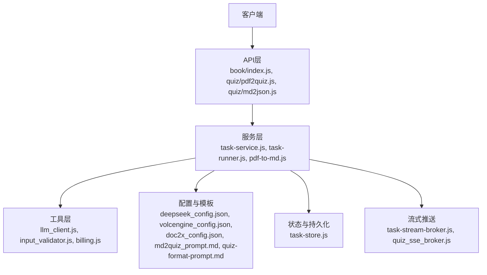
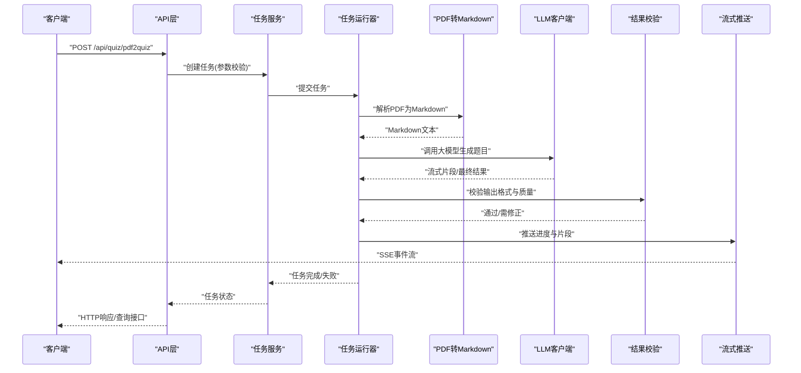
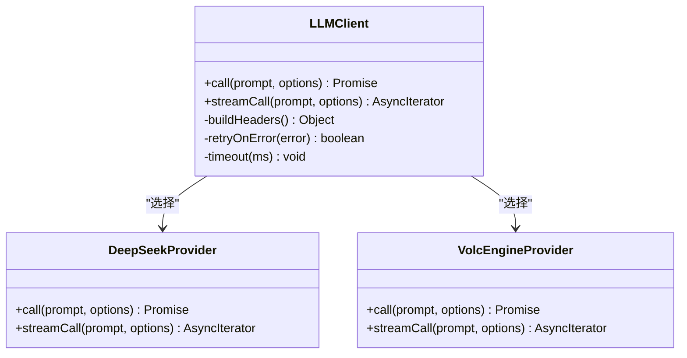
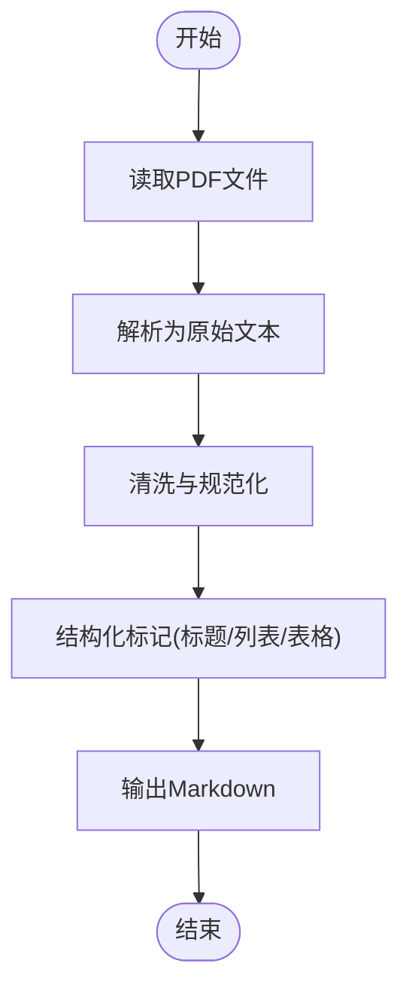
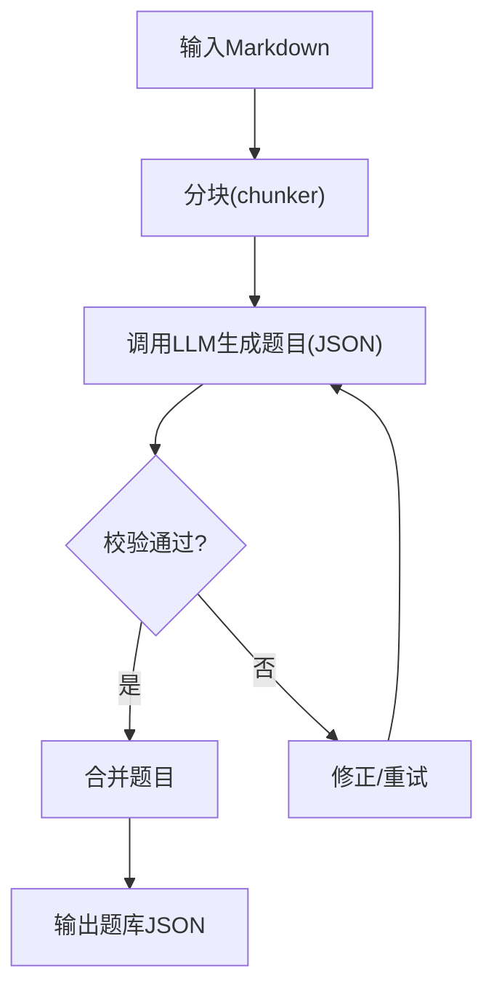
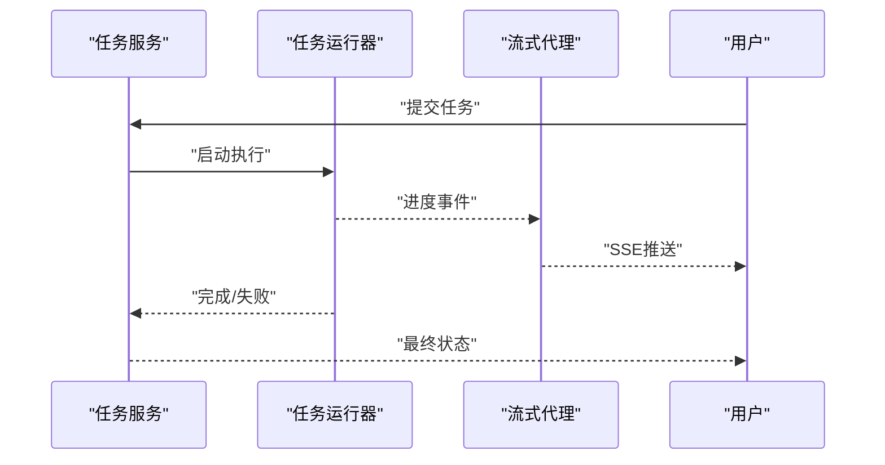
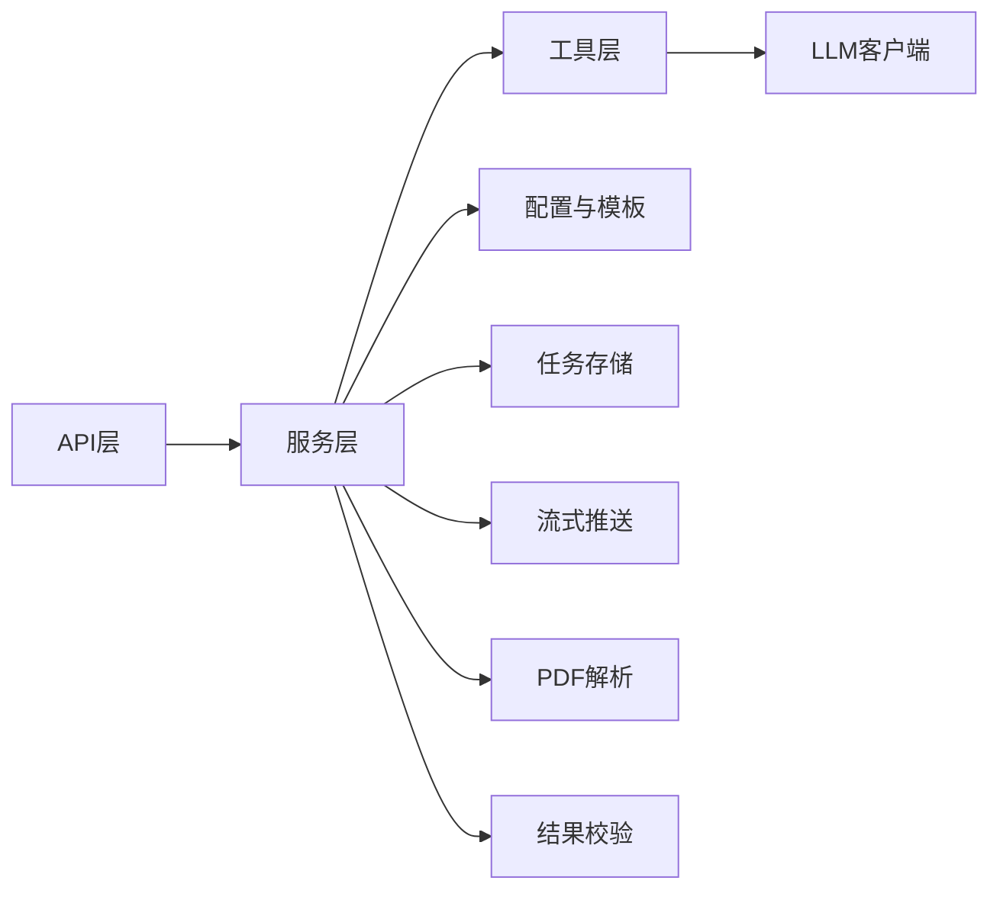

# AI服务集成

<cite>
**本文引用的文件**   
- [app.js](file://node-jinmao/app.js)
- [package.json](file://node-jinmao/package.json)
- [deepseek_config.json](file://node-jinmao/config/deepseek_config.json)
- [volcengine_config.json](file://node-jinmao/config/volcengine_config.json)
- [doc2x_config.json](file://node-jinmao/config/doc2x_config.json)
- [md2quiz_prompt.md](file://node-jinmao/config/md2quiz_prompt.md)
- [quiz-format-prompt.md](file://node-jinmao/config/quiz-format-prompt.md)
- [quiz-split-prompt.md](file://node-jinmao/config/quiz-split-prompt.md)
- [elaboration_prompt_first.txt](file://node-jinmao/config/elaboration_prompt_first.txt)
- [title_prompt.txt](file://node-jinmao/config/title_prompt.txt)
- [llm_client.js](file://node-jinmao/utils/llm_client.js)
- [pdf-to-md.js](file://node-jinmao/service/md2quiz/pdf-to-md.js)
- [chunker.js](file://node-jinmao/service/md2quiz/chunker.js)
- [task-runner.js](file://node-jinmao/service/md2quiz/task-runner.js)
- [task-service.js](file://node-jinmao/service/md2quiz/task-service.js)
- [task-store.js](file://node-jinmao/service/md2quiz/task-store.js)
- [task-stream-broker.js](file://node-jinmao/service/md2quiz/task-stream-broker.js)
- [result-validator.js](file://node-jinmao/service/md2quiz/result-validator.js)
- [quiz-chunk-processor.js](file://node-jinmao/service/md2quiz/quiz-chunk-processor.js)
- [quiz_splitter.js](file://node-jinmao/service/md2quiz/quiz-splitter.js)
- [types.js](file://node-jinmao/service/md2quiz/types.js)
- [API/book/index.js](file://node-jinmao/API/book/index.js)
- [API/quiz/pdf2quiz.js](file://node-jinmao/API/quiz/pdf2quiz.js)
- [API/quiz/md2json.js](file://node-jinmao/API/quiz/md2json.js)
- [service/quiz_sse_broker.js](file://node-jinmao/service/quiz_sse_broker.js)
- [utils/input_validator.js](file://node-jinmao/utils/input_validator.js)
- [utils/billing.js](file://node-jinmao/utils/billing.js)
- [config/prompt.json](file://node-jinmao/config/prompt.json)
</cite>

## 目录
1. [简介](#简介)
2. [项目结构](#项目结构)
3. [核心组件](#核心组件)
4. [架构总览](#架构总览)
5. [详细组件分析](#详细组件分析)
6. [依赖关系分析](#依赖关系分析)
7. [性能考虑](#性能考虑)
8. [故障排查指南](#故障排查指南)
9. [结论](#结论)
10. [附录](#附录)

## 简介
本文件面向“金毛教你学重构版”的AI服务集成，系统性说明大语言模型API（如DeepSeek）与语音合成（如豆包TTS）的配置与使用方式；完整阐述Markdown到题目的转换流程、PDF文档解析、AI内容生成、结果验证与质量控制；并给出流式响应处理机制、错误重试策略、超时控制与并发控制方案。同时提供提示词工程最佳实践、Prompt模板设计与管理方法、输出格式标准化规范，以及扩展新AI服务提供商与自定义内容生成流程的实践指南。

## 项目结构
后端基于Node.js，采用分层组织：API层暴露REST接口，Service层编排业务逻辑，Utils提供通用能力（LLM客户端、输入校验、计费），Config集中管理各服务配置与Prompt模板。md2quiz子模块负责“Markdown→题目JSON”的全链路处理，包含分块、任务调度、流式推送、结果校验等。

图表来源
- [API/book/index.js](file://node-jinmao/API/book/index.js)
- [API/quiz/pdf2quiz.js](file://node-jinmao/API/quiz/pdf2quiz.js)
- [API/quiz/md2json.js](file://node-jinmao/API/quiz/md2json.js)
- [service/md2quiz/task-service.js](file://node-jinmao/service/md2quiz/task-service.js)
- [service/md2quiz/task-runner.js](file://node-jinmao/service/md2quiz/task-runner.js)
- [service/md2quiz/pdf-to-md.js](file://node-jinmao/service/md2quiz/pdf-to-md.js)
- [utils/llm_client.js](file://node-jinmao/utils/llm_client.js)
- [utils/input_validator.js](file://node-jinmao/utils/input_validator.js)
- [utils/billing.js](file://node-jinmao/utils/billing.js)
- [config/deepseek_config.json](file://node-jinmao/config/deepseek_config.json)
- [config/volcengine_config.json](file://node-jinmao/config/volcengine_config.json)
- [config/doc2x_config.json](file://node-jinmao/config/doc2x_config.json)
- [config/md2quiz_prompt.md](file://node-jinmao/config/md2quiz_prompt.md)
- [config/quiz-format-prompt.md](file://node-jinmao/config/quiz-format-prompt.md)
- [service/md2quiz/task-store.js](file://node-jinmao/service/md2quiz/task-store.js)
- [service/md2quiz/task-stream-broker.js](file://node-jinmao/service/md2quiz/task-stream-broker.js)
- [service/quiz_sse_broker.js](file://node-jinmao/service/quiz_sse_broker.js)

章节来源
- [app.js](file://node-jinmao/app.js)
- [package.json](file://node-jinmao/package.json)

## 核心组件
- LLM客户端封装：统一调用不同大模型提供商，支持请求参数组装、鉴权、超时与重试。
- PDF转Markdown：将PDF解析为结构化文本，供后续AI处理。
- 分块器与处理器：对长文本进行合理切分，按块并行或串行调用AI生成题目片段。
- 任务编排：创建任务、调度执行、进度跟踪、失败重试、完成聚合。
- 流式推送：通过SSE向客户端实时推送生成进度与中间结果。
- 结果校验：对AI输出进行格式与质量校验，必要时触发修正流程。
- 配置与模板：集中管理各服务配置与Prompt模板，便于版本化管理与动态加载。

章节来源
- [utils/llm_client.js](file://node-jinmao/utils/llm_client.js)
- [service/md2quiz/pdf-to-md.js](file://node-jinmao/service/md2quiz/pdf-to-md.js)
- [service/md2quiz/chunker.js](file://node-jinmao/service/md2quiz/chunker.js)
- [service/md2quiz/quiz-chunk-processor.js](file://node-jinmao/service/md2quiz/quiz-chunk-processor.js)
- [service/md2quiz/task-runner.js](file://node-jinmao/service/md2quiz/task-runner.js)
- [service/md2quiz/task-service.js](file://node-jinmao/service/md2quiz/task-service.js)
- [service/md2quiz/task-store.js](file://node-jinmao/service/md2quiz/task-store.js)
- [service/md2quiz/task-stream-broker.js](file://node-jinmao/service/md2quiz/task-stream-broker.js)
- [service/md2quiz/result-validator.js](file://node-jinmao/service/md2quiz/result-validator.js)
- [config/deepseek_config.json](file://node-jinmao/config/deepseek_config.json)
- [config/volcengine_config.json](file://node-jinmao/config/volcengine_config.json)
- [config/doc2x_config.json](file://node-jinmao/config/doc2x_config.json)
- [config/md2quiz_prompt.md](file://node-jinmao/config/md2quiz_prompt.md)
- [config/quiz-format-prompt.md](file://node-jinmao/config/quiz-format-prompt.md)

## 架构总览
整体数据流从API入口进入，经服务层编排后调用LLM客户端与外部服务（PDF解析、TTS等），并通过流式通道返回增量结果。任务状态在存储中维护，校验器保障输出质量。

图表来源
- [API/quiz/pdf2quiz.js](file://node-jinmao/API/quiz/pdf2quiz.js)
- [service/md2quiz/task-service.js](file://node-jinmao/service/md2quiz/task-service.js)
- [service/md2quiz/task-runner.js](file://node-jinmao/service/md2quiz/task-runner.js)
- [service/md2quiz/pdf-to-md.js](file://node-jinmao/service/md2quiz/pdf-to-md.js)
- [utils/llm_client.js](file://node-jinmao/utils/llm_client.js)
- [service/md2quiz/result-validator.js](file://node-jinmao/service/md2quiz/result-validator.js)
- [service/md2quiz/task-stream-broker.js](file://node-jinmao/service/md2quiz/task-stream-broker.js)

## 详细组件分析

### LLM客户端与多提供商集成
- 职责：统一封装不同大模型API调用，包括鉴权、请求体构造、超时、重试、流式读取。
- 关键能力：
  - 根据配置选择提供商（如DeepSeek、VolcEngine）。
  - 支持流式响应，逐块回传token或片段。
  - 错误分类与重试策略（网络错误、限流、超时）。
- 配置项：基础URL、密钥、模型名、超时时间、最大重试次数、并发限制等。

图表来源
- [utils/llm_client.js](file://node-jinmao/utils/llm_client.js)
- [config/deepseek_config.json](file://node-jinmao/config/deepseek_config.json)
- [config/volcengine_config.json](file://node-jinmao/config/volcengine_config.json)

章节来源
- [utils/llm_client.js](file://node-jinmao/utils/llm_client.js)
- [config/deepseek_config.json](file://node-jinmao/config/deepseek_config.json)
- [config/volcengine_config.json](file://node-jinmao/config/volcengine_config.json)

### PDF到Markdown解析
- 职责：将PDF文档转换为结构化Markdown，保留标题、段落、列表等语义。
- 关键点：
  - 使用本地或远程解析库，处理图片与表格。
  - 清理噪声与冗余空白，保证后续分块质量。
  - 异常捕获与降级策略（如部分页面失败时跳过并重试）。

图表来源
- [service/md2quiz/pdf-to-md.js](file://node-jinmao/service/md2quiz/pdf-to-md.js)

章节来源
- [service/md2quiz/pdf-to-md.js](file://node-jinmao/service/md2quiz/pdf-to-md.js)

### Markdown到题目转换流程
- 职责：将Markdown内容切分为可处理的片段，调用AI生成题目JSON，并进行格式与质量校验。
- 关键步骤：
  - 分块：按语义边界切分，避免跨题切割。
  - 生成：使用Prompt模板驱动AI输出标准化JSON。
  - 校验：检查字段完整性、类型正确性、答案一致性。
  - 合并：将多个片段的题目合并为完整题库。

图表来源
- [service/md2quiz/chunker.js](file://node-jinmao/service/md2quiz/chunker.js)
- [service/md2quiz/quiz-chunk-processor.js](file://node-jinmao/service/md2quiz/quiz-chunk-processor.js)
- [service/md2quiz/result-validator.js](file://node-jinmao/service/md2quiz/result-validator.js)
- [config/md2quiz_prompt.md](file://node-jinmao/config/md2quiz_prompt.md)
- [config/quiz-format-prompt.md](file://node-jinmao/config/quiz-format-prompt.md)

章节来源
- [service/md2quiz/chunker.js](file://node-jinmao/service/md2quiz/chunker.js)
- [service/md2quiz/quiz-chunk-processor.js](file://node-jinmao/service/md2quiz/quiz-chunk-processor.js)
- [service/md2quiz/result-validator.js](file://node-jinmao/service/md2quiz/result-validator.js)
- [config/md2quiz_prompt.md](file://node-jinmao/config/md2quiz_prompt.md)
- [config/quiz-format-prompt.md](file://node-jinmao/config/quiz-format-prompt.md)

### 任务编排与流式推送
- 职责：创建任务、调度执行、跟踪进度、失败重试、通过SSE推送增量结果。
- 关键点：
  - 任务状态机：待处理、进行中、已完成、失败。
  - 流式推送：按块或按token推送，前端实时更新。
  - 错误重试：指数退避、最大重试次数、熔断保护。

图表来源
- [service/md2quiz/task-service.js](file://node-jinmao/service/md2quiz/task-service.js)
- [service/md2quiz/task-runner.js](file://node-jinmao/service/md2quiz/task-runner.js)
- [service/md2quiz/task-stream-broker.js](file://node-jinmao/service/md2quiz/task-stream-broker.js)
- [service/quiz_sse_broker.js](file://node-jinmao/service/quiz_sse_broker.js)

章节来源
- [service/md2quiz/task-service.js](file://node-jinmao/service/md2quiz/task-service.js)
- [service/md2quiz/task-runner.js](file://node-jinmao/service/md2quiz/task-runner.js)
- [service/md2quiz/task-stream-broker.js](file://node-jinmao/service/md2quiz/task-stream-broker.js)
- [service/quiz_sse_broker.js](file://node-jinmao/service/quiz_sse_broker.js)

### 结果校验与质量控制
- 职责：确保AI输出的JSON符合预定义Schema，关键字段非空，答案与题干一致。
- 策略：
  - Schema校验：字段类型、必填项、枚举值。
  - 语义校验：答案合理性、选项互斥性。
  - 自动修正：对轻微错误进行修复，严重错误触发重试。

章节来源
- [service/md2quiz/result-validator.js](file://node-jinmao/service/md2quiz/result-validator.js)
- [service/md2quiz/types.js](file://node-jinmao/service/md2quiz/types.js)

### Prompt模板设计与配置管理
- 模板文件：
  - md2quiz_prompt.md：主生成模板，定义角色、任务、输出格式。
  - quiz-format-prompt.md：格式化约束，确保JSON结构稳定。
  - quiz-split-prompt.md：分块策略指导，避免跨题切割。
  - elaboration_prompt_first.txt、title_prompt.txt：辅助生成（详解、标题）。
- 配置管理：
  - deepseek_config.json：模型参数、密钥、超时、重试。
  - volcengine_config.json：语音合成相关配置。
  - doc2x_config.json：文档解析服务配置。
  - prompt.json：全局Prompt变量与默认值。

章节来源
- [config/md2quiz_prompt.md](file://node-jinmao/config/md2quiz_prompt.md)
- [config/quiz-format-prompt.md](file://node-jinmao/config/quiz-format-prompt.md)
- [config/quiz-split-prompt.md](file://node-jinmao/config/quiz-split-prompt.md)
- [config/elaboration_prompt_first.txt](file://node-jinmao/config/elaboration_prompt_first.txt)
- [config/title_prompt.txt](file://node-jinmao/config/title_prompt.txt)
- [config/deepseek_config.json](file://node-jinmao/config/deepseek_config.json)
- [config/volcengine_config.json](file://node-jinmao/config/volcengine_config.json)
- [config/doc2x_config.json](file://node-jinmao/config/doc2x_config.json)
- [config/prompt.json](file://node-jinmao/config/prompt.json)

## 依赖关系分析
- API层依赖服务层：路由控制器调用任务服务与业务服务。
- 服务层依赖工具层：LLM客户端、输入校验、计费统计。
- 配置与模板被多处引用：LLM客户端、任务运行器、校验器。
- 流式推送独立于业务逻辑：通过代理解耦任务执行与前端通信。

图表来源
- [API/book/index.js](file://node-jinmao/API/book/index.js)
- [API/quiz/pdf2quiz.js](file://node-jinmao/API/quiz/pdf2quiz.js)
- [API/quiz/md2json.js](file://node-jinmao/API/quiz/md2json.js)
- [service/md2quiz/task-service.js](file://node-jinmao/service/md2quiz/task-service.js)
- [utils/llm_client.js](file://node-jinmao/utils/llm_client.js)
- [service/md2quiz/pdf-to-md.js](file://node-jinmao/service/md2quiz/pdf-to-md.js)
- [service/md2quiz/result-validator.js](file://node-jinmao/service/md2quiz/result-validator.js)
- [service/md2quiz/task-store.js](file://node-jinmao/service/md2quiz/task-store.js)
- [service/md2quiz/task-stream-broker.js](file://node-jinmao/service/md2quiz/task-stream-broker.js)

章节来源
- [API/book/index.js](file://node-jinmao/API/book/index.js)
- [API/quiz/pdf2quiz.js](file://node-jinmao/API/quiz/pdf2quiz.js)
- [API/quiz/md2json.js](file://node-jinmao/API/quiz/md2json.js)
- [service/md2quiz/task-service.js](file://node-jinmao/service/md2quiz/task-service.js)
- [utils/llm_client.js](file://node-jinmao/utils/llm_client.js)
- [service/md2quiz/pdf-to-md.js](file://node-jinmao/service/md2quiz/pdf-to-md.js)
- [service/md2quiz/result-validator.js](file://node-jinmao/service/md2quiz/result-validator.js)
- [service/md2quiz/task-store.js](file://node-jinmao/service/md2quiz/task-store.js)
- [service/md2quiz/task-stream-broker.js](file://node-jinmao/service/md2quiz/task-stream-broker.js)

## 性能考虑
- 并发控制：限制LLM调用并发数，避免限流与资源争用。
- 流式处理：减少首字节延迟，提升用户体验。
- 缓存策略：对重复Prompt或相似内容结果进行缓存。
- 批处理：合并小任务，降低API调用开销。
- 超时与重试：合理设置超时阈值，采用指数退避重试。

[本节为通用性能建议，不直接分析具体文件]

## 故障排查指南
- 常见问题：
  - API限流：检查速率限制配置，增加重试间隔。
  - 超时错误：调整超时阈值，优化Prompt长度。
  - 输出格式错误：强化校验规则，增加修正流程。
  - 流式中断：检查网络稳定性，实现断线重连。
- 调试手段：
  - 启用详细日志，记录请求与响应。
  - 使用沙箱环境测试Prompt与配置。
  - 监控任务队列长度与失败率。

章节来源
- [utils/input_validator.js](file://node-jinmao/utils/input_validator.js)
- [utils/billing.js](file://node-jinmao/utils/billing.js)
- [service/md2quiz/task-runner.js](file://node-jinmao/service/md2quiz/task-runner.js)
- [service/md2quiz/task-stream-broker.js](file://node-jinmao/service/md2quiz/task-stream-broker.js)

## 结论
本集成方案通过模块化设计实现了高内聚、低耦合的AI服务能力，支持多提供商接入、流式响应、严格的质量控制与可扩展的Prompt管理。在实际部署中，应重点关注并发控制、错误重试与超时配置，结合监控与日志快速定位问题。未来可进一步引入智能路由、动态Prompt优化与更细粒度的成本控制。

[本节为总结性内容，不直接分析具体文件]

## 附录
- 配置示例：参考deepseek_config.json、volcengine_config.json、doc2x_config.json中的键值结构与注释。
- Prompt模板：查看md2quiz_prompt.md、quiz-format-prompt.md等文件的结构与占位符。
- 扩展新提供商：在LLM客户端中添加新Provider类，实现call与streamCall方法，并在配置中注册。
- 自定义生成流程：在任务运行器中插入新的处理阶段，如图像识别、翻译、摘要等。

[本节为补充信息，不直接分析具体文件]