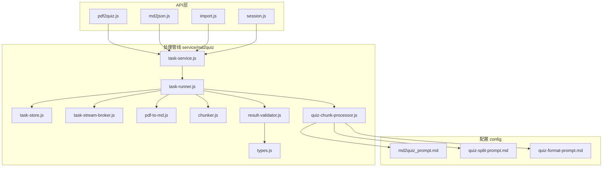
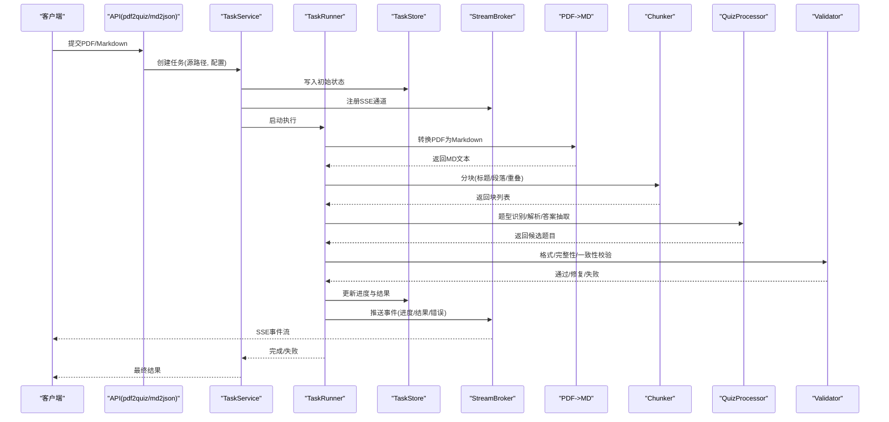
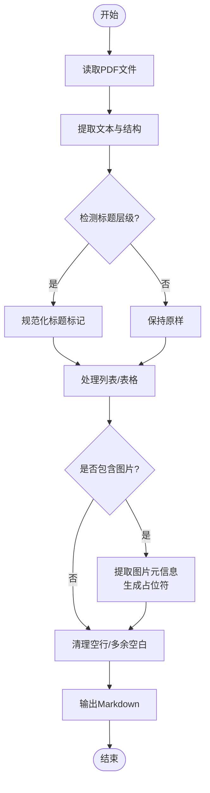
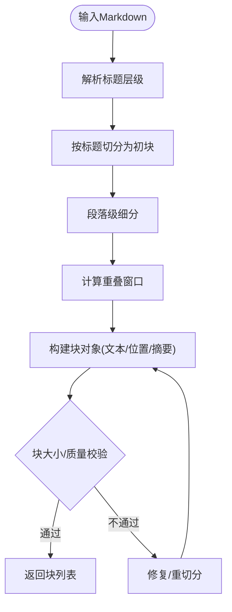
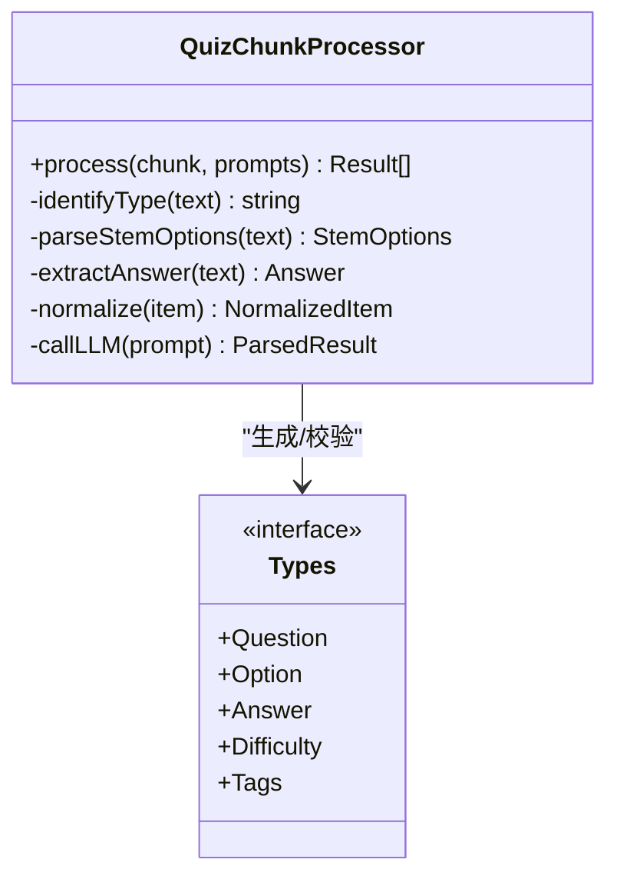
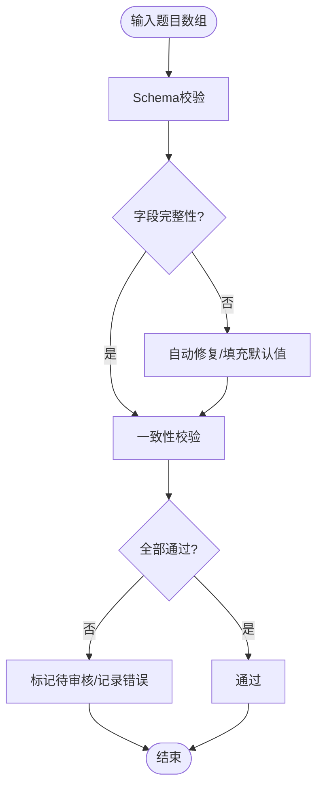
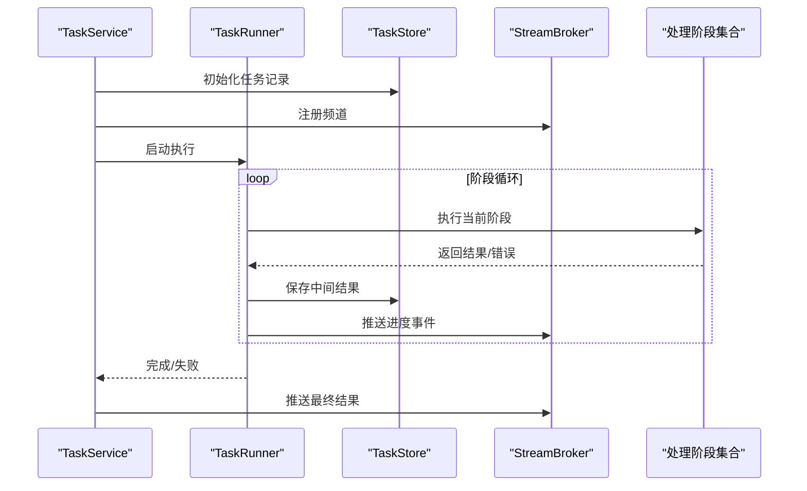
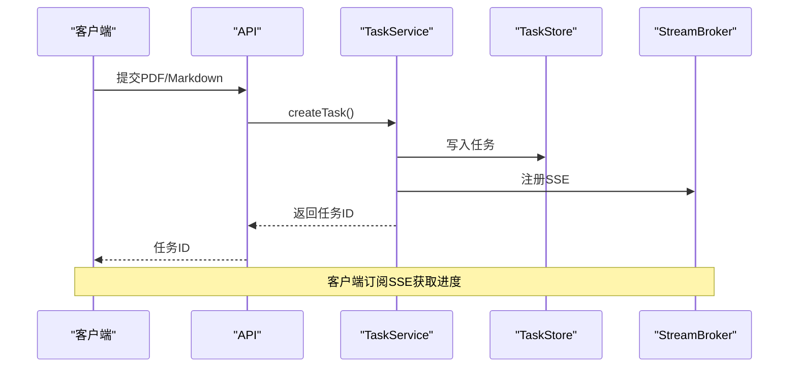
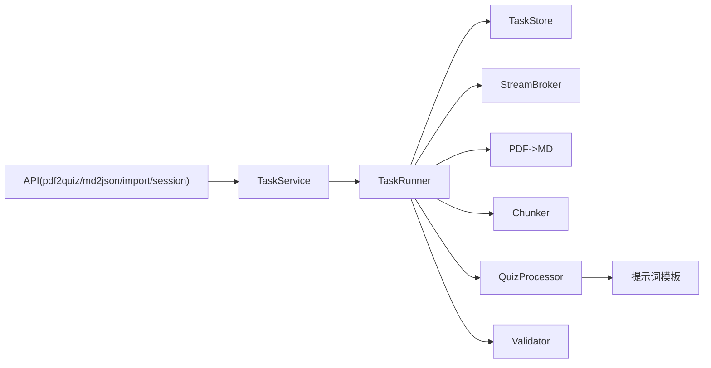

# Markdown题库生成流水线

<cite>
**本文引用的文件**   
- [chunker.js](file://node-jinmao/service/md2quiz/chunker.js)
- [pdf-to-md.js](file://node-jinmao/service/md2quiz/pdf-to-md.js)
- [quiz-chunk-processor.js](file://node-jinmao/service/md2quiz/quiz-chunk-processor.js)
- [result-validator.js](file://node-jinmao/service/md2quiz/result-validator.js)
- [task-runner.js](file://node-jinmao/service/md2quiz/task-runner.js)
- [task-service.js](file://node-jinmao/service/md2quiz/task-service.js)
- [task-store.js](file://node-jinmao/service/md2quiz/task-store.js)
- [task-stream-broker.js](file://node-jinmao/service/md2quiz/task-stream-broker.js)
- [types.js](file://node-jinmao/service/md2quiz/types.js)
- [md2json.js](file://node-jinmao/API/quiz/md2json.js)
- [pdf2quiz.js](file://node-jinmao/API/quiz/pdf2quiz.js)
- [import.js](file://node-jinmao/API/quiz/import.js)
- [session.js](file://node-jinmao/API/quiz/session.js)
- [md2quiz_prompt.md](file://node-jinmao/config/md2quiz_prompt.md)
- [quiz-split-prompt.md](file://node-jinmao/config/quiz-split-prompt.md)
- [quiz-format-prompt.md](file://node-jinmao/config/quiz-format-prompt.md)
</cite>

## 目录
1. [简介](#简介)
2. [项目结构](#项目结构)
3. [核心组件](#核心组件)
4. [架构总览](#架构总览)
5. [详细组件分析](#详细组件分析)
6. [依赖关系分析](#依赖关系分析)
7. [性能考虑](#性能考虑)
8. [故障排查指南](#故障排查指南)
9. [结论](#结论)
10. [附录](#附录)

## 简介
本文件面向“Markdown题库生成流水线”的完整处理流程，覆盖从Markdown/PDF文档到结构化题目的端到端链路。重点说明：
- 文档分块算法（chunker）：智能分割策略、上下文保持与边界处理
- PDF转Markdown：文本提取、格式保留、图片处理
- 题目分块处理器：题型识别、内容解析、答案提取
- 结果验证器：格式验证、完整性检查、一致性校验
- 配置示例与自定义规则方法
- 性能优化技巧
- 错误处理与回滚机制实现细节

## 项目结构
该流水线位于后端服务 node-jinmao 中，API层提供对外接口，service/md2quiz 模块实现核心处理逻辑，config 目录包含提示词与外部服务配置。

图表来源 
- [pdf2quiz.js:1-200](file://node-jinmao/API/quiz/pdf2quiz.js#L1-L200)
- [md2json.js:1-200](file://node-jinmao/API/quiz/md2json.js#L1-L200)
- [import.js:1-200](file://node-jinmao/API/quiz/import.js#L1-L200)
- [session.js:1-200](file://node-jinmao/API/quiz/session.js#L1-L200)
- [task-service.js:1-200](file://node-jinmao/service/md2quiz/task-service.js#L1-L200)
- [task-runner.js:1-200](file://node-jinmao/service/md2quiz/task-runner.js#L1-L200)
- [task-store.js:1-200](file://node-jinmao/service/md2quiz/task-store.js#L1-L200)
- [task-stream-broker.js:1-200](file://node-jinmao/service/md2quiz/task-stream-broker.js#L1-L200)
- [pdf-to-md.js:1-200](file://node-jinmao/service/md2quiz/pdf-to-md.js#L1-L200)
- [chunker.js:1-200](file://node-jinmao/service/md2quiz/chunker.js#L1-L200)
- [quiz-chunk-processor.js:1-200](file://node-jinmao/service/md2quiz/quiz-chunk-processor.js#L1-L200)
- [result-validator.js:1-200](file://node-jinmao/service/md2quiz/result-validator.js#L1-L200)
- [types.js:1-200](file://node-jinmao/service/md2quiz/types.js#L1-L200)
- [md2quiz_prompt.md:1-200](file://node-jinmao/config/md2quiz_prompt.md#L1-L200)
- [quiz-split-prompt.md:1-200](file://node-jinmao/config/quiz-split-prompt.md#L1-L200)
- [quiz-format-prompt.md:1-200](file://node-jinmao/config/quiz-format-prompt.md#L1-L200)

章节来源
- [pdf2quiz.js:1-200](file://node-jinmao/API/quiz/pdf2quiz.js#L1-L200)
- [md2json.js:1-200](file://node-jinmao/API/quiz/md2json.js#L1-L200)
- [import.js:1-200](file://node-jinmao/API/quiz/import.js#L1-L200)
- [session.js:1-200](file://node-jinmao/API/quiz/session.js#L1-L200)
- [task-service.js:1-200](file://node-jinmao/service/md2quiz/task-service.js#L1-L200)
- [task-runner.js:1-200](file://node-jinmao/service/md2quiz/task-runner.js#L1-L200)
- [task-store.js:1-200](file://node-jinmao/service/md2quiz/task-store.js#L1-L200)
- [task-stream-broker.js:1-200](file://node-jinmao/service/md2quiz/task-stream-broker.js#L1-L200)
- [pdf-to-md.js:1-200](file://node-jinmao/service/md2quiz/pdf-to-md.js#L1-L200)
- [chunker.js:1-200](file://node-jinmao/service/md2quiz/chunker.js#L1-L200)
- [quiz-chunk-processor.js:1-200](file://node-jinmao/service/md2quiz/quiz-chunk-processor.js#L1-L200)
- [result-validator.js:1-200](file://node-jinmao/service/md2quiz/result-validator.js#L1-L200)
- [types.js:1-200](file://node-jinmao/service/md2quiz/types.js#L1-L200)
- [md2quiz_prompt.md:1-200](file://node-jinmao/config/md2quiz_prompt.md#L1-L200)
- [quiz-split-prompt.md:1-200](file://node-jinmao/config/quiz-split-prompt.md#L1-L200)
- [quiz-format-prompt.md:1-200](file://node-jinmao/config/quiz-format-prompt.md#L1-L200)

## 核心组件
- API入口
  - pdf2quiz.js：接收PDF并启动题库生成任务
  - md2json.js：接收Markdown并启动题库生成任务
  - import.js：批量导入或合并题库
  - session.js：会话管理与进度查询
- 任务编排
  - task-service.js：任务生命周期管理（创建、调度、状态更新、回调）
  - task-runner.js：执行器，协调各阶段处理步骤
  - task-store.js：持久化任务元数据与中间结果
  - task-stream-broker.js：SSE流式推送进度与事件
- 处理阶段
  - pdf-to-md.js：PDF转Markdown（文本提取、表格/列表、图片占位）
  - chunker.js：文档分块（标题感知、段落语义、重叠上下文）
  - quiz-chunk-processor.js：题目分块处理器（题型识别、题干/选项/答案抽取）
  - result-validator.js：结果验证器（JSON Schema校验、字段完整性、一致性）
- 类型与提示词
  - types.js：统一数据结构定义
  - md2quiz_prompt.md / quiz-split-prompt.md / quiz-format-prompt.md：LLM提示词模板

章节来源
- [task-service.js:1-200](file://node-jinmao/service/md2quiz/task-service.js#L1-L200)
- [task-runner.js:1-200](file://node-jinmao/service/md2quiz/task-runner.js#L1-L200)
- [task-store.js:1-200](file://node-jinmao/service/md2quiz/task-store.js#L1-L200)
- [task-stream-broker.js:1-200](file://node-jinmao/service/md2quiz/task-stream-broker.js#L1-L200)
- [pdf-to-md.js:1-200](file://node-jinmao/service/md2quiz/pdf-to-md.js#L1-L200)
- [chunker.js:1-200](file://node-jinmao/service/md2quiz/chunker.js#L1-L200)
- [quiz-chunk-processor.js:1-200](file://node-jinmao/service/md2quiz/quiz-chunk-processor.js#L1-L200)
- [result-validator.js:1-200](file://node-jinmao/service/md2quiz/result-validator.js#L1-L200)
- [types.js:1-200](file://node-jinmao/service/md2quiz/types.js#L1-L200)
- [md2quiz_prompt.md:1-200](file://node-jinmao/config/md2quiz_prompt.md#L1-L200)
- [quiz-split-prompt.md:1-200](file://node-jinmao/config/quiz-split-prompt.md#L1-L200)
- [quiz-format-prompt.md:1-200](file://node-jinmao/config/quiz-format-prompt.md#L1-L200)

## 架构总览
整体采用“API层 + 任务编排 + 多阶段处理 + 流式反馈”的分层架构。API负责入参与鉴权，任务编排负责状态机推进，处理阶段按顺序执行，并通过SSE向客户端推送实时进度。

图表来源 
- [pdf2quiz.js:1-200](file://node-jinmao/API/quiz/pdf2quiz.js#L1-L200)
- [md2json.js:1-200](file://node-jinmao/API/quiz/md2json.js#L1-L200)
- [task-service.js:1-200](file://node-jinmao/service/md2quiz/task-service.js#L1-L200)
- [task-runner.js:1-200](file://node-jinmao/service/md2quiz/task-runner.js#L1-L200)
- [task-store.js:1-200](file://node-jinmao/service/md2quiz/task-store.js#L1-L200)
- [task-stream-broker.js:1-200](file://node-jinmao/service/md2quiz/task-stream-broker.js#L1-L200)
- [pdf-to-md.js:1-200](file://node-jinmao/service/md2quiz/pdf-to-md.js#L1-L200)
- [chunker.js:1-200](file://node-jinmao/service/md2quiz/chunker.js#L1-L200)
- [quiz-chunk-processor.js:1-200](file://node-jinmao/service/md2quiz/quiz-chunk-processor.js#L1-L200)
- [result-validator.js:1-200](file://node-jinmao/service/md2quiz/result-validator.js#L1-L200)

## 详细组件分析

### PDF转Markdown（pdf-to-md.js）
- 目标：将PDF转换为结构化Markdown，尽量保留标题层级、列表、表格与图片引用
- 关键能力：
  - 文本提取：逐页提取正文、标题、脚注
  - 格式保留：识别标题层级、有序/无序列表、表格行列对齐
  - 图片处理：提取图片元信息，插入占位标记与相对路径
  - 异常处理：扫描失败、页面乱码、OCR兜底（如启用）
- 输出：标准Markdown字符串，供后续分块使用

图表来源 
- [pdf-to-md.js:1-200](file://node-jinmao/service/md2quiz/pdf-to-md.js#L1-L200)

章节来源
- [pdf-to-md.js:1-200](file://node-jinmao/service/md2quiz/pdf-to-md.js#L1-L200)

### 文档分块算法（chunker.js）
- 目标：将长文档切分为适合LLM处理的块，同时保持上下文连贯性
- 策略：
  - 标题感知：以一级/二级标题作为主要切分点
  - 段落语义：在段落边界进行二次切分，避免截断句子
  - 重叠上下文：相邻块之间设置固定长度重叠，提升跨块语义连续性
  - 边界处理：处理页眉页脚、脚注、公式、代码块等噪声
- 输出：块数组，每个块包含文本、来源位置、上下文摘要

图表来源 
- [chunker.js:1-200](file://node-jinmao/service/md2quiz/chunker.js#L1-L200)

章节来源
- [chunker.js:1-200](file://node-jinmao/service/md2quiz/chunker.js#L1-L200)

### 题目分块处理器（quiz-chunk-processor.js）
- 目标：对每个文档块进行题型识别、题干/选项/答案抽取，并标准化为统一结构
- 关键能力：
  - 题型识别：单选、多选、判断、填空、简答等
  - 内容解析：题干、选项、答案、解析、难度、标签
  - 答案提取：从文本或提示词约束中抽取标准答案
  - LLM调用：基于提示词模板生成结构化题目
- 输出：题目数组，符合types.js定义的结构

图表来源 
- [quiz-chunk-processor.js:1-200](file://node-jinmao/service/md2quiz/quiz-chunk-processor.js#L1-L200)
- [types.js:1-200](file://node-jinmao/service/md2quiz/types.js#L1-L200)

章节来源
- [quiz-chunk-processor.js:1-200](file://node-jinmao/service/md2quiz/quiz-chunk-processor.js#L1-L200)
- [types.js:1-200](file://node-jinmao/service/md2quiz/types.js#L1-L200)

### 结果验证器（result-validator.js）
- 目标：确保生成的题目JSON满足格式、完整性与一致性要求
- 检查项：
  - 格式验证：字段类型、必填项、枚举值
  - 完整性检查：题干非空、选项数量合理、答案存在且合法
  - 一致性校验：答案与选项对应、难度与题型匹配、标签规范
- 行为：通过则放行；失败则尝试修复或标记为待人工审核

图表来源 
- [result-validator.js:1-200](file://node-jinmao/service/md2quiz/result-validator.js#L1-L200)
- [types.js:1-200](file://node-jinmao/service/md2quiz/types.js#L1-L200)

章节来源
- [result-validator.js:1-200](file://node-jinmao/service/md2quiz/result-validator.js#L1-L200)
- [types.js:1-200](file://node-jinmao/service/md2quiz/types.js#L1-L200)

### 任务编排与流式反馈（task-service.js / task-runner.js / task-store.js / task-stream-broker.js）
- TaskService：任务创建、状态机推进、错误恢复、回调通知
- TaskRunner：串行/并行执行各阶段，支持重试与超时控制
- TaskStore：持久化任务元数据、中间产物、进度快照
- StreamBroker：SSE事件广播，支持客户端订阅进度与结果

图表来源 
- [task-service.js:1-200](file://node-jinmao/service/md2quiz/task-service.js#L1-L200)
- [task-runner.js:1-200](file://node-jinmao/service/md2quiz/task-runner.js#L1-L200)
- [task-store.js:1-200](file://node-jinmao/service/md2quiz/task-store.js#L1-L200)
- [task-stream-broker.js:1-200](file://node-jinmao/service/md2quiz/task-stream-broker.js#L1-L200)

章节来源
- [task-service.js:1-200](file://node-jinmao/service/md2quiz/task-service.js#L1-L200)
- [task-runner.js:1-200](file://node-jinmao/service/md2quiz/task-runner.js#L1-L200)
- [task-store.js:1-200](file://node-jinmao/service/md2quiz/task-store.js#L1-L200)
- [task-stream-broker.js:1-200](file://node-jinmao/service/md2quiz/task-stream-broker.js#L1-L200)

### API入口（pdf2quiz.js / md2json.js / import.js / session.js）
- pdf2json.md2json：接收输入源，创建任务并返回任务ID
- import：批量导入，合并已有题库，去重与冲突解决
- session：查询任务状态、进度、下载结果

图表来源 
- [pdf2quiz.js:1-200](file://node-jinmao/API/quiz/pdf2quiz.js#L1-L200)
- [md2json.js:1-200](file://node-jinmao/API/quiz/md2json.js#L1-L200)
- [import.js:1-200](file://node-jinmao/API/quiz/import.js#L1-L200)
- [session.js:1-200](file://node-jinmao/API/quiz/session.js#L1-L200)

章节来源
- [pdf2quiz.js:1-200](file://node-jinmao/API/quiz/pdf2quiz.js#L1-L200)
- [md2json.js:1-200](file://node-jinmao/API/quiz/md2json.js#L1-L200)
- [import.js:1-200](file://node-jinmao/API/quiz/import.js#L1-L200)
- [session.js:1-200](file://node-jinmao/API/quiz/session.js#L1-L200)

## 依赖关系分析
- 模块内聚与耦合
  - task-service 与 task-runner 强耦合（状态机与执行器）
  - task-store 被 runner 与 broker 共享（读写中间结果）
  - 处理阶段（pdf-to-md、chunker、quiz-processor、validator）由 runner 串联
- 外部依赖
  - LLM提示词模板（config/*.md）驱动题目生成与格式化
  - 文件系统用于临时存储PDF/MD与中间产物
- 潜在循环依赖
  - 无直接循环，但需注意 runner 与 store 的异步交互时序

图表来源 
- [task-service.js:1-200](file://node-jinmao/service/md2quiz/task-service.js#L1-L200)
- [task-runner.js:1-200](file://node-jinmao/service/md2quiz/task-runner.js#L1-L200)
- [task-store.js:1-200](file://node-jinmao/service/md2quiz/task-store.js#L1-L200)
- [task-stream-broker.js:1-200](file://node-jinmao/service/md2quiz/task-stream-broker.js#L1-L200)
- [pdf-to-md.js:1-200](file://node-jinmao/service/md2quiz/pdf-to-md.js#L1-L200)
- [chunker.js:1-200](file://node-jinmao/service/md2quiz/chunker.js#L1-L200)
- [quiz-chunk-processor.js:1-200](file://node-jinmao/service/md2quiz/quiz-chunk-processor.js#L1-L200)
- [result-validator.js:1-200](file://node-jinmao/service/md2quiz/result-validator.js#L1-L200)
- [md2quiz_prompt.md:1-200](file://node-jinmao/config/md2quiz_prompt.md#L1-L200)
- [quiz-split-prompt.md:1-200](file://node-jinmao/config/quiz-split-prompt.md#L1-L200)
- [quiz-format-prompt.md:1-200](file://node-jinmao/config/quiz-format-prompt.md#L1-L200)

章节来源
- [task-service.js:1-200](file://node-jinmao/service/md2quiz/task-service.js#L1-L200)
- [task-runner.js:1-200](file://node-jinmao/service/md2quiz/task-runner.js#L1-L200)
- [task-store.js:1-200](file://node-jinmao/service/md2quiz/task-store.js#L1-L200)
- [task-stream-broker.js:1-200](file://node-jinmao/service/md2quiz/task-stream-broker.js#L1-L200)
- [pdf-to-md.js:1-200](file://node-jinmao/service/md2quiz/pdf-to-md.js#L1-L200)
- [chunker.js:1-200](file://node-jinmao/service/md2quiz/chunker.js#L1-L200)
- [quiz-chunk-processor.js:1-200](file://node-jinmao/service/md2quiz/quiz-chunk-processor.js#L1-L200)
- [result-validator.js:1-200](file://node-jinmao/service/md2quiz/result-validator.js#L1-L200)
- [md2quiz_prompt.md:1-200](file://node-jinmao/config/md2quiz_prompt.md#L1-L200)
- [quiz-split-prompt.md:1-200](file://node-jinmao/config/quiz-split-prompt.md#L1-L200)
- [quiz-format-prompt.md:1-200](file://node-jinmao/config/quiz-format-prompt.md#L1-L200)

## 性能考虑
- 分块策略优化
  - 动态块大小：根据文档密度与LLM上下文限制自适应调整
  - 重叠窗口调优：平衡连续性与内存占用
- 并发与批处理
  - 并行处理多个块（注意LLM限流与配额）
  - 批量化写入store，减少I/O次数
- I/O与缓存
  - 中间产物落盘策略与清理
  - 热点块缓存（相同片段复用）
- LLM调用优化
  - 提示词精简与结构化输出
  - 重试与退避策略
- 流式反馈
  - 增量推送进度，降低前端等待压力

[本节为通用指导，无需特定文件来源]

## 故障排查指南
- 常见问题
  - PDF解析失败：检查文件损坏、加密、字体缺失
  - 分块异常：确认标题层级与段落边界，调整重叠参数
  - 题目生成失败：核对提示词模板与LLM响应格式
  - 校验失败：定位缺失字段与不一致项，查看错误日志
- 诊断手段
  - 查看任务状态与中间产物（task-store）
  - 订阅SSE事件，定位失败阶段
  - 打印提示词与模型响应，对比期望结构
- 回滚与恢复
  - 失败阶段重试（指数退避）
  - 部分成功时保留有效结果，仅重跑失败块
  - 任务中断后从最近快照恢复

章节来源
- [task-runner.js:1-200](file://node-jinmao/service/md2quiz/task-runner.js#L1-L200)
- [task-store.js:1-200](file://node-jinmao/service/md2quiz/task-store.js#L1-L200)
- [task-stream-broker.js:1-200](file://node-jinmao/service/md2quiz/task-stream-broker.js#L1-L200)
- [result-validator.js:1-200](file://node-jinmao/service/md2quiz/result-validator.js#L1-L200)

## 结论
本流水线通过清晰的阶段划分与稳健的任务编排，实现了从PDF/Markdown到结构化题目的自动化生成。借助智能分块、LLM驱动的题型解析与严格的结果校验，保证了输出的质量与一致性。配合流式反馈与完善的错误处理机制，提供了良好的用户体验与可维护性。

[本节为总结，无需特定文件来源]

## 附录

### 配置示例与自定义规则
- 提示词模板
  - md2quiz_prompt.md：总体生成指令与输出格式
  - quiz-split-prompt.md：分块与题型识别指令
  - quiz-format-prompt.md：格式化与标准化指令
- 自定义方法
  - 修改分块策略：调整chunker的重叠窗口与边界规则
  - 扩展题型：在quiz-chunk-processor中添加新题型识别与解析逻辑
  - 增强校验：在result-validator中增加业务相关的一致性规则

章节来源
- [md2quiz_prompt.md:1-200](file://node-jinmao/config/md2quiz_prompt.md#L1-L200)
- [quiz-split-prompt.md:1-200](file://node-jinmao/config/quiz-split-prompt.md#L1-L200)
- [quiz-format-prompt.md:1-200](file://node-jinmao/config/quiz-format-prompt.md#L1-L200)
- [chunker.js:1-200](file://node-jinmao/service/md2quiz/chunker.js#L1-L200)
- [quiz-chunk-processor.js:1-200](file://node-jinmao/service/md2quiz/quiz-chunk-processor.js#L1-L200)
- [result-validator.js:1-200](file://node-jinmao/service/md2quiz/result-validator.js#L1-L200)

### 错误处理与回滚机制
- 任务状态机：运行中、成功、失败、重试中、已取消
- 重试策略：按阶段粒度重试，支持最大重试次数与退避
- 快照恢复：每阶段完成后写入快照，失败可从最近快照恢复
- 资源清理：失败时清理临时文件与中间产物，避免磁盘泄漏

章节来源
- [task-service.js:1-200](file://node-jinmao/service/md2quiz/task-service.js#L1-L200)
- [task-runner.js:1-200](file://node-jinmao/service/md2quiz/task-runner.js#L1-L200)
- [task-store.js:1-200](file://node-jinmao/service/md2quiz/task-store.js#L1-L200)