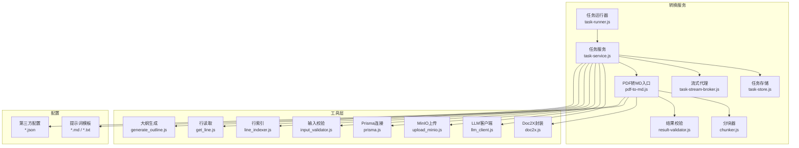
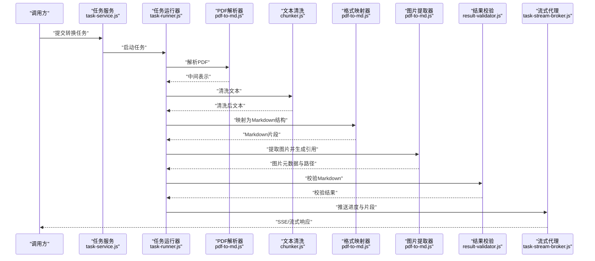
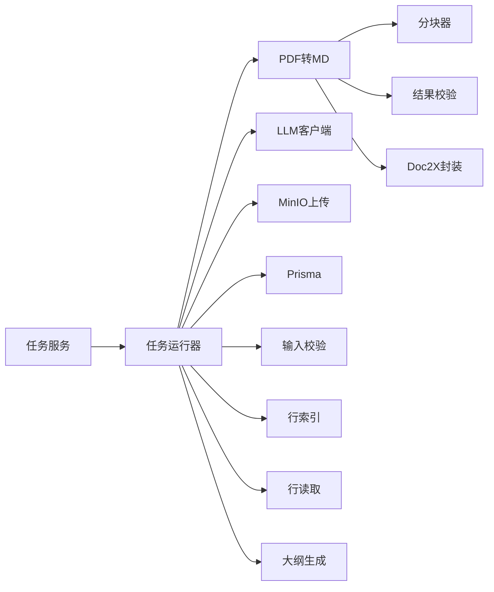

# PDF转Markdown转换器

<cite>
**本文档引用的文件**   
- [pdf-to-md.js](file://node-jinmao/service/md2quiz/pdf-to-md.js)
- [chunker.js](file://node-jinmao/service/md2quiz/chunker.js)
- [task-runner.js](file://node-jinmao/service/md2quiz/task-runner.js)
- [task-service.js](file://node-jinmao/service/md2quiz/task-service.js)
- [task-store.js](file://node-jinmao/service/md2quiz/task-store.js)
- [task-stream-broker.js](file://node-jinmao/service/md2quiz/task-stream-broker.js)
- [result-validator.js](file://node-jinmao/service/md2quiz/result-validator.js)
- [types.js](file://node-jinmao/service/md2quiz/types.js)
- [doc2x.js](file://node-jinmao/utils/doc2x.js)
- [upload_minio.js](file://node-jinmao/utils/upload_minio.js)
- [prisma.js](file://node-jinmao/utils/prisma.js)
- [llm_client.js](file://node-jinmao/utils/llm_client.js)
- [input_validator.js](file://node-jinmao/utils/input_validator.js)
- [generate_outline.js](file://node-jinmao/utils/generate_outline.js)
- [line_indexer.js](file://node-jinmao/utils/line_indexer.js)
- [get_line.js](file://node-jinmao/utils/get_line.js)
- [prompt.json](file://node-jinmao/config/prompt.json)
- [md2quiz_prompt.md](file://node-jinmao/config/md2quiz_prompt.md)
- [quiz-format-prompt.md](file://node-jinmao/config/quiz-format-prompt.md)
- [quiz-split-prompt.md](file://node-jinmao/config/quiz-split-prompt.md)
- [title_prompt.txt](file://node-jinmao/config/title_prompt.txt)
- [elaboration_prompt_first.txt](file://node-jinmao/config/elaboration_prompt_first.txt)
- [deepseek_config.json](file://node-jinmao/config/deepseek_config.json)
- [grsai_config.json](file://node-jinmao/config/grsai_config.json)
- [volcengine_config.json](file://node-jinmao/config/volcengine_config.json)
- [minio_config.json](file://node-jinmao/config/minio_config.json)
- [doc2x_config.json](file://node-jinmao/config/doc2x_config.json)
</cite>

## 目录
1. [简介](#简介)
2. [项目结构](#项目结构)
3. [核心组件](#核心组件)
4. [架构总览](#架构总览)
5. [详细组件分析](#详细组件分析)
6. [依赖关系分析](#依赖关系分析)
7. [性能考量](#性能考量)
8. [故障排查指南](#故障排查指南)
9. [结论](#结论)
10. [附录](#附录)

## 简介
本文件面向PDF到Markdown的转换子系统，系统化说明从PDF解析、文本清洗、格式映射到图片提取与结构化输出的完整流程。文档覆盖以下关键主题：
- 文本提取算法与格式保留策略
- 图片处理机制（含扫描件场景）
- 核心组件：PDF解析器、文本清洗模块、格式映射器、图片提取器
- 支持的PDF特性：表格识别、列表结构、标题层级、特殊字符处理
- 配置项：语言支持、编码处理、质量阈值等
- 使用示例：复杂PDF（扫描件、多栏布局、混合内容）的处理方法
- 错误处理与异常恢复
- 转换质量评估标准

## 项目结构
该转换能力位于后端服务中，围绕任务编排、流式输出、结果校验与外部服务集成展开。关键目录与职责如下：
- service/md2quiz：转换主流程、任务调度、分块、校验与类型定义
- utils：通用工具（LLM客户端、MinIO上传、Prisma数据库、行索引、大纲生成等）
- config：提示词模板与第三方服务配置（DeepSeek、火山引擎、Doc2X、MinIO等）

图表来源
- [task-runner.js](file://node-jinmao/service/md2quiz/task-runner.js)
- [task-service.js](file://node-jinmao/service/md2quiz/task-service.js)
- [task-store.js](file://node-jinmao/service/md2quiz/task-store.js)
- [task-stream-broker.js](file://node-jinmao/service/md2quiz/task-stream-broker.js)
- [pdf-to-md.js](file://node-jinmao/service/md2quiz/pdf-to-md.js)
- [chunker.js](file://node-jinmao/service/md2quiz/chunker.js)
- [result-validator.js](file://node-jinmao/service/md2quiz/result-validator.js)
- [llm_client.js](file://node-jinmao/utils/llm_client.js)
- [upload_minio.js](file://node-jinmao/utils/upload_minio.js)
- [prisma.js](file://node-jinmao/utils/prisma.js)
- [input_validator.js](file://node-jinmao/utils/input_validator.js)
- [line_indexer.js](file://node-jinmao/utils/line_indexer.js)
- [get_line.js](file://node-jinmao/utils/get_line.js)
- [generate_outline.js](file://node-jinmao/utils/generate_outline.js)
- [doc2x.js](file://node-jinmao/utils/doc2x.js)
- [prompt.json](file://node-jinmao/config/prompt.json)
- [md2quiz_prompt.md](file://node-jinmao/config/md2quiz_prompt.md)
- [quiz-format-prompt.md](file://node-jinmao/config/quiz-format-prompt.md)
- [quiz-split-prompt.md](file://node-jinmao/config/quiz-split-prompt.md)
- [title_prompt.txt](file://node-jinmao/config/title_prompt.txt)
- [elaboration_prompt_first.txt](file://node-jinmao/config/elaboration_prompt_first.txt)
- [deepseek_config.json](file://node-jinmao/config/deepseek_config.json)
- [grsai_config.json](file://node-jinmao/config/grsai_config.json)
- [volcengine_config.json](file://node-jinmao/config/volcengine_config.json)
- [minio_config.json](file://node-jinmao/config/minio_config.json)
- [doc2x_config.json](file://node-jinmao/config/doc2x_config.json)

章节来源
- [task-runner.js](file://node-jinmao/service/md2quiz/task-runner.js)
- [task-service.js](file://node-jinmao/service/md2quiz/task-service.js)
- [task-store.js](file://node-jinmao/service/md2quiz/task-store.js)
- [task-stream-broker.js](file://node-jinmao/service/md2quiz/task-stream-broker.js)
- [pdf-to-md.js](file://node-jinmao/service/md2quiz/pdf-to-md.js)
- [chunker.js](file://node-jinmao/service/md2quiz/chunker.js)
- [result-validator.js](file://node-jinmao/service/md2quiz/result-validator.js)
- [llm_client.js](file://node-jinmao/utils/llm_client.js)
- [upload_minio.js](file://node-jinmao/utils/upload_minio.js)
- [prisma.js](file://node-jinmao/utils/prisma.js)
- [input_validator.js](file://node-jinmao/utils/input_validator.js)
- [line_indexer.js](file://node-jinmao/utils/line_indexer.js)
- [get_line.js](file://node-jinmao/utils/get_line.js)
- [generate_outline.js](file://node-jinmao/utils/generate_outline.js)
- [doc2x.js](file://node-jinmao/utils/doc2x.js)
- [prompt.json](file://node-jinmao/config/prompt.json)
- [md2quiz_prompt.md](file://node-jinmao/config/md2quiz_prompt.md)
- [quiz-format-prompt.md](file://node-jinmao/config/quiz-format-prompt.md)
- [quiz-split-prompt.md](file://node-jinmao/config/quiz-split-prompt.md)
- [title_prompt.txt](file://node-jinmao/config/title_prompt.txt)
- [elaboration_prompt_first.txt](file://node-jinmao/config/elaboration_prompt_first.txt)
- [deepseek_config.json](file://node-jinmao/config/deepseek_config.json)
- [grsai_config.json](file://node-jinmao/config/grsai_config.json)
- [volcengine_config.json](file://node-jinmao/config/volcengine_config.json)
- [minio_config.json](file://node-jinmao/config/minio_config.json)
- [doc2x_config.json](file://node-jinmao/config/doc2x_config.json)

## 核心组件
- PDF解析器：负责将PDF页面转换为可处理的中间表示，支持文本、表格、图像与版面信息；对扫描件通过OCR增强。
- 文本清洗模块：去除噪声、合并断行、规范化空白与标点、统一编码、修复乱码。
- 格式映射器：将中间表示映射为Markdown语义结构（标题、段落、列表、表格、代码块、引用等）。
- 图片提取器：抽取内嵌图片，按规则命名与存放，并在Markdown中以引用形式插入。
- 任务编排与流式输出：基于任务服务与流式代理，提供进度上报、增量输出与失败重试。
- 结果校验：对生成的Markdown进行结构与内容校验，确保符合目标规范。

章节来源
- [pdf-to-md.js](file://node-jinmao/service/md2quiz/pdf-to-md.js)
- [chunker.js](file://node-jinmao/service/md2quiz/chunker.js)
- [result-validator.js](file://node-jinmao/service/md2quiz/result-validator.js)
- [task-service.js](file://node-jinmao/service/md2quiz/task-service.js)
- [task-stream-broker.js](file://node-jinmao/service/md2quiz/task-stream-broker.js)

## 架构总览
整体采用“任务驱动+流水线”的架构：任务服务接收请求，创建并管理任务；运行器协调各阶段（解析、清洗、映射、提取、校验），并通过流式代理向调用方推送进度与片段结果。

图表来源
- [task-service.js](file://node-jinmao/service/md2quiz/task-service.js)
- [task-runner.js](file://node-jinmao/service/md2quiz/task-runner.js)
- [pdf-to-md.js](file://node-jinmao/service/md2quiz/pdf-to-md.js)
- [chunker.js](file://node-jinmao/service/md2quiz/chunker.js)
- [result-validator.js](file://node-jinmao/service/md2quiz/result-validator.js)
- [task-stream-broker.js](file://node-jinmao/service/md2quiz/task-stream-broker.js)

## 详细组件分析

### PDF解析器（pdf-to-md.js）
- 功能要点
  - 读取PDF并构建页面级中间表示（文本块、坐标、字体、样式线索）
  - 识别表格区域与单元格边界，保留行列结构
  - 检测图像区域，记录尺寸与位置，便于后续提取
  - 对扫描页触发OCR（通过Doc2X封装）以获取可编辑文本
- 关键流程
  - 页面遍历与版面分析
  - 文本聚类与行合并
  - 表格检测与结构化
  - 图像区域标记与裁剪准备
- 复杂度与优化
  - 版面分析时间复杂度与页面元素数量线性相关
  - 对大文档采用分页与并行处理，降低内存峰值

章节来源
- [pdf-to-md.js](file://node-jinmao/service/md2quiz/pdf-to-md.js)
- [doc2x.js](file://node-jinmao/utils/doc2x.js)

### 文本清洗模块（chunker.js）
- 功能要点
  - 去噪：剔除无意义符号、页眉页脚重复、水印残留
  - 断行修复：根据语义与缩进合并被误拆的行
  - 空白标准化：统一空格、制表符、换行
  - 编码修复：统一UTF-8，处理常见乱码模式
- 关键流程
  - 分段切分（按段落或逻辑块）
  - 正则与启发式规则清洗
  - 上下文一致性检查与回退策略

章节来源
- [chunker.js](file://node-jinmao/service/md2quiz/chunker.js)

### 格式映射器（pdf-to-md.js）
- 功能要点
  - 标题层级推断：依据字号、加粗、缩进与上下文
  - 列表识别：有序/无序列表的结构化
  - 表格映射：Markdown表格语法，对齐与跨列处理
  - 特殊字符处理：转义与HTML实体还原
- 关键流程
  - 样式特征提取与分类
  - 语义标签分配（h1-h6、ul/ol、table、code等）
  - 输出Markdown片段并维护锚点与编号

章节来源
- [pdf-to-md.js](file://node-jinmao/service/md2quiz/pdf-to-md.js)

### 图片提取器（pdf-to-md.js）
- 功能要点
  - 从PDF中提取位图/矢量图，按规则命名与落盘
  - 生成Markdown图片引用，附带alt描述
  - 对扫描件中的插图进行标注与定位
- 关键流程
  - 图像区域裁剪与格式转换
  - 存储至对象存储（MinIO）
  - 返回URL与元数据供Markdown引用

章节来源
- [pdf-to-md.js](file://node-jinmao/service/md2quiz/pdf-to-md.js)
- [upload_minio.js](file://node-jinmao/utils/upload_minio.js)

### 任务编排与流式输出（task-service.js, task-runner.js, task-stream-broker.js）
- 功能要点
  - 任务生命周期管理：创建、执行、完成、失败、重试
  - 分块处理：按段落或页分片，提升吞吐与容错
  - 流式推送：SSE或WebSocket推送进度与片段
- 关键流程
  - 任务入队与调度
  - 阶段回调与状态更新
  - 错误捕获与降级策略

章节来源
- [task-service.js](file://node-jinmao/service/md2quiz/task-service.js)
- [task-runner.js](file://node-jinmao/service/md2quiz/task-runner.js)
- [task-stream-broker.js](file://node-jinmao/service/md2quiz/task-stream-broker.js)
- [task-store.js](file://node-jinmao/service/md2quiz/task-store.js)

### 结果校验（result-validator.js）
- 功能要点
  - 结构校验：标题层级、列表闭合、表格完整性
  - 内容校验：链接有效性、图片引用存在性
  - 质量评分：可读性与一致性指标
- 关键流程
  - 规则匹配与统计
  - 问题定位与修复建议
  - 输出校验报告

章节来源
- [result-validator.js](file://node-jinmao/service/md2quiz/result-validator.js)

### 辅助工具（utils）
- llm_client.js：与大模型交互，用于标题增强、摘要生成、纠错与扩写
- upload_minio.js：对象存储上传，支持分片与断点续传
- prisma.js：数据库连接与事务管理
- input_validator.js：输入参数校验与白名单过滤
- line_indexer.js / get_line.js：行级索引与快速定位
- generate_outline.js：基于内容生成大纲，辅助标题层级重建

章节来源
- [llm_client.js](file://node-jinmao/utils/llm_client.js)
- [upload_minio.js](file://node-jinmao/utils/upload_minio.js)
- [prisma.js](file://node-jinmao/utils/prisma.js)
- [input_validator.js](file://node-jinmao/utils/input_validator.js)
- [line_indexer.js](file://node-jinmao/utils/line_indexer.js)
- [get_line.js](file://node-jinmao/utils/get_line.js)
- [generate_outline.js](file://node-jinmao/utils/generate_outline.js)

## 依赖关系分析
- 内部依赖
  - 任务服务依赖运行器、存储与流式代理
  - 运行器依赖解析器、清洗器、映射器、图片提取器与校验器
  - 工具层为上层提供通用能力（LLM、存储、数据库、校验）
- 外部依赖
  - Doc2X：OCR与文档解析
  - MinIO：对象存储
  - LLM提供商：DeepSeek、火山引擎、GRS AI等
- 潜在循环依赖
  - 通过接口抽象与事件解耦避免循环
- 耦合度与内聚性
  - 组件职责清晰，低耦合高内聚

图表来源
- [task-service.js](file://node-jinmao/service/md2quiz/task-service.js)
- [task-runner.js](file://node-jinmao/service/md2quiz/task-runner.js)
- [pdf-to-md.js](file://node-jinmao/service/md2quiz/pdf-to-md.js)
- [chunker.js](file://node-jinmao/service/md2quiz/chunker.js)
- [result-validator.js](file://node-jinmao/service/md2quiz/result-validator.js)
- [llm_client.js](file://node-jinmao/utils/llm_client.js)
- [upload_minio.js](file://node-jinmao/utils/upload_minio.js)
- [prisma.js](file://node-jinmao/utils/prisma.js)
- [input_validator.js](file://node-jinmao/utils/input_validator.js)
- [line_indexer.js](file://node-jinmao/utils/line_indexer.js)
- [get_line.js](file://node-jinmao/utils/get_line.js)
- [generate_outline.js](file://node-jinmao/utils/generate_outline.js)
- [doc2x.js](file://node-jinmao/utils/doc2x.js)

章节来源
- [task-service.js](file://node-jinmao/service/md2quiz/task-service.js)
- [task-runner.js](file://node-jinmao/service/md2quiz/task-runner.js)
- [pdf-to-md.js](file://node-jinmao/service/md2quiz/pdf-to-md.js)
- [chunker.js](file://node-jinmao/service/md2quiz/chunker.js)
- [result-validator.js](file://node-jinmao/service/md2quiz/result-validator.js)
- [llm_client.js](file://node-jinmao/utils/llm_client.js)
- [upload_minio.js](file://node-jinmao/utils/upload_minio.js)
- [prisma.js](file://node-jinmao/utils/prisma.js)
- [input_validator.js](file://node-jinmao/utils/input_validator.js)
- [line_indexer.js](file://node-jinmao/utils/line_indexer.js)
- [get_line.js](file://node-jinmao/utils/get_line.js)
- [generate_outline.js](file://node-jinmao/utils/generate_outline.js)
- [doc2x.js](file://node-jinmao/utils/doc2x.js)

## 性能考量
- 分页与并行：按页或分块并行处理，减少长尾延迟
- 流式输出：边处理边推送，降低首字节等待时间
- 缓存与复用：对相同PDF哈希的结果进行缓存
- 资源限制：控制并发与内存上限，防止OOM
- OCR优化：对扫描页按需启用，设置质量阈值平衡速度与精度

[本节为通用指导，不直接分析具体文件]

## 故障排查指南
- 常见问题
  - 解析失败：检查PDF是否加密、损坏或受保护
  - OCR质量差：调整Doc2X参数与图像预处理
  - 表格错位：检查单元格边界与对齐规则
  - 图片缺失：确认MinIO配置与权限
  - 流式中断：检查网络与代理配置
- 诊断步骤
  - 查看任务状态与日志
  - 导出中间表示与校验报告
  - 逐步禁用功能定位问题（如关闭OCR或图片提取）
- 恢复策略
  - 重试与降级（跳过失败页、仅文本模式）
  - 人工干预（修正映射规则或提示词）

章节来源
- [task-service.js](file://node-jinmao/service/md2quiz/task-service.js)
- [task-runner.js](file://node-jinmao/service/md2quiz/task-runner.js)
- [result-validator.js](file://node-jinmao/service/md2quiz/result-validator.js)
- [doc2x.js](file://node-jinmao/utils/doc2x.js)
- [upload_minio.js](file://node-jinmao/utils/upload_minio.js)

## 结论
本转换器通过模块化设计与任务编排，实现了从PDF到Markdown的高可用转换。借助OCR、LLM与对象存储，能够处理扫描件、多栏与混合内容。通过流式输出与严格校验，兼顾性能与质量。建议在复杂场景中结合提示词与规则调优，持续优化准确率与稳定性。

[本节为总结，不直接分析具体文件]

## 附录

### 支持的PDF特性
- 表格识别：行列结构、跨列、嵌套表格
- 列表结构：有序/无序列表、多级缩进
- 标题层级：基于样式与上下文推断
- 特殊字符：转义、实体还原、Unicode兼容

章节来源
- [pdf-to-md.js](file://node-jinmao/service/md2quiz/pdf-to-md.js)
- [chunker.js](file://node-jinmao/service/md2quiz/chunker.js)
- [result-validator.js](file://node-jinmao/service/md2quiz/result-validator.js)

### 配置选项说明
- 语言支持：中文、英文等多语言文本处理
- 编码处理：UTF-8优先，自动检测与修复
- 质量阈值：OCR置信度、表格对齐误差、图片清晰度
- 第三方服务：
  - DeepSeek：模型选择、温度、最大长度
  - 火山引擎：API密钥、端点、超时
  - Doc2X：OCR引擎、分辨率、去噪
  - MinIO：Bucket、访问密钥、域名
- 提示词模板：标题增强、格式规范、拆分策略

章节来源
- [deepseek_config.json](file://node-jinmao/config/deepseek_config.json)
- [volcengine_config.json](file://node-jinmao/config/volcengine_config.json)
- [doc2x_config.json](file://node-jinmao/config/doc2x_config.json)
- [minio_config.json](file://node-jinmao/config/minio_config.json)
- [prompt.json](file://node-jinmao/config/prompt.json)
- [md2quiz_prompt.md](file://node-jinmao/config/md2quiz_prompt.md)
- [quiz-format-prompt.md](file://node-jinmao/config/quiz-format-prompt.md)
- [quiz-split-prompt.md](file://node-jinmao/config/quiz-split-prompt.md)
- [title_prompt.txt](file://node-jinmao/config/title_prompt.txt)
- [elaboration_prompt_first.txt](file://node-jinmao/config/elaboration_prompt_first.txt)

### 使用示例（复杂PDF）
- 扫描件处理
  - 启用OCR，设置分辨率与去噪参数
  - 对低置信度区域触发二次识别
- 多栏布局
  - 按阅读顺序重排文本块
  - 合并跨栏断行
- 混合内容
  - 分别处理文本、表格与图片
  - 保持相对位置与引用关系

章节来源
- [pdf-to-md.js](file://node-jinmao/service/md2quiz/pdf-to-md.js)
- [doc2x.js](file://node-jinmao/utils/doc2x.js)
- [upload_minio.js](file://node-jinmao/utils/upload_minio.js)

### 转换质量评估标准
- 结构完整性：标题层级正确、列表闭合、表格完整
- 内容准确性：文本相似度、OCR置信度、图片引用有效
- 可读性：段落连贯、标点规范、特殊字符正确
- 稳定性：失败率、重试成功率、平均耗时

章节来源
- [result-validator.js](file://node-jinmao/service/md2quiz/result-validator.js)
- [llm_client.js](file://node-jinmao/utils/llm_client.js)