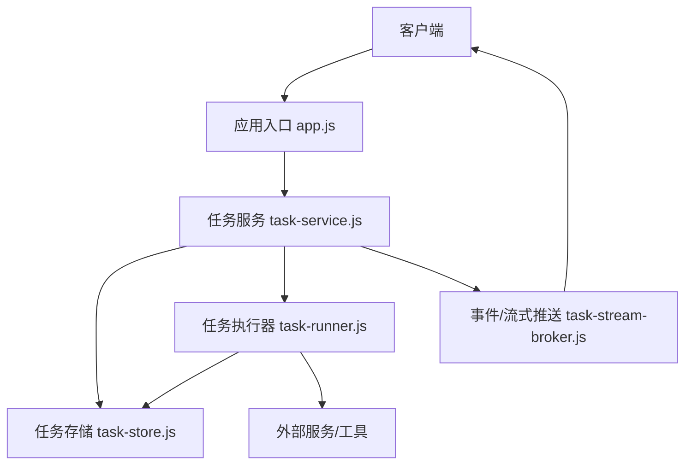
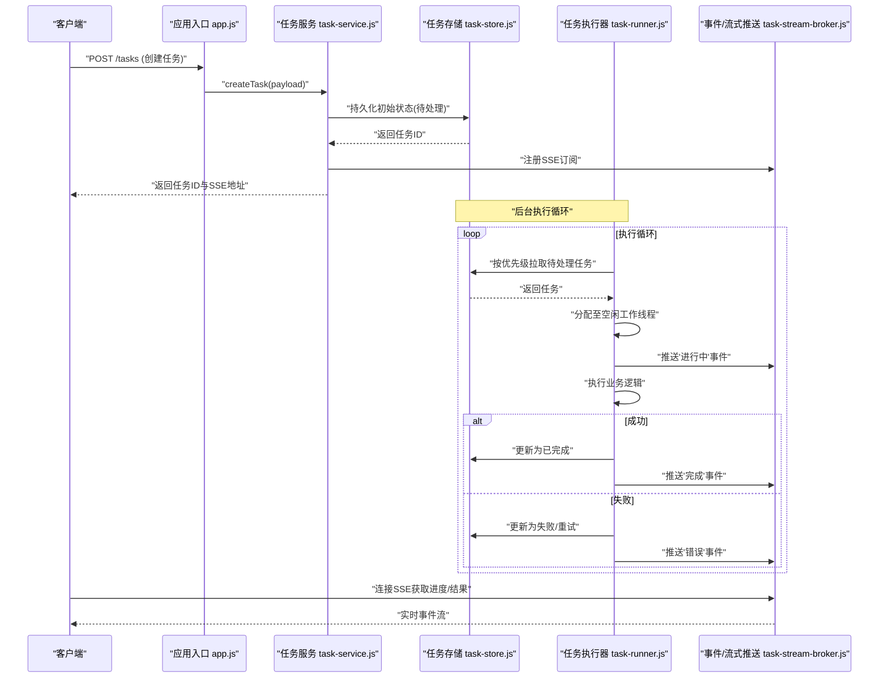
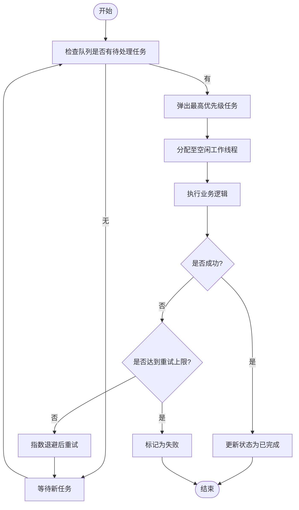
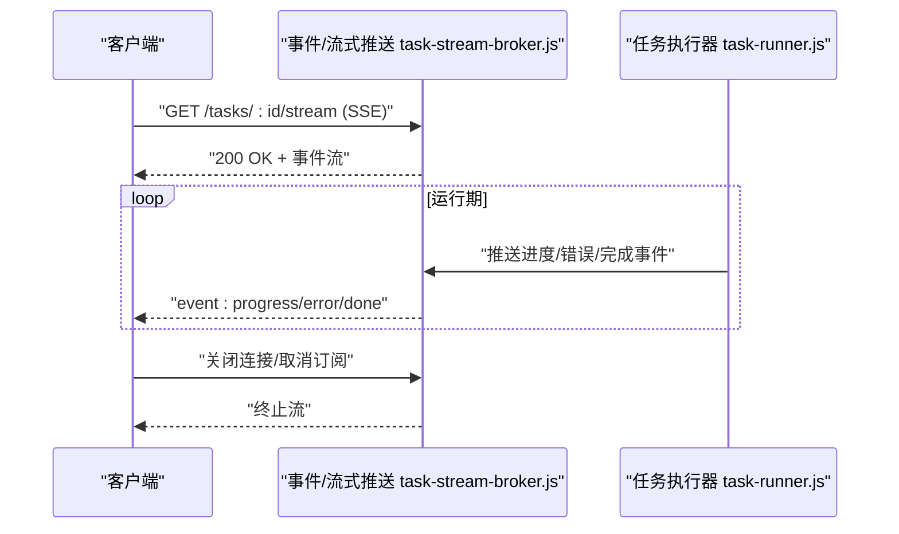
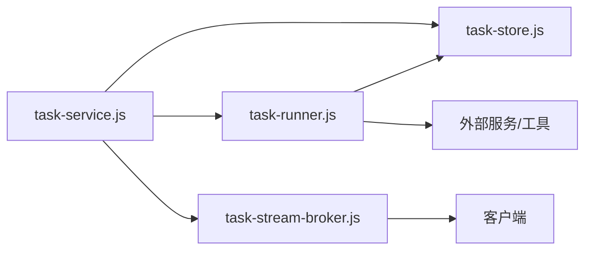

# 任务服务管理器

<cite>
**本文引用的文件**   
- [task-service.js](file://node-jinmao/service/md2quiz/task-service.js)
- [task-store.js](file://node-jinmao/service/md2quiz/task-store.js)
- [task-runner.js](file://node-jinmao/service/md2quiz/task-runner.js)
- [task-stream-broker.js](file://node-jinmao/service/md2quiz/task-stream-broker.js)
- [types.js](file://node-jinmao/service/md2quiz/types.js)
- [app.js](file://node-jinmao/app.js)
- [schema.prisma](file://node-jinmao/prisma/schema.prisma)
</cite>

## 目录
1. [简介](#简介)
2. [项目结构](#项目结构)
3. [核心组件](#核心组件)
4. [架构总览](#架构总览)
5. [详细组件分析](#详细组件分析)
6. [依赖关系分析](#依赖关系分析)
7. [性能考量](#性能考量)
8. [故障排查指南](#故障排查指南)
9. [结论](#结论)
10. [附录：配置与使用示例](#附录配置与使用示例)

## 简介
本文件面向“任务服务管理器”的设计与实现，围绕异步任务的完整生命周期（创建、调度、执行、监控、完成通知）展开，系统阐述以下关键能力：
- 核心组件：任务队列、工作线程池、状态管理器、事件总线
- 调度策略：优先级调度算法、负载均衡策略
- 可靠性：故障恢复机制、重试策略、超时控制
- 可观测性：SSE 流式传输（实时进度、错误通知、取消）
- 持久化：任务存储模型、数据恢复流程
- 配置项：并发数限制、超时设置、重试策略、资源配额等
- 使用示例：创建、监控与管理不同类型处理任务

## 项目结构
任务服务相关代码集中在 node-jinmao/service/md2quiz 目录下，采用分层与职责分离的组织方式：
- 入口与路由：app.js 负责应用启动与接口挂载
- 任务服务层：task-service.js 提供任务创建、查询、取消等 API 编排
- 任务存储层：task-store.js 负责任务状态的持久化与查询
- 任务执行器：task-runner.js 负责从队列拉取任务并执行，管理并发与重试
- 事件与流式推送：task-stream-broker.js 基于 SSE 推送任务进度与结果
- 类型定义：types.js 统一任务、状态、事件等数据结构

图表来源
- [app.js](file://node-jinmao/app.js)
- [task-service.js](file://node-jinmao/service/md2quiz/task-service.js)
- [task-store.js](file://node-jinmao/service/md2quiz/task-store.js)
- [task-runner.js](file://node-jinmao/service/md2quiz/task-runner.js)
- [task-stream-broker.js](file://node-jinmao/service/md2quiz/task-stream-broker.js)

章节来源
- [app.js](file://node-jinmao/app.js)
- [task-service.js](file://node-jinmao/service/md2quiz/task-service.js)
- [task-store.js](file://node-jinmao/service/md2quiz/task-store.js)
- [task-runner.js](file://node-jinmao/service/md2quiz/task-runner.js)
- [task-stream-broker.js](file://node-jinmao/service/md2quiz/task-stream-broker.js)

## 核心组件
- 任务队列：内存中的有界队列，支持按优先级入队与出队，保障高优任务优先执行。
- 工作线程池：固定大小的执行器集合，从队列中拉取任务并行执行，避免阻塞主线程。
- 状态管理器：维护任务全生命周期状态（待处理、进行中、已完成、失败、已取消），并提供幂等的状态转换。
- 事件总线：基于 SSE 的轻量级发布/订阅通道，用于向客户端推送进度、错误与完成事件。

章节来源
- [task-service.js](file://node-jinmao/service/md2quiz/task-service.js)
- [task-store.js](file://node-jinmao/service/md2quiz/task-store.js)
- [task-runner.js](file://node-jinmao/service/md2quiz/task-runner.js)
- [task-stream-broker.js](file://node-jinmao/service/md2quiz/task-stream-broker.js)
- [types.js](file://node-jinmao/service/md2quiz/types.js)

## 架构总览
下图展示了任务从创建到完成的端到端流程，以及各组件之间的交互关系。

图表来源
- [app.js](file://node-jinmao/app.js)
- [task-service.js](file://node-jinmao/service/md2quiz/task-service.js)
- [task-store.js](file://node-jinmao/service/md2quiz/task-store.js)
- [task-runner.js](file://node-jinmao/service/md2quiz/task-runner.js)
- [task-stream-broker.js](file://node-jinmao/service/md2quiz/task-stream-broker.js)

## 详细组件分析

### 任务服务（task-service.js）
- 职责
  - 对外暴露任务创建、查询、取消、列表等接口
  - 协调存储、执行器与事件推送，保证一致性
  - 参数校验与默认值填充（如优先级、超时、重试次数）
- 关键点
  - 创建任务时先落库，再入队，确保可恢复
  - 取消任务通过状态机约束，避免重复取消
  - 查询接口支持过滤与分页（由上层路由或中间件配合）

章节来源
- [task-service.js](file://node-jinmao/service/md2quiz/task-service.js)
- [types.js](file://node-jinmao/service/md2quiz/types.js)

### 任务存储（task-store.js）
- 职责
  - 维护任务元数据与状态变更历史
  - 提供按状态、优先级、时间窗口的查询能力
  - 支持事务性更新，保证状态一致性
- 关键点
  - 幂等写入：同一任务多次更新不会破坏一致性
  - 索引优化：常用查询字段建立索引（如 status、priority、created_at）
  - 清理策略：过期任务归档或删除，释放空间

章节来源
- [task-store.js](file://node-jinmao/service/md2quiz/task-store.js)
- [schema.prisma](file://node-jinmao/prisma/schema.prisma)

### 任务执行器（task-runner.js）
- 职责
  - 维护工作线程池，控制最大并发度
  - 从队列拉取任务并分发到空闲线程
  - 处理超时、重试、失败回退与异常捕获
- 关键点
  - 优先级调度：高优先级任务优先出队
  - 负载均衡：轮询或最少任务数策略分配线程
  - 故障恢复：失败任务按策略重试或进入死信队列

图表来源
- [task-runner.js](file://node-jinmao/service/md2quiz/task-runner.js)

章节来源
- [task-runner.js](file://node-jinmao/service/md2quiz/task-runner.js)

### 事件与流式推送（task-stream-broker.js）
- 职责
  - 基于 SSE 建立服务端到客户端的单向实时通道
  - 推送任务进度、错误、完成等事件
  - 支持客户端取消订阅与断线重连
- 关键点
  - 事件去抖与合并：高频进度事件合并输出
  - 背压控制：当客户端消费慢时进行限流
  - 安全校验：订阅前验证用户权限与任务归属

图表来源
- [task-stream-broker.js](file://node-jinmao/service/md2quiz/task-stream-broker.js)
- [task-runner.js](file://node-jinmao/service/md2quiz/task-runner.js)

章节来源
- [task-stream-broker.js](file://node-jinmao/service/md2quiz/task-stream-broker.js)

### 类型定义（types.js）
- 职责
  - 统一定义任务、状态、事件、配置等数据结构
  - 作为前后端契约，减少歧义
- 关键点
  - 枚举值清晰：status、priority、retryPolicy 等
  - 可选字段明确：timeout、maxRetries、resourceQuota 等

章节来源
- [types.js](file://node-jinmao/service/md2quiz/types.js)

## 依赖关系分析
- 模块耦合
  - task-service.js 依赖 task-store.js、task-runner.js、task-stream-broker.js
  - task-runner.js 依赖 task-store.js 与外部执行环境
  - task-stream-broker.js 被 task-service.js 与 task-runner.js 共同使用
- 外部依赖
  - Prisma ORM 用于数据库访问（schema.prisma）
  - HTTP/SSE 框架用于接口与流式推送

图表来源
- [task-service.js](file://node-jinmao/service/md2quiz/task-service.js)
- [task-store.js](file://node-jinmao/service/md2quiz/task-store.js)
- [task-runner.js](file://node-jinmao/service/md2quiz/task-runner.js)
- [task-stream-broker.js](file://node-jinmao/service/md2quiz/task-stream-broker.js)

章节来源
- [task-service.js](file://node-jinmao/service/md2quiz/task-service.js)
- [task-store.js](file://node-jinmao/service/md2quiz/task-store.js)
- [task-runner.js](file://node-jinmao/service/md2quiz/task-runner.js)
- [task-stream-broker.js](file://node-jinmao/service/md2quiz/task-stream-broker.js)

## 性能考量
- 并发与吞吐
  - 工作线程池大小根据 CPU 核数与 I/O 特性调优
  - 队列长度限制防止内存溢出
- 调度与负载均衡
  - 优先级队列降低高优任务延迟
  - 线程分配策略避免热点节点
- 存储与查询
  - 读写分离与索引优化提升查询性能
  - 定期归档历史任务减少表膨胀
- 流式推送
  - 事件合并与去抖降低带宽占用
  - 背压与限流保护服务端稳定性

[本节为通用指导，不直接分析具体文件]

## 故障排查指南
- 常见问题
  - 任务堆积：检查队列长度与工作线程池大小
  - 执行超时：调整 timeout 与重试策略
  - SSE 断开：确认网络与订阅鉴权
  - 状态不一致：检查幂等性与事务边界
- 定位方法
  - 查看任务状态历史与错误日志
  - 监控队列长度、线程利用率与事件推送速率
  - 复现路径：最小化输入与隔离外部依赖

章节来源
- [task-store.js](file://node-jinmao/service/md2quiz/task-store.js)
- [task-runner.js](file://node-jinmao/service/md2quiz/task-runner.js)
- [task-stream-broker.js](file://node-jinmao/service/md2quiz/task-stream-broker.js)

## 结论
任务服务管理器通过清晰的组件划分与严格的职责边界，实现了高可靠、可扩展的异步任务处理能力。优先级调度、负载均衡与故障恢复机制保障了系统的稳定性与效率；SSE 流式推送提供了良好的可观测性与用户体验；完善的配置项与持久化设计使系统具备弹性与可恢复性。

[本节为总结，不直接分析具体文件]

## 附录：配置与使用示例

### 配置项说明
- 并发数限制
  - 工作线程池大小：控制同时执行的任务数量
  - 队列容量：限制待处理任务的最大数量
- 超时设置
  - 单任务超时：超过阈值自动中断并标记失败
  - 全局超时：服务整体健康检查与熔断
- 重试策略
  - 最大重试次数：失败后的重试上限
  - 退避策略：指数退避或固定间隔
- 资源配额
  - CPU/内存限制：防止单个任务占用过多资源
  - I/O 配额：限制磁盘与网络访问频率

章节来源
- [types.js](file://node-jinmao/service/md2quiz/types.js)

### 使用示例（步骤说明）
- 创建任务
  - 调用创建接口，传入任务类型、参数、优先级、超时与重试策略
  - 返回任务 ID 与 SSE 订阅地址
- 监控任务
  - 通过 SSE 订阅任务进度、错误与完成事件
  - 轮询查询接口获取最终状态与结果
- 管理任务
  - 取消任务：在未完成状态下发起取消请求
  - 重试任务：对失败任务触发手动重试
  - 批量操作：按条件筛选并批量取消或重试

章节来源
- [task-service.js](file://node-jinmao/service/md2quiz/task-service.js)
- [task-stream-broker.js](file://node-jinmao/service/md2quiz/task-stream-broker.js)

### SSE 流式传输要点
- 实时进度更新
  - 执行器周期性推送进度事件
  - 客户端渲染进度条与状态提示
- 错误通知
  - 执行失败时推送错误事件，包含错误码与消息
  - 客户端展示错误详情并提供重试入口
- 取消机制
  - 客户端主动关闭 SSE 连接或发送取消信号
  - 执行器收到取消后中断任务并更新状态

章节来源
- [task-stream-broker.js](file://node-jinmao/service/md2quiz/task-stream-broker.js)
- [task-runner.js](file://node-jinmao/service/md2quiz/task-runner.js)

### 持久化与数据恢复
- 存储模型
  - 任务表：包含任务元数据、状态、优先级、超时、重试计数等
  - 事件表：记录任务生命周期事件，便于审计与回溯
- 恢复流程
  - 服务重启后扫描未完成任务，恢复执行
  - 失败任务按策略重新入队或进入死信队列
  - 清理过期任务，释放存储空间

章节来源
- [task-store.js](file://node-jinmao/service/md2quiz/task-store.js)
- [schema.prisma](file://node-jinmao/prisma/schema.prisma)