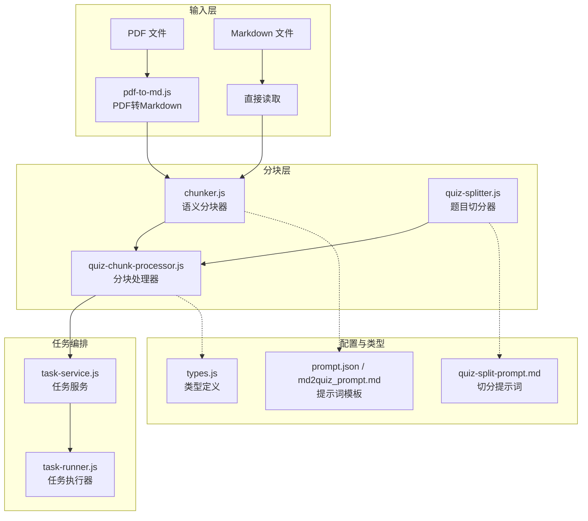
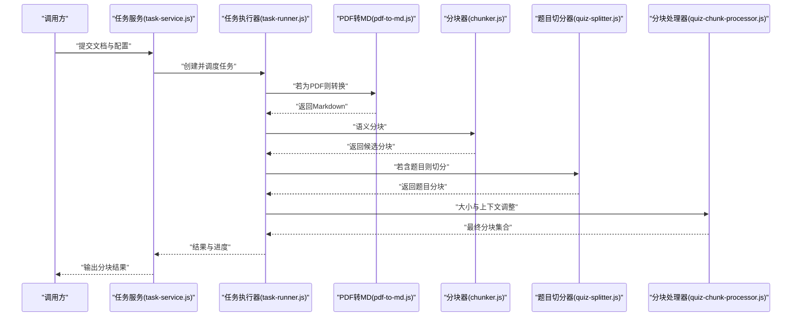
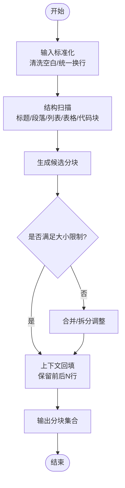
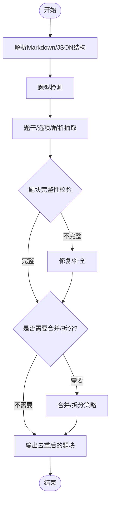
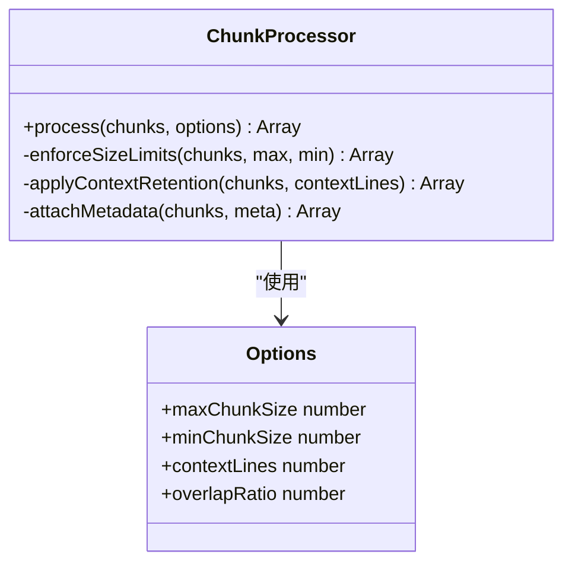
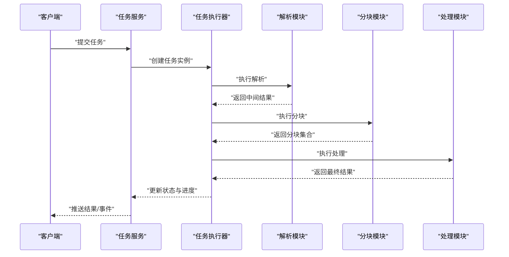
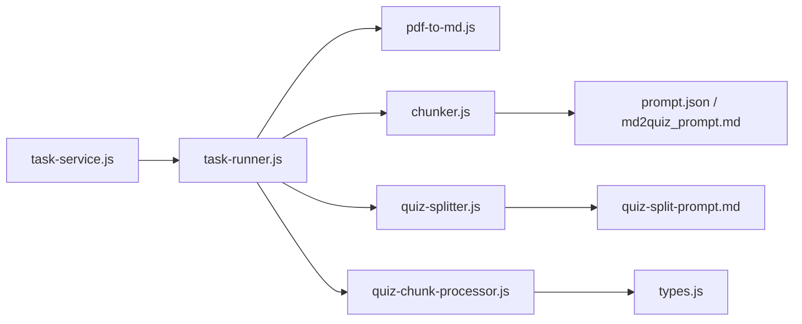

# 文档智能分块器

<cite>
**本文档引用的文件**   
- [chunker.js](file://node-jinmao/service/md2quiz/chunker.js)
- [quiz-splitter.js](file://node-jinmao/service/md2quiz/quiz-splitter.js)
- [pdf-to-md.js](file://node-jinmao/service/md2quiz/pdf-to-md.js)
- [quiz-chunk-processor.js](file://node-jinmao/service/md2quiz/quiz-chunk-processor.js)
- [task-service.js](file://node-jinmao/service/md2quiz/task-service.js)
- [task-runner.js](file://node-jinmao/service/md2quiz/task-runner.js)
- [types.js](file://node-jinmao/service/md2quiz/types.js)
- [prompt.json](file://node-jinmao/config/prompt.json)
- [md2quiz_prompt.md](file://node-jinmao/config/md2quiz_prompt.md)
- [quiz-split-prompt.md](file://node-jinmao/config/quiz-split-prompt.md)
</cite>

## 目录
1. [简介](#简介)
2. [项目结构](#项目结构)
3. [核心组件](#核心组件)
4. [架构总览](#架构总览)
5. [详细组件分析](#详细组件分析)
6. [依赖关系分析](#依赖关系分析)
7. [性能考虑](#性能考虑)
8. [故障排查指南](#故障排查指南)
9. [结论](#结论)
10. [附录](#附录)

## 简介
本文件面向“文档智能分块器”的实现与使用，聚焦于 Markdown/PDF 文档的智能分割算法。内容涵盖：
- 基于语义边界的分割策略（标题层级识别、段落边界检测）
- 上下文保持机制（保留上下文行数、重叠窗口）
- 大小限制控制（最大/最小分块大小）
- 配置项说明与示例
- 典型文档结构的处理（章节、列表、表格、代码块）
- 错误处理机制与性能优化建议
- 自定义分割规则的实现方法

该分块器服务于题库生成与知识切片场景，确保每个分块在语义上自洽且便于后续 LLM 处理或检索增强。

## 项目结构
与分块器相关的核心实现位于 node-jinmao/service/md2quiz 目录下，配合 config 中的提示词与类型定义，形成从 PDF/Markdown 到可切分文本的完整链路。

图表来源
- [pdf-to-md.js:1-200](file://node-jinmao/service/md2quiz/pdf-to-md.js#L1-L200)
- [chunker.js:1-200](file://node-jinmao/service/md2quiz/chunker.js#L1-L200)
- [quiz-splitter.js:1-200](file://node-jinmao/service/md2quiz/quiz-splitter.js#L1-L200)
- [quiz-chunk-processor.js:1-200](file://node-jinmao/service/md2quiz/quiz-chunk-processor.js#L1-L200)
- [task-service.js:1-200](file://node-jinmao/service/md2quiz/task-service.js#L1-L200)
- [task-runner.js:1-200](file://node-jinmao/service/md2quiz/task-runner.js#L1-L200)
- [types.js:1-200](file://node-jinmao/service/md2quiz/types.js#L1-L200)
- [prompt.json:1-200](file://node-jinmao/config/prompt.json#L1-L200)
- [md2quiz_prompt.md:1-200](file://node-jinmao/config/md2quiz_prompt.md#L1-L200)
- [quiz-split-prompt.md:1-200](file://node-jinmao/config/quiz-split-prompt.md#L1-L200)

章节来源
- [pdf-to-md.js:1-200](file://node-jinmao/service/md2quiz/pdf-to-md.js#L1-L200)
- [chunker.js:1-200](file://node-jinmao/service/md2quiz/chunker.js#L1-L200)
- [quiz-splitter.js:1-200](file://node-jinmao/service/md2quiz/quiz-splitter.js#L1-L200)
- [quiz-chunk-processor.js:1-200](file://node-jinmao/service/md2quiz/quiz-chunk-processor.js#L1-L200)
- [task-service.js:1-200](file://node-jinmao/service/md2quiz/task-service.js#L1-L200)
- [task-runner.js:1-200](file://node-jinmao/service/md2quiz/task-runner.js#L1-L200)
- [types.js:1-200](file://node-jinmao/service/md2quiz/types.js#L1-L200)
- [prompt.json:1-200](file://node-jinmao/config/prompt.json#L1-L200)
- [md2quiz_prompt.md:1-200](file://node-jinmao/config/md2quiz_prompt.md#L1-L200)
- [quiz-split-prompt.md:1-200](file://node-jinmao/config/quiz-split-prompt.md#L1-L200)

## 核心组件
- 文档解析与预处理
  - PDF 转 Markdown：将 PDF 转换为结构化 Markdown，便于后续分块。
  - Markdown 直读：对已有 Markdown 进行清洗与标准化。
- 分块器
  - 语义分块器：基于标题层级、段落边界、列表/表格/代码块等结构特征进行语义切分。
  - 题目切分器：针对题库类内容，按题型与题干/选项/解析进行切分。
- 分块处理器
  - 合并/拆分：根据最大/最小分块大小约束进行二次调整。
  - 上下文保持：通过保留上下文行数或滑动窗口保证语义连贯。
- 任务编排
  - 任务服务：统一入口，协调解析、分块、处理流程。
  - 任务执行器：并发控制、重试、超时、进度上报。

章节来源
- [pdf-to-md.js:1-200](file://node-jinmao/service/md2quiz/pdf-to-md.js#L1-L200)
- [chunker.js:1-200](file://node-jinmao/service/md2quiz/chunker.js#L1-L200)
- [quiz-splitter.js:1-200](file://node-jinmao/service/md2quiz/quiz-splitter.js#L1-L200)
- [quiz-chunk-processor.js:1-200](file://node-jinmao/service/md2quiz/quiz-chunk-processor.js#L1-L200)
- [task-service.js:1-200](file://node-jinmao/service/md2quiz/task-service.js#L1-L200)
- [task-runner.js:1-200](file://node-jinmao/service/md2quiz/task-runner.js#L1-L200)

## 架构总览
下图展示了从输入到输出的端到端流程，包括解析、分块、处理与任务编排的关键交互。

图表来源
- [task-service.js:1-200](file://node-jinmao/service/md2quiz/task-service.js#L1-L200)
- [task-runner.js:1-200](file://node-jinmao/service/md2quiz/task-runner.js#L1-L200)
- [pdf-to-md.js:1-200](file://node-jinmao/service/md2quiz/pdf-to-md.js#L1-L200)
- [chunker.js:1-200](file://node-jinmao/service/md2quiz/chunker.js#L1-L200)
- [quiz-splitter.js:1-200](file://node-jinmao/service/md2quiz/quiz-splitter.js#L1-L200)
- [quiz-chunk-processor.js:1-200](file://node-jinmao/service/md2quiz/quiz-chunk-processor.js#L1-L200)

## 详细组件分析

### 语义分块器（chunker.js）
- 功能要点
  - 标题层级识别：识别多级标题作为强语义边界。
  - 段落边界检测：依据空行、缩进、标点与长度阈值判断段落起止。
  - 逻辑单元提取：列表项、表格、代码块作为独立单元优先保持完整。
  - 大小限制控制：最大/最小分块大小约束，必要时进行合并或再拆分。
  - 上下文保持：通过保留上下文行数或滑动窗口避免语义断裂。
- 关键流程
  - 输入标准化 → 结构扫描 → 候选分块生成 → 大小校验 → 上下文回填 → 输出

图表来源
- [chunker.js:1-200](file://node-jinmao/service/md2quiz/chunker.js#L1-L200)

章节来源
- [chunker.js:1-200](file://node-jinmao/service/md2quiz/chunker.js#L1-L200)

### 题目切分器（quiz-splitter.js）
- 功能要点
  - 题型识别：选择题、填空题、判断题、简答题等。
  - 题干/选项/解析分离：按结构模式抽取，保证每个题块自包含。
  - 多题合并策略：当单题过小或过大时，结合相邻题进行合理合并。
- 适用场景
  - 题库导入、知识点切片、问答对构建。

图表来源
- [quiz-splitter.js:1-200](file://node-jinmao/service/md2quiz/quiz-splitter.js#L1-L200)

章节来源
- [quiz-splitter.js:1-200](file://node-jinmao/service/md2quiz/quiz-splitter.js#L1-L200)

### 分块处理器（quiz-chunk-processor.js）
- 功能要点
  - 大小控制：根据最大/最小分块大小进行二次调整。
  - 上下文保持：支持保留上下文行数、重叠比例等参数。
  - 元数据附加：为每个分块附加标题路径、页码、来源信息等。
- 处理流程
  - 接收候选分块 → 应用规则 → 校验与修正 → 输出最终分块

图表来源
- [quiz-chunk-processor.js:1-200](file://node-jinmao/service/md2quiz/quiz-chunk-processor.js#L1-L200)

章节来源
- [quiz-chunk-processor.js:1-200](file://node-jinmao/service/md2quiz/quiz-chunk-processor.js#L1-L200)

### 任务服务与执行器（task-service.js, task-runner.js）
- 任务服务
  - 统一入口：接收请求、参数校验、任务创建与状态管理。
  - 事件流：进度上报、完成回调、错误传播。
- 任务执行器
  - 并发控制：限制并行度，避免资源争用。
  - 容错机制：重试、超时、降级策略。
  - 日志与追踪：记录关键步骤与耗时。

图表来源
- [task-service.js:1-200](file://node-jinmao/service/md2quiz/task-service.js#L1-L200)
- [task-runner.js:1-200](file://node-jinmao/service/md2quiz/task-runner.js#L1-L200)

章节来源
- [task-service.js:1-200](file://node-jinmao/service/md2quiz/task-service.js#L1-L200)
- [task-runner.js:1-200](file://node-jinmao/service/md2quiz/task-runner.js#L1-L200)

### 类型定义（types.js）
- 作用
  - 统一定义分块、任务、配置等数据结构，确保各模块间契约一致。
- 关键点
  - 分块对象字段：内容、标题路径、来源、页码、上下文等。
  - 任务对象字段：ID、状态、进度、错误信息、结果引用等。
  - 配置对象字段：大小限制、上下文行数、并发度、超时等。

章节来源
- [types.js:1-200](file://node-jinmao/service/md2quiz/types.js#L1-L200)

### 提示词与模板（prompt.json, md2quiz_prompt.md, quiz-split-prompt.md）
- 作用
  - 提供 LLM 辅助解析与切分的提示词模板，提升复杂结构的识别准确率。
- 关键点
  - 模板变量：文档类型、目标语言、切分粒度、题型偏好等。
  - 可扩展性：支持替换模板以适配不同业务需求。

章节来源
- [prompt.json:1-200](file://node-jinmao/config/prompt.json#L1-L200)
- [md2quiz_prompt.md:1-200](file://node-jinmao/config/md2quiz_prompt.md#L1-L200)
- [quiz-split-prompt.md:1-200](file://node-jinmao/config/quiz-split-prompt.md#L1-L200)

## 依赖关系分析
- 模块耦合
  - 任务服务与执行器松耦合，通过接口传递任务与状态。
  - 分块器与处理器职责清晰，前者负责语义切分，后者负责大小与上下文调整。
- 外部依赖
  - PDF 转 Markdown 依赖外部工具或库（由 pdf-to-md.js 封装）。
  - 提示词模板由配置文件驱动，便于热更新与多环境适配。

图表来源
- [task-service.js:1-200](file://node-jinmao/service/md2quiz/task-service.js#L1-L200)
- [task-runner.js:1-200](file://node-jinmao/service/md2quiz/task-runner.js#L1-L200)
- [pdf-to-md.js:1-200](file://node-jinmao/service/md2quiz/pdf-to-md.js#L1-L200)
- [chunker.js:1-200](file://node-jinmao/service/md2quiz/chunker.js#L1-L200)
- [quiz-splitter.js:1-200](file://node-jinmao/service/md2quiz/quiz-splitter.js#L1-L200)
- [quiz-chunk-processor.js:1-200](file://node-jinmao/service/md2quiz/quiz-chunk-processor.js#L1-L200)
- [types.js:1-200](file://node-jinmao/service/md2quiz/types.js#L1-L200)
- [prompt.json:1-200](file://node-jinmao/config/prompt.json#L1-L200)
- [md2quiz_prompt.md:1-200](file://node-jinmao/config/md2quiz_prompt.md#L1-L200)
- [quiz-split-prompt.md:1-200](file://node-jinmao/config/quiz-split-prompt.md#L1-L200)

章节来源
- [task-service.js:1-200](file://node-jinmao/service/md2quiz/task-service.js#L1-L200)
- [task-runner.js:1-200](file://node-jinmao/service/md2quiz/task-runner.js#L1-L200)
- [chunker.js:1-200](file://node-jinmao/service/md2quiz/chunker.js#L1-L200)
- [quiz-splitter.js:1-200](file://node-jinmao/service/md2quiz/quiz-splitter.js#L1-L200)
- [quiz-chunk-processor.js:1-200](file://node-jinmao/service/md2quiz/quiz-chunk-processor.js#L1-L200)
- [types.js:1-200](file://node-jinmao/service/md2quiz/types.js#L1-L200)
- [prompt.json:1-200](file://node-jinmao/config/prompt.json#L1-L200)
- [md2quiz_prompt.md:1-200](file://node-jinmao/config/md2quiz_prompt.md#L1-L200)
- [quiz-split-prompt.md:1-200](file://node-jinmao/config/quiz-split-prompt.md#L1-L200)

## 性能考虑
- 解析阶段
  - 对大 PDF 采用流式读取与增量转换，降低内存峰值。
  - Markdown 清洗时避免不必要的正则回溯，使用线性扫描。
- 分块阶段
  - 预计算标题索引与段落边界，减少重复扫描。
  - 使用双指针合并/拆分策略，时间复杂度接近 O(n)。
- 上下文保持
  - 仅保留必要上下文行数，避免冗余复制。
  - 滑动窗口采用环形缓冲，降低内存占用。
- 任务编排
  - 限制并发度，避免 CPU/IO 竞争。
  - 失败重试采用指数退避，避免雪崩。
- 缓存与复用
  - 对相同配置的解析/分块结果进行缓存，命中即返回。
  - 提示词模板编译一次后复用。

[本节为通用性能指导，不直接分析具体文件]

## 故障排查指南
- 常见问题
  - 分块过大/过小：检查最大/最小分块大小配置与合并/拆分策略。
  - 上下文缺失：确认上下文行数设置与滑动窗口逻辑。
  - 标题层级丢失：检查标题识别规则与 Markdown 规范一致性。
  - 表格/代码块被截断：确认结构保护规则是否生效。
- 定位方法
  - 查看任务执行日志与进度上报，定位失败步骤。
  - 打印中间结果（如候选分块、上下文片段），验证规则效果。
  - 使用最小复现用例，逐步缩小问题范围。
- 恢复策略
  - 自动重试与降级：对偶发错误进行重试，对不可恢复错误回滚。
  - 人工介入：提供导出与编辑能力，允许手动修正分块。

章节来源
- [task-runner.js:1-200](file://node-jinmao/service/md2quiz/task-runner.js#L1-L200)
- [task-service.js:1-200](file://node-jinmao/service/md2quiz/task-service.js#L1-L200)
- [chunker.js:1-200](file://node-jinmao/service/md2quiz/chunker.js#L1-L200)
- [quiz-chunk-processor.js:1-200](file://node-jinmao/service/md2quiz/quiz-chunk-processor.js#L1-L200)

## 结论
文档智能分块器通过“解析—分块—处理—编排”的分层架构，实现了基于语义边界的稳定分割与上下文保持。其核心优势在于：
- 灵活的配置项（最大/最小分块大小、上下文行数、重叠比例）
- 对复杂结构（标题、列表、表格、代码块）的保护
- 可扩展的提示词模板与自定义规则
- 健壮的异常处理与性能优化策略

建议在业务中按需启用题目切分与 LLM 辅助解析，并结合缓存与并发控制提升吞吐。

[本节为总结性内容，不直接分析具体文件]

## 附录

### 配置选项说明
- 最大分块大小：控制单个分块的最大字符/Token 数，防止超出模型上下文。
- 最小分块大小：避免过碎分块导致语义不完整。
- 保留上下文行数：在每个分块前后追加若干行，提升语义连贯性。
- 重叠比例：用于滑动窗口分块时的重叠率，平衡召回与冗余。
- 并发度：任务执行器的并行度上限。
- 超时与重试：单次任务超时时间与最大重试次数。

[本节为通用配置说明，不直接分析具体文件]

### 使用示例（按文档结构）
- 章节文档
  - 以多级标题为边界，优先保持章节完整性；必要时按段落再切分。
- 列表文档
  - 列表项整体作为一个逻辑单元，避免跨项切分。
- 表格文档
  - 表格整体保持完整，必要时按行分组但保留表头上下文。
- 代码块
  - 代码块整体保持，禁止在函数/类内部切分；必要时按文件/模块切分。

[本节为概念性示例，不直接分析具体文件]

### 自定义分割规则实现方法
- 扩展点
  - 在分块器中注册新的边界识别规则（如自定义标题标记、分隔符）。
  - 在处理器中插入新的合并/拆分策略（如按主题聚类）。
- 步骤
  - 定义规则接口与配置项。
  - 实现规则逻辑并在流水线中挂载。
  - 单元测试覆盖边界情况与性能回归。
- 提示词扩展
  - 修改提示词模板以引导 LLM 识别特定结构或语义。

[本节为概念性指导，不直接分析具体文件]