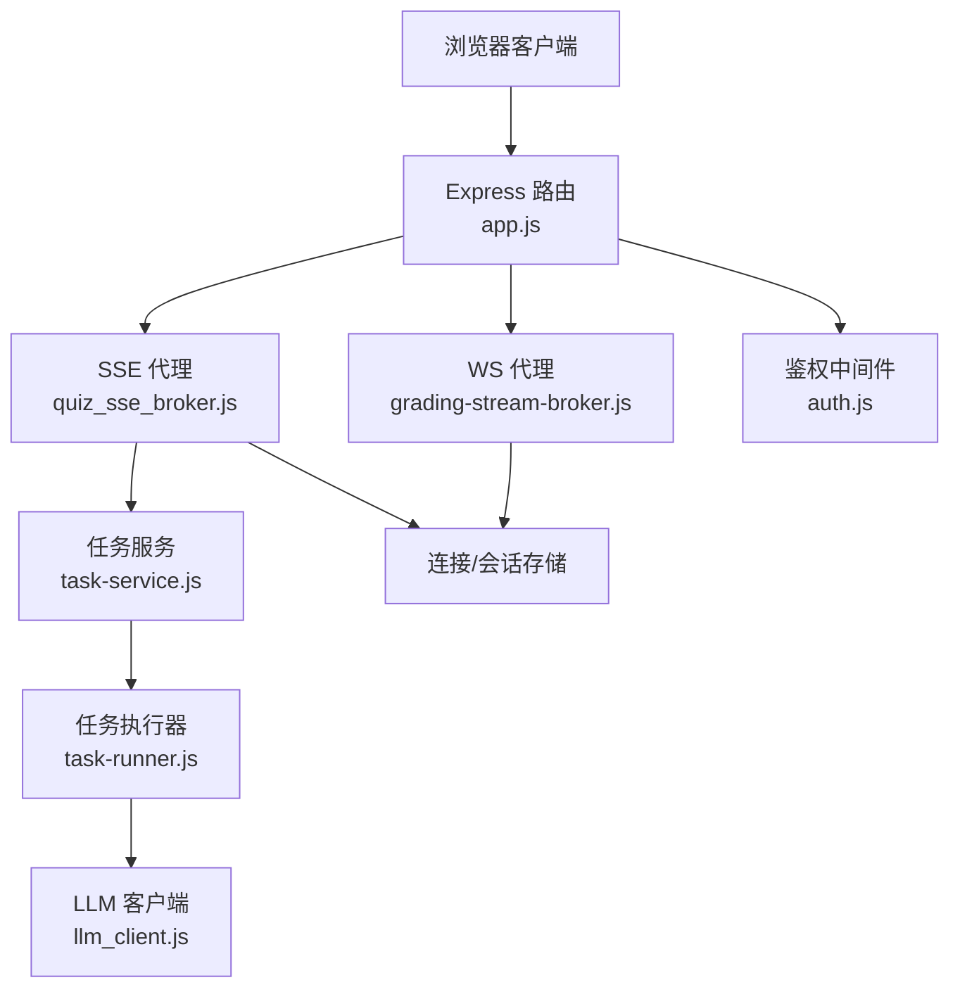
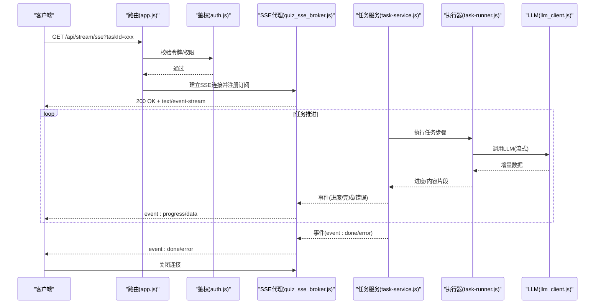
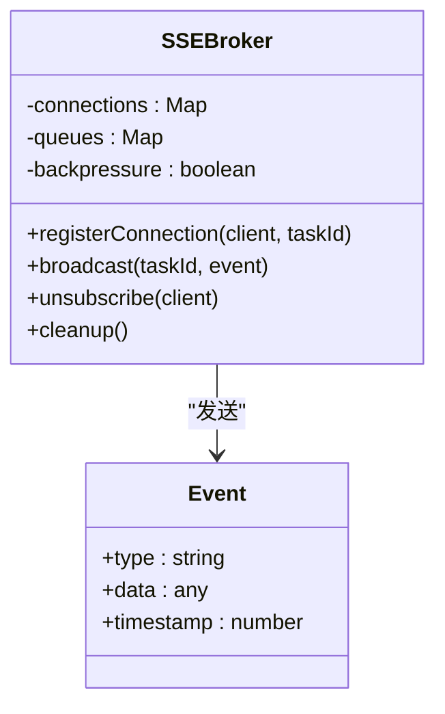
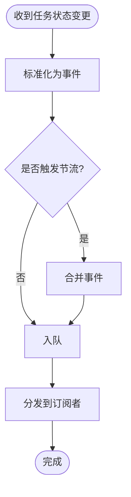
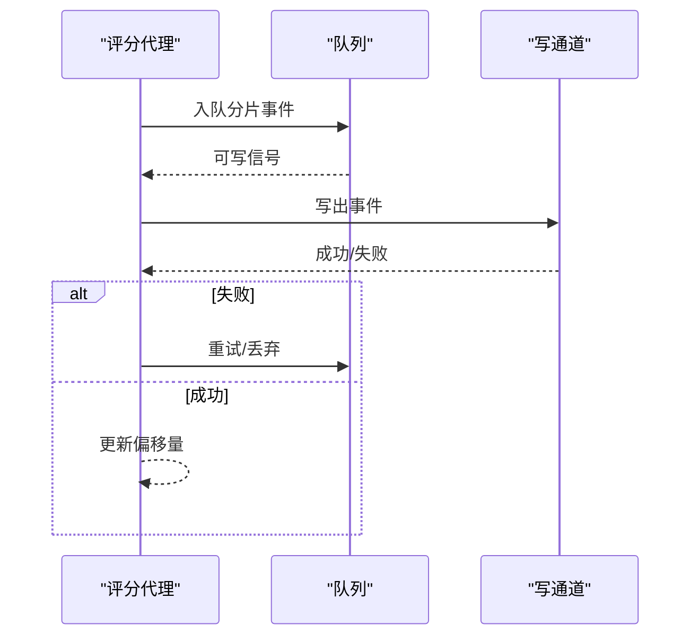
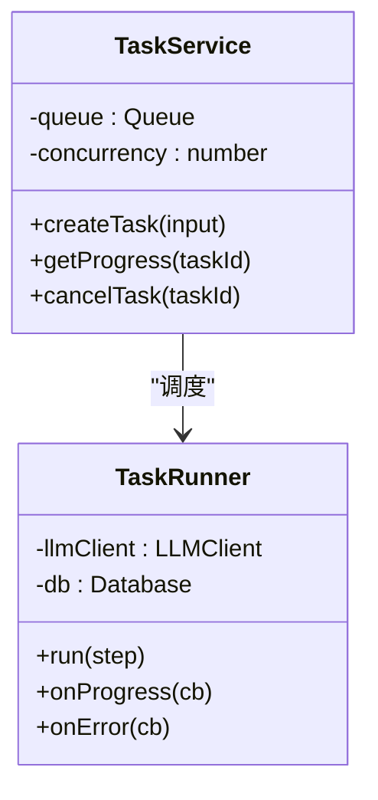
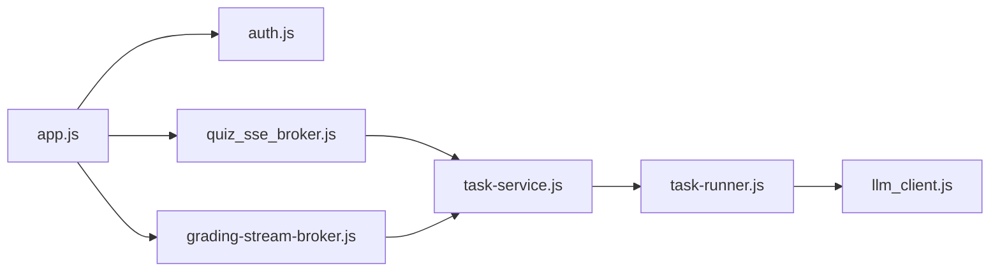

# 流式消息代理

<cite>
**本文引用的文件**   
- [app.js](file://node-jinmao/app.js)
- [quiz_sse_broker.js](file://node-jinmao/service/quiz_sse_broker.js)
- [task-stream-broker.js](file://node-jinmao/service/md2quiz/task-stream-broker.js)
- [grading-stream-broker.js](file://test/无图片的md文件/node-jinmao/src/modules/quiz/grading-stream-broker.js)
- [progress.js](file://WEB/src/api/progress.js)
- [progress-script.js](file://WEB/src/pages/study/script.js)
- [auth.js](file://node-jinmao/middleware/auth.js)
- [llm_client.js](file://node-jinmao/utils/llm_client.js)
- [task-service.js](file://node-jinmao/service/md2quiz/task-service.js)
- [task-runner.js](file://node-jinmao/service/md2quiz/task-runner.js)
</cite>

## 目录
1. [简介](#简介)
2. [项目结构](#项目结构)
3. [核心组件](#核心组件)
4. [架构总览](#架构总览)
5. [详细组件分析](#详细组件分析)
6. [依赖关系分析](#依赖关系分析)
7. [性能考虑](#性能考虑)
8. [故障排查指南](#故障排查指南)
9. [结论](#结论)
10. [附录：客户端集成与消息格式](#附录客户端集成与消息格式)

## 简介
本文件面向“流式消息代理”的实现与使用，聚焦于 SSE（Server-Sent Events）在长连接、事件推送、进度反馈等场景中的落地方案。文档覆盖以下要点：
- SSE 流式通信机制：连接管理、消息广播、订阅模式、断线重连
- 消息代理核心能力：事件分发、客户端管理、消息缓冲、流量控制
- 支持的协议：HTTP SSE、WebSocket、轮询降级
- 客户端集成示例：建立连接、接收事件、错误处理、优雅断开
- 消息格式定义：进度事件、错误事件、完成事件等数据结构
- 高并发优化：内存管理、连接池、消息队列
- 安全策略：身份验证、权限控制、速率限制

## 项目结构
本项目在后端采用 Node.js 实现流式消息代理，前端通过 HTTP SSE 或 WebSocket 进行实时交互。关键路径如下：
- 后端入口与路由挂载：app.js
- SSE 代理与任务流：service/quiz_sse_broker.js、service/md2quiz/task-stream-broker.js
- 评分流式代理（测试模块）：test/.../grading-stream-broker.js
- 中间件鉴权：middleware/auth.js
- 外部 LLM 调用封装：utils/llm_client.js
- 任务服务编排：service/md2quiz/task-service.js、service/md2quiz/task-runner.js
- 前端 API 与页面脚本：WEB/src/api/progress.js、WEB/src/pages/study/script.js

**图表来源** 
- [app.js](file://node-jinmao/app.js)
- [quiz_sse_broker.js](file://node-jinmao/service/quiz_sse_broker.js)
- [task-stream-broker.js](file://node-jinmao/service/md2quiz/task-stream-broker.js)
- [grading-stream-broker.js](file://test/无图片的md文件/node-jinmao/src/modules/quiz/grading-stream-broker.js)
- [auth.js](file://node-jinmao/middleware/auth.js)
- [llm_client.js](file://node-jinmao/utils/llm_client.js)
- [task-service.js](file://node-jinmao/service/md2quiz/task-service.js)
- [task-runner.js](file://node-jinmao/service/md2quiz/task-runner.js)

**章节来源**
- [app.js](file://node-jinmao/app.js)
- [quiz_sse_broker.js](file://node-jinmao/service/quiz_sse_broker.js)
- [task-stream-broker.js](file://node-jinmao/service/md2quiz/task-stream-broker.js)
- [grading-stream-broker.js](file://test/无图片的md文件/node-jinmao/src/modules/quiz/grading-stream-broker.js)
- [auth.js](file://node-jinmao/middleware/auth.js)
- [llm_client.js](file://node-jinmao/utils/llm_client.js)
- [task-service.js](file://node-jinmao/service/md2quiz/task-service.js)
- [task-runner.js](file://node-jinmao/service/md2quiz/task-runner.js)

## 核心组件
- SSE 代理（quiz_sse_broker.js）
  - 职责：维护 SSE 连接集合、按任务/频道广播事件、背压与缓冲控制、断线清理
  - 关键点：连接生命周期、事件类型枚举、发送失败重试与丢弃策略
- 任务流代理（task-stream-broker.js）
  - 职责：将任务状态变化以流式事件推送到订阅者；支持进度、错误、完成三类事件
  - 关键点：任务 ID 到订阅者的映射、批量写入时的节流
- 评分流代理（grading-stream-broker.js）
  - 职责：为评测类任务提供流式输出，便于前端增量渲染
  - 关键点：分片事件合并、乱序保护、超时处理
- 任务服务与执行器（task-service.js、task-runner.js）
  - 职责：任务调度、资源分配、与 LLM 客户端交互、结果回写
  - 关键点：并发上限、队列长度、失败重试与退避
- 鉴权中间件（auth.js）
  - 职责：校验请求令牌、绑定用户上下文、限流计数
  - 关键点：令牌有效性、作用域权限、频率限制
- LLM 客户端（llm_client.js）
  - 职责：统一封装大模型调用，支持流式响应
  - 关键点：流式读取、错误分类、超时与熔断

**章节来源**
- [quiz_sse_broker.js](file://node-jinmao/service/quiz_sse_broker.js)
- [task-stream-broker.js](file://node-jinmao/service/md2quiz/task-stream-broker.js)
- [grading-stream-broker.js](file://test/无图片的md文件/node-jinmao/src/modules/quiz/grading-stream-broker.js)
- [task-service.js](file://node-jinmao/service/md2quiz/task-service.js)
- [task-runner.js](file://node-jinmao/service/md2quiz/task-runner.js)
- [auth.js](file://node-jinmao/middleware/auth.js)
- [llm_client.js](file://node-jinmao/utils/llm_client.js)

## 架构总览
系统采用“代理 + 服务 + 执行器”的分层设计：
- 接入层：Express 路由暴露 REST/SSE/WS 接口，鉴权中间件前置
- 代理层：SSE/WS 代理负责连接管理与事件分发
- 服务层：任务服务编排业务流程，协调执行器与外部依赖
- 执行层：任务执行器驱动具体工作（如 LLM 调用），并将进度/结果回写至代理

**图表来源** 
- [app.js](file://node-jinmao/app.js)
- [auth.js](file://node-jinmao/middleware/auth.js)
- [quiz_sse_broker.js](file://node-jinmao/service/quiz_sse_broker.js)
- [task-service.js](file://node-jinmao/service/md2quiz/task-service.js)
- [task-runner.js](file://node-jinmao/service/md2quiz/task-runner.js)
- [llm_client.js](file://node-jinmao/utils/llm_client.js)

## 详细组件分析

### SSE 代理（quiz_sse_broker.js）
- 连接管理
  - 维护连接表：按 taskId/channel 索引，支持多客户端订阅同一任务
  - 连接生命周期：建立时注册，异常/关闭时自动清理
- 消息广播
  - 事件类型：progress、error、done 等
  - 广播策略：顺序投递、失败剔除、批量合并
- 订阅模式
  - 精确订阅：按 taskId 精准推送
  - 泛化订阅：按 channel 广播（可选）
- 流量控制
  - 背压：当某连接写入阻塞时，暂停上游推送或丢弃低优先级事件
  - 缓冲：环形缓冲或队列，限制最大长度，避免 OOM

**图表来源** 
- [quiz_sse_broker.js](file://node-jinmao/service/quiz_sse_broker.js)

**章节来源**
- [quiz_sse_broker.js](file://node-jinmao/service/quiz_sse_broker.js)

### 任务流代理（task-stream-broker.js）
- 职责：将任务状态变化转换为标准事件流，供 SSE/WS 消费
- 特性：
  - 事件标准化：统一进度、错误、完成结构
  - 去抖与节流：高频事件合并，降低前端压力
  - 持久化兜底：关键事件落库，便于恢复

**图表来源** 
- [task-stream-broker.js](file://node-jinmao/service/md2quiz/task-stream-broker.js)

**章节来源**
- [task-stream-broker.js](file://node-jinmao/service/md2quiz/task-stream-broker.js)

### 评分流代理（grading-stream-broker.js）
- 职责：为评测任务提供增量输出，支持前端逐步渲染
- 特性：
  - 分片事件：按 token/行/块切分
  - 乱序保护：基于序列号或时间戳排序
  - 超时处理：长时间无更新触发告警或重试

**图表来源** 
- [grading-stream-broker.js](file://test/无图片的md文件/node-jinmao/src/modules/quiz/grading-stream-broker.js)

**章节来源**
- [grading-stream-broker.js](file://test/无图片的md文件/node-jinmao/src/modules/quiz/grading-stream-broker.js)

### 任务服务与执行器（task-service.js、task-runner.js）
- 任务服务
  - 编排任务流程：解析输入、拆分步骤、聚合结果
  - 资源管理：并发度、队列长度、内存阈值
- 执行器
  - 驱动具体工作：调用 LLM、文件处理、数据库写入
  - 错误处理：分类、重试、熔断、降级

**图表来源** 
- [task-service.js](file://node-jinmao/service/md2quiz/task-service.js)
- [task-runner.js](file://node-jinmao/service/md2quiz/task-runner.js)

**章节来源**
- [task-service.js](file://node-jinmao/service/md2quiz/task-service.js)
- [task-runner.js](file://node-jinmao/service/md2quiz/task-runner.js)

### 鉴权中间件（auth.js）
- 功能：校验 JWT/Token、注入用户上下文、记录访问日志
- 防护：权限校验、IP/账号级限流、黑名单拦截

**章节来源**
- [auth.js](file://node-jinmao/middleware/auth.js)

### LLM 客户端（llm_client.js）
- 功能：统一封装大模型调用，支持流式响应
- 特性：超时控制、重试退避、错误分类、指标上报

**章节来源**
- [llm_client.js](file://node-jinmao/utils/llm_client.js)

## 依赖关系分析
- 路由层依赖鉴权中间件与业务控制器
- SSE/WS 代理依赖任务服务与执行器
- 执行器依赖 LLM 客户端与存储
- 前端依赖 API 与流式 SDK（SSE/WS）

**图表来源** 
- [app.js](file://node-jinmao/app.js)
- [auth.js](file://node-jinmao/middleware/auth.js)
- [quiz_sse_broker.js](file://node-jinmao/service/quiz_sse_broker.js)
- [grading-stream-broker.js](file://test/无图片的md文件/node-jinmao/src/modules/quiz/grading-stream-broker.js)
- [task-service.js](file://node-jinmao/service/md2quiz/task-service.js)
- [task-runner.js](file://node-jinmao/service/md2quiz/task-runner.js)
- [llm_client.js](file://node-jinmao/utils/llm_client.js)

**章节来源**
- [app.js](file://node-jinmao/app.js)
- [auth.js](file://node-jinmao/middleware/auth.js)
- [quiz_sse_broker.js](file://node-jinmao/service/quiz_sse_broker.js)
- [grading-stream-broker.js](file://test/无图片的md文件/node-jinmao/src/modules/quiz/grading-stream-broker.js)
- [task-service.js](file://node-jinmao/service/md2quiz/task-service.js)
- [task-runner.js](file://node-jinmao/service/md2quiz/task-runner.js)
- [llm_client.js](file://node-jinmao/utils/llm_client.js)

## 性能考虑
- 内存管理
  - 限制单连接缓冲大小，超过阈值丢弃低优先级事件
  - 定期清理离线连接与过期任务状态
- 连接池
  - 对下游 LLM 调用使用连接池，减少握手开销
  - 根据 CPU/IO 动态调整并发度
- 消息队列
  - 使用有界队列，防止堆积导致 OOM
  - 批量写入与合并，降低网络与序列化开销
- 背压与节流
  - 检测写阻塞，暂停上游生产或降级事件粒度
  - 前端侧合并渲染，避免频繁 DOM 操作

[本节为通用指导，不直接分析具体文件]

## 故障排查指南
- 连接问题
  - 检查鉴权中间件返回码与错误信息
  - 确认 SSE/WS 端口与防火墙规则
- 事件丢失
  - 查看代理层的队列长度与丢弃策略
  - 核对事件序列号与去重逻辑
- 性能瓶颈
  - 监控 LLM 调用延迟与错误率
  - 观察连接数与内存占用趋势
- 常见错误
  - 超时：增加超时阈值或启用重试
  - 权限不足：检查 Token 作用域与角色
  - 过载：降低并发或扩容实例

**章节来源**
- [auth.js](file://node-jinmao/middleware/auth.js)
- [llm_client.js](file://node-jinmao/utils/llm_client.js)
- [quiz_sse_broker.js](file://node-jinmao/service/quiz_sse_broker.js)

## 结论
本流式消息代理以 SSE 为核心，结合 WS 与轮询降级，满足多样化实时通信需求。通过代理层与服务层的解耦，实现了高内聚、低耦合的事件分发与任务编排。在高并发场景下，借助连接池、队列与背压机制，保障系统稳定性与可扩展性。建议在生产环境完善监控、审计与安全策略，确保服务质量与安全性。

[本节为总结，不直接分析具体文件]

## 附录：客户端集成与消息格式

### 客户端集成示例（SSE）
- 建立连接
  - 使用 fetch 或原生 EventSource 发起 GET 请求，设置 Accept: text/event-stream
  - 携带鉴权头（如 Authorization: Bearer <token>）
- 接收事件
  - 监听 progress、error、done 事件，按类型处理
  - 进度事件用于更新 UI 进度条；完成事件用于跳转或提示
- 错误处理
  - 捕获网络错误与解析错误，显示友好提示
  - 实现指数退避重连，限制最大重试次数
- 优雅断开
  - 主动关闭 EventSource，释放资源
  - 清理定时器与回调

**章节来源**
- [progress.js](file://WEB/src/api/progress.js)
- [progress-script.js](file://WEB/src/pages/study/script.js)

### 消息格式定义
- 进度事件（event: progress）
  - 字段：taskId、step、percent、message、timestamp
  - 用途：展示任务执行进度与阶段信息
- 错误事件（event: error）
  - 字段：taskId、code、message、details、timestamp
  - 用途：提示错误原因与后续操作
- 完成事件（event: done）
  - 字段：taskId、result、summary、timestamp
  - 用途：返回最终结果与摘要

[本节为概念性说明，不直接分析具体文件]

### 协议支持与降级
- HTTP SSE：首选方案，适用于文本流与简单事件
- WebSocket：适用于双向通信与复杂交互
- 轮询降级：当 SSE/WS 不可用时，定时拉取任务状态

[本节为概念性说明，不直接分析具体文件]