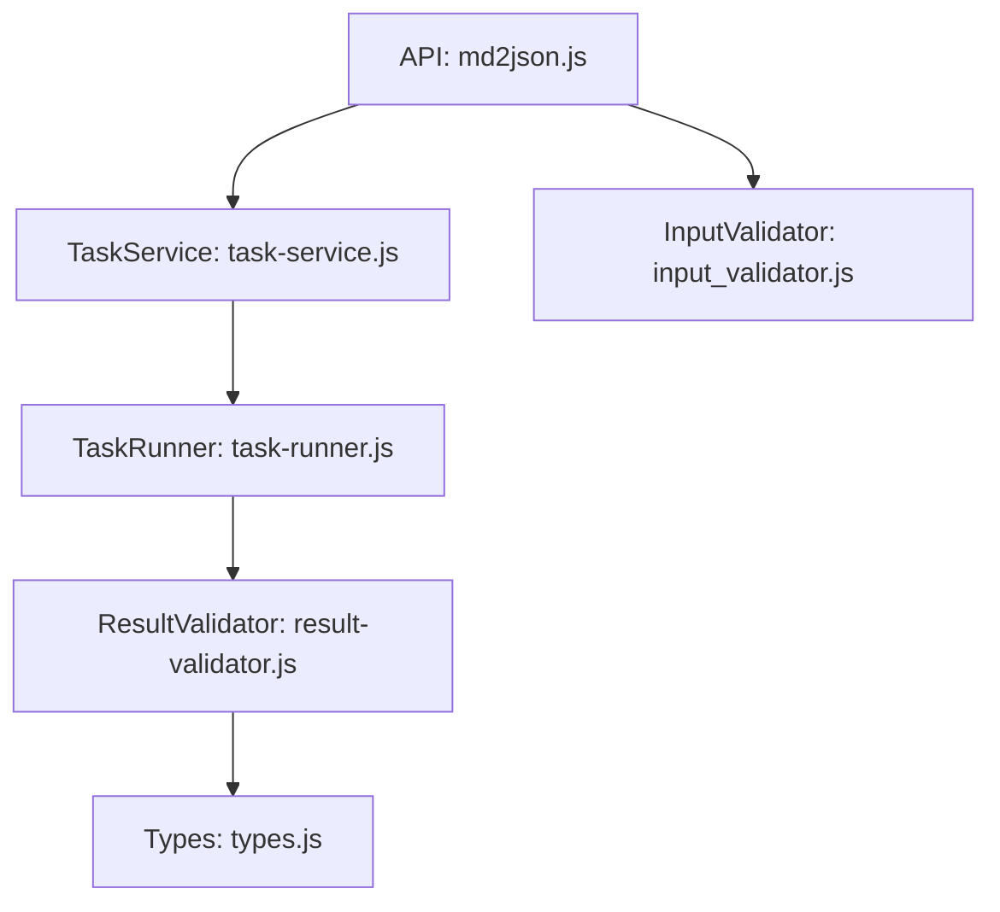
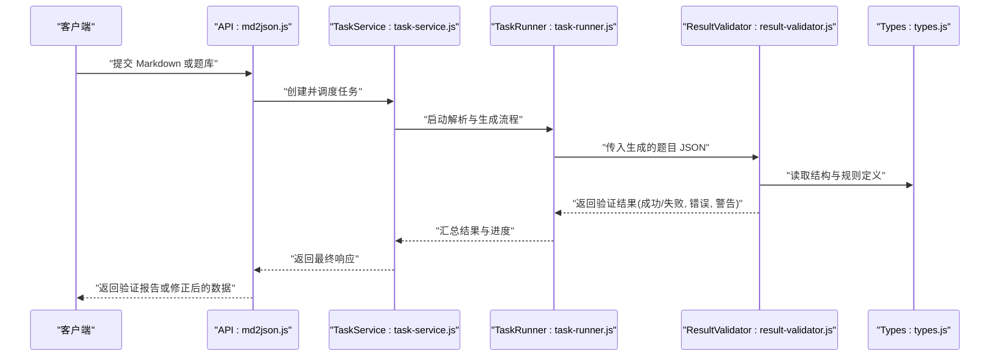
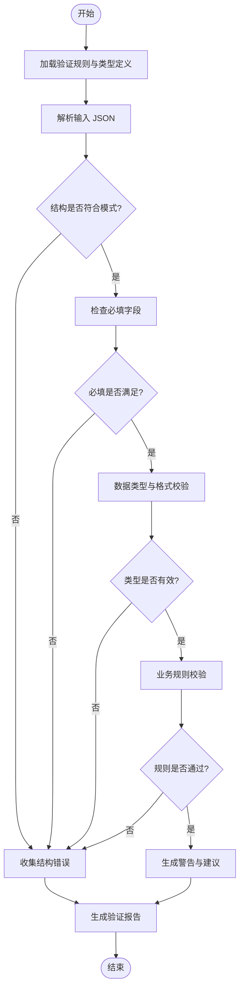
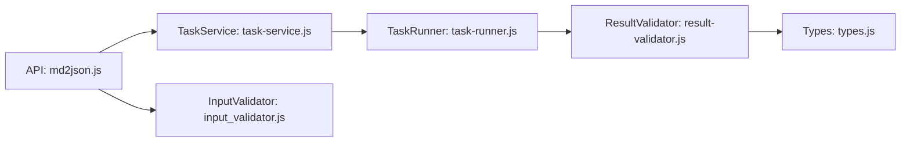

# 结果验证器

<cite>
**本文引用的文件**   
- [result-validator.js](file://node-jinmao/service/md2quiz/result-validator.js)
- [types.js](file://node-jinmao/service/md2quiz/types.js)
- [task-runner.js](file://node-jinmao/service/md2quiz/task-runner.js)
- [task-service.js](file://node-jinmao/service/md2quiz/task-service.js)
- [md2json.js](file://node-jinmao/API/quiz/md2json.js)
- [input_validator.js](file://node-jinmao/utils/input_validator.js)
</cite>

## 目录
1. [简介](#简介)
2. [项目结构](#项目结构)
3. [核心组件](#核心组件)
4. [架构总览](#架构总览)
5. [详细组件分析](#详细组件分析)
6. [依赖关系分析](#依赖关系分析)
7. [性能考量](#性能考量)
8. [故障排查指南](#故障排查指南)
9. [结论](#结论)
10. [附录](#附录)

## 简介
本文件围绕“结果验证器”展开，聚焦于生成题目的质量验证流程与实现细节。内容涵盖：
- 格式校验、完整性检查、一致性验证
- 核心功能：JSON 结构验证、必填字段检查、数据类型验证、业务规则校验
- 验证规则配置：自定义验证函数、正则表达式规则、条件验证逻辑
- 验证结果格式：成功状态、错误信息、警告提示等
- 批量验证机制：进度跟踪、错误汇总、重试策略
- 自动修复与人工审核流程说明

## 项目结构
与结果验证器相关的代码主要位于后端服务模块中，关键文件包括：
- 验证器实现：service/md2quiz/result-validator.js
- 类型定义：service/md2quiz/types.js
- 任务执行与服务编排：service/md2quiz/task-runner.js、service/md2quiz/task-service.js
- API 入口（Markdown 转 JSON）：API/quiz/md2json.js
- 输入校验工具：utils/input_validator.js

**图表来源**
- [md2json.js](file://node-jinmao/API/quiz/md2json.js)
- [task-service.js](file://node-jinmao/service/md2quiz/task-service.js)
- [task-runner.js](file://node-jinmao/service/md2quiz/task-runner.js)
- [result-validator.js](file://node-jinmao/service/md2quiz/result-validator.js)
- [types.js](file://node-jinmao/service/md2quiz/types.js)
- [input_validator.js](file://node-jinmao/utils/input_validator.js)

**章节来源**
- [result-validator.js](file://node-jinmao/service/md2quiz/result-validator.js)
- [types.js](file://node-jinmao/service/md2quiz/types.js)
- [task-runner.js](file://node-jinmao/service/md2quiz/task-runner.js)
- [task-service.js](file://node-jinmao/service/md2quiz/task-service.js)
- [md2json.js](file://node-jinmao/API/quiz/md2json.js)
- [input_validator.js](file://node-jinmao/utils/input_validator.js)

## 核心组件
- 结果验证器（ResultValidator）
  - 职责：对生成的题目 JSON 进行结构化校验、必填项检查、数据类型校验、业务规则校验；输出标准化验证结果（成功/失败、错误列表、警告列表）。
  - 能力：支持自定义验证函数、正则表达式规则、条件验证逻辑；可集成到任务流水线中进行批量处理。
- 类型定义（Types）
  - 职责：统一题目模型、验证结果模型、配置项模型，确保各模块间数据结构一致。
- 任务执行器（TaskRunner / TaskService）
  - 职责：编排 Markdown→JSON 的生成与验证流程，管理并发、重试、进度上报与错误汇总。
- 输入校验工具（InputValidator）
  - 职责：在 API 层对请求参数进行基础校验，减少无效数据进入验证管道。

**章节来源**
- [result-validator.js](file://node-jinmao/service/md2quiz/result-validator.js)
- [types.js](file://node-jinmao/service/md2quiz/types.js)
- [task-runner.js](file://node-jinmao/service/md2quiz/task-runner.js)
- [task-service.js](file://node-jinmao/service/md2quiz/task-service.js)
- [input_validator.js](file://node-jinmao/utils/input_validator.js)

## 架构总览
下图展示了从 API 调用到结果验证的核心流程，以及验证器在其中的位置与作用。

**图表来源**
- [md2json.js](file://node-jinmao/API/quiz/md2json.js)
- [task-service.js](file://node-jinmao/service/md2quiz/task-service.js)
- [task-runner.js](file://node-jinmao/service/md2quiz/task-runner.js)
- [result-validator.js](file://node-jinmao/service/md2quiz/result-validator.js)
- [types.js](file://node-jinmao/service/md2quiz/types.js)

## 详细组件分析

### 结果验证器（ResultValidator）
- 功能要点
  - JSON 结构验证：依据类型定义校验顶层对象与嵌套结构的键名、层级与数量。
  - 必填字段检查：对关键字段（如题目 ID、题干、选项、答案等）进行存在性与非空校验。
  - 数据类型验证：校验字段类型（字符串、数字、布尔、数组、对象等），必要时进行范围与格式校验。
  - 业务规则校验：例如选项数量限制、答案与选项的一致性、题型相关约束等。
  - 自定义验证函数：允许为特定字段或场景注入自定义校验逻辑。
  - 正则表达式规则：用于文本字段的格式校验（如邮箱、编号、日期等）。
  - 条件验证逻辑：根据上下文动态启用或跳过某些规则。
- 输出规范
  - 成功状态：通过所有规则时返回成功标志。
  - 错误信息：包含错误路径、错误码、错误描述，便于定位与修复。
  - 警告提示：非致命问题（如建议优化但可接受的数据）。
- 典型流程
  - 接收输入 → 加载规则 → 逐项校验 → 收集错误与警告 → 生成报告 → 返回结果

**图表来源**
- [result-validator.js](file://node-jinmao/service/md2quiz/result-validator.js)
- [types.js](file://node-jinmao/service/md2quiz/types.js)

**章节来源**
- [result-validator.js](file://node-jinmao/service/md2quiz/result-validator.js)
- [types.js](file://node-jinmao/service/md2quiz/types.js)

### 类型定义（Types）
- 作用：集中定义题目模型、验证结果模型、规则配置模型，保证验证器与其他模块之间的契约稳定。
- 关键点：
  - 题目模型：包含题型、题干、选项、答案、难度、标签等字段。
  - 验证结果模型：包含状态、错误列表、警告列表、统计信息。
  - 规则配置模型：包含字段级规则、全局规则、条件规则、正则表达式集合。

**章节来源**
- [types.js](file://node-jinmao/service/md2quiz/types.js)

### 任务执行器（TaskRunner / TaskService）
- 作用：编排 Markdown→JSON 的生成与验证流程，负责并发控制、重试、进度上报、错误汇总。
- 关键点：
  - 任务生命周期：创建、执行、验证、重试、完成、失败。
  - 进度跟踪：阶段性事件上报（开始、解析、生成、验证、完成）。
  - 错误汇总：聚合多个子任务的错误，提供统一的错误视图。
  - 重试策略：针对网络或外部依赖失败时的指数退避与最大重试次数。

**章节来源**
- [task-runner.js](file://node-jinmao/service/md2quiz/task-runner.js)
- [task-service.js](file://node-jinmao/service/md2quiz/task-service.js)

### API 入口（md2json.js）
- 作用：对外暴露 Markdown 转 JSON 的接口，接收请求参数并进行基础校验后，委托 TaskService 处理。
- 关键点：
  - 参数校验：使用 InputValidator 对请求体进行基础校验。
  - 任务调度：创建任务并返回任务 ID，支持异步查询结果。
  - 错误处理：将底层错误转换为标准 HTTP 响应。

**章节来源**
- [md2json.js](file://node-jinmao/API/quiz/md2json.js)
- [input_validator.js](file://node-jinmao/utils/input_validator.js)

## 依赖关系分析
- 模块耦合
  - API 层依赖 TaskService 进行任务编排。
  - TaskRunner 依赖 ResultValidator 进行数据质量校验。
  - ResultValidator 依赖 Types 获取结构与规则定义。
  - InputValidator 在 API 层提供前置校验，降低下游压力。
- 外部依赖
  - 可能涉及 LLM 或解析库用于 Markdown→JSON 转换（由任务执行器协调）。
  - 存储或消息队列用于任务持久化与进度上报（由任务服务协调）。

**图表来源**
- [md2json.js](file://node-jinmao/API/quiz/md2json.js)
- [task-service.js](file://node-jinmao/service/md2quiz/task-service.js)
- [task-runner.js](file://node-jinmao/service/md2quiz/task-runner.js)
- [result-validator.js](file://node-jinmao/service/md2quiz/result-validator.js)
- [types.js](file://node-jinmao/service/md2quiz/types.js)
- [input_validator.js](file://node-jinmao/utils/input_validator.js)

**章节来源**
- [md2json.js](file://node-jinmao/API/quiz/md2json.js)
- [task-service.js](file://node-jinmao/service/md2quiz/task-service.js)
- [task-runner.js](file://node-jinmao/service/md2quiz/task-runner.js)
- [result-validator.js](file://node-jinmao/service/md2quiz/result-validator.js)
- [types.js](file://node-jinmao/service/md2quiz/types.js)
- [input_validator.js](file://node-jinmao/utils/input_validator.js)

## 性能考量
- 验证阶段优化
  - 短路校验：遇到致命错误立即停止后续校验，减少不必要的计算。
  - 并行校验：对独立字段或题目条目进行并行校验，提升吞吐。
  - 规则缓存：对静态规则与正则表达式进行缓存，避免重复编译。
- 任务编排优化
  - 批处理：将大量题目拆分为批次，分批验证与上报进度。
  - 限流与背压：防止下游资源过载，保障系统稳定性。
  - 重试策略：指数退避与最大重试次数，平衡成功率与延迟。

[本节为通用指导，不直接分析具体文件]

## 故障排查指南
- 常见问题定位
  - 结构错误：检查顶层键名与嵌套层级是否符合类型定义。
  - 必填缺失：确认关键字段是否存在且非空。
  - 类型不符：核对字段类型与格式（如数字、日期、邮箱等）。
  - 业务规则冲突：检查选项数量、答案一致性、题型约束等。
- 调试建议
  - 查看验证报告中的错误路径与描述，快速定位问题字段。
  - 启用更详细的日志输出，观察验证流程各阶段的状态。
  - 使用最小可复现样本逐步缩小问题范围。
- 修复建议
  - 根据错误信息进行数据修正或补充缺失字段。
  - 调整验证规则以适配新的业务需求（谨慎评估影响面）。
  - 对于复杂规则，优先通过自定义验证函数实现清晰逻辑。

**章节来源**
- [result-validator.js](file://node-jinmao/service/md2quiz/result-validator.js)
- [types.js](file://node-jinmao/service/md2quiz/types.js)

## 结论
结果验证器在题目生成流程中扮演关键角色，通过严格的格式校验、完整性检查与一致性验证，确保输出的题目数据质量。结合任务编排与批量处理机制，能够在高并发场景下保持稳定与高效。通过清晰的验证结果格式与完善的故障排查指南，开发者可以快速定位与修复问题，提升整体系统的可靠性与可维护性。

[本节为总结性内容，不直接分析具体文件]

## 附录
- 验证规则配置示例（概念性说明）
  - 自定义验证函数：为特定字段编写校验逻辑，返回成功或错误信息。
  - 正则表达式规则：定义字段格式匹配规则，如编号、日期、邮箱等。
  - 条件验证逻辑：根据上下文动态启用或禁用某些规则。
- 批量验证处理机制（概念性说明）
  - 进度跟踪：分阶段上报任务进度，便于前端展示与用户反馈。
  - 错误汇总：聚合所有子任务的错误，提供统一视图与导出能力。
  - 重试策略：对失败任务进行指数退避重试，提高成功率。
- 自动修复与人工审核（概念性说明）
  - 自动修复：对常见错误进行自动修正（如补齐默认值、规范化格式）。
  - 人工审核：对无法自动修复的问题标记并转入人工审核流程。

[本节为概念性内容，不直接分析具体文件]