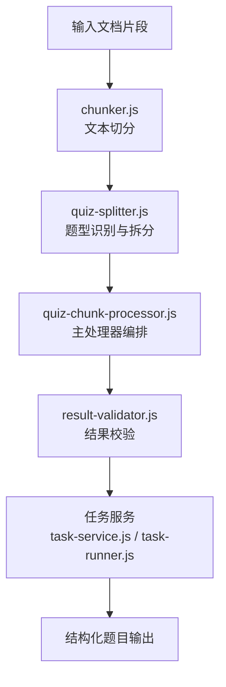
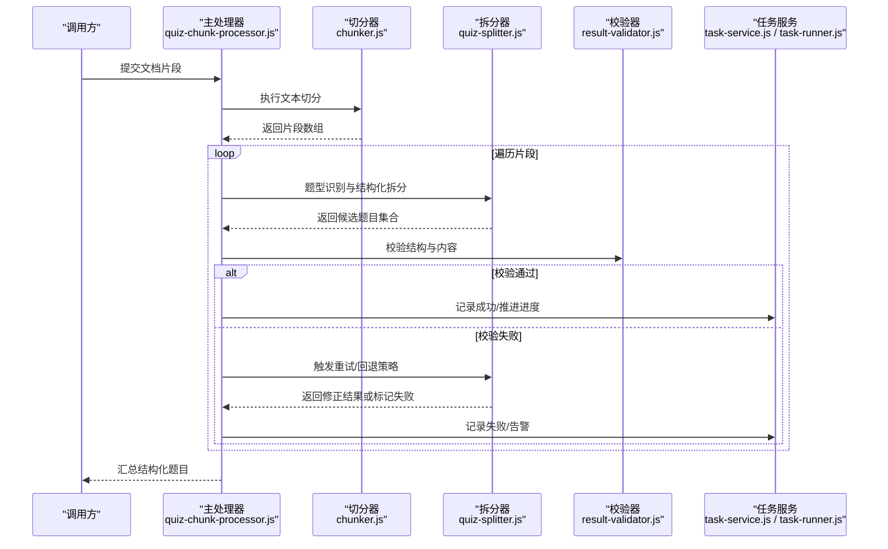
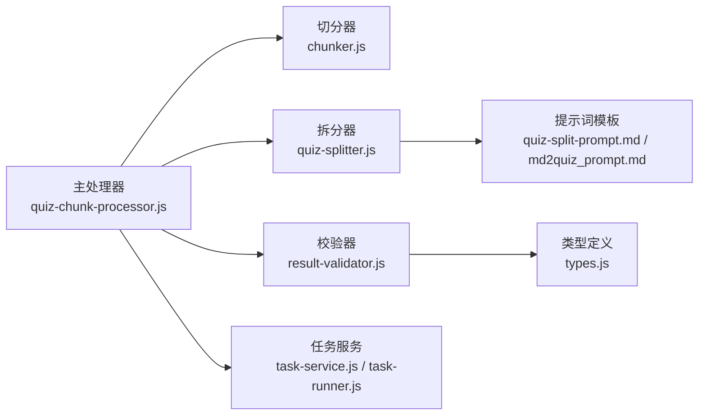

# 题目分块处理器

<cite>
**本文引用的文件**   
- [quiz-chunk-processor.js](file://node-jinmao/service/md2quiz/quiz-chunk-processor.js)
- [chunker.js](file://node-jinmao/service/md2quiz/chunker.js)
- [quiz-splitter.js](file://node-jinmao/service/md2quiz/quiz-splitter.js)
- [result-validator.js](file://node-jinmao/service/md2quiz/result-validator.js)
- [task-runner.js](file://node-jinmao/service/md2quiz/task-runner.js)
- [task-service.js](file://node-jinmao/service/md2quiz/task-service.js)
- [types.js](file://node-jinmao/service/md2quiz/types.js)
- [md2quiz_prompt.md](file://node-jinmao/config/md2quiz_prompt.md)
- [quiz-format-prompt.md](file://node-jinmao/config/quiz-format-prompt.md)
- [quiz-split-prompt.md](file://node-jinmao/config/quiz-split-prompt.md)
</cite>

## 目录
1. [简介](#简介)
2. [项目结构](#项目结构)
3. [核心组件](#核心组件)
4. [架构总览](#架构总览)
5. [详细组件分析](#详细组件分析)
6. [依赖关系分析](#依赖关系分析)
7. [性能考量](#性能考量)
8. [故障排查指南](#故障排查指南)
9. [结论](#结论)
10. [附录](#附录)

## 简介
本文件面向“题目分块处理器”，系统化说明从文档片段到结构化题目的完整处理流程，包括题型自动识别、内容解析算法与答案提取机制。处理器核心能力涵盖文本模式匹配、关键词提取、选项识别与答案定位；支持选择题、填空题、判断题、简答题等常见题型。同时提供配置模板说明（题型定义、正则表达式、验证规则等），并给出典型处理示例与错误处理策略（解析失败回退、数据完整性检查、批量容错）。

## 项目结构
与题目分块处理相关的代码集中在 node-jinmao/service/md2quiz 目录下，配合 config 中的提示词模板共同完成“切分—解析—校验—输出”的流水线。关键文件职责如下：
- chunker.js：将输入文本按语义或规则切分为多个片段（块）
- quiz-splitter.js：基于提示词对片段进行题型识别与结构化拆分
- quiz-chunk-processor.js：串联切分、解析、校验、落盘/返回的主处理器
- result-validator.js：对解析结果进行格式与一致性校验
- task-runner.js / task-service.js：任务编排、并发控制与状态管理
- types.js：统一的数据类型定义与接口契约
- md2quiz_prompt.md / quiz-format-prompt.md / quiz-split-prompt.md：LLM 提示词模板，驱动题型识别与格式化

**图表来源** 
- [chunker.js](file://node-jinmao/service/md2quiz/chunker.js)
- [quiz-splitter.js](file://node-jinmao/service/md2quiz/quiz-splitter.js)
- [quiz-chunk-processor.js](file://node-jinmao/service/md2quiz/quiz-chunk-processor.js)
- [result-validator.js](file://node-jinmao/service/md2quiz/result-validator.js)
- [task-service.js](file://node-jinmao/service/md2quiz/task-service.js)
- [task-runner.js](file://node-jinmao/service/md2quiz/task-runner.js)

**章节来源**
- [chunker.js](file://node-jinmao/service/md2quiz/chunker.js)
- [quiz-splitter.js](file://node-jinmao/service/md2quiz/quiz-splitter.js)
- [quiz-chunk-processor.js](file://node-jinmao/service/md2quiz/quiz-chunk-processor.js)
- [result-validator.js](file://node-jinmao/service/md2quiz/result-validator.js)
- [task-service.js](file://node-jinmao/service/md2quiz/task-service.js)
- [task-runner.js](file://node-jinmao/service/md2quiz/task-runner.js)
- [types.js](file://node-jinmao/service/md2quiz/types.js)
- [md2quiz_prompt.md](file://node-jinmao/config/md2quiz_prompt.md)
- [quiz-format-prompt.md](file://node-jinmao/config/quiz-format-prompt.md)
- [quiz-split-prompt.md](file://node-jinmao/config/quiz-split-prompt.md)

## 核心组件
- 文本切分器（chunker.js）
  - 功能：依据段落、标题、空行、列表等规则将长文切分为可处理的片段
  - 关键点：保持上下文连贯性、避免跨题切割、保留编号与层级信息
- 题型拆分器（quiz-splitter.js）
  - 功能：调用 LLM 提示词模板，对每个片段进行题型识别与结构化拆分
  - 关键点：题型自动识别、题干/选项/答案抽取、多题型混合处理
- 主处理器（quiz-chunk-processor.js）
  - 功能：协调切分、拆分、校验、重试、聚合与输出
  - 关键点：批处理、错误隔离、进度上报、结果合并
- 结果校验器（result-validator.js）
  - 功能：校验 JSON 结构、字段必填、选项合法性、答案有效性
  - 关键点：强类型约束、边界值检查、修复建议生成
- 任务服务（task-service.js / task-runner.js）
  - 功能：任务生命周期管理、并发调度、失败重试、持久化
  - 关键点：幂等性、超时控制、资源清理

**章节来源**
- [chunker.js](file://node-jinmao/service/md2quiz/chunker.js)
- [quiz-splitter.js](file://node-jinmao/service/md2quiz/quiz-splitter.js)
- [quiz-chunk-processor.js](file://node-jinmao/service/md2quiz/quiz-chunk-processor.js)
- [result-validator.js](file://node-jinmao/service/md2quiz/result-validator.js)
- [task-service.js](file://node-jinmao/service/md2quiz/task-service.js)
- [task-runner.js](file://node-jinmao/service/md2quiz/task-runner.js)
- [types.js](file://node-jinmao/service/md2quiz/types.js)

## 架构总览
下图展示从输入到输出的端到端流程，以及各模块之间的交互关系。

**图表来源** 
- [quiz-chunk-processor.js](file://node-jinmao/service/md2quiz/quiz-chunk-processor.js)
- [chunker.js](file://node-jinmao/service/md2quiz/chunker.js)
- [quiz-splitter.js](file://node-jinmao/service/md2quiz/quiz-splitter.js)
- [result-validator.js](file://node-jinmao/service/md2quiz/result-validator.js)
- [task-service.js](file://node-jinmao/service/md2quiz/task-service.js)
- [task-runner.js](file://node-jinmao/service/md2quiz/task-runner.js)

## 详细组件分析

### 文本切分器（chunker.js）
- 目标：将原始文本划分为若干“可独立解析”的片段
- 策略要点：
  - 基于标题层级、空行、列表项进行边界判定
  - 尽量保持题干与选项在同一块内，避免跨块割裂
  - 保留序号、标点与特殊符号，便于后续模式匹配
- 复杂度：线性扫描 O(n)，n 为字符数；必要时结合正则匹配提升效率
- 优化点：
  - 预计算段落索引，减少重复扫描
  - 对超长片段进行二次切分，保证下游处理稳定性

**章节来源**
- [chunker.js](file://node-jinmao/service/md2quiz/chunker.js)

### 题型拆分器（quiz-splitter.js）
- 目标：对每个片段进行题型识别与结构化拆分
- 支持的题型：
  - 选择题（单选/多选）
  - 填空题
  - 判断题
  - 简答题
- 处理流程：
  - 加载提示词模板（quiz-split-prompt.md / md2quiz_prompt.md）
  - 构造上下文与样例，调用 LLM 进行识别与抽取
  - 标准化输出为统一的结构体（题干、选项、答案、难度、标签等）
- 关键词与模式：
  - 选择题：识别“选项标识符”（如 A/B/C/D）、括号、顿号分隔
  - 填空题：识别下划线、占位符、括号填空
  - 判断题：识别“正确/错误”“√/×”等表述
  - 简答题：无固定选项，需提取问题与参考答案要点
- 异常处理：
  - 若 LLM 返回非标准结构，进入修复流程或降级为默认题型

**章节来源**
- [quiz-splitter.js](file://node-jinmao/service/md2quiz/quiz-splitter.js)
- [quiz-split-prompt.md](file://node-jinmao/config/quiz-split-prompt.md)
- [md2quiz_prompt.md](file://node-jinmao/config/md2quiz_prompt.md)

### 主处理器（quiz-chunk-processor.js）
- 目标：编排切分、拆分、校验、重试、聚合与输出
- 关键逻辑：
  - 批量读取片段，维护任务队列与进度
  - 对每个片段调用拆分器，收集候选题目
  - 调用校验器进行结构性与业务规则校验
  - 失败时执行回退策略（重试、降级、跳过并记录）
  - 最终聚合为统一的题目列表并返回
- 并发与容错：
  - 限制并发度，避免资源争用
  - 单个片段失败不影响整体批次
  - 记录失败原因与上下文，便于后续人工复核

**章节来源**
- [quiz-chunk-processor.js](file://node-jinmao/service/md2quiz/quiz-chunk-processor.js)
- [task-service.js](file://node-jinmao/service/md2quiz/task-service.js)
- [task-runner.js](file://node-jinmao/service/md2quiz/task-runner.js)

### 结果校验器（result-validator.js）
- 目标：确保输出符合统一数据结构与业务约束
- 校验维度：
  - 结构校验：必填字段、类型、枚举值
  - 内容校验：选项数量、答案存在性、题干长度
  - 一致性校验：多选题答案与选项对应关系
- 修复策略：
  - 自动修复轻微不一致（如去除多余空格、规范化选项标识）
  - 无法修复则标记失败并保留原始片段以便人工处理

**章节来源**
- [result-validator.js](file://node-jinmao/service/md2quiz/result-validator.js)
- [types.js](file://node-jinmao/service/md2quiz/types.js)

### 任务服务（task-service.js / task-runner.js）
- 目标：管理任务生命周期、并发调度、失败重试与持久化
- 能力：
  - 任务创建、状态流转（待处理/处理中/成功/失败）
  - 重试策略（指数退避、最大次数）
  - 进度上报与日志记录
  - 资源清理与超时控制

**章节来源**
- [task-service.js](file://node-jinmao/service/md2quiz/task-service.js)
- [task-runner.js](file://node-jinmao/service/md2quiz/task-runner.js)

## 依赖关系分析
- 模块耦合：
  - 主处理器依赖切分器、拆分器、校验器与任务服务
  - 拆分器依赖提示词模板与 LLM 客户端（由上层注入）
  - 校验器依赖类型定义与业务规则
- 外部依赖：
  - LLM 服务（用于题型识别与结构化抽取）
  - 存储/消息通道（用于任务持久化与进度上报）

**图表来源** 
- [quiz-chunk-processor.js](file://node-jinmao/service/md2quiz/quiz-chunk-processor.js)
- [chunker.js](file://node-jinmao/service/md2quiz/chunker.js)
- [quiz-splitter.js](file://node-jinmao/service/md2quiz/quiz-splitter.js)
- [result-validator.js](file://node-jinmao/service/md2quiz/result-validator.js)
- [task-service.js](file://node-jinmao/service/md2quiz/task-service.js)
- [task-runner.js](file://node-jinmao/service/md2quiz/task-runner.js)
- [quiz-split-prompt.md](file://node-jinmao/config/quiz-split-prompt.md)
- [md2quiz_prompt.md](file://node-jinmao/config/md2quiz_prompt.md)
- [types.js](file://node-jinmao/service/md2quiz/types.js)

**章节来源**
- [quiz-chunk-processor.js](file://node-jinmao/service/md2quiz/quiz-chunk-processor.js)
- [chunker.js](file://node-jinmao/service/md2quiz/chunker.js)
- [quiz-splitter.js](file://node-jinmao/service/md2quiz/quiz-splitter.js)
- [result-validator.js](file://node-jinmao/service/md2quiz/result-validator.js)
- [task-service.js](file://node-jinmao/service/md2quiz/task-service.js)
- [task-runner.js](file://node-jinmao/service/md2quiz/task-runner.js)
- [quiz-split-prompt.md](file://node-jinmao/config/quiz-split-prompt.md)
- [md2quiz_prompt.md](file://node-jinmao/config/md2quiz_prompt.md)
- [types.js](file://node-jinmao/service/md2quiz/types.js)

## 性能考量
- 切分阶段：采用线性扫描与缓存索引，降低重复计算
- 拆分阶段：限制并发调用 LLM，避免限流与超时；对短片段优先本地规则快速判断
- 校验阶段：尽早失败（fail-fast），减少无效后续处理
- 批处理：合理设置批次大小与并发度，平衡吞吐与内存占用
- 重试策略：指数退避与最大重试次数，避免雪崩

[本节为通用指导，不直接分析具体文件]

## 故障排查指南
- 常见问题：
  - 题型识别错误：检查提示词模板与输入片段质量，必要时增加样例
  - 选项识别失败：确认选项标识符规范（A/B/C/D 或中文序号），调整正则
  - 答案缺失或不一致：查看校验器错误详情，定位片段位置
  - 任务失败：检查任务服务日志、重试计数与超时配置
- 排查步骤：
  - 启用详细日志，记录片段内容与中间结果
  - 使用最小可复现片段进行单测
  - 逐步关闭 LLM 调用，回归本地规则路径定位问题
- 回退策略：
  - 单次失败重试一次后仍失败，则标记失败并保留原始片段
  - 批量处理中允许部分失败，最终输出成功与失败清单

**章节来源**
- [result-validator.js](file://node-jinmao/service/md2quiz/result-validator.js)
- [task-service.js](file://node-jinmao/service/md2quiz/task-service.js)
- [task-runner.js](file://node-jinmao/service/md2quiz/task-runner.js)

## 结论
题目分块处理器通过“切分—识别—解析—校验—编排”的流水线，实现了从非结构化文档片段到结构化题目的自动化转换。其核心在于灵活的题型识别、稳健的解析与校验机制，以及完善的任务管理与容错策略。通过配置模板与规则扩展，系统可适配多种题型与领域语料，满足大规模题库构建需求。

[本节为总结性内容，不直接分析具体文件]

## 附录

### 支持的题型与识别要点
- 选择题（单选/多选）
  - 识别要点：选项标识符、并列分隔、答案标注
  - 关键词：A/B/C/D、①②③④、括号、顿号
- 填空题
  - 识别要点：下划线、占位符、括号填空
  - 关键词：____、（ ）、【 】
- 判断题
  - 识别要点：正确/错误、√/×、是非题表述
  - 关键词：正确、错误、是、否
- 简答题
  - 识别要点：开放式问题、参考答案要点
  - 关键词：简述、说明、论述

[本节为概念性说明，不直接分析具体文件]

### 配置模板说明
- 题型定义
  - 在提示词模板中定义题型枚举与字段映射
  - 示例键名：题型名称、字段列表、必填项、默认值
- 正则表达式
  - 用于选项识别、答案定位、占位符匹配
  - 示例键名：选项模式、答案模式、填空模式
- 验证规则
  - 字段类型、取值范围、关联一致性
  - 示例键名：最小长度、最大选项数、答案集合校验

**章节来源**
- [quiz-split-prompt.md](file://node-jinmao/config/quiz-split-prompt.md)
- [md2quiz_prompt.md](file://node-jinmao/config/md2quiz_prompt.md)
- [quiz-format-prompt.md](file://node-jinmao/config/quiz-format-prompt.md)
- [types.js](file://node-jinmao/service/md2quiz/types.js)

### 处理示例（示意）
- 选择题示例
  - 输入片段包含题干与四个选项，处理器识别题型为“单选题”，抽取题干、选项与答案
  - 输出结构包含题型、题干、选项数组、正确答案索引
- 填空题示例
  - 输入片段含下划线占位，处理器识别题型为“填空题”，抽取题干与填空位置
  - 输出结构包含题型、题干、填空索引与参考答案
- 判断题示例
  - 输入片段含“正确/错误”表述，处理器识别题型为“判断题”，抽取题干与答案
  - 输出结构包含题型、题干、布尔答案
- 简答题示例
  - 输入片段为开放问题，处理器识别题型为“简答题”，抽取题干与参考答案要点
  - 输出结构包含题型、题干、答案要点列表

[本节为概念性示例，不直接分析具体文件]