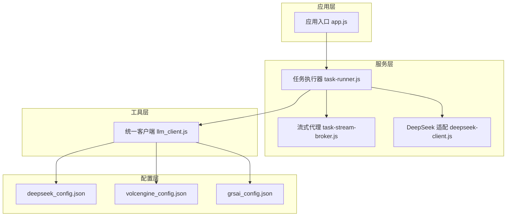
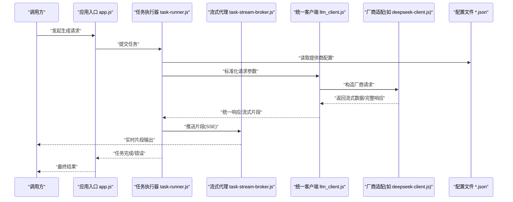
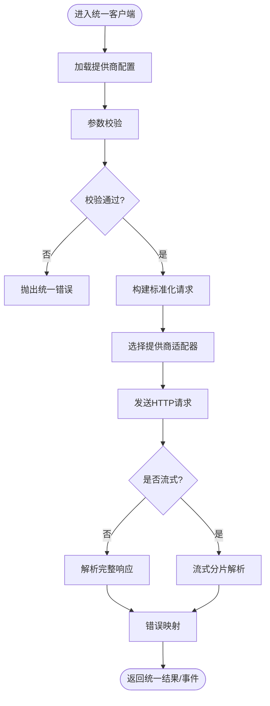
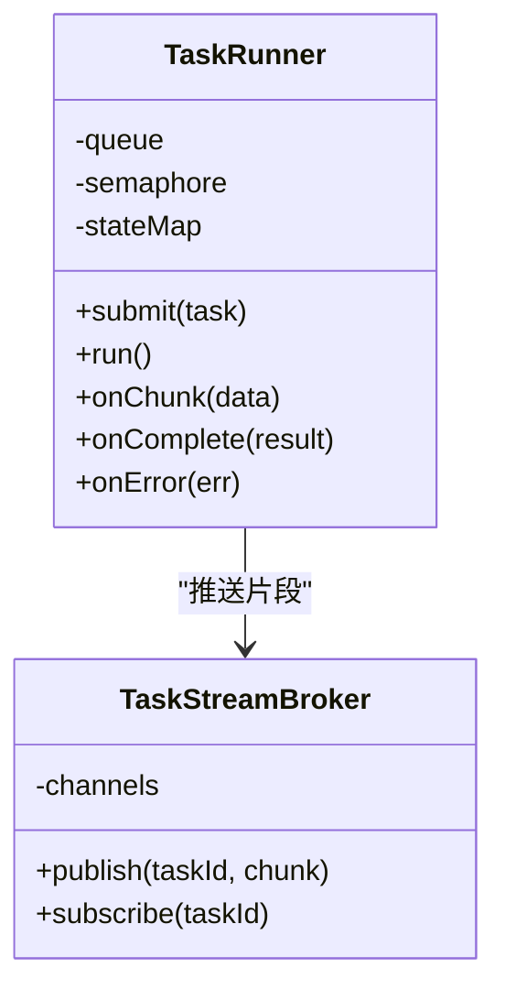
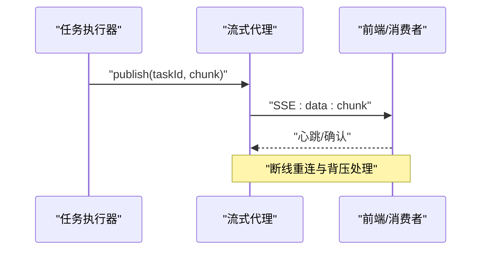
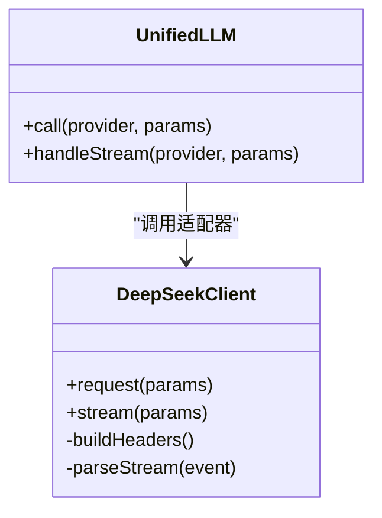
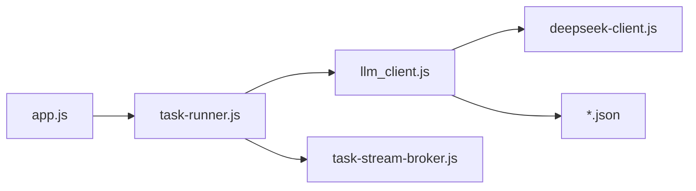

# 大语言模型客户端

<cite>
**本文档引用的文件**   
- [llm_client.js](file://node-jinmao/utils/llm_client.js)
- [deepseek_config.json](file://node-jinmao/config/deepseek_config.json)
- [volcengine_config.json](file://node-jinmao/config/volcengine_config.json)
- [grsai_config.json](file://node-jinmao/config/grsai_config.json)
- [deepseek-client.js](file://node-jinmao/service/md2quiz/deepseek-client.js)
- [task-runner.js](file://node-jinmao/service/md2quiz/task-runner.js)
- [task-stream-broker.js](file://node-jinmao/service/md2quiz/task-stream-broker.js)
- [app.js](file://node-jinmao/app.js)
</cite>

## 目录
1. [简介](#简介)
2. [项目结构](#项目结构)
3. [核心组件](#核心组件)
4. [架构总览](#架构总览)
5. [详细组件分析](#详细组件分析)
6. [依赖关系分析](#依赖关系分析)
7. [性能考虑](#性能考虑)
8. [故障排除指南](#故障排除指南)
9. [结论](#结论)
10. [附录](#附录)

## 简介
本文件面向“大语言模型客户端”的实现与使用，围绕多提供商统一接口封装、配置管理、密钥安全、请求构建、响应处理（含流式）、错误码映射、重试策略、并发调用、性能监控与日志记录等主题进行系统化说明。目标读者包括后端开发者、运维人员以及需要集成多种LLM服务的业务工程师。

## 项目结构
本项目在 Node.js 后端中通过 utils 层提供统一的 LLM 客户端能力，并通过 service 层的任务编排与流式消息分发，将不同厂商的 API 抽象为一致的调用方式。关键目录与职责如下：
- node-jinmao/utils/llm_client.js：统一 LLM 客户端实现，负责多提供商路由、参数标准化、超时控制、重试与错误映射。
- node-jinmao/config/*.json：各提供商的配置与密钥存放位置，支持热加载与轮换。
- node-jinmao/service/md2quiz/deepseek-client.js：针对 DeepSeek 的专用客户端适配层。
- node-jinmao/service/md2quiz/task-runner.js：任务调度与执行器，协调 LLM 调用与结果聚合。
- node-jinmao/service/md2quiz/task-stream-broker.js：SSE/流式消息代理，用于实时推送生成片段。
- node-jinmao/app.js：应用入口，注册中间件、路由与服务生命周期管理。

图表来源
- [app.js](file://node-jinmao/app.js)
- [task-runner.js](file://node-jinmao/service/md2quiz/task-runner.js)
- [task-stream-broker.js](file://node-jinmao/service/md2quiz/task-stream-broker.js)
- [deepseek-client.js](file://node-jinmao/service/md2quiz/deepseek-client.js)
- [llm_client.js](file://node-jinmao/utils/llm_client.js)
- [deepseek_config.json](file://node-jinmao/config/deepseek_config.json)
- [volcengine_config.json](file://node-jinmao/config/volcengine_config.json)
- [grsai_config.json](file://node-jinmao/config/grsai_config.json)

章节来源
- [app.js](file://node-jinmao/app.js)
- [llm_client.js](file://node-jinmao/utils/llm_client.js)
- [task-runner.js](file://node-jinmao/service/md2quiz/task-runner.js)
- [task-stream-broker.js](file://node-jinmao/service/md2quiz/task-stream-broker.js)
- [deepseek-client.js](file://node-jinmao/service/md2quiz/deepseek-client.js)
- [deepseek_config.json](file://node-jinmao/config/deepseek_config.json)
- [volcengine_config.json](file://node-jinmao/config/volcengine_config.json)
- [grsai_config.json](file://node-jinmao/config/grsai_config.json)

## 核心组件
- 统一 LLM 客户端（utils/llm_client.js）
  - 多提供商路由：根据配置选择具体供应商（如 DeepSeek、火山引擎、GRSAI）。
  - 参数标准化：将上层业务参数转换为各厂商要求的消息格式与请求体。
  - 超时与重试：可配置的请求超时、指数退避重试、幂等键（可选）。
  - 错误映射：将各厂商错误码映射为统一错误类型，便于上层处理。
  - 流式支持：对 SSE/流式响应进行分片解析并回调或事件上报。
- 任务执行器（service/md2quiz/task-runner.js）
  - 任务队列与并发控制：限制并发度、避免过载。
  - 结果聚合与状态机：跟踪任务进度、失败重试、最终落库。
  - 与流式代理协作：将流式片段转发给前端或下游消费者。
- 流式代理（service/md2quiz/task-stream-broker.js）
  - 基于 SSE 的实时推送：按块推送 token/片段，减少首字节延迟。
  - 断线重连与背压：处理网络抖动与下游消费慢的场景。
- 厂商适配层（service/md2quiz/deepseek-client.js）
  - 特定于 DeepSeek 的请求构造、鉴权头、流式协议细节。
  - 与统一客户端解耦，保持扩展性。

章节来源
- [llm_client.js](file://node-jinmao/utils/llm_client.js)
- [task-runner.js](file://node-jinmao/service/md2quiz/task-runner.js)
- [task-stream-broker.js](file://node-jinmao/service/md2quiz/task-stream-broker.js)
- [deepseek-client.js](file://node-jinmao/service/md2quiz/deepseek-client.js)

## 架构总览
下图展示了从应用入口到 LLM 客户端及流式代理的整体交互流程，体现统一接口封装与多提供商支持。

图表来源
- [app.js](file://node-jinmao/app.js)
- [task-runner.js](file://node-jinmao/service/md2quiz/task-runner.js)
- [task-stream-broker.js](file://node-jinmao/service/md2quiz/task-stream-broker.js)
- [llm_client.js](file://node-jinmao/utils/llm_client.js)
- [deepseek-client.js](file://node-jinmao/service/md2quiz/deepseek-client.js)
- [deepseek_config.json](file://node-jinmao/config/deepseek_config.json)
- [volcengine_config.json](file://node-jinmao/config/volcengine_config.json)
- [grsai_config.json](file://node-jinmao/config/grsai_config.json)

## 详细组件分析

### 统一 LLM 客户端（utils/llm_client.js）
- 设计要点
  - 配置驱动：从 config/*.json 动态加载提供商信息（端点、鉴权、超时、重试次数等）。
  - 消息标准化：将业务消息转换为各厂商所需的系统/用户/助手消息结构。
  - 参数校验：对必填字段、长度、频率限制等进行前置校验。
  - 超时与重试：支持全局与按请求级别的超时；指数退避重试，区分可重试错误。
  - 错误映射：将各厂商错误码映射为统一错误对象，包含 code、message、retryable。
  - 流式处理：对 SSE/流式响应进行分片解析，触发 onChunk/onDone 回调。
- 典型调用路径
  - 构建请求 -> 校验参数 -> 选择提供商 -> 发送请求 -> 处理响应/流 -> 统一返回。

图表来源
- [llm_client.js](file://node-jinmao/utils/llm_client.js)

章节来源
- [llm_client.js](file://node-jinmao/utils/llm_client.js)

### 任务执行器（service/md2quiz/task-runner.js）
- 设计要点
  - 并发控制：通过信号量/队列限制同时运行的 LLM 任务数，保护下游服务。
  - 任务状态机：pending -> running -> success | failed，支持持久化。
  - 重试策略：结合统一客户端的重试能力，对瞬时错误进行自动恢复。
  - 结果聚合：合并多次流式片段，形成最终文本或结构化结果。
- 与流式代理协作
  - 将每个任务的流式片段推送到 broker，供前端实时展示。

图表来源
- [task-runner.js](file://node-jinmao/service/md2quiz/task-runner.js)
- [task-stream-broker.js](file://node-jinmao/service/md2quiz/task-stream-broker.js)

章节来源
- [task-runner.js](file://node-jinmao/service/md2quiz/task-runner.js)
- [task-stream-broker.js](file://node-jinmao/service/md2quiz/task-stream-broker.js)

### 流式代理（service/md2quiz/task-stream-broker.js）
- 设计要点
  - SSE 通道：为每个任务维护独立通道，保证片段有序到达。
  - 背压处理：当消费者慢时，缓冲与丢弃策略可配置。
  - 断线重连：客户端断开后自动清理资源，必要时重建连接。
- 与执行器协作
  - 接收来自执行器的片段，广播给订阅者。

图表来源
- [task-stream-broker.js](file://node-jinmao/service/md2quiz/task-stream-broker.js)

章节来源
- [task-stream-broker.js](file://node-jinmao/service/md2quiz/task-stream-broker.js)

### 厂商适配层（service/md2quiz/deepseek-client.js）
- 设计要点
  - 鉴权：注入 API Key/签名头等。
  - 请求构造：遵循 DeepSeek 的消息结构与参数命名。
  - 流式协议：处理 SSE 事件类型与数据格式。
  - 错误映射：将 DeepSeek 的错误码映射为统一错误对象。
- 与统一客户端协作
  - 作为提供商适配器被统一客户端调用，屏蔽差异。

图表来源
- [deepseek-client.js](file://node-jinmao/service/md2quiz/deepseek-client.js)
- [llm_client.js](file://node-jinmao/utils/llm_client.js)

章节来源
- [deepseek-client.js](file://node-jinmao/service/md2quiz/deepseek-client.js)
- [llm_client.js](file://node-jinmao/utils/llm_client.js)

### 配置管理与密钥安全
- 配置文件结构（示例字段说明）
  - deepseek_config.json：包含端点、模型名、API Key、超时、重试次数等。
  - volcengine_config.json：火山引擎相关配置。
  - grsai_config.json：GRSAI 相关配置。
- 密钥存储与轮换
  - 建议将敏感字段（如 API Key）置于环境变量或密钥管理服务，运行时注入到配置对象。
  - 支持热重载：监听配置文件变更，重新加载配置而不重启进程。
  - 轮换机制：新旧密钥并存期，逐步切换流量至新密钥，失败回滚。

章节来源
- [deepseek_config.json](file://node-jinmao/config/deepseek_config.json)
- [volcengine_config.json](file://node-jinmao/config/volcengine_config.json)
- [grsai_config.json](file://node-jinmao/config/grsai_config.json)

## 依赖关系分析
- 模块耦合
  - 应用入口依赖任务执行器；任务执行器依赖统一客户端与流式代理；统一客户端依赖厂商适配器与配置文件。
- 外部依赖
  - HTTP 客户端（如 axios/fetch）、SSE 库（如需）、日志与监控 SDK。
- 潜在循环依赖
  - 通过分层与接口隔离避免循环；统一客户端仅依赖配置与适配器，不反向依赖执行器。

图表来源
- [app.js](file://node-jinmao/app.js)
- [task-runner.js](file://node-jinmao/service/md2quiz/task-runner.js)
- [task-stream-broker.js](file://node-jinmao/service/md2quiz/task-stream-broker.js)
- [llm_client.js](file://node-jinmao/utils/llm_client.js)
- [deepseek-client.js](file://node-jinmao/service/md2quiz/deepseek-client.js)
- [deepseek_config.json](file://node-jinmao/config/deepseek_config.json)
- [volcengine_config.json](file://node-jinmao/config/volcengine_config.json)
- [grsai_config.json](file://node-jinmao/config/grsai_config.json)

章节来源
- [app.js](file://node-jinmao/app.js)
- [task-runner.js](file://node-jinmao/service/md2quiz/task-runner.js)
- [task-stream-broker.js](file://node-jinmao/service/md2quiz/task-stream-broker.js)
- [llm_client.js](file://node-jinmao/utils/llm_client.js)
- [deepseek-client.js](file://node-jinmao/service/md2quiz/deepseek-client.js)
- [deepseek_config.json](file://node-jinmao/config/deepseek_config.json)
- [volcengine_config.json](file://node-jinmao/config/volcengine_config.json)
- [grsai_config.json](file://node-jinmao/config/grsai_config.json)

## 性能考虑
- 并发与限流
  - 使用信号量/队列限制并发任务数，避免下游限流或崩溃。
  - 针对不同提供商设置独立的并发上限与超时。
- 流式优化
  - 优先使用流式接口，降低首字节延迟与内存占用。
  - 合理设置缓冲区大小，避免过多累积导致内存峰值。
- 重试与熔断
  - 对瞬时错误（网络抖动、5xx）启用指数退避重试。
  - 对持续失败的服务开启熔断，快速失败并降级。
- 监控与日志
  - 记录关键指标：QPS、P95/P99 延迟、错误率、重试次数、流式片段速率。
  - 结构化日志，包含请求 ID、提供商、模型、耗时、状态码。

[本节为通用指导，不直接分析具体文件]

## 故障排除指南
- 常见问题与定位
  - 鉴权失败：检查 API Key 是否正确、是否过期、权限范围是否足够。
  - 超时/限流：调整超时与重试策略，检查上游限流阈值。
  - 流式中断：检查网络稳定性、SSE 心跳与重连逻辑。
  - 参数错误：核对消息格式、必填字段、长度限制。
- 诊断步骤
  - 查看统一客户端的错误映射与日志，确认错误码与重试标记。
  - 检查任务执行器的状态机与重试计数。
  - 验证配置文件与密钥注入是否正确。
- 常见错误码映射
  - 401/403：鉴权失败，需刷新密钥或检查权限。
  - 429：限流，增加重试间隔或降低并发。
  - 5xx：服务端错误，启用熔断与降级。

章节来源
- [llm_client.js](file://node-jinmao/utils/llm_client.js)
- [task-runner.js](file://node-jinmao/service/md2quiz/task-runner.js)
- [task-stream-broker.js](file://node-jinmao/service/md2quiz/task-stream-broker.js)

## 结论
本客户端通过统一接口封装多提供商 LLM 能力，结合任务执行器与流式代理，实现了高可用、可扩展、易观测的大模型调用体系。通过合理的配置管理、密钥轮换、参数校验、超时重试与错误映射，能够在复杂生产环境中稳定运行。建议在生产部署中强化监控告警、容量规划与灰度发布策略，以进一步提升系统韧性。

[本节为总结，不直接分析具体文件]

## 附录
- 调用示例（概念性说明）
  - 单条非流式调用：传入消息与参数，等待完整响应。
  - 流式调用：订阅 onChunk 事件，实时拼接输出。
  - 并发调用：使用 Promise.all 或任务队列并行发起多个请求，注意限流。
- 最佳实践
  - 将敏感配置放入环境变量或密钥管理服务。
  - 为不同提供商设置独立超时与重试策略。
  - 使用结构化日志与分布式追踪，便于问题定位。
  - 定期演练密钥轮换与故障恢复流程。

[本节为补充说明，不直接分析具体文件]