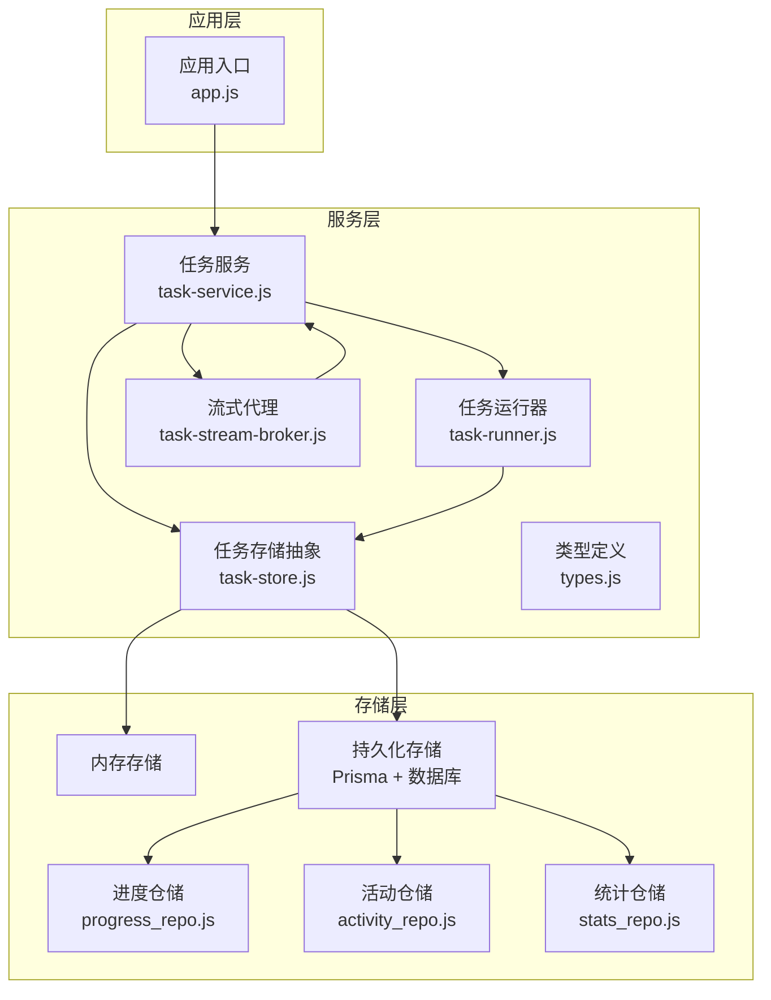
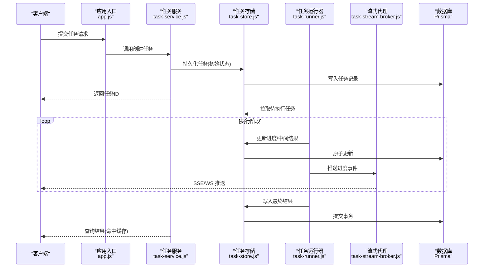
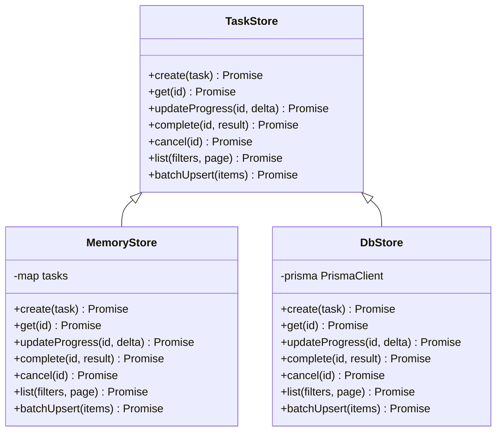
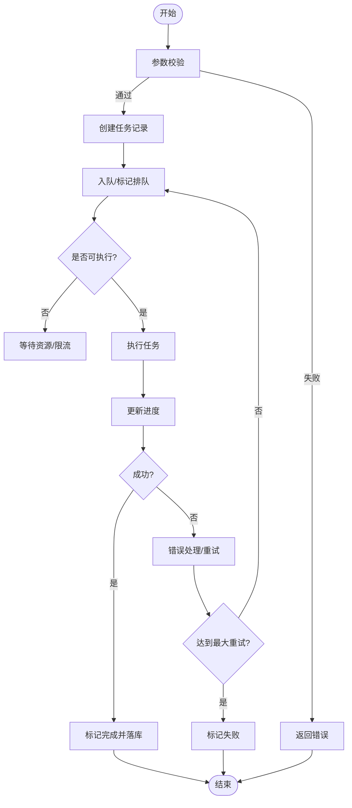
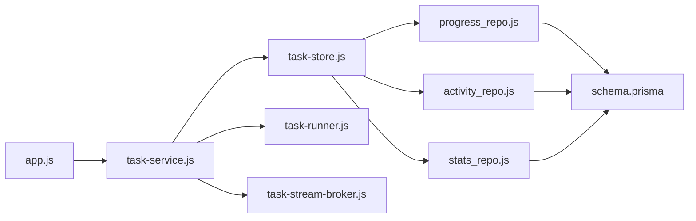

# 任务存储系统

<cite>
**本文引用的文件**   
- [task-store.js](file://node-jinmao/service/md2quiz/task-store.js)
- [task-service.js](file://node-jinmao/service/md2quiz/task-service.js)
- [task-runner.js](file://node-jinmao/service/md2quiz/task-runner.js)
- [task-stream-broker.js](file://node-jinmao/service/md2quiz/task-stream-broker.js)
- [types.js](file://node-jinmao/service/md2quiz/types.js)
- [schema.prisma](file://node-jinmao/prisma/schema.prisma)
- [progress_repo.js](file://node-jinmao/utils/repo/progress_repo.js)
- [activity_repo.js](file://node-jinmao/utils/repo/activity_repo.js)
- [stats_repo.js](file://node-jinmao/utils/repo/stats_repo.js)
- [app.js](file://node-jinmao/app.js)
</cite>

## 目录
1. [简介](#简介)
2. [项目结构](#项目结构)
3. [核心组件](#核心组件)
4. [架构总览](#架构总览)
5. [详细组件分析](#详细组件分析)
6. [依赖关系分析](#依赖关系分析)
7. [性能考量](#性能考量)
8. [故障排查指南](#故障排查指南)
9. [结论](#结论)
10. [附录](#附录)

## 简介
本文件面向“任务存储系统”，聚焦于内存与持久化两种存储实现、索引与查询优化、状态同步与一致性保障、备份恢复与数据迁移、多级缓存策略，以及扩展自定义存储引擎与安全访问控制。系统围绕 Markdown 转题库等长耗时任务的调度、执行与结果落库，提供高吞吐、低延迟的读写路径，并通过事件驱动与流式推送提升用户体验。

## 项目结构
- 服务层：任务编排（创建、调度、重试）、任务执行器、流式消息代理、类型定义。
- 存储层：内存存储（进程内）与持久化存储（数据库），通过仓储接口统一访问。
- 基础设施：Prisma Schema、仓库模块（进度、活动、统计）、应用入口。

图表来源 
- [task-store.js](file://node-jinmao/service/md2quiz/task-store.js)
- [task-service.js](file://node-jinmao/service/md2quiz/task-service.js)
- [task-runner.js](file://node-jinmao/service/md2quiz/task-runner.js)
- [task-stream-broker.js](file://node-jinmao/service/md2quiz/task-stream-broker.js)
- [types.js](file://node-jinmao/service/md2quiz/types.js)
- [progress_repo.js](file://node-jinmao/utils/repo/progress_repo.js)
- [activity_repo.js](file://node-jinmao/utils/repo/activity_repo.js)
- [stats_repo.js](file://node-jinmao/utils/repo/stats_repo.js)
- [app.js](file://node-jinmao/app.js)

章节来源
- [app.js](file://node-jinmao/app.js)
- [task-service.js](file://node-jinmao/service/md2quiz/task-service.js)
- [task-store.js](file://node-jinmao/service/md2quiz/task-store.js)
- [task-runner.js](file://node-jinmao/service/md2quiz/task-runner.js)
- [task-stream-broker.js](file://node-jinmao/service/md2quiz/task-stream-broker.js)
- [types.js](file://node-jinmao/service/md2quiz/types.js)
- [progress_repo.js](file://node-jinmao/utils/repo/progress_repo.js)
- [activity_repo.js](file://node-jinmao/utils/repo/activity_repo.js)
- [stats_repo.js](file://node-jinmao/utils/repo/stats_repo.js)

## 核心组件
- 任务存储抽象（task-store.js）：统一内存与持久化访问，提供增删改查、批量操作、事务边界与幂等写入。
- 任务服务（task-service.js）：对外暴露任务生命周期管理（创建、查询、取消、重试），协调存储与执行器。
- 任务运行器（task-runner.js）：消费任务队列，执行具体业务逻辑，回写进度与结果。
- 流式代理（task-stream-broker.js）：基于事件/流的实时状态推送，支持客户端订阅。
- 类型定义（types.js）：任务模型、状态枚举、错误码与校验规则。
- 仓储模块（progress/activity/stats）：对数据库表进行结构化访问，封装常用查询与聚合。

章节来源
- [task-store.js](file://node-jinmao/service/md2quiz/task-store.js)
- [task-service.js](file://node-jinmao/service/md2quiz/task-service.js)
- [task-runner.js](file://node-jinmao/service/md2quiz/task-runner.js)
- [task-stream-broker.js](file://node-jinmao/service/md2quiz/task-stream-broker.js)
- [types.js](file://node-jinmao/service/md2quiz/types.js)
- [progress_repo.js](file://node-jinmao/utils/repo/progress_repo.js)
- [activity_repo.js](file://node-jinmao/utils/repo/activity_repo.js)
- [stats_repo.js](file://node-jinmao/utils/repo/stats_repo.js)

## 架构总览
任务从 API 进入后，由任务服务创建并持久化；运行器按策略拉取任务执行，期间通过流式代理向客户端推送进度；最终结果落库并由缓存加速后续读取。

图表来源 
- [task-service.js](file://node-jinmao/service/md2quiz/task-service.js)
- [task-store.js](file://node-jinmao/service/md2quiz/task-store.js)
- [task-runner.js](file://node-jinmao/service/md2quiz/task-runner.js)
- [task-stream-broker.js](file://node-jinmao/service/md2quiz/task-stream-broker.js)
- [schema.prisma](file://node-jinmao/prisma/schema.prisma)

## 详细组件分析

### 任务存储抽象（内存与持久化）
- 设计要点
  - 统一接口：所有读写通过同一接口，屏蔽内存与数据库差异。
  - 幂等写入：基于任务ID与版本号/时间戳避免重复提交。
  - 事务边界：批量更新使用事务保证一致性。
  - 索引策略：为高频查询字段建立复合索引（如用户ID+状态+时间）。
  - 查询优化：分页、投影、条件过滤、预聚合。
- 数据存储格式
  - 任务实体：包含标识、类型、输入参数、状态、进度、结果引用、审计字段。
  - 进度快照：分块进度、累计百分比、错误堆栈。
  - 结果元数据：输出位置、大小、哈希校验。
- 索引与查询
  - 主键：任务ID。
  - 二级索引：用户ID、任务类型、状态、创建时间。
  - 覆盖索引：常见列表页查询直接命中索引。
- 错误处理
  - 乐观锁冲突重试。
  - 超时与降级到只读模式。
  - 可观测性：指标与日志埋点。

图表来源 
- [task-store.js](file://node-jinmao/service/md2quiz/task-store.js)

章节来源
- [task-store.js](file://node-jinmao/service/md2quiz/task-store.js)

### 任务服务（生命周期与一致性）
- 职责
  - 接收外部请求，校验参数，生成任务ID。
  - 协调存储与运行器，确保状态机推进正确。
  - 提供查询与导出接口，结合缓存加速。
- 状态机
  - 新建 -> 排队 -> 执行中 -> 完成/失败 -> 归档。
  - 支持取消与重试，失败自动退避。
- 一致性
  - 使用事务包裹关键路径（创建、进度合并、完成）。
  - 事件驱动的状态变更，保证下游订阅者最终一致。

图表来源 
- [task-service.js](file://node-jinmao/service/md2quiz/task-service.js)

章节来源
- [task-service.js](file://node-jinmao/service/md2quiz/task-service.js)

### 任务运行器（执行与回写）
- 拉取策略：按优先级与公平队列拉取，避免饥饿。
- 执行模型：单实例串行或并发池，限制并发度。
- 回写机制：增量进度合并，异常时保留断点。
- 监控：耗时、成功率、错误分类。

章节来源
- [task-runner.js](file://node-jinmao/service/md2quiz/task-runner.js)

### 流式代理（状态同步与推送）
- 事件模型：任务状态变更、进度片段、错误信息。
- 传输协议：SSE/WS，支持重连与去抖。
- 订阅粒度：按任务ID或用户维度订阅。
- 背压：客户端慢消费时的缓冲与丢弃策略。

章节来源
- [task-stream-broker.js](file://node-jinmao/service/md2quiz/task-stream-broker.js)

### 类型定义（模型与约束）
- 任务类型、状态枚举、错误码、分页参数、进度结构。
- 用于前后端契约与运行时校验。

章节来源
- [types.js](file://node-jinmao/service/md2quiz/types.js)

### 持久化仓储（进度、活动、统计）
- 进度仓储：按任务维度聚合进度快照，支持范围查询。
- 活动仓储：用户行为流水，便于审计与分析。
- 统计仓储：汇总指标，供仪表盘展示。

章节来源
- [progress_repo.js](file://node-jinmao/utils/repo/progress_repo.js)
- [activity_repo.js](file://node-jinmao/utils/repo/activity_repo.js)
- [stats_repo.js](file://node-jinmao/utils/repo/stats_repo.js)

## 依赖关系分析
- 组件耦合
  - 任务服务依赖存储抽象与运行器，松耦合便于替换实现。
  - 运行器仅依赖存储抽象与配置，无外部副作用。
  - 流式代理与任务服务通过事件解耦。
- 外部依赖
  - Prisma 作为 ORM，配合 schema 管理迁移。
  - 可选对象存储（MinIO）用于大结果文件。
- 潜在循环依赖
  - 通过接口隔离避免循环导入。

图表来源 
- [app.js](file://node-jinmao/app.js)
- [task-service.js](file://node-jinmao/service/md2quiz/task-service.js)
- [task-store.js](file://node-jinmao/service/md2quiz/task-store.js)
- [task-runner.js](file://node-jinmao/service/md2quiz/task-runner.js)
- [task-stream-broker.js](file://node-jinmao/service/md2quiz/task-stream-broker.js)
- [progress_repo.js](file://node-jinmao/utils/repo/progress_repo.js)
- [activity_repo.js](file://node-jinmao/utils/repo/activity_repo.js)
- [stats_repo.js](file://node-jinmao/utils/repo/stats_repo.js)
- [schema.prisma](file://node-jinmao/prisma/schema.prisma)

章节来源
- [app.js](file://node-jinmao/app.js)
- [schema.prisma](file://node-jinmao/prisma/schema.prisma)

## 性能考量
- 内存存储
  - 适用场景：单实例、短生命周期任务、开发调试。
  - 优化：LRU 淘汰、分片 Map、批量写入。
- 持久化存储
  - 索引设计：热点查询走覆盖索引，减少回表。
  - 事务粒度：最小化事务范围，降低锁竞争。
  - 连接池：合理设置池大小与超时。
- 缓存策略
  - 多级缓存：本地 L1 + 分布式 L2（Redis）+ 数据库。
  - 失效策略：TTL + 主动失效 + 版本号校验。
  - 热点优化：预取、旁路缓存、写扩散改为延迟加载。
- 查询优化
  - 分页游标替代偏移分页。
  - 异步聚合与物化视图。
- 可扩展性
  - 水平扩展：无状态服务 + 外部存储。
  - 分库分表：按用户或任务类型分片。

[本节为通用指导，不直接分析具体文件]

## 故障排查指南
- 常见问题
  - 任务卡住：检查运行器并发与队列堆积，查看进度快照。
  - 状态不一致：核对事务日志与事件回放，确认幂等键。
  - 缓存穿透：开启空值缓存与布隆过滤器。
  - 数据库锁：定位长事务与热点行，优化索引。
- 诊断手段
  - 指标：QPS、延迟分布、错误率、队列长度。
  - 日志：关键路径打点，关联追踪ID。
  - 快照：定期导出任务与进度快照用于回溯。
- 恢复流程
  - 全量恢复：从最近全量备份还原。
  - 增量恢复：回放增量日志至目标时间点。
  - 数据迁移：灰度切换，双写校验与回滚预案。

章节来源
- [task-store.js](file://node-jinmao/service/md2quiz/task-store.js)
- [task-service.js](file://node-jinmao/service/md2quiz/task-service.js)
- [task-runner.js](file://node-jinmao/service/md2quiz/task-runner.js)
- [task-stream-broker.js](file://node-jinmao/service/md2quiz/task-stream-broker.js)

## 结论
本任务存储系统以统一的存储抽象为核心，结合事件驱动的流式推送与稳健的事务边界，实现了高可靠的任务执行与状态同步。通过合理的索引与缓存策略，系统在吞吐与延迟之间取得平衡。未来可在多租户隔离、细粒度权限、跨地域复制等方面持续演进。

[本节为总结性内容，不直接分析具体文件]

## 附录

### 使用示例：扩展自定义存储引擎
- 步骤
  - 实现存储接口：新增 create/get/update/complete/list 等方法。
  - 注册适配器：在初始化时注入自定义实现。
  - 适配迁移：编写数据迁移脚本，保证新旧格式兼容。
- 注意事项
  - 保持幂等性与事务语义。
  - 补充监控与告警。
  - 单元测试覆盖边界条件。

章节来源
- [task-store.js](file://node-jinmao/service/md2quiz/task-store.js)
- [types.js](file://node-jinmao/service/md2quiz/types.js)

### 数据备份与恢复方案
- 全量备份：定时快照，压缩与加密存储。
- 增量备份：基于 WAL/Binlog 或变更事件流。
- 恢复演练：定期演练恢复流程，验证 RTO/RPO。
- 数据迁移：灰度发布、双向校验、快速回滚。

[本节为通用指导，不直接分析具体文件]

### 数据安全与访问控制
- 认证与授权：JWT 鉴权、RBAC 角色、资源级权限。
- 传输安全：TLS 加密、签名校验。
- 存储安全：敏感字段加密、脱敏输出、最小权限原则。
- 审计与合规：操作日志、数据留存策略、合规检查。

[本节为通用指导，不直接分析具体文件]