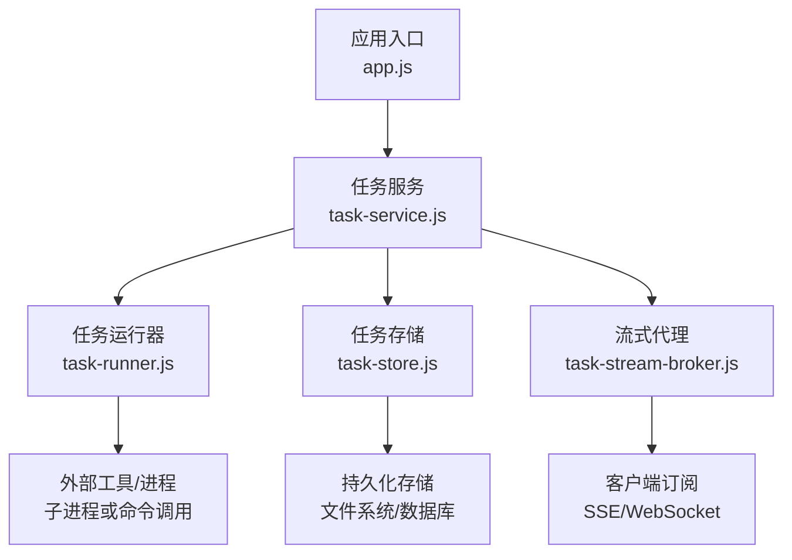
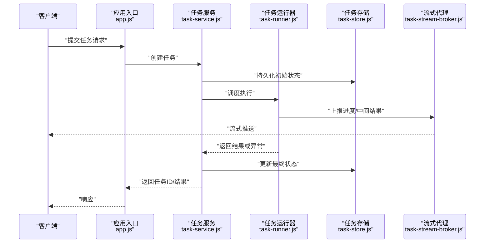
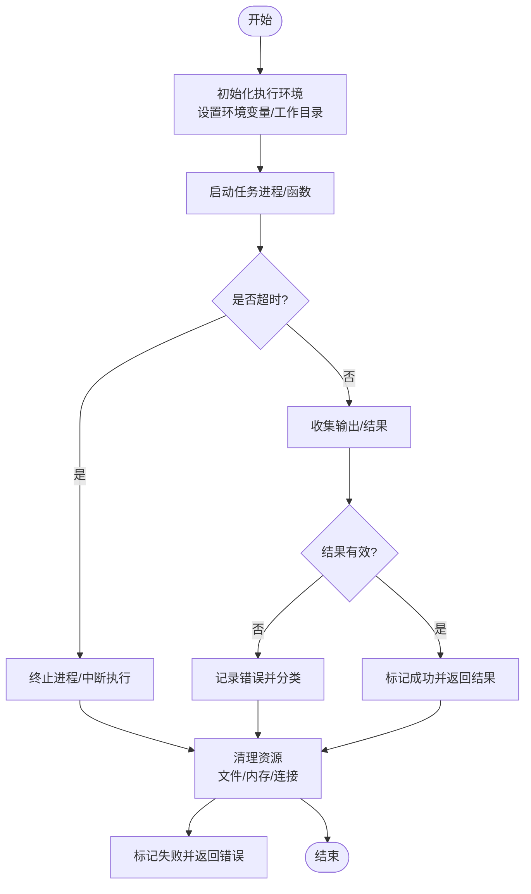
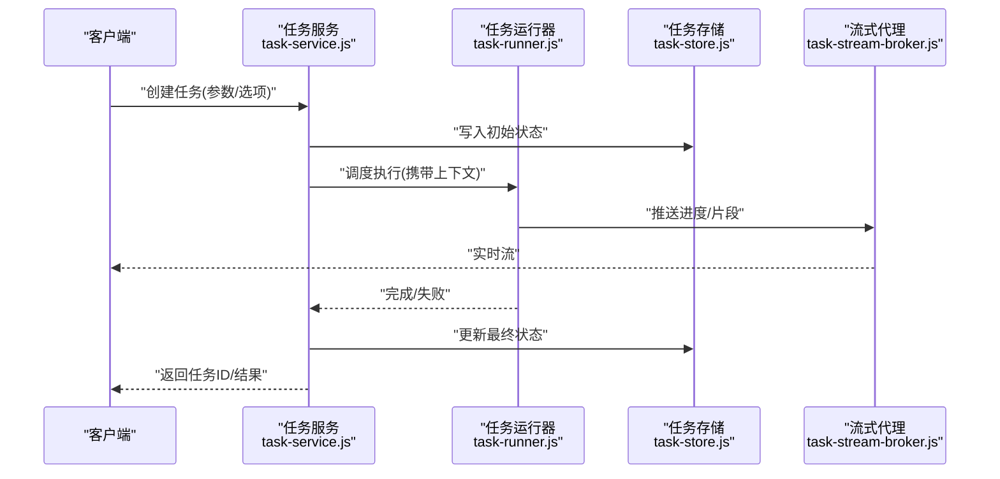
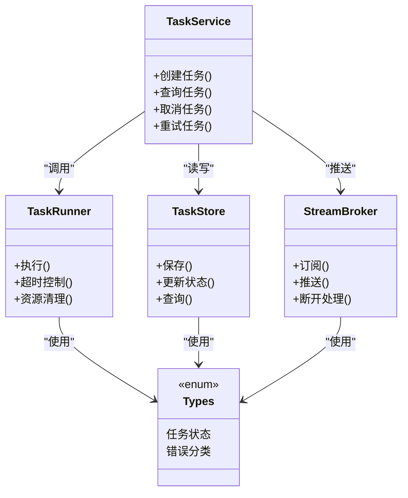

# 任务执行器

<cite>
**本文档引用的文件**
- [task-runner.js](file://node-jinmao/service/md2quiz/task-runner.js)
- [task-service.js](file://node-jinmao/service/md2quiz/task-service.js)
- [task-store.js](file://node-jinmao/service/md2quiz/task-store.js)
- [task-stream-broker.js](file://node-jinmao/service/md2quiz/task-stream-broker.js)
- [types.js](file://node-jinmao/service/md2quiz/types.js)
- [app.js](file://node-jinmao/app.js)
- [package.json](file://node-jinmao/package.json)
</cite>

## 目录
1. [简介](#简介)
2. [项目结构](#项目结构)
3. [核心组件](#核心组件)
4. [架构总览](#架构总览)
5. [详细组件分析](#详细组件分析)
6. [依赖关系分析](#依赖关系分析)
7. [性能考虑](#性能考虑)
8. [故障排查指南](#故障排查指南)
9. [结论](#结论)
10. [附录](#附录)

## 简介
本文件面向“任务执行器”子系统，聚焦于任务的执行环境、生命周期管理、错误处理与重试机制、资源清理与回收、以及可扩展的分布式方案与性能优化建议。该子系统位于 node-jinmao 服务中，围绕 md2quiz 场景提供任务编排、持久化、流式推送与执行调度能力。

## 项目结构
任务执行器相关代码集中在 service/md2quiz 目录下，包含任务运行器、服务层、存储层、流式消息代理与类型定义等模块；应用入口在 app.js，依赖声明在 package.json。

图表来源
- [app.js](file://node-jinmao/app.js)
- [task-service.js](file://node-jinmao/service/md2quiz/task-service.js)
- [task-runner.js](file://node-jinmao/service/md2quiz/task-runner.js)
- [task-store.js](file://node-jinmao/service/md2quiz/task-store.js)
- [task-stream-broker.js](file://node-jinmao/service/md2quiz/task-stream-broker.js)

章节来源
- [app.js](file://node-jinmao/app.js)
- [package.json](file://node-jinmao/package.json)

## 核心组件
- 任务运行器（task-runner）：负责具体任务的启动、执行、结果收集与异常捕获，支持超时控制与资源释放。
- 任务服务（task-service）：对外暴露任务创建、查询、取消、重试等接口，协调运行器、存储与流式代理。
- 任务存储（task-store）：维护任务状态、上下文与结果，保证可恢复性与一致性。
- 流式代理（task-stream-broker）：将任务进度与中间结果以流式方式推送给客户端。
- 类型定义（types）：统一任务模型、状态枚举、错误分类与配置项。

章节来源
- [task-runner.js](file://node-jinmao/service/md2quiz/task-runner.js)
- [task-service.js](file://node-jinmao/service/md2quiz/task-service.js)
- [task-store.js](file://node-jinmao/service/md2quiz/task-store.js)
- [task-stream-broker.js](file://node-jinmao/service/md2quiz/task-stream-broker.js)
- [types.js](file://node-jinmao/service/md2quiz/types.js)

## 架构总览
任务执行器采用分层设计：服务层聚合运行器、存储与流式通道；运行器封装执行细节；存储保障状态一致；流式代理实现实时反馈。整体流程如下：

图表来源
- [app.js](file://node-jinmao/app.js)
- [task-service.js](file://node-jinmao/service/md2quiz/task-service.js)
- [task-runner.js](file://node-jinmao/service/md2quiz/task-runner.js)
- [task-store.js](file://node-jinmao/service/md2quiz/task-store.js)
- [task-stream-broker.js](file://node-jinmao/service/md2quiz/task-stream-broker.js)

## 详细组件分析

### 任务运行器（task-runner）
职责
- 启动任务：根据任务类型与环境配置选择执行策略（如子进程、命令调用）。
- 执行控制：设置超时、内存限制、环境变量隔离。
- 结果与日志：收集标准输出/错误，结构化记录关键事件。
- 异常处理：捕获运行时异常，分类并回传错误信息。
- 资源清理：确保临时文件、句柄、连接关闭。

执行流程（含超时与失败分支）

图表来源
- [task-runner.js](file://node-jinmao/service/md2quiz/task-runner.js)

章节来源
- [task-runner.js](file://node-jinmao/service/md2quiz/task-runner.js)

### 任务服务（task-service）
职责
- 任务生命周期管理：创建、查询、取消、重试、分页与过滤。
- 编排运行器与存储：协调执行顺序、并发度与状态同步。
- 流式集成：将进度与中间结果通过代理推送至客户端。
- 错误与重试：基于错误分类决定重试策略与降级路径。

关键交互序列

图表来源
- [task-service.js](file://node-jinmao/service/md2quiz/task-service.js)
- [task-runner.js](file://node-jinmao/service/md2quiz/task-runner.js)
- [task-store.js](file://node-jinmao/service/md2quiz/task-store.js)
- [task-stream-broker.js](file://node-jinmao/service/md2quiz/task-stream-broker.js)

章节来源
- [task-service.js](file://node-jinmao/service/md2quiz/task-service.js)

### 任务存储（task-store）
职责
- 状态机：维护任务状态（待执行、执行中、成功、失败、取消、超时）。
- 数据持久化：保存任务元数据、输入参数、中间结果与最终输出。
- 一致性：保证状态变更原子性，支持幂等操作。
- 查询与索引：按用户、类型、时间范围检索任务。

典型数据结构（概念说明）
- 任务标识：唯一ID
- 状态：枚举值
- 上下文：执行环境、工作目录、环境变量快照
- 结果：成功时输出，失败时错误信息与堆栈
- 审计：创建时间、更新时间、最后心跳

章节来源
- [task-store.js](file://node-jinmao/service/md2quiz/task-store.js)
- [types.js](file://node-jinmao/service/md2quiz/types.js)

### 流式代理（task-stream-broker）
职责
- 发布/订阅：为每个任务建立独立通道，推送进度与片段。
- 背压与缓冲：控制推送速率，避免客户端过载。
- 断线重连：支持客户端短暂断开后的续推。
- 安全与鉴权：校验订阅者身份与权限。

章节来源
- [task-stream-broker.js](file://node-jinmao/service/md2quiz/task-stream-broker.js)

### 类型定义（types）
职责
- 统一任务模型：字段、必填项、默认值。
- 状态与错误枚举：标准化状态码与错误分类。
- 配置项：执行环境、超时、并发、重试策略等。

章节来源
- [types.js](file://node-jinmao/service/md2quiz/types.js)

## 依赖关系分析
- 服务层依赖运行器、存储与流式代理，形成松耦合组合。
- 运行器可能依赖系统命令或外部库，需通过环境变量与沙箱隔离。
- 存储层抽象化，便于替换为内存、文件或数据库后端。
- 流式代理与客户端解耦，支持多种传输协议。

图表来源
- [task-service.js](file://node-jinmao/service/md2quiz/task-service.js)
- [task-runner.js](file://node-jinmao/service/md2quiz/task-runner.js)
- [task-store.js](file://node-jinmao/service/md2quiz/task-store.js)
- [task-stream-broker.js](file://node-jinmao/service/md2quiz/task-stream-broker.js)
- [types.js](file://node-jinmao/service/md2quiz/types.js)

章节来源
- [task-service.js](file://node-jinmao/service/md2quiz/task-service.js)
- [task-runner.js](file://node-jinmao/service/md2quiz/task-runner.js)
- [task-store.js](file://node-jinmao/service/md2quiz/task-store.js)
- [task-stream-broker.js](file://node-jinmao/service/md2quiz/task-stream-broker.js)
- [types.js](file://node-jinmao/service/md2quiz/types.js)

## 性能考虑
- 并发与队列：限制最大并行任务数，避免资源争用；对长耗时任务使用队列削峰。
- 超时与熔断：合理设置任务超时，快速失败释放资源；对下游依赖进行熔断保护。
- 流式输出：增量推送减少内存占用与首屏延迟。
- I/O 优化：批量写盘、异步I/O、缓存热点数据。
- 监控指标：CPU、内存、队列长度、任务成功率、平均耗时、P95/P99延迟。

[本节为通用指导，不直接分析具体文件]

## 故障排查指南
常见问题与定位步骤
- 任务卡住：检查运行器是否被阻塞、是否存在死锁或未释放锁；查看流式代理是否有积压。
- 超时频繁：调整超时阈值，确认外部依赖响应时间；增加重试退避策略。
- 资源泄漏：确认临时文件删除、文件句柄关闭、网络连接释放；检查内存增长趋势。
- 状态不一致：核对存储的状态更新是否原子；检查并发写入冲突。
- 权限问题：验证运行环境变量与工作目录权限；确认外部命令可执行权限。

章节来源
- [task-runner.js](file://node-jinmao/service/md2quiz/task-runner.js)
- [task-store.js](file://node-jinmao/service/md2quiz/task-store.js)
- [task-stream-broker.js](file://node-jinmao/service/md2quiz/task-stream-broker.js)

## 结论
任务执行器通过清晰的分层与职责划分，实现了可靠的执行环境、完整的生命周期管理、健壮的错误处理与资源回收，并提供流式反馈与可扩展的分布式方案。建议在规模化部署时引入消息队列与分布式存储，结合完善的监控与告警体系，进一步提升稳定性与吞吐能力。

[本节为总结性内容，不直接分析具体文件]

## 附录

### 自定义任务处理器示例（步骤指引）
- 定义任务类型与参数：在类型文件中新增任务类型与参数结构。
- 实现处理器：在运行器中注册新处理器，实现执行逻辑、超时与异常捕获。
- 配置执行参数：在服务层暴露配置项（并发、超时、重试次数、降级策略）。
- 接入流式推送：在处理器中向流式代理推送进度与中间结果。
- 测试与验证：编写单元测试覆盖正常、异常、超时与资源清理路径。

章节来源
- [types.js](file://node-jinmao/service/md2quiz/types.js)
- [task-runner.js](file://node-jinmao/service/md2quiz/task-runner.js)
- [task-service.js](file://node-jinmao/service/md2quiz/task-service.js)
- [task-stream-broker.js](file://node-jinmao/service/md2quiz/task-stream-broker.js)

### 分布式执行扩展方案
- 任务分发：使用消息队列（如 Redis/RabbitMQ/Kafka）作为任务源，多实例消费。
- 状态中心：集中式存储（如数据库/Redis）维护任务状态与结果。
- 流式广播：通过消息总线将进度广播到多个客户端。
- 弹性伸缩：根据队列长度与资源利用率自动扩缩容。
- 幂等与去重：任务ID唯一，重复提交去重，失败重试保证幂等。

[本节为概念性扩展方案，不直接分析具体文件]

### 监控与可观测性
- 指标采集：任务数、成功率、耗时分布、错误分类统计。
- 日志规范：结构化日志，包含任务ID、阶段、耗时、错误码。
- 告警规则：超时率、失败率、资源使用阈值触发告警。
- 追踪链路：跨进程/服务的调用链追踪，便于定位瓶颈。

[本节为通用实践，不直接分析具体文件]