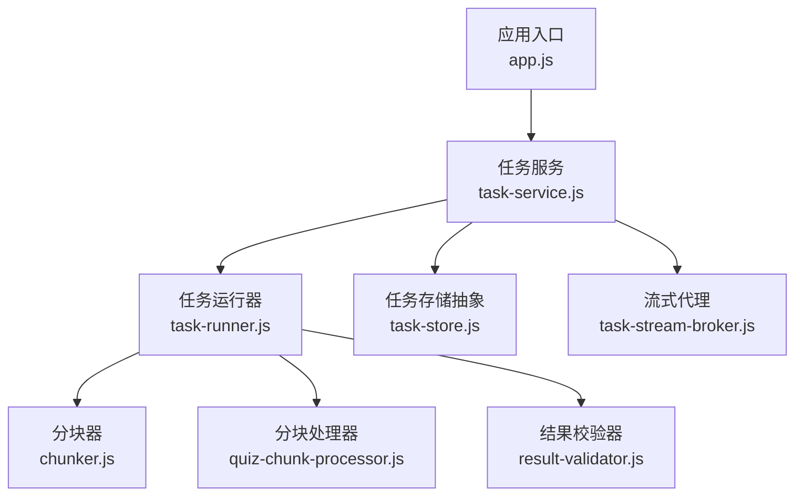
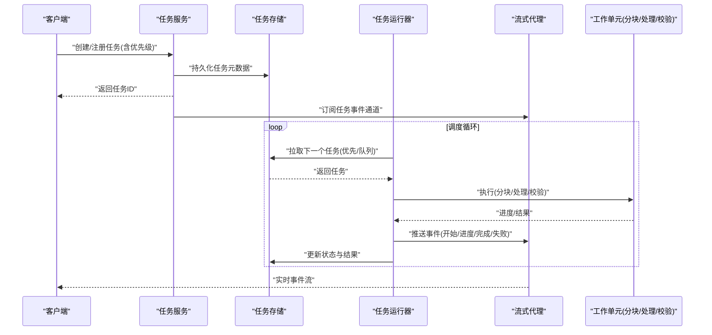
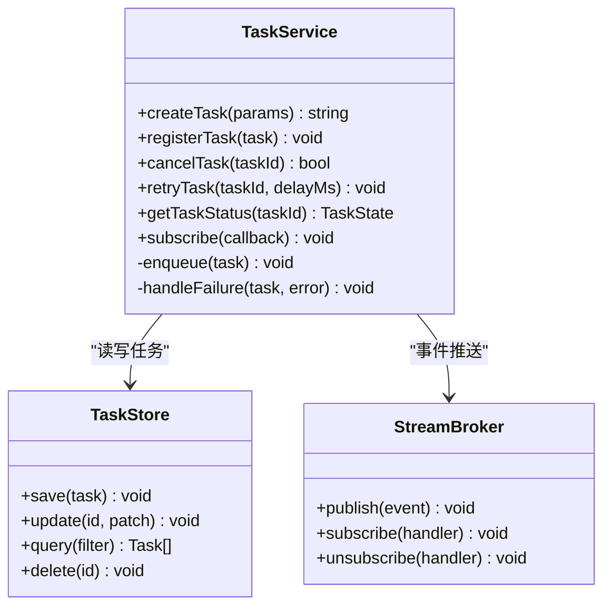
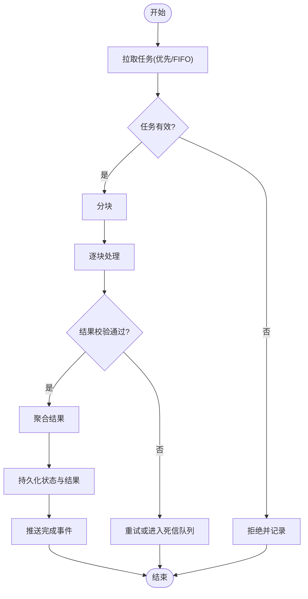
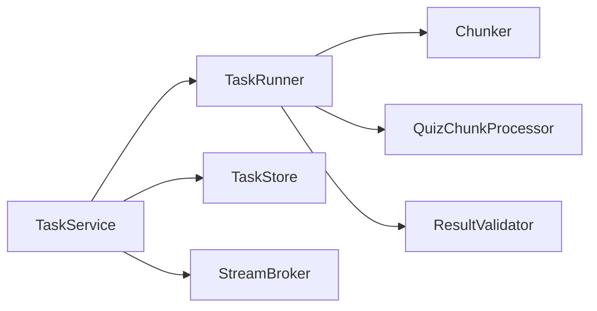
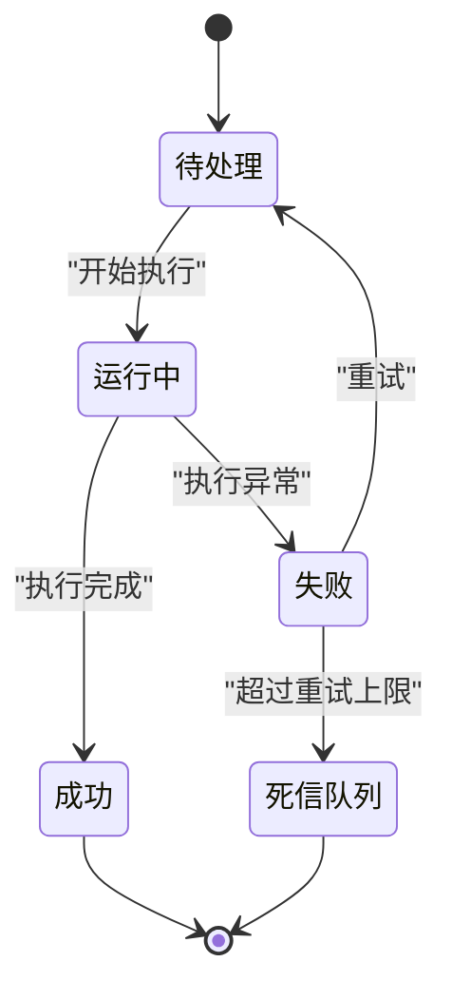

# 任务调度器

<cite>
**本文引用的文件**   
- [task-service.js](file://node-jinmao/service/md2quiz/task-service.js)
- [task-runner.js](file://node-jinmao/service/md2quiz/task-runner.js)
- [task-store.js](file://node-jinmao/service/md2quiz/task-store.js)
- [task-stream-broker.js](file://node-jinmao/service/md2quiz/task-stream-broker.js)
- [types.js](file://node-jinmao/service/md2quiz/types.js)
- [chunker.js](file://node-jinmao/service/md2quiz/chunker.js)
- [quiz-chunk-processor.js](file://node-jinmao/service/md2quiz/quiz-chunk-processor.js)
- [result-validator.js](file://node-jinmao/service/md2quiz/result-validator.js)
- [app.js](file://node-jinmao/app.js)
</cite>

## 目录
1. [简介](#简介)
2. [项目结构](#项目结构)
3. [核心组件](#核心组件)
4. [架构总览](#架构总览)
5. [详细组件分析](#详细组件分析)
6. [依赖关系分析](#依赖关系分析)
7. [性能考量](#性能考量)
8. [故障排查指南](#故障排查指南)
9. [结论](#结论)
10. [附录](#附录)

## 简介
本文件围绕仓库中的“任务调度器”进行系统化文档化，重点覆盖：
- 任务的创建、注册、优先级排序与调度算法
- 队列管理机制（先进先出、优先级队列、死信队列）
- 并发控制策略（线程池管理、资源限制、负载均衡）
- 定时执行、延迟执行、周期性执行能力
- 自定义任务类型、调度参数配置与执行监控
- 性能优化建议与故障恢复机制

说明：当前代码库中未提供显式的“定时/周期调度器”实现，但可通过外部调度或扩展任务服务来实现。本文在相关章节给出可落地的扩展方案与最佳实践。

## 项目结构
与任务调度相关的核心模块集中在 node-jinmao/service/md2quiz 目录下，主要包含：
- 任务服务与编排：task-service.js
- 任务运行器：task-runner.js
- 任务存储抽象：task-store.js
- 流式消息代理：task-stream-broker.js
- 类型定义：types.js
- 分块与处理：chunker.js、quiz-chunk-processor.js
- 结果校验：result-validator.js
- 应用入口：app.js（用于集成与启动）

图表来源
- [app.js](file://node-jinmao/app.js)
- [task-service.js](file://node-jinmao/service/md2quiz/task-service.js)
- [task-runner.js](file://node-jinmao/service/md2quiz/task-runner.js)
- [task-store.js](file://node-jinmao/service/md2quiz/task-store.js)
- [task-stream-broker.js](file://node-jinmao/service/md2quiz/task-stream-broker.js)
- [chunker.js](file://node-jinmao/service/md2quiz/chunker.js)
- [quiz-chunk-processor.js](file://node-jinmao/service/md2quiz/quiz-chunk-processor.js)
- [result-validator.js](file://node-jinmao/service/md2quiz/result-validator.js)

章节来源
- [app.js](file://node-jinmao/app.js)
- [task-service.js](file://node-jinmao/service/md2quiz/task-service.js)
- [task-runner.js](file://node-jinmao/service/md2quiz/task-runner.js)
- [task-store.js](file://node-jinmao/service/md2quiz/task-store.js)
- [task-stream-broker.js](file://node-jinmao/service/md2quiz/task-stream-broker.js)
- [types.js](file://node-jinmao/service/md2quiz/types.js)

## 核心组件
- 任务服务（TaskService）
  - 职责：对外暴露任务的创建、注册、查询、取消、重试等接口；协调运行器、存储与流式代理；维护任务生命周期状态。
  - 关键能力：任务入队（支持优先级）、批量提交、状态同步、错误上报。
- 任务运行器（TaskRunner）
  - 职责：从队列拉取任务并执行；封装分块、处理、校验流程；管理并发度与资源使用。
  - 关键能力：并发控制、超时控制、失败重试、进度上报。
- 任务存储（TaskStore 抽象）
  - 职责：持久化任务元数据、执行日志、结果与状态；提供增删改查与条件查询。
  - 关键能力：事务性更新、幂等写入、分页查询。
- 流式代理（StreamBroker）
  - 职责：将任务执行过程中的事件（开始、进度、完成、失败）以流式方式推送给消费者。
  - 关键能力：订阅/发布、背压处理、断线重连。
- 类型定义（Types）
  - 职责：统一任务模型、状态枚举、错误码、回调契约。
  - 关键能力：强类型约束、可扩展字段。

章节来源
- [task-service.js](file://node-jinmao/service/md2quiz/task-service.js)
- [task-runner.js](file://node-jinmao/service/md2quiz/task-runner.js)
- [task-store.js](file://node-jinmao/service/md2quiz/task-store.js)
- [task-stream-broker.js](file://node-jinmao/service/md2quiz/task-stream-broker.js)
- [types.js](file://node-jinmao/service/md2quiz/types.js)

## 架构总览
任务调度器的整体交互如下：客户端通过任务服务提交任务，服务将其入队（支持优先级），运行器按策略拉取并执行，过程中通过流式代理上报进度与结果，最终由存储层持久化。

图表来源
- [task-service.js](file://node-jinmao/service/md2quiz/task-service.js)
- [task-store.js](file://node-jinmao/service/md2quiz/task-store.js)
- [task-runner.js](file://node-jinmao/service/md2quiz/task-runner.js)
- [task-stream-broker.js](file://node-jinmao/service/md2quiz/task-stream-broker.js)

## 详细组件分析

### 任务服务（TaskService）
- 功能要点
  - 任务创建与注册：接收任务参数，生成唯一ID，设置初始状态与优先级，写入存储。
  - 队列管理：支持FIFO与优先级队列；对高优任务优先调度。
  - 生命周期管理：跟踪 Pending、Running、Success、Failed、DeadLetter 等状态转换。
  - 重试与补偿：对失败任务进行指数退避重试，超过阈值进入死信队列。
  - 监控与审计：记录关键指标（吞吐、延迟、错误率）与操作日志。
- 设计模式
  - 门面模式：对外暴露简洁API，内部协调多个子系统。
  - 观察者模式：通过流式代理向订阅者推送事件。
- 并发与资源
  - 通过运行器控制并发度，避免过载。
  - 支持限流与熔断（可扩展）。

图表来源
- [task-service.js](file://node-jinmao/service/md2quiz/task-service.js)
- [task-store.js](file://node-jinmao/service/md2quiz/task-store.js)
- [task-stream-broker.js](file://node-jinmao/service/md2quiz/task-stream-broker.js)

章节来源
- [task-service.js](file://node-jinmao/service/md2quiz/task-service.js)
- [task-store.js](file://node-jinmao/service/md2quiz/task-store.js)
- [task-stream-broker.js](file://node-jinmao/service/md2quiz/task-stream-broker.js)

### 任务运行器（TaskRunner）
- 功能要点
  - 拉取策略：支持 FIFO 与优先级；可按资源占用与负载动态调整。
  - 执行流程：分块 -> 处理 -> 校验 -> 汇总 -> 持久化。
  - 并发控制：最大并发数、单任务内存/CPU上限、背压与节流。
  - 容错机制：超时、重试、降级、隔离。
- 算法与数据结构
  - 优先级队列：基于堆或有序集合，O(log n) 插入与弹出。
  - 分块策略：按大小或语义切分，减少单次执行压力。
- 监控与诊断
  - 采集运行时长、错误次数、队列长度、CPU/内存使用。

图表来源
- [task-runner.js](file://node-jinmao/service/md2quiz/task-runner.js)
- [chunker.js](file://node-jinmao/service/md2quiz/chunker.js)
- [quiz-chunk-processor.js](file://node-jinmao/service/md2quiz/quiz-chunk-processor.js)
- [result-validator.js](file://node-jinmao/service/md2quiz/result-validator.js)

章节来源
- [task-runner.js](file://node-jinmao/service/md2quiz/task-runner.js)
- [chunker.js](file://node-jinmao/service/md2quiz/chunker.js)
- [quiz-chunk-processor.js](file://node-jinmao/service/md2quiz/quiz-chunk-processor.js)
- [result-validator.js](file://node-jinmao/service/md2quiz/result-validator.js)

### 任务存储（TaskStore 抽象）
- 功能要点
  - 任务元数据：ID、类型、优先级、状态、创建时间、更新时间、重试次数、错误信息。
  - 执行日志：阶段级日志、耗时、资源消耗。
  - 结果与快照：中间结果、最终结果、校验报告。
  - 查询与索引：按状态、类型、优先级、时间范围查询。
- 一致性
  - 原子更新与幂等写入，防止重复消费。
  - 可选事务保障跨表一致性。

章节来源
- [task-store.js](file://node-jinmao/service/md2quiz/task-store.js)
- [types.js](file://node-jinmao/service/md2quiz/types.js)

### 流式代理（StreamBroker）
- 功能要点
  - 事件模型：任务开始、进度、完成、失败、重试、进入死信等。
  - 订阅模型：多消费者订阅同一通道，支持过滤与去重。
  - 可靠性：断线重连、消息确认、顺序保证（可选）。
- 适用场景
  - 前端实时展示任务进度与结果。
  - 监控告警与审计。

章节来源
- [task-stream-broker.js](file://node-jinmao/service/md2quiz/task-stream-broker.js)
- [types.js](file://node-jinmao/service/md2quiz/types.js)

### 分块与处理（Chunker & QuizChunkProcessor）
- 分块器（Chunker）
  - 目标：将大任务拆分为可并行处理的子任务，降低峰值资源占用。
  - 策略：固定大小、自适应大小、语义边界切分。
- 分块处理器（QuizChunkProcessor）
  - 目标：对每个分块执行具体业务逻辑（如解析、转换、计算）。
  - 特性：错误隔离、局部重试、进度上报。

章节来源
- [chunker.js](file://node-jinmao/service/md2quiz/chunker.js)
- [quiz-chunk-processor.js](file://node-jinmao/service/md2quiz/quiz-chunk-processor.js)

### 结果校验（ResultValidator）
- 功能要点
  - 规则校验：格式、完整性、一致性检查。
  - 统计校验：数量、分布、异常值检测。
  - 回滚策略：校验失败时回滚部分变更或标记待修复。

章节来源
- [result-validator.js](file://node-jinmao/service/md2quiz/result-validator.js)

## 依赖关系分析
- 组件耦合
  - TaskService 依赖 TaskStore、StreamBroker、TaskRunner。
  - TaskRunner 依赖 TaskStore、Chunker、Processor、Validator。
  - StreamBroker 独立于业务，仅负责事件分发。
- 外部依赖
  - 存储后端（数据库/对象存储）
  - 消息通道（内存/Redis/消息队列）
- 潜在循环依赖
  - 通过接口抽象与事件解耦避免循环依赖。

图表来源
- [task-service.js](file://node-jinmao/service/md2quiz/task-service.js)
- [task-runner.js](file://node-jinmao/service/md2quiz/task-runner.js)
- [task-store.js](file://node-jinmao/service/md2quiz/task-store.js)
- [task-stream-broker.js](file://node-jinmao/service/md2quiz/task-stream-broker.js)
- [chunker.js](file://node-jinmao/service/md2quiz/chunker.js)
- [quiz-chunk-processor.js](file://node-jinmao/service/md2quiz/quiz-chunk-processor.js)
- [result-validator.js](file://node-jinmao/service/md2quiz/result-validator.js)

章节来源
- [task-service.js](file://node-jinmao/service/md2quiz/task-service.js)
- [task-runner.js](file://node-jinmao/service/md2quiz/task-runner.js)
- [task-store.js](file://node-jinmao/service/md2quiz/task-store.js)
- [task-stream-broker.js](file://node-jinmao/service/md2quiz/task-stream-broker.js)

## 性能考量
- 队列与调度
  - 使用优先级队列减少高优任务等待时间。
  - 批量拉取与批处理提升吞吐。
- 并发与资源
  - 合理设置最大并发数，避免上下文切换开销。
  - 对IO密集型与CPU密集型任务分别调优。
- 存储与I/O
  - 异步写入与合并提交，减少锁竞争。
  - 读写分离与缓存热点数据。
- 监控与弹性
  - 采集关键指标（队列长度、P95/P99延迟、错误率）。
  - 自动扩缩容与限流保护。

[本节为通用指导，不直接分析具体文件]

## 故障排查指南
- 常见问题定位
  - 任务堆积：检查队列长度、消费者并发度、下游依赖可用性。
  - 频繁失败：查看错误日志、重试次数、死信队列增长情况。
  - 进度不更新：确认流式代理连接、事件发布链路是否畅通。
- 恢复策略
  - 重试与退避：指数退避+抖动，避免雪崩。
  - 死信队列：人工介入或自动化修复后重新入队。
  - 快照恢复：从最近成功快照恢复状态。
- 诊断工具
  - 启用详细日志与追踪ID。
  - 暴露健康检查与指标端点。

章节来源
- [task-service.js](file://node-jinmao/service/md2quiz/task-service.js)
- [task-runner.js](file://node-jinmao/service/md2quiz/task-runner.js)
- [task-store.js](file://node-jinmao/service/md2quiz/task-store.js)
- [task-stream-broker.js](file://node-jinmao/service/md2quiz/task-stream-broker.js)

## 结论
该任务调度器以清晰的分层与模块化设计实现了任务创建、注册、优先级调度、执行与监控的核心能力。通过流式代理与存储抽象，系统具备良好的扩展性与可观测性。针对定时/周期调度与更复杂的并发控制，可在现有基础上进行扩展，以满足更高要求的生产场景。

[本节为总结性内容，不直接分析具体文件]

## 附录

### 任务生命周期与状态机

[本图为概念性状态机，不直接映射到具体文件]

### 自定义任务类型与调度参数配置
- 自定义任务类型
  - 在类型定义中扩展任务类型与字段。
  - 在运行器中注册对应的处理器与校验器。
- 调度参数
  - 优先级权重、最大并发、超时时间、重试次数、退避策略。
  - 分块大小、批处理大小、资源配额。
- 监控与告警
  - 订阅流式事件，收集指标，设置阈值告警。

章节来源
- [types.js](file://node-jinmao/service/md2quiz/types.js)
- [task-service.js](file://node-jinmao/service/md2quiz/task-service.js)
- [task-runner.js](file://node-jinmao/service/md2quiz/task-runner.js)

### 定时执行、延迟执行、周期性执行（扩展方案）
- 延迟执行
  - 在任务服务中增加延迟队列，到期后转入主队列。
- 定时/周期执行
  - 引入外部调度器（如系统定时任务或消息队列的延时/重复投递）。
  - 或在服务层维护定时器，定期触发任务生成与入队。
- 注意事项
  - 幂等性与去重，避免重复执行。
  - 时钟漂移与容错，确保任务按时触发。

[本节为扩展方案，不直接分析具体文件]

### 并发控制策略（线程池、资源限制、负载均衡）
- 线程池管理
  - 根据任务类型划分线程池，隔离IO与CPU任务。
- 资源限制
  - 设置内存、CPU、句柄上限，防止资源耗尽。
- 负载均衡
  - 多实例部署，基于队列或消息中间件进行水平扩展。

[本节为通用指导，不直接分析具体文件]

### 监控任务执行情况
- 指标采集
  - 任务总数、成功率、平均耗时、P95/P99、队列长度、错误分类。
- 可视化与告警
  - 仪表盘展示关键指标，设置阈值告警。
- 审计与追溯
  - 全链路追踪ID，关联请求与任务执行日志。

章节来源
- [task-stream-broker.js](file://node-jinmao/service/md2quiz/task-stream-broker.js)
- [task-store.js](file://node-jinmao/service/md2quiz/task-store.js)