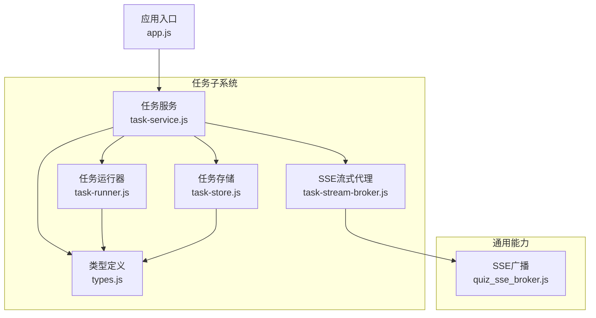
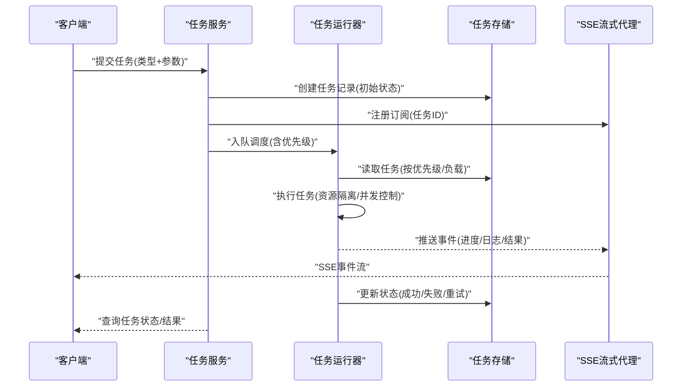
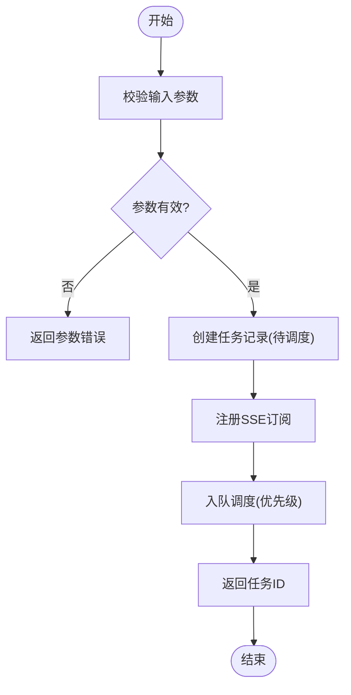
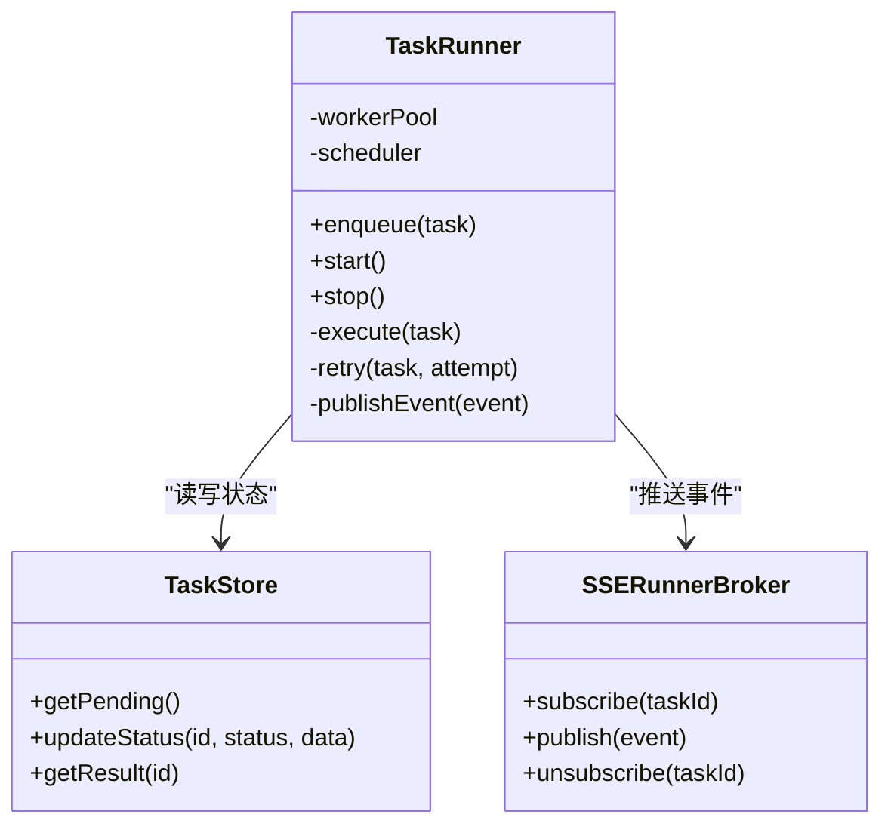
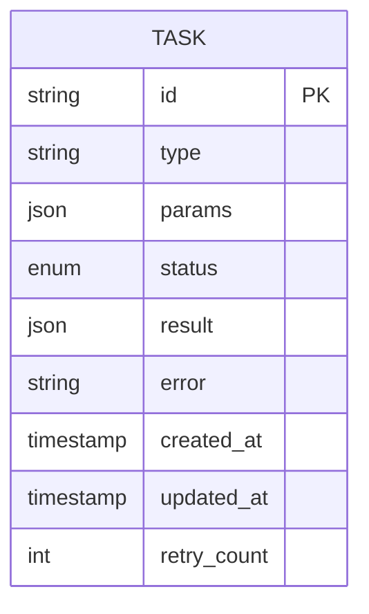
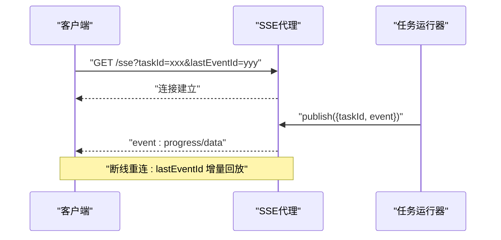
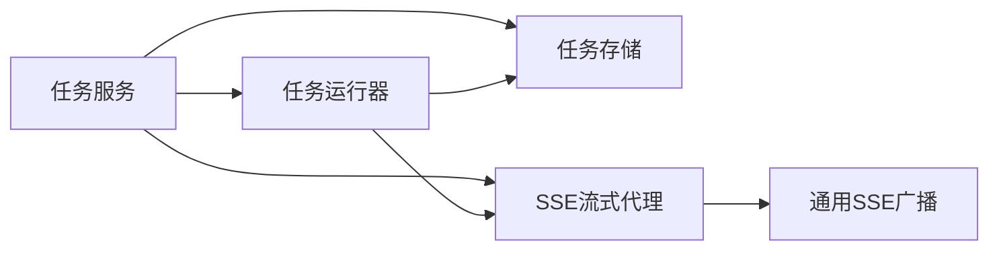

# 异步任务管理系统

<cite>
**本文引用的文件**   
- [task-service.js](file://node-jinmao/service/md2quiz/task-service.js)
- [task-runner.js](file://node-jinmao/service/md2quiz/task-runner.js)
- [task-store.js](file://node-jinmao/service/md2quiz/task-store.js)
- [task-stream-broker.js](file://node-jinmao/service/md2quiz/task-stream-broker.js)
- [types.js](file://node-jinmao/service/md2quiz/types.js)
- [quiz_sse_broker.js](file://node-jinmao/service/quiz_sse_broker.js)
- [app.js](file://node-jinmao/app.js)
</cite>

## 目录
1. [简介](#简介)
2. [项目结构](#项目结构)
3. [核心组件](#核心组件)
4. [架构总览](#架构总览)
5. [详细组件分析](#详细组件分析)
6. [依赖关系分析](#依赖关系分析)
7. [性能考量](#性能考量)
8. [故障排查指南](#故障排查指南)
9. [结论](#结论)
10. [附录](#附录)

## 简介
本文件系统性地梳理并文档化“异步任务管理系统”的设计与实现，覆盖任务生命周期（创建、调度、执行、完成、失败处理）、存储机制（内存与持久化、状态同步）、运行器（并发控制、资源管理、错误恢复）、SSE流式传输代理（事件推送、连接管理、断线重连），以及优先级调度、负载均衡、资源隔离策略。同时提供使用示例、扩展自定义任务类型的方法、监控调试技巧，以及分布式部署与扩展性建议。

## 项目结构
该异步任务子系统位于 node-jinmao/service/md2quiz 目录下，围绕任务服务、任务运行器、任务存储、SSE流式代理与类型定义组织代码；此外，quiz_sse_broker.js 提供通用的 SSE 广播能力，app.js 作为应用入口进行模块装配。

图表来源
- [task-service.js](file://node-jinmao/service/md2quiz/task-service.js)
- [task-runner.js](file://node-jinmao/service/md2quiz/task-runner.js)
- [task-store.js](file://node-jinmao/service/md2quiz/task-store.js)
- [task-stream-broker.js](file://node-jinmao/service/md2quiz/task-stream-broker.js)
- [quiz_sse_broker.js](file://node-jinmao/service/quiz_sse_broker.js)
- [app.js](file://node-jinmao/app.js)

章节来源
- [task-service.js](file://node-jinmao/service/md2quiz/task-service.js)
- [task-runner.js](file://node-jinmao/service/md2quiz/task-runner.js)
- [task-store.js](file://node-jinmao/service/md2quiz/task-store.js)
- [task-stream-broker.js](file://node-jinmao/service/md2quiz/task-stream-broker.js)
- [quiz_sse_broker.js](file://node-jinmao/service/quiz_sse_broker.js)
- [app.js](file://node-jinmao/app.js)

## 核心组件
- 任务服务：负责任务的创建、入队、状态查询、结果获取与生命周期管理，协调运行器、存储与SSE代理。
- 任务运行器：负责任务的调度与执行，包含并发控制、资源分配、重试与错误恢复。
- 任务存储：维护任务元数据与状态，支持内存与持久化两种模式，并提供状态同步接口。
- SSE流式代理：维护客户端连接，按任务事件推送进度与结果，支持断线重连与订阅过滤。
- 类型定义：统一任务、事件、配置等数据结构，保证跨模块一致性。

章节来源
- [task-service.js](file://node-jinmao/service/md2quiz/task-service.js)
- [task-runner.js](file://node-jinmao/service/md2quiz/task-runner.js)
- [task-store.js](file://node-jinmao/service/md2quiz/task-store.js)
- [task-stream-broker.js](file://node-jinmao/service/md2quiz/task-stream-broker.js)
- [types.js](file://node-jinmao/service/md2quiz/types.js)

## 架构总览
系统采用“服务-运行器-存储-代理”的分层架构，通过类型约束与事件驱动实现松耦合。任务服务对外暴露API，内部委托运行器执行任务，存储层抽象出内存或持久化后端，SSE代理负责实时事件推送。

图表来源
- [task-service.js](file://node-jinmao/service/md2quiz/task-service.js)
- [task-runner.js](file://node-jinmao/service/md2quiz/task-runner.js)
- [task-store.js](file://node-jinmao/service/md2quiz/task-store.js)
- [task-stream-broker.js](file://node-jinmao/service/md2quiz/task-stream-broker.js)

## 详细组件分析

### 任务服务（Task Service）
职责
- 接收外部请求，校验输入，生成任务ID与元数据。
- 将任务写入存储并初始化状态为“待调度”。
- 根据任务类型选择对应的处理器，交由运行器调度。
- 提供状态查询与结果拉取接口。
- 与SSE代理协作，确保事件推送与订阅管理。

关键流程
- 任务创建：校验参数→生成ID→写存储→注册SSE订阅→返回任务ID。
- 状态查询：按任务ID从存储读取最新状态。
- 结果获取：等待任务完成或超时，返回最终结果。

图表来源
- [task-service.js](file://node-jinmao/service/md2quiz/task-service.js)
- [types.js](file://node-jinmao/service/md2quiz/types.js)

章节来源
- [task-service.js](file://node-jinmao/service/md2quiz/task-service.js)
- [types.js](file://node-jinmao/service/md2quiz/types.js)

### 任务运行器（Task Runner）
职责
- 维护任务队列与调度策略（优先级、轮询、权重）。
- 控制并发度，限制同时执行的任务数。
- 执行具体任务逻辑，捕获异常并进行重试或降级。
- 向SSE代理推送事件（进度、日志、结果）。
- 与存储交互，更新任务状态与结果。

并发与资源管理
- 基于信号量或工作池限制并发。
- 为每个任务分配独立上下文，避免共享状态污染。
- 超时与取消机制，防止长时间占用资源。

错误恢复
- 可配置的重试次数与退避策略。
- 失败分支记录原因，支持人工干预或自动补偿。

图表来源
- [task-runner.js](file://node-jinmao/service/md2quiz/task-runner.js)
- [task-store.js](file://node-jinmao/service/md2quiz/task-store.js)
- [task-stream-broker.js](file://node-jinmao/service/md2quiz/task-stream-broker.js)

章节来源
- [task-runner.js](file://node-jinmao/service/md2quiz/task-runner.js)
- [task-store.js](file://node-jinmao/service/md2quiz/task-store.js)
- [task-stream-broker.js](file://node-jinmao/service/md2quiz/task-stream-broker.js)

### 任务存储（Task Store）
职责
- 维护任务元数据与状态机（待调度、执行中、已完成、失败、重试中）。
- 支持内存存储（进程内Map/数组）与持久化存储（数据库/对象存储）。
- 提供状态同步接口，确保多实例间的一致性（如通过消息队列或分布式锁）。

数据模型
- 任务ID、类型、参数、状态、结果、错误信息、创建时间、更新时间、重试计数。

章节来源
- [task-store.js](file://node-jinmao/service/md2quiz/task-store.js)
- [types.js](file://node-jinmao/service/md2quiz/types.js)

### SSE流式代理（SSE Broker）
职责
- 维护客户端连接集合，按任务ID进行订阅与分发。
- 推送事件包括：进度、日志、结果、错误。
- 支持断线重连：客户端携带 lastEventId，服务端回放未消费事件。
- 连接管理与清理：空闲超时、最大连接数限制、优雅关闭。

事件推送流程
- 客户端建立SSE连接并订阅任务ID。
- 运行器执行过程中调用代理发布事件。
- 代理将事件转发给对应订阅者。
- 客户端断开后，下次重连时按 lastEventId 增量同步。

图表来源
- [task-stream-broker.js](file://node-jinmao/service/md2quiz/task-stream-broker.js)
- [quiz_sse_broker.js](file://node-jinmao/service/quiz_sse_broker.js)

章节来源
- [task-stream-broker.js](file://node-jinmao/service/md2quiz/task-stream-broker.js)
- [quiz_sse_broker.js](file://node-jinmao/service/quiz_sse_broker.js)

### 类型定义（Types）
职责
- 统一定义任务结构、事件结构、配置项与状态枚举。
- 为服务、运行器、存储与代理提供强类型契约。

章节来源
- [types.js](file://node-jinmao/service/md2quiz/types.js)

## 依赖关系分析
- 任务服务依赖运行器、存储与SSE代理，形成清晰的职责边界。
- 运行器依赖存储与SSE代理，执行过程与状态变更解耦。
- 存储抽象了后端实现，便于切换内存与持久化。
- SSE代理与通用SSE广播模块复用，提升事件推送能力。

图表来源
- [task-service.js](file://node-jinmao/service/md2quiz/task-service.js)
- [task-runner.js](file://node-jinmao/service/md2quiz/task-runner.js)
- [task-store.js](file://node-jinmao/service/md2quiz/task-store.js)
- [task-stream-broker.js](file://node-jinmao/service/md2quiz/task-stream-broker.js)
- [quiz_sse_broker.js](file://node-jinmao/service/quiz_sse_broker.js)

章节来源
- [task-service.js](file://node-jinmao/service/md2quiz/task-service.js)
- [task-runner.js](file://node-jinmao/service/md2quiz/task-runner.js)
- [task-store.js](file://node-jinmao/service/md2quiz/task-store.js)
- [task-stream-broker.js](file://node-jinmao/service/md2quiz/task-stream-broker.js)
- [quiz_sse_broker.js](file://node-jinmao/service/quiz_sse_broker.js)

## 性能考量
- 并发控制：通过工作池与信号量限制并行度，避免资源争用。
- 优先级调度：高优先级任务优先入队与执行，保障SLA。
- 负载均衡：多实例部署时，基于队列或消息中间件分摊负载。
- 资源隔离：每个任务独立上下文，限制CPU/内存使用，防止相互影响。
- 事件批处理：SSE事件合并发送，减少网络开销。
- 存储优化：批量更新与索引设计，降低I/O压力。

[本节为通用指导，不直接分析具体文件]

## 故障排查指南
常见问题与定位方法
- 任务卡住：检查运行器并发上限、任务是否阻塞、是否有死锁。
- 事件丢失：确认SSE代理连接状态与 lastEventId 是否正确。
- 状态不同步：检查存储一致性机制与多实例同步策略。
- 频繁重试：查看错误原因与退避策略，必要时人工介入。

调试技巧
- 启用详细日志，记录任务生命周期各阶段。
- 暴露健康检查接口，监控运行器与存储状态。
- 使用追踪ID关联请求与事件，便于链路追踪。

章节来源
- [task-runner.js](file://node-jinmao/service/md2quiz/task-runner.js)
- [task-stream-broker.js](file://node-jinmao/service/md2quiz/task-stream-broker.js)
- [task-store.js](file://node-jinmao/service/md2quiz/task-store.js)

## 结论
本异步任务管理系统以清晰的分层架构与事件驱动机制，实现了任务的全生命周期管理。通过灵活的存储抽象、可靠的SSE事件推送与健壮的运行器设计，系统在并发、可靠性与可扩展性方面具备良好基础。结合优先级调度、负载均衡与资源隔离策略，可满足多样化业务场景需求。

[本节为总结性内容，不直接分析具体文件]

## 附录

### 使用示例
- 创建任务：调用任务服务的创建接口，传入任务类型与参数，获得任务ID。
- 订阅事件：建立SSE连接，订阅指定任务ID，实时接收进度与结果。
- 查询状态：通过任务ID查询当前状态与结果。
- 自定义任务：在运行器中注册新的任务处理器，并在类型定义中补充结构。

章节来源
- [task-service.js](file://node-jinmao/service/md2quiz/task-service.js)
- [task-runner.js](file://node-jinmao/service/md2quiz/task-runner.js)
- [types.js](file://node-jinmao/service/md2quiz/types.js)

### 分布式部署与扩展性
- 多实例部署：通过消息队列或分布式存储实现任务队列共享。
- 水平扩展：增加运行器实例以提升吞吐，配合负载均衡策略。
- 存储迁移：从内存存储切换到数据库或对象存储，保证持久化与一致性。
- 事件总线：引入消息中间件（如Redis Pub/Sub、Kafka）增强事件传播能力。

章节来源
- [task-store.js](file://node-jinmao/service/md2quiz/task-store.js)
- [task-stream-broker.js](file://node-jinmao/service/md2quiz/task-stream-broker.js)
- [quiz_sse_broker.js](file://node-jinmao/service/quiz_sse_broker.js)