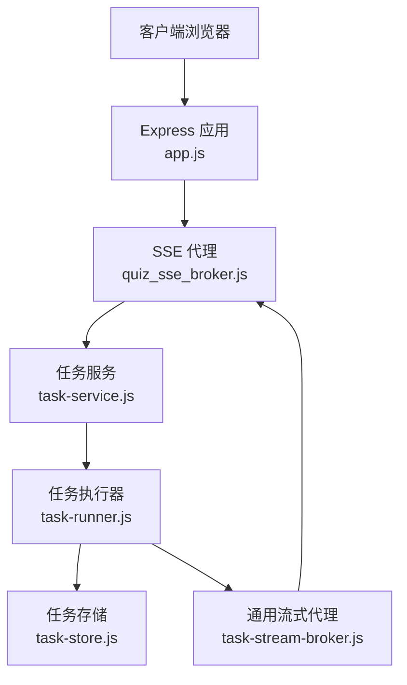
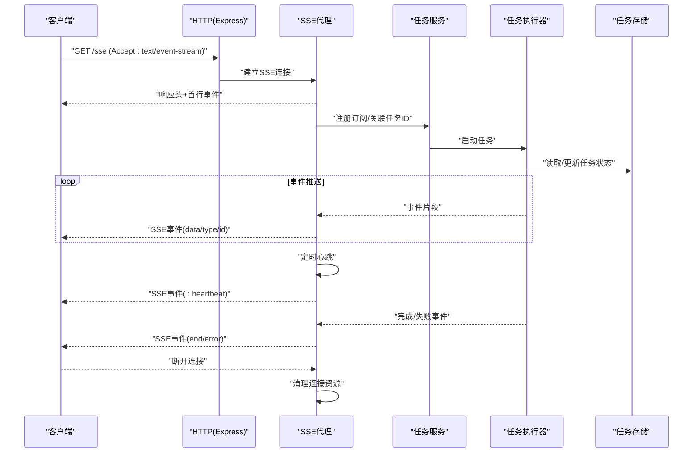
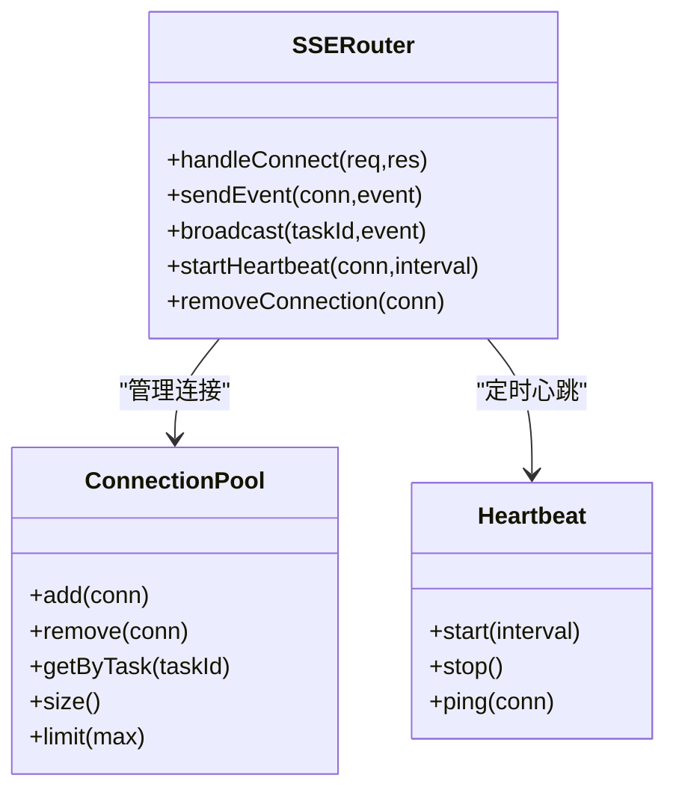
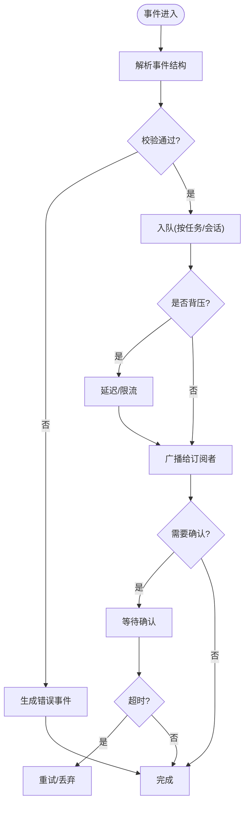
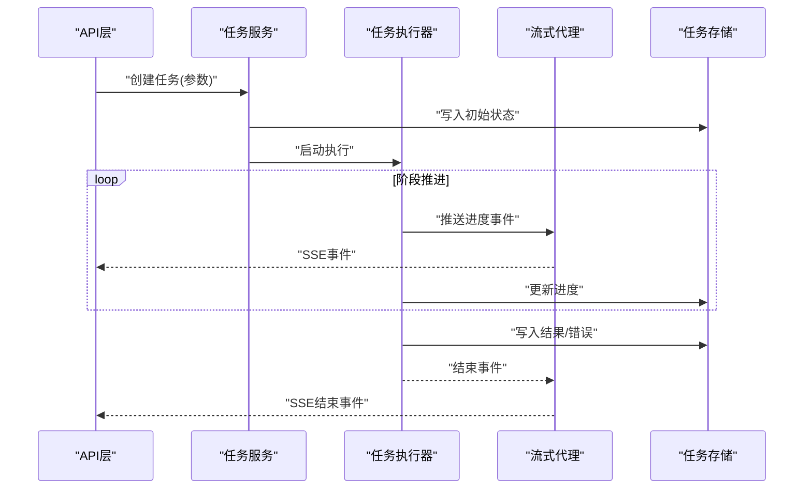
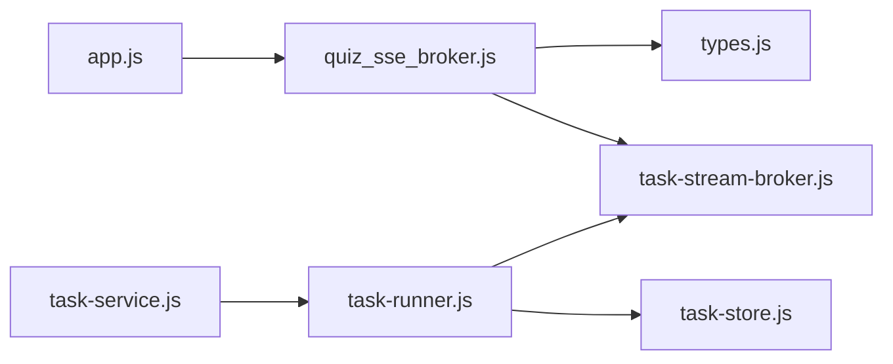

# 流式传输代理

<cite>
**本文引用的文件**   
- [app.js](file://node-jinmao/app.js)
- [quiz_sse_broker.js](file://node-jinmao/service/quiz_sse_broker.js)
- [task-stream-broker.js](file://node-jinmao/service/md2quiz/task-stream-broker.js)
- [grading-stream-broker.js](file://test/金毛刷题/backend/src/modules/quiz/grading-stream-broker.js)
- [task-service.js](file://node-jinmao/service/md2quiz/task-service.js)
- [task-runner.js](file://node-jinmao/service/md2quiz/task-runner.js)
- [task-store.js](file://node-jinmao/service/md2quiz/task-store.js)
- [types.js](file://node-jinmao/service/md2quiz/types.js)
</cite>

## 目录
1. [简介](#简介)
2. [项目结构](#项目结构)
3. [核心组件](#核心组件)
4. [架构总览](#架构总览)
5. [详细组件分析](#详细组件分析)
6. [依赖关系分析](#依赖关系分析)
7. [性能考量](#性能考量)
8. [故障排查指南](#故障排查指南)
9. [结论](#结论)
10. [附录](#附录)

## 简介
本文件面向“流式传输代理”的实现与使用，重点围绕 Server-Sent Events（SSE）在 Node.js 后端中的落地方案，涵盖连接建立、事件推送、心跳检测、客户端连接管理（连接池、复用、断线重连、连接数限制）、事件序列化与反序列化（消息格式、压缩、二进制处理）、实时通信可靠性（确认、去重、乱序处理），并提供具体使用示例与调试方法。同时给出与 WebSocket 的对比分析与迁移建议，帮助读者在不同场景下做出合理选择。

## 项目结构
本项目在后端服务中通过 Express 暴露 SSE 接口，结合任务编排与流式输出，形成“请求接入—任务调度—流式推送—客户端消费”的闭环。关键路径包括：
- HTTP 入口与路由挂载
- SSE Broker（流式代理）负责连接管理与事件广播
- 任务服务与执行器驱动业务逻辑并产出事件
- 类型定义与中间件保障数据一致性

图表来源
- [app.js](file://node-jinmao/app.js)
- [quiz_sse_broker.js](file://node-jinmao/service/quiz_sse_broker.js)
- [task-service.js](file://node-jinmao/service/md2quiz/task-service.js)
- [task-runner.js](file://node-jinmao/service/md2quiz/task-runner.js)
- [task-store.js](file://node-jinmao/service/md2quiz/task-store.js)
- [task-stream-broker.js](file://node-jinmao/service/md2quiz/task-stream-broker.js)

章节来源
- [app.js](file://node-jinmao/app.js)
- [quiz_sse_broker.js](file://node-jinmao/service/quiz_sse_broker.js)
- [task-service.js](file://node-jinmao/service/md2quiz/task-service.js)
- [task-runner.js](file://node-jinmao/service/md2quiz/task-runner.js)
- [task-store.js](file://node-jinmao/service/md2quiz/task-store.js)
- [task-stream-broker.js](file://node-jinmao/service/md2quiz/task-stream-broker.js)

## 核心组件
- SSE 代理（Quiz SSE Broker）
  - 职责：维护 SSE 连接集合、事件分发、心跳发送、连接生命周期管理。
  - 关键点：连接池化、按会话或任务维度广播、超时与清理策略。
- 通用流式代理（Task Stream Broker）
  - 职责：为不同任务类型提供统一的流式事件抽象，支持多订阅者。
  - 关键点：事件队列、背压控制、错误传播。
- 任务服务与执行器
  - 职责：接收请求、创建任务、驱动执行、产出事件并通过流式代理推送。
  - 关键点：任务状态机、重试与幂等、进度与结果上报。
- 类型定义
  - 职责：统一事件结构与字段约束，确保前后端一致。

章节来源
- [quiz_sse_broker.js](file://node-jinmao/service/quiz_sse_broker.js)
- [task-stream-broker.js](file://node-jinmao/service/md2quiz/task-stream-broker.js)
- [task-service.js](file://node-jinmao/service/md2quiz/task-service.js)
- [task-runner.js](file://node-jinmao/service/md2quiz/task-runner.js)
- [types.js](file://node-jinmao/service/md2quiz/types.js)

## 架构总览
下图展示了从客户端发起 SSE 连接到服务端持续推送事件的完整流程，以及心跳与错误处理的交互。

图表来源
- [app.js](file://node-jinmao/app.js)
- [quiz_sse_broker.js](file://node-jinmao/service/quiz_sse_broker.js)
- [task-service.js](file://node-jinmao/service/md2quiz/task-service.js)
- [task-runner.js](file://node-jinmao/service/md2quiz/task-runner.js)
- [task-store.js](file://node-jinmao/service/md2quiz/task-store.js)

## 详细组件分析

### SSE 代理（Quiz SSE Broker）
- 连接建立
  - 设置响应头为 text/event-stream，禁用缓存，保持长连接。
  - 分配唯一连接标识，加入连接池，绑定到特定任务或会话。
- 事件推送
  - 将上游事件封装为标准 SSE 格式（data、event、id）。
  - 支持批量写入与缓冲，避免频繁 I/O。
- 心跳检测
  - 周期性发送保留字符或空 data 事件，维持连接存活。
  - 可配置间隔与最大无响应次数，触发断线清理。
- 连接管理
  - 连接池：按任务/用户维度聚合连接，限制单任务并发连接数。
  - 复用：同一任务的多连接共享事件源，减少重复计算。
  - 断线重连：客户端侧实现指数退避；服务端侧对短暂中断进行缓冲与补发（可选）。
  - 连接数限制：全局上限与单任务上限，超限拒绝或排队。

图表来源
- [quiz_sse_broker.js](file://node-jinmao/service/quiz_sse_broker.js)

章节来源
- [quiz_sse_broker.js](file://node-jinmao/service/quiz_sse_broker.js)

### 通用流式代理（Task Stream Broker）
- 事件抽象
  - 定义统一的事件模型（类型、负载、序列号、时间戳）。
  - 支持多种事件类型（进度、日志、结果、错误）。
- 订阅与发布
  - 基于任务 ID 或会话 ID 的订阅机制。
  - 多订阅者广播，顺序保证与背压控制。
- 错误与异常
  - 捕获上游错误并转换为标准错误事件。
  - 支持重试与降级策略。

图表来源
- [task-stream-broker.js](file://node-jinmao/service/md2quiz/task-stream-broker.js)

章节来源
- [task-stream-broker.js](file://node-jinmao/service/md2quiz/task-stream-broker.js)

### 任务服务与执行器（Task Service & Runner）
- 任务服务
  - 接收请求参数，校验并创建任务记录。
  - 初始化任务上下文，调用执行器开始运行。
- 执行器
  - 分阶段执行（解析、生成、校验、输出）。
  - 每阶段产出事件，经流式代理推送。
  - 处理异常与重试，最终写入任务存储。
- 任务存储
  - 持久化任务状态、进度、结果与错误信息。
  - 支持查询与恢复。

图表来源
- [task-service.js](file://node-jinmao/service/md2quiz/task-service.js)
- [task-runner.js](file://node-jinmao/service/md2quiz/task-runner.js)
- [task-store.js](file://node-jinmao/service/md2quiz/task-store.js)
- [task-stream-broker.js](file://node-jinmao/service/md2quiz/task-stream-broker.js)

章节来源
- [task-service.js](file://node-jinmao/service/md2quiz/task-service.js)
- [task-runner.js](file://node-jinmao/service/md2quiz/task-runner.js)
- [task-store.js](file://node-jinmao/service/md2quiz/task-store.js)
- [task-stream-broker.js](file://node-jinmao/service/md2quiz/task-stream-broker.js)

### 类型定义（Types）
- 事件结构
  - 字段：type、payload、seq、timestamp、taskId。
  - 约束：必填字段、枚举值、长度限制。
- 任务状态
  - 枚举：pending、running、completed、failed。
  - 转换规则与触发条件。

章节来源
- [types.js](file://node-jinmao/service/md2quiz/types.js)

### 评分流式代理（Grading Stream Broker）
- 用途：针对评分任务的专用流式通道，支持细粒度事件与高吞吐。
- 特性：与通用流式代理类似，但增加评分相关字段与校验。

章节来源
- [grading-stream-broker.js](file://test/金毛刷题/backend/src/modules/quiz/grading-stream-broker.js)

## 依赖关系分析
- 模块耦合
  - SSE 代理依赖连接池与心跳模块，低耦合于业务执行器。
  - 任务服务与执行器通过流式代理解耦，便于替换或扩展。
- 外部依赖
  - Express 用于 HTTP 与 SSE 响应。
  - 任务存储可能对接数据库或内存存储。
- 潜在循环依赖
  - 通过接口与事件契约避免直接循环引用。

图表来源
- [app.js](file://node-jinmao/app.js)
- [quiz_sse_broker.js](file://node-jinmao/service/quiz_sse_broker.js)
- [task-stream-broker.js](file://node-jinmao/service/md2quiz/task-stream-broker.js)
- [task-service.js](file://node-jinmao/service/md2quiz/task-service.js)
- [task-runner.js](file://node-jinmao/service/md2quiz/task-runner.js)
- [task-store.js](file://node-jinmao/service/md2quiz/task-store.js)
- [types.js](file://node-jinmao/service/md2quiz/types.js)

章节来源
- [app.js](file://node-jinmao/app.js)
- [quiz_sse_broker.js](file://node-jinmao/service/quiz_sse_broker.js)
- [task-stream-broker.js](file://node-jinmao/service/md2quiz/task-stream-broker.js)
- [task-service.js](file://node-jinmao/service/md2quiz/task-service.js)
- [task-runner.js](file://node-jinmao/service/md2quiz/task-runner.js)
- [task-store.js](file://node-jinmao/service/md2quiz/task-store.js)
- [types.js](file://node-jinmao/service/md2quiz/types.js)

## 性能考量
- 连接池与复用
  - 同任务多连接共享事件源，降低重复计算与 I/O。
  - 连接上限与队列长度限制，防止内存泄漏。
- 事件序列化
  - 优先使用 JSON 文本，必要时启用 gzip 压缩。
  - 二进制数据采用 Base64 或分块传输，注意体积与解码开销。
- 心跳与超时
  - 合理设置心跳间隔（如 15–30 秒），避免过多开销。
  - 客户端未响应时及时释放资源。
- 背压与缓冲
  - 当客户端写入慢时，限制事件入队速率，避免阻塞。
- 水平扩展
  - 多实例部署时，通过外部消息总线或共享存储协调事件广播。

[本节为通用指导，不直接分析具体文件]

## 故障排查指南
- 连接无法建立
  - 检查响应头是否正确设置为 text/event-stream。
  - 确认防火墙与反向代理未拦截长连接。
- 事件未到达或丢失
  - 查看服务端日志与任务存储状态。
  - 检查客户端网络与浏览器控制台错误。
- 心跳失效
  - 调整心跳间隔与超时阈值。
  - 确认代理进程未被 GC 或阻塞。
- 内存增长
  - 监控连接池大小与事件队列长度。
  - 及时清理断开的连接与过期任务。
- 重复或乱序事件
  - 启用事件序号与去重逻辑。
  - 客户端侧按 seq 排序与确认机制。

章节来源
- [quiz_sse_broker.js](file://node-jinmao/service/quiz_sse_broker.js)
- [task-stream-broker.js](file://node-jinmao/service/md2quiz/task-stream-broker.js)
- [task-runner.js](file://node-jinmao/service/md2quiz/task-runner.js)

## 结论
SSE 在本项目中作为轻量级流式传输方案，适用于单向、实时的数据推送场景。通过连接池、心跳、背压与错误处理，能够在高并发环境下保持稳定。对于需要双向通信或复杂交互的场景，可考虑迁移至 WebSocket。迁移时应关注连接模型、事件协议与可靠性机制的一致性，确保平滑过渡。

[本节为总结性内容，不直接分析具体文件]

## 附录

### SSE 使用示例（发送实时事件）
- 服务端
  - 暴露 SSE 路由，建立连接后注册订阅。
  - 任务执行过程中持续推送事件，结束时发送完成或错误事件。
- 客户端
  - 使用 EventSource 或 fetch 流式读取。
  - 处理不同类型事件，实现 UI 实时更新。
  - 实现断线重连（指数退避）与事件去重。

[本节为概念性说明，不直接分析具体文件]

### 事件序列化与反序列化
- 消息格式
  - 定义统一的事件结构，包含类型、负载、序列号与时间戳。
- 压缩传输
  - 启用 gzip 或 Brotli，权衡 CPU 与带宽。
- 二进制数据处理
  - 大对象分块传输，客户端按序重组。
  - 校验完整性（如哈希或 CRC）。

[本节为概念性说明，不直接分析具体文件]

### 实时通信可靠性保障
- 消息确认
  - 客户端收到事件后返回确认，服务端累计已确认序号。
- 重复处理
  - 基于事件 ID 去重，避免重复渲染或计算。
- 乱序处理
  - 客户端按序列号排序，必要时丢弃旧事件。

[本节为概念性说明，不直接分析具体文件]

### 与 WebSocket 的对比与迁移指南
- 适用场景
  - SSE：单向推送、简单可靠、易实现。
  - WebSocket：双向通信、低延迟、复杂交互。
- 迁移步骤
  - 设计统一事件协议，兼容两种传输。
  - 替换连接建立与事件收发逻辑。
  - 调整心跳与重连策略。
  - 灰度切换与回滚预案。

[本节为概念性说明，不直接分析具体文件]