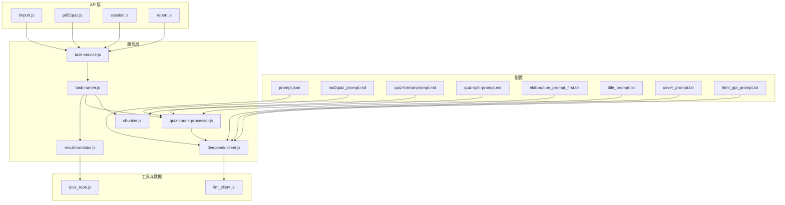
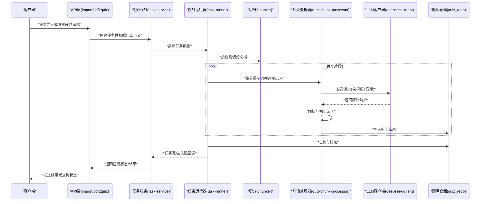
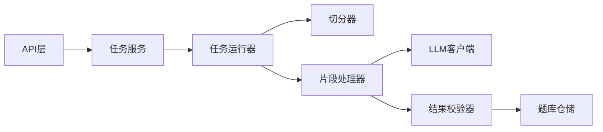

# 提示词工程

<cite>
**本文引用的文件**   
- [config/prompt.json](file://node-jinmao/config/prompt.json)
- [config/md2quiz_prompt.md](file://node-jinmao/config/md2quiz_prompt.md)
- [config/quiz-format-prompt.md](file://node-jinmao/config/quiz-format-prompt.md)
- [config/quiz-split-prompt.md](file://node-jinmao/config/quiz-split-prompt.md)
- [config/elaboration_prompt_first.txt](file://node-jinmao/config/elaboration_prompt_first.txt)
- [config/title_prompt.txt](file://node-jinmao/config/title_prompt.txt)
- [config/cover_prompt.txt](file://node-jinmao/config/cover_prompt.txt)
- [config/html_ppt_prompt.txt](file://node-jinmao/config/html_ppt_prompt.txt)
- [service/md2quiz/deepseek-client.js](file://node-jinmao/service/md2quiz/deepseek-client.js)
- [service/md2quiz/task-runner.js](file://node-jinmao/service/md2quiz/task-runner.js)
- [service/md2quiz/task-service.js](file://node-jinmao/service/md2quiz/task-service.js)
- [service/md2quiz/chunker.js](file://node-jinmao/service/md2quiz/chunker.js)
- [service/md2quiz/quiz-chunk-processor.js](file://node-jinmao/service/md2quiz/quiz-chunk-processor.js)
- [service/md2quiz/result-validator.js](file://node-jinmao/service/md2quiz/result-validator.js)
- [service/md2quiz/types.js](file://node-jinmao/service/md2quiz/types.js)
- [utils/llm_client.js](file://node-jinmao/utils/llm_client.js)
- [API/quiz/import.js](file://node-jinmao/API/quiz/import.js)
- [API/quiz/pdf2quiz.js](file://node-jinmao/API/quiz/pdf2quiz.js)
- [API/quiz/session.js](file://node-jinmao/API/quiz/session.js)
- [API/quiz/report.js](file://node-jinmao/API/quiz/report.js)
- [repo/quiz_repo.js](file://node-jinmao/repo/quiz_repo.js)
- [service/quiz_service.js](file://node-jinmao/service/quiz_service.js)
- [service/quiz_judge.js](file://node-jinmao/service/quiz_judge.js)
- [service/quiz_report_service.js](file://node-jinmao/service/quiz_report_service.js)
- [service/POSTbook.js](file://node-jinmao/service/POSTbook.js)
- [service/create_title.js](file://node-jinmao/service/create_title.js)
- [service/create_cover_image.js](file://node-jinmao/service/create_cover_image.js)
- [service/course_pipeline.js](file://node-jinmao/service/course_pipeline.js)
</cite>

## 目录
1. [简介](#简介)
2. [项目结构](#项目结构)
3. [核心组件](#核心组件)
4. [架构总览](#架构总览)
5. [详细组件分析](#详细组件分析)
6. [依赖关系分析](#依赖关系分析)
7. [性能考量](#性能考量)
8. [故障排查指南](#故障排查指南)
9. [结论](#结论)
10. [附录](#附录)

## 简介
本文件面向“提示词工程”的体系化实践，结合仓库中的题库生成、PDF转题、报告与判题等能力，系统阐述：
- 结构化提示词设计原则与最佳实践（上下文管理、输出格式控制）
- 不同类型题目的提示词策略（选择题、填空题、判断题、作文题）
- 提示词版本管理与A/B测试机制（效果评估、迭代优化、回滚策略）
- 动态提示词生成（变量替换、条件分支、个性化定制）
- 模板示例、调试优化技巧与常见问题解决方案
- 多语言支持与国际化考虑

## 项目结构
本项目将提示词以“配置驱动”的方式集中管理在配置目录中，并通过服务层统一加载、组装、调用大模型接口。关键路径包括：
- 提示词模板：位于配置目录，按用途拆分（题库生成、格式约束、切分、标题/封面/PPT等）
- 任务编排：任务运行器与服务层负责切分、调度、重试、结果校验与持久化
- LLM客户端：封装对外部大模型的调用，支持参数化与错误处理
- API层：暴露导入、PDF转题、会话、报告等接口

图表来源
- [config/prompt.json](file://node-jinmao/config/prompt.json)
- [config/md2quiz_prompt.md](file://node-jinmao/config/md2quiz_prompt.md)
- [config/quiz-format-prompt.md](file://node-jinmao/config/quiz-format-prompt.md)
- [config/quiz-split-prompt.md](file://node-jinmao/config/quiz-split-prompt.md)
- [config/elaboration_prompt_first.txt](file://node-jinmao/config/elaboration_prompt_first.txt)
- [config/title_prompt.txt](file://node-jinmao/config/title_prompt.txt)
- [config/cover_prompt.txt](file://node-jinmao/config/cover_prompt.txt)
- [config/html_ppt_prompt.txt](file://node-jinmao/config/html_ppt_prompt.txt)
- [service/md2quiz/task-runner.js](file://node-jinmao/service/md2quiz/task-runner.js)
- [service/md2quiz/task-service.js](file://node-jinmao/service/md2quiz/task-service.js)
- [service/md2quiz/chunker.js](file://node-jinmao/service/md2quiz/chunker.js)
- [service/md2quiz/quiz-chunk-processor.js](file://node-jinmao/service/md2quiz/quiz-chunk-processor.js)
- [service/md2quiz/result-validator.js](file://node-jinmao/service/md2quiz/result-validator.js)
- [service/md2quiz/deepseek-client.js](file://node-jinmao/service/md2quiz/deepseek-client.js)
- [utils/llm_client.js](file://node-jinmao/utils/llm_client.js)
- [repo/quiz_repo.js](file://node-jinmao/repo/quiz_repo.js)
- [API/quiz/import.js](file://node-jinmao/API/quiz/import.js)
- [API/quiz/pdf2quiz.js](file://node-jinmao/API/quiz/pdf2quiz.js)
- [API/quiz/session.js](file://node-jinmao/API/quiz/session.js)
- [API/quiz/report.js](file://node-jinmao/API/quiz/report.js)

章节来源
- [service/md2quiz/task-runner.js](file://node-jinmao/service/md2quiz/task-runner.js)
- [service/md2quiz/task-service.js](file://node-jinmao/service/md2quiz/task-service.js)
- [service/md2quiz/chunker.js](file://node-jinmao/service/md2quiz/chunker.js)
- [service/md2quiz/quiz-chunk-processor.js](file://node-jinmao/service/md2quiz/quiz-chunk-processor.js)
- [service/md2quiz/result-validator.js](file://node-jinmao/service/md2quiz/result-validator.js)
- [service/md2quiz/deepseek-client.js](file://node-jinmao/service/md2quiz/deepseek-client.js)
- [utils/llm_client.js](file://node-jinmao/utils/llm_client.js)
- [repo/quiz_repo.js](file://node-jinmao/repo/quiz_repo.js)
- [API/quiz/import.js](file://node-jinmao/API/quiz/import.js)
- [API/quiz/pdf2quiz.js](file://node-jinmao/API/quiz/pdf2quiz.js)
- [API/quiz/session.js](file://node-jinmao/API/quiz/session.js)
- [API/quiz/report.js](file://node-jinmao/API/quiz/report.js)

## 核心组件
- 提示词模板库
  - 题库生成主模板：用于从Markdown内容生成题目集合
  - 格式约束模板：强制LLM输出符合规范的JSON结构
  - 切分模板：指导长文档切分为可处理的片段
  - 扩展模板：标题、封面、PPT等辅助生成
- 任务编排与执行
  - 任务运行器：负责并发、重试、进度上报与异常恢复
  - 任务服务：协调切分、处理、校验、落库
  - 处理器：对每个片段进行提示词组装与大模型调用
  - 校验器：对LLM返回结果进行结构与语义校验
- LLM客户端
  - 统一封装外部大模型调用，支持参数注入、超时、重试、错误分类
- 数据持久化
  - 题库仓储：读写题库、任务状态、报告等数据

章节来源
- [config/md2quiz_prompt.md](file://node-jinmao/config/md2quiz_prompt.md)
- [config/quiz-format-prompt.md](file://node-jinmao/config/quiz-format-prompt.md)
- [config/quiz-split-prompt.md](file://node-jinmao/config/quiz-split-prompt.md)
- [config/elaboration_prompt_first.txt](file://node-jinmao/config/elaboration_prompt_first.txt)
- [config/title_prompt.txt](file://node-jinmao/config/title_prompt.txt)
- [config/cover_prompt.txt](file://node-jinmao/config/cover_prompt.txt)
- [config/html_ppt_prompt.txt](file://node-jinmao/config/html_ppt_prompt.txt)
- [service/md2quiz/task-runner.js](file://node-jinmao/service/md2quiz/task-runner.js)
- [service/md2quiz/task-service.js](file://node-jinmao/service/md2quiz/task-service.js)
- [service/md2quiz/quiz-chunk-processor.js](file://node-jinmao/service/md2quiz/quiz-chunk-processor.js)
- [service/md2quiz/result-validator.js](file://node-jinmao/service/md2quiz/result-validator.js)
- [service/md2quiz/deepseek-client.js](file://node-jinmao/service/md2quiz/deepseek-client.js)
- [utils/llm_client.js](file://node-jinmao/utils/llm_client.js)
- [repo/quiz_repo.js](file://node-jinmao/repo/quiz_repo.js)

## 架构总览
下图展示了从API到提示词模板、任务编排、LLM调用与数据落库的整体流程。

图表来源
- [API/quiz/import.js](file://node-jinmao/API/quiz/import.js)
- [API/quiz/pdf2quiz.js](file://node-jinmao/API/quiz/pdf2quiz.js)
- [service/md2quiz/task-service.js](file://node-jinmao/service/md2quiz/task-service.js)
- [service/md2quiz/task-runner.js](file://node-jinmao/service/md2quiz/task-runner.js)
- [service/md2quiz/chunker.js](file://node-jinmao/service/md2quiz/chunker.js)
- [service/md2quiz/quiz-chunk-processor.js](file://node-jinmao/service/md2quiz/quiz-chunk-processor.js)
- [service/md2quiz/deepseek-client.js](file://node-jinmao/service/md2quiz/deepseek-client.js)
- [repo/quiz_repo.js](file://node-jinmao/repo/quiz_repo.js)

## 详细组件分析

### 提示词模板设计与最佳实践
- 结构化提示词
  - 明确角色与目标：定义“你是出题专家”，限定学科、难度、题型分布
  - 输入上下文：提供教材片段、知识点、先决知识、术语表
  - 输出规范：强制JSON Schema，字段名、类型、枚举值、必填项
  - 约束与边界：禁止泄露答案、避免歧义、长度限制、引用来源
- 上下文管理
  - 分段注入：按章节/段落注入上下文，避免超长导致信息丢失
  - 记忆与摘要：对前序片段的关键信息进行摘要，保持连贯性
  - 版本隔离：不同版本的模板使用独立命名空间与版本号
- 输出格式控制
  - 强约束模板：通过“格式模板”强制LLM输出标准结构
  - 后处理校验：服务端二次校验，失败则触发重试或降级
  - 可观测性：记录提示词版本、输入摘要、输出哈希，便于追踪

章节来源
- [config/md2quiz_prompt.md](file://node-jinmao/config/md2quiz_prompt.md)
- [config/quiz-format-prompt.md](file://node-jinmao/config/quiz-format-prompt.md)
- [config/quiz-split-prompt.md](file://node-jinmao/config/quiz-split-prompt.md)
- [config/elaboration_prompt_first.txt](file://node-jinmao/config/elaboration_prompt_first.txt)

### 不同类型题目的提示词策略
- 选择题
  - 题干清晰、选项互斥且无暗示；干扰项需具备迷惑性但合理
  - 指定难度等级与知识点标签；要求给出解析与出处
- 填空题
  - 空位数量与位置明确；避免多解歧义；必要时提供单位或范围
  - 答案标准化（大小写、单位、数值精度）
- 判断题
  - 陈述句简洁明确；避免双重否定；说明判断依据
- 作文题
  - 主题、体裁、字数、评分维度明确；提供评分量表与样例
  - 要求输出结构化评分与改进建议

章节来源
- [config/md2quiz_prompt.md](file://node-jinmao/config/md2quiz_prompt.md)
- [config/quiz-format-prompt.md](file://node-jinmao/config/quiz-format-prompt.md)

### 动态提示词生成
- 变量替换
  - 将学科、难度、题型、用户画像、上下文摘要作为变量注入模板
  - 支持嵌套变量与默认值，缺失时回退到安全默认
- 条件分支
  - 根据输入特征（如文本长度、领域、历史表现）选择不同模板或参数
  - 针对作文题启用评分模板，针对客观题启用校验模板
- 个性化定制
  - 基于用户学习轨迹调整难度与知识点覆盖
  - 支持多语言切换与本地化表达

章节来源
- [config/prompt.json](file://node-jinmao/config/prompt.json)
- [service/md2quiz/quiz-chunk-processor.js](file://node-jinmao/service/md2quiz/quiz-chunk-processor.js)
- [service/md2quiz/deepseek-client.js](file://node-jinmao/service/md2quiz/deepseek-client.js)

### 提示词版本管理与A/B测试
- 版本管理
  - 为每个模板维护版本号与变更日志；运行时锁定版本
  - 灰度发布：按流量比例路由到不同版本
- A/B测试
  - 指标：通过率、解析准确率、耗时、成本、用户满意度
  - 分流策略：随机或基于用户特征的分流
  - 统计显著性：设定阈值与观察周期，自动决策升级或回滚
- 回滚策略
  - 一键回滚至上一稳定版本；保留快照与审计日志
  - 失败快速熔断：当错误率超限时自动降级

章节来源
- [service/md2quiz/task-runner.js](file://node-jinmao/service/md2quiz/task-runner.js)
- [service/md2quiz/task-service.js](file://node-jinmao/service/md2quiz/task-service.js)
- [service/md2quiz/result-validator.js](file://node-jinmao/service/md2quiz/result-validator.js)

### 多语言支持与国际化
- 模板多语言
  - 按语言组织模板文件或使用语言键值映射
  - 支持RTL与字符集差异
- 内容与输出
  - 强制LLM按目标语言输出；统一术语表与单位
  - 本地化日期、数字、分数格式
- 检测与回退
  - 自动检测输入语言；失败时回退到英文模板再翻译

章节来源
- [config/prompt.json](file://node-jinmao/config/prompt.json)
- [service/md2quiz/deepseek-client.js](file://node-jinmao/service/md2quiz/deepseek-client.js)

### 具体模板示例与用法指引
- 题库生成主模板
  - 用途：从Markdown片段生成结构化题目集合
  - 关键点：题型分布、难度梯度、解析与出处、JSON约束
  - 参考路径：[config/md2quiz_prompt.md](file://node-jinmao/config/md2quiz_prompt.md)
- 格式约束模板
  - 用途：确保LLM输出严格符合Schema
  - 关键点：字段枚举、必填校验、长度限制、禁止自由文本
  - 参考路径：[config/quiz-format-prompt.md](file://node-jinmao/config/quiz-format-prompt.md)
- 切分模板
  - 用途：指导长文档切分为可处理片段
  - 关键点：边界识别、跨段连续性、摘要注入
  - 参考路径：[config/quiz-split-prompt.md](file://node-jinmao/config/quiz-split-prompt.md)
- 扩展模板
  - 标题生成：[config/title_prompt.txt](file://node-jinmao/config/title_prompt.txt)
  - 封面生成：[config/cover_prompt.txt](file://node-jinmao/config/cover_prompt.txt)
  - PPT生成：[config/html_ppt_prompt.txt](file://node-jinmao/config/html_ppt_prompt.txt)
  - 首次扩写：[config/elaboration_prompt_first.txt](file://node-jinmao/config/elaboration_prompt_first.txt)

章节来源
- [config/md2quiz_prompt.md](file://node-jinmao/config/md2quiz_prompt.md)
- [config/quiz-format-prompt.md](file://node-jinmao/config/quiz-format-prompt.md)
- [config/quiz-split-prompt.md](file://node-jinmao/config/quiz-split-prompt.md)
- [config/title_prompt.txt](file://node-jinmao/config/title_prompt.txt)
- [config/cover_prompt.txt](file://node-jinmao/config/cover_prompt.txt)
- [config/html_ppt_prompt.txt](file://node-jinmao/config/html_ppt_prompt.txt)
- [config/elaboration_prompt_first.txt](file://node-jinmao/config/elaboration_prompt_first.txt)

### 调试与优化技巧
- 可观测性
  - 记录提示词版本、输入摘要、输出哈希、耗时、错误码
  - 采样保存失败样本，建立回归测试集
- 渐进式优化
  - 先固定模板，再引入变量；先单题型，再混合题型
  - 逐步放宽约束，观察稳定性变化
- 常见陷阱
  - 过长上下文导致注意力分散：采用摘要与分段
  - 输出不稳定：强化格式约束与后处理校验
  - 多语言混用：统一语言开关与术语表

章节来源
- [service/md2quiz/result-validator.js](file://node-jinmao/service/md2quiz/result-validator.js)
- [service/md2quiz/task-runner.js](file://node-jinmao/service/md2quiz/task-runner.js)

### 常见问题解决方案
- LLM返回非JSON
  - 强制格式模板+二次解析；失败重试与降级策略
- 解析失败或字段缺失
  - 增加必填校验与默认值填充；记录失败原因
- 超时或限流
  - 指数退避重试；队列削峰；降级到缓存或简化模板
- 质量不达标
  - 引入人工抽检与反馈闭环；A/B对比与自动回滚

章节来源
- [service/md2quiz/result-validator.js](file://node-jinmao/service/md2quiz/result-validator.js)
- [service/md2quiz/deepseek-client.js](file://node-jinmao/service/md2quiz/deepseek-client.js)

## 依赖关系分析
- 模块耦合
  - API层依赖任务服务；任务服务依赖运行器与处理器；处理器依赖LLM客户端
  - 校验器与仓储负责数据一致性与持久化
- 外部依赖
  - 大模型接口（DeepSeek等）；对象存储（MinIO）；数据库（Prisma）
- 潜在风险
  - 循环依赖应避免；外部接口需熔断与降级

图表来源
- [API/quiz/import.js](file://node-jinmao/API/quiz/import.js)
- [API/quiz/pdf2quiz.js](file://node-jinmao/API/quiz/pdf2quiz.js)
- [service/md2quiz/task-service.js](file://node-jinmao/service/md2quiz/task-service.js)
- [service/md2quiz/task-runner.js](file://node-jinmao/service/md2quiz/task-runner.js)
- [service/md2quiz/chunker.js](file://node-jinmao/service/md2quiz/chunker.js)
- [service/md2quiz/quiz-chunk-processor.js](file://node-jinmao/service/md2quiz/quiz-chunk-processor.js)
- [service/md2quiz/result-validator.js](file://node-jinmao/service/md2quiz/result-validator.js)
- [service/md2quiz/deepseek-client.js](file://node-jinmao/service/md2quiz/deepseek-client.js)
- [repo/quiz_repo.js](file://node-jinmao/repo/quiz_repo.js)

章节来源
- [service/md2quiz/task-service.js](file://node-jinmao/service/md2quiz/task-service.js)
- [service/md2quiz/task-runner.js](file://node-jinmao/service/md2quiz/task-runner.js)
- [service/md2quiz/quiz-chunk-processor.js](file://node-jinmao/service/md2quiz/quiz-chunk-processor.js)
- [service/md2quiz/result-validator.js](file://node-jinmao/service/md2quiz/result-validator.js)
- [service/md2quiz/deepseek-client.js](file://node-jinmao/service/md2quiz/deepseek-client.js)
- [repo/quiz_repo.js](file://node-jinmao/repo/quiz_repo.js)

## 性能考量
- 并发与吞吐
  - 并行处理多个片段；限制并发度避免过载
- 缓存与复用
  - 缓存常用模板与摘要；对重复输入去重
- 资源控制
  - 设置超时、重试上限、内存限制；监控CPU与网络
- 批处理与流式
  - 批量生成与流式传输降低延迟

章节来源
- [service/md2quiz/task-runner.js](file://node-jinmao/service/md2quiz/task-runner.js)
- [service/md2quiz/deepseek-client.js](file://node-jinmao/service/md2quiz/deepseek-client.js)

## 故障排查指南
- 定位问题
  - 查看任务日志与提示词版本；核对输入摘要与输出哈希
- 常见错误
  - 模板版本不一致；变量缺失；LLM限流；JSON解析失败
- 修复步骤
  - 回滚模板版本；补充变量；重试与降级；增强校验

章节来源
- [service/md2quiz/task-runner.js](file://node-jinmao/service/md2quiz/task-runner.js)
- [service/md2quiz/result-validator.js](file://node-jinmao/service/md2quiz/result-validator.js)
- [service/md2quiz/deepseek-client.js](file://node-jinmao/service/md2quiz/deepseek-client.js)

## 结论
通过集中化的提示词模板、严格的格式约束、完善的任务编排与校验机制，本项目实现了高质量、可追溯、可演进的提示词工程体系。建议在持续实践中完善A/B测试与自动化评估，推动模板迭代与质量提升。

## 附录
- 相关服务与工具
  - 判题与报告：[service/quiz_judge.js](file://node-jinmao/service/quiz_judge.js)、[service/quiz_report_service.js](file://node-jinmao/service/quiz_report_service.js)
  - 课程流水线：[service/course_pipeline.js](file://node-jinmao/service/course_pipeline.js)
  - 标题与封面生成：[service/create_title.js](file://node-jinmao/service/create_title.js)、[service/create_cover_image.js](file://node-jinmao/service/create_cover_image.js)
  - POSTbook处理：[service/POSTbook.js](file://node-jinmao/service/POSTbook.js)