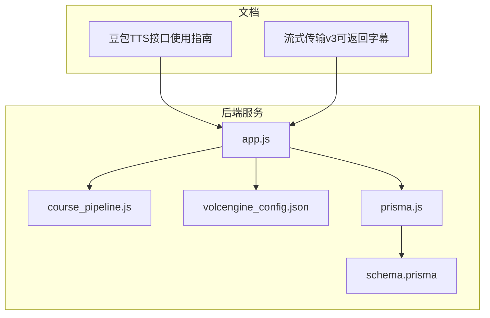
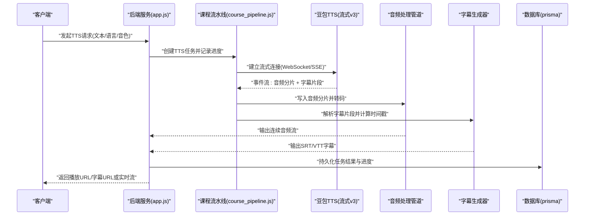
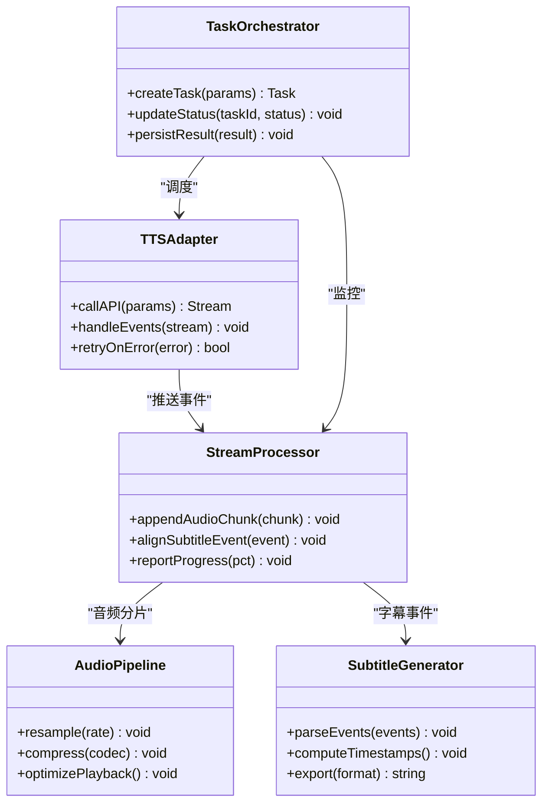
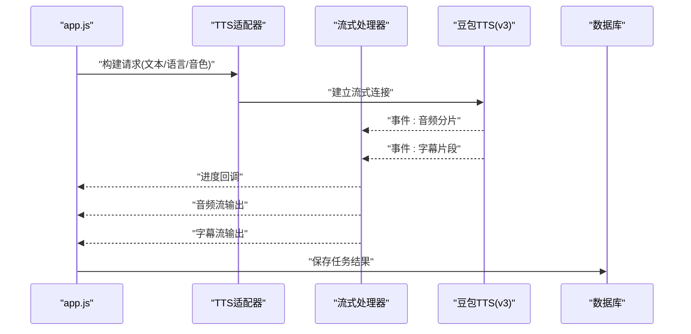
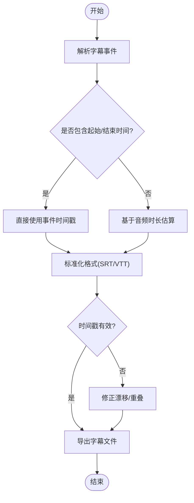
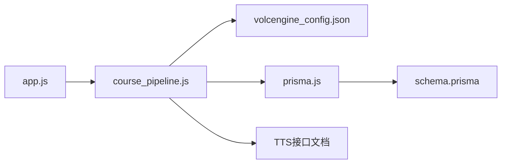

# 语音合成集成

<cite>
**本文引用的文件**   
- [doc/豆包TTS接口使用指南.md](file://doc/豆包TTS接口使用指南.md)
- [doc/豆包语音合成大模型流式传输v3可返回字幕.md](file://doc/豆包语音合成大模型流式传输v3可返回字幕.md)
- [node-jinmao/app.js](file://node-jinmao/app.js)
- [node-jinmao/package.json](file://node-jinmao/package.json)
- [node-jinmao/config/volcengine_config.json](file://node-jinmao/config/volcengine_config.json)
- [node-jinmao/service/course_pipeline.js](file://node-jinmao/service/course_pipeline.js)
- [node-jinmao/utils/prisma.js](file://node-jinmao/utils/prisma.js)
- [node-jinmao/prisma/schema.prisma](file://node-jinmao/prisma/schema.prisma)
</cite>

## 目录
1. [简介](#简介)
2. [项目结构](#项目结构)
3. [核心组件](#核心组件)
4. [架构总览](#架构总览)
5. [详细组件分析](#详细组件分析)
6. [依赖分析](#依赖分析)
7. [性能考虑](#性能考虑)
8. [故障排查指南](#故障排查指南)
9. [结论](#结论)
10. [附录](#附录)

## 简介
本文件面向“语音合成集成”的完整实现与使用，重点围绕豆包TTS服务的接入方式、流式传输机制、音频处理管道、字幕生成与同步、错误处理与降级策略、离线模式支持以及性能调优方法。文档基于仓库中的接口说明文档与后端服务代码进行系统化梳理，帮助读者快速理解并落地集成方案。

## 项目结构
本项目采用前后端分离的结构：前端位于 WEB 目录，后端服务位于 node-jinmao 目录。与语音合成相关的技术参考文档集中在 doc 目录，后端服务通过配置与中间件组织各功能模块。

图表来源 
- [doc/豆包TTS接口使用指南.md](file://doc/豆包TTS接口使用指南.md)
- [doc/豆包语音合成大模型流式传输v3可返回字幕.md](file://doc/豆包语音合成大模型流式传输v3可返回字幕.md)
- [node-jinmao/app.js](file://node-jinmao/app.js)
- [node-jinmao/service/course_pipeline.js](file://node-jinmao/service/course_pipeline.js)
- [node-jinmao/config/volcengine_config.json](file://node-jinmao/config/volcengine_config.json)
- [node-jinmao/utils/prisma.js](file://node-jinmao/utils/prisma.js)
- [node-jinmao/prisma/schema.prisma](file://node-jinmao/prisma/schema.prisma)

章节来源
- [node-jinmao/app.js](file://node-jinmao/app.js)
- [node-jinmao/package.json](file://node-jinmao/package.json)

## 核心组件
- TTS 接口适配层：封装豆包TTS API调用（含流式v3），统一请求参数、鉴权、重试与错误映射。
- 流式传输处理器：接收服务端推送的音频分片与字幕片段，按时间戳对齐，输出连续音频流与SRT/VTT字幕。
- 音频处理管道：对原始PCM/WAV进行采样率转换、降噪、压缩编码（如AAC/MP3）、播放优化（缓冲与延迟控制）。
- 字幕生成器：解析流式返回的字幕事件，计算起止时间戳，输出标准格式（SRT/VTT），支持多语言切换。
- 任务编排与持久化：将TTS任务纳入课程生成流水线，记录进度、失败重试、结果落库与缓存。

章节来源
- [doc/豆包TTS接口使用指南.md](file://doc/豆包TTS接口使用指南.md)
- [doc/豆包语音合成大模型流式传输v3可返回字幕.md](file://doc/豆包语音合成大模型流式传输v3可返回字幕.md)
- [node-jinmao/service/course_pipeline.js](file://node-jinmao/service/course_pipeline.js)
- [node-jinmao/prisma/schema.prisma](file://node-jinmao/prisma/schema.prisma)

## 架构总览
整体流程从业务侧发起TTS请求，进入后端服务后由TTS适配层调用豆包流式接口；服务端以事件流形式返回音频分片与字幕片段，流式处理器负责拼接音频与对齐字幕；最终输出可播放音频与标准字幕文件，供前端播放器与字幕渲染组件消费。

图表来源 
- [node-jinmao/app.js](file://node-jinmao/app.js)
- [node-jinmao/service/course_pipeline.js](file://node-jinmao/service/course_pipeline.js)
- [node-jinmao/utils/prisma.js](file://node-jinmao/utils/prisma.js)
- [node-jinmao/prisma/schema.prisma](file://node-jinmao/prisma/schema.prisma)
- [doc/豆包语音合成大模型流式传输v3可返回字幕.md](file://doc/豆包语音合成大模型流式传输v3可返回字幕.md)

## 详细组件分析

### 豆包TTS接口适配层
- 职责：封装鉴权、请求构造、流式连接管理、事件解析、错误映射与重试。
- 关键点：
  - 鉴权：根据 volcengine_config.json 获取密钥与签名参数。
  - 流式协议：遵循 v3 流式规范，处理音频分片与字幕事件。
  - 错误处理：网络异常、限流、鉴权失败等统一映射为业务错误码。
  - 重试策略：指数退避与最大重试次数限制。

章节来源
- [node-jinmao/config/volcengine_config.json](file://node-jinmao/config/volcengine_config.json)
- [doc/豆包TTS接口使用指南.md](file://doc/豆包TTS接口使用指南.md)
- [doc/豆包语音合成大模型流式传输v3可返回字幕.md](file://doc/豆包语音合成大模型流式传输v3可返回字幕.md)

### 流式传输处理器
- 职责：维护流状态、合并音频分片、对齐字幕事件、进度上报。
- 关键点：
  - 实时音频流：按顺序写入缓冲区，避免抖动与卡顿。
  - 进度反馈：每收到N个分片或达到固定时长阈值时向前端推送进度。
  - 错误处理：断线重连、丢包补偿、超时熔断。
  - 资源清理：及时释放流句柄与临时文件。

章节来源
- [doc/豆包语音合成大模型流式传输v3可返回字幕.md](file://doc/豆包语音合成大模型流式传输v3可返回字幕.md)
- [node-jinmao/service/course_pipeline.js](file://node-jinmao/service/course_pipeline.js)

### 音频处理管道
- 职责：输入原始音频流，执行采样率调整、降噪、压缩编码、播放优化。
- 关键点：
  - 采样率调整：根据目标设备与带宽选择合适采样率（如16k/24k/48k）。
  - 压缩编码：优先AAC/Opus，兼顾兼容性与体积。
  - 播放优化：预缓冲、动态码率、静音裁剪、响度归一化。
  - 质量评估：SNR、峰值检测、失真阈值监控。

章节来源
- [node-jinmao/service/course_pipeline.js](file://node-jinmao/service/course_pipeline.js)

### 字幕生成器
- 职责：解析流式字幕事件，计算起止时间戳，输出SRT/VTT，支持多语言。
- 关键点：
  - 时间戳计算：基于事件到达时间与音频时长比例换算。
  - 格式标准：SRT/VTT字段规范、换行与序号规则。
  - 多语言支持：按语言键值区分字幕轨道，播放器按需切换。
  - 同步校验：与音频边界对齐，修正漂移与重叠。

章节来源
- [doc/豆包语音合成大模型流式传输v3可返回字幕.md](file://doc/豆包语音合成大模型流式传输v3可返回字幕.md)

### 任务编排与持久化
- 职责：将TTS任务纳入课程生成流水线，记录进度、失败重试、结果落库。
- 关键点：
  - 任务状态机：待处理、进行中、完成、失败、重试中。
  - 进度上报：阶段级与事件级进度更新。
  - 数据模型：依据 schema.prisma 定义任务、音频、字幕实体关系。
  - 存储策略：本地临时文件+对象存储（MinIO）归档。

章节来源
- [node-jinmao/service/course_pipeline.js](file://node-jinmao/service/course_pipeline.js)
- [node-jinmao/prisma/schema.prisma](file://node-jinmao/prisma/schema.prisma)
- [node-jinmao/utils/prisma.js](file://node-jinmao/utils/prisma.js)

#### 类图（概念映射到实际组件）

图表来源 
- [node-jinmao/service/course_pipeline.js](file://node-jinmao/service/course_pipeline.js)
- [doc/豆包语音合成大模型流式传输v3可返回字幕.md](file://doc/豆包语音合成大模型流式传输v3可返回字幕.md)

#### 序列图（TTS流式调用流程）

图表来源 
- [node-jinmao/app.js](file://node-jinmao/app.js)
- [node-jinmao/service/course_pipeline.js](file://node-jinmao/service/course_pipeline.js)
- [doc/豆包语音合成大模型流式传输v3可返回字幕.md](file://doc/豆包语音合成大模型流式传输v3可返回字幕.md)

#### 流程图（字幕时间戳计算）

图表来源 
- [doc/豆包语音合成大模型流式传输v3可返回字幕.md](file://doc/豆包语音合成大模型流式传输v3可返回字幕.md)

## 依赖分析
- 外部依赖：豆包TTS API（鉴权、流式协议、字幕返回）。
- 内部依赖：课程流水线、数据库访问（Prisma）、配置中心（volcengine_config.json）。
- 耦合关系：TTS适配器与流式处理器强耦合；音频处理与字幕生成相对独立；任务编排居中协调。

图表来源 
- [node-jinmao/app.js](file://node-jinmao/app.js)
- [node-jinmao/service/course_pipeline.js](file://node-jinmao/service/course_pipeline.js)
- [node-jinmao/config/volcengine_config.json](file://node-jinmao/config/volcengine_config.json)
- [node-jinmao/utils/prisma.js](file://node-jinmao/utils/prisma.js)
- [node-jinmao/prisma/schema.prisma](file://node-jinmao/prisma/schema.prisma)
- [doc/豆包TTS接口使用指南.md](file://doc/豆包TTS接口使用指南.md)

章节来源
- [node-jinmao/package.json](file://node-jinmao/package.json)
- [node-jinmao/config/volcengine_config.json](file://node-jinmao/config/volcengine_config.json)

## 性能考虑
- 流式缓冲：合理设置分片大小与缓冲队列长度，降低CPU与内存峰值。
- 并发控制：限制同时进行的TTS任务数，避免API限流与服务过载。
- 编码策略：根据网络条件动态选择码率与编码格式，平衡音质与体积。
- 字幕对齐：批量处理字幕事件，减少频繁I/O与锁竞争。
- 缓存与复用：常用音色与模板缓存，缩短冷启动时间。
- 监控指标：端到端延迟、吞吐、错误率、重试次数、CPU/内存占用。

[本节为通用指导，不直接分析具体文件]

## 故障排查指南
- 鉴权失败：检查 volcengine_config.json 的密钥与签名参数是否正确。
- 流式中断：捕获断线事件，触发指数退避重连；记录断点位置以便恢复。
- 字幕不同步：校验时间戳范围与音频边界，必要时进行漂移修正。
- 音频质量差：检查采样率与编码参数，启用响度归一化与降噪。
- 任务失败：查看任务状态机与日志，定位失败阶段并自动重试或降级。

章节来源
- [node-jinmao/config/volcengine_config.json](file://node-jinmao/config/volcengine_config.json)
- [node-jinmao/service/course_pipeline.js](file://node-jinmao/service/course_pipeline.js)
- [doc/豆包语音合成大模型流式传输v3可返回字幕.md](file://doc/豆包语音合成大模型流式传输v3可返回字幕.md)

## 结论
通过统一的TTS适配层、流式处理器、音频管道与字幕生成器，结合任务编排与持久化，可实现高可用、低延迟、高质量的语音合成集成。配合完善的错误处理、降级策略与离线模式，可在复杂网络与资源受限环境下稳定运行。建议持续监控关键指标并迭代优化参数，以获得最佳用户体验。

[本节为总结性内容，不直接分析具体文件]

## 附录
- 配置示例要点：
  - 鉴权信息：密钥、签名算法、请求头模板。
  - 流式参数：分片大小、超时、重试次数、最大并发。
  - 音频参数：采样率、编码格式、码率、降噪开关。
  - 字幕参数：输出格式、语言键、时间戳精度。
- 音频处理管道设计：
  - 输入：原始PCM/WAV流。
  - 处理：采样率转换→降噪→压缩编码→响度归一化。
  - 输出：AAC/MP3流与对应字幕文件。
- 性能调优方法：
  - 调整缓冲与并发上限。
  - 选择合适的编码与码率。
  - 启用CDN与缓存策略。
  - 监控与告警联动。

[本节为补充说明，不直接分析具体文件]