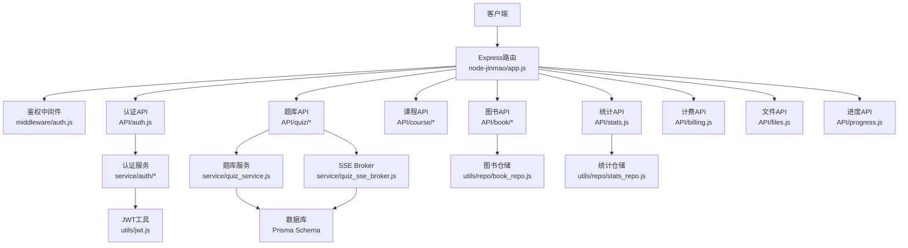
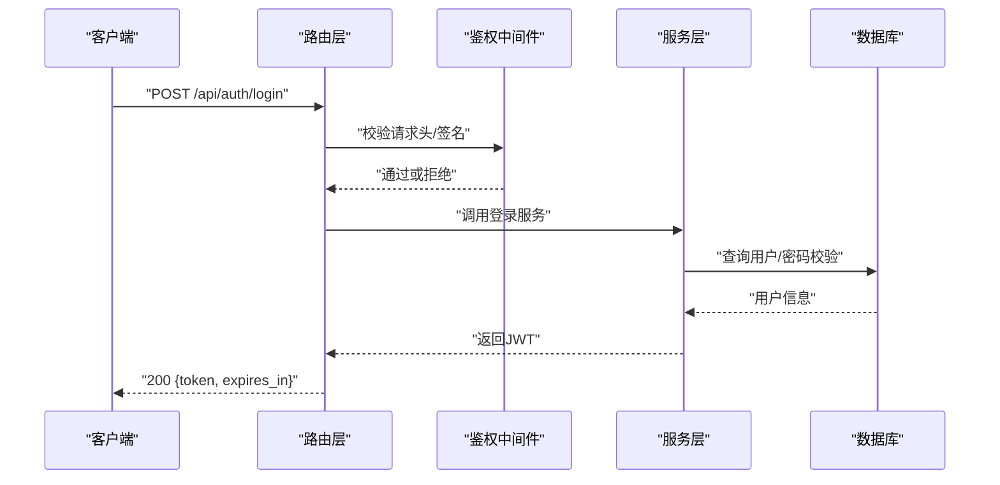
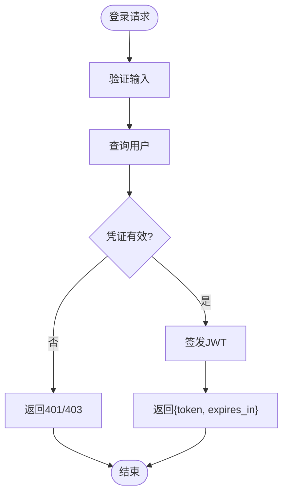
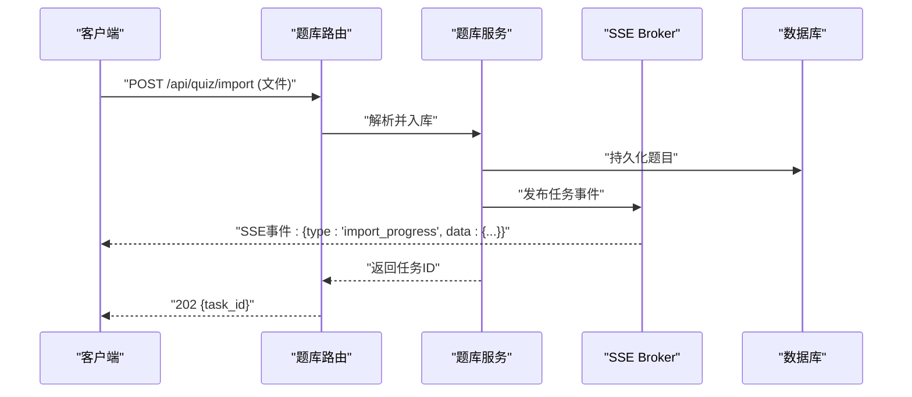
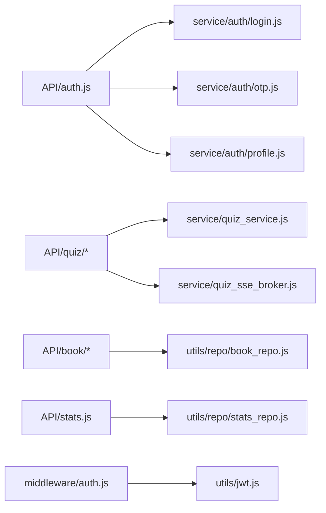

# API接口文档

<cite>
**本文档引用的文件**   
- [app.js](file://node-jinmao/app.js)
- [auth.js](file://node-jinmao/API/auth.js)
- [billing.js](file://node-jinmao/API/billing.js)
- [files.js](file://node-jinmao/API/files.js)
- [progress.js](file://node-jinmao/API/progress.js)
- [stats.js](file://node-jinmao/API/stats.js)
- [book/index.js](file://node-jinmao/API/book/index.js)
- [book/list.js](file://node-jinmao/API/book/list.js)
- [book/detail.js](file://node-jinmao/API/book/detail.js)
- [book/update.js](file://node-jinmao/API/book/update.js)
- [book/delete.js](file://node-jinmao/API/book/delete.js)
- [book/files.js](file://node-jinmao/API/book/files.js)
- [book/generate-next-chapter.js](file://node-jinmao/API/book/generate-next-chapter.js)
- [book/fix-missing.js](file://node-jinmao/API/book/fix-missing.js)
- [course/index.js](file://node-jinmao/API/course/index.js)
- [course/slides.js](file://node-jinmao/API/course/slides.js)
- [quiz/import.js](file://node-jinmao/API/quiz/import.js)
- [quiz/md2json.js](file://node-jinmao/API/quiz/md2json.js)
- [quiz/pdf2quiz.js](file://node-jinmao/API/quiz/pdf2quiz.js)
- [quiz/report.js](file://node-jinmao/API/quiz/report.js)
- [quiz/session.js](file://node-jinmao/API/quiz/session.js)
- [quiz/textbooks.js](file://node-jinmao/API/quiz/textbooks.js)
- [quiz/wrongbook.js](file://node-jinmao/API/quiz/wrongbook.js)
- [middleware/auth.js](file://node-jinmao/middleware/auth.js)
- [utils/jwt.js](file://node-jinmao/utils/jwt.js)
- [service/auth/login.js](file://node-jinmao/service/auth/login.js)
- [service/auth/otp.js](file://node-jinmao/service/auth/otp.js)
- [service/auth/profile.js](file://node-jinmao/service/auth/profile.js)
- [service/quiz_service.js](file://node-jinmao/service/quiz_service.js)
- [service/quiz_sse_broker.js](file://node-jinmao/service/quiz_sse_broker.js)
- [service/md2quiz/task-stream-broker.js](file://node-jinmao/service/md2quiz/task-stream-broker.js)
- [prisma/schema.prisma](file://node-jinmao/prisma/schema.prisma)
- [API文档.md](file://API文档.md)
</cite>

## 目录
1. [简介](#简介)
2. [项目结构](#项目结构)
3. [核心组件](#核心组件)
4. [架构总览](#架构总览)
5. [详细组件分析](#详细组件分析)
6. [依赖关系分析](#依赖关系分析)
7. [性能考虑](#性能考虑)
8. [故障排查指南](#故障排查指南)
9. [结论](#结论)
10. [附录](#附录)

## 简介
本文件为“金毛教你学重构版”的完整API接口文档，覆盖RESTful端点、认证与JWT令牌获取/刷新、题库CRUD与批量导入导出、课程管理、统计数据查询、以及WebSocket/SSE实时通信。文档包含请求方法、URL模式、参数说明、响应格式、状态码含义、错误处理、限流策略、版本兼容信息，并提供客户端集成指南与调试工具使用方法。

## 项目结构
后端采用Node.js（Express）模块化路由组织，按业务域划分API目录：
- API层：按模块拆分（auth、book、course、quiz、billing、files、progress、stats）
- 中间件：鉴权等通用逻辑
- 服务层：业务实现（如题库、SSE、md2quiz任务流）
- 数据访问：Prisma schema与迁移
- 配置与工具：JWT、LLM客户端、MinIO上传等

图表来源
- [app.js:1-200](file://node-jinmao/app.js#L1-L200)
- [middleware/auth.js:1-120](file://node-jinmao/middleware/auth.js#L1-L120)
- [API/auth.js:1-200](file://node-jinmao/API/auth.js#L1-L200)
- [API/book/index.js:1-120](file://node-jinmao/API/book/index.js#L1-L120)
- [API/course/index.js:1-120](file://node-jinmao/API/course/index.js#L1-L120)
- [API/quiz/import.js:1-120](file://node-jinmao/API/quiz/import.js#L1-L120)
- [API/stats.js:1-120](file://node-jinmao/API/stats.js#L1-L120)
- [service/quiz_sse_broker.js:1-120](file://node-jinmao/service/quiz_sse_broker.js#L1-L120)
- [utils/jwt.js:1-120](file://node-jinmao/utils/jwt.js#L1-L120)
- [prisma/schema.prisma:1-200](file://node-jinmao/prisma/schema.prisma#L1-L200)

章节来源
- [app.js:1-200](file://node-jinmao/app.js#L1-L200)
- [API文档.md:1-200](file://API文档.md#L1-L200)

## 核心组件
- 认证与授权
  - 登录、OTP校验、个人资料查询
  - JWT签发与刷新机制
  - 鉴权中间件对受保护资源进行校验
- 题库服务
  - 题库CRUD、会话答题、报告生成、错题本
  - 批量导入（Markdown/PDF）、md2json转换
  - SSE事件推送（任务进度、结果流）
- 图书与课程
  - 图书列表、详情、更新、删除、文件管理
  - 课程管理与幻灯片操作
- 统计与计费
  - 学习统计、活动记录
  - 计费定价与账单相关接口
- 文件与进度
  - 文件上传下载（MinIO）
  - 用户学习进度记录与查询

章节来源
- [API/auth.js:1-200](file://node-jinmao/API/auth.js#L1-L200)
- [service/auth/login.js:1-120](file://node-jinmao/service/auth/login.js#L1-L120)
- [service/auth/otp.js:1-120](file://node-jinmao/service/auth/otp.js#L1-L120)
- [service/auth/profile.js:1-120](file://node-jinmao/service/auth/profile.js#L1-L120)
- [utils/jwt.js:1-120](file://node-jinmao/utils/jwt.js#L1-L120)
- [API/quiz/import.js:1-120](file://node-jinmao/API/quiz/import.js#L1-L120)
- [service/quiz_service.js:1-200](file://node-jinmao/service/quiz_service.js#L1-L200)
- [service/quiz_sse_broker.js:1-120](file://node-jinmao/service/quiz_sse_broker.js#L1-L120)
- [API/book/index.js:1-120](file://node-jinmao/API/book/index.js#L1-L120)
- [API/course/index.js:1-120](file://node-jinmao/API/course/index.js#L1-L120)
- [API/stats.js:1-120](file://node-jinmao/API/stats.js#L1-L120)
- [API/billing.js:1-120](file://node-jinmao/API/billing.js#L1-L120)
- [API/files.js:1-120](file://node-jinmao/API/files.js#L1-L120)
- [API/progress.js:1-120](file://node-jinmao/API/progress.js#L1-L120)

## 架构总览
系统采用分层架构：
- 表现层：Express路由与控制器
- 服务层：业务编排与第三方调用（LLM、MinIO、短信/OTP）
- 数据层：Prisma ORM与数据库
- 中间件：鉴权、日志、限流
- 实时通信：SSE用于长连接事件推送

图表来源
- [app.js:1-200](file://node-jinmao/app.js#L1-L200)
- [middleware/auth.js:1-120](file://node-jinmao/middleware/auth.js#L1-L120)
- [API/auth.js:1-200](file://node-jinmao/API/auth.js#L1-L200)
- [service/auth/login.js:1-120](file://node-jinmao/service/auth/login.js#L1-L120)
- [utils/jwt.js:1-120](file://node-jinmao/utils/jwt.js#L1-L120)

## 详细组件分析

### 认证接口（Auth）
- 登录
  - 方法：POST
  - URL：/api/auth/login
  - 请求体：用户名/邮箱、密码或OTP
  - 响应：成功返回access_token、refresh_token、过期时间；失败返回错误码与消息
- 刷新令牌
  - 方法：POST
  - URL：/api/auth/refresh
  - 请求体：refresh_token
  - 响应：新的access_token
- OTP校验
  - 方法：POST
  - URL：/api/auth/otp/verify
  - 请求体：手机号、验证码
  - 响应：校验结果
- 个人资料
  - 方法：GET
  - URL：/api/auth/me
  - 鉴权：需要Bearer Token
  - 响应：用户基本信息

图表来源
- [API/auth.js:1-200](file://node-jinmao/API/auth.js#L1-L200)
- [service/auth/login.js:1-120](file://node-jinmao/service/auth/login.js#L1-L120)
- [service/auth/otp.js:1-120](file://node-jinmao/service/auth/otp.js#L1-L120)
- [utils/jwt.js:1-120](file://node-jinmao/utils/jwt.js#L1-L120)

章节来源
- [API/auth.js:1-200](file://node-jinmao/API/auth.js#L1-L200)
- [service/auth/login.js:1-120](file://node-jinmao/service/auth/login.js#L1-L120)
- [service/auth/otp.js:1-120](file://node-jinmao/service/auth/otp.js#L1-L120)
- [service/auth/profile.js:1-120](file://node-jinmao/service/auth/profile.js#L1-L120)
- [utils/jwt.js:1-120](file://node-jinmao/utils/jwt.js#L1-L120)

### 题库接口（Quiz）
- 批量导入
  - 方法：POST
  - URL：/api/quiz/import
  - 内容类型：multipart/form-data
  - 参数：文件（Markdown或PDF）、目标题库ID
  - 响应：任务ID与状态
- Markdown转JSON
  - 方法：POST
  - URL：/api/quiz/md2json
  - 请求体：Markdown文本或文件
  - 响应：结构化题目JSON
- PDF转题库
  - 方法：POST
  - URL：/api/quiz/pdf2quiz
  - 请求体：PDF文件
  - 响应：任务ID与进度
- 会话答题
  - 方法：POST
  - URL：/api/quiz/session
  - 请求体：题目ID、答案
  - 响应：评分与解析
- 报告生成
  - 方法：GET/POST
  - URL：/api/quiz/report
  - 参数：会话ID或范围筛选
  - 响应：统计与明细
- 题库管理
  - 方法：GET/POST/PUT/DELETE
  - URL：/api/quiz/textbooks
  - 功能：创建、列出、更新、删除题库
- 错题本
  - 方法：GET/POST
  - URL：/api/quiz/wrongbook
  - 功能：添加错题、查询错题列表

图表来源
- [API/quiz/import.js:1-120](file://node-jinmao/API/quiz/import.js#L1-L120)
- [service/quiz_service.js:1-200](file://node-jinmao/service/quiz_service.js#L1-L200)
- [service/quiz_sse_broker.js:1-120](file://node-jinmao/service/quiz_sse_broker.js#L1-L120)
- [prisma/schema.prisma:1-200](file://node-jinmao/prisma/schema.prisma#L1-L200)

章节来源
- [API/quiz/import.js:1-120](file://node-jinmao/API/quiz/import.js#L1-L120)
- [API/quiz/md2json.js:1-120](file://node-jinmao/API/quiz/md2json.js#L1-L120)
- [API/quiz/pdf2quiz.js:1-120](file://node-jinmao/API/quiz/pdf2quiz.js#L1-L120)
- [API/quiz/session.js:1-120](file://node-jinmao/API/quiz/session.js#L1-L120)
- [API/quiz/report.js:1-120](file://node-jinmao/API/quiz/report.js#L1-L120)
- [API/quiz/textbooks.js:1-120](file://node-jinmao/API/quiz/textbooks.js#L1-L120)
- [API/quiz/wrongbook.js:1-120](file://node-jinmao/API/quiz/wrongbook.js#L1-L120)
- [service/quiz_service.js:1-200](file://node-jinmao/service/quiz_service.js#L1-L200)
- [service/quiz_sse_broker.js:1-120](file://node-jinmao/service/quiz_sse_broker.js#L1-L120)

### 图书接口（Book）
- 列表
  - 方法：GET
  - URL：/api/book/list
  - 参数：分页、筛选条件
  - 响应：图书列表与总数
- 详情
  - 方法：GET
  - URL：/api/book/detail/:id
  - 响应：图书详情与章节
- 更新
  - 方法：PUT
  - URL：/api/book/update/:id
  - 请求体：字段更新
  - 响应：更新结果
- 删除
  - 方法：DELETE
  - URL：/api/book/delete/:id
  - 响应：删除确认
- 文件管理
  - 方法：GET/POST
  - URL：/api/book/files/:bookId
  - 功能：上传、下载、删除文件
- 生成下一章
  - 方法：POST
  - URL：/api/book/generate-next-chapter/:bookId
  - 响应：任务ID与进度
- 修复缺失
  - 方法：POST
  - URL：/api/book/fix-missing/:bookId
  - 响应：修复结果

章节来源
- [API/book/index.js:1-120](file://node-jinmao/API/book/index.js#L1-L120)
- [API/book/list.js:1-120](file://node-jinmao/API/book/list.js#L1-L120)
- [API/book/detail.js:1-120](file://node-jinmao/API/book/detail.js#L1-L120)
- [API/book/update.js:1-120](file://node-jinmao/API/book/update.js#L1-L120)
- [API/book/delete.js:1-120](file://node-jinmao/API/book/delete.js#L1-L120)
- [API/book/files.js:1-120](file://node-jinmao/API/book/files.js#L1-L120)
- [API/book/generate-next-chapter.js:1-120](file://node-jinmao/API/book/generate-next-chapter.js#L1-L120)
- [API/book/fix-missing.js:1-120](file://node-jinmao/API/book/fix-missing.js#L1-L120)

### 课程接口（Course）
- 课程管理
  - 方法：GET/POST/PUT/DELETE
  - URL：/api/course/*
  - 功能：创建、列出、更新、删除课程
- 幻灯片
  - 方法：GET/POST
  - URL：/api/course/slides/:courseId
  - 功能：上传、获取、删除幻灯片

章节来源
- [API/course/index.js:1-120](file://node-jinmao/API/course/index.js#L1-L120)
- [API/course/slides.js:1-120](file://node-jinmao/API/course/slides.js#L1-L120)

### 统计接口（Stats）
- 学习统计
  - 方法：GET
  - URL：/api/stats/learning
  - 参数：时间范围、用户ID
  - 响应：学习时长、完成度、正确率
- 活动记录
  - 方法：GET
  - URL：/api/stats/activity
  - 参数：日期范围
  - 响应：每日活动计数

章节来源
- [API/stats.js:1-120](file://node-jinmao/API/stats.js#L1-L120)
- [utils/repo/stats_repo.js:1-120](file://node-jinmao/utils/repo/stats_repo.js#L1-L120)

### 计费接口（Billing）
- 定价查询
  - 方法：GET
  - URL：/api/billing/pricing
  - 响应：价格表
- 账单相关
  - 方法：GET/POST
  - URL：/api/billing/*
  - 功能：查询账单、支付回调处理

章节来源
- [API/billing.js:1-120](file://node-jinmao/API/billing.js#L1-L120)

### 文件接口（Files）
- 上传
  - 方法：POST
  - URL：/api/files/upload
  - 内容类型：multipart/form-data
  - 响应：文件URL与元数据
- 下载
  - 方法：GET
  - URL：/api/files/download/:fileId
  - 响应：文件流

章节来源
- [API/files.js:1-120](file://node-jinmao/API/files.js#L1-L120)

### 进度接口（Progress）
- 记录进度
  - 方法：POST
  - URL：/api/progress
  - 请求体：用户ID、学习项、进度值
  - 响应：保存结果
- 查询进度
  - 方法：GET
  - URL：/api/progress/:userId
  - 响应：进度快照

章节来源
- [API/progress.js:1-120](file://node-jinmao/API/progress.js#L1-L120)

### 实时通信（SSE/WebSocket）
- SSE连接
  - 方法：GET
  - URL：/api/quiz/sse
  - 事件类型：import_progress、import_complete、grading_progress、grading_complete
  - 消息格式：{type, data, timestamp}
- WebSocket（可选扩展）
  - URL：ws://host/ws
  - 事件：同SSE事件映射

章节来源
- [service/quiz_sse_broker.js:1-120](file://node-jinmao/service/quiz_sse_broker.js#L1-L120)
- [service/md2quiz/task-stream-broker.js:1-120](file://node-jinmao/service/md2quiz/task-stream-broker.js#L1-L120)

## 依赖关系分析
- 路由到服务：每个API模块调用对应服务函数
- 服务到数据：通过Prisma访问数据库
- 中间件：鉴权中间件统一拦截受保护路由
- 外部依赖：MinIO存储、LLM服务、短信/OTP服务

图表来源
- [API/auth.js:1-200](file://node-jinmao/API/auth.js#L1-L200)
- [service/auth/login.js:1-120](file://node-jinmao/service/auth/login.js#L1-L120)
- [service/auth/otp.js:1-120](file://node-jinmao/service/auth/otp.js#L1-L120)
- [service/auth/profile.js:1-120](file://node-jinmao/service/auth/profile.js#L1-L120)
- [API/quiz/import.js:1-120](file://node-jinmao/API/quiz/import.js#L1-L120)
- [service/quiz_service.js:1-200](file://node-jinmao/service/quiz_service.js#L1-L200)
- [service/quiz_sse_broker.js:1-120](file://node-jinmao/service/quiz_sse_broker.js#L1-L120)
- [API/book/index.js:1-120](file://node-jinmao/API/book/index.js#L1-L120)
- [API/stats.js:1-120](file://node-jinmao/API/stats.js#L1-L120)
- [middleware/auth.js:1-120](file://node-jinmao/middleware/auth.js#L1-L120)
- [utils/jwt.js:1-120](file://node-jinmao/utils/jwt.js#L1-L120)

章节来源
- [app.js:1-200](file://node-jinmao/app.js#L1-L200)
- [middleware/auth.js:1-120](file://node-jinmao/middleware/auth.js#L1-L120)
- [utils/jwt.js:1-120](file://node-jinmao/utils/jwt.js#L1-L120)

## 性能考虑
- 异步任务：导入与转换使用任务队列与SSE推送，避免阻塞请求
- 缓存策略：热点数据（如题库列表）可引入Redis缓存
- 分页与过滤：列表接口支持分页与条件过滤，减少数据传输
- 并发控制：限制并发导入任务数量，防止资源耗尽
- 数据库优化：索引常用查询字段，避免N+1查询

[本节为通用指导，不直接分析具体文件]

## 故障排查指南
- 认证失败
  - 检查Token是否过期或无效
  - 确认请求头Authorization格式正确
- 导入失败
  - 检查文件格式与大小限制
  - 查看SSE事件中的错误信息
- 文件上传失败
  - 确认MinIO配置与权限
  - 检查网络与超时设置
- 统计查询慢
  - 增加数据库索引
  - 优化聚合查询

章节来源
- [middleware/auth.js:1-120](file://node-jinmao/middleware/auth.js#L1-L120)
- [service/quiz_sse_broker.js:1-120](file://node-jinmao/service/quiz_sse_broker.js#L1-L120)
- [API/files.js:1-120](file://node-jinmao/API/files.js#L1-L120)

## 结论
本API文档覆盖了认证、题库、图书、课程、统计、计费、文件与进度等核心功能，提供了完整的接口规范、错误处理与实时通信方案。建议客户端遵循鉴权流程、合理处理错误与重试、利用SSE实现实时更新体验。

[本节为总结性内容，不直接分析具体文件]

## 附录
- 客户端集成指南
  - 初始化HTTP客户端，设置Base URL与默认Header
  - 登录后保存Token，并在后续请求中携带
  - 订阅SSE事件，处理导入与批改进度
- 调试工具
  - 使用Postman或curl测试接口
  - 启用服务端日志，定位问题
  - 浏览器开发者工具监控网络请求

[本节为通用指导，不直接分析具体文件]