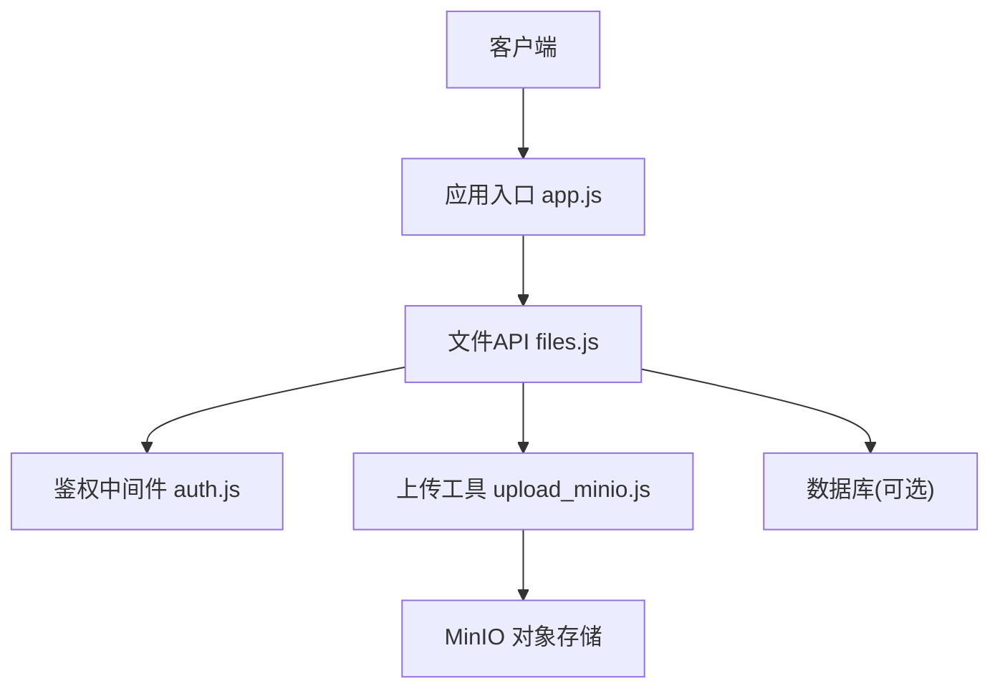
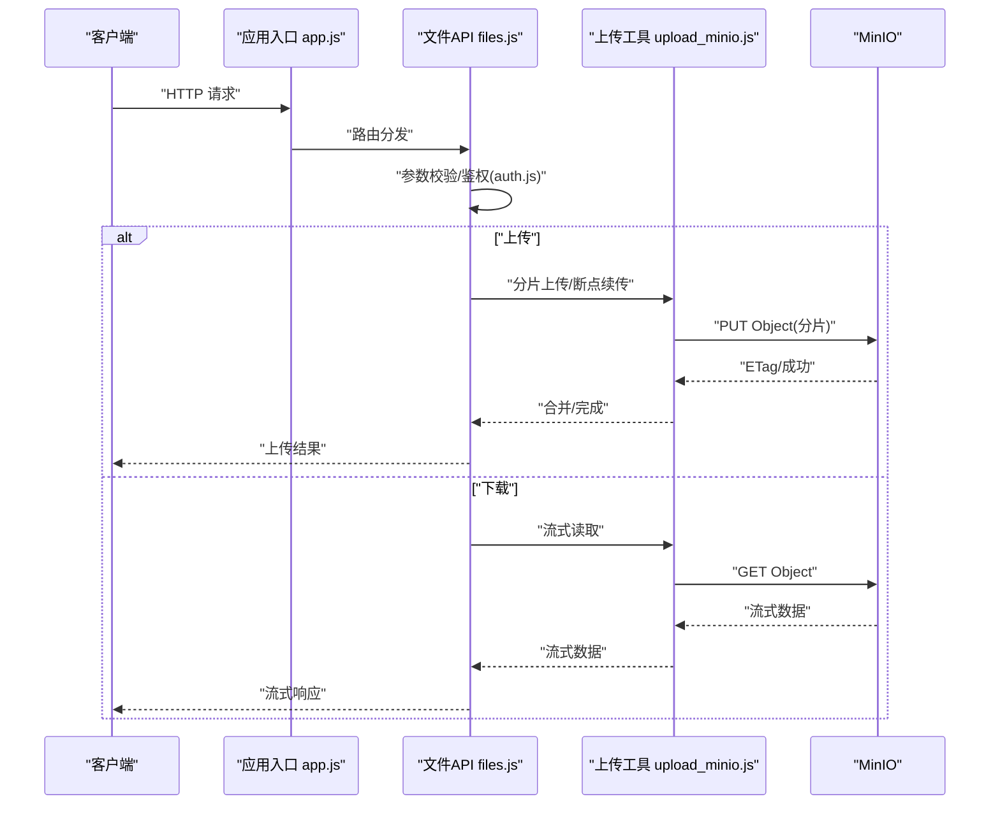
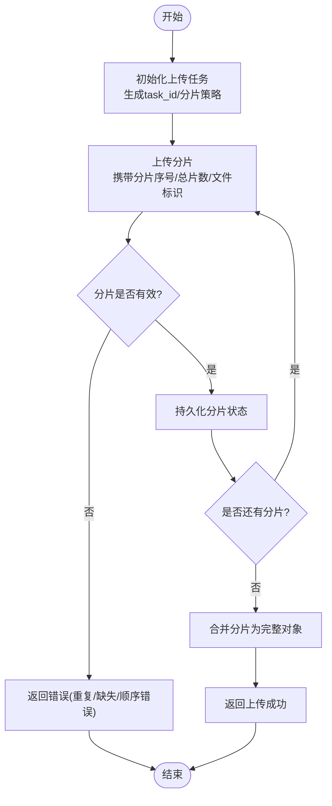
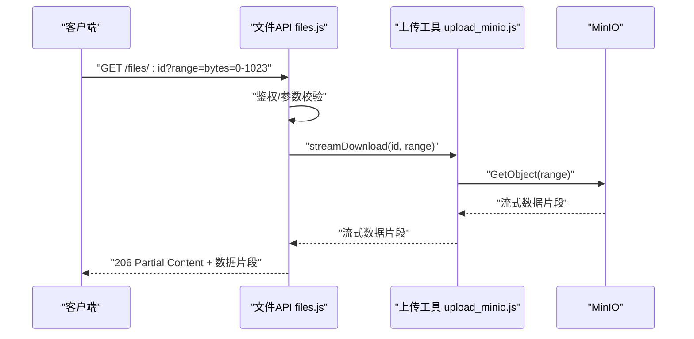
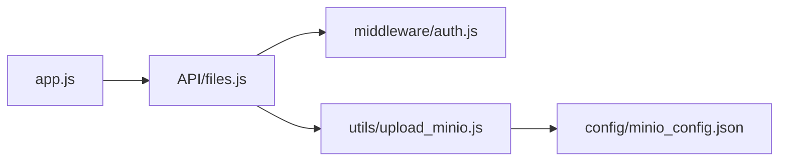

# 文件接口

<cite>
**本文引用的文件**   
- [node-jinmao/API/files.js](file://node-jinmao/API/files.js)
- [node-jinmao/utils/upload_minio.js](file://node-jinmao/utils/upload_minio.js)
- [node-jinmao/config/minio_config.json](file://node-jinmao/config/minio_config.json)
- [node-jinmao/middleware/auth.js](file://node-jinmao/middleware/auth.js)
- [node-jinmao/app.js](file://node-jinmao/app.js)
- [test/code/minio-crud.js](file://test/code/minio-crud.js)
</cite>

## 目录
1. [简介](#简介)
2. [项目结构](#项目结构)
3. [核心组件](#核心组件)
4. [架构总览](#架构总览)
5. [详细组件分析](#详细组件分析)
6. [依赖分析](#依赖分析)
7. [性能考虑](#性能考虑)
8. [故障排查指南](#故障排查指南)
9. [结论](#结论)
10. [附录](#附录)

## 简介
本文件接口文档面向“金毛教程学重构版”的后端文件服务，覆盖以下能力：
- 多部分表单上传（支持分片、断点续传）
- 流式下载与进度监控、权限控制
- 在线预览（图片、PDF、文档等格式）
- 文件管理（列表查询、搜索、分类、标签）
- 删除、回收站、批量操作
- 格式转换（如 Markdown 转 Word、PDF 转图片等）
- MinIO 对象存储集成配置、路径管理与访问控制
- 安全策略（校验、病毒扫描、大小限制）
- 完整的请求/响应示例与错误处理指南

说明：当前仓库中已实现的文件相关代码集中在 node-jinmao 模块的 API 路由与工具层。对于尚未实现的特性（如病毒扫描、回收站、完整转换流水线），本文给出基于现有代码结构的扩展建议与最佳实践。

## 项目结构
与文件接口相关的后端代码主要位于 node-jinmao 目录：
- API 路由层：API/files.js
- 存储工具层：utils/upload_minio.js
- 配置中心：config/minio_config.json
- 鉴权中间件：middleware/auth.js
- 应用入口：app.js（挂载路由）
- 测试用例：test/code/minio-crud.js（MinIO 基础 CRUD 示例）

图表来源
- [node-jinmao/app.js](file://node-jinmao/app.js)
- [node-jinmao/API/files.js](file://node-jinmao/API/files.js)
- [node-jinmao/middleware/auth.js](file://node-jinmao/middleware/auth.js)
- [node-jinmao/utils/upload_minio.js](file://node-jinmao/utils/upload_minio.js)

章节来源
- [node-jinmao/app.js](file://node-jinmao/app.js)
- [node-jinmao/API/files.js](file://node-jinmao/API/files.js)
- [node-jinmao/utils/upload_minio.js](file://node-jinmao/utils/upload_minio.js)
- [node-jinmao/config/minio_config.json](file://node-jinmao/config/minio_config.json)
- [node-jinmao/middleware/auth.js](file://node-jinmao/middleware/auth.js)
- [test/code/minio-crud.js](file://test/code/minio-crud.js)

## 核心组件
- 文件API路由（files.js）
  - 负责接收前端请求，进行参数校验、鉴权、调用上传/下载/预览/管理等业务逻辑，并返回统一响应。
- MinIO 上传工具（upload_minio.js）
  - 封装与 MinIO 的交互，包括分片上传、断点续传、流式读取/写入、元数据设置等。
- 鉴权中间件（auth.js）
  - 校验用户身份与权限，确保只有授权用户可访问受保护资源。
- 配置文件（minio_config.json）
  - 定义 MinIO 连接信息（endpoint、accessKey、secretKey、bucket、协议等）。

章节来源
- [node-jinmao/API/files.js](file://node-jinmao/API/files.js)
- [node-jinmao/utils/upload_minio.js](file://node-jinmao/utils/upload_minio.js)
- [node-jinmao/middleware/auth.js](file://node-jinmao/middleware/auth.js)
- [node-jinmao/config/minio_config.json](file://node-jinmao/config/minio_config.json)

## 架构总览
整体流程围绕“请求进入 -> 鉴权 -> 路由处理 -> 存储/业务处理 -> 响应返回”展开。上传采用分片+断点续传，下载采用流式传输，预览通过服务端生成或直链返回，管理接口提供统一的CRUD能力。

图表来源
- [node-jinmao/app.js](file://node-jinmao/app.js)
- [node-jinmao/API/files.js](file://node-jinmao/API/files.js)
- [node-jinmao/utils/upload_minio.js](file://node-jinmao/utils/upload_minio.js)
- [node-jinmao/middleware/auth.js](file://node-jinmao/middleware/auth.js)

## 详细组件分析

### 文件上传接口（多部分表单、分片、断点续传）
- 功能要点
  - 使用 multipart/form-data 提交文件分片
  - 支持断点续传：客户端携带分片序号、总片数、文件标识；服务端校验并合并
  - 大文件优化：流式写入、内存占用可控、并发分片上传
  - 元数据记录：文件名、类型、大小、MD5/SHA、创建时间、上传者等
- 典型流程
  - 初始化任务：获取唯一 task_id、分片大小、最大分片数
  - 上传分片：逐片上传，服务端持久化分片状态
  - 合并分片：所有分片完成后触发合并，生成最终对象
  - 回调通知：前端轮询或SSE推送合并结果
- 关键实现位置
  - 路由与业务编排：[node-jinmao/API/files.js](file://node-jinmao/API/files.js)
  - 分片与断点续传逻辑：[node-jinmao/utils/upload_minio.js](file://node-jinmao/utils/upload_minio.js)
  - 鉴权与权限校验：[node-jinmao/middleware/auth.js](file://node-jinmao/middleware/auth.js)

图表来源
- [node-jinmao/API/files.js](file://node-jinmao/API/files.js)
- [node-jinmao/utils/upload_minio.js](file://node-jinmao/utils/upload_minio.js)

章节来源
- [node-jinmao/API/files.js](file://node-jinmao/API/files.js)
- [node-jinmao/utils/upload_minio.js](file://node-jinmao/utils/upload_minio.js)
- [node-jinmao/middleware/auth.js](file://node-jinmao/middleware/auth.js)

### 文件下载接口（流式传输、进度监控、权限控制）
- 功能要点
  - 流式响应：避免一次性加载到内存，适合大文件
  - 进度监控：支持 Range 头与字节范围，便于前端显示下载进度
  - 权限控制：仅允许有访问权限的用户下载指定文件
- 典型流程
  - 校验权限与参数（文件ID、Range、Token）
  - 从 MinIO 拉取对象流，按 Range 分段输出
  - 设置合适的 Content-Type、Content-Length、Content-Range
  - 返回流式响应，前端可监听进度事件
- 关键实现位置
  - 路由与业务编排：[node-jinmao/API/files.js](file://node-jinmao/API/files.js)
  - 流式读取与分块：[node-jinmao/utils/upload_minio.js](file://node-jinmao/utils/upload_minio.js)
  - 鉴权中间件：[node-jinmao/middleware/auth.js](file://node-jinmao/middleware/auth.js)

图表来源
- [node-jinmao/API/files.js](file://node-jinmao/API/files.js)
- [node-jinmao/utils/upload_minio.js](file://node-jinmao/utils/upload_minio.js)
- [node-jinmao/middleware/auth.js](file://node-jinmao/middleware/auth.js)

章节来源
- [node-jinmao/API/files.js](file://node-jinmao/API/files.js)
- [node-jinmao/utils/upload_minio.js](file://node-jinmao/utils/upload_minio.js)
- [node-jinmao/middleware/auth.js](file://node-jinmao/middleware/auth.js)

### 文件预览接口（图片、PDF、文档在线预览）
- 功能要点
  - 图片：直接返回或生成缩略图
  - PDF：服务端渲染或直接返回原始流（浏览器原生支持）
  - 文档：转换为 HTML/PDF 后返回预览
- 典型流程
  - 校验权限与文件存在性
  - 根据 MIME 类型选择预览策略（直链/转换/缩略图）
  - 返回预览内容或临时链接
- 关键实现位置
  - 路由与业务编排：[node-jinmao/API/files.js](file://node-jinmao/API/files.js)
  - 存储工具（如需转换/缩略图）：[node-jinmao/utils/upload_minio.js](file://node-jinmao/utils/upload_minio.js)

章节来源
- [node-jinmao/API/files.js](file://node-jinmao/API/files.js)
- [node-jinmao/utils/upload_minio.js](file://node-jinmao/utils/upload_minio.js)

### 文件管理接口（列表、搜索、分类、标签）
- 功能要点
  - 列表查询：分页、排序、过滤（作者、时间、类型）
  - 搜索：关键词匹配（文件名、标签、描述）
  - 分类与标签：维护文件分类树与标签集合
  - 权限隔离：按用户/角色隔离可见范围
- 典型流程
  - 解析查询参数（page、size、keyword、category、tags）
  - 构建查询条件，检索数据库/索引
  - 返回结构化结果（含分页元信息）
- 关键实现位置
  - 路由与业务编排：[node-jinmao/API/files.js](file://node-jinmao/API/files.js)

章节来源
- [node-jinmao/API/files.js](file://node-jinmao/API/files.js)

### 删除、回收站、批量操作
- 功能要点
  - 软删除：标记为删除状态，进入回收站
  - 硬删除：清理对象存储与元数据
  - 批量操作：支持批量删除、恢复、清空回收站
- 典型流程
  - 校验权限与目标文件归属
  - 更新状态（删除/恢复/永久删除）
  - 异步清理对象存储（可选）
- 关键实现位置
  - 路由与业务编排：[node-jinmao/API/files.js](file://node-jinmao/API/files.js)

章节来源
- [node-jinmao/API/files.js](file://node-jinmao/API/files.js)

### 文件转换接口（Markdown→Word、PDF→图片等）
- 功能要点
  - 异步任务：转换耗时较长，采用任务队列+SSE/轮询
  - 多格式支持：Markdown→Word、PDF→图片、Excel→CSV 等
  - 结果回写：转换结果落盘至 MinIO，返回下载链接
- 典型流程
  - 提交转换任务（源文件ID、目标格式）
  - 后台执行转换，更新任务状态
  - 前端轮询或订阅SSE获取结果
- 关键实现位置
  - 路由与业务编排：[node-jinmao/API/files.js](file://node-jinmao/API/files.js)
  - 存储工具（读写转换产物）：[node-jinmao/utils/upload_minio.js](file://node-jinmao/utils/upload_minio.js)

章节来源
- [node-jinmao/API/files.js](file://node-jinmao/API/files.js)
- [node-jinmao/utils/upload_minio.js](file://node-jinmao/utils/upload_minio.js)

### MinIO 对象存储集成配置与路径管理
- 配置项
  - endpoint、accessKey、secretKey、bucket、useSSL、region 等
- 路径规范
  - 按用户/项目/日期组织目录，便于权限与审计
  - 元数据与对象键分离，便于检索与生命周期管理
- 访问控制
  - 基于 Token 的短期签名链接
  - 服务端代理访问，集中鉴权
- 关键实现位置
  - 配置中心：[node-jinmao/config/minio_config.json](file://node-jinmao/config/minio_config.json)
  - 工具封装：[node-jinmao/utils/upload_minio.js](file://node-jinmao/utils/upload_minio.js)
  - 测试用例：[test/code/minio-crud.js](file://test/code/minio-crud.js)

章节来源
- [node-jinmao/config/minio_config.json](file://node-jinmao/config/minio_config.json)
- [node-jinmao/utils/upload_minio.js](file://node-jinmao/utils/upload_minio.js)
- [test/code/minio-crud.js](file://test/code/minio-crud.js)

## 依赖分析
- 路由层依赖鉴权中间件与存储工具
- 存储工具依赖 MinIO SDK 与配置
- 应用入口挂载各模块路由，形成统一入口

图表来源
- [node-jinmao/app.js](file://node-jinmao/app.js)
- [node-jinmao/API/files.js](file://node-jinmao/API/files.js)
- [node-jinmao/middleware/auth.js](file://node-jinmao/middleware/auth.js)
- [node-jinmao/utils/upload_minio.js](file://node-jinmao/utils/upload_minio.js)
- [node-jinmao/config/minio_config.json](file://node-jinmao/config/minio_config.json)

章节来源
- [node-jinmao/app.js](file://node-jinmao/app.js)
- [node-jinmao/API/files.js](file://node-jinmao/API/files.js)
- [node-jinmao/middleware/auth.js](file://node-jinmao/middleware/auth.js)
- [node-jinmao/utils/upload_minio.js](file://node-jinmao/utils/upload_minio.js)
- [node-jinmao/config/minio_config.json](file://node-jinmao/config/minio_config.json)

## 性能考虑
- 上传
  - 分片大小建议 5–10MB，合理并发提升吞吐
  - 断点续传减少网络抖动影响
  - 流式写入降低内存峰值
- 下载
  - 使用 Range 头实现断点续传与进度条
  - 避免全量缓存，按需读取
- 预览
  - 图片生成缩略图，减少带宽
  - PDF/文档尽量直链或轻量转换
- 存储
  - MinIO 桶策略与生命周期规则配合，自动归档/清理
  - 合理命名空间与分区，提高检索效率

## 故障排查指南
- 常见问题
  - 上传失败：检查分片顺序、重复上传、网络超时
  - 下载中断：确认 Range 头合法、权限正确、MinIO 可达
  - 预览异常：核对 MIME 类型、浏览器兼容性、转换服务可用性
- 定位步骤
  - 查看日志（请求ID、分片号、错误码）
  - 校验鉴权令牌与权限
  - 检查 MinIO 对象是否存在、元数据是否正确
- 参考实现
  - 鉴权中间件：[node-jinmao/middleware/auth.js](file://node-jinmao/middleware/auth.js)
  - 上传工具：[node-jinmao/utils/upload_minio.js](file://node-jinmao/utils/upload_minio.js)
  - 路由处理：[node-jinmao/API/files.js](file://node-jinmao/API/files.js)

章节来源
- [node-jinmao/middleware/auth.js](file://node-jinmao/middleware/auth.js)
- [node-jinmao/utils/upload_minio.js](file://node-jinmao/utils/upload_minio.js)
- [node-jinmao/API/files.js](file://node-jinmao/API/files.js)

## 结论
本文件接口以 Node.js 为核心，结合 MinIO 对象存储，实现了高可用的文件上传、下载、预览与管理能力。通过分片与断点续传保障大文件稳定性，流式传输提升下载体验，权限控制确保数据安全。未来可扩展病毒扫描、更丰富的格式转换与更细粒度的访问控制策略。

## 附录

### 请求与响应示例（摘要）
- 上传分片
  - 方法：POST
  - 路径：/api/files/chunk
  - 头部：Authorization、X-File-Id、X-Chunk-Index、X-Chunk-Total
  - 主体：multipart/form-data（file 字段）
  - 响应：{ code, message, data: { chunkStatus } }
- 合并分片
  - 方法：POST
  - 路径：/api/files/merge
  - 头部：Authorization、X-File-Id
  - 主体：{ chunks: [{ index, etag }] }
  - 响应：{ code, message, data: { fileId, url } }
- 下载文件
  - 方法：GET
  - 路径：/api/files/:id
  - 头部：Authorization、Range（可选）
  - 响应：二进制流（206 Partial Content 或 200 OK）
- 预览文件
  - 方法：GET
  - 路径：/api/files/:id/preview
  - 头部：Authorization
  - 响应：HTML/PDF/图片流或临时链接
- 文件列表
  - 方法：GET
  - 路径：/api/files?keyword=&category=&tags=&page=&size=
  - 头部：Authorization
  - 响应：{ code, message, data: { list, total, page, size } }
- 删除文件
  - 方法：DELETE
  - 路径：/api/files/:id
  - 头部：Authorization
  - 响应：{ code, message, data: { deleted } }
- 批量删除
  - 方法：POST
  - 路径：/api/files/batch-delete
  - 头部：Authorization
  - 主体：{ ids: [] }
  - 响应：{ code, message, data: { deletedCount } }
- 转换任务
  - 方法：POST
  - 路径：/api/files/convert
  - 头部：Authorization
  - 主体：{ fileId, targetFormat }
  - 响应：{ code, message, data: { taskId } }
  - 查询结果：GET /api/files/convert/:taskId

### 错误码与处理建议
- 400 参数错误：检查请求体与头部字段
- 401 未授权：刷新令牌或重新登录
- 403 权限不足：确认用户具备该文件访问权限
- 404 资源不存在：检查文件ID与路径
- 413 文件过大：调整大小限制或启用分片
- 429 限流：稍后重试或降低并发
- 500 服务器错误：查看日志并联系运维

### 安全措施建议
- 输入校验：白名单校验文件名、类型、大小
- 病毒扫描：接入第三方扫描服务（异步）
- 访问控制：基于角色的最小权限原则
- 安全传输：强制 HTTPS，敏感数据加密
- 审计日志：记录关键操作与访问行为