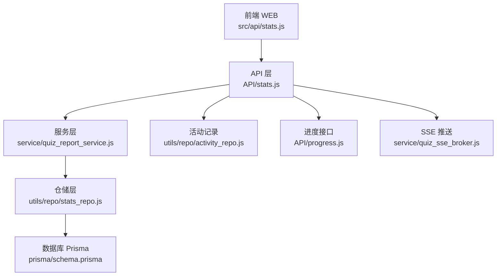
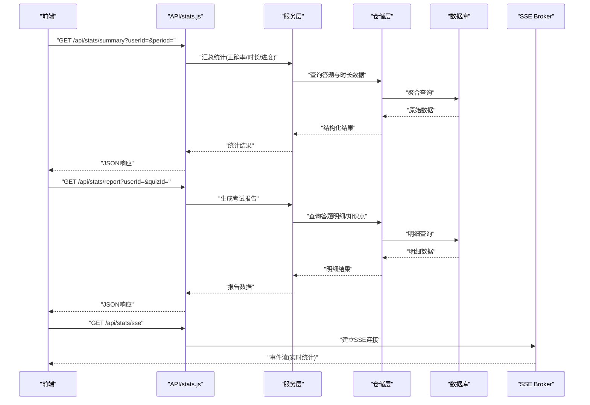
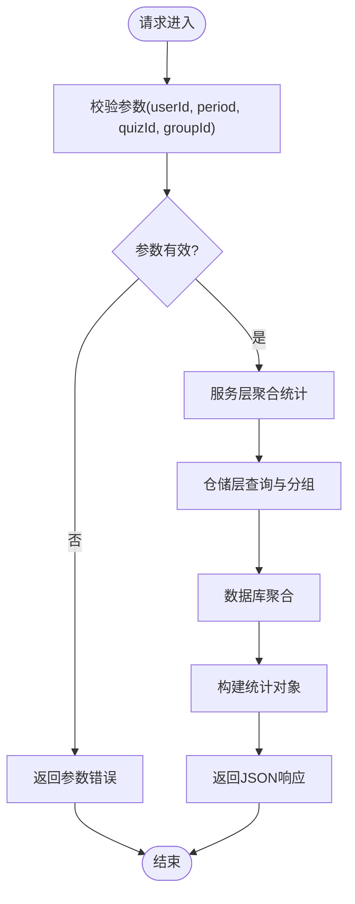
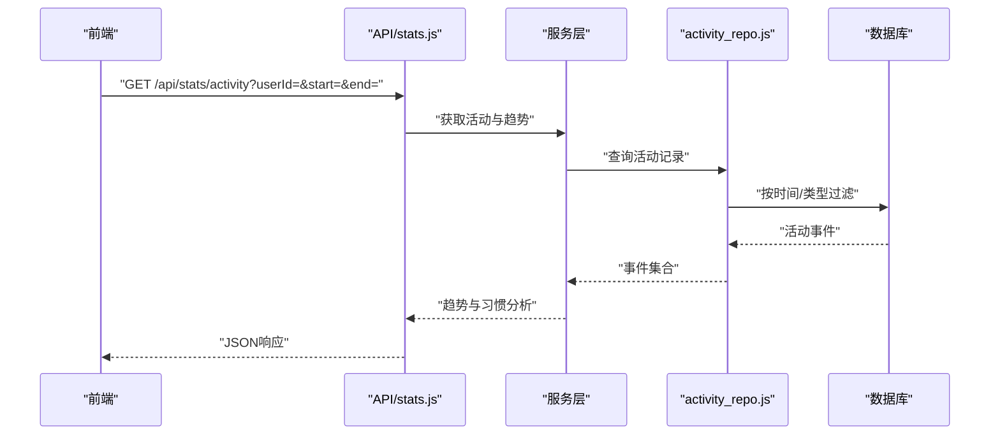
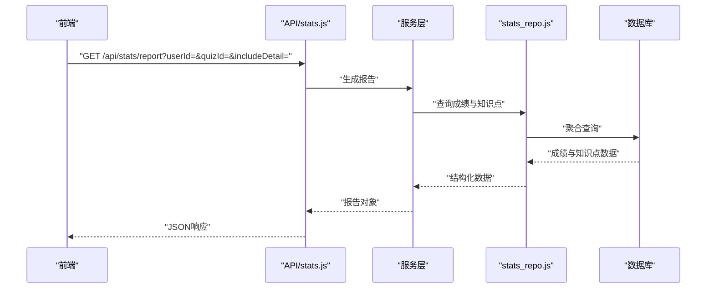
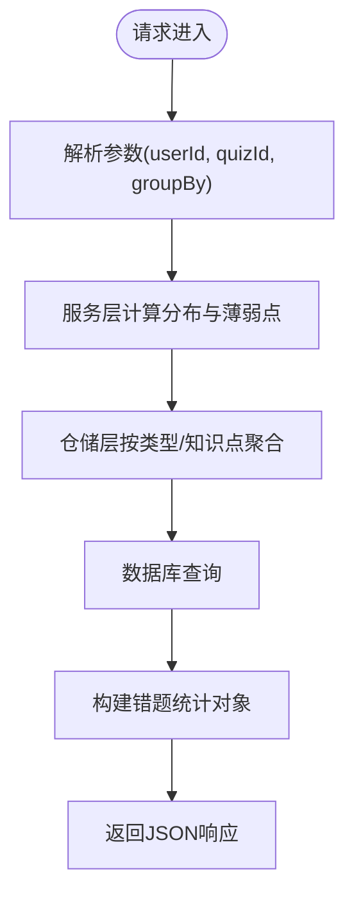
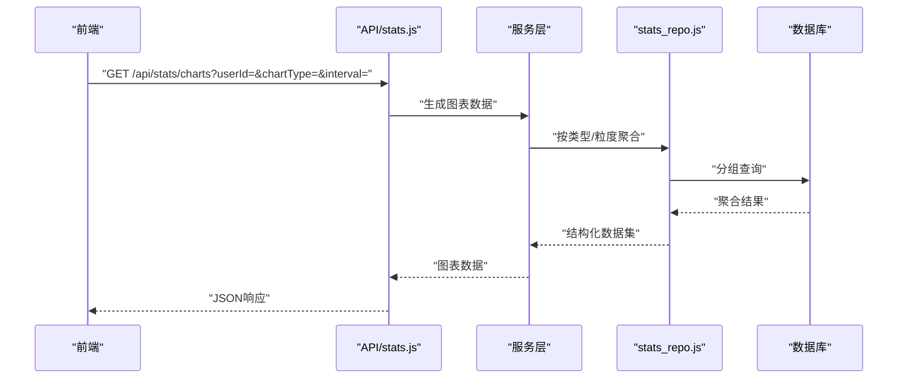
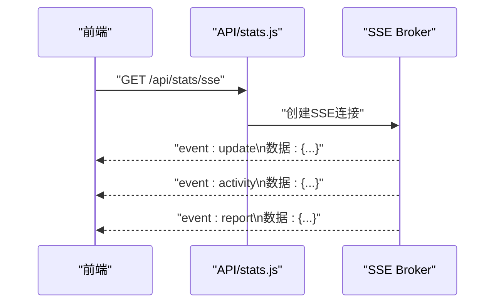
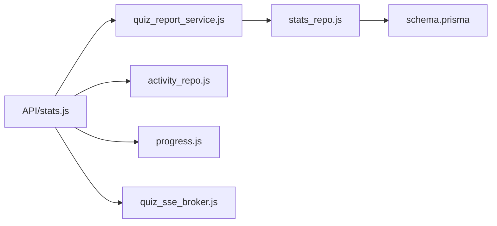

# 统计接口

<cite>
**本文引用的文件**   
- [node-jinmao/API/stats.js](file://node-jinmao/API/stats.js)
- [node-jinmao/service/quiz_report_service.js](file://node-jinmao/service/quiz_report_service.js)
- [node-jinmao/utils/repo/stats_repo.js](file://node-jinmao/utils/repo/stats_repo.js)
- [node-jinmao/prisma/schema.prisma](file://node-jinmao/prisma/schema.prisma)
- [WEB/src/api/stats.js](file://WEB/src/api/stats.js)
- [node-jinmao/API/progress.js](file://node-jinmao/API/progress.js)
- [node-jinmao/utils/repo/activity_repo.js](file://node-jinmao/utils/repo/activity_repo.js)
- [node-jinmao/service/quiz_sse_broker.js](file://node-jinmao/service/quiz_sse_broker.js)
</cite>

## 目录
1. [简介](#简介)
2. [项目结构](#项目结构)
3. [核心组件](#核心组件)
4. [架构总览](#架构总览)
5. [详细组件分析](#详细组件分析)
6. [依赖分析](#依赖分析)
7. [性能考虑](#性能考虑)
8. [故障排查指南](#故障排查指南)
9. [结论](#结论)
10. [附录](#附录)

## 简介
本文件为“金毛教你学重构版”的统计接口完整API文档，覆盖以下能力：
- 用户学习数据统计：答题正确率、学习时长、进度统计等
- 学习行为分析：活动记录、学习习惯分析
- 考试报告生成：成绩分析、知识点掌握情况
- 错题统计分析：错误类型分布、薄弱知识点识别
- 排行榜与成就系统相关接口（概念性说明）
- 数据可视化接口：为前端图表提供聚合数据
- 实时统计数据获取：基于SSE推送机制

## 项目结构
后端统计相关代码主要位于 node-jinmao 目录：
- API层：node-jinmao/API/stats.js
- 服务层：node-jinmao/service/quiz_report_service.js
- 仓储层：node-jinmao/utils/repo/stats_repo.js
- 数据库模型：node-jinmao/prisma/schema.prisma
- 前端调用：WEB/src/api/stats.js
- 进度与活动：node-jinmao/API/progress.js、node-jinmao/utils/repo/activity_repo.js
- SSE推送：node-jinmao/service/quiz_sse_broker.js

**图示来源** 
- [node-jinmao/API/stats.js](file://node-jinmao/API/stats.js)
- [node-jinmao/service/quiz_report_service.js](file://node-jinmao/service/quiz_report_service.js)
- [node-jinmao/utils/repo/stats_repo.js](file://node-jinmao/utils/repo/stats_repo.js)
- [node-jinmao/prisma/schema.prisma](file://node-jinmao/prisma/schema.prisma)
- [WEB/src/api/stats.js](file://WEB/src/api/stats.js)
- [node-jinmao/API/progress.js](file://node-jinmao/API/progress.js)
- [node-jinmao/utils/repo/activity_repo.js](file://node-jinmao/utils/repo/activity_repo.js)
- [node-jinmao/service/quiz_sse_broker.js](file://node-jinmao/service/quiz_sse_broker.js)

**章节来源**
- [node-jinmao/API/stats.js](file://node-jinmao/API/stats.js)
- [node-jinmao/service/quiz_report_service.js](file://node-jinmao/service/quiz_report_service.js)
- [node-jinmao/utils/repo/stats_repo.js](file://node-jinmao/utils/repo/stats_repo.js)
- [node-jinmao/prisma/schema.prisma](file://node-jinmao/prisma/schema.prisma)
- [WEB/src/api/stats.js](file://WEB/src/api/stats.js)
- [node-jinmao/API/progress.js](file://node-jinmao/API/progress.js)
- [node-jinmao/utils/repo/activity_repo.js](file://node-jinmao/utils/repo/activity_repo.js)
- [node-jinmao/service/quiz_sse_broker.js](file://node-jinmao/service/quiz_sse_broker.js)

## 核心组件
- API 层（stats.js）：暴露REST端点，负责参数校验、路由分发、响应封装。
- 服务层（quiz_report_service.js）：聚合统计逻辑、计算指标、组装报告。
- 仓储层（stats_repo.js）：数据访问封装，按条件查询与分组聚合。
- 活动记录（activity_repo.js）：记录并查询用户学习行为事件。
- 进度接口（progress.js）：课程/题目进度查询与更新。
- SSE 推送（quiz_sse_broker.js）：服务端事件流推送，用于实时统计。

**章节来源**
- [node-jinmao/API/stats.js](file://node-jinmao/API/stats.js)
- [node-jinmao/service/quiz_report_service.js](file://node-jinmao/service/quiz_report_service.js)
- [node-jinmao/utils/repo/stats_repo.js](file://node-jinmao/utils/repo/stats_repo.js)
- [node-jinmao/utils/repo/activity_repo.js](file://node-jinmao/utils/repo/activity_repo.js)
- [node-jinmao/API/progress.js](file://node-jinmao/API/progress.js)
- [node-jinmao/service/quiz_sse_broker.js](file://node-jinmao/service/quiz_sse_broker.js)

## 架构总览
统计接口采用分层架构：前端通过HTTP请求调用API层，API层调用服务层进行业务计算，服务层通过仓储层访问数据库；同时支持SSE推送实时数据。

**图示来源** 
- [node-jinmao/API/stats.js](file://node-jinmao/API/stats.js)
- [node-jinmao/service/quiz_report_service.js](file://node-jinmao/service/quiz_report_service.js)
- [node-jinmao/utils/repo/stats_repo.js](file://node-jinmao/utils/repo/stats_repo.js)
- [node-jinmao/service/quiz_sse_broker.js](file://node-jinmao/service/quiz_sse_broker.js)

## 详细组件分析

### 学习数据统计接口
- 功能范围：答题正确率、学习时长、进度统计等
- 典型端点：/api/stats/summary（示例路径，具体以实现为准）
- 输入参数：
  - userId：用户标识
  - period：时间范围（如 day/week/month/custom），custom时需提供start/end
  - quizId：可选，限定某次练习或考试
  - groupId：可选，按组别/章节分组
- 输出字段（示例）：
  - totalQuestions：总题数
  - correctCount：正确数
  - accuracy：正确率（百分比）
  - studyMinutes：学习时长（分钟）
  - progress：进度对象（完成度、里程碑）
- 处理流程：
  - API层接收并校验参数
  - 服务层根据条件聚合答题与时长数据
  - 仓储层执行分组与聚合查询
  - 返回结构化统计结果

**图示来源** 
- [node-jinmao/API/stats.js](file://node-jinmao/API/stats.js)
- [node-jinmao/service/quiz_report_service.js](file://node-jinmao/service/quiz_report_service.js)
- [node-jinmao/utils/repo/stats_repo.js](file://node-jinmao/utils/repo/stats_repo.js)

**章节来源**
- [node-jinmao/API/stats.js](file://node-jinmao/API/stats.js)
- [node-jinmao/service/quiz_report_service.js](file://node-jinmao/service/quiz_report_service.js)
- [node-jinmao/utils/repo/stats_repo.js](file://node-jinmao/utils/repo/stats_repo.js)

### 学习行为分析接口
- 功能范围：活动记录、学习习惯分析（如每日学习时长趋势、活跃时段）
- 典型端点：/api/stats/activity（示例路径）
- 输入参数：
  - userId：用户标识
  - start/end：时间范围
  - type：活动类型（可选，如 quiz/session）
- 输出字段（示例）：
  - events：活动事件列表（时间戳、类型、持续时间）
  - trends：趋势数据（日/周/月维度）
  - habits：习惯分析（高峰时段、平均时长、连续学习天数）
- 处理流程：
  - API层解析参数
  - 服务层调用活动记录仓储
  - 仓储层按时间与类型过滤并聚合
  - 返回活动与趋势数据

**图示来源** 
- [node-jinmao/API/stats.js](file://node-jinmao/API/stats.js)
- [node-jinmao/utils/repo/activity_repo.js](file://node-jinmao/utils/repo/activity_repo.js)

**章节来源**
- [node-jinmao/API/stats.js](file://node-jinmao/API/stats.js)
- [node-jinmao/utils/repo/activity_repo.js](file://node-jinmao/utils/repo/activity_repo.js)

### 考试报告生成接口
- 功能范围：成绩分析、知识点掌握情况
- 典型端点：/api/stats/report（示例路径）
- 输入参数：
  - userId：用户标识
  - quizId：考试/练习ID
  - includeDetail：是否包含明细（默认false）
- 输出字段（示例）：
  - score：总分与得分
  - accuracy：正确率
  - knowledgePoints：知识点掌握度（掌握/未掌握比例）
  - detail：答题明细（若开启）
- 处理流程：
  - API层校验参数
  - 服务层聚合成绩与知识点
  - 仓储层查询答题明细与知识点映射
  - 返回报告数据

**图示来源** 
- [node-jinmao/API/stats.js](file://node-jinmao/API/stats.js)
- [node-jinmao/service/quiz_report_service.js](file://node-jinmao/service/quiz_report_service.js)
- [node-jinmao/utils/repo/stats_repo.js](file://node-jinmao/utils/repo/stats_repo.js)

**章节来源**
- [node-jinmao/API/stats.js](file://node-jinmao/API/stats.js)
- [node-jinmao/service/quiz_report_service.js](file://node-jinmao/service/quiz_report_service.js)
- [node-jinmao/utils/repo/stats_repo.js](file://node-jinmao/utils/repo/stats_repo.js)

### 错题统计分析接口
- 功能范围：错误类型分布、薄弱知识点识别
- 典型端点：/api/stats/wrongbook（示例路径）
- 输入参数：
  - userId：用户标识
  - quizId：可选，限定范围
  - groupBy：分组维度（type/knowledgePoint）
- 输出字段（示例）：
  - distribution：错误类型分布（选择题/填空题/判断题等）
  - weakPoints：薄弱知识点（出现错误次数TopN）
  - trend：错误率趋势（近N天）
- 处理流程：
  - API层解析参数
  - 服务层计算分布与薄弱点
  - 仓储层按类型与知识点聚合
  - 返回错题统计

**图示来源** 
- [node-jinmao/API/stats.js](file://node-jinmao/API/stats.js)
- [node-jinmao/utils/repo/stats_repo.js](file://node-jinmao/utils/repo/stats_repo.js)

**章节来源**
- [node-jinmao/API/stats.js](file://node-jinmao/API/stats.js)
- [node-jinmao/utils/repo/stats_repo.js](file://node-jinmao/utils/repo/stats_repo.js)

### 排行榜与成就系统（概念性说明）
- 排行榜：可按分数、正确率、学习时长等维度排序，支持分页与筛选（日期范围、课程/题库）。
- 成就系统：基于累计学习时长、连续学习天数、错题纠正率等指标发放徽章或等级。
- 注意：当前仓库未提供具体实现文件，以上为通用设计建议，可基于现有stats与activity模块扩展。

[本节为概念性内容，不直接分析具体文件]

### 数据可视化接口
- 功能范围：为前端图表提供聚合数据（折线、柱状、饼图等）
- 典型端点：/api/stats/charts（示例路径）
- 输入参数：
  - userId：用户标识
  - chartType：图表类型（accuracy/trend/distribution）
  - interval：时间粒度（day/week/month）
- 输出字段（示例）：
  - labels：X轴标签（日期/类别）
  - datasets：数据集（数值序列）
- 处理流程：
  - API层校验参数
  - 服务层按图表类型聚合数据
  - 仓储层执行分组与聚合
  - 返回图表所需数据结构

**图示来源** 
- [node-jinmao/API/stats.js](file://node-jinmao/API/stats.js)
- [node-jinmao/service/quiz_report_service.js](file://node-jinmao/service/quiz_report_service.js)
- [node-jinmao/utils/repo/stats_repo.js](file://node-jinmao/utils/repo/stats_repo.js)

**章节来源**
- [node-jinmao/API/stats.js](file://node-jinmao/API/stats.js)
- [node-jinmao/service/quiz_report_service.js](file://node-jinmao/service/quiz_report_service.js)
- [node-jinmao/utils/repo/stats_repo.js](file://node-jinmao/utils/repo/stats_repo.js)

### 实时统计数据（SSE推送）
- 机制：使用SSE（Server-Sent Events）向客户端推送实时统计更新
- 典型端点：/api/stats/sse（示例路径）
- 事件类型：
  - update：统计摘要更新（正确率、时长、进度）
  - activity：活动事件（开始/结束答题、提交答案）
  - report：报告就绪通知
- 处理流程：
  - 前端建立SSE连接
  - 服务端监听统计变化并推送事件
  - 客户端订阅并渲染实时更新

**图示来源** 
- [node-jinmao/API/stats.js](file://node-jinmao/API/stats.js)
- [node-jinmao/service/quiz_sse_broker.js](file://node-jinmao/service/quiz_sse_broker.js)

**章节来源**
- [node-jinmao/API/stats.js](file://node-jinmao/API/stats.js)
- [node-jinmao/service/quiz_sse_broker.js](file://node-jinmao/service/quiz_sse_broker.js)

## 依赖分析
- API层依赖服务层进行业务逻辑处理
- 服务层依赖仓储层进行数据访问
- 仓储层依赖Prisma模型定义
- 活动记录与进度接口独立但可被统计模块复用
- SSE Broker提供实时推送能力

**图示来源** 
- [node-jinmao/API/stats.js](file://node-jinmao/API/stats.js)
- [node-jinmao/service/quiz_report_service.js](file://node-jinmao/service/quiz_report_service.js)
- [node-jinmao/utils/repo/stats_repo.js](file://node-jinmao/utils/repo/stats_repo.js)
- [node-jinmao/prisma/schema.prisma](file://node-jinmao/prisma/schema.prisma)
- [node-jinmao/utils/repo/activity_repo.js](file://node-jinmao/utils/repo/activity_repo.js)
- [node-jinmao/API/progress.js](file://node-jinmao/API/progress.js)
- [node-jinmao/service/quiz_sse_broker.js](file://node-jinmao/service/quiz_sse_broker.js)

**章节来源**
- [node-jinmao/API/stats.js](file://node-jinmao/API/stats.js)
- [node-jinmao/service/quiz_report_service.js](file://node-jinmao/service/quiz_report_service.js)
- [node-jinmao/utils/repo/stats_repo.js](file://node-jinmao/utils/repo/stats_repo.js)
- [node-jinmao/prisma/schema.prisma](file://node-jinmao/prisma/schema.prisma)
- [node-jinmao/utils/repo/activity_repo.js](file://node-jinmao/utils/repo/activity_repo.js)
- [node-jinmao/API/progress.js](file://node-jinmao/API/progress.js)
- [node-jinmao/service/quiz_sse_broker.js](file://node-jinmao/service/quiz_sse_broker.js)

## 性能考虑
- 聚合查询优化：在仓储层使用合适的索引与分组策略，避免全表扫描
- 缓存策略：对热点统计结果（如日报/周报）进行短期缓存
- 分页与限制：排行榜与活动记录接口应支持分页与最大条数限制
- SSE限流：控制事件推送频率，避免客户端过载
- 异步处理：耗时计算（如报告生成）可考虑异步任务队列

[本节为通用指导，不直接分析具体文件]

## 故障排查指南
- 参数校验失败：检查userId、时间范围等必填参数是否正确
- 数据为空：确认用户是否有答题或活动记录，时间范围是否合理
- SSE连接断开：检查网络与服务端状态，确保Broker正常运行
- 性能问题：监控数据库查询慢日志，优化聚合SQL

**章节来源**
- [node-jinmao/API/stats.js](file://node-jinmao/API/stats.js)
- [node-jinmao/service/quiz_sse_broker.js](file://node-jinmao/service/quiz_sse_broker.js)

## 结论
本API文档覆盖了学习数据统计、行为分析、考试报告、错题统计、可视化与实时推送等核心能力。通过分层架构与SSE机制，系统具备良好的可扩展性与实时性。建议在实际部署中结合缓存与异步任务进一步优化性能。

[本节为总结性内容，不直接分析具体文件]

## 附录
- 前端调用示例：参考 WEB/src/api/stats.js
- 数据库模型：参考 prisma/schema.prisma
- 进度接口：参考 API/progress.js

**章节来源**
- [WEB/src/api/stats.js](file://WEB/src/api/stats.js)
- [node-jinmao/prisma/schema.prisma](file://node-jinmao/prisma/schema.prisma)
- [node-jinmao/API/progress.js](file://node-jinmao/API/progress.js)