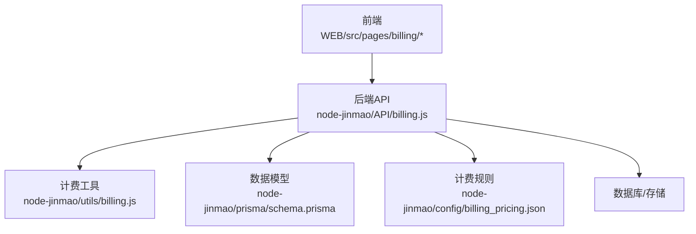
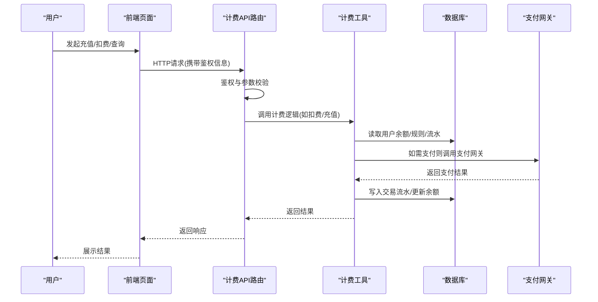
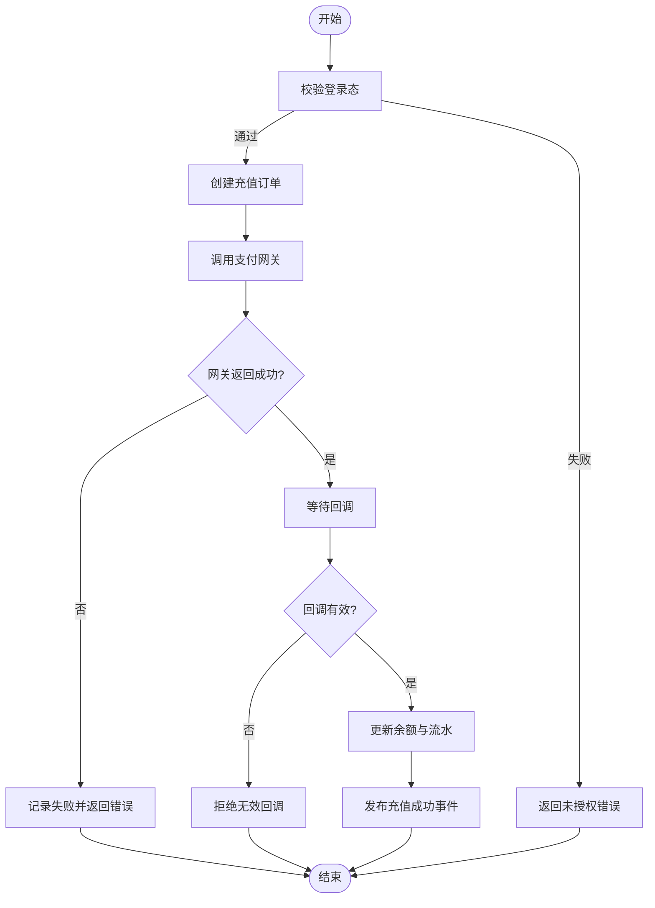
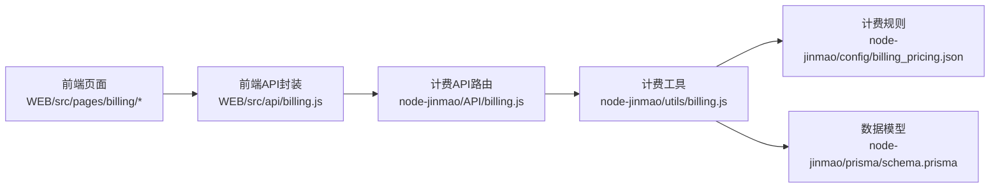

# 计费接口

<cite>
**本文引用的文件**   
- [API文档.md](file://API文档.md)
- [node-jinmao/API/billing.js](file://node-jinmao/API/billing.js)
- [node-jinmao/config/billing_pricing.json](file://node-jinmao/config/billing_pricing.json)
- [node-jinmao/utils/billing.js](file://node-jinmao/utils/billing.js)
- [node-jinmao/prisma/schema.prisma](file://node-jinmao/prisma/schema.prisma)
- [WEB/src/api/billing.js](file://WEB/src/api/billing.js)
- [WEB/src/pages/billing/index.vue](file://WEB/src/pages/billing/index.vue)
- [WEB/src/pages/billing/script.js](file://WEB/src/pages/billing/script.js)
</cite>

## 目录
1. [简介](#简介)
2. [项目结构](#项目结构)
3. [核心组件](#核心组件)
4. [架构总览](#架构总览)
5. [详细组件分析](#详细组件分析)
6. [依赖关系分析](#依赖关系分析)
7. [性能考虑](#性能考虑)
8. [故障排查指南](#故障排查指南)
9. [结论](#结论)
10. [附录](#附录)

## 简介
本文件为“金毛教你学重构版”的计费接口完整API文档，覆盖以下能力：
- 用户余额查询、充值、消费记录
- 计费规则配置（不同功能收费标准）
- 订阅服务管理（套餐购买、续费、取消）
- 支付网关集成（多种支付方式）
- 计费事件监听与处理机制
- 账单生成与发票开具相关接口
- 计费审计日志（财务对账与合规检查）
- 端到端计费流程示例（从用户操作到费用扣款）
- 错误处理与异常方案

说明：
- 本文档基于仓库中的后端API定义、前端调用封装以及计费配置进行整理。
- 若实际实现与本文存在差异，请以代码为准。

## 项目结构
计费相关的前后端关键位置如下：
- 后端API路由与控制器：node-jinmao/API/billing.js
- 计费工具与业务逻辑：node-jinmao/utils/billing.js
- 计费规则配置：node-jinmao/config/billing_pricing.json
- 数据库模型与迁移：node-jinmao/prisma/schema.prisma
- 前端API封装：WEB/src/api/billing.js
- 前端页面与脚本：WEB/src/pages/billing/index.vue、WEB/src/pages/billing/script.js

图表来源
- [node-jinmao/API/billing.js](file://node-jinmao/API/billing.js)
- [node-jinmao/utils/billing.js](file://node-jinmao/utils/billing.js)
- [node-jinmao/config/billing_pricing.json](file://node-jinmao/config/billing_pricing.json)
- [node-jinmao/prisma/schema.prisma](file://node-jinmao/prisma/schema.prisma)
- [WEB/src/pages/billing/index.vue](file://WEB/src/pages/billing/index.vue)
- [WEB/src/pages/billing/script.js](file://WEB/src/pages/billing/script.js)

章节来源
- [API文档.md](file://API文档.md)

## 核心组件
- 计费API路由层：负责HTTP请求解析、鉴权、参数校验、路由分发与响应封装。
- 计费工具层：封装余额查询、充值、扣费、计费规则计算、事件发布、审计日志等通用能力。
- 计费规则配置：以JSON形式维护各功能的收费标准、折扣策略、免费额度等。
- 数据模型层：通过Prisma定义用户余额、交易流水、订阅、账单、发票、审计日志等实体。
- 前端封装：统一封装计费相关API调用，提供页面交互与状态管理。

章节来源
- [node-jinmao/API/billing.js](file://node-jinmao/API/billing.js)
- [node-jinmao/utils/billing.js](file://node-jinmao/utils/billing.js)
- [node-jinmao/config/billing_pricing.json](file://node-jinmao/config/billing_pricing.json)
- [node-jinmao/prisma/schema.prisma](file://node-jinmao/prisma/schema.prisma)
- [WEB/src/api/billing.js](file://WEB/src/api/billing.js)
- [WEB/src/pages/billing/index.vue](file://WEB/src/pages/billing/index.vue)
- [WEB/src/pages/billing/script.js](file://WEB/src/pages/billing/script.js)

## 架构总览
计费系统采用前后端分离架构，前端通过REST API与后端交互；后端在路由层进行鉴权与校验后，委托计费工具完成核心逻辑，并通过数据模型持久化。计费规则由外部配置文件驱动，便于运营调整。

图表来源
- [node-jinmao/API/billing.js](file://node-jinmao/API/billing.js)
- [node-jinmao/utils/billing.js](file://node-jinmao/utils/billing.js)
- [node-jinmao/prisma/schema.prisma](file://node-jinmao/prisma/schema.prisma)

## 详细组件分析

### 用户余额查询
- 目的：获取当前用户的可用余额及最近交易摘要。
- 典型端点：GET /api/billing/balance
- 鉴权：需要登录态或访问令牌。
- 输入：无（从上下文获取用户ID）。
- 输出：余额数值、货币单位、更新时间、最近N条交易摘要。
- 错误：未登录、用户不存在、余额读取失败。

章节来源
- [node-jinmao/API/billing.js](file://node-jinmao/API/billing.js)
- [node-jinmao/utils/billing.js](file://node-jinmao/utils/billing.js)
- [node-jinmao/prisma/schema.prisma](file://node-jinmao/prisma/schema.prisma)
- [WEB/src/api/billing.js](file://WEB/src/api/billing.js)

### 充值接口
- 目的：为用户账户增加余额。
- 典型端点：POST /api/billing/recharge
- 鉴权：需要登录态。
- 输入：充值金额、支付方式、订单号（可选）、回调URL（可选）。
- 输出：支付单号、支付链接/二维码、支付状态。
- 流程：创建充值订单 -> 调用支付网关 -> 等待回调 -> 确认到账 -> 写入流水。
- 错误：金额不合法、支付失败、回调验证失败、重复支付。

章节来源
- [node-jinmao/API/billing.js](file://node-jinmao/API/billing.js)
- [node-jinmao/utils/billing.js](file://node-jinmao/utils/billing.js)
- [node-jinmao/prisma/schema.prisma](file://node-jinmao/prisma/schema.prisma)
- [WEB/src/pages/billing/script.js](file://WEB/src/pages/billing/script.js)

### 消费记录查询
- 目的：查看历史消费明细与汇总。
- 典型端点：GET /api/billing/transactions
- 鉴权：需要登录态。
- 输入：分页参数、时间范围、类型过滤（充值/消费/退款）。
- 输出：交易列表、总数、分页信息。
- 错误：参数非法、权限不足、查询失败。

章节来源
- [node-jinmao/API/billing.js](file://node-jinmao/API/billing.js)
- [node-jinmao/utils/billing.js](file://node-jinmao/utils/billing.js)
- [node-jinmao/prisma/schema.prisma](file://node-jinmao/prisma/schema.prisma)
- [WEB/src/api/billing.js](file://WEB/src/api/billing.js)

### 计费规则配置接口
- 目的：查询或更新计费规则（按功能维度定价、折扣、免费额度）。
- 典型端点：
  - GET /api/billing/pricing
  - PUT /api/billing/pricing
- 鉴权：管理员权限。
- 输入：规则键值对（如功能ID->单价、阶梯价、包月价等）。
- 输出：当前规则集、变更结果。
- 错误：权限不足、规则格式错误、保存失败。

章节来源
- [node-jinmao/API/billing.js](file://node-jinmao/API/billing.js)
- [node-jinmao/config/billing_pricing.json](file://node-jinmao/config/billing_pricing.json)
- [node-jinmao/utils/billing.js](file://node-jinmao/utils/billing.js)

### 订阅服务管理接口
- 目的：管理用户订阅（购买、续费、升级、降级、取消）。
- 典型端点：
  - POST /api/billing/subscribe/purchase
  - POST /api/billing/subscribe/renew
  - POST /api/billing/subscribe/cancel
  - GET /api/billing/subscribe/status
- 鉴权：需要登录态（部分管理操作需管理员）。
- 输入：套餐ID、周期、支付方式、优惠码（可选）。
- 输出：订单信息、订阅状态、到期时间。
- 错误：套餐不存在、已过期、重复订阅、支付失败、取消限制。

章节来源
- [node-jinmao/API/billing.js](file://node-jinmao/API/billing.js)
- [node-jinmao/utils/billing.js](file://node-jinmao/utils/billing.js)
- [node-jinmao/prisma/schema.prisma](file://node-jinmao/prisma/schema.prisma)

### 支付网关集成接口
- 目的：对接多种支付方式（微信、支付宝、银行卡等），统一支付流程。
- 典型端点：
  - POST /api/billing/payment/create
  - POST /api/billing/payment/callback
  - GET /api/billing/payment/status
- 鉴权：服务端签名校验、幂等控制。
- 输入：支付渠道、金额、订单号、回调地址。
- 输出：支付凭证、状态、错误码。
- 错误：渠道不可用、签名失败、重复回调、超时。

章节来源
- [node-jinmao/API/billing.js](file://node-jinmao/API/billing.js)
- [node-jinmao/utils/billing.js](file://node-jinmao/utils/billing.js)

### 计费事件监听与处理机制
- 目的：解耦计费流程，支持异步处理与扩展。
- 常见事件：
  - 充值成功、扣费成功、订阅生效、订阅到期、支付回调、退款成功。
- 处理方式：
  - 事件发布：在关键节点发布事件。
  - 事件消费：订阅者执行后续动作（发送通知、更新统计、审计记录）。
- 保障：重试、死信队列、幂等性、事务一致性。

章节来源
- [node-jinmao/utils/billing.js](file://node-jinmao/utils/billing.js)
- [node-jinmao/API/billing.js](file://node-jinmao/API/billing.js)

### 账单生成与发票开具接口
- 目的：周期性生成账单，支持申请与下载发票。
- 典型端点：
  - POST /api/billing/invoice/request
  - GET /api/billing/invoice/list
  - GET /api/billing/invoice/download
- 鉴权：需要登录态（发票下载可能需要额外授权）。
- 输入：账单周期、发票抬头、税号（可选）。
- 输出：发票编号、PDF链接、状态。
- 错误：周期不存在、抬头校验失败、生成失败。

章节来源
- [node-jinmao/API/billing.js](file://node-jinmao/API/billing.js)
- [node-jinmao/utils/billing.js](file://node-jinmao/utils/billing.js)
- [node-jinmao/prisma/schema.prisma](file://node-jinmao/prisma/schema.prisma)

### 计费审计日志接口
- 目的：记录所有计费相关操作，用于对账与合规检查。
- 典型端点：
  - GET /api/billing/audit
  - GET /api/billing/audit/detail
- 鉴权：管理员或审计角色。
- 输入：时间范围、用户ID、交易类型、关键字。
- 输出：审计条目、详情、导出CSV/PDF。
- 错误：权限不足、查询条件非法、导出失败。

章节来源
- [node-jinmao/API/billing.js](file://node-jinmao/API/billing.js)
- [node-jinmao/utils/billing.js](file://node-jinmao/utils/billing.js)
- [node-jinmao/prisma/schema.prisma](file://node-jinmao/prisma/schema.prisma)

### 端到端计费流程示例（充值）

图表来源
- [node-jinmao/API/billing.js](file://node-jinmao/API/billing.js)
- [node-jinmao/utils/billing.js](file://node-jinmao/utils/billing.js)

## 依赖关系分析
- 路由层依赖计费工具与数据模型。
- 计费工具依赖计费规则配置与数据库。
- 前端依赖后端API封装与页面脚本。

图表来源
- [WEB/src/api/billing.js](file://WEB/src/api/billing.js)
- [node-jinmao/API/billing.js](file://node-jinmao/API/billing.js)
- [node-jinmao/utils/billing.js](file://node-jinmao/utils/billing.js)
- [node-jinmao/config/billing_pricing.json](file://node-jinmao/config/billing_pricing.json)
- [node-jinmao/prisma/schema.prisma](file://node-jinmao/prisma/schema.prisma)
- [WEB/src/pages/billing/index.vue](file://WEB/src/pages/billing/index.vue)
- [WEB/src/pages/billing/script.js](file://WEB/src/pages/billing/script.js)

章节来源
- [node-jinmao/API/billing.js](file://node-jinmao/API/billing.js)
- [node-jinmao/utils/billing.js](file://node-jinmao/utils/billing.js)
- [node-jinmao/config/billing_pricing.json](file://node-jinmao/config/billing_pricing.json)
- [node-jinmao/prisma/schema.prisma](file://node-jinmao/prisma/schema.prisma)
- [WEB/src/api/billing.js](file://WEB/src/api/billing.js)
- [WEB/src/pages/billing/index.vue](file://WEB/src/pages/billing/index.vue)
- [WEB/src/pages/billing/script.js](file://WEB/src/pages/billing/script.js)

## 性能考虑
- 缓存热点数据：用户余额、计费规则可短期缓存以降低数据库压力。
- 异步化处理：支付回调、事件消费使用消息队列，避免阻塞主流程。
- 幂等设计：支付回调与重复请求需保证幂等，防止重复入账。
- 分页与索引：交易与审计日志查询需合理分页与索引优化。
- 限流与熔断：对支付网关调用进行限流与熔断保护。

[本节为通用指导，不直接分析具体文件]

## 故障排查指南
- 常见问题定位：
  - 未授权：检查鉴权中间件与令牌有效性。
  - 支付失败：核对支付网关返回码、签名校验、回调URL可达性。
  - 余额不一致：核对流水完整性与事务边界。
  - 订阅异常：检查套餐有效期、续费策略与取消限制。
- 调试建议：
  - 开启审计日志与详细错误信息。
  - 使用测试环境模拟支付回调。
  - 监控关键指标：成功率、延迟、错误率。

章节来源
- [node-jinmao/API/billing.js](file://node-jinmao/API/billing.js)
- [node-jinmao/utils/billing.js](file://node-jinmao/utils/billing.js)
- [node-jinmao/prisma/schema.prisma](file://node-jinmao/prisma/schema.prisma)

## 结论
本计费接口文档覆盖了余额、充值、消费、规则、订阅、支付、事件、账单、发票与审计等核心能力，并提供端到端流程与故障排查建议。建议在上线前完成充分测试与监控接入，确保资金安全与系统稳定。

[本节为总结，不直接分析具体文件]

## 附录
- 术语表：
  - 余额：用户账户可用资金。
  - 流水：每笔交易的明细记录。
  - 订阅：周期性付费的服务权益。
  - 审计日志：用于对账与合规的操作记录。
- 参考文件：
  - [API文档.md](file://API文档.md)

[本节为补充信息，不直接分析具体文件]