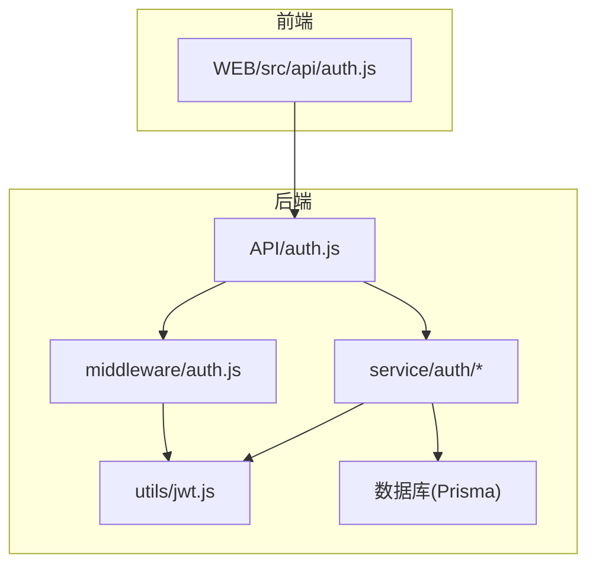
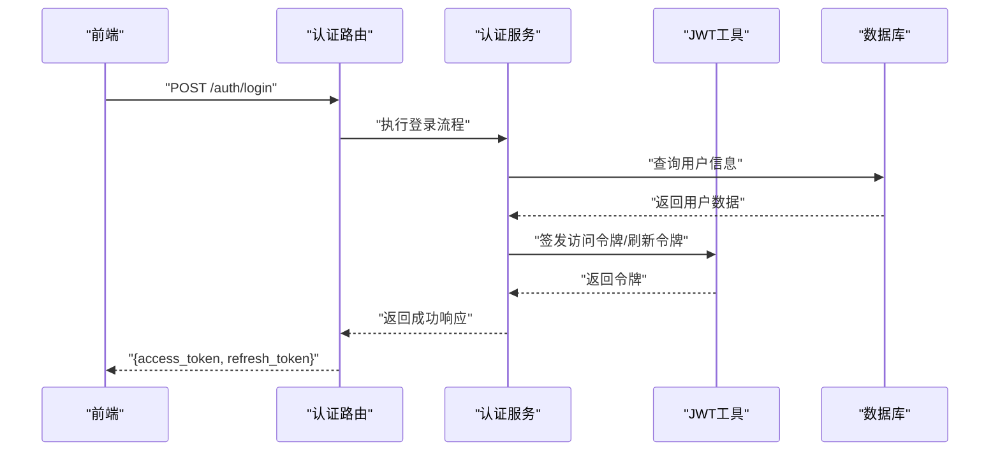
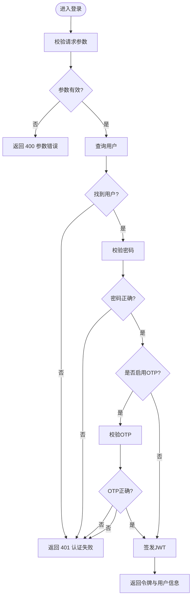
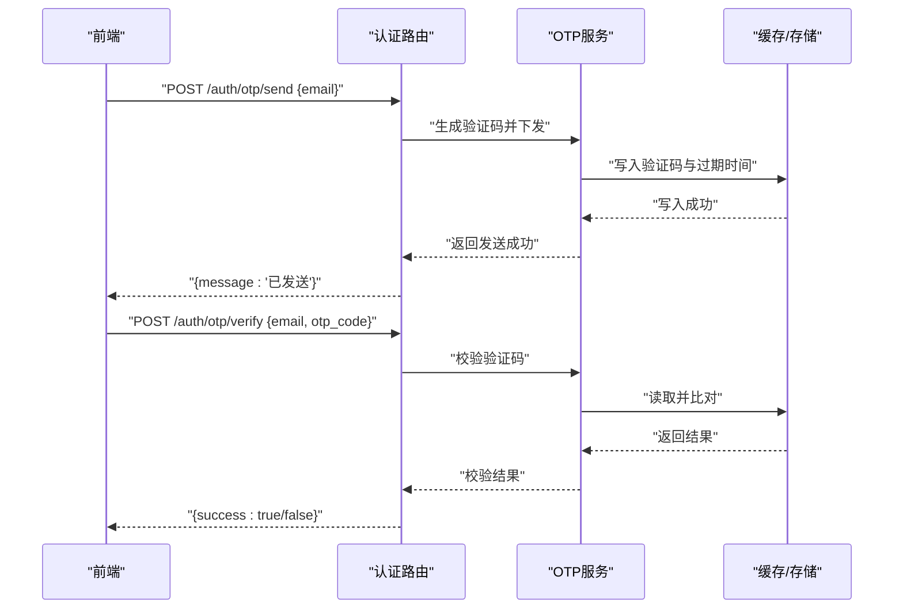
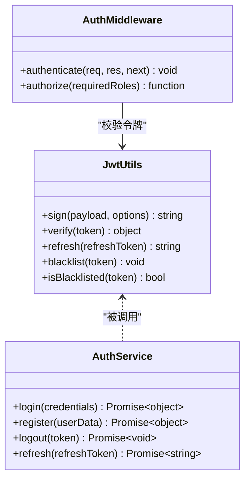
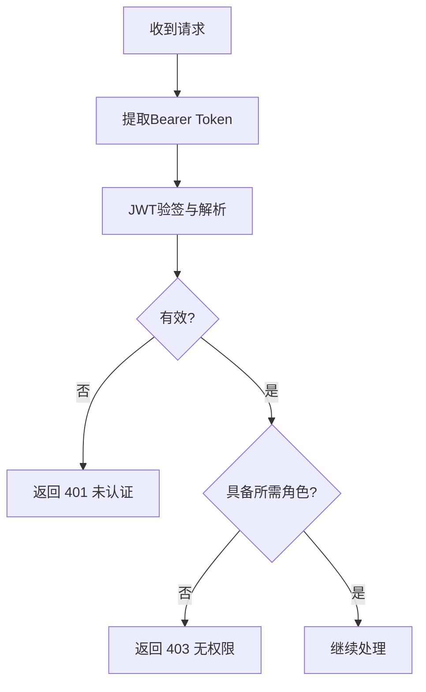
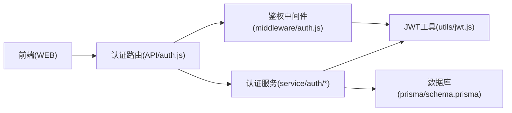

# 认证接口

<cite>
**本文引用的文件**   
- [node-jinmao/API/auth.js](file://node-jinmao/API/auth.js)
- [node-jinmao/middleware/auth.js](file://node-jinmao/middleware/auth.js)
- [node-jinmao/service/auth/index.js](file://node-jinmao/service/auth/index.js)
- [node-jinmao/service/auth/login.js](file://node-jinmao/service/auth/login.js)
- [node-jinmao/service/auth/otp.js](file://node-jinmao/service/auth/otp.js)
- [node-jinmao/service/auth/profile.js](file://node-jinmao/service/auth/profile.js)
- [node-jinmao/utils/jwt.js](file://node-jinmao/utils/jwt.js)
- [node-jinmao/prisma/schema.prisma](file://node-jinmao/prisma/schema.prisma)
- [WEB/src/api/auth.js](file://WEB/src/api/auth.js)
- [test/backend/src/modules/auth/auth.controller.ts](file://test/backend/src/modules/auth/auth.controller.ts)
- [test/backend/src/modules/auth/auth.middleware.ts](file://test/backend/src/modules/auth/auth.middleware.ts)
- [test/backend/src/modules/auth/auth.routes.ts](file://test/backend/src/modules/auth/auth.routes.ts)
- [test/backend/src/modules/auth/auth.service.ts](file://test/backend/src/modules/auth/auth.service.ts)
</cite>

## 目录
1. [简介](#简介)
2. [项目结构](#项目结构)
3. [核心组件](#核心组件)
4. [架构总览](#架构总览)
5. [详细组件分析](#详细组件分析)
6. [依赖关系分析](#依赖关系分析)
7. [性能考虑](#性能考虑)
8. [故障排查指南](#故障排查指南)
9. [结论](#结论)
10. [附录：API 规范与示例](#附录api-规范与示例)

## 简介
本文件为“金毛教你学重构版”项目的认证子系统 API 文档，覆盖用户登录、注册、登出、OTP 验证码发送与校验、JWT 令牌生成/验证/刷新机制、权限控制中间件、密码加密存储、会话管理与安全防护措施。文档同时提供客户端集成建议与常见错误处理方案，帮助前后端开发者快速对接并安全落地。

## 项目结构
认证相关代码主要分布在后端 Node.js 服务（node-jinmao）与前端 WEB 工程（WEB）中：
- 后端路由与控制器：API/auth.js
- 认证服务层：service/auth/*（登录、OTP、资料等）
- 鉴权中间件：middleware/auth.js
- JWT 工具：utils/jwt.js
- 数据模型：prisma/schema.prisma
- 前端调用封装：WEB/src/api/auth.js
- 参考实现（TypeScript 版本）：test/backend/src/modules/auth/*

图表来源
- [node-jinmao/API/auth.js](file://node-jinmao/API/auth.js)
- [node-jinmao/middleware/auth.js](file://node-jinmao/middleware/auth.js)
- [node-jinmao/service/auth/index.js](file://node-jinmao/service/auth/index.js)
- [node-jinmao/service/auth/login.js](file://node-jinmao/service/auth/login.js)
- [node-jinmao/service/auth/otp.js](file://node-jinmao/service/auth/otp.js)
- [node-jinmao/service/auth/profile.js](file://node-jinmao/service/auth/profile.js)
- [node-jinmao/utils/jwt.js](file://node-jinmao/utils/jwt.js)
- [node-jinmao/prisma/schema.prisma](file://node-jinmao/prisma/schema.prisma)
- [WEB/src/api/auth.js](file://WEB/src/api/auth.js)

章节来源
- [node-jinmao/API/auth.js](file://node-jinmao/API/auth.js)
- [node-jinmao/middleware/auth.js](file://node-jinmao/middleware/auth.js)
- [node-jinmao/service/auth/index.js](file://node-jinmao/service/auth/index.js)
- [node-jinmao/service/auth/login.js](file://node-jinmao/service/auth/login.js)
- [node-jinmao/service/auth/otp.js](file://node-jinmao/service/auth/otp.js)
- [node-jinmao/service/auth/profile.js](file://node-jinmao/service/auth/profile.js)
- [node-jinmao/utils/jwt.js](file://node-jinmao/utils/jwt.js)
- [node-jinmao/prisma/schema.prisma](file://node-jinmao/prisma/schema.prisma)
- [WEB/src/api/auth.js](file://WEB/src/api/auth.js)

## 核心组件
- 认证路由与控制器：统一暴露登录、注册、登出、OTP 等 HTTP 接口
- 认证服务层：封装业务逻辑（用户名/邮箱登录、OTP 发送与校验、用户资料查询）
- 鉴权中间件：解析并校验 JWT，注入用户上下文，支持角色/权限检查
- JWT 工具：签发、验签、刷新策略、黑名单/撤销（可选）
- 数据访问：通过 Prisma 访问用户表、活动记录等实体
- 前端 API 封装：集中管理请求头、Token 注入、错误处理与重试

章节来源
- [node-jinmao/API/auth.js](file://node-jinmao/API/auth.js)
- [node-jinmao/service/auth/index.js](file://node-jinmao/service/auth/index.js)
- [node-jinmao/middleware/auth.js](file://node-jinmao/middleware/auth.js)
- [node-jinmao/utils/jwt.js](file://node-jinmao/utils/jwt.js)
- [WEB/src/api/auth.js](file://WEB/src/api/auth.js)

## 架构总览
认证子系统采用分层架构：路由层接收请求，服务层执行业务逻辑，中间件负责鉴权，工具层提供 JWT 能力，数据层通过 Prisma 持久化。

图表来源
- [node-jinmao/API/auth.js](file://node-jinmao/API/auth.js)
- [node-jinmao/service/auth/login.js](file://node-jinmao/service/auth/login.js)
- [node-jinmao/utils/jwt.js](file://node-jinmao/utils/jwt.js)
- [node-jinmao/prisma/schema.prisma](file://node-jinmao/prisma/schema.prisma)

## 详细组件分析

### 登录接口
- 方法：POST
- URL：/auth/login
- 请求体字段：
  - username/email：用户名或邮箱（二选一）
  - password：明文密码（由前端传输，服务端进行哈希比对）
  - otp_code：可选，若开启双因素则需提供 OTP 验证码
- 响应体字段：
  - access_token：短期访问令牌
  - refresh_token：长期刷新令牌
  - user：用户基本信息（脱敏）
- 错误码：
  - 400：参数缺失或格式错误
  - 401：用户名/密码错误或 OTP 校验失败
  - 500：服务器内部错误

图表来源
- [node-jinmao/service/auth/login.js](file://node-jinmao/service/auth/login.js)
- [node-jinmao/service/auth/otp.js](file://node-jinmao/service/auth/otp.js)
- [node-jinmao/utils/jwt.js](file://node-jinmao/utils/jwt.js)

章节来源
- [node-jinmao/service/auth/login.js](file://node-jinmao/service/auth/login.js)
- [node-jinmao/service/auth/otp.js](file://node-jinmao/service/auth/otp.js)
- [node-jinmao/utils/jwt.js](file://node-jinmao/utils/jwt.js)

### 注册接口
- 方法：POST
- URL：/auth/register
- 请求体字段：
  - username：唯一用户名
  - email：唯一邮箱
  - password：明文密码（服务端进行哈希存储）
  - phone：可选手机号
- 响应体字段：
  - user：新用户基本信息（不含敏感字段）
- 错误码：
  - 400：参数校验失败
  - 409：用户名或邮箱已存在
  - 500：服务器内部错误

章节来源
- [node-jinmao/API/auth.js](file://node-jinmao/API/auth.js)
- [node-jinmao/service/auth/index.js](file://node-jinmao/service/auth/index.js)
- [node-jinmao/prisma/schema.prisma](file://node-jinmao/prisma/schema.prisma)

### 登出接口
- 方法：POST
- URL：/auth/logout
- 请求头：需携带有效的 access_token
- 行为：
  - 校验 token
  - 将 token 加入黑名单（可选）或清除服务端会话状态
- 响应体：
  - message：登出成功提示

章节来源
- [node-jinmao/API/auth.js](file://node-jinmao/API/auth.js)
- [node-jinmao/middleware/auth.js](file://node-jinmao/middleware/auth.js)
- [node-jinmao/utils/jwt.js](file://node-jinmao/utils/jwt.js)

### OTP 验证码发送与校验
- 发送验证码
  - 方法：POST
  - URL：/auth/otp/send
  - 请求体：email 或 phone（二选一）
  - 响应：发送成功提示
- 校验验证码
  - 方法：POST
  - URL：/auth/otp/verify
  - 请求体：email/phone + otp_code
  - 响应：校验成功提示（通常用于二次确认或绑定）
- 安全策略：
  - 频率限制（同一目标地址限频）
  - 验证码有效期（短时效）
  - 尝试次数上限与锁定

图表来源
- [node-jinmao/service/auth/otp.js](file://node-jinmao/service/auth/otp.js)

章节来源
- [node-jinmao/service/auth/otp.js](file://node-jinmao/service/auth/otp.js)

### 用户资料接口
- 方法：GET
- URL：/auth/me
- 请求头：需携带有效的 access_token
- 响应体字段：
  - id、username、email、role、createdAt 等基础信息（脱敏）

章节来源
- [node-jinmao/service/auth/profile.js](file://node-jinmao/service/auth/profile.js)
- [node-jinmao/middleware/auth.js](file://node-jinmao/middleware/auth.js)

### JWT 令牌机制
- 签发：
  - access_token：短期（例如 15 分钟），用于接口鉴权
  - refresh_token：长期（例如 7 天），用于刷新 access_token
- 验证：
  - 中间件从请求头提取 Bearer Token
  - 校验签名、过期时间、黑名单（可选）
  - 成功后注入 req.user
- 刷新：
  - POST /auth/refresh
  - 使用 refresh_token 换取新的 access_token
- 安全策略：
  - 最小权限原则（仅包含必要声明）
  - 防重放（结合短期有效期）
  - 可撤销（黑名单/白名单）

图表来源
- [node-jinmao/utils/jwt.js](file://node-jinmao/utils/jwt.js)
- [node-jinmao/middleware/auth.js](file://node-jinmao/middleware/auth.js)
- [node-jinmao/service/auth/index.js](file://node-jinmao/service/auth/index.js)

章节来源
- [node-jinmao/utils/jwt.js](file://node-jinmao/utils/jwt.js)
- [node-jinmao/middleware/auth.js](file://node-jinmao/middleware/auth.js)
- [node-jinmao/service/auth/index.js](file://node-jinmao/service/auth/index.js)

### 权限控制中间件与角色验证
- 工作原理：
  - 解析请求头中的 Authorization: Bearer <token>
  - 使用 JWT 工具验签并获取用户声明（含角色）
  - 根据路由所需角色进行授权判断
  - 未通过则返回 403；通过则继续处理
- 角色权限：
  - 支持基于角色的访问控制（RBAC）
  - 可在路由级别配置 requiredRoles 数组

图表来源
- [node-jinmao/middleware/auth.js](file://node-jinmao/middleware/auth.js)

章节来源
- [node-jinmao/middleware/auth.js](file://node-jinmao/middleware/auth.js)

### 密码加密存储与会话管理
- 密码加密：
  - 使用强哈希算法（如 bcrypt/scrypt）对密码进行加盐哈希存储
  - 禁止明文存储与可逆加密
- 会话管理：
  - 无状态鉴权为主（JWT）
  - 可选黑名单机制用于强制登出与撤销
- 安全措施：
  - 输入校验与长度限制
  - 速率限制与暴力破解防护
  - 日志脱敏（不记录敏感信息）

章节来源
- [node-jinmao/service/auth/login.js](file://node-jinmao/service/auth/login.js)
- [node-jinmao/utils/jwt.js](file://node-jinmao/utils/jwt.js)
- [node-jinmao/middleware/auth.js](file://node-jinmao/middleware/auth.js)

### 前端集成示例与最佳实践
- 请求封装：
  - 在请求拦截器中自动附加 Authorization 头
  - 统一处理 401/403 错误，触发刷新或跳转登录
- Token 管理：
  - 本地安全存储（HttpOnly Cookie 优先，否则 localStorage）
  - 刷新令牌轮换与失效处理
- 错误处理：
  - 网络异常重试与降级
  - 明确区分认证失败与权限不足

章节来源
- [WEB/src/api/auth.js](file://WEB/src/api/auth.js)
- [test/backend/src/modules/auth/auth.controller.ts](file://test/backend/src/modules/auth/auth.controller.ts)
- [test/backend/src/modules/auth/auth.middleware.ts](file://test/backend/src/modules/auth/auth.middleware.ts)
- [test/backend/src/modules/auth/auth.routes.ts](file://test/backend/src/modules/auth/auth.routes.ts)
- [test/backend/src/modules/auth/auth.service.ts](file://test/backend/src/modules/auth/auth.service.ts)

## 依赖关系分析
- 路由层依赖服务层与中间件
- 服务层依赖 JWT 工具与数据访问层
- 中间件依赖 JWT 工具与用户上下文
- 前端依赖后端 API 与本地存储

图表来源
- [node-jinmao/API/auth.js](file://node-jinmao/API/auth.js)
- [node-jinmao/service/auth/index.js](file://node-jinmao/service/auth/index.js)
- [node-jinmao/middleware/auth.js](file://node-jinmao/middleware/auth.js)
- [node-jinmao/utils/jwt.js](file://node-jinmao/utils/jwt.js)
- [node-jinmao/prisma/schema.prisma](file://node-jinmao/prisma/schema.prisma)
- [WEB/src/api/auth.js](file://WEB/src/api/auth.js)

章节来源
- [node-jinmao/API/auth.js](file://node-jinmao/API/auth.js)
- [node-jinmao/service/auth/index.js](file://node-jinmao/service/auth/index.js)
- [node-jinmao/middleware/auth.js](file://node-jinmao/middleware/auth.js)
- [node-jinmao/utils/jwt.js](file://node-jinmao/utils/jwt.js)
- [node-jinmao/prisma/schema.prisma](file://node-jinmao/prisma/schema.prisma)
- [WEB/src/api/auth.js](file://WEB/src/api/auth.js)

## 性能考虑
- JWT 验签开销低，适合高频鉴权
- 避免在服务端维护长会话，减少内存占用
- OTP 发送应异步化，避免阻塞主流程
- 合理设置令牌有效期，平衡安全性与用户体验
- 对频繁操作（如 OTP 发送）实施速率限制

[本节为通用指导，无需引用具体文件]

## 故障排查指南
- 401 未认证：
  - 检查 Authorization 头是否正确
  - 确认 access_token 未过期且未被拉黑
- 403 无权限：
  - 检查用户角色与路由 requiredRoles 配置
- 400 参数错误：
  - 核对请求体字段与类型
- 500 服务器错误：
  - 查看服务端日志，定位数据库或第三方服务异常

章节来源
- [node-jinmao/middleware/auth.js](file://node-jinmao/middleware/auth.js)
- [node-jinmao/service/auth/login.js](file://node-jinmao/service/auth/login.js)
- [node-jinmao/service/auth/otp.js](file://node-jinmao/service/auth/otp.js)

## 结论
认证子系统以 JWT 为核心，结合中间件与 RBAC 实现无状态鉴权与细粒度权限控制。通过 OTP 增强登录安全，配合严格的密码哈希与速率限制，保障系统安全与稳定。前端按规范封装请求与错误处理，可实现良好的用户体验与健壮性。

[本节为总结，无需引用具体文件]

## 附录：API 规范与示例

### 登录
- 方法：POST
- URL：/auth/login
- 请求体：
  - username/email：字符串
  - password：字符串
  - otp_code：可选字符串
- 成功响应：
  - access_token：字符串
  - refresh_token：字符串
  - user：对象（id、username、email、role 等）
- 错误响应：
  - 400：{ code: "BAD_REQUEST", message: "参数错误" }
  - 401：{ code: "UNAUTHORIZED", message: "用户名/密码错误或OTP失败" }
  - 500：{ code: "INTERNAL_ERROR", message: "服务器错误" }

章节来源
- [node-jinmao/API/auth.js](file://node-jinmao/API/auth.js)
- [node-jinmao/service/auth/login.js](file://node-jinmao/service/auth/login.js)

### 注册
- 方法：POST
- URL：/auth/register
- 请求体：
  - username：字符串（唯一）
  - email：字符串（唯一）
  - password：字符串
  - phone：可选字符串
- 成功响应：
  - user：对象（脱敏）
- 错误响应：
  - 400：{ code: "BAD_REQUEST", message: "参数错误" }
  - 409：{ code: "CONFLICT", message: "用户名或邮箱已存在" }
  - 500：{ code: "INTERNAL_ERROR", message: "服务器错误" }

章节来源
- [node-jinmao/API/auth.js](file://node-jinmao/API/auth.js)
- [node-jinmao/service/auth/index.js](file://node-jinmao/service/auth/index.js)

### 登出
- 方法：POST
- URL：/auth/logout
- 请求头：Authorization: Bearer <access_token>
- 成功响应：
  - message：字符串
- 错误响应：
  - 401：{ code: "UNAUTHORIZED", message: "令牌无效或已过期" }
  - 500：{ code: "INTERNAL_ERROR", message: "服务器错误" }

章节来源
- [node-jinmao/API/auth.js](file://node-jinmao/API/auth.js)
- [node-jinmao/middleware/auth.js](file://node-jinmao/middleware/auth.js)

### 刷新令牌
- 方法：POST
- URL：/auth/refresh
- 请求体：
  - refresh_token：字符串
- 成功响应：
  - access_token：字符串
- 错误响应：
  - 401：{ code: "UNAUTHORIZED", message: "刷新令牌无效或已过期" }
  - 500：{ code: "INTERNAL_ERROR", message: "服务器错误" }

章节来源
- [node-jinmao/utils/jwt.js](file://node-jinmao/utils/jwt.js)
- [node-jinmao/API/auth.js](file://node-jinmao/API/auth.js)

### OTP 发送
- 方法：POST
- URL：/auth/otp/send
- 请求体：
  - email：字符串（或 phone）
- 成功响应：
  - message：字符串
- 错误响应：
  - 400：{ code: "BAD_REQUEST", message: "参数错误" }
  - 429：{ code: "RATE_LIMITED", message: "发送过于频繁" }
  - 500：{ code: "INTERNAL_ERROR", message: "服务器错误" }

章节来源
- [node-jinmao/service/auth/otp.js](file://node-jinmao/service/auth/otp.js)

### OTP 校验
- 方法：POST
- URL：/auth/otp/verify
- 请求体：
  - email：字符串（或 phone）
  - otp_code：字符串
- 成功响应：
  - success：布尔
- 错误响应：
  - 400：{ code: "BAD_REQUEST", message: "参数错误" }
  - 401：{ code: "UNAUTHORIZED", message: "验证码错误或已过期" }
  - 500：{ code: "INTERNAL_ERROR", message: "服务器错误" }

章节来源
- [node-jinmao/service/auth/otp.js](file://node-jinmao/service/auth/otp.js)

### 获取当前用户
- 方法：GET
- URL：/auth/me
- 请求头：Authorization: Bearer <access_token>
- 成功响应：
  - user：对象（id、username、email、role、createdAt 等）
- 错误响应：
  - 401：{ code: "UNAUTHORIZED", message: "令牌无效或已过期" }
  - 500：{ code: "INTERNAL_ERROR", message: "服务器错误" }

章节来源
- [node-jinmao/service/auth/profile.js](file://node-jinmao/service/auth/profile.js)
- [node-jinmao/middleware/auth.js](file://node-jinmao/middleware/auth.js)

### 客户端集成要点
- 在请求拦截器中自动附加 Authorization 头
- 捕获 401 时尝试刷新令牌，失败则跳转登录
- 本地安全存储令牌（优先 HttpOnly Cookie）
- 对 OTP 发送实施前端限流与友好提示

章节来源
- [WEB/src/api/auth.js](file://WEB/src/api/auth.js)
- [test/backend/src/modules/auth/auth.controller.ts](file://test/backend/src/modules/auth/auth.controller.ts)
- [test/backend/src/modules/auth/auth.middleware.ts](file://test/backend/src/modules/auth/auth.middleware.ts)
- [test/backend/src/modules/auth/auth.routes.ts](file://test/backend/src/modules/auth/auth.routes.ts)
- [test/backend/src/modules/auth/auth.service.ts](file://test/backend/src/modules/auth/auth.service.ts)