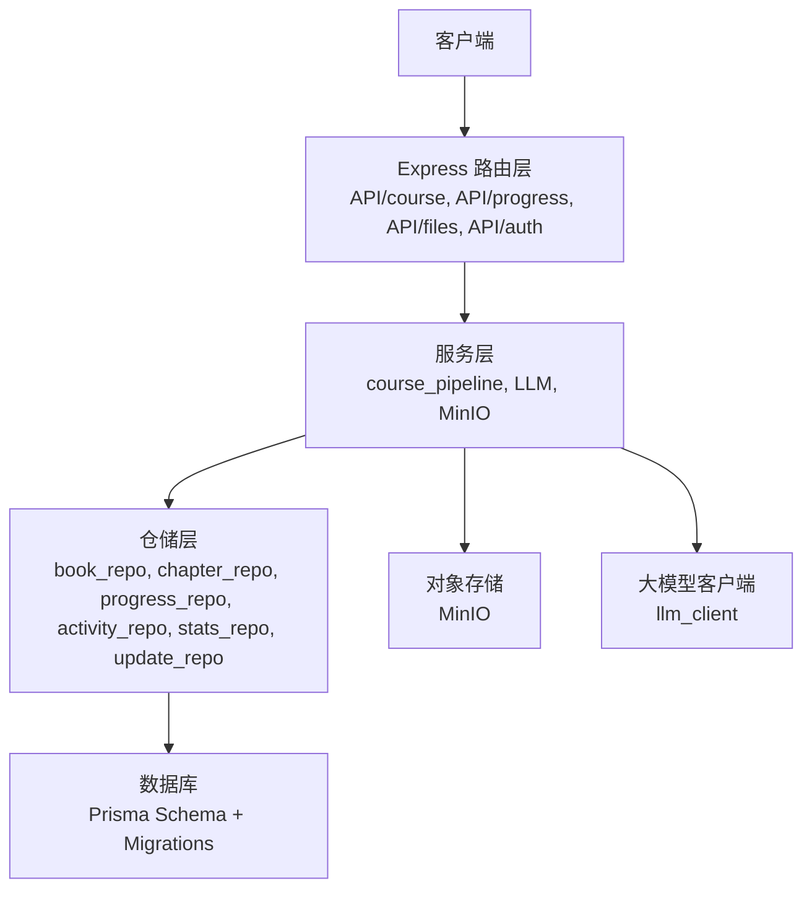
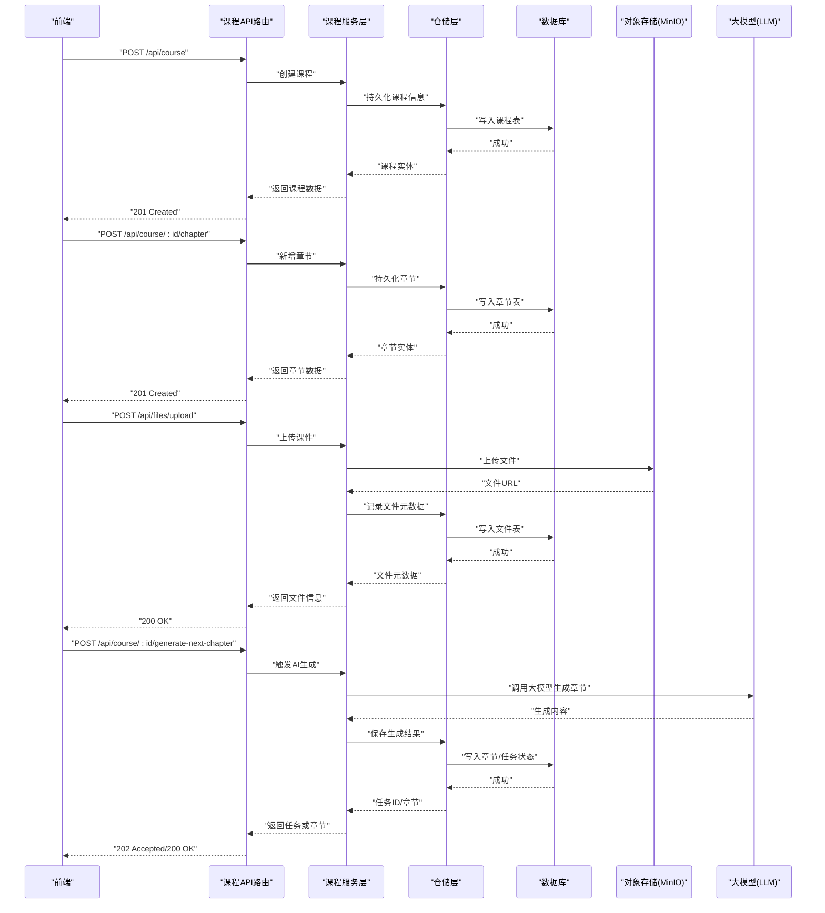
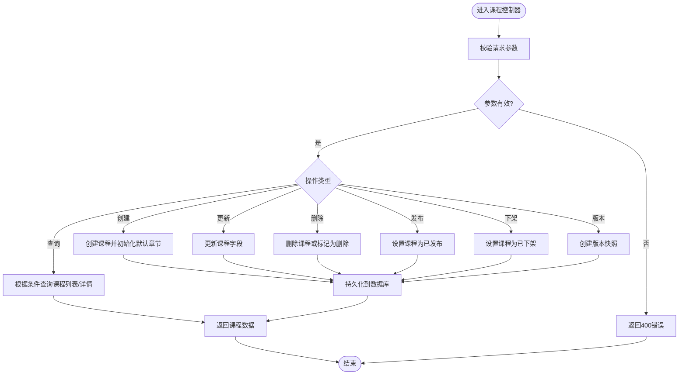
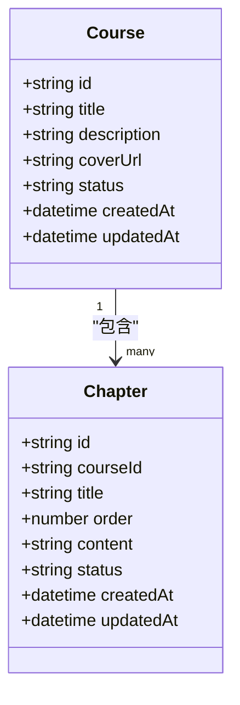
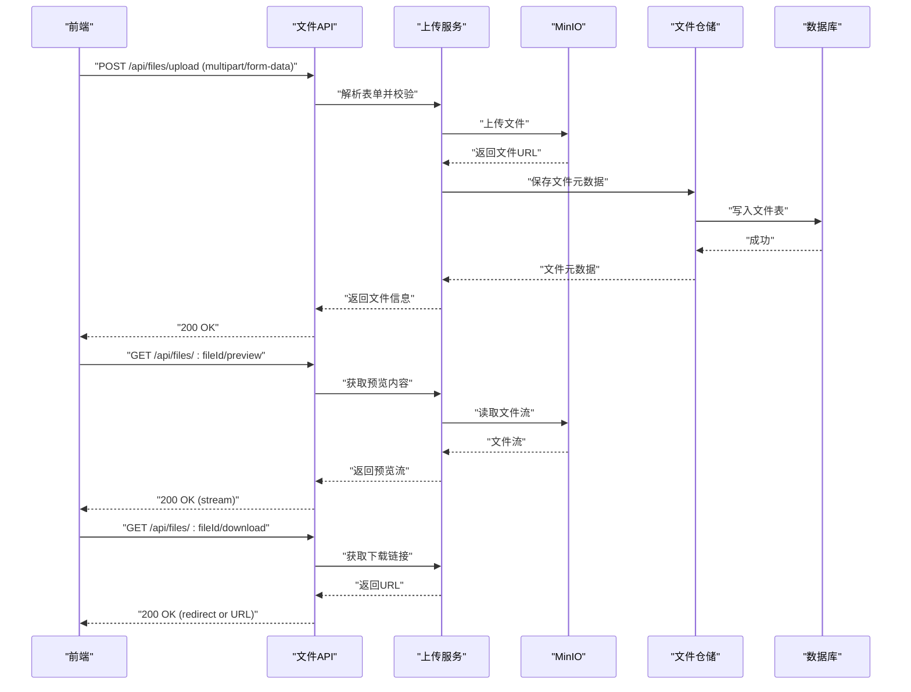
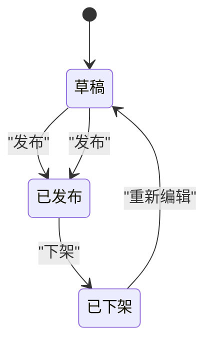
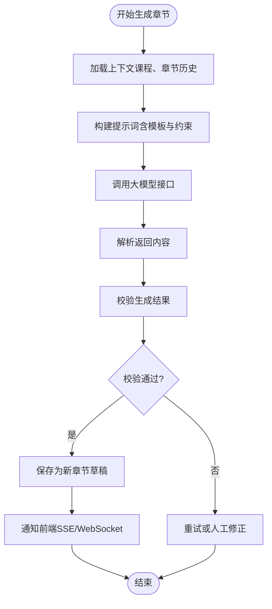
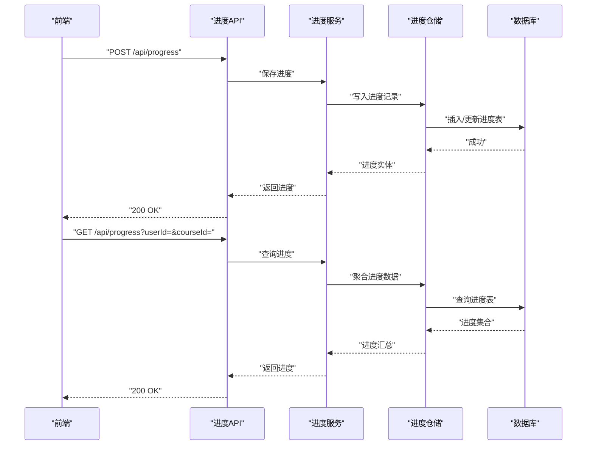
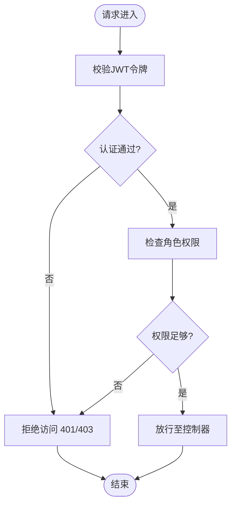
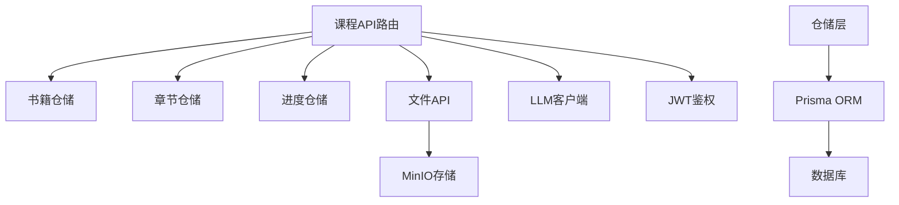

# 课程接口

<cite>
**本文档引用的文件**   
- [app.js](file://node-jinmao/app.js)
- [course/index.js](file://node-jinmao/API/course/index.js)
- [course/slides.js](file://node-jinmao/API/course/slides.js)
- [progress.js](file://node-jinmao/API/progress.js)
- [files.js](file://node-jinmao/API/files.js)
- [auth.js](file://node-jinmao/API/auth.js)
- [schema.prisma](file://node-jinmao/prisma/schema.prisma)
- [20260709105504_add_course_and_chapter/migration.sql](file://node-jinmao/prisma/migrations/20260709105504_add_course_and_chapter/migration.sql)
- [20260724_add_user_study_record/migration.sql](file://node-jinmao/prisma/migrations/20260724_add_user_study_record/migration.sql)
- [20260725_add_chapter_generation_progress/migration.sql](file://node-jinmao/prisma/migrations/20260725_add_chapter_generation_progress/migration.sql)
- [20260729_add_quiz_generating_task_id/migration.sql](file://node-jinmao/prisma/migrations/20260729_add_quiz_generating_task_id/migration.sql)
- [course_pipeline.js](file://node-jinmao/service/course_pipeline.js)
- [generate-next-chapter.js](file://node-jinmao/API/book/generate-next-chapter.js)
- [llm_client.js](file://node-jinmao/utils/llm_client.js)
- [upload_minio.js](file://node-jinmao/utils/upload_minio.js)
- [prisma.js](file://node-jinmao/utils/prisma.js)
- [book_repo.js](file://node-jinmao/utils/repo/book_repo.js)
- [chapter_repo.js](file://node-jinmao/utils/repo/chapter_repo.js)
- [progress_repo.js](file://node-jinmao/utils/repo/progress_repo.js)
- [activity_repo.js](file://node-jinmao/utils/repo/activity_repo.js)
- [stats_repo.js](file://node-jinmao/utils/repo/stats_repo.js)
- [update_repo.js](file://node-jinmao/utils/repo/update_repo.js)
- [auth/index.js](file://node-jinmao/service/auth/index.js)
- [auth/login.js](file://node-jinmao/service/auth/login.js)
- [auth/profile.js](file://node-jinmao/service/auth/profile.js)
- [billing.js](file://node-jinmao/utils/billing.js)
- [can_generate_next.js](file://node-jinmao/utils/can_generate_next.js)
- [generate_outline.js](file://node-jinmao/utils/generate_outline.js)
- [htmlppt.js](file://node-jinmao/utils/htmlppt.js)
- [doc2x.js](file://node-jinmao/utils/doc2x.js)
- [extract_zip.js](file://node-jinmao/utils/extract_zip.js)
- [input_validator.js](file://node-jinmao/utils/input_validator.js)
- [jwt.js](file://node-jinmao/utils/jwt.js)
- [line_indexer.js](file://node-jinmao/utils/line_indexer.js)
- [get_line.js](file://node-jinmao/utils/get_line.js)
</cite>

## 目录
1. [简介](#简介)
2. [项目结构](#项目结构)
3. [核心组件](#核心组件)
4. [架构总览](#架构总览)
5. [详细组件分析](#详细组件分析)
6. [依赖分析](#依赖分析)
7. [性能考虑](#性能考虑)
8. [故障排查指南](#故障排查指南)
9. [结论](#结论)
10. [附录](#附录)

## 简介
本文件为“金毛教你学重构版”的课程模块API文档，覆盖课程与章节的CRUD、课件文件上传/预览/下载、课程发布与版本管理、基于内容的章节自动生成（AI辅助）、学习进度追踪与记录、课程分享与权限控制等。文档面向前后端开发者与集成方，提供HTTP端点、请求响应格式、错误处理说明及最佳实践建议。

## 项目结构
后端采用Express路由+服务层+仓储层的分层架构：
- API路由层：按功能域划分（如 course、progress、files、auth）
- 服务层：编排业务逻辑（如课程流水线、LLM调用、MinIO上传）
- 仓储层：封装数据库访问（Prisma + SQL迁移）
- 工具层：通用能力（JWT鉴权、输入校验、LLM客户端、MinIO上传等）

**图表来源** 
- [app.js:1-200](file://node-jinmao/app.js#L1-L200)
- [course/index.js:1-200](file://node-jinmao/API/course/index.js#L1-L200)
- [course_pipeline.js:1-200](file://node-jinmao/service/course_pipeline.js#L1-L200)
- [prisma.js:1-100](file://node-jinmao/utils/prisma.js#L1-L100)

**章节来源**
- [app.js:1-200](file://node-jinmao/app.js#L1-L200)

## 核心组件
- 课程与章节管理：课程创建、编辑、删除、查询；章节增删改查；内容更新
- 课件文件管理：上传、预览、下载（多部分表单 multipart/form-data）
- 发布与版本：课程发布、下架、版本管理
- AI生成：基于内容的章节自动生成、大纲生成、下一步章节生成
- 学习进度：课程进度追踪、学习记录保存
- 分享与权限：课程分享链接、访问权限控制、鉴权中间件

**章节来源**
- [course/index.js:1-200](file://node-jinmao/API/course/index.js#L1-L200)
- [course/slides.js:1-200](file://node-jinmao/API/course/slides.js#L1-L200)
- [progress.js:1-200](file://node-jinmao/API/progress.js#L1-L200)
- [files.js:1-200](file://node-jinmao/API/files.js#L1-L200)
- [course_pipeline.js:1-200](file://node-jinmao/service/course_pipeline.js#L1-L200)
- [generate-next-chapter.js:1-200](file://node-jinmao/API/book/generate-next-chapter.js#L1-L200)

## 架构总览
课程模块的整体交互流程如下：
- 前端通过HTTP调用API路由
- 路由解析参数并调用服务层
- 服务层协调仓储层与外部系统（数据库、对象存储、LLM）
- 统一返回JSON响应，错误走统一错误处理

**图表来源** 
- [course/index.js:1-200](file://node-jinmao/API/course/index.js#L1-L200)
- [course/slides.js:1-200](file://node-jinmao/API/course/slides.js#L1-L200)
- [progress.js:1-200](file://node-jinmao/API/progress.js#L1-L200)
- [files.js:1-200](file://node-jinmao/API/files.js#L1-L200)
- [course_pipeline.js:1-200](file://node-jinmao/service/course_pipeline.js#L1-L200)
- [generate-next-chapter.js:1-200](file://node-jinmao/API/book/generate-next-chapter.js#L1-L200)

## 详细组件分析

### 课程管理（CRUD与发布/版本）
- 创建课程：POST /api/course
  - 请求体包含课程标题、描述、封面、初始大纲等字段
  - 成功后返回课程ID与基础信息
- 编辑课程：PUT /api/course/:id
  - 支持更新标题、描述、封面、状态等
- 删除课程：DELETE /api/course/:id
  - 软删除或硬删除策略由仓储实现决定
- 查询课程：GET /api/course/:id 与 GET /api/course
  - 支持分页、筛选、排序
- 发布与下架：PATCH /api/course/:id/publish 与 PATCH /api/course/:id/unpublish
  - 更新课程状态（草稿、已发布、已下架）
- 版本管理：GET /api/course/:id/versions 与 POST /api/course/:id/version
  - 记录版本快照，支持回滚到指定版本

**图表来源** 
- [course/index.js:1-200](file://node-jinmao/API/course/index.js#L1-L200)
- [book_repo.js:1-200](file://node-jinmao/utils/repo/book_repo.js#L1-L200)

**章节来源**
- [course/index.js:1-200](file://node-jinmao/API/course/index.js#L1-L200)
- [book_repo.js:1-200](file://node-jinmao/utils/repo/book_repo.js#L1-L200)

### 章节管理（CRUD与内容更新）
- 新增章节：POST /api/course/:id/chapter
  - 请求体包含章节标题、顺序、内容等
- 更新章节：PUT /api/course/:id/chapter/:chapterId
  - 支持更新标题、顺序、内容、状态
- 删除章节：DELETE /api/course/:id/chapter/:chapterId
- 查询章节：GET /api/course/:id/chapters
  - 支持分页、排序、筛选
- 内容更新：PATCH /api/course/:id/chapter/:chapterId/content
  - 增量更新章节内容，支持富文本/Markdown

**图表来源** 
- [schema.prisma:1-300](file://node-jinmao/prisma/schema.prisma#L1-L300)
- [20260709105504_add_course_and_chapter/migration.sql:1-200](file://node-jinmao/prisma/migrations/20260709105504_add_course_and_chapter/migration.sql#L1-L200)

**章节来源**
- [course/index.js:1-200](file://node-jinmao/API/course/index.js#L1-L200)
- [chapter_repo.js:1-200](file://node-jinmao/utils/repo/chapter_repo.js#L1-L200)

### 课件文件上传、预览、下载
- 上传课件：POST /api/files/upload
  - 使用multipart/form-data，字段包括 file、courseId、chapterId（可选）
  - 返回文件URL、大小、类型、存储路径等
- 预览课件：GET /api/files/:fileId/preview
  - 返回预览HTML或PDF流
- 下载课件：GET /api/files/:fileId/download
  - 返回二进制文件或下载链接

**图表来源** 
- [files.js:1-200](file://node-jinmao/API/files.js#L1-L200)
- [upload_minio.js:1-200](file://node-jinmao/utils/upload_minio.js#L1-L200)

**章节来源**
- [files.js:1-200](file://node-jinmao/API/files.js#L1-L200)
- [upload_minio.js:1-200](file://node-jinmao/utils/upload_minio.js#L1-L200)

### 课程发布、下架与版本管理
- 发布课程：PATCH /api/course/:id/publish
  - 将课程状态更新为“已发布”，允许学习者访问
- 下架课程：PATCH /api/course/:id/unpublish
  - 将课程状态更新为“已下架”，隐藏于公开列表
- 版本管理：
  - 创建版本：POST /api/course/:id/version
  - 查询版本：GET /api/course/:id/versions
  - 回滚版本：POST /api/course/:id/rollback?versionId=...

**图表来源** 
- [course/index.js:1-200](file://node-jinmao/API/course/index.js#L1-L200)

**章节来源**
- [course/index.js:1-200](file://node-jinmao/API/course/index.js#L1-L200)

### 基于内容的章节自动生成（AI辅助）
- 生成大纲：POST /api/course/:id/generate-outline
  - 输入主题/关键词，返回结构化大纲
- 生成下一章节：POST /api/course/:id/generate-next-chapter
  - 基于已有章节内容，调用LLM生成新章节草稿
- 任务状态查询：GET /api/task/:taskId
  - 返回任务状态（进行中、完成、失败）与结果

**图表来源** 
- [generate-next-chapter.js:1-200](file://node-jinmao/API/book/generate-next-chapter.js#L1-L200)
- [llm_client.js:1-200](file://node-jinmao/utils/llm_client.js#L1-L200)
- [course_pipeline.js:1-200](file://node-jinmao/service/course_pipeline.js#L1-L200)

**章节来源**
- [generate-next-chapter.js:1-200](file://node-jinmao/API/book/generate-next-chapter.js#L1-L200)
- [llm_client.js:1-200](file://node-jinmao/utils/llm_client.js#L1-L200)
- [course_pipeline.js:1-200](file://node-jinmao/service/course_pipeline.js#L1-L200)

### 课程进度追踪与学习记录
- 记录学习进度：POST /api/progress
  - 字段包括 userId、courseId、chapterId、progressPercent、lastViewedAt
- 查询学习进度：GET /api/progress?userId=&courseId=
  - 返回用户在各课程的进度汇总与章节级进度
- 同步学习行为：POST /api/activity
  - 记录观看时长、点击行为、笔记等

**图表来源** 
- [progress.js:1-200](file://node-jinmao/API/progress.js#L1-L200)
- [progress_repo.js:1-200](file://node-jinmao/utils/repo/progress_repo.js#L1-L200)

**章节来源**
- [progress.js:1-200](file://node-jinmao/API/progress.js#L1-L200)
- [progress_repo.js:1-200](file://node-jinmao/utils/repo/progress_repo.js#L1-L200)

### 课程分享与权限控制
- 分享链接：GET /api/course/:id/share?token=...
  - 支持匿名访问与限时访问
- 权限校验：中间件验证JWT与角色
  - 管理员可编辑课程，教师可管理章节，学生仅可学习
- 访问控制：基于课程状态与用户角色的访问矩阵

**图表来源** 
- [auth.js:1-200](file://node-jinmao/API/auth.js#L1-L200)
- [auth/index.js:1-200](file://node-jinmao/service/auth/index.js#L1-L200)
- [jwt.js:1-200](file://node-jinmao/utils/jwt.js#L1-L200)

**章节来源**
- [auth.js:1-200](file://node-jinmao/API/auth.js#L1-L200)
- [auth/index.js:1-200](file://node-jinmao/service/auth/index.js#L1-L200)
- [jwt.js:1-200](file://node-jinmao/utils/jwt.js#L1-L200)

## 依赖分析
课程模块依赖以下关键组件：
- Express路由：定义HTTP端点与参数解析
- Prisma ORM：数据库建模与查询
- MinIO：对象存储用于课件文件
- LLM客户端：调用大模型进行内容生成
- JWT：身份认证与授权

**图表来源** 
- [course/index.js:1-200](file://node-jinmao/API/course/index.js#L1-L200)
- [files.js:1-200](file://node-jinmao/API/files.js#L1-L200)
- [progress.js:1-200](file://node-jinmao/API/progress.js#L1-L200)
- [book_repo.js:1-200](file://node-jinmao/utils/repo/book_repo.js#L1-L200)
- [chapter_repo.js:1-200](file://node-jinmao/utils/repo/chapter_repo.js#L1-L200)
- [progress_repo.js:1-200](file://node-jinmao/utils/repo/progress_repo.js#L1-L200)
- [upload_minio.js:1-200](file://node-jinmao/utils/upload_minio.js#L1-L200)
- [llm_client.js:1-200](file://node-jinmao/utils/llm_client.js#L1-L200)
- [jwt.js:1-200](file://node-jinmao/utils/jwt.js#L1-L200)
- [prisma.js:1-200](file://node-jinmao/utils/prisma.js#L1-L200)

**章节来源**
- [course/index.js:1-200](file://node-jinmao/API/course/index.js#L1-L200)
- [files.js:1-200](file://node-jinmao/API/files.js#L1-L200)
- [progress.js:1-200](file://node-jinmao/API/progress.js#L1-L200)

## 性能考虑
- 文件上传：使用分片上传与断点续传提升大文件体验
- 数据库查询：对常用查询字段建立索引（courseId、userId、chapterId）
- 缓存策略：对课程列表、章节大纲使用Redis缓存
- LLM调用：异步任务队列处理生成请求，避免阻塞主线程
- 流式传输：预览与下载使用流式响应减少内存占用

[本节为通用指导，不直接分析具体文件]

## 故障排查指南
常见错误与处理：
- 400 参数错误：检查请求体字段与类型
- 401 未认证：检查JWT令牌是否有效
- 403 权限不足：确认用户角色与课程权限
- 404 资源不存在：检查ID是否正确
- 500 服务器错误：查看日志与数据库连接状态
- 文件上传失败：检查MinIO配置与网络连通性
- LLM调用超时：检查大模型服务状态与重试机制

**章节来源**
- [auth.js:1-200](file://node-jinmao/API/auth.js#L1-L200)
- [files.js:1-200](file://node-jinmao/API/files.js#L1-L200)
- [llm_client.js:1-200](file://node-jinmao/utils/llm_client.js#L1-L200)

## 结论
本课程模块API提供了完整的课程生命周期管理能力，涵盖内容创作、文件管理、AI辅助生成、学习追踪与权限控制。通过分层架构与标准化接口设计，确保了系统的可扩展性与可维护性。建议在生产环境中启用缓存、异步任务与监控告警以提升稳定性与性能。

[本节为总结性内容，不直接分析具体文件]

## 附录
- 数据库迁移：参考 prisma/migrations 下的SQL脚本
- 配置文件：参考 config 目录下的LLM、MinIO、计费等配置
- 工具函数：参考 utils 目录下的通用工具类

[本节为补充信息，不直接分析具体文件]