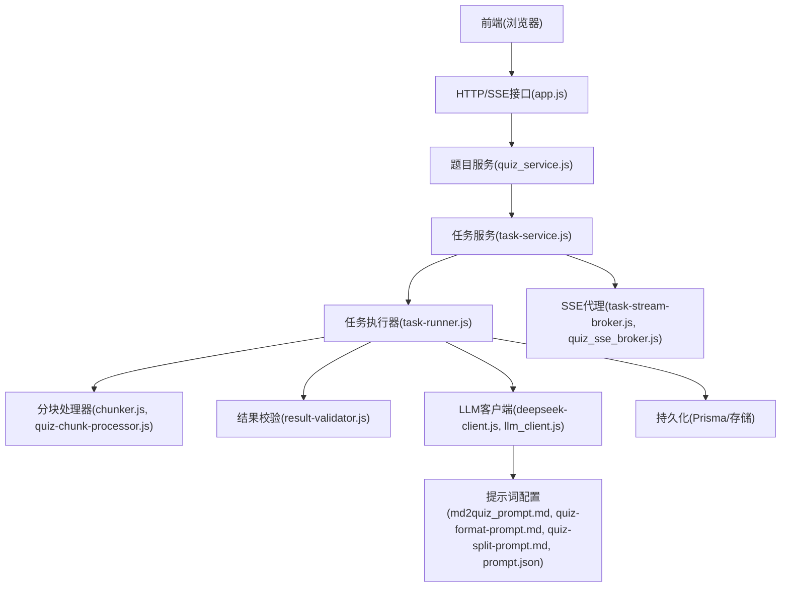
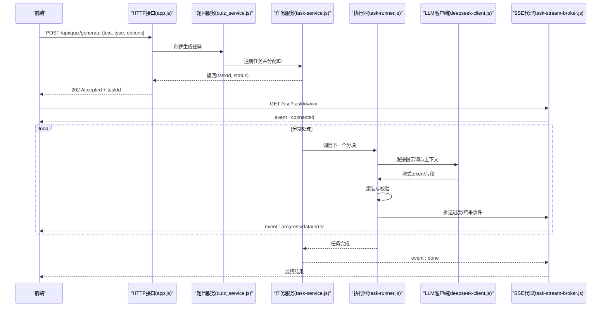
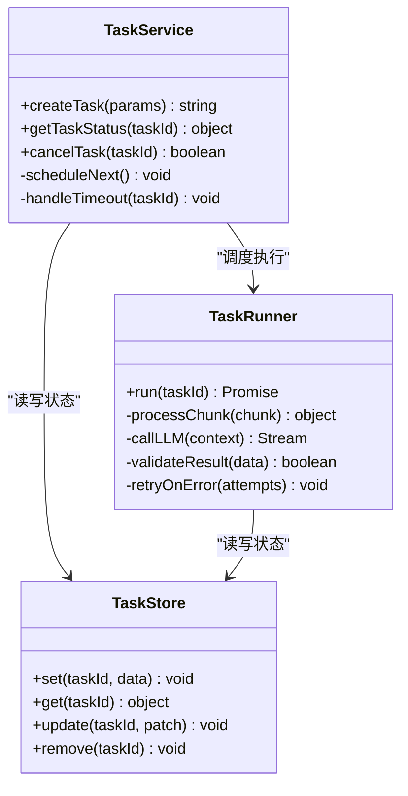
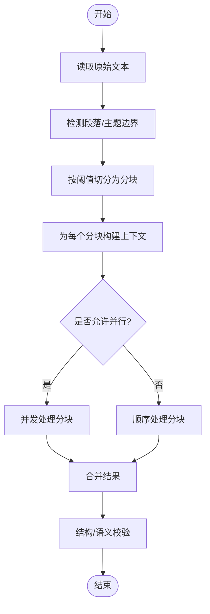
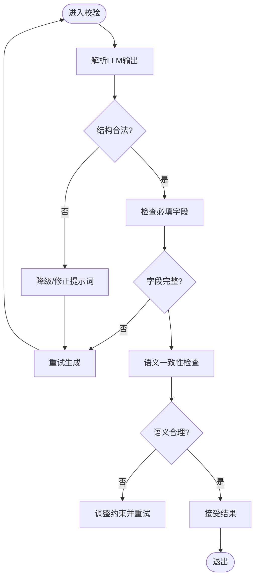
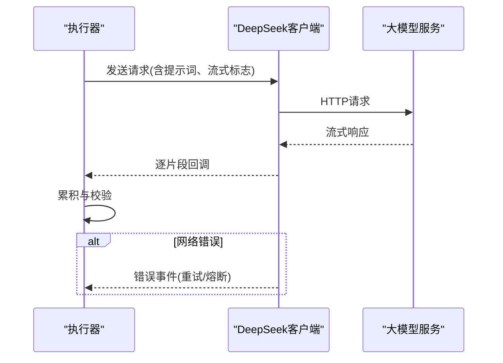
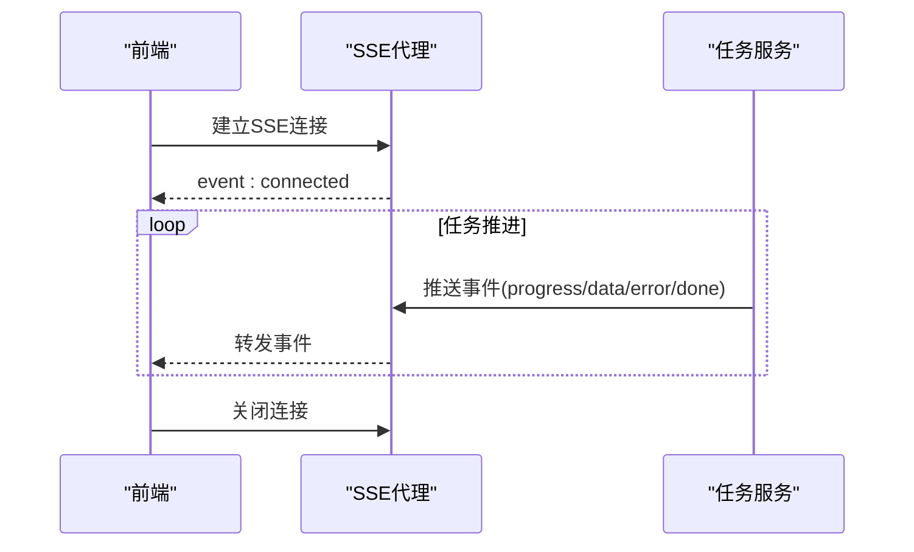
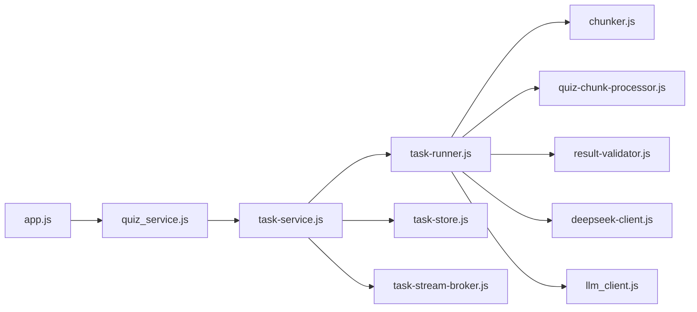

# AI题目生成

<cite>
**本文引用的文件**   
- [app.js](file://node-jinmao/app.js)
- [quiz_service.js](file://node-jinmao/service/quiz_service.js)
- [task-service.js](file://node-jinmao/service/md2quiz/task-service.js)
- [task-runner.js](file://node-jinmao/service/md2quiz/task-runner.js)
- [task-store.js](file://node-jinmao/service/md2quiz/task-store.js)
- [task-stream-broker.js](file://node-jinmao/service/md2quiz/task-stream-broker.js)
- [quiz-chunk-processor.js](file://node-jinmao/service/md2quiz/quiz-chunk-processor.js)
- [chunker.js](file://node-jinmao/service/md2quiz/chunker.js)
- [result-validator.js](file://node-jinmao/service/md2quiz/result-validator.js)
- [deepseek-client.js](file://node-jinmao/service/md2quiz/deepseek-client.js)
- [md2quiz_prompt.md](file://node-jinmao/config/md2quiz_prompt.md)
- [quiz-format-prompt.md](file://node-jinmao/config/quiz-format-prompt.md)
- [quiz-split-prompt.md](file://node-jinmao/config/quiz-split-prompt.md)
- [prompt.json](file://node-jinmao/config/prompt.json)
- [llm_client.js](file://node-jinmao/utils/llm_client.js)
- [quiz_sse_broker.js](file://node-jinmao/service/quiz_sse_broker.js)
- [API文档.md](file://API文档.md)
</cite>

## 目录
1. [简介](#简介)
2. [项目结构](#项目结构)
3. [核心组件](#核心组件)
4. [架构总览](#架构总览)
5. [详细组件分析](#详细组件分析)
6. [依赖关系分析](#依赖关系分析)
7. [性能考虑](#性能考虑)
8. [故障排查指南](#故障排查指南)
9. [结论](#结论)
10. [附录](#附录)

## 简介
本文件面向“AI题目生成”功能，系统性说明基于大模型的智能出题能力与实现方式。内容覆盖：
- 文本分析与切分、题目生成、质量评估的完整流程
- SSE流式传输接口的连接建立、消息格式与事件类型
- 任务队列管理、并发控制、超时处理机制
- 不同题型的生成策略与提示词配置
- 实时进度更新、错误重试、结果验证的端到端流程
- 性能优化建议与最佳实践

该功能以Node.js后端为核心，结合SSE（Server-Sent Events）向前端推送生成进度与结果，通过任务服务与执行器协调LLM调用、分块处理、校验与持久化。

## 项目结构
- 前端位于 WEB/src，提供题库导入、题目展示、报告等页面与组件
- 后端位于 node-jinmao，包含路由、服务、工具与配置
- md2quiz 子模块负责Markdown到题目的转换与生成流水线
- 配置集中在 config 目录，包含提示词模板与LLM客户端配置

图表来源
- [app.js:1-200](file://node-jinmao/app.js#L1-L200)
- [quiz_service.js:1-200](file://node-jinmao/service/quiz_service.js#L1-L200)
- [task-service.js:1-200](file://node-jinmao/service/md2quiz/task-service.js#L1-L200)
- [task-runner.js:1-200](file://node-jinmao/service/md2quiz/task-runner.js#L1-L200)
- [task-store.js:1-200](file://node-jinmao/service/md2quiz/task-store.js#L1-L200)
- [task-stream-broker.js:1-200](file://node-jinmao/service/md2quiz/task-stream-broker.js#L1-L200)
- [quiz-chunk-processor.js:1-200](file://node-jinmao/service/md2quiz/quiz-chunk-processor.js#L1-L200)
- [chunker.js:1-200](file://node-jinmao/service/md2quiz/chunker.js#L1-L200)
- [result-validator.js:1-200](file://node-jinmao/service/md2quiz/result-validator.js#L1-L200)
- [deepseek-client.js:1-200](file://node-jinmao/service/md2quiz/deepseek-client.js#L1-L200)
- [llm_client.js:1-200](file://node-jinmao/utils/llm_client.js#L1-L200)
- [md2quiz_prompt.md:1-200](file://node-jinmao/config/md2quiz_prompt.md#L1-L200)
- [quiz-format-prompt.md:1-200](file://node-jinmao/config/quiz-format-prompt.md#L1-L200)
- [quiz-split-prompt.md:1-200](file://node-jinmao/config/quiz-split-prompt.md#L1-L200)
- [prompt.json:1-200](file://node-jinmao/config/prompt.json#L1-L200)

章节来源
- [app.js:1-200](file://node-jinmao/app.js#L1-L200)
- [API文档.md:1-200](file://API文档.md#L1-L200)

## 核心组件
- 题目服务（quiz_service.js）：对外暴露题目生成相关接口，编排任务创建、状态查询与结果获取
- 任务服务（task-service.js）：维护任务生命周期、调度执行器、聚合进度与结果
- 任务执行器（task-runner.js）：驱动分块、LLM调用、结果校验与落库
- 分块处理器（chunker.js, quiz-chunk-processor.js）：将长文本切分为可处理的片段，并组装上下文
- 结果校验器（result-validator.js）：对LLM返回的题目进行结构与语义校验，必要时触发重试或修正
- LLM客户端（deepseek-client.js, llm_client.js）：封装大模型调用、流式响应与重试策略
- SSE代理（task-stream-broker.js, quiz_sse_broker.js）：管理SSE连接、事件广播与订阅
- 提示词配置（md2quiz_prompt.md, quiz-format-prompt.md, quiz-split-prompt.md, prompt.json）：定义题型、格式与生成策略

章节来源
- [quiz_service.js:1-200](file://node-jinmao/service/quiz_service.js#L1-L200)
- [task-service.js:1-200](file://node-jinmao/service/md2quiz/task-service.js#L1-L200)
- [task-runner.js:1-200](file://node-jinmao/service/md2quiz/task-runner.js#L1-L200)
- [chunker.js:1-200](file://node-jinmao/service/md2quiz/chunker.js#L1-L200)
- [quiz-chunk-processor.js:1-200](file://node-jinmao/service/md2quiz/quiz-chunk-processor.js#L1-L200)
- [result-validator.js:1-200](file://node-jinmao/service/md2quiz/result-validator.js#L1-L200)
- [deepseek-client.js:1-200](file://node-jinmao/service/md2quiz/deepseek-client.js#L1-L200)
- [llm_client.js:1-200](file://node-jinmao/utils/llm_client.js#L1-L200)
- [task-stream-broker.js:1-200](file://node-jinmao/service/md2quiz/task-stream-broker.js#L1-L200)
- [quiz_sse_broker.js:1-200](file://node-jinmao/service/quiz_sse_broker.js#L1-L200)
- [md2quiz_prompt.md:1-200](file://node-jinmao/config/md2quiz_prompt.md#L1-L200)
- [quiz-format-prompt.md:1-200](file://node-jinmao/config/quiz-format-prompt.md#L1-L200)
- [quiz-split-prompt.md:1-200](file://node-jinmao/config/quiz-split-prompt.md#L1-L200)
- [prompt.json:1-200](file://node-jinmao/config/prompt.json#L1-L200)

## 架构总览
整体采用“请求-任务-执行-流式反馈”的分层架构：
- 前端通过HTTP发起生成请求，后端返回任务ID
- 前端通过SSE订阅任务事件，接收进度与增量结果
- 任务服务维护任务状态机，执行器按分块顺序处理
- LLM客户端支持流式输出，便于实时反馈
- 校验器确保输出符合题型规范，失败时自动重试或回退

图表来源
- [app.js:1-200](file://node-jinmao/app.js#L1-L200)
- [quiz_service.js:1-200](file://node-jinmao/service/quiz_service.js#L1-L200)
- [task-service.js:1-200](file://node-jinmao/service/md2quiz/task-service.js#L1-L200)
- [task-runner.js:1-200](file://node-jinmao/service/md2quiz/task-runner.js#L1-L200)
- [deepseek-client.js:1-200](file://node-jinmao/service/md2quiz/deepseek-client.js#L1-L200)
- [task-stream-broker.js:1-200](file://node-jinmao/service/md2quiz/task-stream-broker.js#L1-L200)

## 详细组件分析

### 任务服务与执行器（task-service.js, task-runner.js）
- 任务服务负责任务注册、状态跟踪、并发限制与超时控制
- 执行器负责读取待处理分块、调用LLM、合并结果、触发校验与重试
- 两者通过任务存储（task-store.js）交互，保证一致性

图表来源
- [task-service.js:1-200](file://node-jinmao/service/md2quiz/task-service.js#L1-L200)
- [task-runner.js:1-200](file://node-jinmao/service/md2quiz/task-runner.js#L1-L200)
- [task-store.js:1-200](file://node-jinmao/service/md2quiz/task-store.js#L1-L200)

章节来源
- [task-service.js:1-200](file://node-jinmao/service/md2quiz/task-service.js#L1-L200)
- [task-runner.js:1-200](file://node-jinmao/service/md2quiz/task-runner.js#L1-L200)
- [task-store.js:1-200](file://node-jinmao/service/md2quiz/task-store.js#L1-L200)

### 分块与处理器（chunker.js, quiz-chunk-processor.js）
- 分块器根据长度、段落边界与主题完整性切分文本，避免破坏语义
- 处理器为每个分块构建提示词上下文，包括题型、难度、风格与约束
- 支持并行处理多个分块，提升吞吐

图表来源
- [chunker.js:1-200](file://node-jinmao/service/md2quiz/chunker.js#L1-L200)
- [quiz-chunk-processor.js:1-200](file://node-jinmao/service/md2quiz/quiz-chunk-processor.js#L1-L200)

章节来源
- [chunker.js:1-200](file://node-jinmao/service/md2quiz/chunker.js#L1-L200)
- [quiz-chunk-processor.js:1-200](file://node-jinmao/service/md2quiz/quiz-chunk-processor.js#L1-L200)

### 结果校验与重试（result-validator.js）
- 校验规则涵盖JSON结构、必填字段、选项数量、答案有效性等
- 失败时触发重试或降级策略（如减少选项、简化题干）
- 记录失败原因以便审计与调优

图表来源
- [result-validator.js:1-200](file://node-jinmao/service/md2quiz/result-validator.js#L1-L200)

章节来源
- [result-validator.js:1-200](file://node-jinmao/service/md2quiz/result-validator.js#L1-L200)

### LLM客户端与流式传输（deepseek-client.js, llm_client.js）
- 封装HTTP请求、鉴权、重试与超时
- 支持SSE流式读取，逐token/片段转发给执行器
- 错误码映射与指数退避策略

图表来源
- [deepseek-client.js:1-200](file://node-jinmao/service/md2quiz/deepseek-client.js#L1-L200)
- [llm_client.js:1-200](file://node-jinmao/utils/llm_client.js#L1-L200)

章节来源
- [deepseek-client.js:1-200](file://node-jinmao/service/md2quiz/deepseek-client.js#L1-L200)
- [llm_client.js:1-200](file://node-jinmao/utils/llm_client.js#L1-L200)

### SSE代理与事件协议（task-stream-broker.js, quiz_sse_broker.js）
- 管理SSE连接生命周期，支持多用户订阅同一任务
- 事件类型包括：connected、progress、data、error、done
- 消息体包含任务ID、进度百分比、当前分块索引、增量结果与错误信息

图表来源
- [task-stream-broker.js:1-200](file://node-jinmao/service/md2quiz/task-stream-broker.js#L1-L200)
- [quiz_sse_broker.js:1-200](file://node-jinmao/service/quiz_sse_broker.js#L1-L200)

章节来源
- [task-stream-broker.js:1-200](file://node-jinmao/service/md2quiz/task-stream-broker.js#L1-L200)
- [quiz_sse_broker.js:1-200](file://node-jinmao/service/quiz_sse_broker.js#L1-L200)

### 提示词与题型策略（md2quiz_prompt.md, quiz-format-prompt.md, quiz-split-prompt.md, prompt.json）
- 题型策略：选择题、判断题、填空题、简答题等，每种题型有独立约束
- 格式规范：统一JSON结构，包含题干、选项、答案、解析、难度、知识点标签
- 分割策略：依据主题边界与长度阈值，保持上下文连贯
- 动态参数：难度、数量、风格、语言、领域术语等可通过配置注入

章节来源
- [md2quiz_prompt.md:1-200](file://node-jinmao/config/md2quiz_prompt.md#L1-L200)
- [quiz-format-prompt.md:1-200](file://node-jinmao/config/quiz-format-prompt.md#L1-L200)
- [quiz-split-prompt.md:1-200](file://node-jinmao/config/quiz-split-prompt.md#L1-L200)
- [prompt.json:1-200](file://node-jinmao/config/prompt.json#L1-L200)

## 依赖关系分析
- 外部依赖：大模型API（DeepSeek）、存储（Prisma/对象存储）
- 内部依赖：服务层与执行器解耦，通过任务存储与事件总线通信
- 潜在循环依赖：无；各模块职责清晰，单向依赖

图表来源
- [app.js:1-200](file://node-jinmao/app.js#L1-L200)
- [quiz_service.js:1-200](file://node-jinmao/service/quiz_service.js#L1-L200)
- [task-service.js:1-200](file://node-jinmao/service/md2quiz/task-service.js#L1-L200)
- [task-runner.js:1-200](file://node-jinmao/service/md2quiz/task-runner.js#L1-L200)
- [chunker.js:1-200](file://node-jinmao/service/md2quiz/chunker.js#L1-L200)
- [quiz-chunk-processor.js:1-200](file://node-jinmao/service/md2quiz/quiz-chunk-processor.js#L1-L200)
- [result-validator.js:1-200](file://node-jinmao/service/md2quiz/result-validator.js#L1-L200)
- [deepseek-client.js:1-200](file://node-jinmao/service/md2quiz/deepseek-client.js#L1-L200)
- [llm_client.js:1-200](file://node-jinmao/utils/llm_client.js#L1-L200)
- [task-store.js:1-200](file://node-jinmao/service/md2quiz/task-store.js#L1-L200)
- [task-stream-broker.js:1-200](file://node-jinmao/service/md2quiz/task-stream-broker.js#L1-L200)

章节来源
- [API文档.md:1-200](file://API文档.md#L1-L200)

## 性能考虑
- 分块大小与并发度：根据文本长度与LLM速率限制动态调整，避免过载
- 流式传输：优先使用SSE增量推送，降低首屏延迟
- 缓存热点：对重复提示词与常见题型结果做短期缓存
- 重试与退避：指数退避+最大重试次数，避免雪崩
- 资源隔离：任务队列与执行器池隔离，防止单任务阻塞全局
- 监控与指标：记录QPS、延迟、错误率、重试次数与LLM配额使用情况

[本节为通用指导，不直接分析具体文件]

## 故障排查指南
- 连接问题：检查SSE代理与前端订阅路径是否正确，确认心跳与重连逻辑
- 生成失败：查看校验器日志与重试记录，定位提示词或输入文本问题
- 超时处理：确认任务服务超时配置与LLM客户端超时设置是否匹配
- 并发异常：检查任务执行器线程池与队列容量，避免饥饿与死锁
- 数据不一致：核对任务存储与持久化写入的一致性，必要时回滚

章节来源
- [task-stream-broker.js:1-200](file://node-jinmao/service/md2quiz/task-stream-broker.js#L1-L200)
- [result-validator.js:1-200](file://node-jinmao/service/md2quiz/result-validator.js#L1-L200)
- [task-service.js:1-200](file://node-jinmao/service/md2quiz/task-service.js#L1-L200)
- [llm_client.js:1-200](file://node-jinmao/utils/llm_client.js#L1-L200)

## 结论
本系统通过分层架构与流式传输实现了高效、可靠的AI题目生成能力。借助任务服务与执行器的协作、严格的校验与重试机制，以及灵活的提示词配置，能够稳定产出高质量的多题型题目。建议在部署中关注并发与超时配置，持续优化分块策略与校验规则，以提升整体吞吐与稳定性。

[本节为总结性内容，不直接分析具体文件]

## 附录
- 接口参考：详见API文档，包含请求参数、响应结构与错误码
- 配置项：提示词模板与LLM客户端配置位于config目录，可按需扩展题型与风格
- 前端集成：SSE订阅示例与事件处理逻辑可在WEB/src中找到对应实现

章节来源
- [API文档.md:1-200](file://API文档.md#L1-L200)
- [prompt.json:1-200](file://node-jinmao/config/prompt.json#L1-L200)