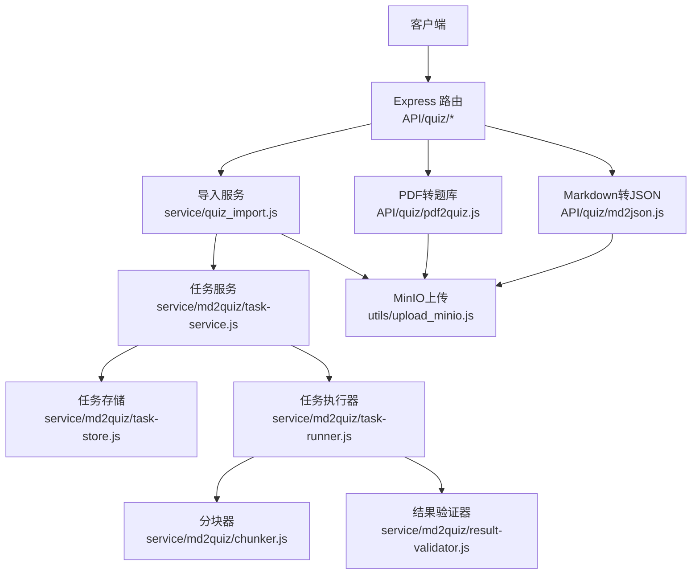
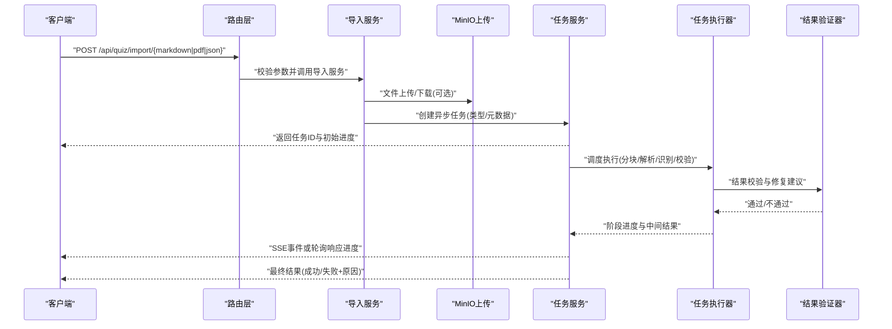
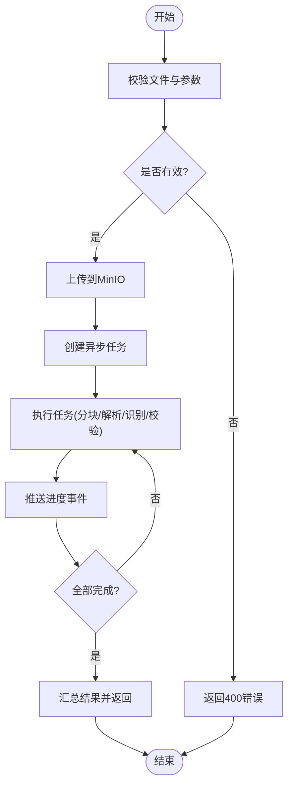
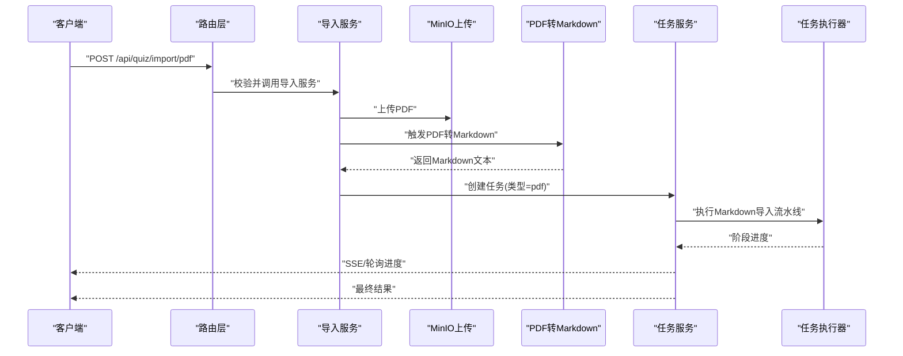
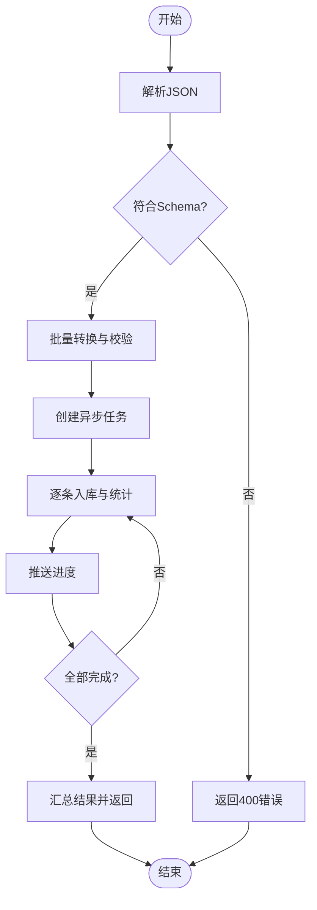
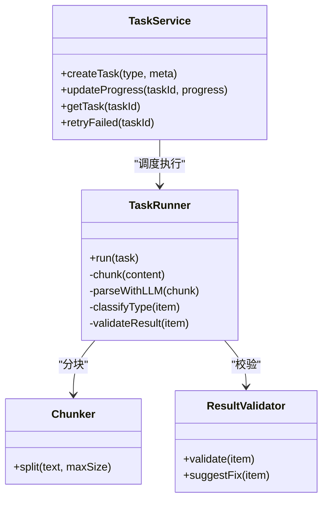
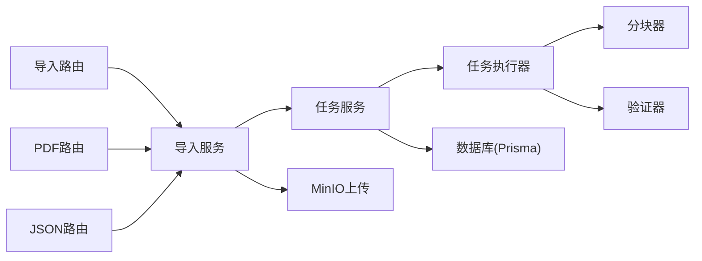

# 导入导出功能

<cite>
**本文引用的文件**   
- [API文档.md](file://API文档.md)
- [app.js](file://node-jinmao/app.js)
- [quiz/import.js](file://node-jinmao/API/quiz/import.js)
- [quiz/pdf2quiz.js](file://node-jinmao/API/quiz/pdf2quiz.js)
- [quiz/md2json.js](file://node-jinmao/API/quiz/md2json.js)
- [service/quiz_import.js](file://node-jinmao/service/quiz_import.js)
- [service/md2quiz/task-service.js](file://node-jinmao/service/md2quiz/task-service.js)
- [service/md2quiz/task-store.js](file://node-jinmao/service/md2quiz/task-store.js)
- [service/md2quiz/task-runner.js](file://node-jinmao/service/md2quiz/task-runner.js)
- [service/md2quiz/chunker.js](file://node-jinmao/service/md2quiz/chunker.js)
- [service/md2quiz/result-validator.js](file://node-jinmao/service/md2quiz/result-validator.js)
- [service/md2quiz/types.js](file://node-jinmao/service/md2quiz/types.js)
- [utils/upload_minio.js](file://node-jinmao/utils/upload_minio.js)
- [config/minio_config.json](file://node-jinmao/config/minio_config.json)
- [prisma/schema.prisma](file://node-jinmao/prisma/schema.prisma)
</cite>

## 目录
1. [简介](#简介)
2. [项目结构](#项目结构)
3. [核心组件](#核心组件)
4. [架构总览](#架构总览)
5. [详细组件分析](#详细组件分析)
6. [依赖关系分析](#依赖关系分析)
7. [性能考量](#性能考量)
8. [故障排除指南](#故障排除指南)
9. [结论](#结论)
10. [附录](#附录)

## 简介
本文件面向题库导入与导出能力，覆盖以下接口与流程：
- Markdown 文件导入（含分块、LLM 解析、题型自动识别与转换）
- PDF 文件转题库（PDF 转 Markdown，再进入题库生成流水线）
- JSON 格式导入（直接批量导入结构化题目）
- 异步任务管理与进度跟踪（SSE/轮询）
- 文件上传处理、大小限制、编码规范
- 导入结果验证、错误处理与重试机制
- 调用示例与常见问题排查

## 项目结构
后端采用 Node.js + Express 路由组织 API，业务逻辑集中在 service 层，持久化使用 Prisma。题库导入相关代码主要分布在：
- API 路由层：接收请求、参数校验、调度服务
- 服务层：文件处理、任务编排、状态管理、结果验证
- 工具层：MinIO 上传、数据库访问等
- 配置层：MinIO、LLM 客户端等

图表来源
- [app.js:1-200](file://node-jinmao/app.js#L1-L200)
- [quiz/import.js:1-200](file://node-jinmao/API/quiz/import.js#L1-L200)
- [quiz/pdf2quiz.js:1-200](file://node-jinmao/API/quiz/pdf2quiz.js#L1-L200)
- [quiz/md2json.js:1-200](file://node-jinmao/API/quiz/md2json.js#L1-L200)
- [service/quiz_import.js:1-200](file://node-jinmao/service/quiz_import.js#L1-L200)
- [service/md2quiz/task-service.js:1-200](file://node-jinmao/service/md2quiz/task-service.js#L1-L200)
- [service/md2quiz/task-store.js:1-200](file://node-jinmao/service/md2quiz/task-store.js#L1-L200)
- [service/md2quiz/task-runner.js:1-200](file://node-jinmao/service/md2quiz/task-runner.js#L1-L200)
- [service/md2quiz/chunker.js:1-200](file://node-jinmao/service/md2quiz/chunker.js#L1-L200)
- [service/md2quiz/result-validator.js:1-200](file://node-jinmao/service/md2quiz/result-validator.js#L1-L200)
- [utils/upload_minio.js:1-200](file://node-jinmao/utils/upload_minio.js#L1-L200)

章节来源
- [app.js:1-200](file://node-jinmao/app.js#L1-L200)

## 核心组件
- 路由层
  - Markdown 导入：POST /api/quiz/import/markdown
  - PDF 转题库：POST /api/quiz/import/pdf
  - JSON 导入：POST /api/quiz/import/json
- 服务层
  - 统一导入服务：负责文件落盘、任务创建、状态更新
  - 任务服务：任务生命周期管理、进度推送、失败重试
  - 任务执行器：分块、LLM 解析、题型识别、结果校验
- 工具层
  - MinIO 上传：大文件分片上传、临时文件清理
- 配置层
  - MinIO 连接、并发、超时等参数

章节来源
- [quiz/import.js:1-200](file://node-jinmao/API/quiz/import.js#L1-L200)
- [quiz/pdf2quiz.js:1-200](file://node-jinmao/API/quiz/pdf2quiz.js#L1-L200)
- [quiz/md2json.js:1-200](file://node-jinmao/API/quiz/md2json.js#L1-L200)
- [service/quiz_import.js:1-200](file://node-jinmao/service/quiz_import.js#L1-L200)
- [service/md2quiz/task-service.js:1-200](file://node-jinmao/service/md2quiz/task-service.js#L1-L200)
- [service/md2quiz/task-store.js:1-200](file://node-jinmao/service/md2quiz/task-store.js#L1-L200)
- [service/md2quiz/task-runner.js:1-200](file://node-jinmao/service/md2quiz/task-runner.js#L1-L200)
- [utils/upload_minio.js:1-200](file://node-jinmao/utils/upload_minio.js#L1-L200)

## 架构总览
整体流程遵循“请求入站 -> 路由校验 -> 服务编排 -> 异步任务 -> 进度推送 -> 结果返回”的模式。

图表来源
- [quiz/import.js:1-200](file://node-jinmao/API/quiz/import.js#L1-L200)
- [service/quiz_import.js:1-200](file://node-jinmao/service/quiz_import.js#L1-L200)
- [service/md2quiz/task-service.js:1-200](file://node-jinmao/service/md2quiz/task-service.js#L1-L200)
- [service/md2quiz/task-runner.js:1-200](file://node-jinmao/service/md2quiz/task-runner.js#L1-L200)
- [service/md2quiz/result-validator.js:1-200](file://node-jinmao/service/md2quiz/result-validator.js#L1-L200)
- [utils/upload_minio.js:1-200](file://node-jinmao/utils/upload_minio.js#L1-L200)

## 详细组件分析

### Markdown 文件导入接口
- 端点：POST /api/quiz/import/markdown
- 输入
  - 表单字段：file（Markdown 文件）、courseId（课程ID，可选）、chapterId（章节ID，可选）
  - 文件大小限制：建议不超过 10MB（可通过配置调整）
  - 编码：UTF-8
- 处理流程
  - 文件校验（扩展名、大小、内容非空）
  - 上传至 MinIO 获取临时链接
  - 创建异步任务（记录来源、目标、用户上下文）
  - 任务执行：分块 -> LLM 解析 -> 题型识别 -> 结果校验 -> 入库
  - 进度推送：SSE 事件或轮询接口
- 输出
  - 立即返回：{ taskId, status, progress }
  - 完成事件：{ taskId, status: "completed", result: { successCount, failCount, errors[] } }
- 错误码
  - 400：参数缺失/格式错误
  - 413：文件过大
  - 500：内部错误（上传失败、LLM 调用异常、解析失败）

图表来源
- [quiz/import.js:1-200](file://node-jinmao/API/quiz/import.js#L1-L200)
- [service/quiz_import.js:1-200](file://node-jinmao/service/quiz_import.js#L1-L200)
- [service/md2quiz/chunker.js:1-200](file://node-jinmao/service/md2quiz/chunker.js#L1-L200)
- [service/md2quiz/task-runner.js:1-200](file://node-jinmao/service/md2quiz/task-runner.js#L1-L200)
- [service/md2quiz/result-validator.js:1-200](file://node-jinmao/service/md2quiz/result-validator.js#L1-L200)

章节来源
- [quiz/import.js:1-200](file://node-jinmao/API/quiz/import.js#L1-L200)
- [service/quiz_import.js:1-200](file://node-jinmao/service/quiz_import.js#L1-L200)

### PDF 文件转换接口
- 端点：POST /api/quiz/import/pdf
- 输入
  - 表单字段：file（PDF 文件）、courseId（可选）、chapterId（可选）
  - 文件大小限制：建议不超过 20MB（可通过配置调整）
  - 编码：二进制流
- 处理流程
  - 文件校验与上传
  - 调用 PDF 转 Markdown（外部工具或库）
  - 将生成的 Markdown 接入 Markdown 导入流水线
  - 任务进度与结果同 Markdown 导入
- 输出
  - 立即返回：{ taskId, status, progress }
  - 完成事件：{ taskId, status: "completed", result: { ... } }
- 错误码
  - 400：参数缺失/格式错误
  - 413：文件过大
  - 500：PDF 转换失败、后续解析失败

图表来源
- [quiz/pdf2quiz.js:1-200](file://node-jinmao/API/quiz/pdf2quiz.js#L1-L200)
- [service/quiz_import.js:1-200](file://node-jinmao/service/quiz_import.js#L1-L200)
- [utils/upload_minio.js:1-200](file://node-jinmao/utils/upload_minio.js#L1-L200)

章节来源
- [quiz/pdf2quiz.js:1-200](file://node-jinmao/API/quiz/pdf2quiz.js#L1-L200)

### JSON 格式导入接口
- 端点：POST /api/quiz/import/json
- 输入
  - 表单字段：file（JSON 文件，数组或对象包裹）
  - 数据结构：支持单题对象或题目数组；字段需包含题干、选项（选择题）、答案、题型标识等
  - 文件大小限制：建议不超过 5MB
  - 编码：UTF-8
- 处理流程
  - 校验 JSON Schema（必填字段、类型、枚举值）
  - 批量转换为内部题目模型
  - 创建异步任务（类型=json）
  - 任务执行：逐条校验、去重、入库
  - 进度推送与结果汇总
- 输出
  - 立即返回：{ taskId, status, progress }
  - 完成事件：{ taskId, status: "completed", result: { successCount, failCount, errors[] } }
- 错误码
  - 400：JSON 结构不符合要求
  - 413：文件过大
  - 500：内部错误（解析失败、入库失败）

图表来源
- [quiz/md2json.js:1-200](file://node-jinmao/API/quiz/md2json.js#L1-L200)
- [service/quiz_import.js:1-200](file://node-jinmao/service/quiz_import.js#L1-L200)

章节来源
- [quiz/md2json.js:1-200](file://node-jinmao/API/quiz/md2json.js#L1-L200)

### 题型自动识别与转换逻辑
- 识别策略
  - 基于题干与选项特征判断题型（单选、多选、判断、填空、简答）
  - 结合提示词模板与 LLM 分类置信度阈值
- 转换规则
  - 单选题：题干 + 唯一正确答案
  - 多选题：题干 + 多个正确选项
  - 判断题：题干 + 布尔答案
  - 填空题：题干中占位符与答案映射
  - 简答题：题干 + 参考答案要点
- 质量保障
  - 结果验证器对缺失字段、选项数量、答案一致性进行校验
  - 失败项提供修复建议与重试入口

图表来源
- [service/md2quiz/task-service.js:1-200](file://node-jinmao/service/md2quiz/task-service.js#L1-L200)
- [service/md2quiz/task-runner.js:1-200](file://node-jinmao/service/md2quiz/task-runner.js#L1-L200)
- [service/md2quiz/chunker.js:1-200](file://node-jinmao/service/md2quiz/chunker.js#L1-L200)
- [service/md2quiz/result-validator.js:1-200](file://node-jinmao/service/md2quiz/result-validator.js#L1-L200)

章节来源
- [service/md2quiz/types.js:1-200](file://node-jinmao/service/md2quiz/types.js#L1-L200)
- [service/md2quiz/result-validator.js:1-200](file://node-jinmao/service/md2quiz/result-validator.js#L1-L200)

### 文件上传处理与存储
- 上传方式
  - 表单 multipart/form-data
  - 支持断点续传（可选）
- 存储位置
  - MinIO 桶：按用户/课程/时间维度组织路径
- 安全与清理
  - 临时文件过期清理
  - 访问权限控制

章节来源
- [utils/upload_minio.js:1-200](file://node-jinmao/utils/upload_minio.js#L1-L200)
- [config/minio_config.json:1-200](file://node-jinmao/config/minio_config.json#L1-L200)

### 异步任务管理与进度跟踪
- 任务状态
  - pending、running、completed、failed
- 进度字段
  - total、processed、success、fail、errors
- 推送机制
  - SSE 事件流或轮询接口
- 重试机制
  - 失败任务可手动重试，支持指数退避

章节来源
- [service/md2quiz/task-service.js:1-200](file://node-jinmao/service/md2quiz/task-service.js#L1-L200)
- [service/md2quiz/task-store.js:1-200](file://node-jinmao/service/md2quiz/task-store.js#L1-L200)

## 依赖关系分析
- 路由依赖服务层，服务层依赖任务服务与工具层
- 任务执行器依赖分块器与验证器
- MinIO 用于文件存储，Prisma 用于数据持久化

图表来源
- [app.js:1-200](file://node-jinmao/app.js#L1-L200)
- [quiz/import.js:1-200](file://node-jinmao/API/quiz/import.js#L1-L200)
- [quiz/pdf2quiz.js:1-200](file://node-jinmao/API/quiz/pdf2quiz.js#L1-L200)
- [quiz/md2json.js:1-200](file://node-jinmao/API/quiz/md2json.js#L1-L200)
- [service/quiz_import.js:1-200](file://node-jinmao/service/quiz_import.js#L1-L200)
- [service/md2quiz/task-service.js:1-200](file://node-jinmao/service/md2quiz/task-service.js#L1-L200)
- [service/md2quiz/task-runner.js:1-200](file://node-jinmao/service/md2quiz/task-runner.js#L1-L200)
- [service/md2quiz/chunker.js:1-200](file://node-jinmao/service/md2quiz/chunker.js#L1-L200)
- [service/md2quiz/result-validator.js:1-200](file://node-jinmao/service/md2quiz/result-validator.js#L1-L200)
- [utils/upload_minio.js:1-200](file://node-jinmao/utils/upload_minio.js#L1-L200)
- [prisma/schema.prisma:1-200](file://node-jinmao/prisma/schema.prisma#L1-L200)

章节来源
- [app.js:1-200](file://node-jinmao/app.js#L1-L200)

## 性能考量
- 分块策略：合理设置分块大小，避免单次请求过大导致内存峰值
- 并发控制：限制 LLM 调用并发，避免限流与超时
- 缓存与去重：对重复题目进行哈希去重，减少冗余入库
- 资源清理：及时释放临时文件与连接
- 监控与告警：关键指标（QPS、延迟、错误率）采集与告警

[本节为通用指导，无需引用具体文件]

## 故障排除指南
- 常见错误
  - 400：参数缺失、JSON 结构不符、题型字段缺失
  - 413：文件超过限制
  - 500：MinIO 上传失败、LLM 调用异常、解析失败、入库失败
- 排查步骤
  - 检查请求头与表单字段
  - 查看任务日志与进度事件
  - 确认 MinIO 配置与网络连通性
  - 验证 LLM 密钥与配额
- 重试策略
  - 针对网络抖动与限流，采用指数退避重试
  - 失败条目单独重试，避免整批失败

章节来源
- [service/quiz_import.js:1-200](file://node-jinmao/service/quiz_import.js#L1-L200)
- [service/md2quiz/task-service.js:1-200](file://node-jinmao/service/md2quiz/task-service.js#L1-L200)
- [utils/upload_minio.js:1-200](file://node-jinmao/utils/upload_minio.js#L1-L200)

## 结论
本导入导出功能以模块化设计实现 Markdown/PDF/JSON 多源题库导入，结合异步任务与进度跟踪，提供稳定可扩展的导入流水线。通过严格的校验与验证机制，确保题目质量与系统稳定性。建议在生产环境完善监控、限流与熔断策略，以提升鲁棒性与用户体验。

[本节为总结，无需引用具体文件]

## 附录
- 文件格式要求
  - Markdown：UTF-8，推荐标准标题与列表结构
  - PDF：清晰文本型 PDF，避免扫描图片
  - JSON：UTF-8，严格 Schema 校验
- 大小限制
  - Markdown：≤10MB
  - PDF：≤20MB
  - JSON：≤5MB
- 编码规范
  - 所有文本文件使用 UTF-8
  - JSON 键名使用小写驼峰或下划线
- 调用示例
  - cURL 示例（Markdown）
    - curl -X POST -F "file=@test.md" -F "courseId=123" http://localhost:3000/api/quiz/import/markdown
  - cURL 示例（PDF）
    - curl -X POST -F "file=@test.pdf" -F "courseId=123" http://localhost:3000/api/quiz/import/pdf
  - cURL 示例（JSON）
    - curl -X POST -F "file=@questions.json" http://localhost:3000/api/quiz/import/json
- 进度查询
  - GET /api/quiz/tasks/:taskId
  - SSE 订阅：/api/quiz/tasks/:taskId/stream

[本节为补充信息，无需引用具体文件]