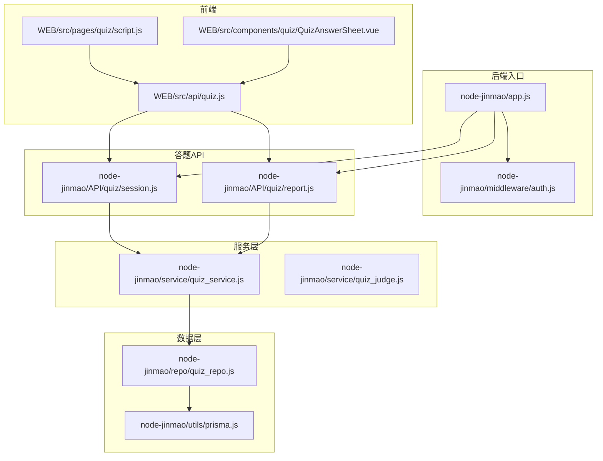
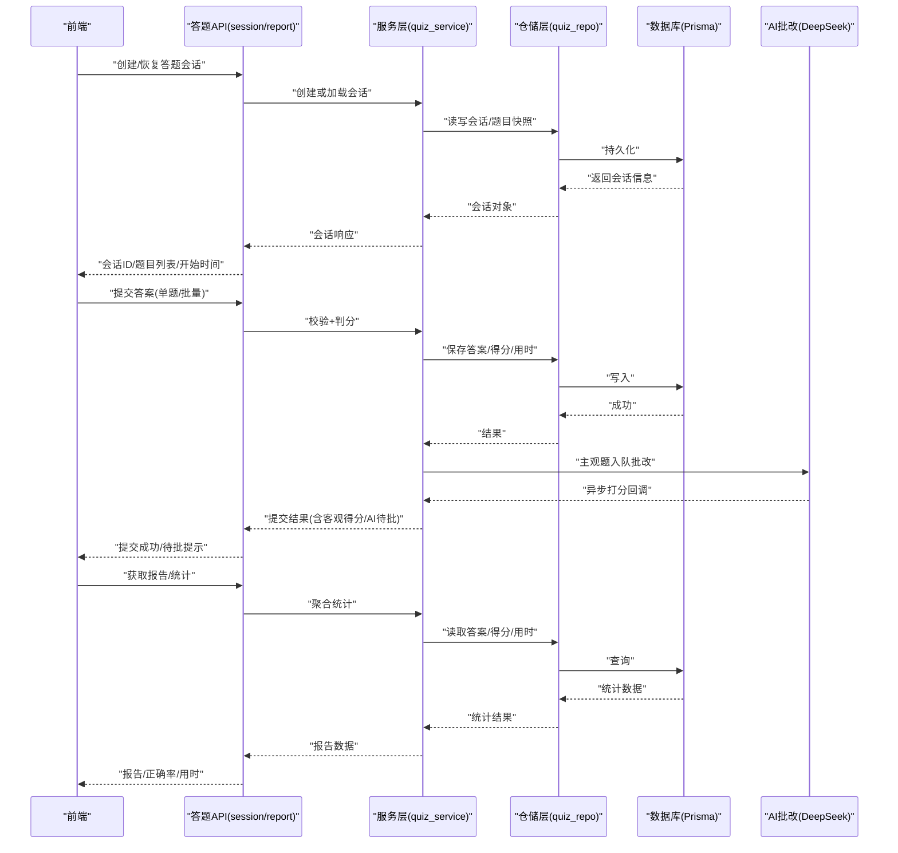
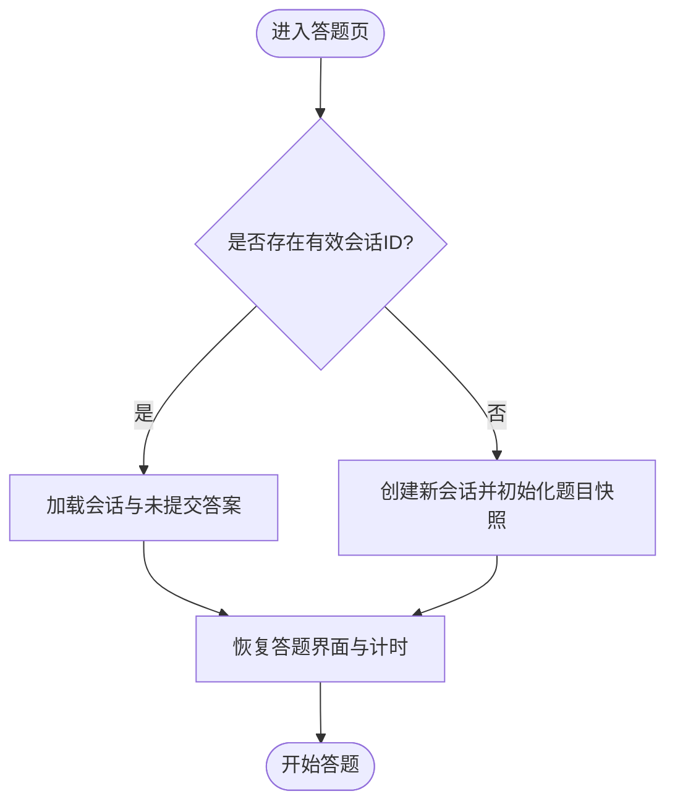
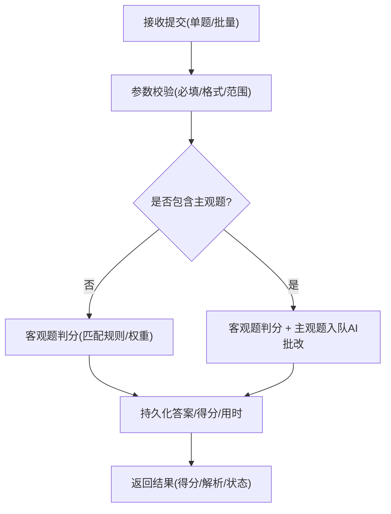
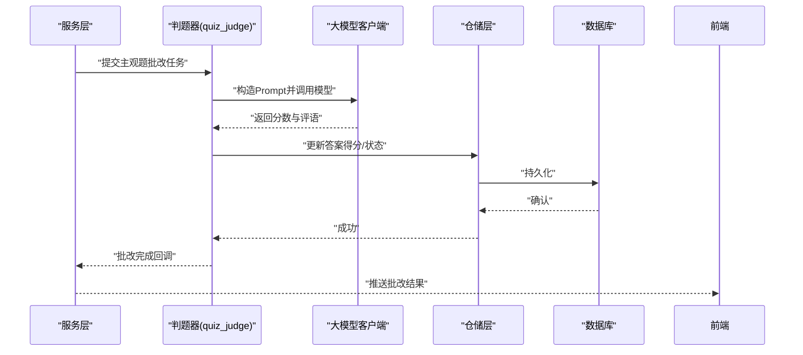
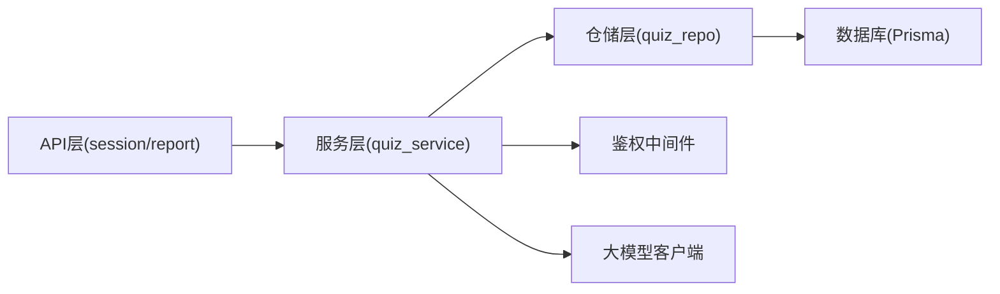

# 答题管理

<cite>
**本文引用的文件**   
- [API文档.md](file://API文档.md)
- [数据库结构.md](file://数据库结构.md)
- [node-jinmao/API/quiz/session.js](file://node-jinmao/API/quiz/session.js)
- [node-jinmao/API/quiz/report.js](file://node-jinmao/API/quiz/report.js)
- [node-jinmao/service/quiz_service.js](file://node-jinmao/service/quiz_service.js)
- [node-jinmao/service/quiz_judge.js](file://node-jinmao/service/quiz_judge.js)
- [node-jinmao/repo/quiz_repo.js](file://node-jinmao/repo/quiz_repo.js)
- [node-jinmao/utils/prisma.js](file://node-jinmao/utils/prisma.js)
- [node-jinmao/middleware/auth.js](file://node-jinmao/middleware/auth.js)
- [node-jinmao/app.js](file://node-jinmao/app.js)
- [WEB/src/api/quiz.js](file://WEB/src/api/quiz.js)
- [WEB/src/pages/quiz/script.js](file://WEB/src/pages/quiz/script.js)
- [WEB/src/components/quiz/QuizAnswerSheet.vue](file://WEB/src/components/quiz/QuizAnswerSheet.vue)
- [node-jinmao/config/deepseek_config.json](file://node-jinmao/config/deepseek_config.json)
</cite>

## 目录
1. [简介](#简介)
2. [项目结构](#项目结构)
3. [核心组件](#核心组件)
4. [架构总览](#架构总览)
5. [详细组件分析](#详细组件分析)
6. [依赖分析](#依赖分析)
7. [性能考虑](#性能考虑)
8. [故障排查指南](#故障排查指南)
9. [结论](#结论)
10. [附录](#附录)

## 简介
本文件面向“答题管理”相关接口与流程，覆盖以下能力：
- 答题记录提交、答案验证、分数计算
- 多种题型的评分规则（客观题自动判分、主观题AI批改）
- 答题状态管理、时间记录、正确率统计
- 数据结构与校验规则
- 批量答题、断点续答、答案缓存机制
- 完整答题流程与错误处理示例

## 项目结构
后端采用 Node.js + Prisma 的模块化设计，答题相关能力集中在 API 层、服务层与仓储层；前端通过 API 模块调用并维护答题会话与缓存。

图表来源
- [node-jinmao/app.js](file://node-jinmao/app.js)
- [node-jinmao/middleware/auth.js](file://node-jinmao/middleware/auth.js)
- [node-jinmao/API/quiz/session.js](file://node-jinmao/API/quiz/session.js)
- [node-jinmao/API/quiz/report.js](file://node-jinmao/API/quiz/report.js)
- [node-jinmao/service/quiz_service.js](file://node-jinmao/service/quiz_service.js)
- [node-jinmao/repo/quiz_repo.js](file://node-jinmao/repo/quiz_repo.js)
- [node-jinmao/utils/prisma.js](file://node-jinmao/utils/prisma.js)
- [WEB/src/api/quiz.js](file://WEB/src/api/quiz.js)
- [WEB/src/pages/quiz/script.js](file://WEB/src/pages/quiz/script.js)
- [WEB/src/components/quiz/QuizAnswerSheet.vue](file://WEB/src/components/quiz/QuizAnswerSheet.vue)

章节来源
- [API文档.md](file://API文档.md)
- [数据库结构.md](file://数据库结构.md)

## 核心组件
- 会话与会话持久化：创建/恢复答题会话、记录开始时间、断点续答
- 答案提交与判分：客观题即时判分，主观题进入AI批改队列
- 报告与统计：生成答题报告、正确率统计、用时统计
- 数据访问：Prisma 模型与仓库封装，保证事务与一致性
- 鉴权中间件：统一身份校验与权限控制

章节来源
- [node-jinmao/API/quiz/session.js](file://node-jinmao/API/quiz/session.js)
- [node-jinmao/API/quiz/report.js](file://node-jinmao/API/quiz/report.js)
- [node-jinmao/service/quiz_service.js](file://node-jinmao/service/quiz_service.js)
- [node-jinmao/repo/quiz_repo.js](file://node-jinmao/repo/quiz_repo.js)
- [node-jinmao/utils/prisma.js](file://node-jinmao/utils/prisma.js)
- [node-jinmao/middleware/auth.js](file://node-jinmao/middleware/auth.js)

## 架构总览
答题管理的端到端流程如下：
- 前端发起创建/恢复会话、提交答案、查询报告等请求
- 后端路由经鉴权后进入对应控制器
- 控制器调用服务层完成业务编排（判分、统计、持久化）
- 服务层通过仓储层访问数据库
- 主观题触发AI批改流程，结果异步回写并更新报告

图表来源
- [node-jinmao/API/quiz/session.js](file://node-jinmao/API/quiz/session.js)
- [node-jinmao/API/quiz/report.js](file://node-jinmao/API/quiz/report.js)
- [node-jinmao/service/quiz_service.js](file://node-jinmao/service/quiz_service.js)
- [node-jinmao/repo/quiz_repo.js](file://node-jinmao/repo/quiz_repo.js)
- [node-jinmao/utils/prisma.js](file://node-jinmao/utils/prisma.js)
- [node-jinmao/config/deepseek_config.json](file://node-jinmao/config/deepseek_config.json)

## 详细组件分析

### 会话管理与断点续答
- 功能要点
  - 创建会话：绑定用户、试卷/题集、开始时间、初始状态
  - 恢复会话：根据会话ID拉取未提交答案、已得分项、剩余时间
  - 心跳/保活：可选的心跳更新最后作答时间，防止会话过期
- 关键流程
  - 前端携带会话ID或空值调用创建/恢复接口
  - 服务层校验权限与有效性，返回会话上下文
  - 仓储层读写会话表与答案快照

图表来源
- [node-jinmao/API/quiz/session.js](file://node-jinmao/API/quiz/session.js)
- [node-jinmao/service/quiz_service.js](file://node-jinmao/service/quiz_service.js)
- [node-jinmao/repo/quiz_repo.js](file://node-jinmao/repo/quiz_repo.js)

章节来源
- [node-jinmao/API/quiz/session.js](file://node-jinmao/API/quiz/session.js)
- [node-jinmao/service/quiz_service.js](file://node-jinmao/service/quiz_service.js)
- [node-jinmao/repo/quiz_repo.js](file://node-jinmao/repo/quiz_repo.js)

### 答案提交与判分
- 题型与评分规则
  - 单选题/多选题：按标准答案精确匹配或容错策略计分
  - 判断题：布尔值比对
  - 填空题：关键词匹配或模糊匹配（可配置阈值）
  - 主观题：AI批改，基于评分细则与参考答案生成分数与评语
- 提交模式
  - 单题提交：实时反馈得分与解析
  - 批量提交：一次性提交多题答案，服务端批量判分并汇总
- 时间记录
  - 每题记录作答耗时，支持累计用时统计
- 状态管理
  - 答案状态：未提交/已提交/已判分/AI待批
  - 会话状态：进行中/已提交/已归档

图表来源
- [node-jinmao/service/quiz_service.js](file://node-jinmao/service/quiz_service.js)
- [node-jinmao/service/quiz_judge.js](file://node-jinmao/service/quiz_judge.js)
- [node-jinmao/repo/quiz_repo.js](file://node-jinmao/repo/quiz_repo.js)

章节来源
- [node-jinmao/service/quiz_service.js](file://node-jinmao/service/quiz_service.js)
- [node-jinmao/service/quiz_judge.js](file://node-jinmao/service/quiz_judge.js)
- [node-jinmao/repo/quiz_repo.js](file://node-jinmao/repo/quiz_repo.js)

### 主观题AI批改流程
- 触发条件：答案包含主观题且尚未完成AI批改
- 处理步骤
  - 组装题目上下文、参考答案、评分细则
  - 调用大模型接口进行打分与评语生成
  - 落库并更新答案状态为“已批改”
  - 向前端推送批改结果（可选事件/轮询）
- 配置项
  - 模型选择、温度、最大令牌数、超时重试策略

图表来源
- [node-jinmao/service/quiz_judge.js](file://node-jinmao/service/quiz_judge.js)
- [node-jinmao/config/deepseek_config.json](file://node-jinmao/config/deepseek_config.json)
- [node-jinmao/repo/quiz_repo.js](file://node-jinmao/repo/quiz_repo.js)

章节来源
- [node-jinmao/service/quiz_judge.js](file://node-jinmao/service/quiz_judge.js)
- [node-jinmao/config/deepseek_config.json](file://node-jinmao/config/deepseek_config.json)
- [node-jinmao/repo/quiz_repo.js](file://node-jinmao/repo/quiz_repo.js)

### 报告与统计
- 指标维度
  - 总分、各题型得分、正确率、平均用时、最长/最短用时
  - 错题清单、知识点薄弱项（可扩展）
- 数据来源
  - 答案表、得分表、用时表、会话元数据
- 输出形式
  - 结构化报告JSON，便于前端渲染图表与详情

章节来源
- [node-jinmao/API/quiz/report.js](file://node-jinmao/API/quiz/report.js)
- [node-jinmao/service/quiz_service.js](file://node-jinmao/service/quiz_service.js)
- [node-jinmao/repo/quiz_repo.js](file://node-jinmao/repo/quiz_repo.js)

### 数据结构与校验规则
- 会话
  - 字段建议：会话ID、用户ID、试卷/题集ID、开始时间、结束时间、状态、备注
- 题目快照
  - 字段建议：题目ID、题干、选项、标准答案、分值、题型、难度
- 答案
  - 字段建议：会话ID、题目ID、用户答案、标准答案、得分、用时、状态、AI评语
- 校验规则
  - 必填校验、类型校验、取值范围、长度限制、格式正则
  - 业务校验：不可重复提交、不可修改已提交答案（可配置）

章节来源
- [数据库结构.md](file://数据库结构.md)
- [node-jinmao/repo/quiz_repo.js](file://node-jinmao/repo/quiz_repo.js)

### 批量答题与答案缓存
- 批量提交
  - 前端将多题答案打包提交，后端批量校验与判分，减少网络往返
- 答案缓存
  - 本地缓存未提交答案，支持刷新恢复
  - 服务端缓存临时答案，避免频繁落库，提交时再持久化
- 断点续答
  - 会话级持久化，支持跨设备/浏览器恢复

章节来源
- [WEB/src/api/quiz.js](file://WEB/src/api/quiz.js)
- [WEB/src/pages/quiz/script.js](file://WEB/src/pages/quiz/script.js)
- [WEB/src/components/quiz/QuizAnswerSheet.vue](file://WEB/src/components/quiz/QuizAnswerSheet.vue)
- [node-jinmao/API/quiz/session.js](file://node-jinmao/API/quiz/session.js)

## 依赖分析
- 模块耦合
  - API 层仅负责参数校验与调用服务层，保持低耦合
  - 服务层编排业务逻辑，依赖仓储层与外部AI服务
  - 仓储层封装Prisma，屏蔽数据库细节
- 外部依赖
  - 鉴权中间件：统一认证
  - 大模型客户端：主观题AI批改
  - 存储：MinIO（可选，用于附件/解析材料）

图表来源
- [node-jinmao/app.js](file://node-jinmao/app.js)
- [node-jinmao/middleware/auth.js](file://node-jinmao/middleware/auth.js)
- [node-jinmao/service/quiz_service.js](file://node-jinmao/service/quiz_service.js)
- [node-jinmao/repo/quiz_repo.js](file://node-jinmao/repo/quiz_repo.js)
- [node-jinmao/utils/prisma.js](file://node-jinmao/utils/prisma.js)

章节来源
- [node-jinmao/app.js](file://node-jinmao/app.js)
- [node-jinmao/middleware/auth.js](file://node-jinmao/middleware/auth.js)
- [node-jinmao/service/quiz_service.js](file://node-jinmao/service/quiz_service.js)
- [node-jinmao/repo/quiz_repo.js](file://node-jinmao/repo/quiz_repo.js)
- [node-jinmao/utils/prisma.js](file://node-jinmao/utils/prisma.js)

## 性能考虑
- 批量提交优先：减少HTTP往返，降低延迟
- 懒持久化：答案先缓存，提交时批量写入，降低写放大
- 索引优化：会话ID、用户ID、题目ID建立索引，提升查询效率
- 异步批改：主观题不入同步路径，避免阻塞
- 连接池与超时：合理设置数据库连接池与大模型调用超时

## 故障排查指南
- 常见问题
  - 会话失效：检查会话有效期与心跳更新
  - 答案未提交：检查本地缓存与服务端缓存一致性
  - 判分异常：核对标准答案与匹配规则
  - AI批改失败：检查模型配置、网络与重试策略
- 定位方法
  - 查看日志：请求链路、服务调用、数据库操作
  - 检查中间件：鉴权失败原因
  - 回放数据：对比输入输出与期望差异

章节来源
- [node-jinmao/middleware/auth.js](file://node-jinmao/middleware/auth.js)
- [node-jinmao/service/quiz_service.js](file://node-jinmao/service/quiz_service.js)
- [node-jinmao/service/quiz_judge.js](file://node-jinmao/service/quiz_judge.js)

## 结论
本方案围绕“会话—提交—判分—报告”的主线，结合断点续答、批量提交与AI批改，形成完整的答题管理能力。通过分层架构与仓储封装，确保扩展性与可维护性；通过缓存与异步策略，保障性能与用户体验。

## 附录
- 接口参考
  - 会话管理：创建/恢复/心跳
  - 答案提交：单题/批量
  - 报告查询：统计/详情
- 前端集成
  - API模块封装、状态管理、本地缓存策略
  - 组件交互：答题卡、题型渲染、提交按钮状态

章节来源
- [API文档.md](file://API文档.md)
- [WEB/src/api/quiz.js](file://WEB/src/api/quiz.js)
- [WEB/src/pages/quiz/script.js](file://WEB/src/pages/quiz/script.js)
- [WEB/src/components/quiz/QuizAnswerSheet.vue](file://WEB/src/components/quiz/QuizAnswerSheet.vue)