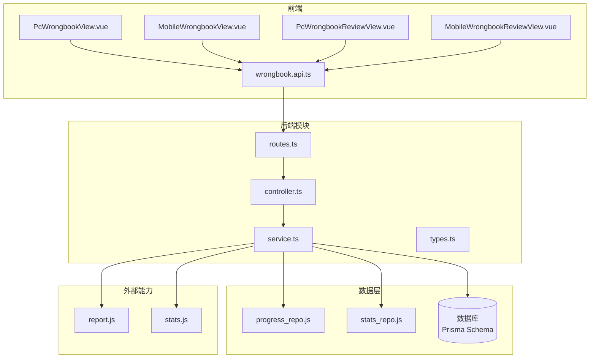
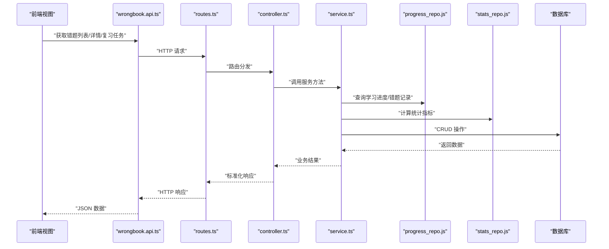
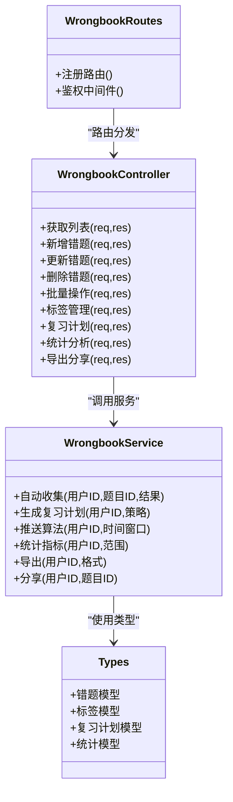
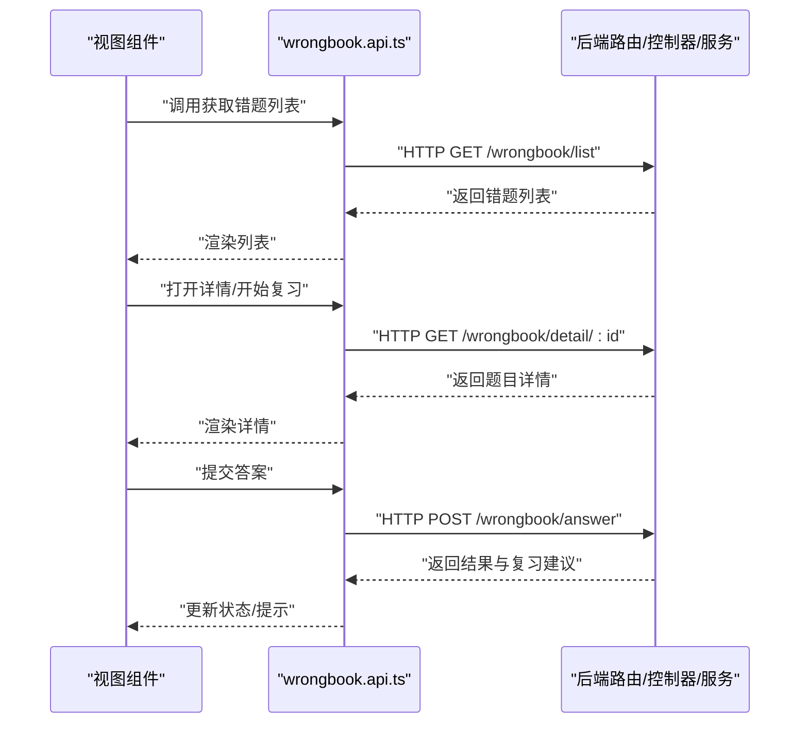
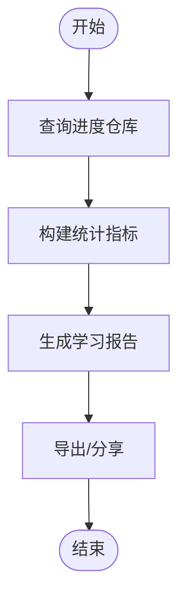
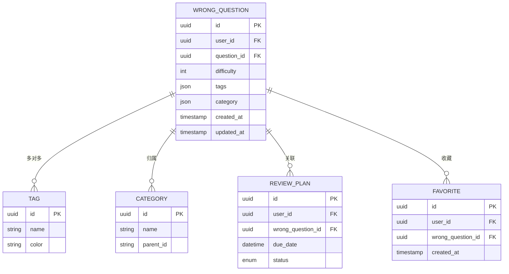
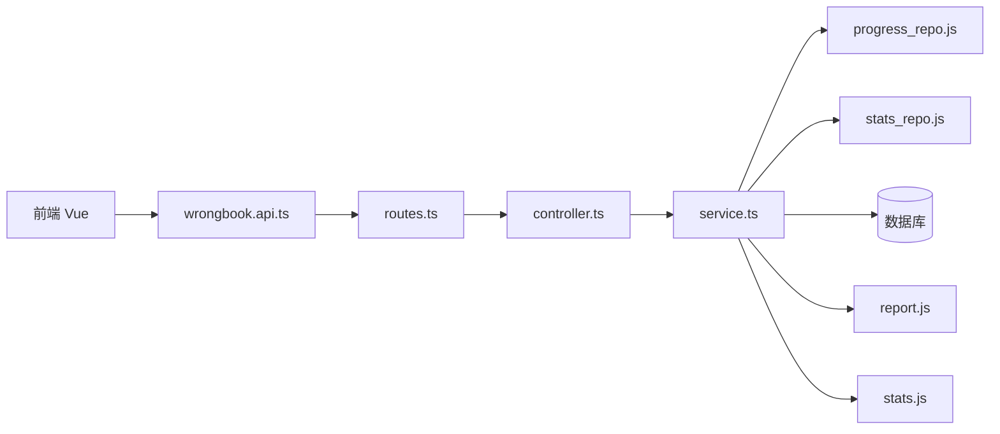

# 错题本功能

<cite>
**本文引用的文件**   
- [wrongbook.js](file://node-jinmao/API/quiz/wrongbook.js)
- [controller.ts](file://test/金毛刷题/backend/src/modules/wrongbook/controller.ts)
- [service.ts](file://test/金毛刷题/backend/src/modules/wrongbook/service.ts)
- [routes.ts](file://test/金毛刷题/backend/src/modules/wrongbook/routes.ts)
- [types.ts](file://test/金毛刷题/backend/src/modules/wrongbook/types.ts)
- [wrongbook.api.ts](file://test/金毛刷题/frontend/src/modules/wrongbook/api/wrongbook.api.ts)
- [PcWrongbookView.vue](file://test/金毛刷题/frontend/src/modules/wrongbook/views/PcWrongbookView.vue)
- [MobileWrongbookView.vue](file://test/金毛刷题/frontend/src/modules/wrongbook/views/MobileWrongbookView.vue)
- [PcWrongbookReviewView.vue](file://test/金毛刷题/frontend/src/modules/wrongbook/views/PcWrongbookReviewView.vue)
- [MobileWrongbookReviewView.vue](file://test/金毛刷题/frontend/src/modules/wrongbook/views/MobileWrongbookReviewView.vue)
- [schema.prisma](file://node-jinmao/prisma/schema.prisma)
- [progress_repo.js](file://node-jinmao/utils/repo/progress_repo.js)
- [stats_repo.js](file://node-jinmao/utils/repo/stats_repo.js)
- [report.js](file://node-jinmao/API/quiz/report.js)
- [stats.js](file://node-jinmao/API/stats.js)
</cite>

## 目录
1. [简介](#简介)
2. [项目结构](#项目结构)
3. [核心组件](#核心组件)
4. [架构总览](#架构总览)
5. [详细组件分析](#详细组件分析)
6. [依赖分析](#依赖分析)
7. [性能考虑](#性能考虑)
8. [故障排查指南](#故障排查指南)
9. [结论](#结论)
10. [附录](#附录)

## 简介
本文件为“错题本”功能的完整接口与实现文档，覆盖以下能力：
- 自动收集：答题过程中错误题目自动入库
- 手动添加：用户主动将题目加入错题本
- 批量管理：批量标记、删除、导出等操作
- 分类与标签：按科目/章节/题型等维度组织，支持自定义标签
- 难度标记：对题目进行难度分级
- 复习计划与推送算法：基于遗忘曲线与掌握度生成复习任务
- 学习提醒机制：定时或事件触发提醒
- 统计与分析：正确率追踪、进步评估、趋势分析
- 导出/分享/收藏：支持多种格式导出、分享链接、收藏重点题

## 项目结构
错题本功能涉及前端（Vue 页面与 API 封装）、后端（Node.js 控制器/服务/路由）以及数据库模型与仓库层。整体分层清晰，职责单一，便于扩展与维护。

**图表来源** 
- [PcWrongbookView.vue](file://test/金毛刷题/frontend/src/modules/wrongbook/views/PcWrongbookView.vue)
- [MobileWrongbookView.vue](file://test/金毛刷题/frontend/src/modules/wrongbook/views/MobileWrongbookView.vue)
- [PcWrongbookReviewView.vue](file://test/金毛刷题/frontend/src/modules/wrongbook/views/PcWrongbookReviewView.vue)
- [MobileWrongbookReviewView.vue](file://test/金毛刷题/frontend/src/modules/wrongbook/views/MobileWrongbookReviewView.vue)
- [wrongbook.api.ts](file://test/金毛刷题/frontend/src/modules/wrongbook/api/wrongbook.api.ts)
- [routes.ts](file://test/金毛刷题/backend/src/modules/wrongbook/routes.ts)
- [controller.ts](file://test/金毛刷题/backend/src/modules/wrongbook/controller.ts)
- [service.ts](file://test/金毛刷题/backend/src/modules/wrongbook/service.ts)
- [progress_repo.js](file://node-jinmao/utils/repo/progress_repo.js)
- [stats_repo.js](file://node-jinmao/utils/repo/stats_repo.js)
- [schema.prisma](file://node-jinmao/prisma/schema.prisma)
- [report.js](file://node-jinmao/API/quiz/report.js)
- [stats.js](file://node-jinmao/API/stats.js)

**章节来源**
- [routes.ts](file://test/金毛刷题/backend/src/modules/wrongbook/routes.ts)
- [controller.ts](file://test/金毛刷题/backend/src/modules/wrongbook/controller.ts)
- [service.ts](file://test/金毛刷题/backend/src/modules/wrongbook/service.ts)
- [types.ts](file://test/金毛刷题/backend/src/modules/wrongbook/types.ts)
- [wrongbook.api.ts](file://test/金毛刷题/frontend/src/modules/wrongbook/api/wrongbook.api.ts)
- [schema.prisma](file://node-jinmao/prisma/schema.prisma)

## 核心组件
- 路由层：定义 RESTful 接口路径与权限校验
- 控制器层：参数校验、请求解析、响应格式化
- 服务层：业务编排（自动收集、复习计划、推送算法、统计分析）
- 类型定义：统一前后端数据结构
- 前端 API 封装：HTTP 调用、错误处理、缓存策略
- 视图组件：PC/移动端列表、详情、复习流程
- 数据仓库：进度与统计查询封装
- 数据库模型：错题、标签、分类、复习计划、收藏等实体

**章节来源**
- [routes.ts](file://test/金毛刷题/backend/src/modules/wrongbook/routes.ts)
- [controller.ts](file://test/金毛刷题/backend/src/modules/wrongbook/controller.ts)
- [service.ts](file://test/金毛刷题/backend/src/modules/wrongbook/service.ts)
- [types.ts](file://test/金毛刷题/backend/src/modules/wrongbook/types.ts)
- [wrongbook.api.ts](file://test/金毛刷题/frontend/src/modules/wrongbook/api/wrongbook.api.ts)

## 架构总览
错题本采用典型的前后端分离架构，前端通过 API 模块发起请求，后端由路由分发到控制器与服务层，服务层协调仓库与数据库完成数据读写，并调用统计与报告服务提供分析与复习建议。

**图表来源** 
- [wrongbook.api.ts](file://test/金毛刷题/frontend/src/modules/wrongbook/api/wrongbook.api.ts)
- [routes.ts](file://test/金毛刷题/backend/src/modules/wrongbook/routes.ts)
- [controller.ts](file://test/金毛刷题/backend/src/modules/wrongbook/controller.ts)
- [service.ts](file://test/金毛刷题/backend/src/modules/wrongbook/service.ts)
- [progress_repo.js](file://node-jinmao/utils/repo/progress_repo.js)
- [stats_repo.js](file://node-jinmao/utils/repo/stats_repo.js)
- [schema.prisma](file://node-jinmao/prisma/schema.prisma)

## 详细组件分析

### 错题本后端模块（路由/控制器/服务/类型）
- 路由：集中定义错题相关接口，如列表、新增、更新、删除、批量操作、标签管理、复习计划、统计导出等
- 控制器：负责入参校验、鉴权、异常捕获与响应包装
- 服务：实现核心业务逻辑，包括自动收集、复习计划生成、推送算法、统计分析、导出分享
- 类型：统一前后端数据结构，确保契约一致

**图表来源** 
- [routes.ts](file://test/金毛刷题/backend/src/modules/wrongbook/routes.ts)
- [controller.ts](file://test/金毛刷题/backend/src/modules/wrongbook/controller.ts)
- [service.ts](file://test/金毛刷题/backend/src/modules/wrongbook/service.ts)
- [types.ts](file://test/金毛刷题/backend/src/modules/wrongbook/types.ts)

**章节来源**
- [routes.ts](file://test/金毛刷题/backend/src/modules/wrongbook/routes.ts)
- [controller.ts](file://test/金毛刷题/backend/src/modules/wrongbook/controller.ts)
- [service.ts](file://test/金毛刷题/backend/src/modules/wrongbook/service.ts)
- [types.ts](file://test/金毛刷题/backend/src/modules/wrongbook/types.ts)

### 前端 API 封装与视图
- API 封装：统一请求封装、错误处理、重试与缓存策略
- 视图组件：PC/移动端分别提供错题列表、详情、复习流程界面
- 交互流程：从列表进入详情，执行复习，提交答案后触发自动收集与统计更新

**图表来源** 
- [PcWrongbookView.vue](file://test/金毛刷题/frontend/src/modules/wrongbook/views/PcWrongbookView.vue)
- [MobileWrongbookView.vue](file://test/金毛刷题/frontend/src/modules/wrongbook/views/MobileWrongbookView.vue)
- [PcWrongbookReviewView.vue](file://test/金毛刷题/frontend/src/modules/wrongbook/views/PcWrongbookReviewView.vue)
- [MobileWrongbookReviewView.vue](file://test/金毛刷题/frontend/src/modules/wrongbook/views/MobileWrongbookReviewView.vue)
- [wrongbook.api.ts](file://test/金毛刷题/frontend/src/modules/wrongbook/api/wrongbook.api.ts)

**章节来源**
- [wrongbook.api.ts](file://test/金毛刷题/frontend/src/modules/wrongbook/api/wrongbook.api.ts)
- [PcWrongbookView.vue](file://test/金毛刷题/frontend/src/modules/wrongbook/views/PcWrongbookView.vue)
- [MobileWrongbookView.vue](file://test/金毛刷题/frontend/src/modules/wrongbook/views/MobileWrongbookView.vue)
- [PcWrongbookReviewView.vue](file://test/金毛刷题/frontend/src/modules/wrongbook/views/PcWrongbookReviewView.vue)
- [MobileWrongbookReviewView.vue](file://test/金毛刷题/frontend/src/modules/wrongbook/views/MobileWrongbookReviewView.vue)

### 数据仓库与统计
- 进度仓库：查询用户错题记录、答题历史、掌握度
- 统计仓库：聚合正确率、趋势、薄弱知识点
- 报告服务：生成学习报告与可视化数据

**图表来源** 
- [progress_repo.js](file://node-jinmao/utils/repo/progress_repo.js)
- [stats_repo.js](file://node-jinmao/utils/repo/stats_repo.js)
- [report.js](file://node-jinmao/API/quiz/report.js)
- [stats.js](file://node-jinmao/API/stats.js)

**章节来源**
- [progress_repo.js](file://node-jinmao/utils/repo/progress_repo.js)
- [stats_repo.js](file://node-jinmao/utils/repo/stats_repo.js)
- [report.js](file://node-jinmao/API/quiz/report.js)
- [stats.js](file://node-jinmao/API/stats.js)

### 数据库模型与关系
错题本相关实体包括错题、标签、分类、复习计划、收藏等，关系如下：

**图表来源** 
- [schema.prisma](file://node-jinmao/prisma/schema.prisma)

**章节来源**
- [schema.prisma](file://node-jinmao/prisma/schema.prisma)

## 依赖分析
- 前端依赖：Vue 组件与 API 封装，路由与状态管理
- 后端依赖：Express 路由、控制器、服务、仓库、数据库 ORM
- 外部依赖：统计与报告服务、存储（MinIO）用于导出文件

**图表来源** 
- [wrongbook.api.ts](file://test/金毛刷题/frontend/src/modules/wrongbook/api/wrongbook.api.ts)
- [routes.ts](file://test/金毛刷题/backend/src/modules/wrongbook/routes.ts)
- [controller.ts](file://test/金毛刷题/backend/src/modules/wrongbook/controller.ts)
- [service.ts](file://test/金毛刷题/backend/src/modules/wrongbook/service.ts)
- [progress_repo.js](file://node-jinmao/utils/repo/progress_repo.js)
- [stats_repo.js](file://node-jinmao/utils/repo/stats_repo.js)
- [report.js](file://node-jinmao/API/quiz/report.js)
- [stats.js](file://node-jinmao/API/stats.js)

**章节来源**
- [wrongbook.api.ts](file://test/金毛刷题/frontend/src/modules/wrongbook/api/wrongbook.api.ts)
- [routes.ts](file://test/金毛刷题/backend/src/modules/wrongbook/routes.ts)
- [controller.ts](file://test/金毛刷题/backend/src/modules/wrongbook/controller.ts)
- [service.ts](file://test/金毛刷题/backend/src/modules/wrongbook/service.ts)
- [progress_repo.js](file://node-jinmao/utils/repo/progress_repo.js)
- [stats_repo.js](file://node-jinmao/utils/repo/stats_repo.js)
- [report.js](file://node-jinmao/API/quiz/report.js)
- [stats.js](file://node-jinmao/API/stats.js)

## 性能考虑
- 分页与过滤：列表接口应支持分页、关键词搜索、标签/分类过滤，减少一次性加载数据量
- 索引优化：对 user_id、question_id、tags、category 建立索引，提升查询效率
- 异步任务：批量导入、导出、复习计划生成使用队列与异步任务，避免阻塞主线程
- 缓存策略：热点错题与统计结果可短期缓存，降低数据库压力
- 流式导出：大文件导出采用流式输出，避免内存峰值过高

[本节为通用指导，不直接分析具体文件]

## 故障排查指南
- 鉴权失败：检查 JWT 令牌是否有效、过期与权限配置
- 数据不一致：核对题库与错题本中的题目 ID 一致性，确保外键约束正常
- 统计异常：确认答题记录与错题记录的关联关系，检查时间范围与聚合逻辑
- 导出失败：检查存储权限与磁盘空间，验证导出模板与编码格式
- 推送延迟：检查任务队列与调度器状态，确认消息通道可用

**章节来源**
- [controller.ts](file://test/金毛刷题/backend/src/modules/wrongbook/controller.ts)
- [service.ts](file://test/金毛刷题/backend/src/modules/wrongbook/service.ts)
- [progress_repo.js](file://node-jinmao/utils/repo/progress_repo.js)
- [stats_repo.js](file://node-jinmao/utils/repo/stats_repo.js)

## 结论
错题本功能通过清晰的分层架构与完善的接口设计，实现了自动收集、手动添加、批量管理、分类标签、难度标记、复习计划、推送算法、统计分析、导出分享等核心能力。建议在后续迭代中持续优化性能与用户体验，完善错误处理与监控告警机制。

[本节为总结性内容，不直接分析具体文件]

## 附录

### API 接口清单（示例）
- 获取错题列表：GET /api/wrongbook/list?user_id=&page=&size=&tag=&category=
- 获取错题详情：GET /api/wrongbook/detail/:id
- 新增错题：POST /api/wrongbook/add
- 更新错题：PUT /api/wrongbook/update
- 删除错题：DELETE /api/wrongbook/delete/:id
- 批量操作：POST /api/wrongbook/batch
- 标签管理：POST/PUT/DELETE /api/wrongbook/tag
- 复习计划：GET/POST /api/wrongbook/review-plan
- 统计分析：GET /api/wrongbook/stats
- 导出/分享：GET /api/wrongbook/export, GET /api/wrongbook/share

[本节为概念性说明，不直接分析具体文件]

### 用户操作流程
- 自动收集：答题错误时自动入库，并更新统计
- 手动添加：在题目详情页点击“加入错题本”
- 批量管理：选择多条记录进行删除、移动分类、打标签
- 复习计划：系统根据掌握度与遗忘曲线生成每日任务
- 推送提醒：基于用户活跃时间与偏好设置发送提醒
- 统计查看：查看正确率趋势、薄弱知识点、进步评估
- 导出分享：导出 PDF/Excel，生成分享链接

[本节为概念性说明，不直接分析具体文件]