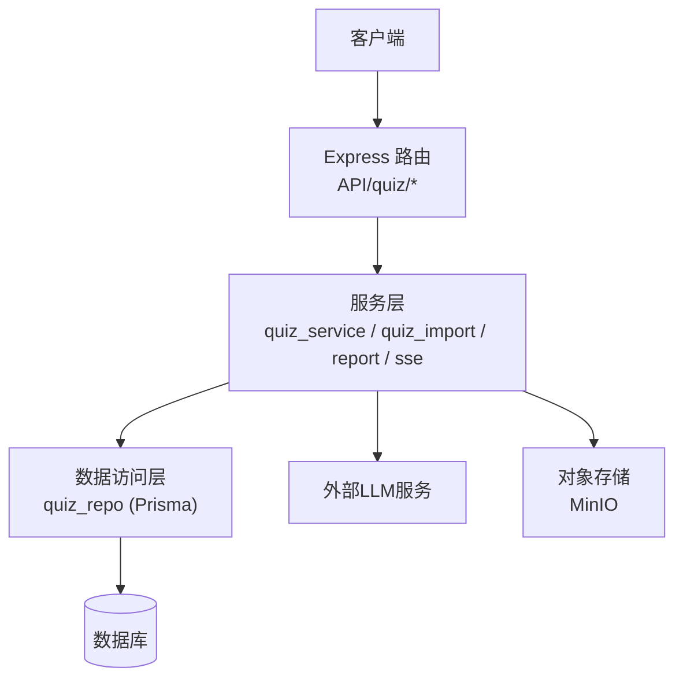
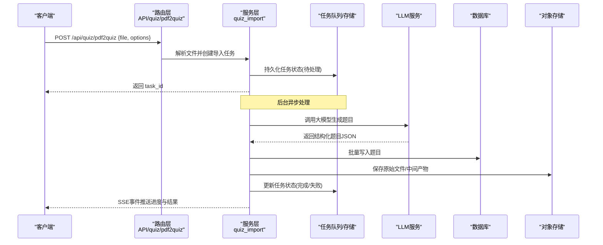
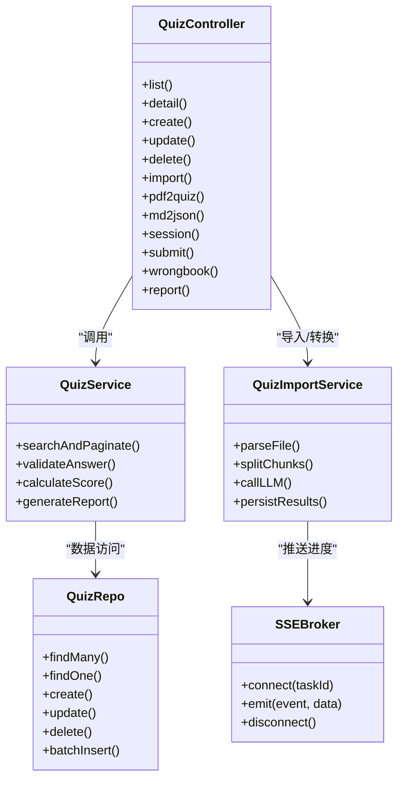

# 题库接口

<cite>
**本文引用的文件**   
- [app.js](file://node-jinmao/app.js)
- [quiz/index.js](file://node-jinmao/API/quiz/index.js)
- [quiz/import.js](file://node-jinmao/API/quiz/import.js)
- [quiz/md2json.js](file://node-jinmao/API/quiz/md2json.js)
- [quiz/pdf2quiz.js](file://node-jinmao/API/quiz/pdf2quiz.js)
- [quiz/session.js](file://node-jinmao/API/quiz/session.js)
- [quiz/textbooks.js](file://node-jinmao/API/quiz/textbooks.js)
- [quiz/wrongbook.js](file://node-jinmao/API/quiz/wrongbook.js)
- [quiz/report.js](file://node-jinmao/API/quiz/report.js)
- [service/quiz_service.js](file://node-jinmao/service/quiz_service.js)
- [service/quiz_import.js](file://node-jinmao/service/quiz_import.js)
- [service/quiz_report_service.js](file://node-jinmao/service/quiz_report_service.js)
- [service/quiz_sse_broker.js](file://node-jinmao/service/quiz_sse_broker.js)
- [repo/quiz_repo.js](file://node-jinmao/repo/quiz_repo.js)
- [prisma/schema.prisma](file://node-jinmao/prisma/schema.prisma)
- [API文档.md](file://API文档.md)
</cite>

## 目录
1. [简介](#简介)
2. [项目结构](#项目结构)
3. [核心组件](#核心组件)
4. [架构总览](#架构总览)
5. [详细组件分析](#详细组件分析)
6. [依赖关系分析](#依赖关系分析)
7. [性能考量](#性能考量)
8. [故障排查指南](#故障排查指南)
9. [结论](#结论)
10. [附录](#附录)

## 简介
本文件为“金毛教你学重构版”题库模块的完整API文档，覆盖题目CRUD、多种题型数据结构、批量导入导出、AI题目生成异步处理、答题与评分、SSE流式传输、错题本与学习报告等能力。读者可据此快速对接前后端或进行二次开发。

## 项目结构
后端采用Express路由+服务层+仓储层的分层架构：
- API层：定义HTTP端点与参数校验
- Service层：封装业务逻辑（导入、报告、SSE等）
- Repo层：数据访问（Prisma）
- 配置与工具：数据库连接、上传、LLM客户端等

图表来源
- [app.js:1-200](file://node-jinmao/app.js#L1-L200)
- [quiz/index.js:1-200](file://node-jinmao/API/quiz/index.js#L1-L200)

章节来源
- [app.js:1-200](file://node-jinmao/app.js#L1-L200)
- [quiz/index.js:1-200](file://node-jinmao/API/quiz/index.js#L1-L200)

## 核心组件
- 题库路由与控制器：集中管理题目相关HTTP端点
- 导入与转换：Markdown/PDF转题、批量导入
- 会话与答题：创建答题会话、提交答案、计算分数
- 报告与错题：学习报告生成、错题本管理
- SSE流式：长连接事件推送（如AI生成进度）

章节来源
- [quiz/index.js:1-200](file://node-jinmao/API/quiz/index.js#L1-L200)
- [service/quiz_service.js:1-200](file://node-jinmao/service/quiz_service.js#L1-L200)
- [service/quiz_import.js:1-200](file://node-jinmao/service/quiz_import.js#L1-L200)
- [service/quiz_report_service.js:1-200](file://node-jinmao/service/quiz_report_service.js#L1-L200)
- [service/quiz_sse_broker.js:1-200](file://node-jinmao/service/quiz_sse_broker.js#L1-L200)

## 架构总览
下图展示一次典型“从PDF导入并生成题目”的端到端流程，包括任务调度、异步执行与SSE事件推送。

图表来源
- [quiz/pdf2quiz.js:1-200](file://node-jinmao/API/quiz/pdf2quiz.js#L1-L200)
- [service/quiz_import.js:1-200](file://node-jinmao/service/quiz_import.js#L1-L200)
- [service/quiz_sse_broker.js:1-200](file://node-jinmao/service/quiz_sse_broker.js#L1-L200)

## 详细组件分析

### 题目基础CRUD与查询
- 列表与分页：支持按课程/章节/题型/关键词筛选，分页参数页码、每页数量
- 详情：按ID获取题目详情
- 创建/更新/删除：支持单条操作；批量创建/更新通过导入接口实现
- 搜索：全文检索与字段级过滤

请求示例要点
- 查询参数：page、pageSize、keyword、type、courseId、chapterId
- 响应体：包含items数组与分页元信息（total、page、pageSize）

错误处理
- 未授权：401
- 参数校验失败：400
- 资源不存在：404
- 服务器错误：500

章节来源
- [quiz/index.js:1-200](file://node-jinmao/API/quiz/index.js#L1-L200)
- [service/quiz_service.js:1-200](file://node-jinmao/service/quiz_service.js#L1-L200)
- [repo/quiz_repo.js:1-200](file://node-jinmao/repo/quiz_repo.js#L1-L200)

### 题型数据结构
系统支持以下题型，统一以JSON表示，便于前端渲染与交互：
- 选择题：题干、选项数组、正确答案索引或集合、解析、难度、标签
- 填空题：题干、答案数组、评分规则（精确匹配/模糊匹配）、提示
- 判断题：题干、正确答案（布尔）、解析
- 作文题：题干、评分维度、参考要点、评分规则（人工/AI辅助）

字段说明（摘要）
- id：唯一标识
- type：题型枚举
- stem：题干文本
- answer：答案（类型相关）
- explanation：解析
- difficulty：难度等级
- tags：标签集合
- metadata：扩展字段（如图片URL、音频URL）

章节来源
- [prisma/schema.prisma:1-200](file://node-jinmao/prisma/schema.prisma#L1-L200)
- [API文档.md:1-200](file://API文档.md#L1-L200)

### Markdown/PDF导入与AI题目生成（异步）
- 入口端点：POST /api/quiz/import、POST /api/quiz/pdf2quiz、POST /api/quiz/md2json
- 流程：接收文件→解析→切块→调用LLM生成→校验→入库→SSE推送
- 任务状态：pending、processing、completed、failed
- 进度事件：chunk_progress、llm_response、save_progress、done、error

请求示例要点
- multipart/form-data 上传文件
- 可选参数：courseId、chapterId、type、difficulty、tags

响应示例要点
- 立即返回task_id
- 后续通过SSE或轮询获取进度与结果

章节来源
- [quiz/import.js:1-200](file://node-jinmao/API/quiz/import.js#L1-L200)
- [quiz/pdf2quiz.js:1-200](file://node-jinmao/API/quiz/pdf2quiz.js#L1-L200)
- [quiz/md2json.js:1-200](file://node-jinmao/API/quiz/md2json.js#L1-L200)
- [service/quiz_import.js:1-200](file://node-jinmao/service/quiz_import.js#L1-L200)
- [service/quiz_sse_broker.js:1-200](file://node-jinmao/service/quiz_sse_broker.js#L1-L200)

### 批量导入与导出
- 批量导入：支持ZIP打包多文件，服务端解压后逐文件处理
- 批量导出：按筛选条件导出为JSON/CSV/ZIP，提供下载链接
- 限流与并发：控制并发任务数，避免阻塞

章节来源
- [quiz/textbooks.js:1-200](file://node-jinmao/API/quiz/textbooks.js#L1-L200)
- [service/quiz_import.js:1-200](file://node-jinmao/service/quiz_import.js#L1-L200)

### 答题会话、提交与评分
- 创建会话：GET/POST /api/quiz/session，返回session_id与题目集
- 提交答案：POST /api/quiz/session/{id}/submit，携带每题答案
- 评分：自动评分（选择/判断/填空），作文题支持AI辅助评分
- 结果：总分、各题得分、解析、错因分析

章节来源
- [quiz/session.js:1-200](file://node-jinmao/API/quiz/session.js#L1-L200)
- [service/quiz_service.js:1-200](file://node-jinmao/service/quiz_service.js#L1-L200)

### SSE流式传输
- 连接建立：GET /api/quiz/sse?task_id=xxx
- 事件类型：progress、result、error、close
- 消息格式：{event, data, id}，data为JSON字符串
- 重连策略：客户端指数退避重试

章节来源
- [service/quiz_sse_broker.js:1-200](file://node-jinmao/service/quiz_sse_broker.js#L1-L200)

### 错题本管理
- 添加错题：提交答案后自动加入或手动添加
- 列表与筛选：按题型、时间、掌握度筛选
- 复习模式：随机抽取错题组卷
- 移除与标记：标记已掌握、批量移除

章节来源
- [quiz/wrongbook.js:1-200](file://node-jinmao/API/quiz/wrongbook.js#L1-L200)

### 学习报告生成
- 生成报告：按用户/课程/时间段统计正确率、薄弱知识点、趋势图
- 报告内容：概览、分题型表现、错题分布、建议
- 导出：PDF/HTML

章节来源
- [quiz/report.js:1-200](file://node-jinmao/API/quiz/report.js#L1-L200)
- [service/quiz_report_service.js:1-200](file://node-jinmao/service/quiz_report_service.js#L1-L200)

## 依赖关系分析

图表来源
- [quiz/index.js:1-200](file://node-jinmao/API/quiz/index.js#L1-L200)
- [service/quiz_service.js:1-200](file://node-jinmao/service/quiz_service.js#L1-L200)
- [service/quiz_import.js:1-200](file://node-jinmao/service/quiz_import.js#L1-L200)
- [repo/quiz_repo.js:1-200](file://node-jinmao/repo/quiz_repo.js#L1-L200)
- [service/quiz_sse_broker.js:1-200](file://node-jinmao/service/quiz_sse_broker.js#L1-L200)

章节来源
- [quiz/index.js:1-200](file://node-jinmao/API/quiz/index.js#L1-L200)
- [service/quiz_service.js:1-200](file://node-jinmao/service/quiz_service.js#L1-L200)
- [service/quiz_import.js:1-200](file://node-jinmao/service/quiz_import.js#L1-L200)
- [repo/quiz_repo.js:1-200](file://node-jinmao/repo/quiz_repo.js#L1-L200)
- [service/quiz_sse_broker.js:1-200](file://node-jinmao/service/quiz_sse_broker.js#L1-L200)

## 性能考量
- 导入与AI生成：采用异步任务+SSE，避免长请求阻塞
- 批量操作：分批写入、事务控制，降低锁竞争
- 缓存：热点题目与报告结果可缓存（Redis）
- 限流：对LLM调用与文件上传做速率限制
- 分页与索引：数据库层面建立常用查询索引

## 故障排查指南
常见问题与定位步骤
- 导入失败：检查文件格式、大小限制、LLM配额与网络连通性
- 评分异常：核对答案字段与评分规则，确认题型与答案类型一致
- SSE断连：检查代理是否支持SSE，客户端重连策略是否生效
- 权限问题：确认JWT有效且具备相应角色权限

错误码约定
- 400 参数错误
- 401 未认证
- 403 无权限
- 404 资源不存在
- 422 业务校验失败
- 500 服务器内部错误
- 503 服务不可用（LLM/存储）

章节来源
- [API文档.md:1-200](file://API文档.md#L1-L200)

## 结论
本API文档覆盖了题库模块的核心能力与集成要点，结合分层架构与异步机制，能够支撑大规模题目导入、AI生成、在线答题与学习分析。建议在生产环境启用缓存、限流与监控，确保稳定性与可扩展性。

## 附录
- 端点清单（摘要）
  - 题目CRUD：/api/quiz/*
  - 导入与转换：/api/quiz/import、/api/quiz/pdf2quiz、/api/quiz/md2json
  - 答题会话：/api/quiz/session、/api/quiz/session/:id/submit
  - 错题本：/api/quiz/wrongbook/*
  - 报告：/api/quiz/report/*
  - SSE：/api/quiz/sse
- 数据类型参考：见题型数据结构与数据库Schema