# 题库管理

<cite>
**本文引用的文件**   
- [API文档.md](file://API文档.md)
- [数据库结构.md](file://数据库结构.md)
- [node-jinmao/API/quiz/textbooks.js](file://node-jinmao/API/quiz/textbooks.js)
- [node-jinmao/API/quiz/import.js](file://node-jinmao/API/quiz/import.js)
- [node-jinmao/service/quiz_service.js](file://node-jinmao/service/quiz_service.js)
- [node-jinmao/repo/quiz_repo.js](file://node-jinmao/repo/quiz_repo.js)
- [node-jinmao/prisma/schema.prisma](file://node-jinmao/prisma/schema.prisma)
- [node-jinmao/middleware/auth.js](file://node-jinmao/middleware/auth.js)
- [WEB/src/api/books.js](file://WEB/src/api/books.js)
- [WEB/src/components/ImportQuizDialog.vue](file://WEB/src/components/ImportQuizDialog.vue)
</cite>

## 目录
1. [简介](#简介)
2. [项目结构](#项目结构)
3. [核心组件](#核心组件)
4. [架构总览](#架构总览)
5. [详细组件分析](#详细组件分析)
6. [依赖分析](#依赖分析)
7. [性能考虑](#性能考虑)
8. [故障排查指南](#故障排查指南)
9. [结论](#结论)
10. [附录：API规范与示例](#附录api规范与示例)

## 简介
本文件面向“题库管理”模块，覆盖题库的创建、编辑、删除、查询；章节组织与题目分类；导入导出、批量操作、版本管理；搜索、筛选、分页；权限控制、共享机制、备份恢复等。内容基于仓库中后端 API、服务层、仓储层、数据模型以及前端调用实现进行系统化梳理，并提供可操作的接口说明与调用示例路径。

## 项目结构
题库管理相关代码主要分布在以下位置：
- 后端 API 路由与控制器：node-jinmao/API/quiz/*
- 业务服务层：node-jinmao/service/quiz_service.js
- 数据访问层：node-jinmao/repo/quiz_repo.js
- 数据模型与迁移：node-jinmao/prisma/schema.prisma
- 鉴权中间件：node-jinmao/middleware/auth.js
- 前端题库调用与导入对话框：WEB/src/api/books.js、WEB/src/components/ImportQuizDialog.vue
- 全局 API 文档与数据库结构参考：API文档.md、数据库结构.md

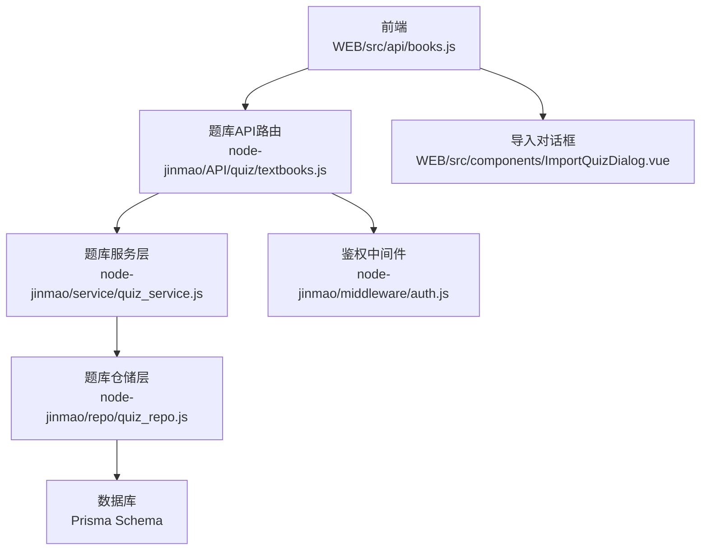

图表来源
- [node-jinmao/API/quiz/textbooks.js](file://node-jinmao/API/quiz/textbooks.js)
- [node-jinmao/service/quiz_service.js](file://node-jinmao/service/quiz_service.js)
- [node-jinmao/repo/quiz_repo.js](file://node-jinmao/repo/quiz_repo.js)
- [node-jinmao/prisma/schema.prisma](file://node-jinmao/prisma/schema.prisma)
- [node-jinmao/middleware/auth.js](file://node-jinmao/middleware/auth.js)
- [WEB/src/api/books.js](file://WEB/src/api/books.js)
- [WEB/src/components/ImportQuizDialog.vue](file://WEB/src/components/ImportQuizDialog.vue)

章节来源
- [API文档.md](file://API文档.md)
- [数据库结构.md](file://数据库结构.md)

## 核心组件
- 题库实体与关系：题库、章节、题目、分类、版本、导入任务、分享记录等（以 Prisma 模型为准）
- 服务层：封装题库 CRUD、章节管理、分类管理、导入导出、版本化、搜索筛选、分页、权限校验、共享与备份恢复等业务逻辑
- 仓储层：对数据库进行增删改查、事务处理、批量操作、索引优化
- API 层：暴露 RESTful 接口，统一入参出参格式，集成鉴权与错误处理
- 前端：题库列表、详情、导入对话框、导出按钮、搜索筛选、分页控件

章节来源
- [node-jinmao/service/quiz_service.js](file://node-jinmao/service/quiz_service.js)
- [node-jinmao/repo/quiz_repo.js](file://node-jinmao/repo/quiz_repo.js)
- [node-jinmao/API/quiz/textbooks.js](file://node-jinmao/API/quiz/textbooks.js)
- [node-jinmao/prisma/schema.prisma](file://node-jinmao/prisma/schema.prisma)

## 架构总览
题库管理的请求链路遵循“前端 -> API -> 服务层 -> 仓储层 -> 数据库”的分层架构，鉴权在 API 入口处统一拦截。

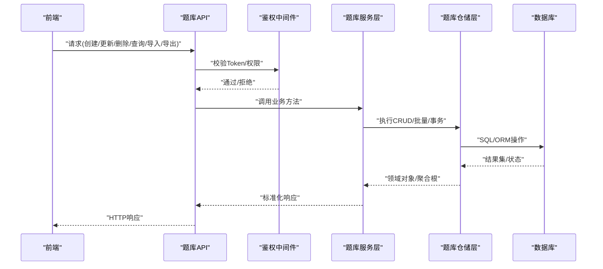

图表来源
- [node-jinmao/API/quiz/textbooks.js](file://node-jinmao/API/quiz/textbooks.js)
- [node-jinmao/middleware/auth.js](file://node-jinmao/middleware/auth.js)
- [node-jinmao/service/quiz_service.js](file://node-jinmao/service/quiz_service.js)
- [node-jinmao/repo/quiz_repo.js](file://node-jinmao/repo/quiz_repo.js)
- [node-jinmao/prisma/schema.prisma](file://node-jinmao/prisma/schema.prisma)

## 详细组件分析

### 题库实体与数据结构
- 题库：包含名称、描述、作者、可见性、版本、创建/更新时间戳等
- 章节：属于题库，支持层级结构（父章节ID）、排序、标题、摘要
- 题目：属于章节或题库，包含题型、题干、选项、答案、解析、难度、标签、分类
- 分类：用于题目归类，支持多级分类树
- 版本：题库或章节的版本快照，支持回滚与对比
- 导入任务：异步任务，记录进度、状态、错误信息
- 分享：记录共享范围、权限、有效期

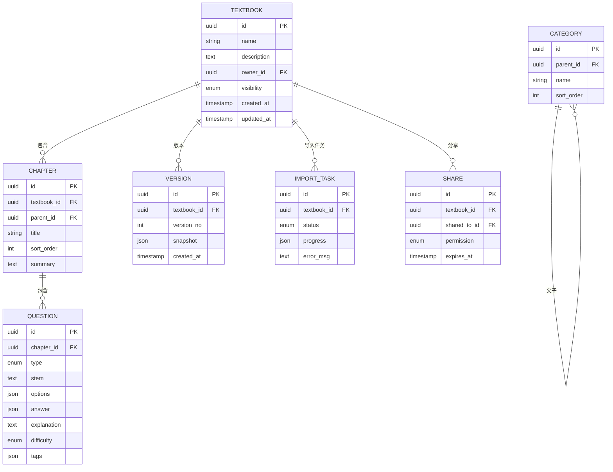

图表来源
- [node-jinmao/prisma/schema.prisma](file://node-jinmao/prisma/schema.prisma)

章节来源
- [node-jinmao/prisma/schema.prisma](file://node-jinmao/prisma/schema.prisma)

### 题库创建、编辑、删除、查询
- 创建题库：校验入参、生成默认章节、初始化版本、设置权限
- 编辑题库：字段校验、增量更新、触发新版本
- 删除题库：级联删除或软删除策略、清理导入任务与分享记录
- 查询题库：按所有者、可见性、关键词、分类、时间范围过滤，支持分页与排序

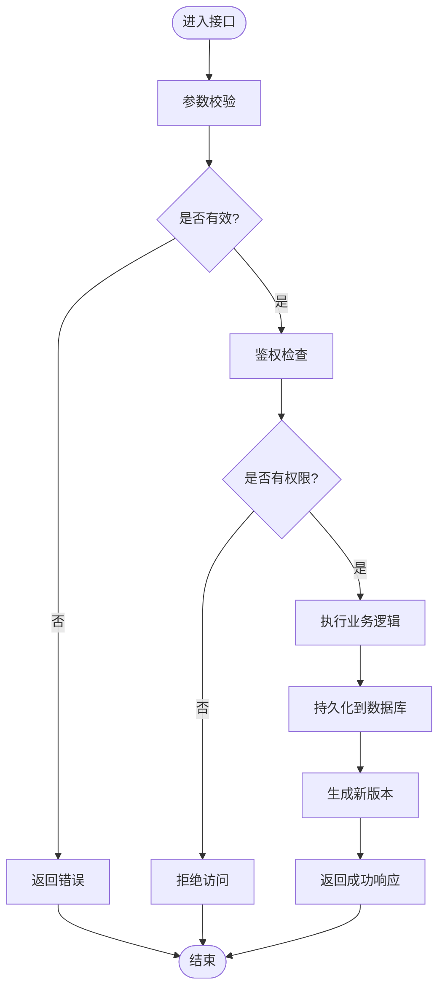

图表来源
- [node-jinmao/API/quiz/textbooks.js](file://node-jinmao/API/quiz/textbooks.js)
- [node-jinmao/middleware/auth.js](file://node-jinmao/middleware/auth.js)
- [node-jinmao/service/quiz_service.js](file://node-jinmao/service/quiz_service.js)
- [node-jinmao/repo/quiz_repo.js](file://node-jinmao/repo/quiz_repo.js)

章节来源
- [node-jinmao/API/quiz/textbooks.js](file://node-jinmao/API/quiz/textbooks.js)
- [node-jinmao/service/quiz_service.js](file://node-jinmao/service/quiz_service.js)
- [node-jinmao/repo/quiz_repo.js](file://node-jinmao/repo/quiz_repo.js)

### 章节管理与题目分类
- 章节管理：新增子章节、移动章节、调整排序、批量删除
- 题目分类：创建分类树、关联题目、批量打标签、按分类检索
- 数据一致性：章节与题目归属变更需事务保证

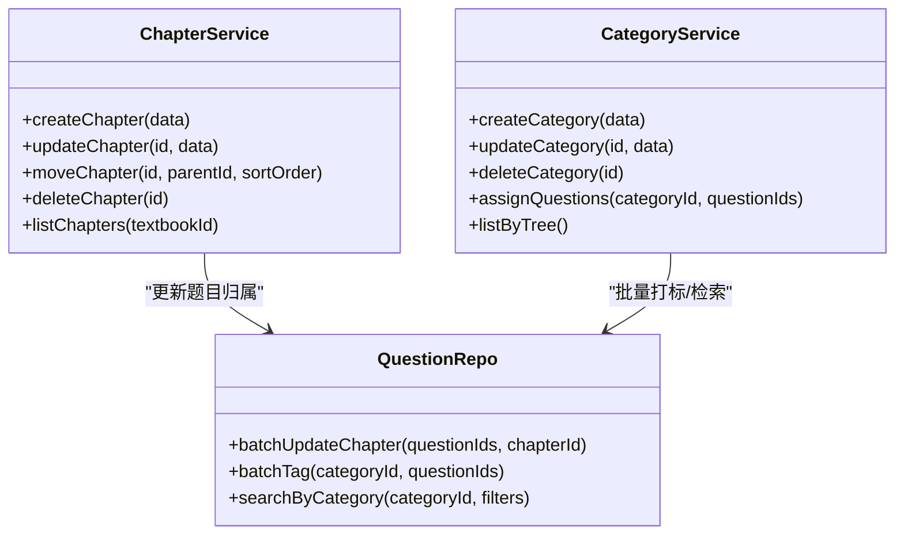

图表来源
- [node-jinmao/service/quiz_service.js](file://node-jinmao/service/quiz_service.js)
- [node-jinmao/repo/quiz_repo.js](file://node-jinmao/repo/quiz_repo.js)

章节来源
- [node-jinmao/service/quiz_service.js](file://node-jinmao/service/quiz_service.js)
- [node-jinmao/repo/quiz_repo.js](file://node-jinmao/repo/quiz_repo.js)

### 题库导入与导出
- 导入：支持 Markdown/JSON/PDF 等多格式，异步任务处理，进度推送，错误定位
- 导出：按题库/章节/分类导出为 JSON/Markdown/PDF，支持模板与样式配置
- 批量导入：分片上传、并发处理、去重策略、冲突解决

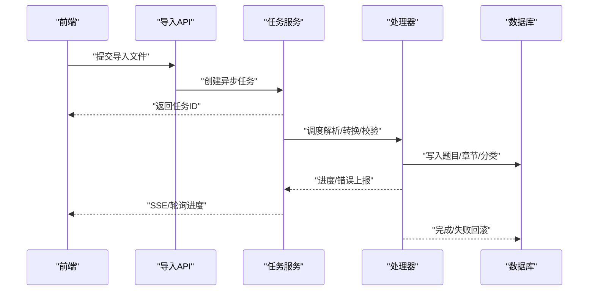

图表来源
- [node-jinmao/API/quiz/import.js](file://node-jinmao/API/quiz/import.js)
- [node-jinmao/service/quiz_service.js](file://node-jinmao/service/quiz_service.js)
- [node-jinmao/repo/quiz_repo.js](file://node-jinmao/repo/quiz_repo.js)

章节来源
- [node-jinmao/API/quiz/import.js](file://node-jinmao/API/quiz/import.js)
- [node-jinmao/service/quiz_service.js](file://node-jinmao/service/quiz_service.js)
- [WEB/src/components/ImportQuizDialog.vue](file://WEB/src/components/ImportQuizDialog.vue)

### 版本管理
- 版本快照：保存题库/章节的结构与内容快照
- 版本切换：切换至指定版本，生成差异报告
- 回滚：将当前版本回滚到历史版本，保留审计日志

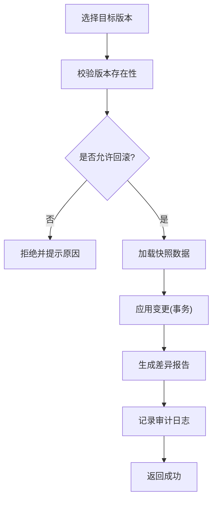

图表来源
- [node-jinmao/service/quiz_service.js](file://node-jinmao/service/quiz_service.js)
- [node-jinmao/repo/quiz_repo.js](file://node-jinmao/repo/quiz_repo.js)

章节来源
- [node-jinmao/service/quiz_service.js](file://node-jinmao/service/quiz_service.js)
- [node-jinmao/repo/quiz_repo.js](file://node-jinmao/repo/quiz_repo.js)

### 搜索、筛选与分页
- 搜索：全文检索、关键词匹配、模糊搜索
- 筛选：按分类、难度、题型、标签、时间范围、作者等条件组合
- 分页：页码、每页大小、排序字段、方向

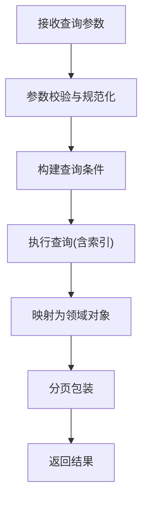

图表来源
- [node-jinmao/service/quiz_service.js](file://node-jinmao/service/quiz_service.js)
- [node-jinmao/repo/quiz_repo.js](file://node-jinmao/repo/quiz_repo.js)

章节来源
- [node-jinmao/service/quiz_service.js](file://node-jinmao/service/quiz_service.js)
- [node-jinmao/repo/quiz_repo.js](file://node-jinmao/repo/quiz_repo.js)

### 权限控制与共享机制
- 权限模型：所有者、协作者、只读、编辑、管理员等角色
- 共享范围：个人、团队、公开；支持过期时间与撤销
- 鉴权流程：Token 校验、资源归属验证、细粒度权限判断

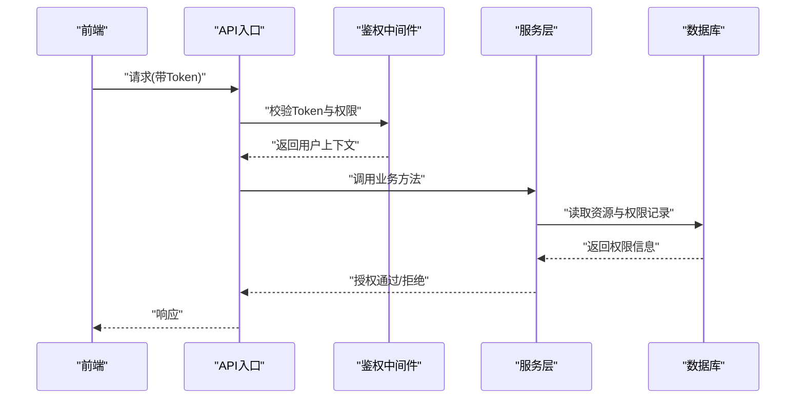

图表来源
- [node-jinmao/middleware/auth.js](file://node-jinmao/middleware/auth.js)
- [node-jinmao/service/quiz_service.js](file://node-jinmao/service/quiz_service.js)
- [node-jinmao/repo/quiz_repo.js](file://node-jinmao/repo/quiz_repo.js)

章节来源
- [node-jinmao/middleware/auth.js](file://node-jinmao/middleware/auth.js)
- [node-jinmao/service/quiz_service.js](file://node-jinmao/service/quiz_service.js)

### 备份与恢复
- 备份：全量/增量备份，导出为压缩包或对象存储
- 恢复：从备份还原，支持选择性恢复（题库/章节/题目）
- 校验：备份完整性校验、恢复前后一致性比对

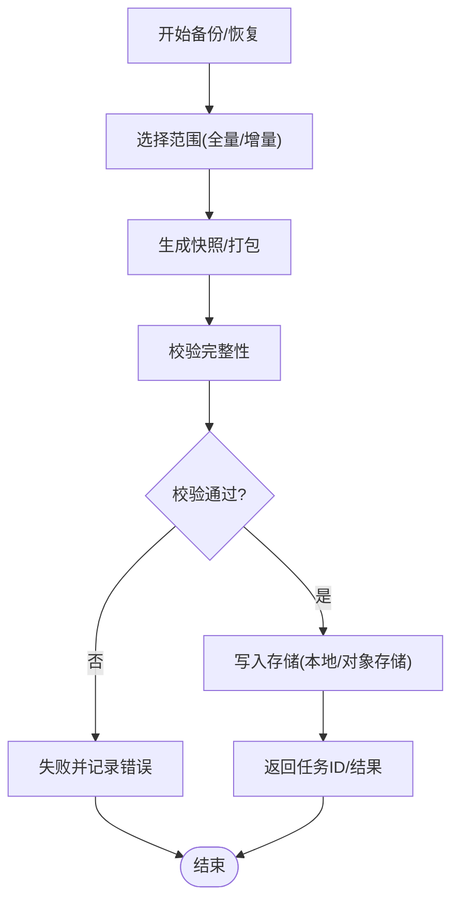

图表来源
- [node-jinmao/service/quiz_service.js](file://node-jinmao/service/quiz_service.js)
- [node-jinmao/repo/quiz_repo.js](file://node-jinmao/repo/quiz_repo.js)

章节来源
- [node-jinmao/service/quiz_service.js](file://node-jinmao/service/quiz_service.js)
- [node-jinmao/repo/quiz_repo.js](file://node-jinmao/repo/quiz_repo.js)

## 依赖分析
- API 层依赖鉴权中间件与服务层
- 服务层依赖仓储层进行数据访问
- 仓储层依赖 Prisma ORM 与数据库
- 前端依赖 API 与导入对话框组件

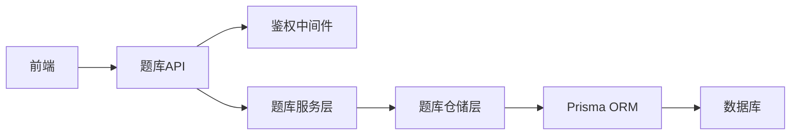

图表来源
- [node-jinmao/API/quiz/textbooks.js](file://node-jinmao/API/quiz/textbooks.js)
- [node-jinmao/middleware/auth.js](file://node-jinmao/middleware/auth.js)
- [node-jinmao/service/quiz_service.js](file://node-jinmao/service/quiz_service.js)
- [node-jinmao/repo/quiz_repo.js](file://node-jinmao/repo/quiz_repo.js)
- [node-jinmao/prisma/schema.prisma](file://node-jinmao/prisma/schema.prisma)

章节来源
- [node-jinmao/API/quiz/textbooks.js](file://node-jinmao/API/quiz/textbooks.js)
- [node-jinmao/service/quiz_service.js](file://node-jinmao/service/quiz_service.js)
- [node-jinmao/repo/quiz_repo.js](file://node-jinmao/repo/quiz_repo.js)
- [node-jinmao/prisma/schema.prisma](file://node-jinmao/prisma/schema.prisma)

## 性能考虑
- 索引优化：对高频查询字段建立索引（如 textbook_id、chapter_id、category_id、tags）
- 分页与懒加载：避免一次性加载大量数据，使用游标或键集分页
- 批量操作：合并多次写入为事务批次，减少网络往返
- 缓存策略：热点数据（分类树、常用筛选）采用缓存层
- 异步处理：导入导出、版本快照生成使用任务队列与流式处理
- 连接池：合理配置数据库连接池大小与超时

[本节为通用指导，不直接分析具体文件]

## 故障排查指南
- 鉴权失败：检查 Token 有效性、权限配置、资源归属
- 导入失败：查看任务进度与错误信息，确认文件格式与字段映射
- 版本回滚异常：核对快照完整性与事务回滚日志
- 搜索无结果：检查索引状态、关键词规范化、筛选条件
- 导出为空：确认权限、范围选择、模板配置

章节来源
- [node-jinmao/middleware/auth.js](file://node-jinmao/middleware/auth.js)
- [node-jinmao/API/quiz/import.js](file://node-jinmao/API/quiz/import.js)
- [node-jinmao/service/quiz_service.js](file://node-jinmao/service/quiz_service.js)

## 结论
题库管理模块采用清晰的分层架构与完善的权限控制，支持完整的生命周期管理（创建、编辑、删除、查询）、章节与分类组织、导入导出、版本化、搜索筛选与分页、共享与备份恢复。建议在生产环境加强索引优化、缓存与异步任务监控，确保高可用与高性能。

[本节为总结，不直接分析具体文件]

## 附录：API规范与示例
以下为题库管理常见接口的规范与调用示例路径（不包含具体代码内容）：

- 创建题库
  - 方法：POST /api/textbooks
  - 入参：名称、描述、可见性、初始章节等
  - 出参：题库ID、版本、权限信息
  - 示例路径：[WEB/src/api/books.js](file://WEB/src/api/books.js)

- 编辑题库
  - 方法：PUT /api/textbooks/:id
  - 入参：可更新字段集合
  - 出参：更新后的题库信息与版本号
  - 示例路径：[WEB/src/api/books.js](file://WEB/src/api/books.js)

- 删除题库
  - 方法：DELETE /api/textbooks/:id
  - 入参：题库ID
  - 出参：删除结果与审计日志
  - 示例路径：[WEB/src/api/books.js](file://WEB/src/api/books.js)

- 查询题库列表
  - 方法：GET /api/textbooks
  - 查询参数：page、pageSize、keyword、visibility、ownerId、categoryId、timeRange
  - 出参：题库列表、总数、分页信息
  - 示例路径：[WEB/src/api/books.js](file://WEB/src/api/books.js)

- 章节管理
  - 新增章节：POST /api/textbooks/:textbookId/chapters
  - 更新章节：PUT /api/chapters/:id
  - 删除章节：DELETE /api/chapters/:id
  - 移动/排序：PATCH /api/chapters/:id/order
  - 示例路径：[WEB/src/api/books.js](file://WEB/src/api/books.js)

- 题目分类
  - 分类树：GET /api/categories/tree
  - 分配题目：POST /api/categories/:id/questions
  - 示例路径：[WEB/src/api/books.js](file://WEB/src/api/books.js)

- 导入题库
  - 方法：POST /api/textbooks/:id/import
  - 入参：文件、格式、映射规则
  - 出参：任务ID、进度查询接口
  - 示例路径：[node-jinmao/API/quiz/import.js](file://node-jinmao/API/quiz/import.js)、[WEB/src/components/ImportQuizDialog.vue](file://WEB/src/components/ImportQuizDialog.vue)

- 导出题库
  - 方法：GET /api/textbooks/:id/export?format=json|markdown|pdf&scope=full|chapter|category
  - 出参：下载链接或流式响应
  - 示例路径：[node-jinmao/API/quiz/textbooks.js](file://node-jinmao/API/quiz/textbooks.js)

- 版本管理
  - 列出版本：GET /api/textbooks/:id/versions
  - 切换版本：POST /api/textbooks/:id/versions/:versionNo/switch
  - 差异报告：GET /api/textbooks/:id/versions/diff?from=&to=
  - 示例路径：[node-jinmao/service/quiz_service.js](file://node-jinmao/service/quiz_service.js)

- 搜索与筛选
  - 方法：GET /api/textbooks/search
  - 参数：keyword、categoryId、difficulty、type、tags、author、timeRange、sort、order、page、pageSize
  - 示例路径：[node-jinmao/service/quiz_service.js](file://node-jinmao/service/quiz_service.js)

- 权限与共享
  - 授予权限：POST /api/textbooks/:id/share
  - 撤销共享：DELETE /api/shares/:shareId
  - 示例路径：[node-jinmao/middleware/auth.js](file://node-jinmao/middleware/auth.js)、[node-jinmao/service/quiz_service.js](file://node-jinmao/service/quiz_service.js)

- 备份与恢复
  - 备份：POST /api/textbooks/:id/backup
  - 恢复：POST /api/backups/:backupId/restore
  - 示例路径：[node-jinmao/service/quiz_service.js](file://node-jinmao/service/quiz_service.js)

章节来源
- [WEB/src/api/books.js](file://WEB/src/api/books.js)
- [node-jinmao/API/quiz/textbooks.js](file://node-jinmao/API/quiz/textbooks.js)
- [node-jinmao/API/quiz/import.js](file://node-jinmao/API/quiz/import.js)
- [node-jinmao/service/quiz_service.js](file://node-jinmao/service/quiz_service.js)
- [node-jinmao/middleware/auth.js](file://node-jinmao/middleware/auth.js)
- [WEB/src/components/ImportQuizDialog.vue](file://WEB/src/components/ImportQuizDialog.vue)