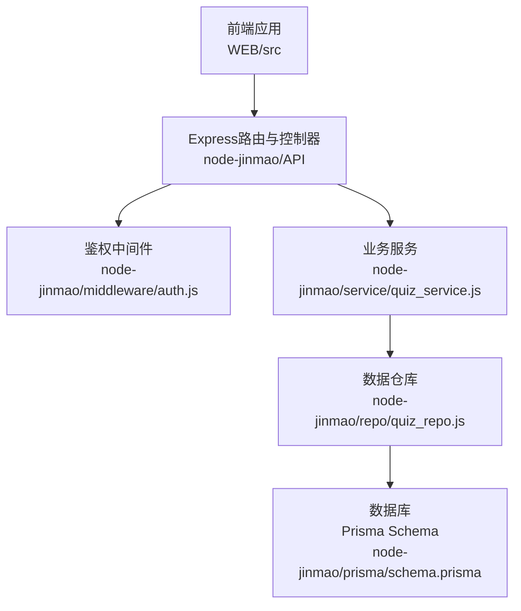
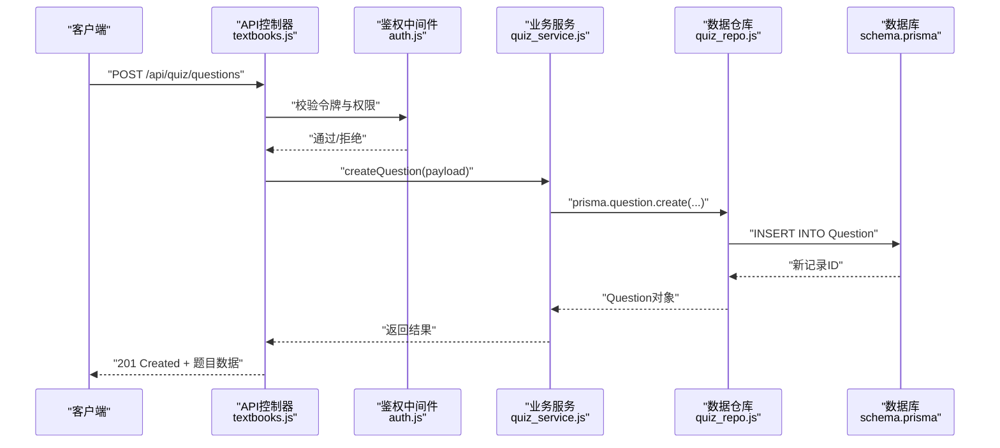
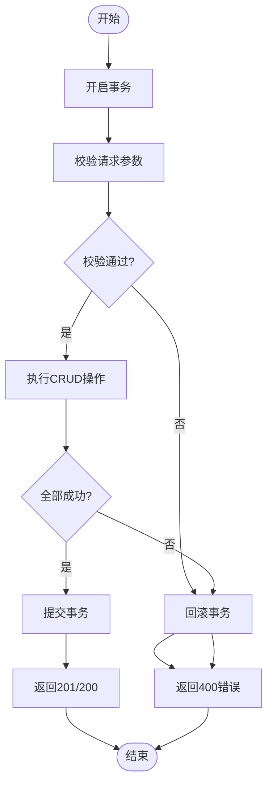
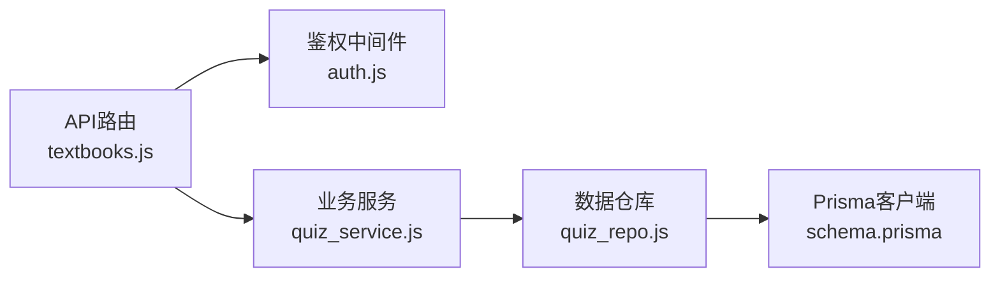

# 题目CRUD操作

<cite>
**本文档引用的文件**   
- [API文档.md](file://API文档.md)
- [数据库结构.md](file://数据库结构.md)
- [node-jinmao/API/quiz/textbooks.js](file://node-jinmao/API/quiz/textbooks.js)
- [node-jinmao/repo/quiz_repo.js](file://node-jinmao/repo/quiz_repo.js)
- [node-jinmao/prisma/schema.prisma](file://node-jinmao/prisma/schema.prisma)
- [node-jinmao/service/quiz_service.js](file://node-jinmao/service/quiz_service.js)
- [node-jinmao/middleware/auth.js](file://node-jinmao/middleware/auth.js)
- [node-jinmao/app.js](file://node-jinmao/app.js)
</cite>

## 目录
1. [简介](#简介)
2. [项目结构](#项目结构)
3. [核心组件](#核心组件)
4. [架构总览](#架构总览)
5. [详细组件分析](#详细组件分析)
6. [依赖分析](#依赖分析)
7. [性能考虑](#性能考虑)
8. [故障排查指南](#故障排查指南)
9. [结论](#结论)
10. [附录](#附录)

## 简介
本文件面向题库系统的“题目基础CRUD”能力，提供完整的API说明与实现要点。内容涵盖：
- HTTP端点定义（创建、读取、更新、删除）
- 请求参数与响应格式规范
- 题目数据结构定义、字段说明与校验规则
- 成功与错误场景的请求/响应示例
- 题目状态管理与权限控制机制
- 批量操作接口与事务处理策略

## 项目结构
后端采用Node.js + Express服务，使用Prisma进行数据建模与访问；题库相关API集中在API层，业务逻辑在service层，数据访问在repo层，鉴权通过中间件完成。前端位于WEB目录，调用后端API完成题目管理。

图表来源 
- [node-jinmao/app.js](file://node-jinmao/app.js)
- [node-jinmao/middleware/auth.js](file://node-jinmao/middleware/auth.js)
- [node-jinmao/API/quiz/textbooks.js](file://node-jinmao/API/quiz/textbooks.js)
- [node-jinmao/service/quiz_service.js](file://node-jinmao/service/quiz_service.js)
- [node-jinmao/repo/quiz_repo.js](file://node-jinmao/repo/quiz_repo.js)
- [node-jinmao/prisma/schema.prisma](file://node-jinmao/prisma/schema.prisma)

章节来源
- [node-jinmao/app.js](file://node-jinmao/app.js)
- [node-jinmao/middleware/auth.js](file://node-jinmao/middleware/auth.js)
- [node-jinmao/API/quiz/textbooks.js](file://node-jinmao/API/quiz/textbooks.js)

## 核心组件
- 路由与控制器：负责HTTP请求解析、参数校验、权限检查、调用服务层并返回统一响应。
- 业务服务：封装题目CRUD的业务规则、状态流转、批量操作与事务边界。
- 数据仓库：基于Prisma的数据访问封装，提供增删改查与批量写入。
- 鉴权中间件：校验JWT令牌、注入用户上下文、执行角色/资源级权限判断。
- 数据模型：Prisma Schema定义题目实体、关联关系与约束。

章节来源
- [node-jinmao/API/quiz/textbooks.js](file://node-jinmao/API/quiz/textbooks.js)
- [node-jinmao/service/quiz_service.js](file://node-jinmao/service/quiz_service.js)
- [node-jinmao/repo/quiz_repo.js](file://node-jinmao/repo/quiz_repo.js)
- [node-jinmao/middleware/auth.js](file://node-jinmao/middleware/auth.js)
- [node-jinmao/prisma/schema.prisma](file://node-jinmao/prisma/schema.prisma)

## 架构总览
下图展示一次题目创建的端到端流程：前端发起请求，经过鉴权中间件后进入控制器，控制器调用服务层执行业务逻辑，服务层通过仓库访问数据库，最终返回统一响应。

图表来源 
- [node-jinmao/API/quiz/textbooks.js](file://node-jinmao/API/quiz/textbooks.js)
- [node-jinmao/middleware/auth.js](file://node-jinmao/middleware/auth.js)
- [node-jinmao/service/quiz_service.js](file://node-jinmao/service/quiz_service.js)
- [node-jinmao/repo/quiz_repo.js](file://node-jinmao/repo/quiz_repo.js)
- [node-jinmao/prisma/schema.prisma](file://node-jinmao/prisma/schema.prisma)

## 详细组件分析

### 题目数据模型与字段说明
- 主键：id（唯一标识）
- 文本字段：题干、选项、答案、解析等
- 元数据：题型、难度、知识点、标签、状态、排序、版本等
- 时间戳：创建时间、更新时间
- 关联：所属教材/章节、创建者、修改者等

字段校验建议：
- 必填字段：题干、题型、答案（按题型要求）
- 枚举字段：题型、状态需限定合法值
- 长度限制：题干、解析等文本上限
- 格式校验：JSON字段（如选项数组）需符合约定结构

章节来源
- [node-jinmao/prisma/schema.prisma](file://node-jinmao/prisma/schema.prisma)
- [数据库结构.md](file://数据库结构.md)

### 创建题目（POST）
- 端点：POST /api/quiz/questions
- 权限：需要登录且具备“题目编辑”权限
- 请求体：包含题干、题型、答案、解析、难度、知识点、标签、排序等
- 响应：201 Created，返回新建的题目对象
- 错误：400 参数校验失败、401 未授权、403 无权限、409 重复约束（如唯一索引）

章节来源
- [node-jinmao/API/quiz/textbooks.js](file://node-jinmao/API/quiz/textbooks.js)
- [node-jinmao/service/quiz_service.js](file://node-jinmao/service/quiz_service.js)
- [node-jinmao/repo/quiz_repo.js](file://node-jinmao/repo/quiz_repo.js)
- [node-jinmao/middleware/auth.js](file://node-jinmao/middleware/auth.js)

### 读取题目（GET）
- 端点：GET /api/quiz/questions/:id
- 权限：默认公开或按资源归属控制
- 查询参数：可选的扩展字段（如是否包含解析、选项详情）
- 响应：200 OK，返回题目对象
- 错误：404 不存在、401/403 权限不足

章节来源
- [node-jinmao/API/quiz/textbooks.js](file://node-jinmao/API/quiz/textbooks.js)
- [node-jinmao/service/quiz_service.js](file://node-jinmao/service/quiz_service.js)
- [node-jinmao/repo/quiz_repo.js](file://node-jinmao/repo/quiz_repo.js)

### 更新题目（PUT/PATCH）
- 端点：PUT /api/quiz/questions/:id 或 PATCH /api/quiz/questions/:id
- 权限：题目所有者或具备“题目编辑”角色
- 请求体：可更新的字段集合（部分更新支持PATCH）
- 响应：200 OK，返回更新后的题目对象
- 错误：400 校验失败、404 不存在、403 无权限

章节来源
- [node-jinmao/API/quiz/textbooks.js](file://node-jinmao/API/quiz/textbooks.js)
- [node-jinmao/service/quiz_service.js](file://node-jinmao/service/quiz_service.js)
- [node-jinmao/repo/quiz_repo.js](file://node-jinmao/repo/quiz_repo.js)

### 删除题目（DELETE）
- 端点：DELETE /api/quiz/questions/:id
- 权限：题目所有者或具备“题目删除”角色
- 响应：200/204 成功
- 错误：404 不存在、403 无权限

章节来源
- [node-jinmao/API/quiz/textbooks.js](file://node-jinmao/API/quiz/textbooks.js)
- [node-jinmao/service/quiz_service.js](file://node-jinmao/service/quiz_service.js)
- [node-jinmao/repo/quiz_repo.js](file://node-jinmao/repo/quiz_repo.js)

### 批量操作接口（批量创建/更新/删除）
- 端点：
  - POST /api/quiz/questions/batch-create
  - PUT /api/quiz/questions/batch-update
  - DELETE /api/quiz/questions/batch-delete
- 权限：需要“题目批量编辑”权限
- 请求体：
  - 批量创建：题目数组
  - 批量更新：{ ids, fields }
  - 批量删除：{ ids }
- 响应：200/201，返回成功计数与失败明细
- 事务：建议在事务中执行，保证一致性；失败回滚并返回具体错误项

章节来源
- [node-jinmao/service/quiz_service.js](file://node-jinmao/service/quiz_service.js)
- [node-jinmao/repo/quiz_repo.js](file://node-jinmao/repo/quiz_repo.js)

### 题目状态管理与权限控制
- 状态机：草稿、已发布、已归档、已下架等
- 状态变更：仅允许特定角色或所有者执行，并记录审计信息
- 权限模型：基于角色的访问控制（RBAC），结合资源归属校验（如教材/章节维度）

章节来源
- [node-jinmao/middleware/auth.js](file://node-jinmao/middleware/auth.js)
- [node-jinmao/service/quiz_service.js](file://node-jinmao/service/quiz_service.js)

### 事务处理流程

图表来源 
- [node-jinmao/service/quiz_service.js](file://node-jinmao/service/quiz_service.js)
- [node-jinmao/repo/quiz_repo.js](file://node-jinmao/repo/quiz_repo.js)

## 依赖分析
- 路由依赖鉴权中间件与业务服务
- 服务依赖仓库进行数据访问
- 仓库依赖Prisma与数据库连接
- 权限由中间件统一处理，确保各接口一致的安全策略

图表来源 
- [node-jinmao/API/quiz/textbooks.js](file://node-jinmao/API/quiz/textbooks.js)
- [node-jinmao/middleware/auth.js](file://node-jinmao/middleware/auth.js)
- [node-jinmao/service/quiz_service.js](file://node-jinmao/service/quiz_service.js)
- [node-jinmao/repo/quiz_repo.js](file://node-jinmao/repo/quiz_repo.js)
- [node-jinmao/prisma/schema.prisma](file://node-jinmao/prisma/schema.prisma)

章节来源
- [node-jinmao/app.js](file://node-jinmao/app.js)
- [node-jinmao/API/quiz/textbooks.js](file://node-jinmao/API/quiz/textbooks.js)

## 性能考虑
- 批量接口优先使用批量写入减少往返次数
- 查询接口按需加载字段，避免N+1问题
- 对高频读操作引入缓存（如Redis）
- 大文本字段（解析、题干）分页或延迟加载
- 事务范围最小化，降低锁竞争

## 故障排查指南
- 常见错误码：
  - 400：参数校验失败（缺失必填、格式错误）
  - 401：未登录或令牌过期
  - 403：无权限操作该资源
  - 404：资源不存在
  - 409：唯一约束冲突（如重复ID）
  - 500：服务器内部错误
- 排查步骤：
  - 检查请求体结构与字段类型
  - 确认JWT令牌有效性与权限范围
  - 查看服务日志与数据库异常堆栈
  - 验证事务是否回滚及错误明细

章节来源
- [node-jinmao/middleware/auth.js](file://node-jinmao/middleware/auth.js)
- [node-jinmao/service/quiz_service.js](file://node-jinmao/service/quiz_service.js)

## 结论
本API文档明确了题目CRUD的端点、数据模型、权限与事务策略，为前后端协作提供了清晰契约。建议在生产环境完善参数校验、错误码规范与监控告警，以提升稳定性与可维护性。

## 附录
- 参考文档：
  - [API文档.md](file://API文档.md)
  - [数据库结构.md](file://数据库结构.md)
- 相关文件路径：
  - 路由与控制层：[node-jinmao/API/quiz/textbooks.js](file://node-jinmao/API/quiz/textbooks.js)
  - 业务服务层：[node-jinmao/service/quiz_service.js](file://node-jinmao/service/quiz_service.js)
  - 数据仓库层：[node-jinmao/repo/quiz_repo.js](file://node-jinmao/repo/quiz_repo.js)
  - 鉴权中间件：[node-jinmao/middleware/auth.js](file://node-jinmao/middleware/auth.js)
  - 数据模型：[node-jinmao/prisma/schema.prisma](file://node-jinmao/prisma/schema.prisma)