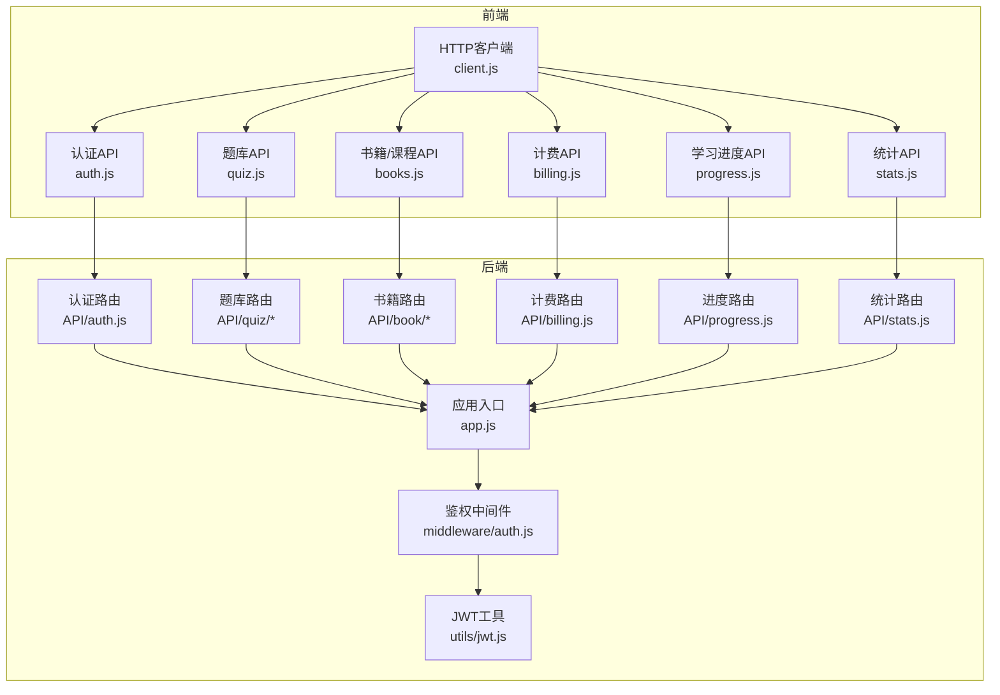
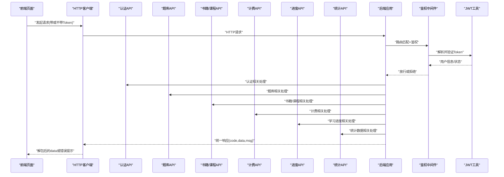
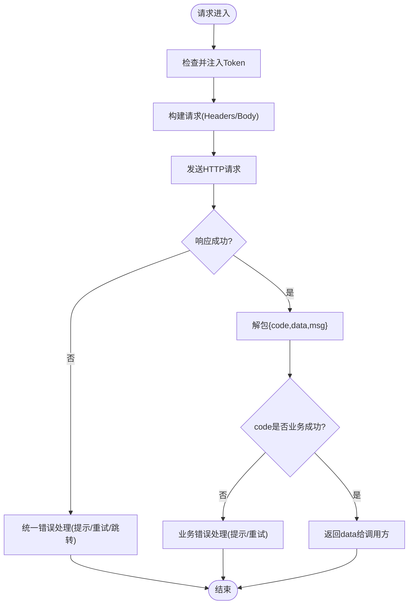
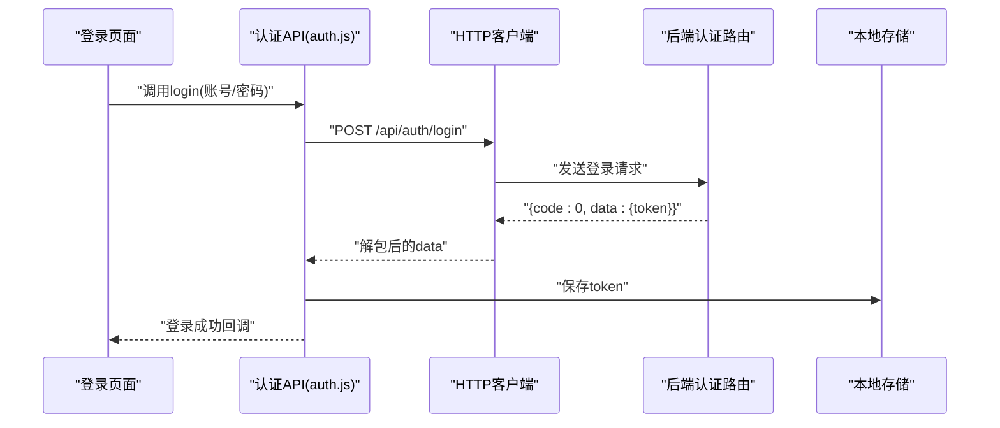
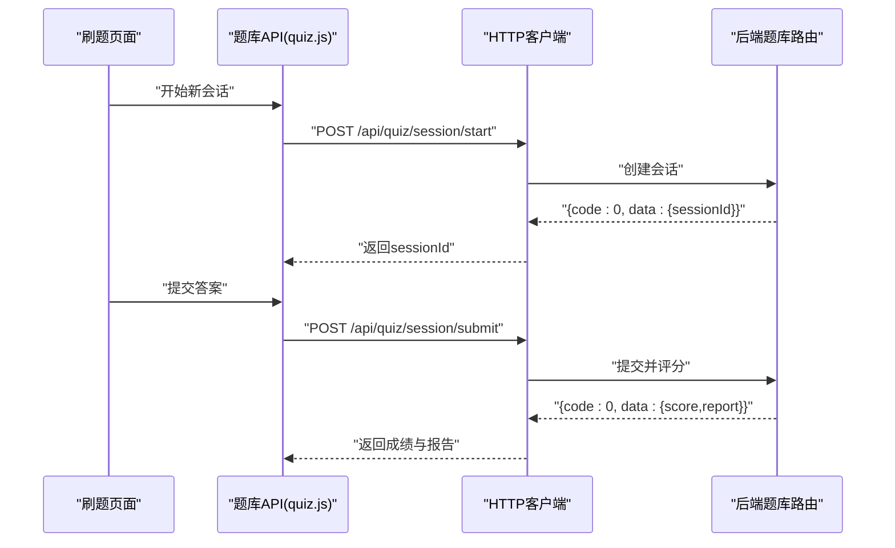
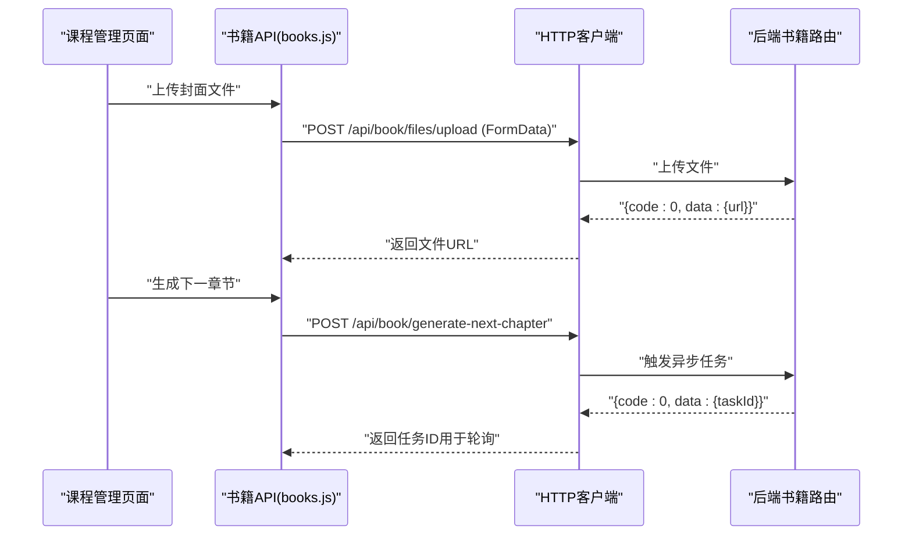
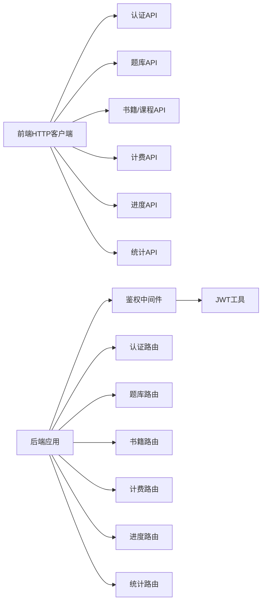

# API接口集成

<cite>
**本文档引用的文件**   
- [WEB/src/api/client.js](file://WEB/src/api/client.js)
- [WEB/src/api/auth.js](file://WEB/src/api/auth.js)
- [WEB/src/api/quiz.js](file://WEB/src/api/quiz.js)
- [WEB/src/api/books.js](file://WEB/src/api/books.js)
- [WEB/src/api/billing.js](file://WEB/src/api/billing.js)
- [WEB/src/api/progress.js](file://WEB/src/api/progress.js)
- [WEB/src/api/stats.js](file://WEB/src/api/stats.js)
- [node-jinmao/API/auth.js](file://node-jinmao/API/auth.js)
- [node-jinmao/API/quiz/session.js](file://node-jinmao/API/quiz/session.js)
- [node-jinmao/API/quiz/textbooks.js](file://node-jinmao/API/quiz/textbooks.js)
- [node-jinmao/API/book/index.js](file://node-jinmao/API/book/index.js)
- [node-jinmao/API/billing.js](file://node-jinmao/API/billing.js)
- [node-jinmao/API/progress.js](file://node-jinmao/API/progress.js)
- [node-jinmao/API/stats.js](file://node-jinmao/API/stats.js)
- [node-jinmao/middleware/auth.js](file://node-jinmao/middleware/auth.js)
- [node-jinmao/utils/jwt.js](file://node-jinmao/utils/jwt.js)
- [node-jinmao/app.js](file://node-jinmao/app.js)
- [test/frontend/src/lib/http.ts](file://test/frontend/src/lib/http.ts)
- [test/frontend/src/mock/home.ts](file://test/frontend/src/mock/home.ts)
- [test/frontend/src/mock/quiz.ts](file://test/frontend/src/mock/quiz.ts)
</cite>

## 目录
1. [简介](#简介)
2. [项目结构](#项目结构)
3. [核心组件](#核心组件)
4. [架构总览](#架构总览)
5. [详细组件分析](#详细组件分析)
6. [依赖关系分析](#依赖关系分析)
7. [性能考虑](#性能考虑)
8. [故障排查指南](#故障排查指南)
9. [结论](#结论)
10. [附录](#附录)

## 简介
本文件面向前端与后端的API集成，系统化说明请求封装、认证令牌管理、拦截器机制、统一响应处理、文件上传下载、进度展示、错误重试策略，以及各业务模块（认证、题库、课程、统计等）的调用方式。文档同时给出最佳实践、缓存策略与Mock数据使用方法，帮助开发者快速上手并稳定维护。

## 项目结构
本项目采用前后端分离：
- 前端位于 WEB/src/api 目录，按业务域拆分模块（auth、quiz、books、billing、progress、stats），并通过统一的HTTP客户端进行封装。
- 后端位于 node-jinmao 目录，API路由按功能划分（auth、quiz、book、billing、progress、stats），中间件负责鉴权与JWT校验。
- 测试前端位于 test/frontend，提供TS版HTTP封装与Mock数据，便于联调与离线开发。

图表来源
- [WEB/src/api/client.js](file://WEB/src/api/client.js)
- [node-jinmao/app.js](file://node-jinmao/app.js)
- [node-jinmao/middleware/auth.js](file://node-jinmao/middleware/auth.js)
- [node-jinmao/utils/jwt.js](file://node-jinmao/utils/jwt.js)

章节来源
- [WEB/src/api/client.js](file://WEB/src/api/client.js)
- [node-jinmao/app.js](file://node-jinmao/app.js)

## 核心组件
- HTTP客户端封装：统一配置基础URL、超时、请求头、响应体解包、错误码映射、拦截器（请求携带Token、响应统一处理）。
- 认证流程：登录获取Token，持久化到本地存储；后续请求自动附加Authorization头；过期时刷新或跳转登录。
- 业务API模块：按领域拆分，暴露函数式接口，内部复用HTTP客户端。
- 文件传输：支持FormData上传、分块上传、下载流式响应、进度事件回调。
- 错误与重试：网络异常、业务错误码分类处理；指数退避重试；幂等请求自动重试。
- Mock数据：在开发环境通过Mock服务返回固定数据，屏蔽后端差异。

章节来源
- [WEB/src/api/client.js](file://WEB/src/api/client.js)
- [WEB/src/api/auth.js](file://WEB/src/api/auth.js)
- [WEB/src/api/quiz.js](file://WEB/src/api/quiz.js)
- [WEB/src/api/books.js](file://WEB/src/api/books.js)
- [WEB/src/api/billing.js](file://WEB/src/api/billing.js)
- [WEB/src/api/progress.js](file://WEB/src/api/progress.js)
- [WEB/src/api/stats.js](file://WEB/src/api/stats.js)

## 架构总览
前端通过HTTP客户端发起请求，进入对应业务API模块；后端由应用入口挂载路由，鉴权中间件校验JWT，业务控制器处理逻辑并返回统一响应格式。

图表来源
- [node-jinmao/app.js](file://node-jinmao/app.js)
- [node-jinmao/middleware/auth.js](file://node-jinmao/middleware/auth.js)
- [node-jinmao/utils/jwt.js](file://node-jinmao/utils/jwt.js)
- [node-jinmao/API/auth.js](file://node-jinmao/API/auth.js)
- [node-jinmao/API/quiz/session.js](file://node-jinmao/API/quiz/session.js)
- [node-jinmao/API/book/index.js](file://node-jinmao/API/book/index.js)
- [node-jinmao/API/billing.js](file://node-jinmao/API/billing.js)
- [node-jinmao/API/progress.js](file://node-jinmao/API/progress.js)
- [node-jinmao/API/stats.js](file://node-jinmao/API/stats.js)

## 详细组件分析

### HTTP客户端与拦截器
- 基础配置：设置Base URL、超时时间、Content-Type、Accept等。
- 请求拦截器：从本地存储读取Token并注入Authorization头；为需要鉴权的请求添加必要参数。
- 响应拦截器：统一解包{code, data, msg}结构；对401/403做重定向或刷新Token；对网络错误进行友好提示。
- 错误处理：区分网络错误、业务错误、服务端异常；提供重试与降级策略。
- 文件上传下载：使用FormData与Blob；支持上传进度事件、下载流式写入与取消。

图表来源
- [WEB/src/api/client.js](file://WEB/src/api/client.js)

章节来源
- [WEB/src/api/client.js](file://WEB/src/api/client.js)

### 认证API
- 登录：提交用户名/密码或OTP，成功后返回Token并持久化。
- 登出：清除本地Token并跳转登录页。
- 刷新Token：基于Refresh Token或重新登录。
- 权限控制：根据角色/权限决定可访问资源。

图表来源
- [WEB/src/api/auth.js](file://WEB/src/api/auth.js)
- [node-jinmao/API/auth.js](file://node-jinmao/API/auth.js)

章节来源
- [WEB/src/api/auth.js](file://WEB/src/api/auth.js)
- [node-jinmao/API/auth.js](file://node-jinmao/API/auth.js)

### 题库API
- 会话管理：创建/查询/提交答题会话，记录答案与得分。
- 题目类型：选择题、判断题、填空题、作文题等。
- 导入导出：Markdown/PDF转题库、批量导入、导出报告。
- 错题本：收集错题、复习计划、练习推荐。

图表来源
- [WEB/src/api/quiz.js](file://WEB/src/api/quiz.js)
- [node-jinmao/API/quiz/session.js](file://node-jinmao/API/quiz/session.js)

章节来源
- [WEB/src/api/quiz.js](file://WEB/src/api/quiz.js)
- [node-jinmao/API/quiz/session.js](file://node-jinmao/API/quiz/session.js)

### 书籍/课程API
- 书籍管理：列表、详情、更新、删除、文件操作。
- 课程生成：大纲生成、章节生成、PPT/字幕生成。
- 文件操作：上传封面、课件、附件；下载压缩包。

图表来源
- [WEB/src/api/books.js](file://WEB/src/api/books.js)
- [node-jinmao/API/book/index.js](file://node-jinmao/API/book/index.js)

章节来源
- [WEB/src/api/books.js](file://WEB/src/api/books.js)
- [node-jinmao/API/book/index.js](file://node-jinmao/API/book/index.js)

### 计费API
- 套餐查询与购买：查看定价、下单、支付回调。
- 账单记录：历史消费、发票申请。
- 配额限制：按用户维度限制生成次数、存储空间。

章节来源
- [WEB/src/api/billing.js](file://WEB/src/api/billing.js)
- [node-jinmao/API/billing.js](file://node-jinmao/API/billing.js)

### 学习进度API
- 记录学习行为：观看时长、做题正确率、章节完成度。
- 统计指标：日/周/月活跃度、知识点掌握度。
- 个性化推荐：基于薄弱点推送练习。

章节来源
- [WEB/src/api/progress.js](file://WEB/src/api/progress.js)
- [node-jinmao/API/progress.js](file://node-jinmao/API/progress.js)

### 统计API
- 全局统计：平台级活跃用户、内容增长趋势。
- 个人统计：学习曲线、错题分布、能力雷达图。
- 报表导出：CSV/Excel导出。

章节来源
- [WEB/src/api/stats.js](file://WEB/src/api/stats.js)
- [node-jinmao/API/stats.js](file://node-jinmao/API/stats.js)

### 文件上传下载与进度条
- 上传：使用FormData，支持大文件分片、断点续传、并发上传。
- 下载：流式下载，支持进度事件与取消。
- 进度展示：实时百分比、速度、剩余时间估算。
- 错误重试：网络抖动自动重试，失败提示与回滚。

章节来源
- [WEB/src/api/client.js](file://WEB/src/api/client.js)

### 错误处理与重试机制
- 网络错误：超时、DNS解析失败、连接中断，统一提示并重试。
- 业务错误：根据code分类提示，支持重试与降级。
- 鉴权错误：401自动刷新Token或跳转登录；403提示无权限。
- 幂等请求：GET/HEAD/PUT/DELETE自动重试，POST谨慎重试。

章节来源
- [WEB/src/api/client.js](file://WEB/src/api/client.js)

### 认证令牌管理与请求拦截器
- 令牌存储：安全存储（localStorage/cookie），避免XSS风险。
- 自动注入：请求拦截器自动附加Authorization头。
- 过期处理：刷新Token或强制重新登录。
- 多端同步：设备切换时清理旧Token。

章节来源
- [WEB/src/api/client.js](file://WEB/src/api/client.js)
- [node-jinmao/middleware/auth.js](file://node-jinmao/middleware/auth.js)
- [node-jinmao/utils/jwt.js](file://node-jinmao/utils/jwt.js)

### 响应数据的统一处理
- 统一结构：{code, data, msg}，前端统一解包。
- 空值处理：默认值与占位符，避免UI崩溃。
- 国际化：错误消息多语言支持。
- 日志上报：关键错误上报监控平台。

章节来源
- [WEB/src/api/client.js](file://WEB/src/api/client.js)

### 各API模块实现要点
- 认证API：登录、登出、刷新、权限校验。
- 题库API：会话生命周期、题型处理、评分算法。
- 书籍/课程API：文件操作、异步任务、进度跟踪。
- 计费API：订单流程、支付回调、配额控制。
- 进度API：埋点上报、聚合计算、可视化。
- 统计API：聚合查询、报表生成、导出。

章节来源
- [WEB/src/api/auth.js](file://WEB/src/api/auth.js)
- [WEB/src/api/quiz.js](file://WEB/src/api/quiz.js)
- [WEB/src/api/books.js](file://WEB/src/api/books.js)
- [WEB/src/api/billing.js](file://WEB/src/api/billing.js)
- [WEB/src/api/progress.js](file://WEB/src/api/progress.js)
- [WEB/src/api/stats.js](file://WEB/src/api/stats.js)

### 最佳实践
- 请求封装：集中管理Base URL、超时、重试、错误处理。
- 缓存策略：静态资源CDN，接口数据短期缓存（ETag/Last-Modified）。
- 错误处理：用户友好提示，后台日志采集，告警通知。
- 安全：HTTPS、CSP、CSRF防护、输入校验。
- 性能：懒加载、分页、压缩、并行请求。

[本节为通用指导，不直接分析具体文件]

### Mock数据使用方法
- 开发环境启用Mock，屏蔽后端差异。
- Mock数据结构与真实接口一致，便于联调。
- 动态Mock：根据参数返回不同结果，模拟边界场景。
- 关闭Mock：生产环境禁用，确保真实数据。

章节来源
- [test/frontend/src/lib/http.ts](file://test/frontend/src/lib/http.ts)
- [test/frontend/src/mock/home.ts](file://test/frontend/src/mock/home.ts)
- [test/frontend/src/mock/quiz.ts](file://test/frontend/src/mock/quiz.ts)

## 依赖关系分析
- 前端依赖HTTP客户端与各业务API模块。
- 后端依赖应用入口、鉴权中间件、JWT工具与各业务路由。
- 模块间低耦合，通过HTTP协议通信。

图表来源
- [WEB/src/api/client.js](file://WEB/src/api/client.js)
- [node-jinmao/app.js](file://node-jinmao/app.js)
- [node-jinmao/middleware/auth.js](file://node-jinmao/middleware/auth.js)
- [node-jinmao/utils/jwt.js](file://node-jinmao/utils/jwt.js)

章节来源
- [WEB/src/api/client.js](file://WEB/src/api/client.js)
- [node-jinmao/app.js](file://node-jinmao/app.js)

## 性能考虑
- 请求合并：相同接口短时间内合并请求。
- 缓存策略：浏览器缓存、Service Worker缓存、服务端ETag。
- 图片优化：WebP格式、懒加载、缩略图。
- 代码分割：按需加载模块，减少首屏体积。
- 后端优化：数据库索引、查询优化、缓存层（Redis）。

[本节为通用指导，不直接分析具体文件]

## 故障排查指南
- 网络问题：检查代理、防火墙、跨域配置。
- 鉴权失败：确认Token有效、过期时间、刷新流程。
- 业务错误：查看后端日志、错误码定义、输入校验。
- 文件上传：检查文件大小、类型、服务器限制。
- 性能问题：监控接口耗时、内存占用、CPU使用率。

章节来源
- [WEB/src/api/client.js](file://WEB/src/api/client.js)
- [node-jinmao/middleware/auth.js](file://node-jinmao/middleware/auth.js)

## 结论
本集成方案通过统一的HTTP客户端与拦截器，实现了前后端一致的请求处理与错误管理；按业务域拆分的API模块提升了可维护性；完善的文件传输、进度展示与重试机制保障了用户体验；结合缓存与Mock策略，显著提升了开发与调试效率。建议在生产环境中严格遵循安全与性能最佳实践，持续监控与优化。

[本节为总结，不直接分析具体文件]

## 附录
- 环境变量配置：BASE_URL、TOKEN_KEY、TIMEOUT等。
- 错误码规范：统一错误码定义与含义。
- 接口版本管理：URL路径版本化（/api/v1/...）。
- 监控与日志：接入APM、错误追踪、用户行为分析。

[本节为补充信息，不直接分析具体文件]