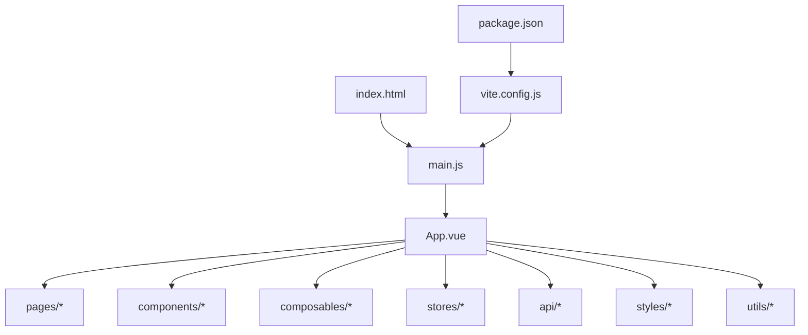
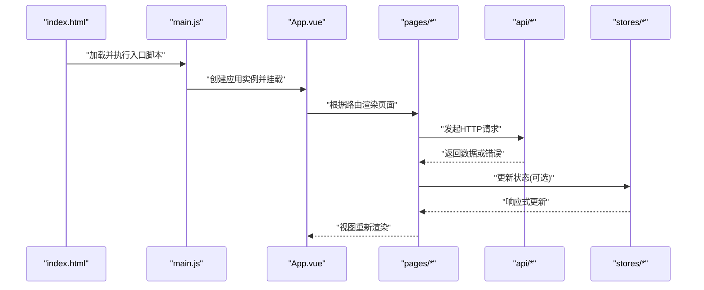
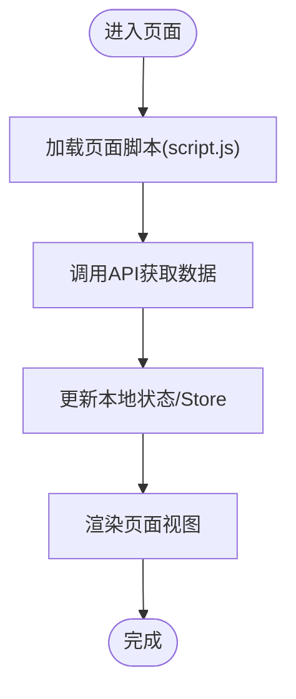
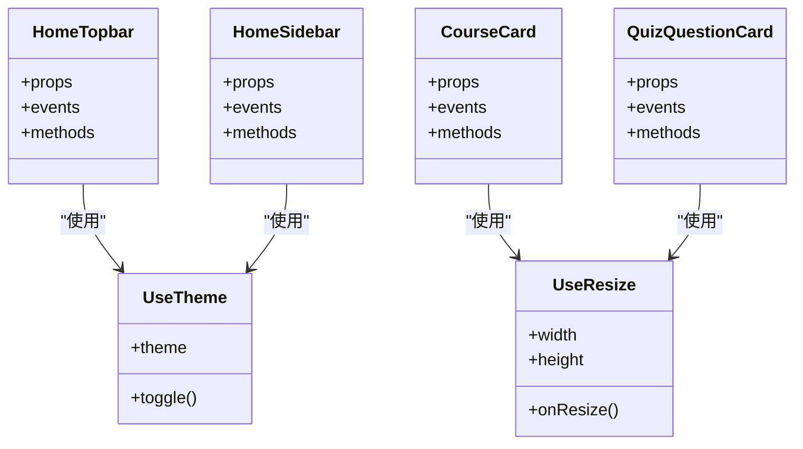
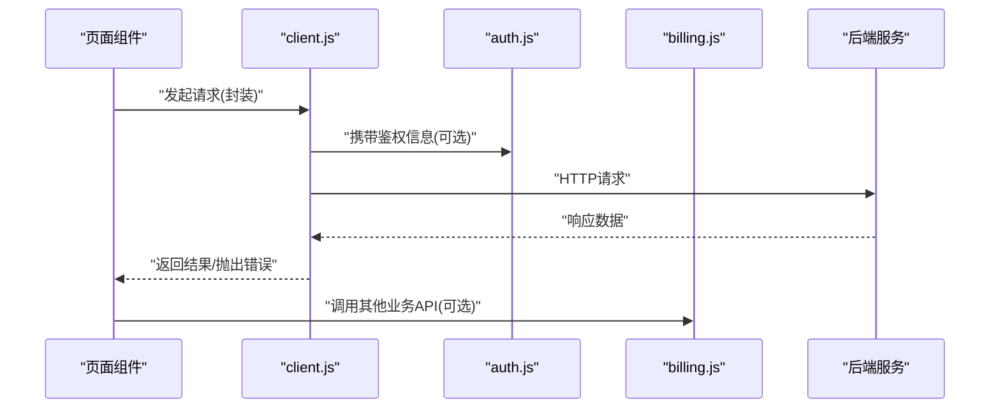
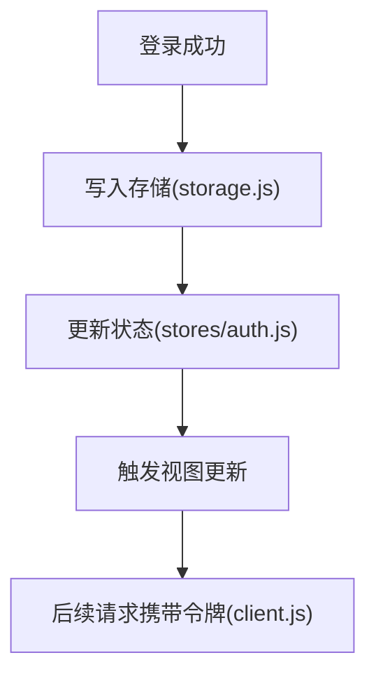
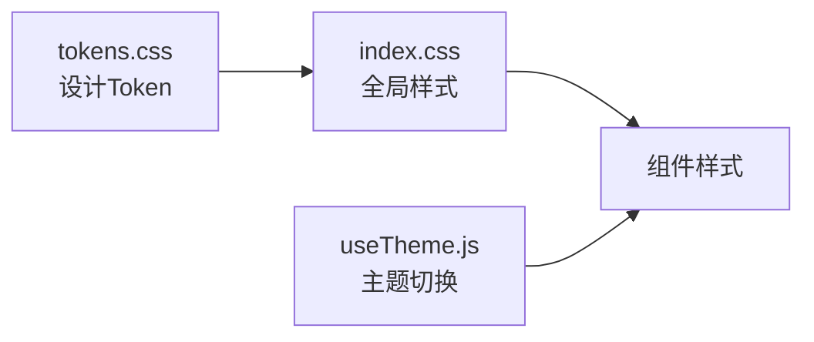
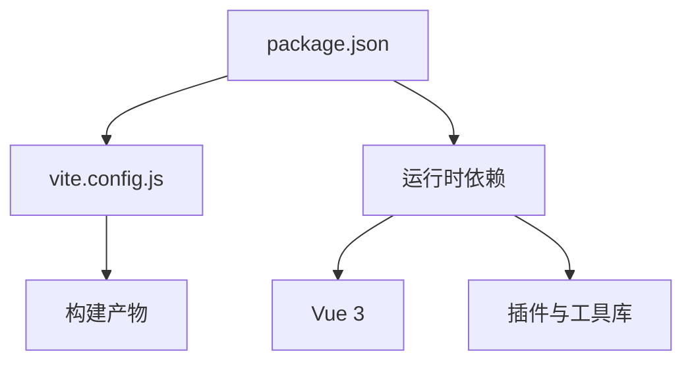

# Vue3架构与项目结构

<cite>
**本文引用的文件**   
- [index.html](file://WEB/index.html)
- [main.js](file://WEB/src/main.js)
- [App.vue](file://WEB/src/App.vue)
- [vite.config.js](file://WEB/vite.config.js)
- [package.json](file://WEB/package.json)
- [auth.js](file://WEB/src/api/auth.js)
- [billing.js](file://WEB/src/api/billing.js)
- [books.js](file://WEB/src/api/books.js)
- [client.js](file://WEB/src/api/client.js)
- [progress.js](file://WEB/src/api/progress.js)
- [quiz.js](file://WEB/src/api/quiz.js)
- [stats.js](file://WEB/src/api/stats.js)
- [HomeTopbar.vue](file://WEB/src/components/HomeTopbar.vue)
- [HomeSidebar.vue](file://WEB/src/components/HomeSidebar.vue)
- [CourseCard.vue](file://WEB/src/components/CourseCard.vue)
- [QuizQuestionCard.vue](file://WEB/src/components/quiz/QuizQuestionCard.vue)
- [useTheme.js](file://WEB/src/composables/useTheme.js)
- [useResize.js](file://WEB/src/composables/useResize.js)
- [auth.js](file://WEB/src/stores/auth.js)
- [index.css](file://WEB/src/styles/index.css)
- [tokens.css](file://WEB/src/styles/tokens.css)
- [storage.js](file://WEB/src/utils/storage.js)
- [login/index.vue](file://WEB/src/pages/login/index.vue)
- [login/script.js](file://WEB/src/pages/login/script.js)
- [home/script.js](file://WEB/src/pages/home/script.js)
- [study/index.vue](file://WEB/src/pages/study/index.vue)
- [study/script.js](file://WEB/src/pages/study/script.js)
- [quiz/index.vue](file://WEB/src/pages/quiz/index.vue)
- [quiz/script.js](file://WEB/src/pages/quiz/script.js)
- [quiz/report-script.js](file://WEB/src/pages/quiz/report-script.js)
- [billing/index.vue](file://WEB/src/pages/billing/index.vue)
- [billing/script.js](file://WEB/src/pages/billing/script.js)
</cite>

## 目录
1. [引言](#引言)
2. [项目结构](#项目结构)
3. [核心组件](#核心组件)
4. [架构总览](#架构总览)
5. [详细组件分析](#详细组件分析)
6. [依赖分析](#依赖分析)
7. [性能考虑](#性能考虑)
8. [故障排查指南](#故障排查指南)
9. [结论](#结论)
10. [附录](#附录)

## 引言
本文件面向基于Vue 3组合式API的前端工程，系统化梳理项目的架构设计、目录组织、构建配置、模块导入策略与环境变量管理。文档同时给出创建新页面与组件的最佳实践、组件通信模式与性能优化建议，并提供初始化流程与基础配置的参考路径，帮助读者快速上手与维护项目。

## 项目结构
本项目采用“功能域+职责分层”的目录组织方式：
- 入口与构建
  - index.html：应用根HTML模板
  - vite.config.js：Vite构建与插件配置
  - package.json：依赖与脚本定义
- 源码目录（src）
  - main.js：应用启动与插件注册
  - App.vue：根组件与全局布局
  - pages：按业务域划分的页面（如 login、home、study、quiz、billing），每个页面可包含视图与脚本逻辑
  - components：通用与领域组件（含 quiz 子目录）
  - composables：组合式函数（如主题、尺寸适配）
  - stores：状态管理（当前为轻量store）
  - api：HTTP接口封装
  - styles：样式资源（CSS与Token）
  - utils：工具函数（如本地存储）

图表来源
- [index.html:1-20](file://WEB/index.html#L1-L20)
- [main.js:1-40](file://WEB/src/main.js#L1-L40)
- [App.vue:1-60](file://WEB/src/App.vue#L1-L60)
- [vite.config.js:1-60](file://WEB/vite.config.js#L1-L60)
- [package.json:1-40](file://WEB/package.json#L1-L40)

章节来源
- [index.html:1-20](file://WEB/index.html#L1-L20)
- [main.js:1-40](file://WEB/src/main.js#L1-L40)
- [vite.config.js:1-60](file://WEB/vite.config.js#L1-L60)
- [package.json:1-40](file://WEB/package.json#L1-L40)

## 核心组件
- 根组件 App.vue：负责全局布局、路由容器与主题切换等横切关注点
- 页面组件：位于 pages 下，按业务域拆分，便于独立维护
- 通用组件：位于 components 下，提供UI能力与复用逻辑
- 组合式函数：composables 中封装跨组件复用的响应式逻辑（如 useTheme、useResize）
- 状态管理：stores 提供轻量级全局状态（如 auth）
- API层：api 目录统一封装请求与错误处理
- 样式系统：styles 集中管理全局样式与Token变量
- 工具库：utils 提供通用方法（如 storage）

章节来源
- [App.vue:1-60](file://WEB/src/App.vue#L1-L60)
- [useTheme.js:1-40](file://WEB/src/composables/useTheme.js#L1-L40)
- [useResize.js:1-40](file://WEB/src/composables/useResize.js#L1-L40)
- [auth.js](file://WEB/src/stores/auth.js)
- [client.js](file://WEB/src/api/client.js)
- [index.css](file://WEB/src/styles/index.css)
- [tokens.css](file://WEB/src/styles/tokens.css)
- [storage.js](file://WEB/src/utils/storage.js)

## 架构总览
下图展示了从入口到页面渲染的关键调用链与模块关系，体现“入口初始化→根组件挂载→页面加载→API调用→状态更新→视图渲染”的数据流。

图表来源
- [index.html:1-20](file://WEB/index.html#L1-L20)
- [main.js:1-40](file://WEB/src/main.js#L1-L40)
- [App.vue:1-60](file://WEB/src/App.vue#L1-L60)
- [client.js](file://WEB/src/api/client.js)
- [auth.js](file://WEB/src/stores/auth.js)

## 详细组件分析

### 页面组织与路由加载
- 页面目录：pages 下按功能域划分（如 login、home、study、quiz、billing）
- 页面脚本：每个页面可包含独立的 script.js，用于页面级逻辑与副作用
- 推荐做法：将页面内复杂逻辑抽离至 composables，保持页面简洁

图表来源
- [login/index.vue](file://WEB/src/pages/login/index.vue)
- [login/script.js](file://WEB/src/pages/login/script.js)
- [home/script.js](file://WEB/src/pages/home/script.js)
- [study/index.vue](file://WEB/src/pages/study/index.vue)
- [study/script.js](file://WEB/src/pages/study/script.js)
- [quiz/index.vue](file://WEB/src/pages/quiz/index.vue)
- [quiz/script.js](file://WEB/src/pages/quiz/script.js)
- [quiz/report-script.js](file://WEB/src/pages/quiz/report-script.js)
- [billing/index.vue](file://WEB/src/pages/billing/index.vue)
- [billing/script.js](file://WEB/src/pages/billing/script.js)

章节来源
- [login/index.vue](file://WEB/src/pages/login/index.vue)
- [login/script.js](file://WEB/src/pages/login/script.js)
- [home/script.js](file://WEB/src/pages/home/script.js)
- [study/index.vue](file://WEB/src/pages/study/index.vue)
- [study/script.js](file://WEB/src/pages/study/script.js)
- [quiz/index.vue](file://WEB/src/pages/quiz/index.vue)
- [quiz/script.js](file://WEB/src/pages/quiz/script.js)
- [quiz/report-script.js](file://WEB/src/pages/quiz/report-script.js)
- [billing/index.vue](file://WEB/src/pages/billing/index.vue)
- [billing/script.js](file://WEB/src/pages/billing/script.js)

### 通用组件与组合式函数
- 通用组件：如 HomeTopbar、HomeSidebar、CourseCard、QuizQuestionCard 等，聚焦UI与交互
- 组合式函数：useTheme 管理主题切换；useResize 处理窗口尺寸变化
- 最佳实践：将跨组件复用的响应式逻辑放入 composables，避免重复代码

图表来源
- [HomeTopbar.vue](file://WEB/src/components/HomeTopbar.vue)
- [HomeSidebar.vue](file://WEB/src/components/HomeSidebar.vue)
- [CourseCard.vue](file://WEB/src/components/CourseCard.vue)
- [QuizQuestionCard.vue](file://WEB/src/components/quiz/QuizQuestionCard.vue)
- [useTheme.js](file://WEB/src/composables/useTheme.js)
- [useResize.js](file://WEB/src/composables/useResize.js)

章节来源
- [HomeTopbar.vue](file://WEB/src/components/HomeTopbar.vue)
- [HomeSidebar.vue](file://WEB/src/components/HomeSidebar.vue)
- [CourseCard.vue](file://WEB/src/components/CourseCard.vue)
- [QuizQuestionCard.vue](file://WEB/src/components/quiz/QuizQuestionCard.vue)
- [useTheme.js](file://WEB/src/composables/useTheme.js)
- [useResize.js](file://WEB/src/composables/useResize.js)

### API层与请求封装
- client.js：统一封装HTTP客户端（如请求拦截、错误处理、超时设置）
- 各业务API：auth、billing、books、progress、quiz、stats 等分别对应不同领域接口
- 建议：在API层集中处理鉴权头、重试、错误码映射与日志记录

图表来源
- [client.js](file://WEB/src/api/client.js)
- [auth.js](file://WEB/src/api/auth.js)
- [billing.js](file://WEB/src/api/billing.js)
- [books.js](file://WEB/src/api/books.js)
- [progress.js](file://WEB/src/api/progress.js)
- [quiz.js](file://WEB/src/api/quiz.js)
- [stats.js](file://WEB/src/api/stats.js)

章节来源
- [client.js](file://WEB/src/api/client.js)
- [auth.js](file://WEB/src/api/auth.js)
- [billing.js](file://WEB/src/api/billing.js)
- [books.js](file://WEB/src/api/books.js)
- [progress.js](file://WEB/src/api/progress.js)
- [quiz.js](file://WEB/src/api/quiz.js)
- [stats.js](file://WEB/src/api/stats.js)

### 状态管理与本地存储
- stores/auth.js：轻量级用户认证状态管理
- utils/storage.js：封装localStorage/sessionStorage操作
- 建议：对敏感数据加密存储，统一访问入口，便于审计与替换

图表来源
- [auth.js](file://WEB/src/stores/auth.js)
- [storage.js](file://WEB/src/utils/storage.js)
- [client.js](file://WEB/src/api/client.js)

章节来源
- [auth.js](file://WEB/src/stores/auth.js)
- [storage.js](file://WEB/src/utils/storage.js)
- [client.js](file://WEB/src/api/client.js)

### 样式系统与主题
- styles/index.css：全局样式重置与基础样式
- styles/tokens.css：设计Token（颜色、字号、间距等）
- useTheme.js：运行时主题切换（支持暗黑模式）
- 建议：通过CSS变量实现主题切换，减少JS重绘

图表来源
- [index.css](file://WEB/src/styles/index.css)
- [tokens.css](file://WEB/src/styles/tokens.css)
- [useTheme.js](file://WEB/src/composables/useTheme.js)

章节来源
- [index.css](file://WEB/src/styles/index.css)
- [tokens.css](file://WEB/src/styles/tokens.css)
- [useTheme.js](file://WEB/src/composables/useTheme.js)

## 依赖分析
- 构建工具：Vite（vite.config.js）
- 包管理：npm/yarn（package.json）
- 运行时：Vue 3（组合式API）
- 第三方库：按需引入，避免打包体积膨胀

图表来源
- [package.json:1-40](file://WEB/package.json#L1-L40)
- [vite.config.js:1-60](file://WEB/vite.config.js#L1-L60)

章节来源
- [package.json:1-40](file://WEB/package.json#L1-L40)
- [vite.config.js:1-60](file://WEB/vite.config.js#L1-L60)

## 性能考虑
- 组件懒加载：页面与大型组件按需加载，减少首屏体积
- 虚拟滚动：长列表使用虚拟滚动提升渲染性能
- 缓存策略：合理使用浏览器缓存与服务端缓存
- 图片优化：压缩与懒加载，优先使用WebP格式
- 代码分割：按路由或功能域拆分bundle
- 内存管理：及时清理定时器与事件监听器

[本节为通用指导，不直接分析具体文件]

## 故障排查指南
- 网络请求失败：检查client.js的错误处理与重试逻辑
- 主题异常：确认useTheme.js的状态同步与CSS变量覆盖
- 存储读写问题：验证storage.js的键名与序列化逻辑
- 构建错误：核对vite.config.js插件与别名配置
- 依赖冲突：使用package-lock.json锁定版本，避免升级引发问题

章节来源
- [client.js](file://WEB/src/api/client.js)
- [useTheme.js](file://WEB/src/composables/useTheme.js)
- [storage.js](file://WEB/src/utils/storage.js)
- [vite.config.js:1-60](file://WEB/vite.config.js#L1-L60)
- [package.json:1-40](file://WEB/package.json#L1-L40)

## 结论
本项目以Vue 3组合式API为核心，采用清晰的目录结构与模块化设计，结合Vite构建与轻量状态管理，具备良好的可维护性与扩展性。遵循本文档的组织规范与最佳实践，可高效迭代新功能并保障整体质量。

[本节为总结性内容，不直接分析具体文件]

## 附录
- 新建页面步骤
  - 在 pages 下创建新目录与 index.vue
  - 如需页面级逻辑，添加 script.js
  - 在路由配置中注册新页面（若存在路由文件）
  - 在 App.vue 或布局组件中引用
- 新建组件步骤
  - 在 components 下创建 .vue 文件
  - 使用组合式API编写逻辑
  - 通过 props/events 与父组件通信
  - 在需要的页面或组件中引入使用
- 环境变量管理
  - 使用 .env 文件管理不同环境配置
  - 通过 import.meta.env 读取变量
  - 区分开发、测试、生产环境

[本节为通用指导，不直接分析具体文件]