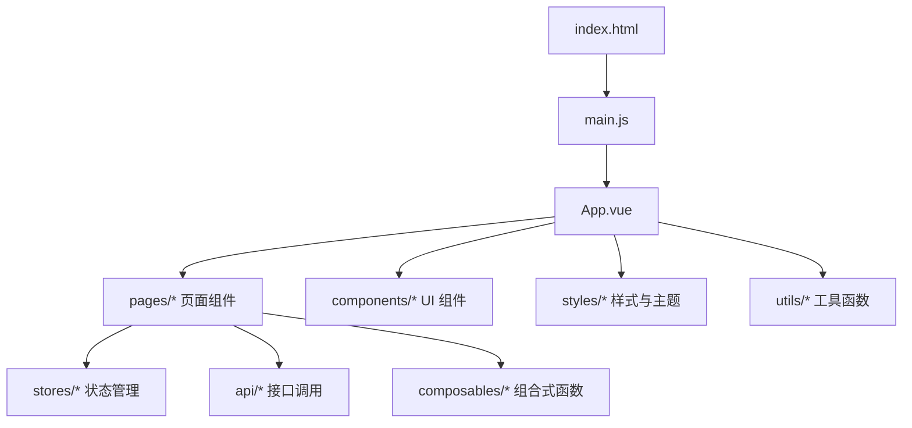
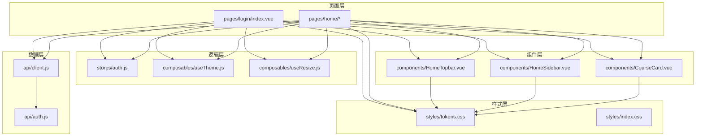
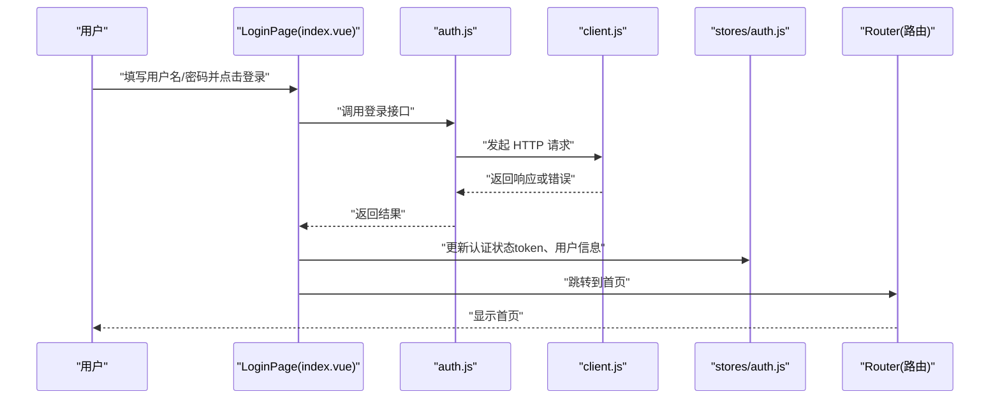
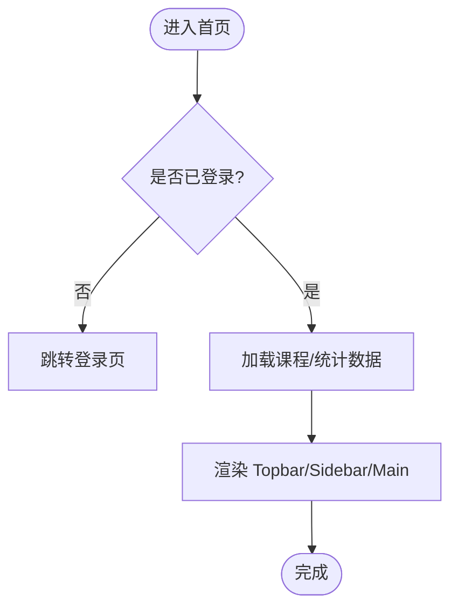
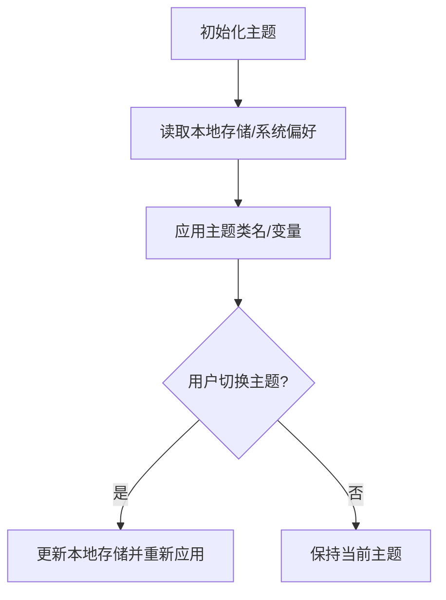
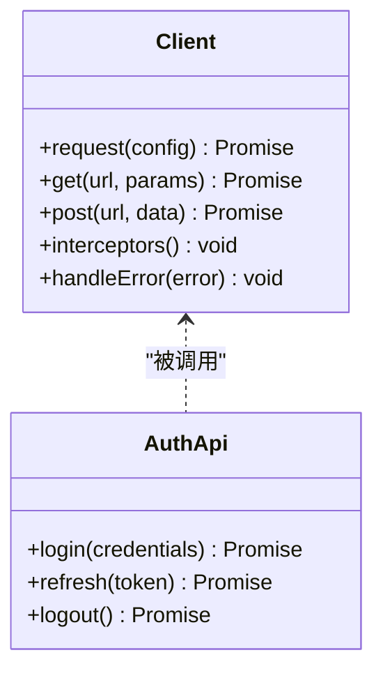
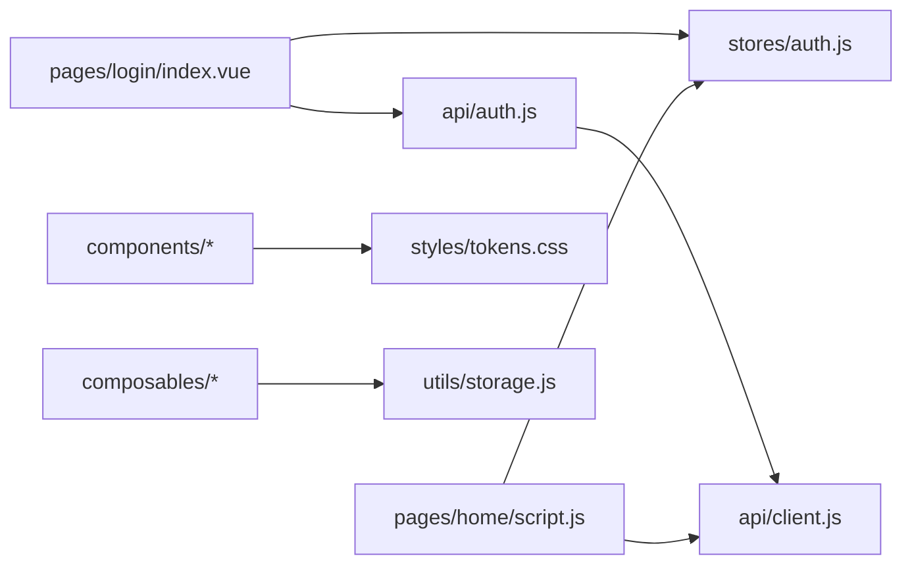

# 前端开发

<cite>
**本文引用的文件**   
- [main.js](file://WEB/src/main.js)
- [App.vue](file://WEB/src/App.vue)
- [index.html](file://WEB/index.html)
- [vite.config.js](file://WEB/vite.config.js)
- [package.json](file://WEB/package.json)
- [styles/index.css](file://WEB/src/styles/index.css)
- [styles/tokens.css](file://WEB/src/styles/tokens.css)
- [composables/useTheme.js](file://WEB/src/composables/useTheme.js)
- [composables/useResize.js](file://WEB/src/composables/useResize.js)
- [stores/auth.js](file://WEB/src/stores/auth.js)
- [api/client.js](file://WEB/src/api/client.js)
- [api/auth.js](file://WEB/src/api/auth.js)
- [pages/login/index.vue](file://WEB/src/pages/login/index.vue)
- [pages/login/script.js](file://WEB/src/pages/login/script.js)
- [pages/home/script.js](file://WEB/src/pages/home/script.js)
- [components/HomeTopbar.vue](file://WEB/src/components/HomeTopbar.vue)
- [components/HomeSidebar.vue](file://WEB/src/components/HomeSidebar.vue)
- [components/CourseCard.vue](file://WEB/src/components/CourseCard.vue)
- [utils/storage.js](file://WEB/src/utils/storage.js)
</cite>

## 目录
1. [简介](#简介)
2. [项目结构](#项目结构)
3. [核心组件](#核心组件)
4. [架构总览](#架构总览)
5. [详细组件分析](#详细组件分析)
6. [依赖关系分析](#依赖关系分析)
7. [性能考虑](#性能考虑)
8. [故障排查指南](#故障排查指南)
9. [结论](#结论)
10. [附录](#附录)

## 简介
本文件面向“金毛教你学重构版”的前端工程，基于 Vue 3 组合式 API 与 Vite 构建工具链，提供从架构到实践的系统化文档。内容涵盖：
- 单文件组件（SFC）开发规范与页面/UI 组件组织方式
- 状态管理方案（stores）、路由配置、API 客户端封装
- 主题系统与暗黑模式实现
- 响应式设计与移动端适配策略
- 性能优化技巧与跨浏览器兼容性处理
- 新增页面、组件、API 接口的标准流程与示例路径

## 项目结构
前端代码位于 WEB 目录，采用按功能域划分的目录组织：
- src/api：HTTP 请求封装与各模块接口定义
- src/components：可复用 UI 组件
- src/composables：组合式函数（如主题、尺寸监听）
- src/pages：页面级组件（含 script 逻辑分离）
- src/stores：全局状态（当前为认证状态）
- src/styles：样式入口与 CSS 变量（tokens）
- src/utils：通用工具（如存储封装）
- 根目录 index.html、main.js、App.vue 为应用入口与根组件
- vite.config.js、package.json 为构建与依赖配置

图表来源
- [index.html:1-50](file://WEB/index.html#L1-L50)
- [main.js:1-80](file://WEB/src/main.js#L1-L80)
- [App.vue:1-120](file://WEB/src/App.vue#L1-L120)

章节来源
- [index.html:1-50](file://WEB/index.html#L1-L50)
- [main.js:1-80](file://WEB/src/main.js#L1-L80)
- [App.vue:1-120](file://WEB/src/App.vue#L1-L120)
- [vite.config.js:1-120](file://WEB/vite.config.js#L1-L120)
- [package.json:1-120](file://WEB/package.json#L1-L120)

## 核心组件
- 应用入口与根组件
  - main.js：初始化 Vue 应用、挂载根组件、注册插件与全局配置
  - App.vue：根布局、全局样式注入、主题切换入口、路由容器占位
- 页面组件
  - pages/login：登录页，包含模板与脚本分离（index.vue + script.js）
  - pages/home：首页骨架与脚本（script.js），配合 HomeTopbar/HomeSidebar 等组件
- UI 组件
  - components/HomeTopbar.vue：顶部导航栏
  - components/HomeSidebar.vue：侧边栏
  - components/CourseCard.vue：课程卡片展示
- 状态管理
  - stores/auth.js：用户认证状态（登录态、用户信息、方法）
- 组合式函数
  - composables/useTheme.js：主题切换、暗黑模式持久化
  - composables/useResize.js：窗口尺寸监听与断点判断
- 样式系统
  - styles/index.css：全局样式入口
  - styles/tokens.css：CSS 自定义属性（颜色、字号、间距等）
- 工具与存储
  - utils/storage.js：localStorage/sessionStorage 封装

章节来源
- [main.js:1-80](file://WEB/src/main.js#L1-L80)
- [App.vue:1-120](file://WEB/src/App.vue#L1-L120)
- [pages/login/index.vue:1-200](file://WEB/src/pages/login/index.vue#L1-L200)
- [pages/login/script.js:1-120](file://WEB/src/pages/login/script.js#L1-L120)
- [pages/home/script.js:1-120](file://WEB/src/pages/home/script.js#L1-L120)
- [components/HomeTopbar.vue:1-120](file://WEB/src/components/HomeTopbar.vue#L1-L120)
- [components/HomeSidebar.vue:1-120](file://WEB/src/components/HomeSidebar.vue#L1-L120)
- [components/CourseCard.vue:1-120](file://WEB/src/components/CourseCard.vue#L1-L120)
- [stores/auth.js:1-120](file://WEB/src/stores/auth.js#L1-L120)
- [composables/useTheme.js:1-120](file://WEB/src/composables/useTheme.js#L1-L120)
- [composables/useResize.js:1-120](file://WEB/src/composables/useResize.js#L1-L120)
- [styles/index.css:1-120](file://WEB/src/styles/index.css#L1-L120)
- [styles/tokens.css:1-120](file://WEB/src/styles/tokens.css#L1-L120)
- [utils/storage.js:1-120](file://WEB/src/utils/storage.js#L1-L120)

## 架构总览
整体采用“页面组件 + UI 组件 + 组合式函数 + 状态管理 + API 客户端”的分层架构：
- 页面组件负责视图与业务编排，通过组合式函数获取能力（主题、尺寸等）
- 状态管理集中维护跨页面共享数据（如认证态）
- API 客户端统一封装请求、拦截器、错误处理
- 主题系统通过 CSS 变量与组合式函数驱动，支持暗黑模式
- 构建与运行由 Vite 提供，开发体验与打包优化开箱即用

图表来源
- [pages/login/index.vue:1-200](file://WEB/src/pages/login/index.vue#L1-L200)
- [pages/home/script.js:1-120](file://WEB/src/pages/home/script.js#L1-L120)
- [components/HomeTopbar.vue:1-120](file://WEB/src/components/HomeTopbar.vue#L1-L120)
- [components/HomeSidebar.vue:1-120](file://WEB/src/components/HomeSidebar.vue#L1-L120)
- [components/CourseCard.vue:1-120](file://WEB/src/components/CourseCard.vue#L1-L120)
- [stores/auth.js:1-120](file://WEB/src/stores/auth.js#L1-L120)
- [composables/useTheme.js:1-120](file://WEB/src/composables/useTheme.js#L1-L120)
- [composables/useResize.js:1-120](file://WEB/src/composables/useResize.js#L1-L120)
- [api/client.js:1-120](file://WEB/src/api/client.js#L1-L120)
- [api/auth.js:1-120](file://WEB/src/api/auth.js#L1-L120)
- [styles/tokens.css:1-120](file://WEB/src/styles/tokens.css#L1-L120)
- [styles/index.css:1-120](file://WEB/src/styles/index.css#L1-L120)

## 详细组件分析

### 登录页面（pages/login）
- 职责：用户输入校验、调用认证接口、更新认证状态、跳转首页
- 关键交互：表单提交 -> 调用 api/auth -> 更新 stores/auth -> 路由跳转
- 组合式使用：useTheme（主题切换）、useResize（移动端适配）

图表来源
- [pages/login/index.vue:1-200](file://WEB/src/pages/login/index.vue#L1-L200)
- [pages/login/script.js:1-120](file://WEB/src/pages/login/script.js#L1-L120)
- [api/auth.js:1-120](file://WEB/src/api/auth.js#L1-L120)
- [api/client.js:1-120](file://WEB/src/api/client.js#L1-L120)
- [stores/auth.js:1-120](file://WEB/src/stores/auth.js#L1-L120)

章节来源
- [pages/login/index.vue:1-200](file://WEB/src/pages/login/index.vue#L1-L200)
- [pages/login/script.js:1-120](file://WEB/src/pages/login/script.js#L1-L120)
- [api/auth.js:1-120](file://WEB/src/api/auth.js#L1-L120)
- [api/client.js:1-120](file://WEB/src/api/client.js#L1-L120)
- [stores/auth.js:1-120](file://WEB/src/stores/auth.js#L1-L120)

### 首页（pages/home）
- 职责：聚合顶部栏、侧边栏与主内容区；加载课程列表、统计信息等
- 组合式使用：useResize 用于断点判断以切换布局；useTheme 控制主题
- 数据流：页面脚本 -> API 调用 -> 更新本地状态 -> 渲染组件

图表来源
- [pages/home/script.js:1-120](file://WEB/src/pages/home/script.js#L1-L120)
- [components/HomeTopbar.vue:1-120](file://WEB/src/components/HomeTopbar.vue#L1-L120)
- [components/HomeSidebar.vue:1-120](file://WEB/src/components/HomeSidebar.vue#L1-L120)

章节来源
- [pages/home/script.js:1-120](file://WEB/src/pages/home/script.js#L1-L120)
- [components/HomeTopbar.vue:1-120](file://WEB/src/components/HomeTopbar.vue#L1-L120)
- [components/HomeSidebar.vue:1-120](file://WEB/src/components/HomeSidebar.vue#L1-L120)

### 主题系统（composables/useTheme）
- 职责：读取/设置主题、持久化到本地存储、监听系统偏好
- 关键点：CSS 变量切换、类名切换、默认主题回退

图表来源
- [composables/useTheme.js:1-120](file://WEB/src/composables/useTheme.js#L1-L120)
- [styles/tokens.css:1-120](file://WEB/src/styles/tokens.css#L1-L120)

章节来源
- [composables/useTheme.js:1-120](file://WEB/src/composables/useTheme.js#L1-L120)
- [styles/tokens.css:1-120](file://WEB/src/styles/tokens.css#L1-L120)

### 响应式与尺寸监听（composables/useResize）
- 职责：监听 window 尺寸变化，暴露断点判断方法
- 用途：在页面/组件中根据断点切换布局或行为

章节来源
- [composables/useResize.js:1-120](file://WEB/src/composables/useResize.js#L1-L120)

### 认证状态（stores/auth）
- 职责：维护 token、用户信息、登录/登出方法
- 关键点：响应式状态、持久化、副作用清理

章节来源
- [stores/auth.js:1-120](file://WEB/src/stores/auth.js#L1-L120)

### API 客户端（api/client.js, api/auth.js）
- client.js：统一封装 fetch/axios 请求、拦截器、错误处理、超时与重试策略
- auth.js：封装认证相关接口（登录、刷新、注销等）

图表来源
- [api/client.js:1-120](file://WEB/src/api/client.js#L1-L120)
- [api/auth.js:1-120](file://WEB/src/api/auth.js#L1-L120)

章节来源
- [api/client.js:1-120](file://WEB/src/api/client.js#L1-L120)
- [api/auth.js:1-120](file://WEB/src/api/auth.js#L1-L120)

### 样式系统与令牌（styles/tokens.css, styles/index.css）
- tokens.css：定义 CSS 自定义属性（颜色、字体、间距、阴影等）
- index.css：全局重置、基础样式、主题变量注入

章节来源
- [styles/tokens.css:1-120](file://WEB/src/styles/tokens.css#L1-L120)
- [styles/index.css:1-120](file://WEB/src/styles/index.css#L1-L120)

### 存储工具（utils/storage.js）
- 职责：封装 localStorage/sessionStorage 的读写、序列化、过期时间管理

章节来源
- [utils/storage.js:1-120](file://WEB/src/utils/storage.js#L1-L120)

## 依赖关系分析
- 页面组件依赖 UI 组件、组合式函数、状态管理与 API 客户端
- 组合式函数无外部强依赖，仅依赖浏览器 API 与本地存储
- 状态管理独立于 UI，便于跨页面共享
- API 客户端作为数据层入口，被各模块复用

图表来源
- [pages/login/index.vue:1-200](file://WEB/src/pages/login/index.vue#L1-L200)
- [pages/home/script.js:1-120](file://WEB/src/pages/home/script.js#L1-L120)
- [stores/auth.js:1-120](file://WEB/src/stores/auth.js#L1-L120)
- [api/auth.js:1-120](file://WEB/src/api/auth.js#L1-L120)
- [api/client.js:1-120](file://WEB/src/api/client.js#L1-L120)
- [styles/tokens.css:1-120](file://WEB/src/styles/tokens.css#L1-L120)
- [utils/storage.js:1-120](file://WEB/src/utils/storage.js#L1-L120)

章节来源
- [pages/login/index.vue:1-200](file://WEB/src/pages/login/index.vue#L1-L200)
- [pages/home/script.js:1-120](file://WEB/src/pages/home/script.js#L1-L120)
- [stores/auth.js:1-120](file://WEB/src/stores/auth.js#L1-L120)
- [api/auth.js:1-120](file://WEB/src/api/auth.js#L1-L120)
- [api/client.js:1-120](file://WEB/src/api/client.js#L1-L120)
- [styles/tokens.css:1-120](file://WEB/src/styles/tokens.css#L1-L120)
- [utils/storage.js:1-120](file://WEB/src/utils/storage.js#L1-L120)

## 性能考虑
- 组件懒加载与路由级拆分：按需加载页面组件，减少首屏体积
- 资源优化：图片压缩、字体子集化、静态资源 CDN 缓存
- 请求优化：合并请求、缓存策略（ETag/Cache-Control）、失败重试与超时控制
- 渲染优化：避免不必要的重渲染，合理使用 v-memo、computed、watch 节流
- 主题切换开销：通过 CSS 变量与类名切换，避免频繁 DOM 操作
- 构建优化：Vite 预构建、Tree Shaking、分包策略

[本节为通用指导，不直接分析具体文件]

## 故障排查指南
- 登录失败
  - 检查网络与后端接口可达性
  - 查看 client.js 的错误拦截与日志输出
  - 确认 stores/auth.js 的状态更新逻辑
- 主题异常
  - 检查 useTheme.js 的本地存储读写与类名切换
  - 确认 tokens.css 变量定义与覆盖优先级
- 响应式布局错乱
  - 使用 useResize.js 打印断点值，验证媒体查询与条件渲染
- 构建问题
  - 核对 vite.config.js 的别名与插件配置
  - 检查 package.json 依赖版本与 Node 版本

章节来源
- [api/client.js:1-120](file://WEB/src/api/client.js#L1-L120)
- [stores/auth.js:1-120](file://WEB/src/stores/auth.js#L1-L120)
- [composables/useTheme.js:1-120](file://WEB/src/composables/useTheme.js#L1-L120)
- [composables/useResize.js:1-120](file://WEB/src/composables/useResize.js#L1-L120)
- [vite.config.js:1-120](file://WEB/vite.config.js#L1-L120)
- [package.json:1-120](file://WEB/package.json#L1-L120)

## 结论
本项目以 Vue 3 组合式 API 为核心，结合 Vite 构建体系，形成了清晰的分层架构与可扩展的组件生态。通过统一的 API 客户端、集中的状态管理与灵活的样式系统，实现了良好的可维护性与用户体验。遵循本文档的规范与实践，可高效地扩展新功能与优化性能。

[本节为总结，不直接分析具体文件]

## 附录

### 新增页面步骤（示例：新增“学习”页面）
- 创建页面文件：src/pages/study/index.vue
- 编写脚本逻辑：src/pages/study/script.js（可选）
- 在路由中注册该页面（若存在路由配置文件）
- 在 App.vue 或布局组件中添加导航入口
- 如需主题/尺寸能力，引入 useTheme/useResize
- 如需数据，调用 api/* 并更新 stores/*

章节来源
- [pages/study/index.vue:1-120](file://WEB/src/pages/study/index.vue#L1-L120)
- [pages/study/script.js:1-120](file://WEB/src/pages/study/script.js#L1-L120)
- [App.vue:1-120](file://WEB/src/App.vue#L1-L120)

### 新增 UI 组件步骤（示例：新增“课程卡片”）
- 创建组件文件：src/components/CourseCard.vue
- 定义 props、emits、插槽与内部状态
- 在页面中按需引入并使用
- 使用 tokens.css 中的变量保证主题一致

章节来源
- [components/CourseCard.vue:1-120](file://WEB/src/components/CourseCard.vue#L1-L120)
- [styles/tokens.css:1-120](file://WEB/src/styles/tokens.css#L1-L120)

### 新增 API 接口步骤（示例：新增“进度”接口）
- 在 api/client.js 中确保请求封装可用
- 在对应模块文件中定义接口方法（如 progress.js）
- 在页面或 store 中调用接口并处理响应/错误
- 必要时添加缓存与重试策略

章节来源
- [api/client.js:1-120](file://WEB/src/api/client.js#L1-L120)
- [api/progress.js:1-120](file://WEB/src/api/progress.js#L1-L120)

### 样式系统与暗黑模式最佳实践
- 将颜色、字号、间距等抽象为 tokens.css 变量
- 通过 useTheme.js 切换类名或变量值，避免硬编码
- 使用 CSS 变量继承与覆盖机制，确保组件主题一致性
- 在暗黑模式下，注意对比度与可读性测试

章节来源
- [styles/tokens.css:1-120](file://WEB/src/styles/tokens.css#L1-L120)
- [composables/useTheme.js:1-120](file://WEB/src/composables/useTheme.js#L1-L120)

### 移动端适配策略
- 使用 useResize.js 监听尺寸变化，动态切换布局
- 优先使用弹性布局与相对单位（rem/em/%）
- 针对小屏幕优化交互（触摸友好、手势支持）
- 使用媒体查询与组件级条件渲染

章节来源
- [composables/useResize.js:1-120](file://WEB/src/composables/useResize.js#L1-L120)

### 跨浏览器兼容性处理
- 使用现代浏览器特性时提供降级方案
- 对 fetch/XMLHttpRequest 进行兼容封装
- 注意 CSS 变量与动画在不同浏览器的表现差异
- 构建阶段启用必要的 polyfill 与转译

章节来源
- [api/client.js:1-120](file://WEB/src/api/client.js#L1-L120)
- [vite.config.js:1-120](file://WEB/vite.config.js#L1-L120)