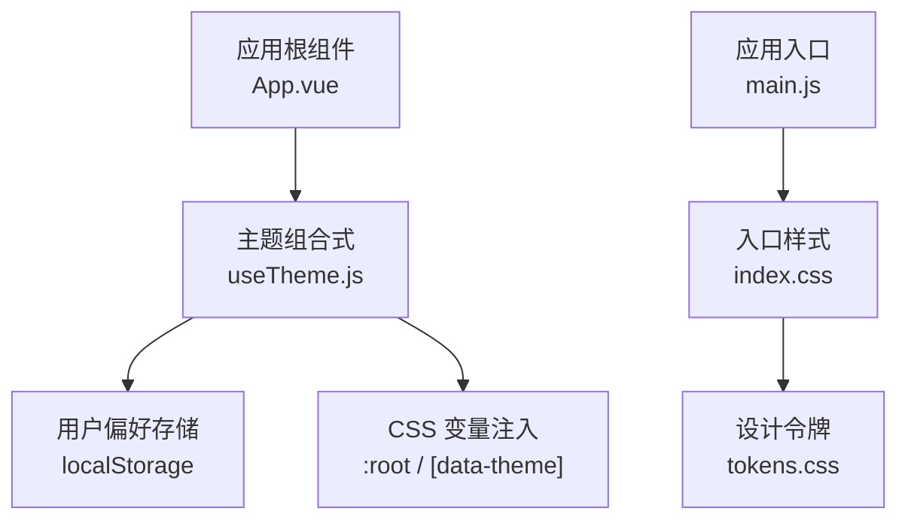
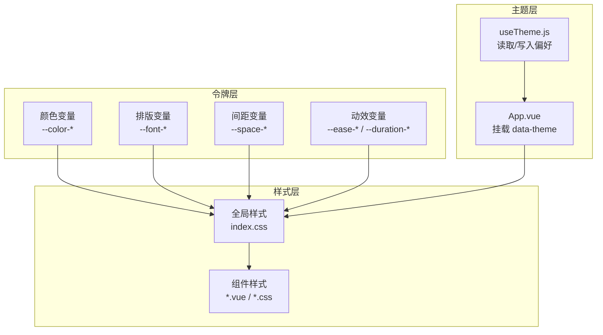
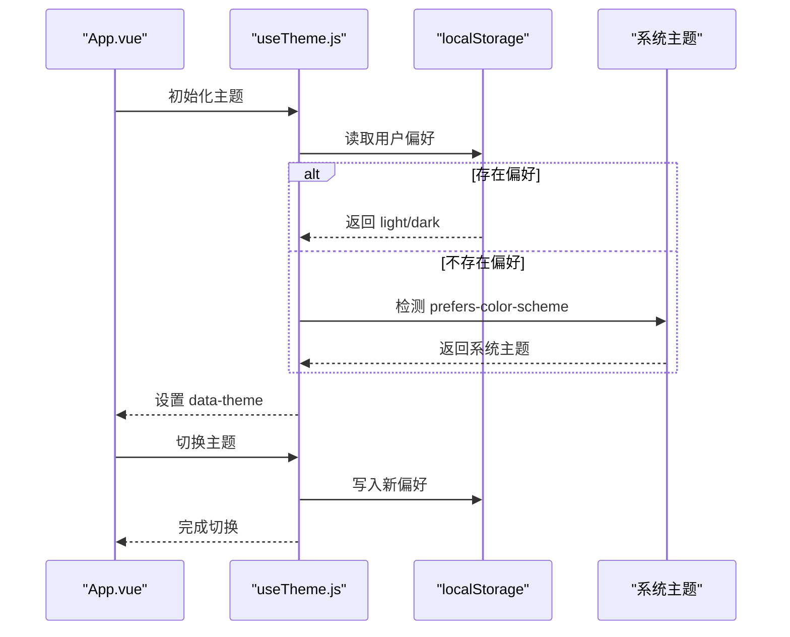
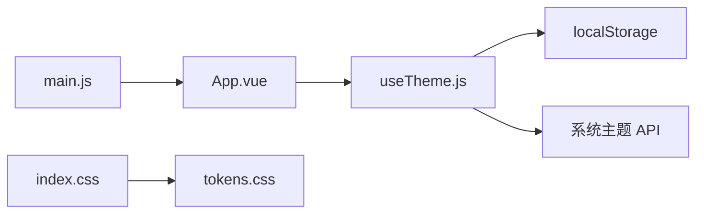

# 样式系统

<cite>
**本文引用的文件**   
- [index.css](file://WEB/src/styles/index.css)
- [tokens.css](file://WEB/src/styles/tokens.css)
- [useTheme.js](file://WEB/src/composables/useTheme.js)
- [App.vue](file://WEB/src/App.vue)
- [main.js](file://WEB/src/main.js)
- [前端暗黑模式规范手册.md](file://WEB/docs/前端暗黑模式规范手册.md)
</cite>

## 目录
1. [简介](#简介)
2. [项目结构](#项目结构)
3. [核心组件](#核心组件)
4. [架构总览](#架构总览)
5. [详细组件分析](#详细组件分析)
6. [依赖分析](#依赖分析)
7. [性能考虑](#性能考虑)
8. [故障排查指南](#故障排查指南)
9. [结论](#结论)
10. [附录](#附录)

## 简介
本文件系统化梳理该项目的样式体系，重点覆盖：
- CSS 架构设计与模块化组织
- CSS 变量（设计令牌）的命名、分层与使用规范
- 主题系统与暗黑模式的完整实现方案
- 响应式设计与移动端适配策略
- 跨浏览器兼容性处理
- BEM 命名约定与样式最佳实践
- 复杂 UI 效果与动画的实现示例与参考路径

目标是让开发者快速理解并高效扩展样式系统，确保一致性与可维护性。

## 项目结构
样式相关代码集中在 WEB 子项目中，采用“入口样式 + 设计令牌”的双层结构：
- 入口样式：统一引入全局样式与基础重置
- 设计令牌：集中管理颜色、字号、间距、圆角等设计变量
- 主题切换：通过组合式函数读取/写入用户偏好，动态切换主题

**图表来源**
- [index.css](file://WEB/src/styles/index.css)
- [tokens.css](file://WEB/src/styles/tokens.css)
- [useTheme.js](file://WEB/src/composables/useTheme.js)
- [App.vue](file://WEB/src/App.vue)
- [main.js](file://WEB/src/main.js)

**章节来源**
- [index.css](file://WEB/src/styles/index.css)
- [tokens.css](file://WEB/src/styles/tokens.css)
- [useTheme.js](file://WEB/src/composables/useTheme.js)
- [App.vue](file://WEB/src/App.vue)
- [main.js](file://WEB/src/main.js)

## 核心组件
- 设计令牌（tokens.css）
  - 定义全局 CSS 变量，按语义化分组：颜色、字体、间距、阴影、圆角、过渡时长等
  - 提供明/暗两套变量集，通过 data-theme 或类名切换
- 入口样式（index.css）
  - 引入 tokens.css，设置全局基础样式、重置、排版与布局基线
- 主题组合式（useTheme.js）
  - 暴露获取当前主题、切换主题、持久化用户偏好的方法
  - 监听系统级 prefers-color-scheme，自动回退到系统主题
- 应用根组件（App.vue）
  - 初始化主题状态，挂载数据属性或类名以驱动 CSS 变量生效
- 应用入口（main.js）
  - 启动应用前加载必要样式与主题初始值

**章节来源**
- [tokens.css](file://WEB/src/styles/tokens.css)
- [index.css](file://WEB/src/styles/index.css)
- [useTheme.js](file://WEB/src/composables/useTheme.js)
- [App.vue](file://WEB/src/App.vue)
- [main.js](file://WEB/src/main.js)

## 架构总览
样式系统遵循“令牌优先、组件复用、主题解耦”的原则：
- 令牌层：所有视觉常量集中于 tokens.css，禁止在组件中硬编码颜色与尺寸
- 样式层：index.css 负责全局与基础样式；组件样式按需引入或使用 scoped 样式
- 主题层：通过 data-theme 或类名切换，配合 useTheme.js 完成运行时切换与持久化
- 响应式层：基于媒体查询与弹性布局，保证多端一致性体验

**图表来源**
- [tokens.css](file://WEB/src/styles/tokens.css)
- [index.css](file://WEB/src/styles/index.css)
- [useTheme.js](file://WEB/src/composables/useTheme.js)
- [App.vue](file://WEB/src/App.vue)

## 详细组件分析

### 设计令牌（tokens.css）
- 变量分层建议
  - 语义层：--color-primary, --color-bg-base, --color-text-default 等
  - 物理层：--radius-md, --shadow-sm, --space-4 等
  - 动效层：--ease-out, --duration-fast 等
- 主题切换机制
  - :root 定义默认（浅色）变量
  - [data-theme="dark"] 覆盖为深色变量
  - 支持 prefers-color-scheme 自动回退
- 使用规范
  - 组件样式只引用语义层变量，避免直接引用物理层
  - 新增变量需同步更新文档与校验脚本（如有）

**章节来源**
- [tokens.css](file://WEB/src/styles/tokens.css)

### 入口样式（index.css）
- 职责
  - 引入 tokens.css
  - 设置全局 box-sizing、滚动条、排版基线、链接与按钮基础态
  - 提供常用布局容器与栅格基础类
- 注意事项
  - 避免在 index.css 中写业务样式
  - 保持最小化，提升首屏渲染性能

**章节来源**
- [index.css](file://WEB/src/styles/index.css)

### 主题组合式（useTheme.js）
- 能力
  - 获取当前主题（light/dark/system）
  - 切换主题并持久化至 localStorage
  - 监听系统主题变化，自动同步
- 关键流程
  - 初始化：读取本地缓存 → 无则检测系统偏好 → 设置 data-theme
  - 切换：更新 data-theme → 写入 localStorage → 触发重绘
  - 监听：window.matchMedia("prefers-color-scheme") 变更时同步

**图表来源**
- [useTheme.js](file://WEB/src/composables/useTheme.js)
- [App.vue](file://WEB/src/App.vue)

**章节来源**
- [useTheme.js](file://WEB/src/composables/useTheme.js)

### 应用根组件（App.vue）与入口（main.js）
- App.vue
  - 在 mounted/onMounted 阶段调用 useTheme 初始化主题
  - 将 data-theme 绑定到根节点，确保全局变量生效
- main.js
  - 先加载全局样式，再挂载应用实例
  - 确保主题变量在首次渲染前可用

**章节来源**
- [App.vue](file://WEB/src/App.vue)
- [main.js](file://WEB/src/main.js)

### 暗黑模式规范（文档）
- 内容要点
  - 颜色对比度要求、无障碍标准
  - 组件适配清单与验收标准
  - 主题切换交互与反馈
- 作用
  - 作为团队统一的暗黑模式开发规范与检查依据

**章节来源**
- [前端暗黑模式规范手册.md](file://WEB/docs/前端暗黑模式规范手册.md)

## 依赖分析
- 模块依赖关系
  - index.css 依赖 tokens.css
  - App.vue 依赖 useTheme.js
  - main.js 依赖 index.css 与 App.vue
- 外部依赖
  - 浏览器 API：localStorage、matchMedia
  - CSS 特性：:root、[data-theme]、CSS 变量、媒体查询

**图表来源**
- [main.js](file://WEB/src/main.js)
- [App.vue](file://WEB/src/App.vue)
- [useTheme.js](file://WEB/src/composables/useTheme.js)
- [index.css](file://WEB/src/styles/index.css)
- [tokens.css](file://WEB/src/styles/tokens.css)

**章节来源**
- [main.js](file://WEB/src/main.js)
- [App.vue](file://WEB/src/App.vue)
- [useTheme.js](file://WEB/src/composables/useTheme.js)
- [index.css](file://WEB/src/styles/index.css)
- [tokens.css](file://WEB/src/styles/tokens.css)

## 性能考虑
- 样式加载
  - 将 tokens.css 与 index.css 合并或内联，减少请求数
  - 使用 CSS 变量替代重复计算，降低样式体积
- 主题切换
  - 仅切换 data-theme，避免全量重排
  - 避免在切换过程中执行昂贵动画
- 响应式
  - 合理使用媒体查询断点，避免过多层级嵌套
  - 移动端优先，逐步增强桌面端样式

## 故障排查指南
- 主题未生效
  - 检查 App.vue 是否在挂载后设置 data-theme
  - 确认 tokens.css 已正确引入且变量未被覆盖
- 暗黑模式下对比度不足
  - 对照《前端暗黑模式规范手册》调整颜色变量
  - 使用浏览器无障碍检查工具验证
- 切换闪烁
  - 在 main.js 中尽早设置 data-theme，避免 FOUC
  - 必要时在 <head> 中内联最小主题变量

**章节来源**
- [前端暗黑模式规范手册.md](file://WEB/docs/前端暗黑模式规范手册.md)
- [App.vue](file://WEB/src/App.vue)
- [index.css](file://WEB/src/styles/index.css)
- [tokens.css](file://WEB/src/styles/tokens.css)

## 结论
本项目样式系统以“令牌先行、主题解耦、响应式友好”为核心，通过 tokens.css 统一管理设计变量，useTheme.js 实现主题切换与持久化，App.vue 与 main.js 保障初始化顺序与性能。遵循本文档的规范与实践，可在保证一致性的前提下高效扩展与迭代。

## 附录

### 样式组织规范与 BEM 约定
- 文件组织
  - 全局样式：index.css
  - 设计令牌：tokens.css
  - 组件样式：优先使用 scoped 或独立 .module.css
- BEM 命名
  - Block：页面级模块，如 card
  - Element：块内元素，如 card__title
  - Modifier：修饰符，如 card--primary
- 模块化最佳实践
  - 组件样式与逻辑同目录存放
  - 公共样式抽取至 tokens 与 index
  - 避免深层嵌套，限制选择器复杂度

### 响应式设计与移动端适配
- 断点策略
  - 移动优先：base → sm → md → lg → xl
  - 使用 rem/em 结合视口单位 vw/vh
- 布局模式
  - Flexbox 为主，Grid 用于二维布局
  - 图片与媒体使用 max-width: 100%
- 交互优化
  - 触摸目标 ≥ 44px
  - 避免 hover-only 的关键操作

### 跨浏览器兼容性
- 特性检测
  - CSS 变量：现代浏览器均支持
  - matchMedia：广泛支持，必要时 polyfill
- 降级策略
  - 对不支持的特性提供静态回退值
  - 使用 autoprefixer 与兼容目标配置

### 复杂 UI 效果与动画示例（参考路径）
- 卡片悬停与入场动画
  - 参考组件样式中的过渡与变换用法
- 表单输入聚焦高亮
  - 使用 CSS 变量控制边框与阴影
- 列表项滑入与排序动画
  - 使用 transition-group 或 FLIP 技巧

[本节为概念性说明，不直接分析具体文件，故不附“章节来源”]