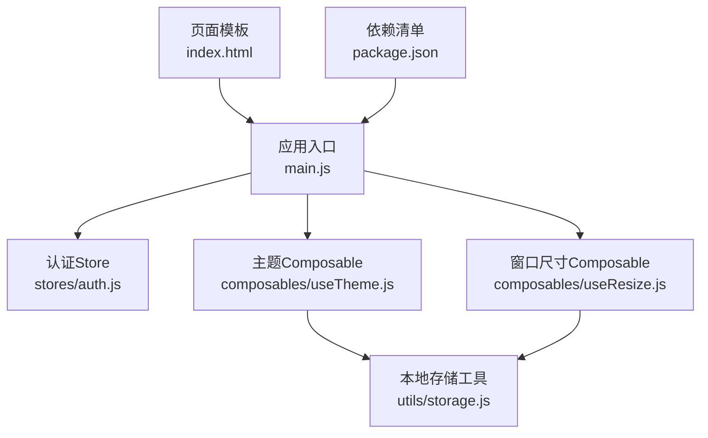
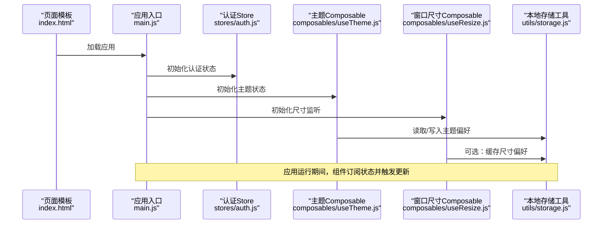
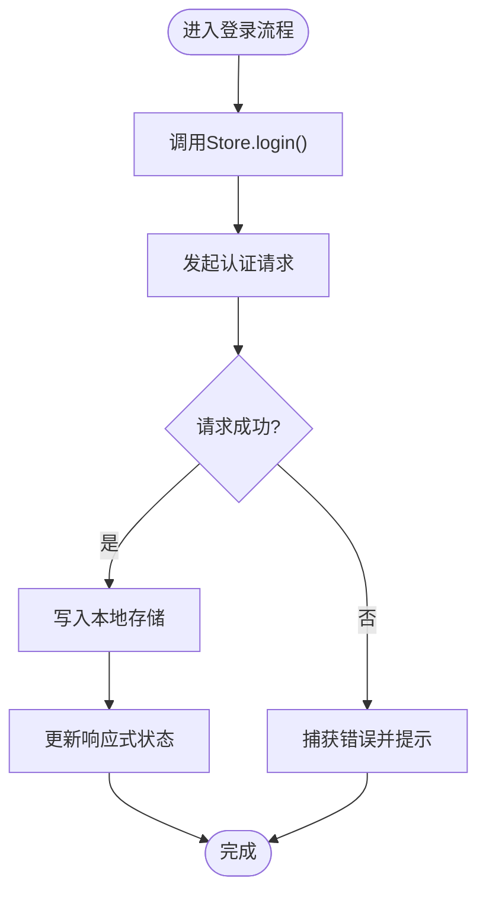
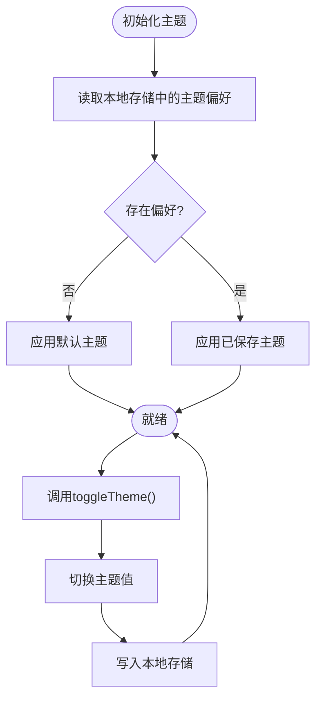
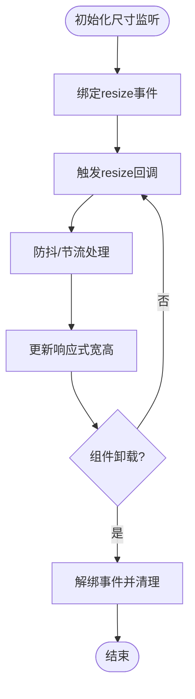
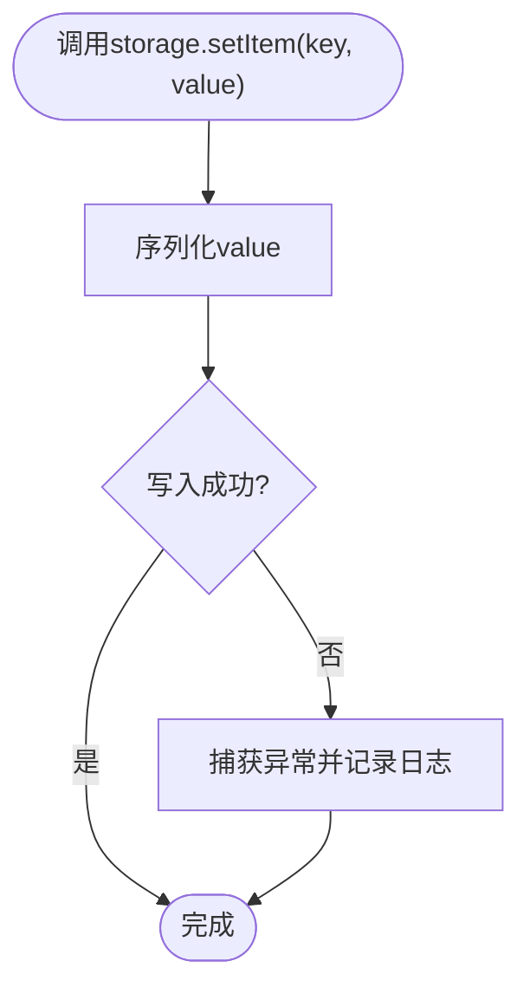
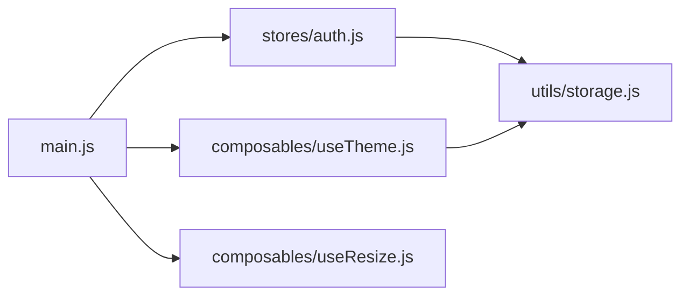

# 状态管理

<cite>
**本文引用的文件**   
- [main.js](file://WEB/src/main.js)
- [auth.js](file://WEB/src/stores/auth.js)
- [useTheme.js](file://WEB/src/composables/useTheme.js)
- [useResize.js](file://WEB/src/composables/useResize.js)
- [storage.js](file://WEB/src/utils/storage.js)
- [index.html](file://WEB/index.html)
- [package.json](file://WEB/package.json)
</cite>

## 目录
1. [简介](#简介)
2. [项目结构](#项目结构)
3. [核心组件](#核心组件)
4. [架构总览](#架构总览)
5. [详细组件分析](#详细组件分析)
6. [依赖关系分析](#依赖关系分析)
7. [性能考虑](#性能考虑)
8. [故障排查指南](#故障排查指南)
9. [结论](#结论)
10. [附录：示例与最佳实践](#附录示例与最佳实践)

## 简介
本文件面向Vue 3前端项目的状态管理，聚焦于以下目标：
- 使用Pinia或自定义store进行全局状态管理（本项目采用自定义store模式）
- 用户认证状态、主题切换状态、窗口尺寸监听等composables的实现与使用
- 状态持久化策略（本地存储）、状态同步机制
- 状态更新的最佳实践与性能优化技巧（避免不必要的重渲染）
- 提供创建新store和composable的实操指引

## 项目结构
本项目在WEB目录下组织前端代码。与状态管理相关的核心位置如下：
- stores：集中存放应用级状态（如认证信息）
- composables：封装可复用的组合式逻辑（如主题、窗口尺寸）
- utils：通用工具（如本地存储封装）
- main.js：应用入口，负责初始化store、插件与根组件挂载
- index.html：页面模板，通常用于注入全局样式或脚本
- package.json：依赖声明（包含Vue、Vite等）

**图表来源** 
- [main.js](file://WEB/src/main.js)
- [auth.js](file://WEB/src/stores/auth.js)
- [useTheme.js](file://WEB/src/composables/useTheme.js)
- [useResize.js](file://WEB/src/composables/useResize.js)
- [storage.js](file://WEB/src/utils/storage.js)
- [index.html](file://WEB/index.html)
- [package.json](file://WEB/package.json)

**章节来源**
- [main.js](file://WEB/src/main.js)
- [package.json](file://WEB/package.json)

## 核心组件
- 认证Store（stores/auth.js）
  - 职责：维护登录态、用户信息、Token等；提供登录/登出、刷新用户信息等动作
  - 特点：通过响应式对象暴露状态与方法，便于组件订阅与触发更新
- 主题Composable（composables/useTheme.js）
  - 职责：管理当前主题（亮/暗），并提供切换方法；与本地存储同步主题偏好
  - 特点：以函数形式返回响应式状态与操作，组件按需引入
- 窗口尺寸Composable（composables/useResize.js）
  - 职责：监听窗口尺寸变化，暴露当前宽高；适用于响应式布局
  - 特点：内部处理事件监听与清理，避免内存泄漏
- 本地存储工具（utils/storage.js）
  - 职责：封装localStorage的读写、序列化与异常处理
  - 特点：统一键名规范、错误兜底，保障数据一致性

**章节来源**
- [auth.js](file://WEB/src/stores/auth.js)
- [useTheme.js](file://WEB/src/composables/useTheme.js)
- [useResize.js](file://WEB/src/composables/useResize.js)
- [storage.js](file://WEB/src/utils/storage.js)

## 架构总览
下图展示应用启动到状态消费的整体流程：入口初始化各模块，组件通过composables或store访问状态并触发更新。

**图表来源** 
- [index.html](file://WEB/index.html)
- [main.js](file://WEB/src/main.js)
- [auth.js](file://WEB/src/stores/auth.js)
- [useTheme.js](file://WEB/src/composables/useTheme.js)
- [useResize.js](file://WEB/src/composables/useResize.js)
- [storage.js](file://WEB/src/utils/storage.js)

## 详细组件分析

### 认证Store（stores/auth.js）
- 设计要点
  - 使用响应式对象保存用户信息与Token
  - 提供login/logout/fetchProfile等方法
  - 与本地存储协作，实现登录态持久化
- 数据流
  - 组件调用login后，Store发起请求，成功后写入本地存储并更新响应式状态
  - 组件登出时清除本地存储并重置状态
- 错误处理
  - 网络失败时抛出明确错误，组件层捕获并提示
  - 本地存储异常时降级为内存状态，保证可用性

**图表来源** 
- [auth.js](file://WEB/src/stores/auth.js)
- [storage.js](file://WEB/src/utils/storage.js)

**章节来源**
- [auth.js](file://WEB/src/stores/auth.js)
- [storage.js](file://WEB/src/utils/storage.js)

### 主题Composable（composables/useTheme.js）
- 设计要点
  - 暴露currentTheme响应式变量与toggleTheme方法
  - 初始化时从本地存储读取主题偏好，若不存在则设置默认值
  - 切换主题时同步写入本地存储，确保刷新后保持一致
- 副作用管理
  - 在合适的生命周期内注册/移除事件（如需）
  - 避免在高频回调中执行昂贵计算

**图表来源** 
- [useTheme.js](file://WEB/src/composables/useTheme.js)
- [storage.js](file://WEB/src/utils/storage.js)

**章节来源**
- [useTheme.js](file://WEB/src/composables/useTheme.js)
- [storage.js](file://WEB/src/utils/storage.js)

### 窗口尺寸Composable（composables/useResize.js）
- 设计要点
  - 暴露width/height响应式变量
  - 监听window.resize事件，防抖或节流更新以避免频繁重渲染
  - 组件销毁时移除监听，防止内存泄漏
- 适用场景
  - 响应式布局、条件渲染、动态组件选择

**图表来源** 
- [useResize.js](file://WEB/src/composables/useResize.js)

**章节来源**
- [useResize.js](file://WEB/src/composables/useResize.js)

### 本地存储工具（utils/storage.js）
- 设计要点
  - 封装getItem/setItem/removeItem，统一JSON序列化/反序列化
  - 增加try/catch兜底，避免存储异常导致应用崩溃
  - 提供命名空间或前缀约定，避免键冲突
- 使用建议
  - 仅存储必要且可序列化的数据
  - 敏感信息（如密码）不应落盘

**图表来源** 
- [storage.js](file://WEB/src/utils/storage.js)

**章节来源**
- [storage.js](file://WEB/src/utils/storage.js)

## 依赖关系分析
- 入口main.js负责初始化应用与状态模块
- 认证Store依赖本地存储工具进行持久化
- 主题Composable依赖本地存储工具同步偏好
- 窗口尺寸Composable不依赖外部存储，但可与主题配合形成联动（例如按设备尺寸切换主题）

**图表来源** 
- [main.js](file://WEB/src/main.js)
- [auth.js](file://WEB/src/stores/auth.js)
- [useTheme.js](file://WEB/src/composables/useTheme.js)
- [useResize.js](file://WEB/src/composables/useResize.js)
- [storage.js](file://WEB/src/utils/storage.js)

**章节来源**
- [main.js](file://WEB/src/main.js)
- [auth.js](file://WEB/src/stores/auth.js)
- [useTheme.js](file://WEB/src/composables/useTheme.js)
- [useResize.js](file://WEB/src/composables/useResize.js)
- [storage.js](file://WEB/src/utils/storage.js)

## 性能考虑
- 避免不必要的重渲染
  - 将状态拆分为细粒度对象，组件只订阅所需字段
  - 使用computed派生状态，减少重复计算
  - 对高频事件（如resize）做防抖/节流
- 本地存储优化
  - 批量写入时使用事务或合并多次更新
  - 仅在值发生变化时写入，避免无意义I/O
- 异步更新策略
  - 登录/登出等耗时操作使用队列或去重，避免重复请求
  - 失败重试与退避策略，降低后端压力
- 组件级优化
  - 合理使用v-memo/v-once等指令减少渲染开销
  - 大列表使用虚拟滚动或分页加载

[本节为通用指导，不涉及具体文件分析]

## 故障排查指南
- 常见问题
  - 主题切换无效：检查本地存储键名是否一致，确认读写路径正确
  - 登录态丢失：确认Token过期策略与刷新逻辑，检查存储是否被清理
  - 窗口尺寸不更新：确认事件监听是否正确绑定与清理
- 调试建议
  - 在关键路径添加日志输出（注意脱敏）
  - 使用浏览器开发者工具的Local Storage面板验证数据
  - 对异常进行捕获并上报，定位问题根因

**章节来源**
- [auth.js](file://WEB/src/stores/auth.js)
- [useTheme.js](file://WEB/src/composables/useTheme.js)
- [useResize.js](file://WEB/src/composables/useResize.js)
- [storage.js](file://WEB/src/utils/storage.js)

## 结论
本项目采用“自定义store + composables”的状态管理模式，结合本地存储实现认证、主题与窗口尺寸的响应式管理与持久化。该方案结构简单、易于扩展，适合中小型应用。通过合理的状态拆分、防抖节流与错误兜底，可在保证用户体验的同时提升性能与稳定性。

[本节为总结性内容，不涉及具体文件分析]

## 附录：示例与最佳实践

### 如何创建新的Store（认证类）
- 步骤
  - 在stores目录下新建文件（如user.js）
  - 定义响应式状态（如userInfo、token）
  - 暴露actions（如login、logout、fetchProfile）
  - 在main.js中初始化并挂载到应用
- 参考路径
  - [stores/auth.js](file://WEB/src/stores/auth.js)
  - [src/main.js](file://WEB/src/main.js)

**章节来源**
- [auth.js](file://WEB/src/stores/auth.js)
- [main.js](file://WEB/src/main.js)

### 如何创建新的Composable（主题类）
- 步骤
  - 在composables目录下新建文件（如useColorMode.js）
  - 暴露响应式状态与操作方法
  - 在组件中按需引入并使用
- 参考路径
  - [composables/useTheme.js](file://WEB/src/composables/useTheme.js)

**章节来源**
- [useTheme.js](file://WEB/src/composables/useTheme.js)

### 如何创建窗口尺寸监听Composable
- 步骤
  - 在composables目录下新建文件（如useViewport.js）
  - 监听resize事件，暴露width/height
  - 在组件销毁时清理监听
- 参考路径
  - [composables/useResize.js](file://WEB/src/composables/useResize.js)

**章节来源**
- [useResize.js](file://WEB/src/composables/useResize.js)

### 状态持久化策略与本地存储使用
- 策略
  - 仅持久化必要数据（如Token、主题偏好）
  - 统一键名前缀，避免冲突
  - 读写异常兜底，保证应用健壮性
- 参考路径
  - [utils/storage.js](file://WEB/src/utils/storage.js)

**章节来源**
- [storage.js](file://WEB/src/utils/storage.js)

### 状态同步机制
- 多标签页同步
  - 使用StorageEvent监听其他标签页的存储变更
  - 或在必要时轮询（谨慎使用，影响性能）
- 跨组件同步
  - 通过Store或Provide/Inject共享状态
  - 使用事件总线（轻量场景）

[本节为通用指导，不涉及具体文件分析]

### 避免不必要重渲染的技巧
- 细粒度状态拆分与选择性订阅
- computed派生状态与watch的合理使用
- 列表虚拟化与分页加载
- 防抖/节流高频事件

[本节为通用指导，不涉及具体文件分析]