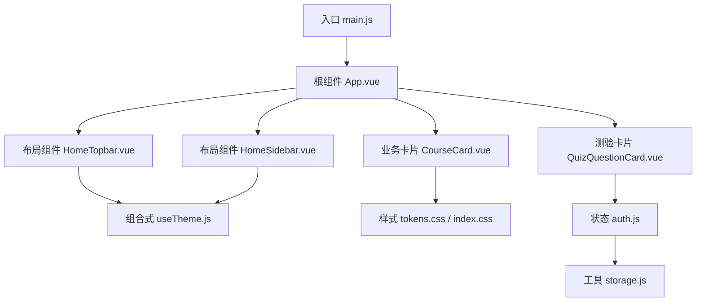
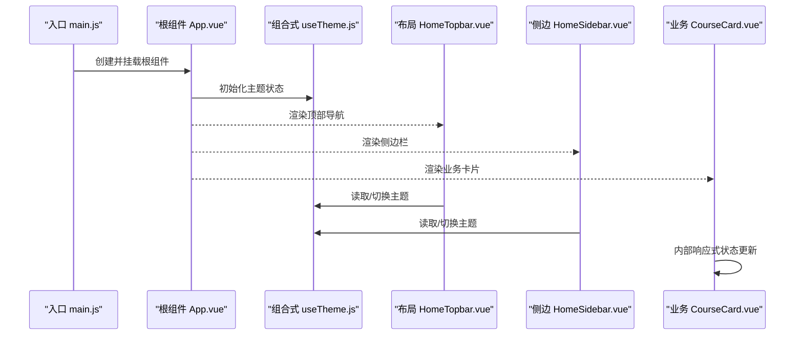
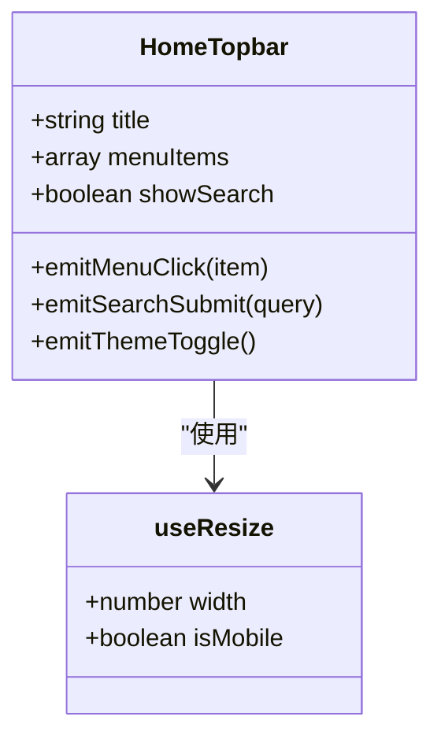
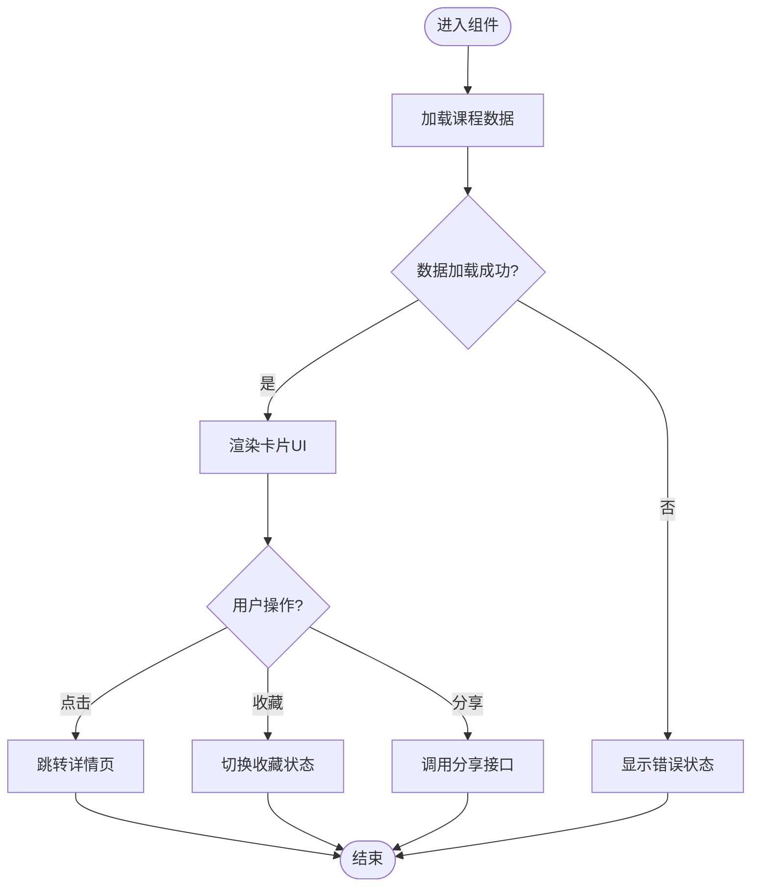
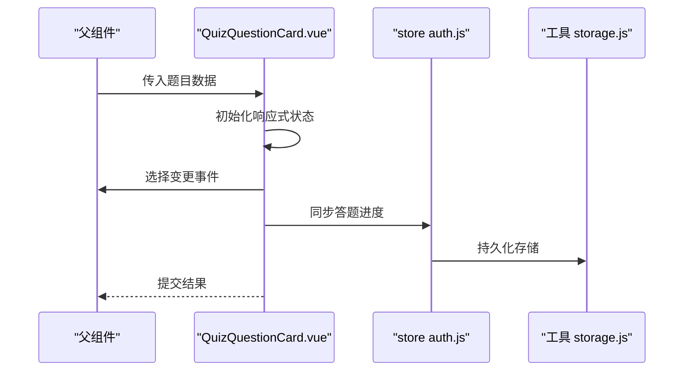
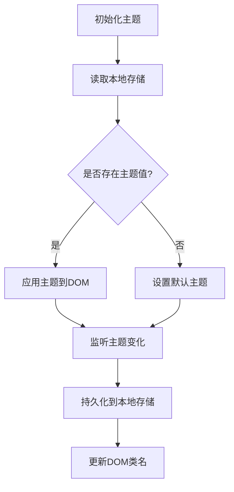
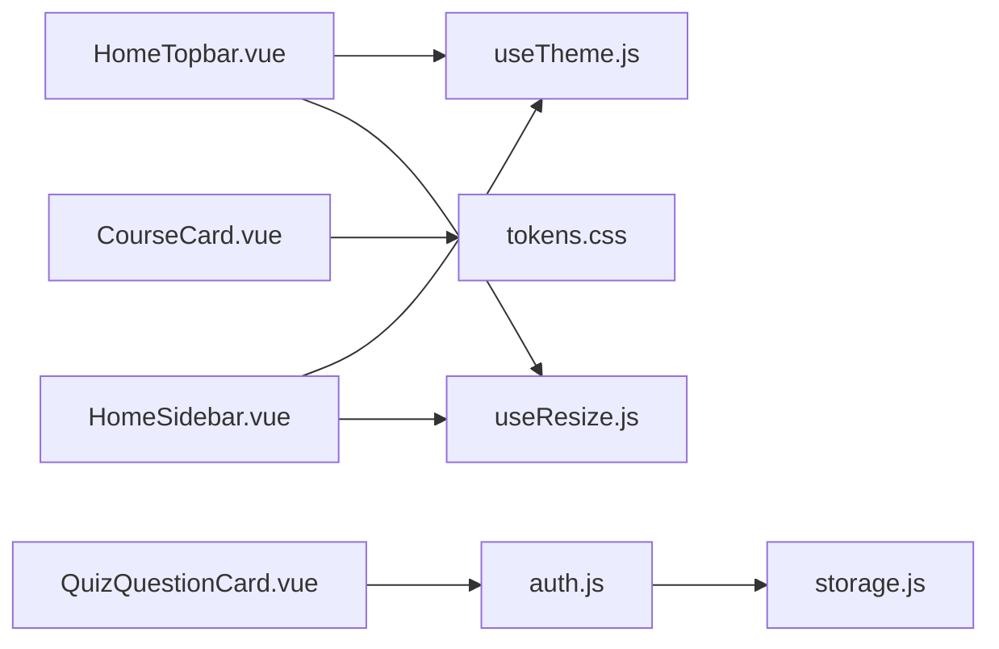

# 基础组件开发模式

<cite>
**本文档引用的文件**   
- [App.vue](file://WEB/src/App.vue)
- [main.js](file://WEB/src/main.js)
- [HomeSidebar.vue](file://WEB/src/components/HomeSidebar.vue)
- [HomeTopbar.vue](file://WEB/src/components/HomeTopbar.vue)
- [CourseCard.vue](file://WEB/src/components/CourseCard.vue)
- [QuizQuestionCard.vue](file://WEB/src/components/quiz/QuizQuestionCard.vue)
- [useTheme.js](file://WEB/src/composables/useTheme.js)
- [useResize.js](file://WEB/src/composables/useResize.js)
- [tokens.css](file://WEB/src/styles/tokens.css)
- [index.css](file://WEB/src/styles/index.css)
- [auth.js](file://WEB/src/stores/auth.js)
- [storage.js](file://WEB/src/utils/storage.js)
</cite>

## 目录
1. [简介](#简介)
2. [项目结构](#项目结构)
3. [核心组件](#核心组件)
4. [架构总览](#架构总览)
5. [详细组件分析](#详细组件分析)
6. [依赖关系分析](#依赖关系分析)
7. [性能考量](#性能考量)
8. [故障排查指南](#故障排查指南)
9. [结论](#结论)
10. [附录](#附录)

## 简介
本文件面向使用 Vue 3 进行前端开发的工程师，系统化阐述“基础组件开发模式”。内容覆盖：
- Vue 3 单文件组件（SFC）基本结构与 setup 语法
- 响应式数据管理、生命周期钩子使用
- props 定义规范、事件处理机制、插槽用法
- UI 组件库集成与自定义组件封装原则
- 主题切换、响应式设计等通用能力实现
- 组件命名规范、目录结构与代码风格指南

目标是在不深入具体业务的前提下，提供一套可复用的工程化实践，帮助团队统一开发标准、提升可维护性与可扩展性。

## 项目结构
本项目采用按功能域划分的目录组织方式，核心前端位于 WEB/src 下：
- components：通用与业务组件
- composables：组合式函数（如主题、尺寸监听）
- styles：样式与主题变量
- stores：状态管理（轻量 store）
- utils：工具函数（如本地存储）
- pages：页面级视图（部分页面）
- api：接口封装

图表来源
- [main.js:1-50](file://WEB/src/main.js#L1-L50)
- [App.vue:1-120](file://WEB/src/App.vue#L1-L120)
- [HomeTopbar.vue:1-120](file://WEB/src/components/HomeTopbar.vue#L1-L120)
- [HomeSidebar.vue:1-120](file://WEB/src/components/HomeSidebar.vue#L1-L120)
- [CourseCard.vue:1-120](file://WEB/src/components/CourseCard.vue#L1-L120)
- [QuizQuestionCard.vue:1-120](file://WEB/src/components/quiz/QuizQuestionCard.vue#L1-L120)
- [useTheme.js:1-120](file://WEB/src/composables/useTheme.js#L1-L120)
- [tokens.css:1-120](file://WEB/src/styles/tokens.css#L1-L120)
- [index.css:1-120](file://WEB/src/styles/index.css#L1-L120)
- [auth.js:1-120](file://WEB/src/stores/auth.js#L1-L120)
- [storage.js:1-120](file://WEB/src/utils/storage.js#L1-L120)

章节来源
- [main.js:1-50](file://WEB/src/main.js#L1-L50)
- [App.vue:1-120](file://WEB/src/App.vue#L1-L120)

## 核心组件
本节聚焦于项目中代表性组件与组合式函数，说明其职责、输入输出与交互方式。

- 根组件 App.vue
  - 职责：应用壳、全局样式注入、路由容器（若存在）、主题初始化
  - 关键点：在 setup 中初始化主题、挂载全局样式、注册全局指令或插件（如有）
  
- 布局组件 HomeTopbar.vue / HomeSidebar.vue
  - 职责：顶部导航与侧边栏布局，承载用户操作入口与导航
  - 关键点：通过 props 接收菜单/标题；通过 emits 向父组件传递事件；使用插槽扩展头部内容
  
- 业务卡片 CourseCard.vue
  - 职责：课程信息展示与交互（点击、收藏、分享等）
  - 关键点：props 描述课程数据模型；内部响应式状态控制加载态、错误态；事件向上冒泡
  
- 测验卡片 QuizQuestionCard.vue
  - 职责：题目渲染、选项选择、提交反馈
  - 关键点：复杂表单交互；与 store 联动；响应式校验与提示
  
- 组合式 useTheme.js
  - 职责：主题切换逻辑（明/暗），持久化到本地存储
  - 关键点：响应式主题状态；DOM class 切换；localStorage 读写
  
- 组合式 useResize.js
  - 职责：窗口尺寸监听与断点判断
  - 关键点：防抖/节流优化；响应式宽度状态；移动端适配

章节来源
- [App.vue:1-120](file://WEB/src/App.vue#L1-L120)
- [HomeTopbar.vue:1-120](file://WEB/src/components/HomeTopbar.vue#L1-L120)
- [HomeSidebar.vue:1-120](file://WEB/src/components/HomeSidebar.vue#L1-L120)
- [CourseCard.vue:1-120](file://WEB/src/components/CourseCard.vue#L1-L120)
- [QuizQuestionCard.vue:1-120](file://WEB/src/components/quiz/QuizQuestionCard.vue#L1-L120)
- [useTheme.js:1-120](file://WEB/src/composables/useTheme.js#L1-L120)
- [useResize.js:1-120](file://WEB/src/composables/useResize.js#L1-L120)

## 架构总览
整体采用“组合式 + 轻量 store”的架构模式：
- 入口 main.js 初始化应用、挂载根组件
- App.vue 作为应用壳，负责全局样式与主题初始化
- 布局组件与业务组件通过 props/emits 通信
- 组合式函数封装跨组件复用逻辑（主题、尺寸）
- 样式通过 CSS 变量（tokens）实现主题与一致性

图表来源
- [main.js:1-50](file://WEB/src/main.js#L1-L50)
- [App.vue:1-120](file://WEB/src/App.vue#L1-L120)
- [useTheme.js:1-120](file://WEB/src/composables/useTheme.js#L1-L120)
- [HomeTopbar.vue:1-120](file://WEB/src/components/HomeTopbar.vue#L1-L120)
- [HomeSidebar.vue:1-120](file://WEB/src/components/HomeSidebar.vue#L1-L120)
- [CourseCard.vue:1-120](file://WEB/src/components/CourseCard.vue#L1-L120)

## 详细组件分析

### 组件 A：布局组件 HomeTopbar.vue
- 设计要点
  - props：标题、菜单项、是否显示搜索框等
  - emits：菜单点击、搜索提交、主题切换
  - 插槽：左侧 Logo、右侧用户头像与设置
  - 响应式：根据 useResize 返回的宽度决定折叠行为
- 数据流
  - 父组件传入菜单数据 -> 组件内部渲染 -> 用户交互触发事件 -> 父组件处理

图表来源
- [HomeTopbar.vue:1-120](file://WEB/src/components/HomeTopbar.vue#L1-L120)
- [useResize.js:1-120](file://WEB/src/composables/useResize.js#L1-L120)

章节来源
- [HomeTopbar.vue:1-120](file://WEB/src/components/HomeTopbar.vue#L1-L120)

### 组件 B：业务卡片 CourseCard.vue
- 设计要点
  - props：课程对象（id、title、cover、progress 等）
  - 内部状态：loading、error、hovered
  - 事件：点击跳转、收藏切换、分享
  - 插槽：自定义操作按钮区
- 数据流
  - 外部数据驱动渲染 -> 用户交互更新内部状态 -> 事件上报父组件

图表来源
- [CourseCard.vue:1-120](file://WEB/src/components/CourseCard.vue#L1-L120)

章节来源
- [CourseCard.vue:1-120](file://WEB/src/components/CourseCard.vue#L1-L120)

### 组件 C：测验卡片 QuizQuestionCard.vue
- 设计要点
  - props：题目对象、题型标签、已选答案
  - 内部状态：当前选中项、校验结果、提交状态
  - 事件：选择变更、提交答案、重置
  - 与 store 联动：记录答题进度
- 数据流
  - 父组件传入题目 -> 组件内响应式绑定 -> 用户选择 -> 校验与提交 -> 同步 store

图表来源
- [QuizQuestionCard.vue:1-120](file://WEB/src/components/quiz/QuizQuestionCard.vue#L1-L120)
- [auth.js:1-120](file://WEB/src/stores/auth.js#L1-L120)
- [storage.js:1-120](file://WEB/src/utils/storage.js#L1-L120)

章节来源
- [QuizQuestionCard.vue:1-120](file://WEB/src/components/quiz/QuizQuestionCard.vue#L1-L120)
- [auth.js:1-120](file://WEB/src/stores/auth.js#L1-L120)
- [storage.js:1-120](file://WEB/src/utils/storage.js#L1-L120)

### 组合式函数：useTheme.js
- 职责：主题状态管理、DOM class 切换、本地持久化
- 关键点：响应式布尔值、事件监听、兼容性处理

图表来源
- [useTheme.js:1-120](file://WEB/src/composables/useTheme.js#L1-L120)

章节来源
- [useTheme.js:1-120](file://WEB/src/composables/useTheme.js#L1-L120)

### 组合式函数：useResize.js
- 职责：窗口尺寸监听、断点判断、防抖优化
- 关键点：响应式宽度、isMobile 计算属性、事件去抖

章节来源
- [useResize.js:1-120](file://WEB/src/composables/useResize.js#L1-L120)

## 依赖关系分析
组件与模块之间的依赖关系如下：
- 布局与业务组件依赖组合式函数（主题、尺寸）
- 业务组件依赖 store 与工具函数
- 样式通过 CSS 变量统一管理

图表来源
- [HomeTopbar.vue:1-120](file://WEB/src/components/HomeTopbar.vue#L1-L120)
- [HomeSidebar.vue:1-120](file://WEB/src/components/HomeSidebar.vue#L1-L120)
- [CourseCard.vue:1-120](file://WEB/src/components/CourseCard.vue#L1-L120)
- [QuizQuestionCard.vue:1-120](file://WEB/src/components/quiz/QuizQuestionCard.vue#L1-L120)
- [useTheme.js:1-120](file://WEB/src/composables/useTheme.js#L1-L120)
- [useResize.js:1-120](file://WEB/src/composables/useResize.js#L1-L120)
- [auth.js:1-120](file://WEB/src/stores/auth.js#L1-L120)
- [storage.js:1-120](file://WEB/src/utils/storage.js#L1-L120)
- [tokens.css:1-120](file://WEB/src/styles/tokens.css#L1-L120)

章节来源
- [tokens.css:1-120](file://WEB/src/styles/tokens.css#L1-L120)
- [index.css:1-120](file://WEB/src/styles/index.css#L1-L120)

## 性能考量
- 组件粒度：保持组件职责单一，避免过大组件导致渲染开销
- 响应式优化：合理使用 computed 缓存、watch 精确监听
- 事件优化：防抖/节流处理高频事件（如滚动、输入）
- 样式优化：CSS 变量集中管理，减少重复样式；按需加载样式
- 状态管理：轻量 store 仅存放必要状态，避免过度共享

## 故障排查指南
- 主题切换无效
  - 检查 DOM class 是否正确切换
  - 确认本地存储键名一致
  - 验证 CSS 变量是否生效
- 响应式数据未更新
  - 检查 ref/reactive 使用是否正确
  - 确认是否在 setup 中正确解构
- 事件未触发
  - 检查 emits 声明与调用是否匹配
  - 确认父组件监听器是否正确绑定
- 样式错乱
  - 检查 CSS 变量作用域
  - 确认样式优先级与覆盖规则

章节来源
- [useTheme.js:1-120](file://WEB/src/composables/useTheme.js#L1-L120)
- [tokens.css:1-120](file://WEB/src/styles/tokens.css#L1-L120)
- [index.css:1-120](file://WEB/src/styles/index.css#L1-L120)

## 结论
通过统一的组件开发模式，结合组合式函数与轻量状态管理，项目实现了高内聚、低耦合的前端架构。主题切换、响应式设计等通用能力通过可复用模块抽象，提升了开发效率与代码质量。建议团队遵循本文档的命名规范、目录结构与代码风格，确保长期可维护性。

## 附录

### 组件命名规范
- 组件名使用 PascalCase，如 CourseCard.vue、QuizQuestionCard.vue
- 组合式函数以 use 开头，如 useTheme.js、useResize.js
- 样式文件按功能划分，如 tokens.css、index.css

### 目录结构建议
- components：通用与业务组件
- composables：组合式函数
- styles：样式与主题变量
- stores：状态管理
- utils：工具函数
- pages：页面级视图

### 代码风格指南
- 使用 ES6+ 语法，模块化导入导出
- 组件内优先使用 setup 语法
- 注释清晰，关键逻辑添加说明
- 统一缩进与格式（推荐 Prettier）

### 主题切换实现要点
- 使用 CSS 变量定义主题色
- 通过组合式函数管理主题状态
- 持久化到本地存储，刷新后保持一致

### 响应式设计实现要点
- 使用媒体查询与 CSS 变量
- 组合式函数监听窗口尺寸
- 组件内部根据断点调整布局