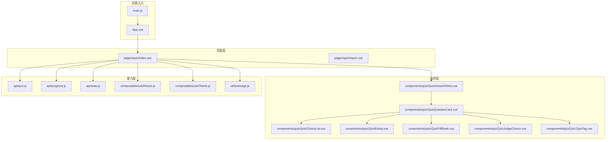
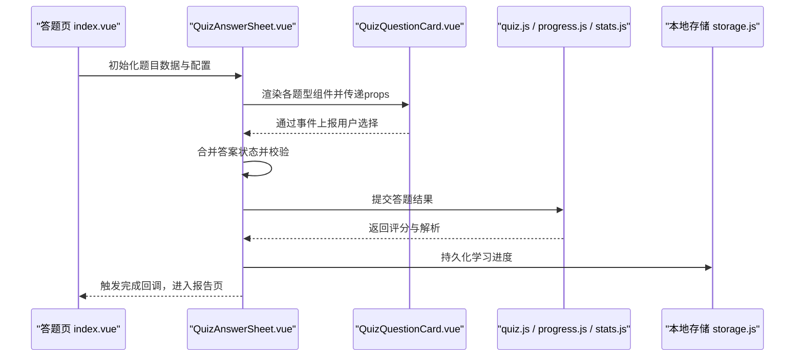
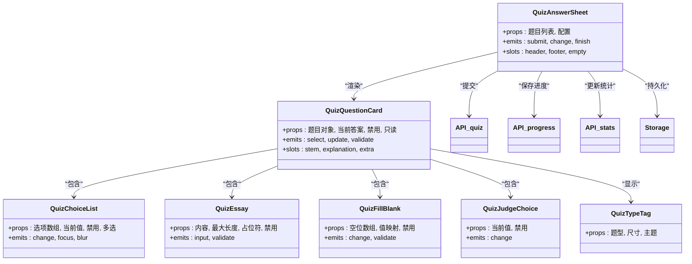

# 组件开发规范

<cite>
**本文引用的文件**   
- [QuizAnswerSheet.vue](file://WEB/src/components/quiz/QuizAnswerSheet.vue)
- [QuizChoiceList.vue](file://WEB/src/components/quiz/QuizChoiceList.vue)
- [QuizEssay.vue](file://WEB/src/components/quiz/QuizEssay.vue)
- [QuizFillBlank.vue](file://WEB/src/components/quiz/QuizFillBlank.vue)
- [QuizJudgeChoice.vue](file://WEB/src/components/quiz/QuizJudgeChoice.vue)
- [QuizQuestionCard.vue](file://WEB/src/components/quiz/QuizQuestionCard.vue)
- [QuizTypeTag.vue](file://WEB/src/components/quiz/QuizTypeTag.vue)
- [index.vue](file://WEB/src/pages/quiz/index.vue)
- [script.js](file://WEB/src/pages/quiz/script.js)
- [report-script.js](file://WEB/src/pages/quiz/report-script.js)
- [report.vue](file://WEB/src/pages/quiz/report.vue)
- [useResize.js](file://WEB/src/composables/useResize.js)
- [useTheme.js](file://WEB/src/composables/useTheme.js)
- [auth.js](file://WEB/src/api/auth.js)
- [quiz.js](file://WEB/src/api/quiz.js)
- [progress.js](file://WEB/src/api/progress.js)
- [stats.js](file://WEB/src/api/stats.js)
- [storage.js](file://WEB/src/utils/storage.js)
- [App.vue](file://WEB/src/App.vue)
- [main.js](file://WEB/src/main.js)
- [index.css](file://WEB/src/styles/index.css)
- [tokens.css](file://WEB/src/styles/tokens.css)
</cite>

## 目录
1. [引言](#引言)
2. [项目结构](#项目结构)
3. [核心组件](#核心组件)
4. [架构总览](#架构总览)
5. [详细组件分析](#详细组件分析)
6. [依赖关系分析](#依赖关系分析)
7. [性能考量](#性能考量)
8. [故障排查指南](#故障排查指南)
9. [结论](#结论)
10. [附录](#附录)

## 引言
本规范面向Vue 3单文件组件（SFC）开发，聚焦于：
- setup语法与响应式数据管理
- 生命周期钩子的使用
- props定义、事件处理与插槽使用
- UI组件库的使用与自定义组件封装原则
- 可复用性设计
- Quiz相关复杂组件的实现模式（如QuizAnswerSheet、QuizChoiceList等）
- 组件测试方法与调试技巧

目标是为团队提供统一、可维护、可扩展的组件开发标准。

## 项目结构
本项目采用按功能域组织的前端结构，核心目录说明如下：
- src/components/quiz：Quiz题型相关UI组件
- src/pages/quiz：答题页、报告页等页面级视图
- src/api：API请求封装
- src/composables：组合式函数（响应式逻辑复用）
- src/stores：状态管理（示例中为认证状态）
- src/utils：工具函数（如本地存储）
- src/styles：样式与主题变量

图表来源
- [main.js](file://WEB/src/main.js)
- [App.vue](file://WEB/src/App.vue)
- [index.vue](file://WEB/src/pages/quiz/index.vue)
- [QuizAnswerSheet.vue](file://WEB/src/components/quiz/QuizAnswerSheet.vue)
- [QuizQuestionCard.vue](file://WEB/src/components/quiz/QuizQuestionCard.vue)
- [QuizChoiceList.vue](file://WEB/src/components/quiz/QuizChoiceList.vue)
- [QuizEssay.vue](file://WEB/src/components/quiz/QuizEssay.vue)
- [QuizFillBlank.vue](file://WEB/src/components/quiz/QuizFillBlank.vue)
- [QuizJudgeChoice.vue](file://WEB/src/components/quiz/QuizJudgeChoice.vue)
- [QuizTypeTag.vue](file://WEB/src/components/quiz/QuizTypeTag.vue)
- [quiz.js](file://WEB/src/api/quiz.js)
- [progress.js](file://WEB/src/api/progress.js)
- [stats.js](file://WEB/src/api/stats.js)
- [useResize.js](file://WEB/src/composables/useResize.js)
- [useTheme.js](file://WEB/src/composables/useTheme.js)
- [storage.js](file://WEB/src/utils/storage.js)

章节来源
- [main.js](file://WEB/src/main.js)
- [App.vue](file://WEB/src/App.vue)
- [index.vue](file://WEB/src/pages/quiz/index.vue)

## 核心组件
本节概述Quiz相关组件的职责边界与交互约定，便于在后续章节深入分析实现细节。

- QuizAnswerSheet：答题主容器，负责题目列表渲染、答案收集、提交与结果展示。
- QuizQuestionCard：单题卡片，聚合题型子组件，统一处理选中态、禁用态与校验提示。
- QuizChoiceList：选择题选项列表，支持单选/多选、禁用与高亮反馈。
- QuizEssay：主观题输入区，支持文本编辑与字数统计。
- QuizFillBlank：填空题输入区，支持多空位与占位符提示。
- QuizJudgeChoice：判断题选择器，简化对/错选择。
- QuizTypeTag：题型标签，用于显示题目类型标识。

章节来源
- [QuizAnswerSheet.vue](file://WEB/src/components/quiz/QuizAnswerSheet.vue)
- [QuizQuestionCard.vue](file://WEB/src/components/quiz/QuizQuestionCard.vue)
- [QuizChoiceList.vue](file://WEB/src/components/quiz/QuizChoiceList.vue)
- [QuizEssay.vue](file://WEB/src/components/quiz/QuizEssay.vue)
- [QuizFillBlank.vue](file://WEB/src/components/quiz/QuizFillBlank.vue)
- [QuizJudgeChoice.vue](file://WEB/src/components/quiz/QuizJudgeChoice.vue)
- [QuizTypeTag.vue](file://WEB/src/components/quiz/QuizTypeTag.vue)

## 架构总览
从页面到组件再到API的数据流与控制流如下：

图表来源
- [index.vue](file://WEB/src/pages/quiz/index.vue)
- [QuizAnswerSheet.vue](file://WEB/src/components/quiz/QuizAnswerSheet.vue)
- [QuizQuestionCard.vue](file://WEB/src/components/quiz/QuizQuestionCard.vue)
- [quiz.js](file://WEB/src/api/quiz.js)
- [progress.js](file://WEB/src/api/progress.js)
- [stats.js](file://WEB/src/api/stats.js)
- [storage.js](file://WEB/src/utils/storage.js)

## 详细组件分析

### QuizAnswerSheet（答题主容器）
职责与要点：
- 接收题目数组与配置，驱动内部状态（当前题号、答案集合、是否已提交）。
- 聚合各题型组件的事件，统一校验与提交流程。
- 与API交互，获取评分与解析，更新本地进度。
- 提供插槽以扩展头部/底部信息。

关键接口约定（建议）：
- props：题目列表、配置项（如是否允许回看）、初始答案映射。
- emits：submit、change、finish等事件。
- slots：header、footer、empty等。

章节来源
- [QuizAnswerSheet.vue](file://WEB/src/components/quiz/QuizAnswerSheet.vue)
- [index.vue](file://WEB/src/pages/quiz/index.vue)

### QuizQuestionCard（单题卡片）
职责与要点：
- 根据题型动态渲染对应子组件（选择、判断、填空、作文）。
- 统一管理选中态、禁用态、错误提示。
- 将用户操作转换为标准化事件上报给父容器。

关键接口约定（建议）：
- props：题目对象、当前答案、是否禁用、是否只读。
- emits：select、update、validate等事件。
- slots：题干区域、解析区域、辅助信息。

章节来源
- [QuizQuestionCard.vue](file://WEB/src/components/quiz/QuizQuestionCard.vue)
- [QuizChoiceList.vue](file://WEB/src/components/quiz/QuizChoiceList.vue)
- [QuizEssay.vue](file://WEB/src/components/quiz/QuizEssay.vue)
- [QuizFillBlank.vue](file://WEB/src/components/quiz/QuizFillBlank.vue)
- [QuizJudgeChoice.vue](file://WEB/src/components/quiz/QuizJudgeChoice.vue)
- [QuizTypeTag.vue](file://WEB/src/components/quiz/QuizTypeTag.vue)

### QuizChoiceList（选择题选项列表）
职责与要点：
- 渲染选项列表，支持单选/多选模式。
- 处理选中、禁用、高亮反馈与键盘可达性。
- 将选择变化以事件形式上报。

关键接口约定（建议）：
- props：选项数组、当前值、是否禁用、是否多选。
- emits：change、focus、blur等事件。

章节来源
- [QuizChoiceList.vue](file://WEB/src/components/quiz/QuizChoiceList.vue)

### QuizEssay（主观题输入）
职责与要点：
- 提供富文本或纯文本输入框，支持字数限制与实时校验。
- 暴露内容变更事件，供父组件收集答案。

关键接口约定（建议）：
- props：当前内容、最大长度、占位符、是否禁用。
- emits：input、validate等事件。

章节来源
- [QuizEssay.vue](file://WEB/src/components/quiz/QuizEssay.vue)

### QuizFillBlank（填空题输入）
职责与要点：
- 支持多空位输入，每个空位独立状态。
- 提供占位符提示与即时校验反馈。

关键接口约定（建议）：
- props：空位数组、当前值映射、是否禁用。
- emits：change、validate等事件。

章节来源
- [QuizFillBlank.vue](file://WEB/src/components/quiz/QuizFillBlank.vue)

### QuizJudgeChoice（判断题选择器）
职责与要点：
- 简化对/错选择，提供清晰的视觉反馈。
- 与父组件双向绑定选择状态。

关键接口约定（建议）：
- props：当前值、是否禁用。
- emits：change等事件。

章节来源
- [QuizJudgeChoice.vue](file://WEB/src/components/quiz/QuizJudgeChoice.vue)

### QuizTypeTag（题型标签）
职责与要点：
- 显示题目类型标识，便于用户快速识别题型。
- 支持主题适配与尺寸变体。

关键接口约定（建议）：
- props：题型枚举、尺寸、颜色主题。

章节来源
- [QuizTypeTag.vue](file://WEB/src/components/quiz/QuizTypeTag.vue)

### 页面集成与数据流（index.vue）
职责与要点：
- 作为答题页入口，加载题目数据，组装QuizAnswerSheet所需参数。
- 监听答题完成事件，跳转至报告页或刷新统计数据。
- 使用组合式函数处理响应式逻辑（如窗口尺寸、主题切换）。

章节来源
- [index.vue](file://WEB/src/pages/quiz/index.vue)
- [script.js](file://WEB/src/pages/quiz/script.js)
- [useResize.js](file://WEB/src/composables/useResize.js)
- [useTheme.js](file://WEB/src/composables/useTheme.js)

### 报告页（report.vue）
职责与要点：
- 展示答题结果、解析与错题回顾。
- 与API交互获取评分详情，并更新本地统计。

章节来源
- [report.vue](file://WEB/src/pages/quiz/report.vue)
- [report-script.js](file://WEB/src/pages/quiz/report-script.js)

## 依赖关系分析
组件与外部依赖的关系如下：

图表来源
- [QuizAnswerSheet.vue](file://WEB/src/components/quiz/QuizAnswerSheet.vue)
- [QuizQuestionCard.vue](file://WEB/src/components/quiz/QuizQuestionCard.vue)
- [QuizChoiceList.vue](file://WEB/src/components/quiz/QuizChoiceList.vue)
- [QuizEssay.vue](file://WEB/src/components/quiz/QuizEssay.vue)
- [QuizFillBlank.vue](file://WEB/src/components/quiz/QuizFillBlank.vue)
- [QuizJudgeChoice.vue](file://WEB/src/components/quiz/QuizJudgeChoice.vue)
- [QuizTypeTag.vue](file://WEB/src/components/quiz/QuizTypeTag.vue)
- [quiz.js](file://WEB/src/api/quiz.js)
- [progress.js](file://WEB/src/api/progress.js)
- [stats.js](file://WEB/src/api/stats.js)
- [storage.js](file://WEB/src/utils/storage.js)

章节来源
- [quiz.js](file://WEB/src/api/quiz.js)
- [progress.js](file://WEB/src/api/progress.js)
- [stats.js](file://WEB/src/api/stats.js)
- [storage.js](file://WEB/src/utils/storage.js)

## 性能考量
- 列表渲染优化：对题目列表进行稳定key绑定，避免不必要的重渲染。
- 响应式粒度：仅将必要数据声明为响应式，减少计算开销。
- 懒加载与分页：题目较多时采用分页或虚拟滚动。
- 事件节流：输入类事件（如作文输入）进行节流或防抖。
- 资源按需加载：大型第三方库按需引入，减少首屏体积。
- 样式隔离：使用CSS变量与主题token，避免重复样式计算。

[本节为通用指导，不直接分析具体文件]

## 故障排查指南
常见问题与定位方法：
- 数据未更新：检查setup中的响应式声明与事件派发是否正确；确认父组件是否监听相应事件。
- 表单校验失败：查看校验规则与提示信息绑定位置；确保必填字段与格式校验一致。
- 提交失败：检查API调用路径与参数结构；查看网络请求与错误码。
- 主题异常：确认主题变量注入与组件内样式覆盖顺序。
- 移动端适配：使用useResize监听屏幕变化，调整布局与交互。

调试技巧：
- 使用浏览器开发者工具的组件面板观察props与状态。
- 在关键节点打印日志，区分是数据问题还是渲染问题。
- 使用单元测试模拟用户交互，验证事件派发与状态更新。

章节来源
- [index.vue](file://WEB/src/pages/quiz/index.vue)
- [script.js](file://WEB/src/pages/quiz/script.js)
- [report-script.js](file://WEB/src/pages/quiz/report-script.js)
- [useResize.js](file://WEB/src/composables/useResize.js)
- [useTheme.js](file://WEB/src/composables/useTheme.js)
- [storage.js](file://WEB/src/utils/storage.js)

## 结论
本规范围绕Vue 3 SFC与组合式API，明确了Quiz相关组件的职责边界、接口约定与数据流。通过统一的props/emits/slots设计与组合式函数复用，提升组件的可维护性与可复用性。建议在团队内推广该规范，并结合持续集成与自动化测试保障质量。

[本节为总结性内容，不直接分析具体文件]

## 附录
- 样式与主题：参考index.css与tokens.css，统一色彩与排版变量。
- 应用入口：main.js与App.vue负责全局插件注册与路由挂载。
- API封装：quiz.js、progress.js、stats.js等模块集中管理网络请求。

章节来源
- [index.css](file://WEB/src/styles/index.css)
- [tokens.css](file://WEB/src/styles/tokens.css)
- [main.js](file://WEB/src/main.js)
- [App.vue](file://WEB/src/App.vue)
- [quiz.js](file://WEB/src/api/quiz.js)
- [progress.js](file://WEB/src/api/progress.js)
- [stats.js](file://WEB/src/api/stats.js)