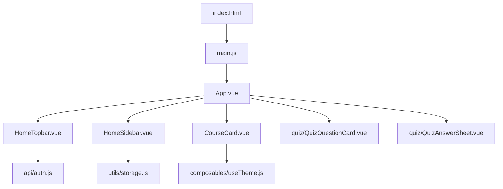
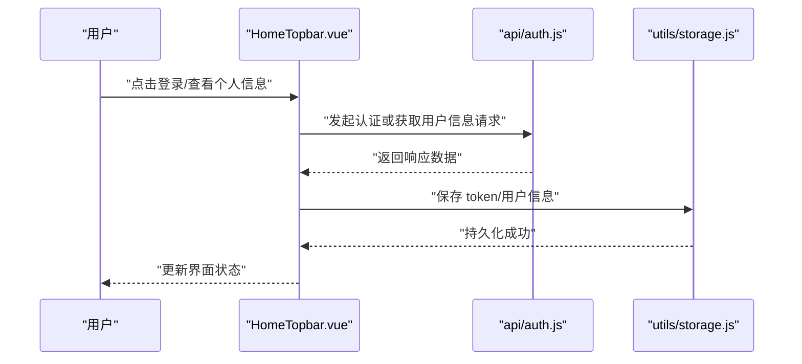
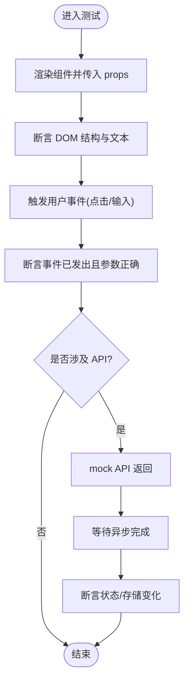
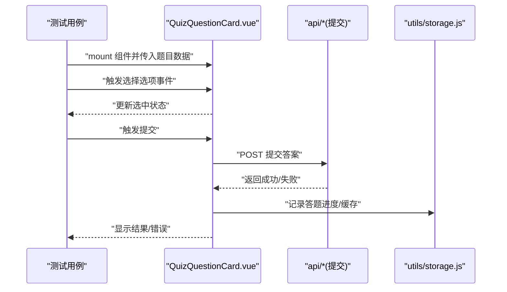
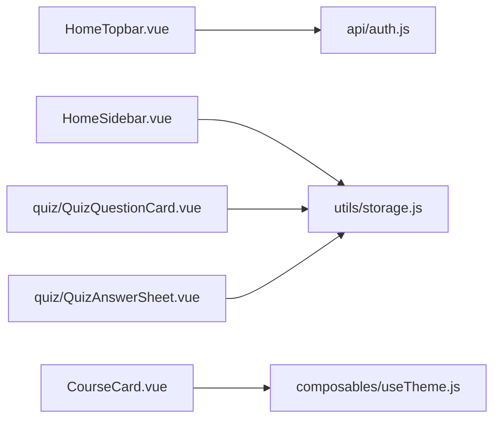

# 组件测试与调试

<cite>
**本文引用的文件**   
- [package.json](file://WEB/package.json)
- [vite.config.js](file://WEB/vite.config.js)
- [index.html](file://WEB/index.html)
- [main.js](file://WEB/src/main.js)
- [App.vue](file://WEB/src/App.vue)
- [HomeTopbar.vue](file://WEB/src/components/HomeTopbar.vue)
- [HomeSidebar.vue](file://WEB/src/components/HomeSidebar.vue)
- [CourseCard.vue](file://WEB/src/components/CourseCard.vue)
- [QuizQuestionCard.vue](file://WEB/src/components/quiz/QuizQuestionCard.vue)
- [QuizAnswerSheet.vue](file://WEB/src/components/quiz/QuizAnswerSheet.vue)
- [auth.js](file://WEB/src/api/auth.js)
- [storage.js](file://WEB/src/utils/storage.js)
- [useTheme.js](file://WEB/src/composables/useTheme.js)
</cite>

## 目录
1. [简介](#简介)
2. [项目结构](#项目结构)
3. [核心组件](#核心组件)
4. [架构总览](#架构总览)
5. [详细组件分析](#详细组件分析)
6. [依赖分析](#依赖分析)
7. [性能考虑](#性能考虑)
8. [故障排查指南](#故障排查指南)
9. [结论](#结论)
10. [附录](#附录)

## 简介
本文件面向使用 Vue 的前端工程，系统化阐述组件级单元测试与调试方法。内容覆盖：
- 基于 Jest（配合 @vue/test-utils）的单元测试实践
- 模拟数据与 API 调用拦截
- 组件交互、异步操作、事件触发的测试策略
- 调试技巧与工具链（Vue DevTools、浏览器开发者工具）
- 常见问题定位与解决方案
- 性能分析与内存泄漏检测

本指南以仓库中的 WEB 前端模块为参考上下文，结合现有组件与 API 组织方式，给出可落地的测试与调试方案。

## 项目结构
WEB 前端采用 Vite + Vue 的工程化结构，关键入口与配置如下：
- 构建与运行入口：index.html、main.js
- 应用根组件：App.vue
- 业务组件：components/*（如 HomeTopbar.vue、HomeSidebar.vue、CourseCard.vue、quiz/*）
- API 层：api/*（如 auth.js）
- 工具与组合式函数：utils/*、composables/*（如 storage.js、useTheme.js）
- 构建配置：vite.config.js、package.json

图表来源
- [index.html:1-20](file://WEB/index.html#L1-L20)
- [main.js:1-30](file://WEB/src/main.js#L1-L30)
- [App.vue:1-40](file://WEB/src/App.vue#L1-L40)
- [HomeTopbar.vue:1-40](file://WEB/src/components/HomeTopbar.vue#L1-L40)
- [HomeSidebar.vue:1-40](file://WEB/src/components/HomeSidebar.vue#L1-L40)
- [CourseCard.vue:1-40](file://WEB/src/components/CourseCard.vue#L1-L40)
- [QuizQuestionCard.vue:1-40](file://WEB/src/components/quiz/QuizQuestionCard.vue#L1-L40)
- [QuizAnswerSheet.vue:1-40](file://WEB/src/components/quiz/QuizAnswerSheet.vue#1-L40)
- [auth.js:1-40](file://WEB/src/api/auth.js#L1-L40)
- [storage.js:1-40](file://WEB/src/utils/storage.js#L1-L40)
- [useTheme.js:1-40](file://WEB/src/composables/useTheme.js#L1-L40)

章节来源
- [package.json:1-40](file://WEB/package.json#L1-L40)
- [vite.config.js:1-40](file://WEB/vite.config.js#L1-L40)
- [index.html:1-20](file://WEB/index.html#L1-L20)
- [main.js:1-30](file://WEB/src/main.js#L1-L30)

## 核心组件
以下组件在页面中承担主要职责，适合优先进行单元与集成测试：
- HomeTopbar：顶部导航与用户状态展示，可能涉及认证相关 API
- HomeSidebar：侧边栏与路由切换，可能读写本地存储
- CourseCard：课程卡片展示与交互
- QuizQuestionCard：题目卡片，包含选项选择、提交等交互
- QuizAnswerSheet：答题汇总与结果展示

建议测试关注点：
- Props 渲染与默认值
- 事件触发与父组件回调
- 子组件通信与插槽内容
- 异步请求与加载态
- 主题/样式切换效果

章节来源
- [HomeTopbar.vue:1-40](file://WEB/src/components/HomeTopbar.vue#L1-L40)
- [HomeSidebar.vue:1-40](file://WEB/src/components/HomeSidebar.vue#L1-L40)
- [CourseCard.vue:1-40](file://WEB/src/components/CourseCard.vue#L1-L40)
- [QuizQuestionCard.vue:1-40](file://WEB/src/components/quiz/QuizQuestionCard.vue#L1-L40)
- [QuizAnswerSheet.vue:1-40](file://WEB/src/components/quiz/QuizAnswerSheet.vue#L1-L40)

## 架构总览
从组件到 API 的数据流与交互关系如下：

图表来源
- [HomeTopbar.vue:1-40](file://WEB/src/components/HomeTopbar.vue#L1-L40)
- [auth.js:1-40](file://WEB/src/api/auth.js#L1-L40)
- [storage.js:1-40](file://WEB/src/utils/storage.js#L1-L40)

章节来源
- [main.js:1-30](file://WEB/src/main.js#L1-L30)
- [App.vue:1-40](file://WEB/src/App.vue#L1-L40)

## 详细组件分析

### HomeTopbar 组件测试要点
- 渲染断言：检查标题、用户头像、菜单项是否按 props 渲染
- 事件断言：点击“退出”应触发 logout 事件；点击“设置”应触发 openSettings 事件
- 异步流程：若包含用户信息拉取，需 mock API 并断言 loading/error/success 分支
- 本地存储：验证 token 读取与写入逻辑

章节来源
- [HomeTopbar.vue:1-40](file://WEB/src/components/HomeTopbar.vue#L1-L40)
- [auth.js:1-40](file://WEB/src/api/auth.js#L1-L40)
- [storage.js:1-40](file://WEB/src/utils/storage.js#L1-L40)

### QuizQuestionCard 组件测试要点
- 交互行为：选择选项、提交答案、禁用/启用按钮
- 校验逻辑：必填校验、格式校验、错误提示
- 异步提交：mock 提交接口，断言 loading 与结果处理
- 主题适配：根据 useTheme 切换样式或类名

图表来源
- [QuizQuestionCard.vue:1-40](file://WEB/src/components/quiz/QuizQuestionCard.vue#L1-L40)
- [storage.js:1-40](file://WEB/src/utils/storage.js#L1-L40)

章节来源
- [QuizQuestionCard.vue:1-40](file://WEB/src/components/quiz/QuizQuestionCard.vue#L1-L40)

### QuizAnswerSheet 组件测试要点
- 数据聚合：汇总多题答案并渲染
- 导出/分享：触发导出事件或调用外部 API
- 空状态与异常：无数据时展示占位，网络错误时提示重试

章节来源
- [QuizAnswerSheet.vue:1-40](file://WEB/src/components/quiz/QuizAnswerSheet.vue#L1-L40)

### CourseCard 组件测试要点
- 展示字段：封面、标题、描述、标签等
- 交互：点击跳转、收藏、下载等事件
- 主题与响应式：在不同尺寸下的布局表现

章节来源
- [CourseCard.vue:1-40](file://WEB/src/components/CourseCard.vue#L1-L40)

### 组合式函数 withTheme 测试要点
- 主题切换：dark/light 模式切换后类名/变量生效
- 初始化：根据系统偏好或本地存储恢复主题

章节来源
- [useTheme.js:1-40](file://WEB/src/composables/useTheme.js#L1-L40)

## 依赖分析
组件与 API、工具之间的依赖关系如下：

图表来源
- [HomeTopbar.vue:1-40](file://WEB/src/components/HomeTopbar.vue#L1-L40)
- [HomeSidebar.vue:1-40](file://WEB/src/components/HomeSidebar.vue#L1-L40)
- [CourseCard.vue:1-40](file://WEB/src/components/CourseCard.vue#L1-L40)
- [QuizQuestionCard.vue:1-40](file://WEB/src/components/quiz/QuizQuestionCard.vue#L1-L40)
- [QuizAnswerSheet.vue:1-40](file://WEB/src/components/quiz/QuizAnswerSheet.vue#L1-L40)
- [auth.js:1-40](file://WEB/src/api/auth.js#L1-L40)
- [storage.js:1-40](file://WEB/src/utils/storage.js#L1-L40)
- [useTheme.js:1-40](file://WEB/src/composables/useTheme.js#L1-L40)

章节来源
- [package.json:1-40](file://WEB/package.json#L1-L40)
- [vite.config.js:1-40](file://WEB/vite.config.js#L1-L40)

## 性能考虑
- 组件渲染优化
  - 合理使用 v-if/v-show，避免不必要的重渲染
  - 列表渲染使用稳定 key，减少 diff 开销
  - 大组件懒加载与按需引入
- 异步请求优化
  - 防抖/节流搜索与频繁操作
  - 请求去重与缓存（结合 storage 或内存缓存）
- 内存泄漏防护
  - 组件卸载时清理定时器、事件监听、订阅
  - 避免闭包持有大对象引用
- 性能分析
  - 使用浏览器 Performance 面板录制 UI 帧与长任务
  - 使用 Memory 面板对比快照，定位未释放引用
  - 对热点组件添加埋点统计渲染耗时

[本节为通用指导，不直接分析具体文件]

## 故障排查指南
- 测试环境搭建
  - 安装依赖与测试框架（Jest、@vue/test-utils、jsdom）
  - 配置 vite 与测试环境兼容（如全局 polyfill、CSS 忽略）
- 常见错误与解决
  - 找不到模块：检查路径别名与导入方式
  - 样式未生效：确保测试环境加载 CSS 或使用 CSS 模块
  - 异步未等待：使用 async/await 与 flushPromises
  - 事件未触发：确认事件绑定与冒泡层级
- 调试技巧
  - 使用 console 与断点调试
  - 通过 Vue DevTools 检查组件状态与事件
  - 使用浏览器 Network 面板观察 API 请求与响应
- 日志与监控
  - 统一错误上报与告警
  - 关键路径埋点与指标采集

章节来源
- [package.json:1-40](file://WEB/package.json#L1-L40)
- [vite.config.js:1-40](file://WEB/vite.config.js#L1-L40)

## 结论
通过对核心组件的单元与集成测试设计，结合模拟数据与 API 拦截，可有效提升代码质量与稳定性。借助浏览器开发者工具与 Vue DevTools，能够快速定位问题。遵循性能优化与内存管理最佳实践，有助于构建高性能、可维护的 Vue 应用。

[本节为总结性内容，不直接分析具体文件]

## 附录
- 推荐测试清单
  - 渲染断言：props、slots、条件渲染
  - 交互断言：点击、输入、表单提交
  - 异步断言：loading、error、success 分支
  - 副作用断言：存储读写、路由跳转、事件总线
- 常用工具
  - Jest：测试框架与断言库
  - @vue/test-utils：Vue 组件测试工具
  - jsdom：DOM 环境模拟
  - Vue DevTools：组件状态与事件调试
  - Chrome DevTools：性能与内存分析

[本节为补充信息，不直接分析具体文件]