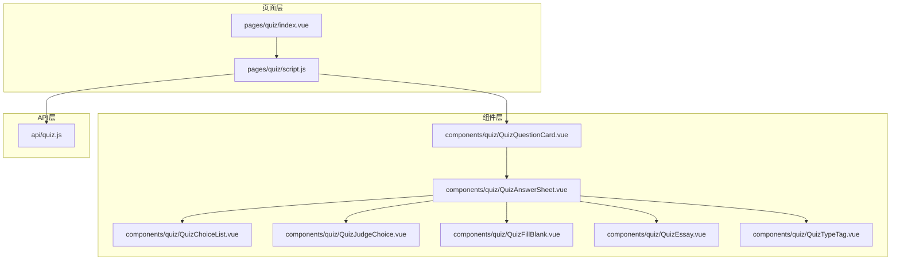
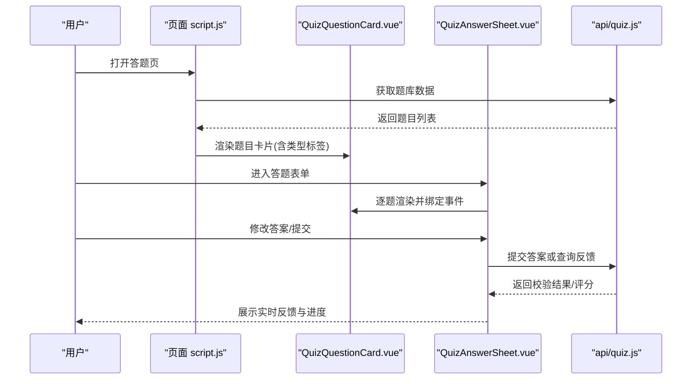
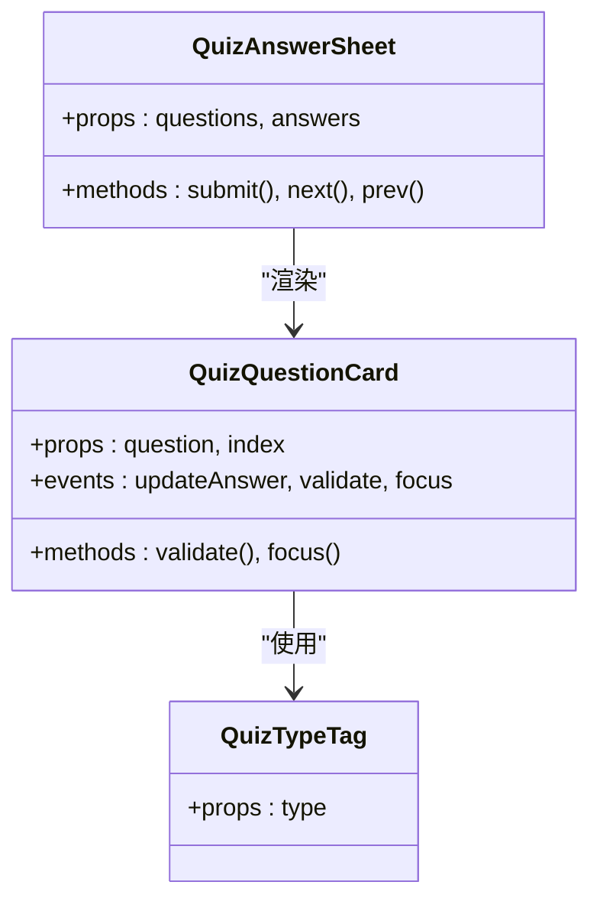
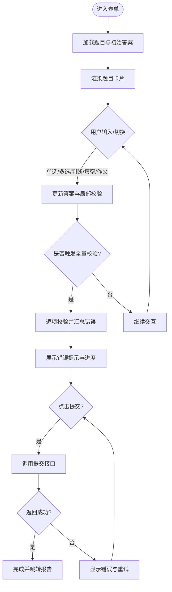
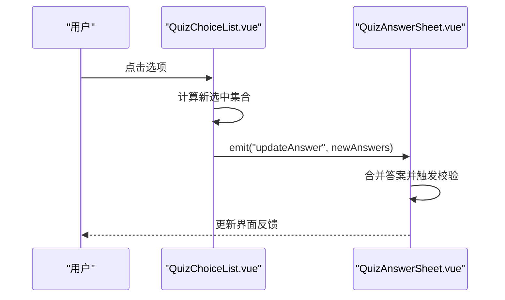
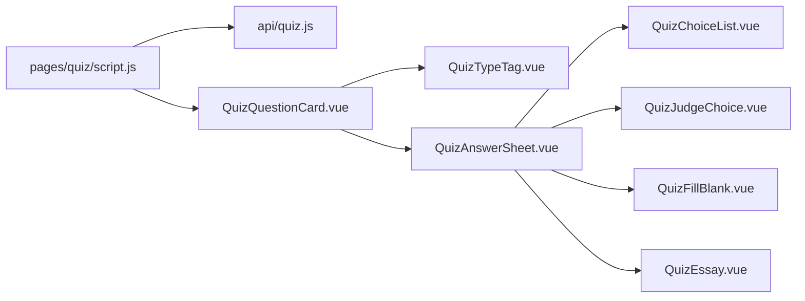

# 题库组件实现

<cite>
**本文引用的文件**   
- [QuizAnswerSheet.vue](file://WEB/src/components/quiz/QuizAnswerSheet.vue)
- [QuizChoiceList.vue](file://WEB/src/components/quiz/QuizChoiceList.vue)
- [QuizQuestionCard.vue](file://WEB/src/components/quiz/QuizQuestionCard.vue)
- [QuizEssay.vue](file://WEB/src/components/quiz/QuizEssay.vue)
- [QuizFillBlank.vue](file://WEB/src/components/quiz/QuizFillBlank.vue)
- [QuizJudgeChoice.vue](file://WEB/src/components/quiz/QuizJudgeChoice.vue)
- [QuizTypeTag.vue](file://WEB/src/components/quiz/QuizTypeTag.vue)
- [quiz.js](file://WEB/src/api/quiz.js)
- [index.vue](file://WEB/src/pages/quiz/index.vue)
- [script.js](file://WEB/src/pages/quiz/script.js)
</cite>

## 目录
1. [简介](#简介)
2. [项目结构](#项目结构)
3. [核心组件](#核心组件)
4. [架构总览](#架构总览)
5. [详细组件分析](#详细组件分析)
6. [依赖关系分析](#依赖关系分析)
7. [性能考虑](#性能考虑)
8. [故障排查指南](#故障排查指南)
9. [结论](#结论)
10. [附录](#附录)

## 简介
本文件面向题库答题模块的前端实现，聚焦于多题型（选择题、填空题、判断题、作文题）的组件化设计与交互。文档围绕以下目标展开：
- 解析 QuizAnswerSheet 答题表单、QuizChoiceList 选项列表、QuizQuestionCard 题目卡片等核心组件的职责与协作方式
- 说明多题型支持的设计模式与扩展策略
- 阐述答题状态管理、答案验证逻辑与实时反馈机制
- 梳理组件间通信模式、数据流向与错误处理策略
- 提供复杂交互场景的处理方法与性能优化技巧

## 项目结构
题库相关代码位于 WEB 前端工程内，采用按功能域划分的目录组织方式：
- components/quiz：题库答题相关 UI 组件
- pages/quiz：题库答题页面与脚本
- api/quiz：题库接口封装

图表来源
- [index.vue](file://WEB/src/pages/quiz/index.vue)
- [script.js](file://WEB/src/pages/quiz/script.js)
- [QuizQuestionCard.vue](file://WEB/src/components/quiz/QuizQuestionCard.vue)
- [QuizAnswerSheet.vue](file://WEB/src/components/quiz/QuizAnswerSheet.vue)
- [QuizChoiceList.vue](file://WEB/src/components/quiz/QuizChoiceList.vue)
- [QuizJudgeChoice.vue](file://WEB/src/components/quiz/QuizJudgeChoice.vue)
- [QuizFillBlank.vue](file://WEB/src/components/quiz/QuizFillBlank.vue)
- [QuizEssay.vue](file://WEB/src/components/quiz/QuizEssay.vue)
- [QuizTypeTag.vue](file://WEB/src/components/quiz/QuizTypeTag.vue)
- [quiz.js](file://WEB/src/api/quiz.js)

章节来源
- [index.vue](file://WEB/src/pages/quiz/index.vue)
- [script.js](file://WEB/src/pages/quiz/script.js)

## 核心组件
- QuizQuestionCard 题目卡片：承载单道题目及其类型标签、题干渲染、作答区域入口与基础校验提示
- QuizAnswerSheet 答题表单：聚合多道题目的作答状态、提交与导航控制、批量校验与结果汇总
- QuizChoiceList 选项列表：选择题选项渲染、选中态与禁用态、即时反馈
- QuizJudgeChoice 判断题：对/错选择交互
- QuizFillBlank 填空题：填空输入框、占位符与长度限制
- QuizEssay 作文题：长文本输入、字数统计与自动保存
- QuizTypeTag 题型标签：统一展示题型标识

章节来源
- [QuizQuestionCard.vue](file://WEB/src/components/quiz/QuizQuestionCard.vue)
- [QuizAnswerSheet.vue](file://WEB/src/components/quiz/QuizAnswerSheet.vue)
- [QuizChoiceList.vue](file://WEB/src/components/quiz/QuizChoiceList.vue)
- [QuizJudgeChoice.vue](file://WEB/src/components/quiz/QuizJudgeChoice.vue)
- [QuizFillBlank.vue](file://WEB/src/components/quiz/QuizFillBlank.vue)
- [QuizEssay.vue](file://WEB/src/components/quiz/QuizEssay.vue)
- [QuizTypeTag.vue](file://WEB/src/components/quiz/QuizTypeTag.vue)

## 架构总览
整体采用“页面编排 + 组件组合”的模式：
- 页面层负责路由、数据加载、全局状态与生命周期管理
- 组件层通过 props 接收题目数据与回调，内部维护局部交互状态
- API 层封装题库相关请求，统一错误处理与重试策略

图表来源
- [script.js](file://WEB/src/pages/quiz/script.js)
- [QuizQuestionCard.vue](file://WEB/src/components/quiz/QuizQuestionCard.vue)
- [QuizAnswerSheet.vue](file://WEB/src/components/quiz/QuizAnswerSheet.vue)
- [quiz.js](file://WEB/src/api/quiz.js)

## 详细组件分析

### QuizQuestionCard 题目卡片
职责与交互
- 渲染题型标签与题干内容
- 根据题型动态挂载对应作答子组件
- 暴露基础校验与焦点管理方法
- 向父级上报当前题目的作答状态变化

数据流
- 入参：题目对象（包含题型、题干、选项、参考答案等）
- 出参：onUpdateAnswer、onValidate、onFocus 等回调

图表来源
- [QuizQuestionCard.vue](file://WEB/src/components/quiz/QuizQuestionCard.vue)
- [QuizTypeTag.vue](file://WEB/src/components/quiz/QuizTypeTag.vue)
- [QuizAnswerSheet.vue](file://WEB/src/components/quiz/QuizAnswerSheet.vue)

章节来源
- [QuizQuestionCard.vue](file://WEB/src/components/quiz/QuizQuestionCard.vue)
- [QuizTypeTag.vue](file://WEB/src/components/quiz/QuizTypeTag.vue)

### QuizAnswerSheet 答题表单
职责与交互
- 维护整卷答案集合与提交状态
- 控制题目导航（上一题/下一题/跳转）
- 执行批量校验与错误定位
- 汇总提交数据并处理服务端反馈

状态管理
- 答案集：以题目 ID 为键的答案映射
- 校验状态：每道题的校验结果与提示信息
- 提交状态：加载中、成功、失败与重试

图表来源
- [QuizAnswerSheet.vue](file://WEB/src/components/quiz/QuizAnswerSheet.vue)
- [quiz.js](file://WEB/src/api/quiz.js)

章节来源
- [QuizAnswerSheet.vue](file://WEB/src/components/quiz/QuizAnswerSheet.vue)

### QuizChoiceList 选项列表
职责与交互
- 渲染选择题选项，支持单选/多选
- 维护选中态、禁用态与不可变选项
- 即时校验并向上汇报变更

数据流
- 入参：选项数组、已选答案、是否禁用
- 出参：onChange、onValidate

图表来源
- [QuizChoiceList.vue](file://WEB/src/components/quiz/QuizChoiceList.vue)
- [QuizAnswerSheet.vue](file://WEB/src/components/quiz/QuizAnswerSheet.vue)

章节来源
- [QuizChoiceList.vue](file://WEB/src/components/quiz/QuizChoiceList.vue)

### QuizJudgeChoice 判断题
职责与交互
- 二元选择（对/错），支持键盘操作
- 即时校验与高亮反馈

章节来源
- [QuizJudgeChoice.vue](file://WEB/src/components/quiz/QuizJudgeChoice.vue)

### QuizFillBlank 填空题
职责与交互
- 多空格输入，支持占位符与长度限制
- 实时校验格式与必填项

章节来源
- [QuizFillBlank.vue](file://WEB/src/components/quiz/QuizFillBlank.vue)

### QuizEssay 作文题
职责与交互
- 大文本编辑，支持字数统计与自动保存
- 防抖保存与错误恢复

章节来源
- [QuizEssay.vue](file://WEB/src/components/quiz/QuizEssay.vue)

### QuizTypeTag 题型标签
职责与交互
- 统一展示题型标识（选择题、填空题、判断题、作文题）
- 可配置颜色与图标

章节来源
- [QuizTypeTag.vue](file://WEB/src/components/quiz/QuizTypeTag.vue)

## 依赖关系分析
- 页面 script.js 负责题库数据获取、分页与缓存
- QuizQuestionCard 依赖 QuizTypeTag 进行题型标识
- QuizAnswerSheet 作为容器组件，协调各题型子组件的数据与事件
- api/quiz.js 统一封装题库相关接口，集中处理错误码与网络异常

图表来源
- [script.js](file://WEB/src/pages/quiz/script.js)
- [quiz.js](file://WEB/src/api/quiz.js)
- [QuizQuestionCard.vue](file://WEB/src/components/quiz/QuizQuestionCard.vue)
- [QuizAnswerSheet.vue](file://WEB/src/components/quiz/QuizAnswerSheet.vue)
- [QuizChoiceList.vue](file://WEB/src/components/quiz/QuizChoiceList.vue)
- [QuizJudgeChoice.vue](file://WEB/src/components/quiz/QuizJudgeChoice.vue)
- [QuizFillBlank.vue](file://WEB/src/components/quiz/QuizFillBlank.vue)
- [QuizEssay.vue](file://WEB/src/components/quiz/QuizEssay.vue)
- [QuizTypeTag.vue](file://WEB/src/components/quiz/QuizTypeTag.vue)

章节来源
- [script.js](file://WEB/src/pages/quiz/script.js)
- [quiz.js](file://WEB/src/api/quiz.js)

## 性能考虑
- 虚拟滚动与分页加载：在题目数量较大时按需渲染，减少首屏压力
- 组件懒加载与异步拆分：将重型题型组件（如作文编辑器）延迟加载
- 防抖与节流：输入框与自动保存使用防抖，避免频繁触发校验与存储
- 状态最小化：仅保留必要字段，避免深层嵌套导致不必要的重渲染
- 内存管理：及时解绑事件监听与定时器，防止内存泄漏

[本节为通用指导，不直接分析具体文件]

## 故障排查指南
常见问题与定位思路
- 接口错误：检查 api/quiz.js 的错误分支与重试逻辑，确认网络与鉴权
- 校验失败：查看各题型组件的校验规则与提示文案，确保边界条件覆盖
- 状态不同步：核对父子组件间的 props/emits 与答案合并逻辑
- 性能卡顿：开启性能面板，定位重渲染热点与阻塞任务

章节来源
- [quiz.js](file://WEB/src/api/quiz.js)
- [QuizAnswerSheet.vue](file://WEB/src/components/quiz/QuizAnswerSheet.vue)
- [QuizChoiceList.vue](file://WEB/src/components/quiz/QuizChoiceList.vue)
- [QuizFillBlank.vue](file://WEB/src/components/quiz/QuizFillBlank.vue)
- [QuizEssay.vue](file://WEB/src/components/quiz/QuizEssay.vue)

## 结论
题库答题模块通过清晰的组件分层与统一的通信契约，实现了多题型的可扩展设计。答题表单集中管理状态与校验，题型组件专注交互细节，API 层统一处理网络与错误。配合合理的性能优化策略，可在复杂交互场景下保持流畅体验。后续可进一步引入更细粒度的状态管理与测试用例，提升可维护性与稳定性。

[本节为总结性内容，不直接分析具体文件]

## 附录
- 多题型扩展建议：新增题型时，遵循“独立组件 + 统一接口”的原则，在容器组件中按题型分发渲染
- 实时反馈机制：优先本地快速反馈，再与服务端结果对齐，保证用户体验
- 错误处理策略：区分网络错误、业务校验错误与系统异常，分别给出可操作的提示与恢复路径

[本节为补充信息，不直接分析具体文件]