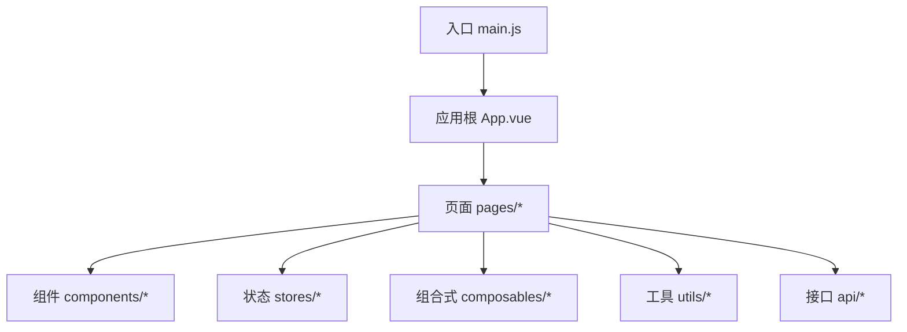
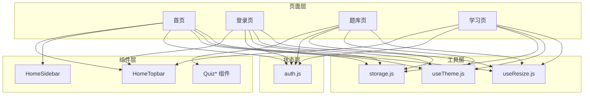
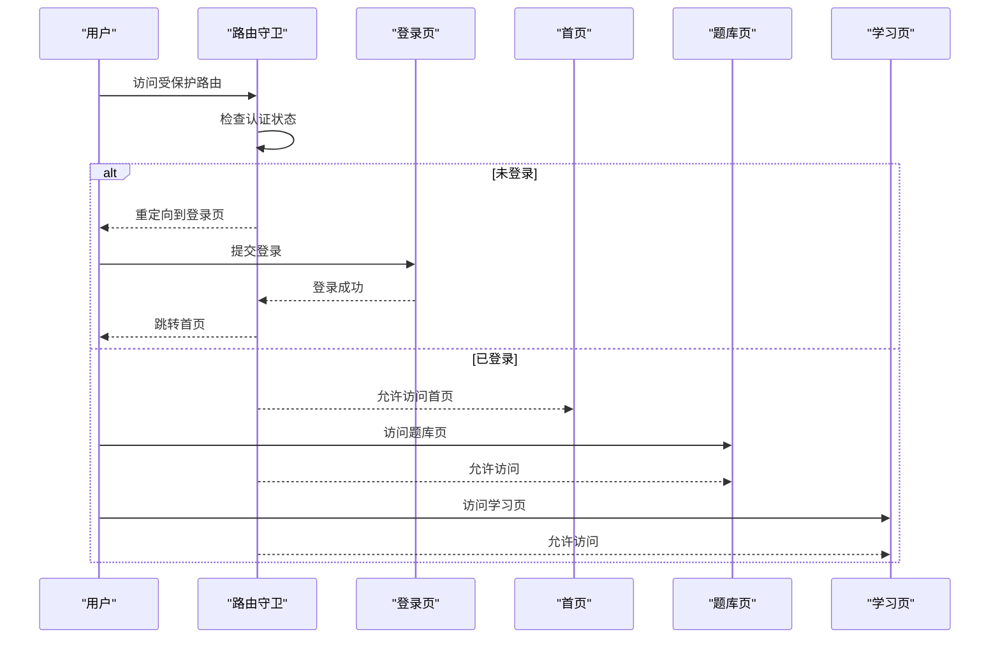
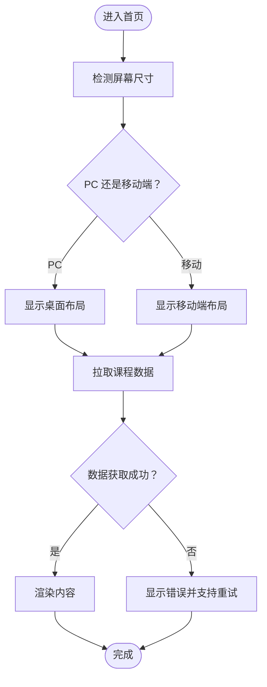
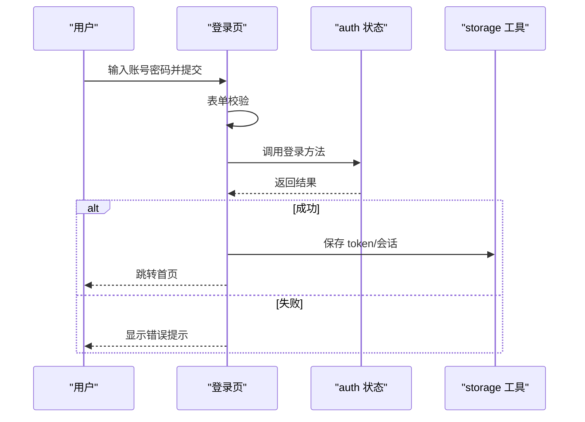
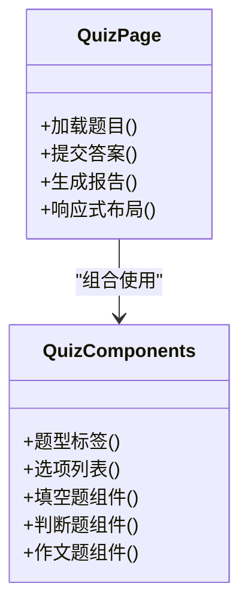
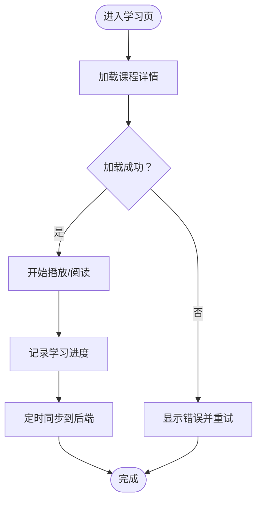
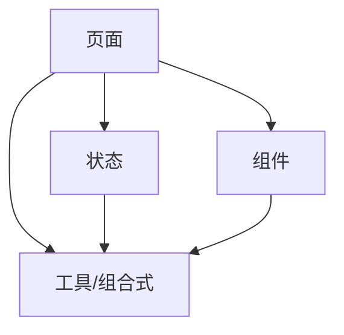
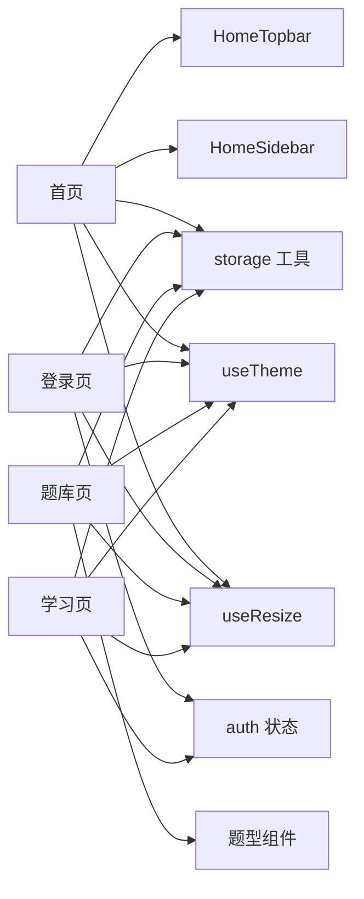

# 页面组件开发

<cite>
**本文引用的文件**   
- [main.js](file://WEB/src/main.js)
- [App.vue](file://WEB/src/App.vue)
- [index.html](file://WEB/index.html)
- [vite.config.js](file://WEB/vite.config.js)
- [pages/home/script.js](file://WEB/src/pages/home/script.js)
- [pages/login/index.vue](file://WEB/src/pages/login/index.vue)
- [pages/login/script.js](file://WEB/src/pages/login/script.js)
- [pages/quiz/index.vue](file://WEB/src/pages/quiz/index.vue)
- [pages/quiz/script.js](file://WEB/src/pages/quiz/script.js)
- [pages/study/index.vue](file://WEB/src/pages/study/index.vue)
- [pages/study/script.js](file://WEB/src/pages/study/script.js)
- [components/HomeTopbar.vue](file://WEB/src/components/HomeTopbar.vue)
- [components/HomeSidebar.vue](file://WEB/src/components/HomeSidebar.vue)
- [stores/auth.js](file://WEB/src/stores/auth.js)
- [utils/storage.js](file://WEB/src/utils/storage.js)
- [composables/useTheme.js](file://WEB/src/composables/useTheme.js)
- [composables/useResize.js](file://WEB/src/composables/useResize.js)
</cite>

## 目录
1. [简介](#简介)
2. [项目结构](#项目结构)
3. [核心组件](#核心组件)
4. [架构总览](#架构总览)
5. [详细组件分析](#详细组件分析)
6. [依赖关系分析](#依赖关系分析)
7. [性能考量](#性能考量)
8. [故障排查指南](#故障排查指南)
9. [结论](#结论)
10. [附录](#附录)

## 简介
本文件面向基于 Vue 的页面组件开发，聚焦于以下目标：
- 基于 Vue Router 的页面组织与路由配置、导航守卫的使用模式
- 页面数据获取模式、状态管理集成、错误处理机制
- 移动端与 PC 端的响应式适配策略、页面加载优化与懒加载实现
- 核心页面（首页、登录页、题库页面、学习页面）的实现要点与最佳实践
- 页面间传参与数据共享的最佳实践

说明：当前仓库前端位于 WEB 目录，采用 Vite + Vue 工程化方案。由于未提供 router 配置文件，本文在“路由与导航守卫”部分给出通用实现建议与接入方式，并结合现有页面与状态模块进行说明。

## 项目结构
前端代码集中在 WEB/src 下，按功能域划分：
- pages：页面级组件（home、login、quiz、study、billing 等）
- components：可复用 UI 组件（顶部栏、侧边栏、导入弹窗、题目卡片等）
- stores：全局状态（如认证状态）
- composables：组合式函数（主题、尺寸监听等）
- utils：工具函数（本地存储封装等）
- api：API 请求封装（按业务域拆分）

图表来源
- [main.js:1-20](file://WEB/src/main.js#L1-L20)
- [App.vue:1-30](file://WEB/src/App.vue#L1-L30)

章节来源
- [main.js:1-20](file://WEB/src/main.js#L1-L20)
- [App.vue:1-30](file://WEB/src/App.vue#L1-L30)

## 核心组件
- 页面层（pages）
  - 首页：展示课程概览与导航入口
  - 登录页：用户认证流程
  - 题库页：题目列表、作答与报告查看
  - 学习页：课程学习与进度跟踪
- 布局与通用组件（components）
  - HomeTopbar：顶部导航与信息展示
  - HomeSidebar：侧边导航与快捷入口
  - QuizTextbookCard、ImportQuizDialog 等：题库相关交互
- 状态与工具
  - stores/auth.js：认证状态集中管理
  - utils/storage.js：本地存储封装
  - composables/useTheme.js、useResize.js：主题切换与尺寸监听

章节来源
- [pages/home/script.js:1-50](file://WEB/src/pages/home/script.js#L1-L50)
- [pages/login/index.vue:1-80](file://WEB/src/pages/login/index.vue#L1-L80)
- [pages/login/script.js:1-60](file://WEB/src/pages/login/script.js#L1-L60)
- [pages/quiz/index.vue:1-120](file://WEB/src/pages/quiz/index.vue#L1-L120)
- [pages/quiz/script.js:1-100](file://WEB/src/pages/quiz/script.js#L1-L100)
- [pages/study/index.vue:1-100](file://WEB/src/pages/study/index.vue#L1-L100)
- [pages/study/script.js:1-80](file://WEB/src/pages/study/script.js#L1-L80)
- [components/HomeTopbar.vue:1-60](file://WEB/src/components/HomeTopbar.vue#L1-L60)
- [components/HomeSidebar.vue:1-60](file://WEB/src/components/HomeSidebar.vue#L1-L60)
- [stores/auth.js:1-80](file://WEB/src/stores/auth.js#L1-L80)
- [utils/storage.js:1-60](file://WEB/src/utils/storage.js#L1-L60)
- [composables/useTheme.js:1-40](file://WEB/src/composables/useTheme.js#L1-L40)
- [composables/useResize.js:1-40](file://WEB/src/composables/useResize.js#L1-L40)

## 架构总览
整体采用“页面-组件-状态-工具”的分层架构：
- 页面负责路由视图与业务编排
- 组件负责 UI 渲染与交互
- 状态管理集中维护跨页面数据（如认证态）
- 工具与组合式函数提供能力复用（存储、主题、尺寸）

图表来源
- [pages/home/script.js:1-50](file://WEB/src/pages/home/script.js#L1-L50)
- [pages/login/index.vue:1-80](file://WEB/src/pages/login/index.vue#L1-L80)
- [pages/quiz/index.vue:1-120](file://WEB/src/pages/quiz/index.vue#L1-L120)
- [pages/study/index.vue:1-100](file://WEB/src/pages/study/index.vue#L1-L100)
- [components/HomeTopbar.vue:1-60](file://WEB/src/components/HomeTopbar.vue#L1-L60)
- [components/HomeSidebar.vue:1-60](file://WEB/src/components/HomeSidebar.vue#L1-L60)
- [stores/auth.js:1-80](file://WEB/src/stores/auth.js#L1-L80)
- [utils/storage.js:1-60](file://WEB/src/utils/storage.js#L1-L60)
- [composables/useTheme.js:1-40](file://WEB/src/composables/useTheme.js#L1-L40)
- [composables/useResize.js:1-40](file://WEB/src/composables/useResize.js#L1-L40)

## 详细组件分析

### 路由与导航守卫（建议实现）
- 路由组织
  - 将 pages 下的每个业务域作为路由模块，按需懒加载
  - 使用嵌套路由承载布局（如带 Topbar/Sidebar 的布局）
- 导航守卫
  - 全局前置守卫：校验登录态，未登录重定向至登录页
  - 路由独享守卫：针对特定页面（如题库、学习）做权限或参数校验
  - 组件内守卫：页面进入时拉取数据，离开时清理副作用

说明：当前仓库未包含路由配置文件，以上为推荐实现模式。接入时可参考各页面脚本与状态模块的职责边界。

章节来源
- [stores/auth.js:1-80](file://WEB/src/stores/auth.js#L1-L80)
- [pages/login/index.vue:1-80](file://WEB/src/pages/login/index.vue#L1-L80)
- [pages/login/script.js:1-60](file://WEB/src/pages/login/script.js#L1-L60)

### 首页（Home）
- 职责
  - 展示课程概览、快速入口
  - 集成顶部栏与侧边栏
  - 根据设备尺寸调整布局
- 数据获取
  - 页面挂载后调用 API 获取课程列表
  - 失败时显示错误提示并支持重试
- 响应式
  - 使用 useResize 监听窗口尺寸，切换布局
  - 使用 useTheme 切换明暗主题

图表来源
- [pages/home/script.js:1-50](file://WEB/src/pages/home/script.js#L1-L50)
- [composables/useResize.js:1-40](file://WEB/src/composables/useResize.js#L1-L40)
- [composables/useTheme.js:1-40](file://WEB/src/composables/useTheme.js#L1-L40)

章节来源
- [pages/home/script.js:1-50](file://WEB/src/pages/home/script.js#L1-L50)
- [components/HomeTopbar.vue:1-60](file://WEB/src/components/HomeTopbar.vue#L1-L60)
- [components/HomeSidebar.vue:1-60](file://WEB/src/components/HomeSidebar.vue#L1-L60)

### 登录页（Login）
- 职责
  - 收集用户凭据，发起登录请求
  - 成功后更新认证状态并跳转
  - 失败时提示错误信息
- 状态管理
  - 通过 auth store 管理登录态与用户信息
- 本地存储
  - 使用 storage 工具持久化 token 或会话信息

图表来源
- [pages/login/index.vue:1-80](file://WEB/src/pages/login/index.vue#L1-L80)
- [pages/login/script.js:1-60](file://WEB/src/pages/login/script.js#L1-L60)
- [stores/auth.js:1-80](file://WEB/src/stores/auth.js#L1-L80)
- [utils/storage.js:1-60](file://WEB/src/utils/storage.js#L1-L60)

章节来源
- [pages/login/index.vue:1-80](file://WEB/src/pages/login/index.vue#L1-L80)
- [pages/login/script.js:1-60](file://WEB/src/pages/login/script.js#L1-L60)
- [stores/auth.js:1-80](file://WEB/src/stores/auth.js#L1-L80)
- [utils/storage.js:1-60](file://WEB/src/utils/storage.js#L1-L60)

### 题库页（Quiz）
- 职责
  - 展示题目列表、题型标签、作答界面
  - 提交答案并生成报告
- 数据获取
  - 进入页面时拉取题目数据，支持分页与筛选
  - 失败时降级显示缓存或空状态
- 状态管理
  - 使用本地状态暂存答题进度，必要时同步到后端
- 响应式
  - 移动端简化操作区，PC 端展示完整题面与解析

图表来源
- [pages/quiz/index.vue:1-120](file://WEB/src/pages/quiz/index.vue#L1-L120)
- [pages/quiz/script.js:1-100](file://WEB/src/pages/quiz/script.js#L1-L100)

章节来源
- [pages/quiz/index.vue:1-120](file://WEB/src/pages/quiz/index.vue#L1-L120)
- [pages/quiz/script.js:1-100](file://WEB/src/pages/quiz/script.js#L1-L100)

### 学习页（Study）
- 职责
  - 播放课程视频/图文内容
  - 记录学习进度与停留时长
- 数据获取
  - 进入页面拉取课程详情与章节列表
  - 定时上报学习进度
- 状态管理
  - 使用 auth store 判断用户权限
  - 使用 storage 缓存学习进度
- 响应式
  - 移动端全屏播放，PC 端分栏展示笔记与目录

图表来源
- [pages/study/index.vue:1-100](file://WEB/src/pages/study/index.vue#L1-L100)
- [pages/study/script.js:1-80](file://WEB/src/pages/study/script.js#L1-L80)
- [stores/auth.js:1-80](file://WEB/src/stores/auth.js#L1-L80)
- [utils/storage.js:1-60](file://WEB/src/utils/storage.js#L1-L60)

章节来源
- [pages/study/index.vue:1-100](file://WEB/src/pages/study/index.vue#L1-L100)
- [pages/study/script.js:1-80](file://WEB/src/pages/study/script.js#L1-L80)
- [stores/auth.js:1-80](file://WEB/src/stores/auth.js#L1-L80)
- [utils/storage.js:1-60](file://WEB/src/utils/storage.js#L1-L60)

### 概念总览（非代码映射）
- 页面组织原则
  - 以业务域为维度组织页面与组件
  - 公共逻辑下沉到 composables 与 utils
- 数据流模式
  - 页面发起请求 -> 更新本地状态 -> 驱动 UI 渲染
  - 跨页面共享通过 stores 统一管理
- 错误处理
  - 统一捕获网络异常与业务错误
  - 提供用户友好的提示与重试入口

[本图为概念性流程图，不直接映射具体源码文件]

## 依赖关系分析
- 页面与组件
  - 首页依赖 HomeTopbar、HomeSidebar
  - 题库页依赖多种题型组件
- 页面与状态
  - 所有页面依赖 auth 状态进行权限控制
- 页面与工具
  - 使用 storage 进行本地持久化
  - 使用 useTheme、useResize 提升体验

图表来源
- [pages/home/script.js:1-50](file://WEB/src/pages/home/script.js#L1-L50)
- [pages/login/index.vue:1-80](file://WEB/src/pages/login/index.vue#L1-L80)
- [pages/quiz/index.vue:1-120](file://WEB/src/pages/quiz/index.vue#L1-L120)
- [pages/study/index.vue:1-100](file://WEB/src/pages/study/index.vue#L1-L100)
- [components/HomeTopbar.vue:1-60](file://WEB/src/components/HomeTopbar.vue#L1-L60)
- [components/HomeSidebar.vue:1-60](file://WEB/src/components/HomeSidebar.vue#L1-L60)
- [stores/auth.js:1-80](file://WEB/src/stores/auth.js#L1-L80)
- [utils/storage.js:1-60](file://WEB/src/utils/storage.js#L1-L60)
- [composables/useTheme.js:1-40](file://WEB/src/composables/useTheme.js#L1-L40)
- [composables/useResize.js:1-40](file://WEB/src/composables/useResize.js#L1-L40)

章节来源
- [pages/home/script.js:1-50](file://WEB/src/pages/home/script.js#L1-L50)
- [pages/login/index.vue:1-80](file://WEB/src/pages/login/index.vue#L1-L80)
- [pages/quiz/index.vue:1-120](file://WEB/src/pages/quiz/index.vue#L1-L120)
- [pages/study/index.vue:1-100](file://WEB/src/pages/study/index.vue#L1-L100)
- [stores/auth.js:1-80](file://WEB/src/stores/auth.js#L1-L80)
- [utils/storage.js:1-60](file://WEB/src/utils/storage.js#L1-L60)
- [composables/useTheme.js:1-40](file://WEB/src/composables/useTheme.js#L1-L40)
- [composables/useResize.js:1-40](file://WEB/src/composables/useResize.js#L1-L40)

## 性能考量
- 路由懒加载
  - 将页面组件按路由拆分，按需加载减少首屏体积
- 组件级懒加载
  - 大组件（如视频播放器、复杂图表）使用动态导入
- 数据预取与缓存
  - 对热点数据（如课程列表）进行缓存与增量更新
- 资源优化
  - 图片压缩与懒加载，字体按需加载
- 渲染优化
  - 列表虚拟化、防抖节流、避免不必要的重渲染

[本节为通用指导，不直接分析具体文件]

## 故障排查指南
- 常见问题
  - 路由跳转无效：检查路由配置与守卫逻辑
  - 登录态丢失：检查 storage 读写与 auth 状态同步
  - 数据加载失败：检查 API 地址、鉴权头与错误码处理
  - 响应式错乱：检查 useResize 监听与样式媒体查询
- 定位方法
  - 使用浏览器开发者工具查看网络请求与错误日志
  - 在关键步骤打印状态变化，确认数据流
  - 对异步操作增加超时与重试机制

章节来源
- [utils/storage.js:1-60](file://WEB/src/utils/storage.js#L1-L60)
- [stores/auth.js:1-80](file://WEB/src/stores/auth.js#L1-L80)

## 结论
本项目采用清晰的页面-组件-状态-工具分层架构，便于扩展与维护。结合响应式适配、懒加载与统一错误处理，能够为用户提供良好的学习体验。建议在后续迭代中完善路由与导航守卫配置，强化数据缓存与性能监控，进一步提升稳定性与用户体验。

[本节为总结性内容，不直接分析具体文件]

## 附录
- 工程配置
  - 入口文件：main.js
  - 根组件：App.vue
  - 构建配置：vite.config.js
  - HTML 模板：index.html

章节来源
- [main.js:1-20](file://WEB/src/main.js#L1-L20)
- [App.vue:1-30](file://WEB/src/App.vue#L1-L30)
- [vite.config.js:1-40](file://WEB/vite.config.js#L1-L40)
- [index.html:1-30](file://WEB/index.html#L1-L30)