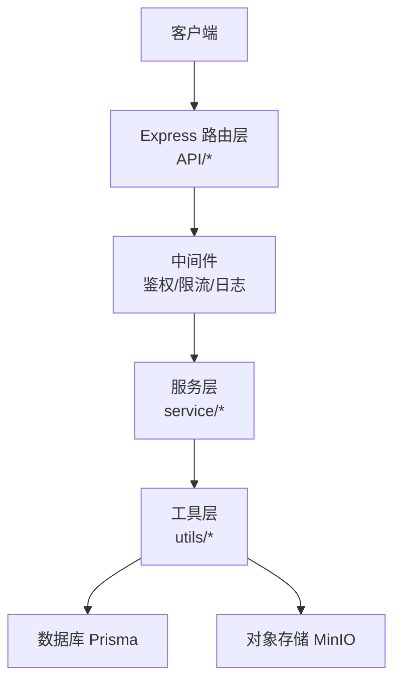
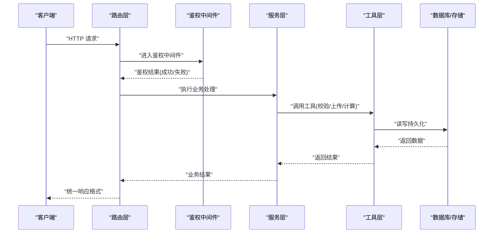
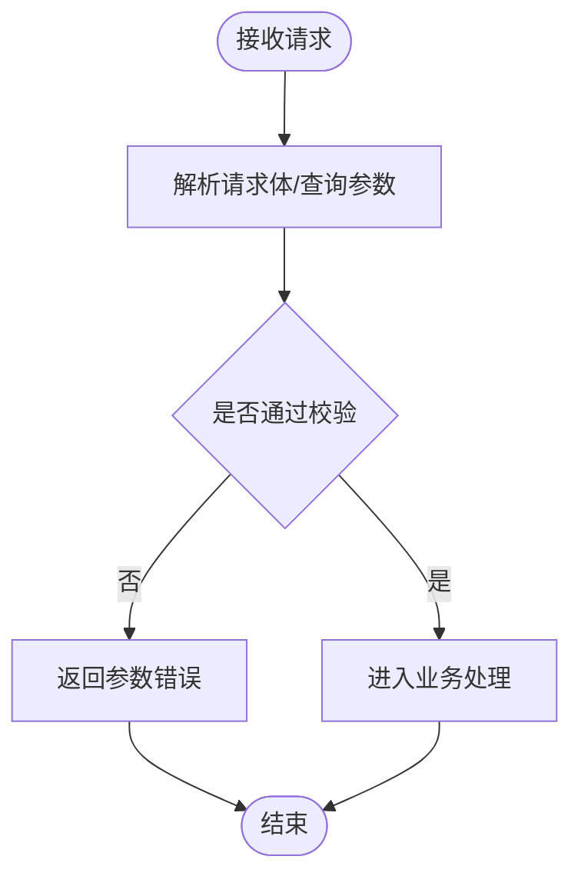
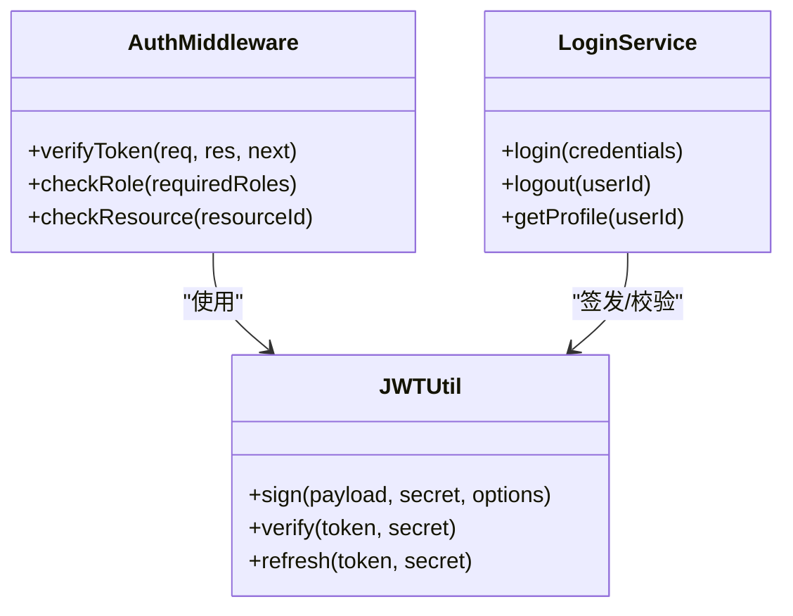
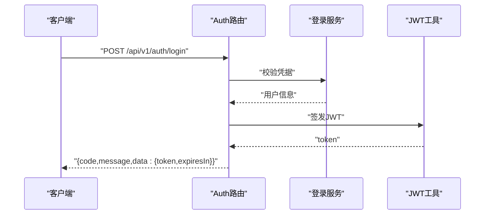
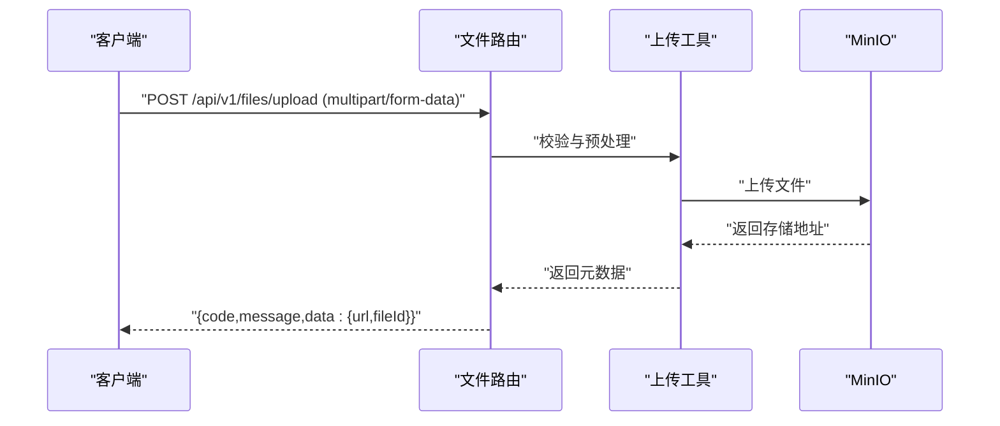
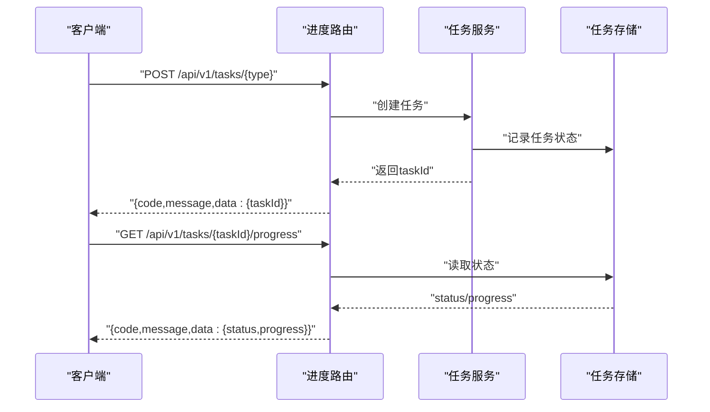
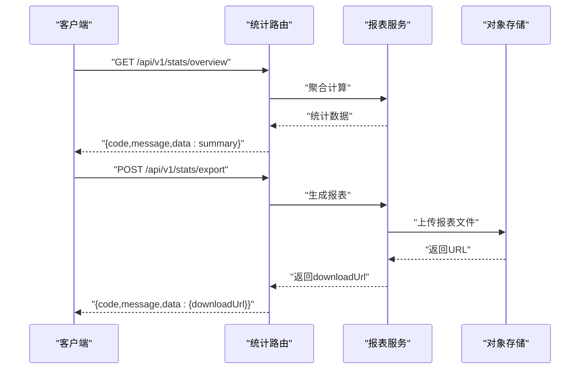
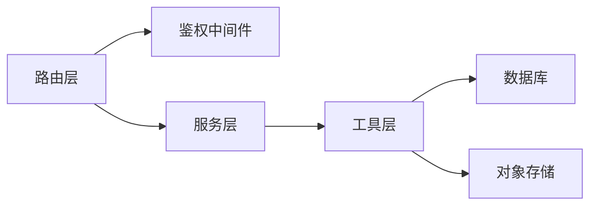

# API设计规范

<cite>
**本文档引用的文件**   
- [app.js](file://node-jinmao/app.js)
- [auth.js](file://node-jinmao/API/auth.js)
- [billing.js](file://node-jinmao/API/billing.js)
- [files.js](file://node-jinmao/API/files.js)
- [progress.js](file://node-jinmao/API/progress.js)
- [stats.js](file://node-jinmao/API/stats.js)
- [book/index.js](file://node-jinmao/API/book/index.js)
- [course/index.js](file://node-jinmao/API/course/index.js)
- [quiz/import.js](file://node-jinmao/API/quiz/import.js)
- [quiz/session.js](file://node-jinmao/API/quiz/session.js)
- [quiz/report.js](file://node-jinmao/API/quiz/report.js)
- [middleware/auth.js](file://node-jinmao/middleware/auth.js)
- [service/auth/login.js](file://node-jinmao/service/auth/login.js)
- [service/auth/profile.js](file://node-jinmao/service/auth/profile.js)
- [utils/jwt.js](file://node-jinmao/utils/jwt.js)
- [utils/input_validator.js](file://node-jinmao/utils/input_validator.js)
- [utils/upload_minio.js](file://node-jinmao/utils/upload_minio.js)
- [API文档.md](file://API文档.md)
</cite>

## 目录
1. [简介](#简介)
2. [项目结构](#项目结构)
3. [核心组件](#核心组件)
4. [架构总览](#架构总览)
5. [详细组件分析](#详细组件分析)
6. [依赖关系分析](#依赖关系分析)
7. [性能考虑](#性能考虑)
8. [故障排查指南](#故障排查指南)
9. [结论](#结论)
10. [附录](#附录)

## 简介
本规范面向本项目的前后端接口设计与实现，目标是统一RESTful风格、URL命名、HTTP方法约定、参数校验、响应格式、错误码体系、认证鉴权、权限控制与限流策略，并给出用户认证、文件上传、进度跟踪、统计分析等核心接口的示例。同时明确API版本管理策略、向后兼容性保证以及API文档生成工具的使用方式。

## 项目结构
后端采用Express路由+中间件+服务层+工具层的分层组织：
- 路由层：按业务域划分（auth、book、course、quiz、files、progress、stats、billing）
- 中间件层：鉴权、日志、限流等通用能力
- 服务层：具体业务逻辑（登录、资料、题库、报告等）
- 工具层：JWT、输入校验、MinIO上传、数据库访问等

**图表来源** 
- [app.js:1-200](file://node-jinmao/app.js#L1-L200)
- [middleware/auth.js:1-200](file://node-jinmao/middleware/auth.js#L1-L200)

**章节来源**
- [app.js:1-200](file://node-jinmao/app.js#L1-L200)

## 核心组件
- 路由模块：集中定义各业务域的路由入口，便于版本化与模块化维护
- 鉴权中间件：基于JWT的认证与授权，支持角色/资源级权限
- 输入校验：统一的参数校验流程，确保请求体与查询参数的合法性
- 文件上传：通过MinIO进行文件存取，提供分片/断点续传扩展点
- 任务与进度：异步任务状态追踪，结合SSE或轮询获取进度
- 统计报表：聚合数据计算与导出，支持分页与过滤

**章节来源**
- [API/auth.js:1-200](file://node-jinmao/API/auth.js#L1-L200)
- [middleware/auth.js:1-200](file://node-jinmao/middleware/auth.js#L1-L200)
- [utils/input_validator.js:1-200](file://node-jinmao/utils/input_validator.js#L1-L200)
- [utils/upload_minio.js:1-200](file://node-jinmao/utils/upload_minio.js#L1-L200)
- [API/progress.js:1-200](file://node-jinmao/API/progress.js#L1-L200)
- [API/stats.js:1-200](file://node-jinmao/API/stats.js#L1-L200)

## 架构总览
整体遵循“路由→中间件→服务→工具”的分层调用链，所有对外暴露的API均经过鉴权与校验，返回统一响应结构。

**图表来源** 
- [app.js:1-200](file://node-jinmao/app.js#L1-L200)
- [middleware/auth.js:1-200](file://node-jinmao/middleware/auth.js#L1-L200)
- [service/auth/login.js:1-200](file://node-jinmao/service/auth/login.js#L1-L200)

## 详细组件分析

### RESTful 设计原则与URL命名规范
- 使用名词复数表示资源集合，如 /api/v1/users、/api/v1/books
- 层级清晰，避免动词出现在路径中；操作通过HTTP方法表达
- 查询参数用于筛选、排序、分页；路径参数用于标识资源
- 版本号以URL前缀形式体现，如 /api/v1/...

建议的URL命名规则：
- 资源名小写、连字符分隔，如 /api/v1/user-profiles
- 嵌套资源不超过两层，如 /api/v1/users/:userId/books
- 列表接口支持分页参数 page、pageSize、sort、filter

**章节来源**
- [API/docs 参考:1-200](file://API文档.md#L1-L200)

### HTTP方法使用约定
- GET：读取资源，幂等，无副作用
- POST：创建资源，非幂等
- PUT：全量更新资源，幂等
- PATCH：部分更新资源，幂等
- DELETE：删除资源，幂等

对于批量操作，建议使用POST /api/v1/resources/batch，并在请求体中声明操作类型与目标ID列表。

**章节来源**
- [API文档.md:1-200](file://API文档.md#L1-L200)

### 请求参数验证
- 统一在中间件或控制器入口处进行参数校验
- 校验内容包括：必填项、数据类型、长度范围、正则匹配、枚举值
- 校验失败返回标准错误结构，包含字段级错误信息

校验流程示意：

**图表来源** 
- [utils/input_validator.js:1-200](file://node-jinmao/utils/input_validator.js#L1-L200)

**章节来源**
- [utils/input_validator.js:1-200](file://node-jinmao/utils/input_validator.js#L1-L200)

### 响应数据格式统一
所有接口返回统一结构：
- code：业务状态码（整数）
- message：人类可读消息
- data：业务数据（可为对象、数组或null）
- traceId：请求追踪ID（可选）

示例结构（不展示代码内容，仅描述字段）：
- 成功：code=0，data为业务数据
- 失败：code≠0，message说明原因，data可为空或附带错误详情

**章节来源**
- [API文档.md:1-200](file://API文档.md#L1-L200)

### 错误码定义标准
- 全局错误码：如 1000 参数错误、2000 认证失败、3000 权限不足、4000 业务异常、5000 系统错误
- 业务错误码：按模块细分，如 1001 用户名不存在、1002 密码错误
- 错误响应包含 code、message、traceId，必要时附加 fieldErrors

**章节来源**
- [API文档.md:1-200](file://API文档.md#L1-L200)

### 认证与鉴权机制
- 认证：基于JWT，登录成功后返回token，后续请求携带Authorization头
- 鉴权：中间件解析token并校验签名与过期时间，支持角色/资源级权限
- 敏感接口需二次校验（如支付、删除），可引入一次性验证码或会话锁定

**图表来源** 
- [middleware/auth.js:1-200](file://node-jinmao/middleware/auth.js#L1-L200)
- [utils/jwt.js:1-200](file://node-jinmao/utils/jwt.js#L1-L200)
- [service/auth/login.js:1-200](file://node-jinmao/service/auth/login.js#L1-L200)

**章节来源**
- [middleware/auth.js:1-200](file://node-jinmao/middleware/auth.js#L1-L200)
- [utils/jwt.js:1-200](file://node-jinmao/utils/jwt.js#L1-L200)
- [service/auth/login.js:1-200](file://node-jinmao/service/auth/login.js#L1-L200)

### 权限控制策略
- 基于角色的访问控制（RBAC）：用户角色决定可访问的资源与方法
- 资源级权限：对特定资源实例的访问控制，如 /api/v1/users/:id
- 细粒度权限：字段级可见性控制，如敏感字段脱敏或隐藏

**章节来源**
- [middleware/auth.js:1-200](file://node-jinmao/middleware/auth.js#L1-L200)

### 请求限流实现
- 基于IP或用户ID的滑动窗口限流，防止恶意刷接口
- 不同接口设置不同阈值，如登录接口更严格
- 限流命中返回标准错误码与重试提示

**章节来源**
- [API文档.md:1-200](file://API文档.md#L1-L200)

### 用户认证接口示例
- 登录：POST /api/v1/auth/login
  - 请求体：username、password
  - 响应：code、message、data.token、data.expiresIn
- 登出：POST /api/v1/auth/logout
  - 请求头：Authorization
  - 响应：code、message
- 获取当前用户信息：GET /api/v1/auth/me
  - 请求头：Authorization
  - 响应：code、message、data.profile

**图表来源** 
- [API/auth.js:1-200](file://node-jinmao/API/auth.js#L1-L200)
- [service/auth/login.js:1-200](file://node-jinmao/service/auth/login.js#L1-L200)
- [utils/jwt.js:1-200](file://node-jinmao/utils/jwt.js#L1-L200)

**章节来源**
- [API/auth.js:1-200](file://node-jinmao/API/auth.js#L1-L200)
- [service/auth/login.js:1-200](file://node-jinmao/service/auth/login.js#L1-L200)

### 文件上传接口示例
- 上传文件：POST /api/v1/files/upload
  - 表单字段：file、metadata
  - 响应：code、message、data.url、data.fileId
- 下载文件：GET /api/v1/files/:fileId
  - 响应：二进制流或预签名URL
- 删除文件：DELETE /api/v1/files/:fileId
  - 响应：code、message

**图表来源** 
- [API/files.js:1-200](file://node-jinmao/API/files.js#L1-L200)
- [utils/upload_minio.js:1-200](file://node-jinmao/utils/upload_minio.js#L1-L200)

**章节来源**
- [API/files.js:1-200](file://node-jinmao/API/files.js#L1-L200)
- [utils/upload_minio.js:1-200](file://node-jinmao/utils/upload_minio.js#L1-L200)

### 进度跟踪接口示例
- 提交任务：POST /api/v1/tasks/{type}
  - 响应：code、message、data.taskId
- 查询进度：GET /api/v1/tasks/{taskId}/progress
  - 响应：code、message、data.status、data.progress、data.resultUrl
- SSE推送（可选）：GET /api/v1/tasks/{taskId}/stream

**图表来源** 
- [API/progress.js:1-200](file://node-jinmao/API/progress.js#L1-L200)

**章节来源**
- [API/progress.js:1-200](file://node-jinmao/API/progress.js#L1-L200)

### 统计分析接口示例
- 获取统计概览：GET /api/v1/stats/overview?period=week
  - 响应：code、message、data.summary
- 导出报表：POST /api/v1/stats/export?type=pdf&period=month
  - 响应：code、message、data.downloadUrl

**图表来源** 
- [API/stats.js:1-200](file://node-jinmao/API/stats.js#L1-L200)

**章节来源**
- [API/stats.js:1-200](file://node-jinmao/API/stats.js#L1-L200)

### API版本管理与向后兼容
- 版本前缀：/api/v1/...，新增功能使用新版本，旧版本保持兼容
- 废弃字段：通过标记deprecated而非直接删除，保留至少两个大版本
- 变更通知：发布说明与迁移指南，提供降级策略与回滚方案

**章节来源**
- [API文档.md:1-200](file://API文档.md#L1-L200)

### API文档生成工具
- 推荐使用OpenAPI/Swagger生成文档，结合路由注释自动生成
- 前端可通过Swagger UI在线调试，后端提供JSON/YAML规范文件
- 文档与代码同步更新，CI中集成校验与预览

**章节来源**
- [API文档.md:1-200](file://API文档.md#L1-L200)

## 依赖关系分析
- 路由层依赖中间件与服务层，服务层依赖工具层与外部存储
- 鉴权中间件贯穿所有受保护路由，确保统一安全策略
- 输入校验与错误处理集中在工具层，提升复用性与一致性

**图表来源** 
- [app.js:1-200](file://node-jinmao/app.js#L1-L200)
- [middleware/auth.js:1-200](file://node-jinmao/middleware/auth.js#L1-L200)

**章节来源**
- [app.js:1-200](file://node-jinmao/app.js#L1-L200)

## 性能考虑
- 接口缓存：热点数据使用Redis缓存，设置合理TTL与失效策略
- 分页与懒加载：列表接口默认分页，避免一次性返回大量数据
- 异步处理：耗时任务放入队列，返回taskId供前端轮询或SSE推送
- 连接池：数据库与对象存储连接复用，减少握手开销

[本节为通用指导，无需引用具体文件]

## 故障排查指南
- 常见错误：参数校验失败、JWT过期、权限不足、服务超时
- 定位手段：启用traceId，集中日志输出，监控关键指标（QPS、延迟、错误率）
- 恢复策略：熔断与降级、重试与退避、快速失败与优雅关闭

**章节来源**
- [API文档.md:1-200](file://API文档.md#L1-L200)

## 结论
本规范明确了RESTful设计、URL命名、HTTP方法、参数校验、响应格式、错误码、认证鉴权、权限控制与限流策略，并通过用户认证、文件上传、进度跟踪、统计分析等核心接口示例展示了落地方式。配合版本管理与文档生成工具，可保障API的可维护性与可扩展性。

[本节为总结，无需引用具体文件]

## 附录
- 术语表：RESTful、JWT、RBAC、SSE、MinIO、Prisma
- 参考链接：OpenAPI规范、Express中间件开发、JWT最佳实践

[本节为补充信息，无需引用具体文件]