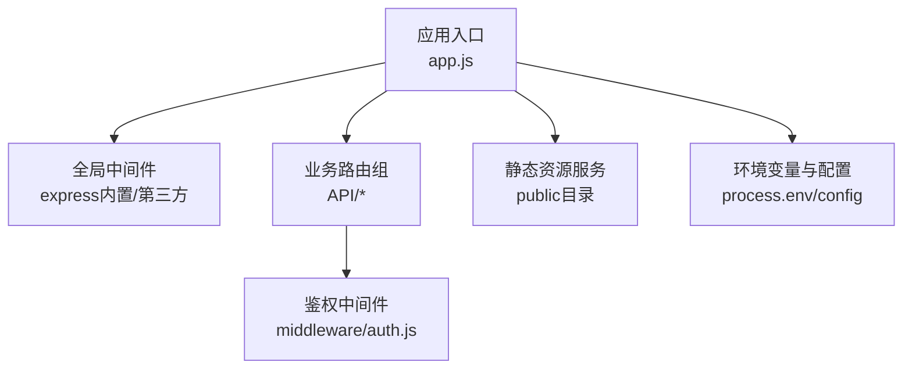
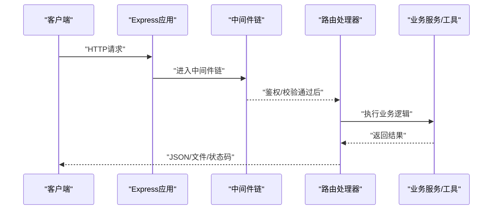
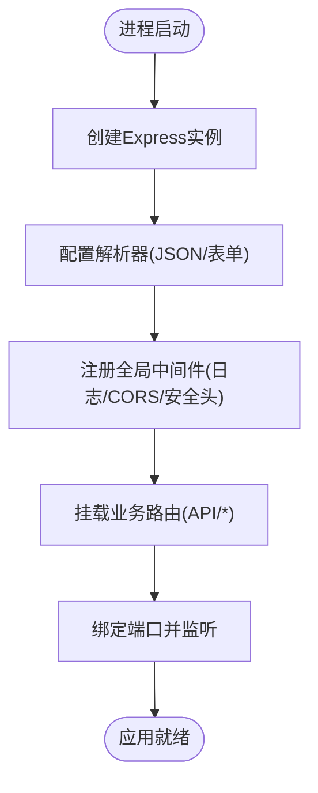
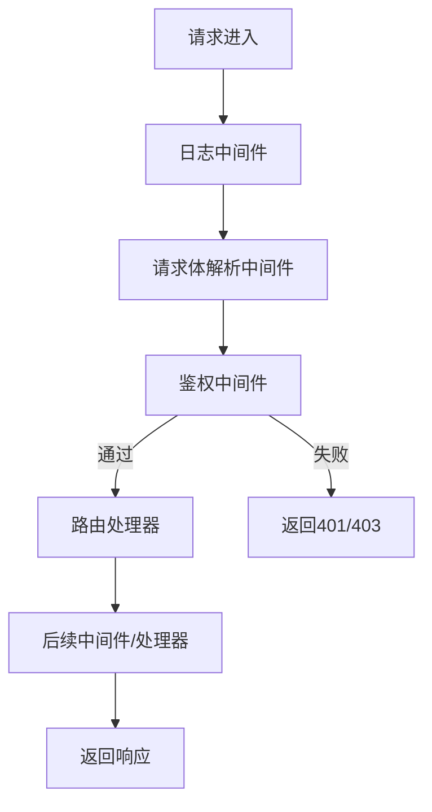
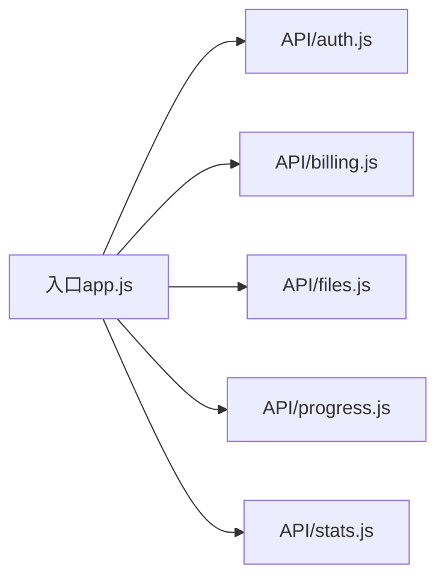
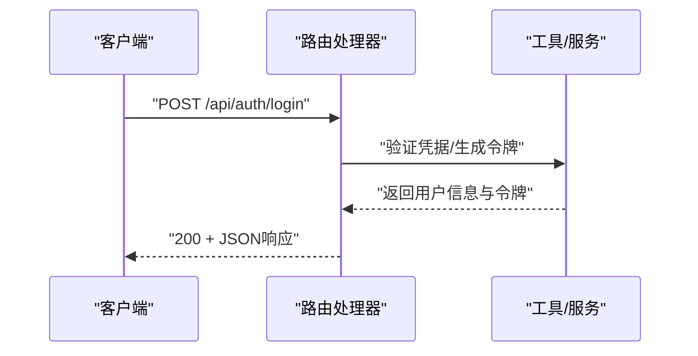
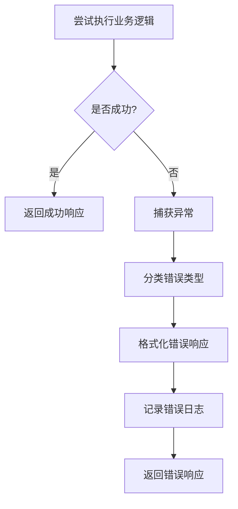
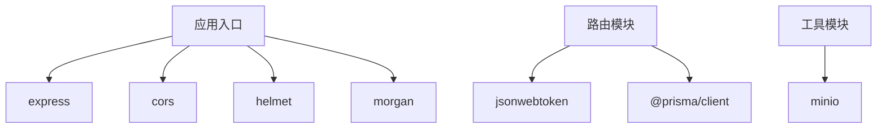

# Express框架基础

<cite>
**本文引用的文件**   
- [app.js](file://node-jinmao/app.js)
- [package.json](file://node-jinmao/package.json)
- [auth.js](file://node-jinmao/middleware/auth.js)
- [index.js](file://node-jinmao/API/auth.js)
- [index.js](file://node-jinmao/API/billing.js)
- [index.js](file://node-jinmao/API/files.js)
- [index.js](file://node-jinmao/API/progress.js)
- [index.js](file://node-jinmao/API/stats.js)
- [index.ts](file://test/金毛刷题/backend/src/routes/index.ts)
- [app.ts](file://test/金毛刷题/backend/src/app.ts)
</cite>

## 目录
1. [简介](#简介)
2. [项目结构](#项目结构)
3. [核心组件](#核心组件)
4. [架构总览](#架构总览)
5. [详细组件分析](#详细组件分析)
6. [依赖分析](#依赖分析)
7. [性能考虑](#性能考虑)
8. [故障排查指南](#故障排查指南)
9. [结论](#结论)
10. [附录](#附录)

## 简介
本文件面向初学者与有经验的开发者，系统讲解Express框架的基础能力与实践方法。内容覆盖：
- Express应用初始化流程
- 中间件注册机制与执行顺序
- 路由配置方式与模块化组织
- 请求处理流程、响应模式与错误处理
- 静态文件服务、模板引擎集成与环境变量配置
- 最佳实践：项目结构、模块划分、依赖管理

为便于理解，文档结合仓库中的实际代码进行说明，并给出可视化图示与“章节来源”定位，帮助读者快速定位到具体实现。

## 项目结构
本项目采用分层与按功能域划分的混合结构：
- 入口与应用初始化：位于根级应用文件，负责创建Express实例、挂载全局中间件、加载路由与启动服务
- 中间件：统一放在middleware目录，如鉴权中间件
- API路由：按业务域拆分在API目录，每个子目录对应一个领域（如auth、billing等），并在各自index中定义路由
- 工具与服务：utils与service目录分别存放通用工具与业务服务逻辑
- 数据库与配置：prisma与config目录用于数据模型与外部配置

图表来源 
- [app.js](file://node-jinmao/app.js)
- [auth.js](file://node-jinmao/middleware/auth.js)
- [index.js](file://node-jinmao/API/auth.js)

章节来源
- [app.js](file://node-jinmao/app.js)
- [package.json](file://node-jinmao/package.json)

## 核心组件
- 应用初始化：创建Express实例，设置端口、监听地址、解析器与CORS等全局中间件，挂载路由后启动HTTP服务
- 中间件体系：包括日志、请求体解析、安全头、CORS、鉴权等；中间件按注册顺序依次执行
- 路由组织：按业务域拆分为独立模块，集中导出路由，由入口统一挂载到前缀路径下
- 错误处理：通过统一的错误处理中间件捕获异常，返回标准化错误响应
- 静态文件与模板：提供静态资源托管与可选的模板渲染能力

章节来源
- [app.js](file://node-jinmao/app.js)
- [auth.js](file://node-jinmao/middleware/auth.js)
- [index.js](file://node-jinmao/API/auth.js)

## 架构总览
下图展示了从客户端请求到服务端处理的典型链路：客户端发起HTTP请求，经过全局中间件链（日志、解析、鉴权等），进入路由层匹配处理器，处理器调用服务或工具完成业务逻辑，最终通过响应对象返回结果。

图表来源 
- [app.js](file://node-jinmao/app.js)
- [auth.js](file://node-jinmao/middleware/auth.js)
- [index.js](file://node-jinmao/API/auth.js)

## 详细组件分析

### 应用初始化与启动
- 创建Express实例并配置常用选项（如JSON解析、URL编码解析）
- 挂载全局中间件：日志、CORS、安全头等
- 挂载路由：将各业务域的路由挂载到统一前缀
- 启动服务：绑定端口与监听地址，输出启动信息

图表来源 
- [app.js](file://node-jinmao/app.js)

章节来源
- [app.js](file://node-jinmao/app.js)

### 中间件注册机制
- 中间件类型：应用级中间件、路由级中间件、错误处理中间件
- 执行顺序：按注册顺序依次执行；可通过next()传递控制权
- 鉴权示例：在路由前挂载鉴权中间件，校验令牌或会话，失败则返回未授权响应

图表来源 
- [auth.js](file://node-jinmao/middleware/auth.js)

章节来源
- [auth.js](file://node-jinmao/middleware/auth.js)

### 路由配置方式
- 模块化路由：每个业务域一个路由文件，集中定义该域的所有接口
- 统一挂载：入口文件将所有路由挂载到统一前缀（如/api）
- 参数与查询：支持路径参数、查询字符串与请求体解析

图表来源 
- [index.js](file://node-jinmao/API/auth.js)
- [index.js](file://node-jinmao/API/billing.js)
- [index.js](file://node-jinmao/API/files.js)
- [index.js](file://node-jinmao/API/progress.js)
- [index.js](file://node-jinmao/API/stats.js)

章节来源
- [index.js](file://node-jinmao/API/auth.js)
- [index.js](file://node-jinmao/API/billing.js)
- [index.js](file://node-jinmao/API/files.js)
- [index.js](file://node-jinmao/API/progress.js)
- [index.js](file://node-jinmao/API/stats.js)

### 请求处理流程与响应模式
- 请求生命周期：进入中间件链 -> 路由匹配 -> 处理器执行业务逻辑 -> 返回响应
- 响应模式：JSON响应、文件下载、重定向、状态码控制
- 异步处理：使用Promise/async-await，确保错误被捕获并交由错误处理中间件

图表来源 
- [index.js](file://node-jinmao/API/auth.js)

章节来源
- [index.js](file://node-jinmao/API/auth.js)

### 错误处理机制
- 统一错误中间件：捕获同步与异步异常，记录日志，返回标准化错误结构
- 常见错误分类：参数校验错误、权限不足、业务异常、系统异常
- 最佳实践：避免泄露敏感信息，区分开发环境与生产环境错误细节

章节来源
- [app.js](file://node-jinmao/app.js)

### 静态文件服务与模板引擎
- 静态文件：通过静态目录中间件提供public下的资源访问
- 模板引擎：可集成EJS/Pug等模板引擎，渲染HTML页面（按需启用）
- 建议：前端构建产物与后端静态资源分离，避免耦合

章节来源
- [app.js](file://node-jinmao/app.js)

### 环境变量配置
- 使用环境变量管理敏感信息与运行配置（如端口、密钥、数据库连接）
- 推荐方案：使用dotenv库加载.env文件，或在部署平台注入环境变量
- 安全建议：不在代码中硬编码密钥，区分开发与生产环境

章节来源
- [package.json](file://node-jinmao/package.json)

## 依赖分析
- 核心依赖：express、cors、helmet、morgan等
- 业务依赖：JWT、数据库ORM（Prisma）、文件存储（MinIO）等
- 开发依赖：nodemon、测试框架、TypeScript支持（在另一子项目中）

图表来源 
- [package.json](file://node-jinmao/package.json)
- [index.js](file://node-jinmao/API/auth.js)

章节来源
- [package.json](file://node-jinmao/package.json)

## 性能考虑
- 中间件精简：仅注册必要的中间件，减少不必要的处理开销
- 缓存策略：对热点数据使用内存缓存或Redis缓存
- 压缩与Gzip：启用响应压缩，减少传输体积
- 连接池与限流：数据库连接池、API限流与并发控制
- 监控与指标：接入APM与日志聚合，观察慢请求与错误率

[本节为通用指导，不直接分析具体文件]

## 故障排查指南
- 常见问题：端口占用、CORS跨域、请求体解析失败、鉴权失败、静态资源404
- 排查步骤：查看日志、检查中间件顺序、验证路由前缀、确认环境变量
- 调试技巧：开启详细日志、使用断点调试、最小化复现用例

章节来源
- [app.js](file://node-jinmao/app.js)
- [auth.js](file://node-jinmao/middleware/auth.js)

## 结论
通过本文件的系统讲解与仓库中的实际代码映射，读者可以掌握Express应用的初始化、中间件机制、路由组织、请求与响应处理、错误处理以及常用功能的集成方法。遵循最佳实践，有助于构建可维护、可扩展且高性能的后端服务。

[本节为总结性内容，不直接分析具体文件]

## 附录
- 参考示例：在TypeScript版本的Express项目中，路由与应用的组织方式可作为参考
  - 路由索引：[index.ts](file://test/金毛刷题/backend/src/routes/index.ts)
  - 应用入口：[app.ts](file://test/金毛刷题/backend/src/app.ts)

章节来源
- [index.ts](file://test/金毛刷题/backend/src/routes/index.ts)
- [app.ts](file://test/金毛刷题/backend/src/app.ts)