# 中间件开发

<cite>
**本文引用的文件**   
- [app.js](file://node-jinmao/app.js)
- [auth.js](file://node-jinmao/middleware/auth.js)
- [package.json](file://node-jinmao/package.json)
</cite>

## 目录
1. [简介](#简介)
2. [项目结构](#项目结构)
3. [核心组件](#核心组件)
4. [架构总览](#架构总览)
5. [详细组件分析](#详细组件分析)
6. [依赖分析](#依赖分析)
7. [性能考虑](#性能考虑)
8. [故障排查指南](#故障排查指南)
9. [结论](#结论)
10. [附录](#附录)

## 简介
本文件面向使用 Express 的 Node.js 后端，系统化讲解中间件的原理与最佳实践。内容覆盖：
- 请求处理管道与执行顺序
- 错误处理中间件机制与传播
- 自定义中间件编写方法（参数校验、日志记录）
- 中间件组合模式与异步处理
- 性能监控中间件
- 实战示例：认证中间件、请求拦截器、响应格式化器
- 调试技巧与常见问题定位

## 项目结构
本项目采用“按功能/领域”组织代码的方式，中间件集中在 middleware 目录下，应用入口在 app.js，依赖声明在 package.json。

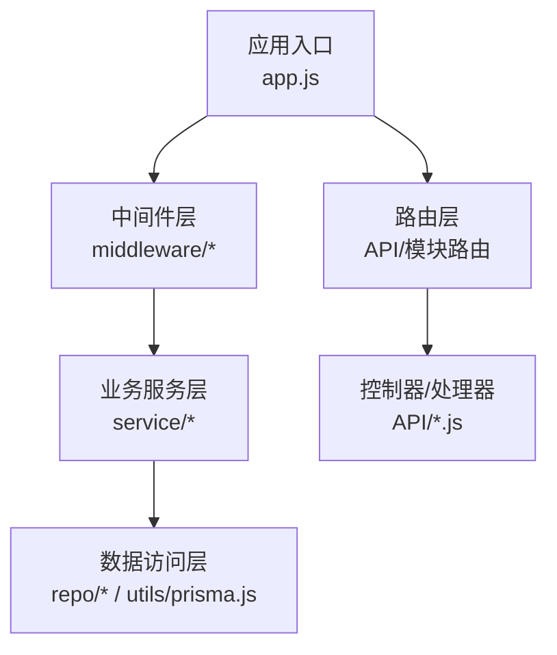

**图示来源**
- [app.js:1-200](file://node-jinmao/app.js#L1-L200)
- [auth.js:1-200](file://node-jinmao/middleware/auth.js#L1-L200)

**章节来源**
- [app.js:1-200](file://node-jinmao/app.js#L1-L200)
- [package.json:1-100](file://node-jinmao/package.json#L1-L100)

## 核心组件
- 应用启动与中间件装配：在应用入口中统一注册全局中间件、路由级中间件与错误处理中间件，形成统一的请求处理管线。
- 认证中间件：对请求进行鉴权检查，常见包括令牌解析、权限校验、用户信息注入等。
- 错误处理中间件：集中捕获异常、统一返回格式、记录错误上下文。
- 通用中间件：如日志、CORS、压缩、限流、请求体解析等。

**章节来源**
- [app.js:1-200](file://node-jinmao/app.js#L1-L200)
- [auth.js:1-200](file://node-jinmao/middleware/auth.js#L1-L200)

## 架构总览
Express 的请求处理模型基于“中间件链”。每个中间件可读取/修改 req/res，决定是否继续调用下一个中间件或提前结束响应。错误处理中间件通过四个参数的函数签名被识别，并在错误发生时接管流程。

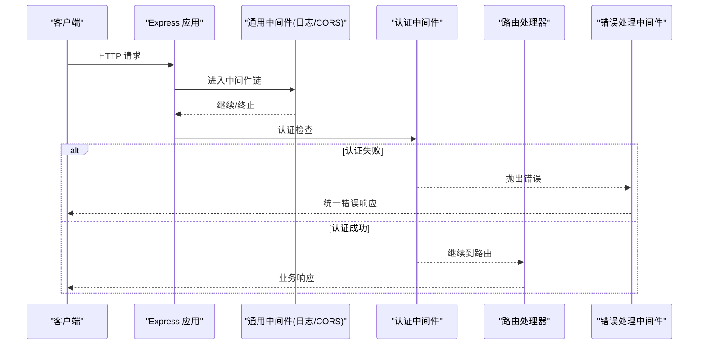

**图示来源**
- [app.js:1-200](file://node-jinmao/app.js#L1-L200)
- [auth.js:1-200](file://node-jinmao/middleware/auth.js#L1-L200)

## 详细组件分析

### 认证中间件（Auth Middleware）
职责
- 从请求头或 Cookie 中提取凭证（如 JWT）
- 校验签名、过期时间、权限范围
- 将用户信息挂载到 req.user，供后续路由使用
- 失败时返回标准错误响应或抛出错误交由错误处理中间件处理

实现要点
- 优先放在路由之前，确保受保护接口均经过鉴权
- 支持白名单路径跳过鉴权（如登录、健康检查）
- 对异常进行统一捕获并转换为标准错误格式

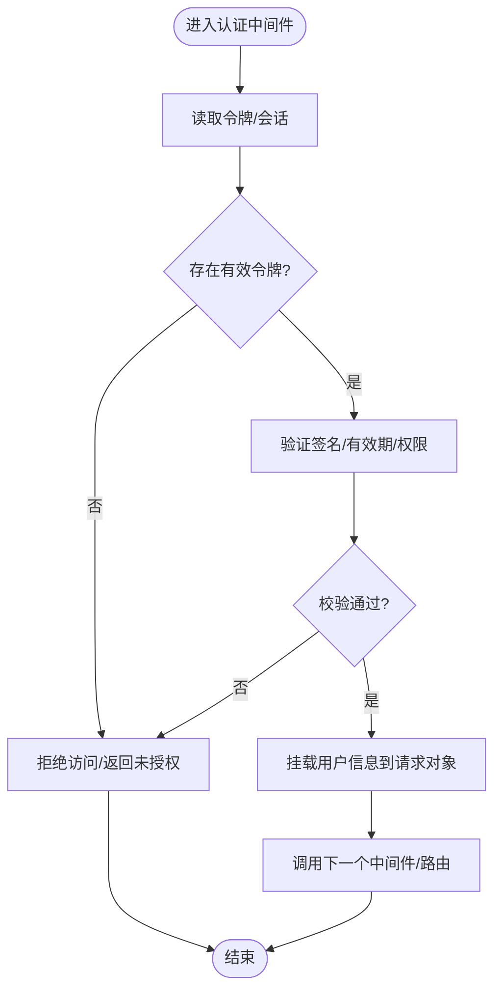

**图示来源**
- [auth.js:1-200](file://node-jinmao/middleware/auth.js#L1-L200)

**章节来源**
- [auth.js:1-200](file://node-jinmao/middleware/auth.js#L1-L200)

### 错误处理中间件（Error Handler）
职责
- 捕获同步/异步异常
- 区分业务错误与系统错误
- 统一错误码、消息、堆栈（生产环境隐藏敏感信息）
- 记录错误上下文（请求ID、URL、方法、用户、耗时）

关键点
- 必须具有四个参数 (err, req, res, next) 才能被 Express 识别为错误处理中间件
- 避免在错误处理中间件中再次抛出未捕获异常
- 保持幂等性，防止重复写入响应

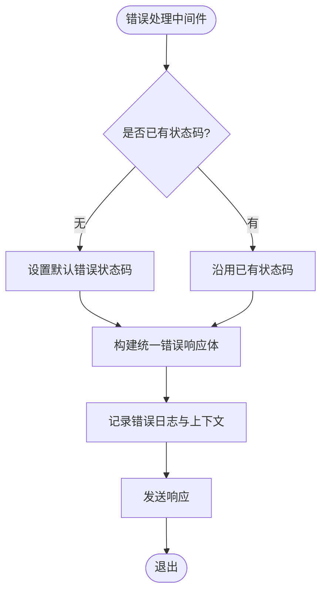

**图示来源**
- [app.js:1-200](file://node-jinmao/app.js#L1-L200)

**章节来源**
- [app.js:1-200](file://node-jinmao/app.js#L1-L200)

### 参数验证中间件（Validation Middleware）
职责
- 校验请求体、查询参数、路径参数、头部字段
- 提供清晰的错误提示与字段级错误
- 支持自定义校验规则与异步校验（如唯一性检查）

建议
- 使用独立的校验中间件，按路由粒度复用
- 将校验失败直接返回 4xx，不进入业务逻辑
- 结合类型定义（如 TypeScript）提升可维护性

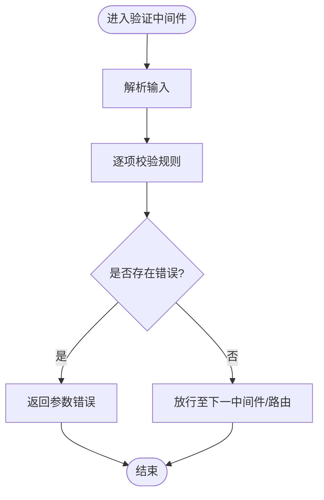

[本节为概念说明，不直接分析具体文件]

### 日志记录中间件（Logging Middleware）
职责
- 记录请求方法、路径、IP、UA、耗时、状态码
- 可选记录请求/响应体（注意脱敏）
- 输出结构化日志，便于聚合与分析

建议
- 使用请求 ID 贯穿全链路
- 控制日志级别与采样率，避免影响性能
- 对大体积响应体仅记录摘要

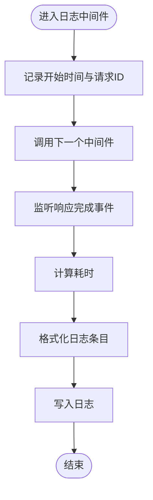

[本节为概念说明，不直接分析具体文件]

### 性能监控中间件（Performance Monitoring）
职责
- 统计关键接口的 P50/P95/P99 延迟
- 暴露指标端点（如 /metrics）供监控系统采集
- 记录慢请求与异常热点

建议
- 使用直方图或计数器聚合指标
- 避免在热路径中进行昂贵操作
- 对采样数据进行降采样与去噪

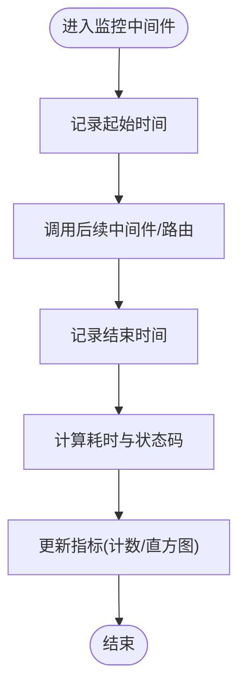

[本节为概念说明，不直接分析具体文件]

### 请求拦截器（Request Interceptor）
职责
- 在路由前对请求进行预处理（如埋点、灰度、限流、缓存命中）
- 可改写请求体或头部（谨慎使用）
- 快速失败场景（如黑名单 IP、配额不足）

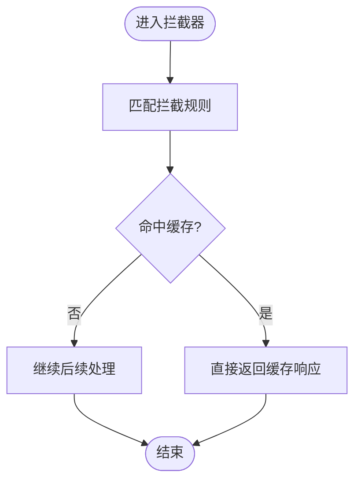

[本节为概念说明，不直接分析具体文件]

### 响应格式化器（Response Formatter）
职责
- 统一响应结构（如 { code, message, data }）
- 根据 Accept 或查询参数决定返回格式（JSON/XML）
- 过滤敏感字段、添加追踪信息

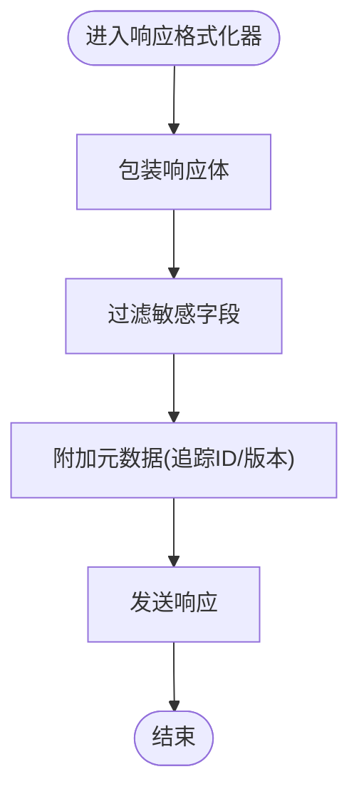

[本节为概念说明，不直接分析具体文件]

### 中间件组合模式与异步处理
- 组合模式：通过模块化拆分中间件，按需组合；可使用高阶函数封装通用逻辑（如重试、超时、缓存）。
- 异步处理：使用 async/await 或 Promise，确保错误通过 next(err) 传递；避免忘记调用 next() 导致挂起。

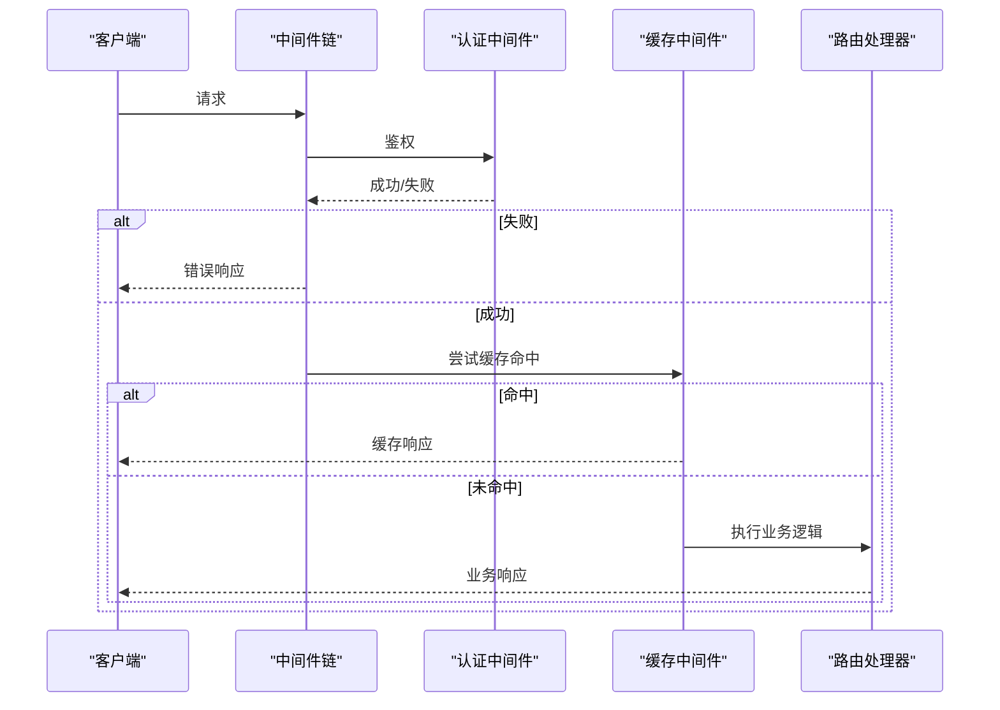

**图示来源**
- [app.js:1-200](file://node-jinmao/app.js#L1-L200)
- [auth.js:1-200](file://node-jinmao/middleware/auth.js#L1-L200)

**章节来源**
- [app.js:1-200](file://node-jinmao/app.js#L1-L200)
- [auth.js:1-200](file://node-jinmao/middleware/auth.js#L1-L200)

## 依赖分析
- 应用入口负责加载配置、初始化数据库连接、注册中间件与路由。
- 认证中间件依赖安全相关工具（如 JWT 库），并与用户服务交互。
- 错误处理中间件依赖日志库与告警通道。
- 性能监控中间件依赖指标收集库（如 Prometheus client）。

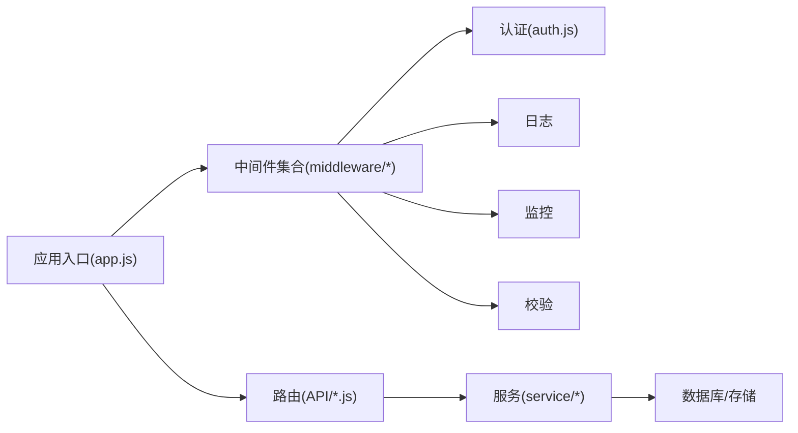

**图示来源**
- [app.js:1-200](file://node-jinmao/app.js#L1-L200)
- [auth.js:1-200](file://node-jinmao/middleware/auth.js#L1-L200)

**章节来源**
- [package.json:1-100](file://node-jinmao/package.json#L1-L100)
- [app.js:1-200](file://node-jinmao/app.js#L1-L200)

## 性能考虑
- 中间件顺序：将轻量且高频的中间件（如 CORS、日志）前置，重逻辑后置。
- 避免阻塞：I/O 操作务必异步化，减少同步阻塞。
- 缓存策略：对读多写少的接口启用缓存，降低下游压力。
- 资源限制：合理设置请求体大小、并发数、超时时间。
- 指标观测：接入延迟、吞吐、错误率等关键指标，持续优化。

[本节为通用指导，不直接分析具体文件]

## 故障排查指南
- 确认中间件顺序：检查是否在认证前误放需要鉴权的中间件。
- 检查 next() 调用：遗漏 next() 会导致请求挂起。
- 错误处理中间件位置：必须在所有路由之后注册。
- 日志与追踪：开启请求 ID 与结构化日志，定位问题链路。
- 性能瓶颈：通过监控中间件定位慢接口与热点路径。
- 常见错误：
  - 401/403：认证失败或权限不足
  - 400：参数校验失败
  - 500：服务端异常，查看错误日志与堆栈

**章节来源**
- [app.js:1-200](file://node-jinmao/app.js#L1-L200)
- [auth.js:1-200](file://node-jinmao/middleware/auth.js#L1-L200)

## 结论
中间件是 Express 应用的核心扩展点。通过合理的分层与组合，可实现高内聚、低耦合的可维护架构。建议在项目中统一规范中间件职责、错误处理与日志格式，并结合监控与测试保障质量与稳定性。

[本节为总结性内容，不直接分析具体文件]

## 附录
- 中间件开发清单
  - 明确职责边界与输入输出
  - 统一错误与响应格式
  - 完善的日志与追踪
  - 单元测试与集成测试覆盖
  - 性能基准与回归测试
- 推荐工具
  - 日志：winston、pino
  - 监控：prometheus-client、opentelemetry
  - 校验：joi、zod
  - 安全：helmet、cors、rate-limit

[本节为补充材料，不直接分析具体文件]