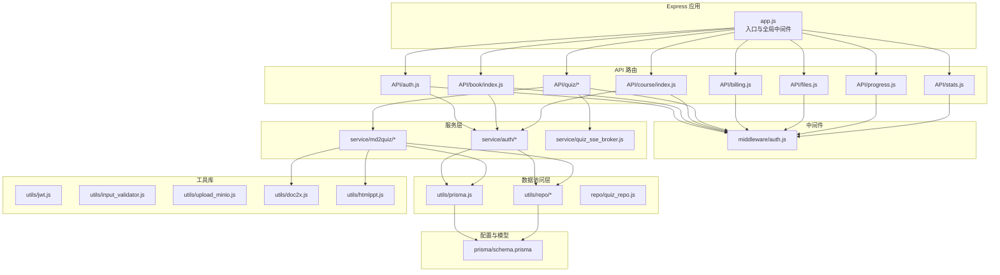
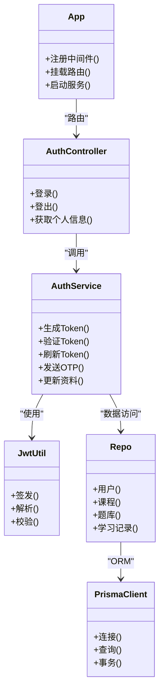
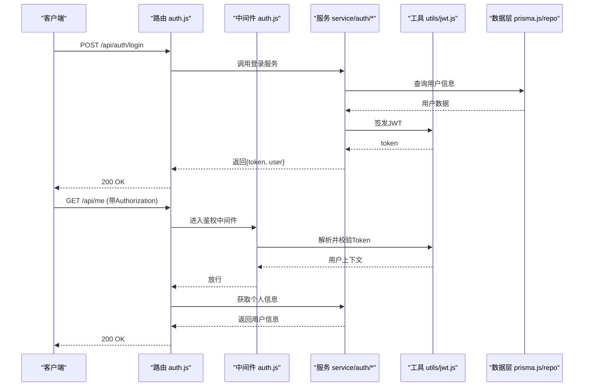
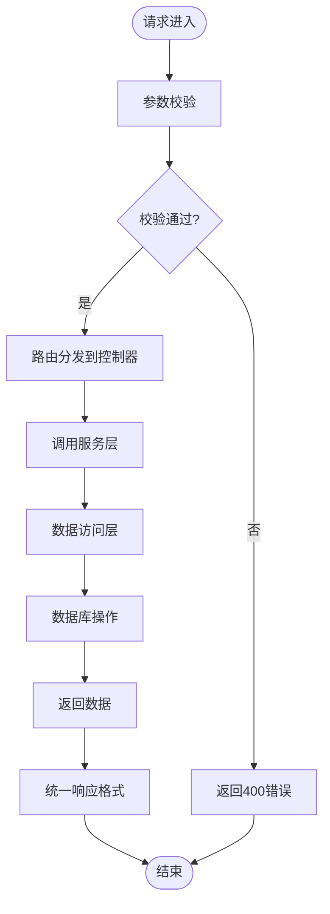
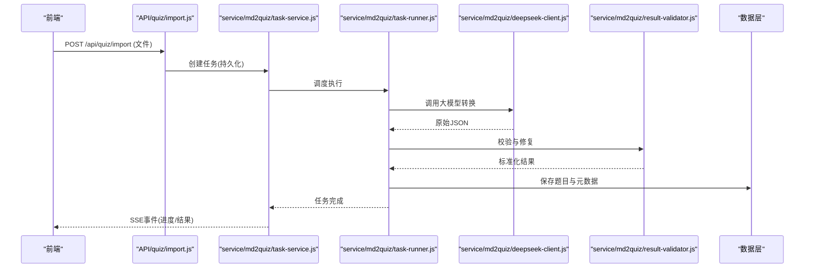
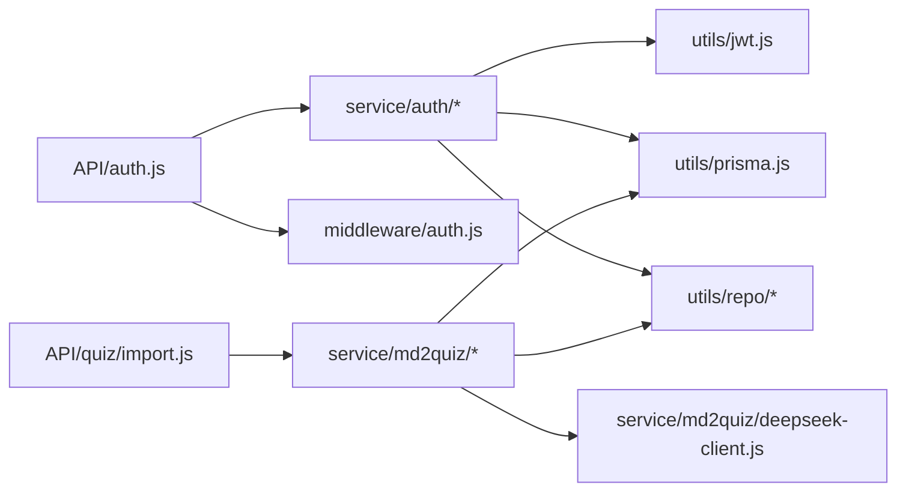

# 后端开发

<cite>
**本文引用的文件**   
- [app.js](file://node-jinmao/app.js)
- [package.json](file://node-jinmao/package.json)
- [auth.js](file://node-jinmao/API/auth.js)
- [billing.js](file://node-jinmao/API/billing.js)
- [files.js](file://node-jinmao/API/files.js)
- [progress.js](file://node-jinmao/API/progress.js)
- [stats.js](file://node-jinmao/API/stats.js)
- [book/index.js](file://node-jinmao/API/book/index.js)
- [book/list.js](file://node-jinmao/API/book/list.js)
- [book/detail.js](file://node-jinmao/API/book/detail.js)
- [book/update.js](file://node-jinmao/API/book/update.js)
- [book/delete.js](file://node-jinmao/API/book/delete.js)
- [book/files.js](file://node-jinmao/API/book/files.js)
- [course/index.js](file://node-jinmao/API/course/index.js)
- [course/slides.js](file://node-jinmao/API/course/slides.js)
- [quiz/import.js](file://node-jinmao/API/quiz/import.js)
- [quiz/report.js](file://node-jinmao/API/quiz/report.js)
- [quiz/session.js](file://node-jinmao/API/quiz/session.js)
- [quiz/textbooks.js](file://node-jinmao/API/quiz/textbooks.js)
- [quiz/wrongbook.js](file://node-jinmao/API/quiz/wrongbook.js)
- [middleware/auth.js](file://node-jinmao/middleware/auth.js)
- [service/auth/index.js](file://node-jinmao/service/auth/index.js)
- [service/auth/login.js](file://node-jinmao/service/auth/login.js)
- [service/auth/otp.js](file://node-jinmao/service/auth/otp.js)
- [service/auth/profile.js](file://node-jinmao/service/auth/profile.js)
- [utils/jwt.js](file://node-jinmao/utils/jwt.js)
- [utils/prisma.js](file://node-jinmao/utils/prisma.js)
- [utils/input_validator.js](file://node-jinmao/utils/input_validator.js)
- [utils/billing.js](file://node-jinmao/utils/billing.js)
- [utils/doc2x.js](file://node-jinmao/utils/doc2x.js)
- [utils/htmlppt.js](file://node-jinmao/utils/htmlppt.js)
- [utils/upload_minio.js](file://node-jinmao/utils/upload_minio.js)
- [repo/quiz_repo.js](file://node-jinmao/repo/quiz_repo.js)
- [utils/repo/activity_repo.js](file://node-jinmao/utils/repo/activity_repo.js)
- [utils/repo/book_repo.js](file://node-jinmao/utils/repo/book_repo.js)
- [utils/repo/chapter_repo.js](file://node-jinmao/utils/repo/chapter_repo.js)
- [utils/repo/progress_repo.js](file://node-jinmao/utils/repo/progress_repo.js)
- [utils/repo/stats_repo.js](file://node-jinmao/utils/repo/stats_repo.js)
- [utils/repo/update_repo.js](file://node-jinmao/utils/repo/update_repo.js)
- [prisma/schema.prisma](file://node-jinmao/prisma/schema.prisma)
- [service/md2quiz/task-service.js](file://node-jinmao/service/md2quiz/task-service.js)
- [service/md2quiz/task-store.js](file://node-jinmao/service/md2quiz/task-store.js)
- [service/md2quiz/task-stream-broker.js](file://node-jinmao/service/md2quiz/task-stream-broker.js)
- [service/md2quiz/deepseek-client.js](file://node-jinmao/service/md2quiz/deepseek-client.js)
- [service/md2quiz/result-validator.js](file://node-jinmao/service/md2quiz/result-validator.js)
- [service/md2quiz/chunker.js](file://node-jinmao/service/md2quiz/chunker.js)
- [service/md2quiz/quiz-splitter.js](file://node-jinmao/service/md2quiz/quiz-splitter.js)
- [service/md2quiz/task-runner.js](file://node-jinmao/service/md2quiz/task-runner.js)
- [service/quiz_sse_broker.js](file://node-jinmao/service/quiz_sse_broker.js)
</cite>

## 目录
1. [简介](#简介)
2. [项目结构](#项目结构)
3. [核心组件](#核心组件)
4. [架构总览](#架构总览)
5. [详细组件分析](#详细组件分析)
6. [依赖关系分析](#依赖关系分析)
7. [性能考虑](#性能考虑)
8. [故障排查指南](#故障排查指南)
9. [结论](#结论)
10. [附录：开发示例与最佳实践](#附录开发示例与最佳实践)

## 简介
本文件面向“金毛教你学重构版”的后端开发，聚焦基于 Express.js 的架构设计与实现。文档从系统架构、MVC 模式落地、RESTful API 规范、中间件与权限控制、错误处理与日志策略、JWT 认证、数据库操作与事务、查询优化与缓存、异步任务与 SSE 流式传输、第三方服务集成等方面进行全面说明，并提供可操作的开发示例路径，帮助读者快速上手与扩展。

## 项目结构
后端代码位于 node-jinmao 目录，采用模块化组织：
- API 层（路由控制器）：按业务域划分在 API 目录下，每个模块对应一组 REST 接口。
- 中间件：统一鉴权等横切逻辑。
- 服务层：封装业务编排与外部调用。
- 数据访问层：通过 Prisma 与仓库模块进行数据读写。
- 工具库：通用能力如 JWT、输入校验、MinIO 上传、LLM 客户端等。
- 配置与迁移：Prisma schema 与迁移脚本。

**图示来源** 
- [app.js:1-200](file://node-jinmao/app.js#L1-L200)
- [package.json:1-100](file://node-jinmao/package.json#L1-L100)

**章节来源**
- [app.js:1-200](file://node-jinmao/app.js#L1-L200)
- [package.json:1-100](file://node-jinmao/package.json#L1-L100)

## 核心组件
- 应用入口与中间件装配：统一注册 JSON/body-parser、CORS、日志、错误处理等中间件，挂载各业务路由。
- 路由与控制器：按领域拆分 API，保持职责单一，参数校验与响应格式统一。
- 服务层：聚合业务规则、编排多步流程、调用外部服务（如 LLM、MinIO）。
- 数据访问层：基于 Prisma 的强类型 ORM，配合仓库模块抽象具体查询。
- 鉴权与权限：基于 JWT 的无状态认证，结合中间件完成请求级授权。
- 异步任务与 SSE：长耗时任务通过任务服务与存储管理，SSE 推送进度与结果。

**章节来源**
- [app.js:1-200](file://node-jinmao/app.js#L1-L200)
- [middleware/auth.js:1-200](file://node-jinmao/middleware/auth.js#L1-L200)
- [utils/jwt.js:1-200](file://node-jinmao/utils/jwt.js#L1-L200)
- [utils/prisma.js:1-200](file://node-jinmao/utils/prisma.js#L1-L200)

## 架构总览
整体遵循 MVC 分层：
- Controller（API 路由）：接收请求、参数校验、调用服务、返回响应。
- Service（业务服务）：实现领域逻辑、编排跨模块调用、处理异常与重试。
- Repository（数据访问）：封装 Prisma 查询，提供领域语义化的数据方法。

**图示来源** 
- [app.js:1-200](file://node-jinmao/app.js#L1-L200)
- [API/auth.js:1-200](file://node-jinmao/API/auth.js#L1-L200)
- [service/auth/index.js:1-200](file://node-jinmao/service/auth/index.js#L1-L200)
- [utils/jwt.js:1-200](file://node-jinmao/utils/jwt.js#L1-L200)
- [utils/prisma.js:1-200](file://node-jinmao/utils/prisma.js#L1-L200)
- [utils/repo/book_repo.js:1-200](file://node-jinmao/utils/repo/book_repo.js#L1-L200)

## 详细组件分析

### 认证与权限（JWT + 中间件）
- 认证流程：登录成功后签发 JWT；后续请求携带 Token，中间件解析并注入用户上下文。
- 权限控制：中间件根据角色或资源标识进行细粒度校验。
- OTP 辅助：支持一次性验证码用于安全增强。

**图示来源** 
- [API/auth.js:1-200](file://node-jinmao/API/auth.js#L1-L200)
- [middleware/auth.js:1-200](file://node-jinmao/middleware/auth.js#L1-L200)
- [service/auth/login.js:1-200](file://node-jinmao/service/auth/login.js#L1-L200)
- [service/auth/otp.js:1-200](file://node-jinmao/service/auth/otp.js#L1-L200)
- [service/auth/profile.js:1-200](file://node-jinmao/service/auth/profile.js#L1-L200)
- [utils/jwt.js:1-200](file://node-jinmao/utils/jwt.js#L1-L200)
- [utils/prisma.js:1-200](file://node-jinmao/utils/prisma.js#L1-L200)

**章节来源**
- [API/auth.js:1-200](file://node-jinmao/API/auth.js#L1-L200)
- [middleware/auth.js:1-200](file://node-jinmao/middleware/auth.js#L1-L200)
- [service/auth/index.js:1-200](file://node-jinmao/service/auth/index.js#L1-L200)
- [utils/jwt.js:1-200](file://node-jinmao/utils/jwt.js#L1-L200)

### 书籍与课程模块（RESTful API）
- 书籍 CRUD：列表、详情、更新、删除、文件管理。
- 课程与幻灯片：课程索引与课件下载/预览。

**图示来源** 
- [API/book/index.js:1-200](file://node-jinmao/API/book/index.js#L1-L200)
- [API/book/list.js:1-200](file://node-jinmao/API/book/list.js#L1-L200)
- [API/book/detail.js:1-200](file://node-jinmao/API/book/detail.js#L1-L200)
- [API/book/update.js:1-200](file://node-jinmao/API/book/update.js#L1-L200)
- [API/book/delete.js:1-200](file://node-jinmao/API/book/delete.js#L1-L200)
- [API/book/files.js:1-200](file://node-jinmao/API/book/files.js#L1-L200)
- [API/course/index.js:1-200](file://node-jinmao/API/course/index.js#L1-L200)
- [API/course/slides.js:1-200](file://node-jinmao/API/course/slides.js#L1-L200)

**章节来源**
- [API/book/index.js:1-200](file://node-jinmao/API/book/index.js#L1-L200)
- [API/course/index.js:1-200](file://node-jinmao/API/course/index.js#L1-L200)

### 题库与报告（导入、会话、错题集）
- 题库导入：支持 Markdown/PDF 转题，分块处理与结果校验。
- 会话管理：维护答题会话状态。
- 报告与错题集：统计与导出。

**图示来源** 
- [API/quiz/import.js:1-200](file://node-jinmao/API/quiz/import.js#L1-L200)
- [service/md2quiz/task-service.js:1-200](file://node-jinmao/service/md2quiz/task-service.js#L1-L200)
- [service/md2quiz/task-runner.js:1-200](file://node-jinmao/service/md2quiz/task-runner.js#L1-L200)
- [service/md2quiz/deepseek-client.js:1-200](file://node-jinmao/service/md2quiz/deepseek-client.js#L1-L200)
- [service/md2quiz/result-validator.js:1-200](file://node-jinmao/service/md2quiz/result-validator.js#L1-L200)
- [service/md2quiz/task-store.js:1-200](file://node-jinmao/service/md2quiz/task-store.js#L1-L200)

**章节来源**
- [API/quiz/import.js:1-200](file://node-jinmao/API/quiz/import.js#L1-L200)
- [API/quiz/session.js:1-200](file://node-jinmao/API/quiz/session.js#L1-L200)
- [API/quiz/report.js:1-200](file://node-jinmao/API/quiz/report.js#L1-L200)
- [API/quiz/textbooks.js:1-200](file://node-jinmao/API/quiz/textbooks.js#L1-L200)
- [API/quiz/wrongbook.js:1-200](file://node-jinmao/API/quiz/wrongbook.js#L1-L200)

### 计费与文件服务
- 计费：账单计算、套餐与用量统计。
- 文件：MinIO 上传、下载、预签名 URL。

**章节来源**
- [API/billing.js:1-200](file://node-jinmao/API/billing.js#L1-L200)
- [API/files.js:1-200](file://node-jinmao/API/files.js#L1-L200)
- [utils/billing.js:1-200](file://node-jinmao/utils/billing.js#L1-L200)
- [utils/upload_minio.js:1-200](file://node-jinmao/utils/upload_minio.js#L1-L200)

### 进度与统计
- 学习进度：记录与查询。
- 统计数据：聚合指标与报表。

**章节来源**
- [API/progress.js:1-200](file://node-jinmao/API/progress.js#L1-L200)
- [API/stats.js:1-200](file://node-jinmao/API/stats.js#L1-L200)
- [utils/repo/progress_repo.js:1-200](file://node-jinmao/utils/repo/progress_repo.js#L1-L200)
- [utils/repo/stats_repo.js:1-200](file://node-jinmao/utils/repo/stats_repo.js#L1-L200)

## 依赖关系分析
- 模块耦合：API 层仅依赖服务层，服务层依赖数据访问层与工具库，避免反向依赖。
- 外部依赖：Prisma 作为 ORM，MinIO 作为对象存储，DeepSeek 等大模型客户端。
- 潜在循环：确保服务层不直接 import API 路由，避免环依赖。

**图示来源** 
- [API/auth.js:1-200](file://node-jinmao/API/auth.js#L1-L200)
- [service/auth/index.js:1-200](file://node-jinmao/service/auth/index.js#L1-L200)
- [utils/jwt.js:1-200](file://node-jinmao/utils/jwt.js#L1-L200)
- [utils/prisma.js:1-200](file://node-jinmao/utils/prisma.js#L1-L200)
- [API/quiz/import.js:1-200](file://node-jinmao/API/quiz/import.js#L1-L200)
- [service/md2quiz/task-service.js:1-200](file://node-jinmao/service/md2quiz/task-service.js#L1-L200)

**章节来源**
- [package.json:1-100](file://node-jinmao/package.json#L1-L100)

## 性能考虑
- 数据库查询优化：合理使用索引、分页、只取必要字段，避免 N+1 查询。
- 事务处理：写操作涉及多表时，使用 Prisma 事务保证一致性。
- 缓存策略：热点数据（如配置、字典）可引入内存缓存或 Redis；对外部 LLM 调用做结果缓存。
- 异步与并发：长耗时任务放入后台任务队列，避免阻塞请求线程。
- 流式传输：对大文件或实时结果使用流式输出，降低内存峰值。

[本节为通用指导，无需特定文件引用]

## 故障排查指南
- 常见错误分类：参数校验失败、鉴权失败、业务异常、外部服务超时。
- 日志策略：结构化日志记录关键路径（请求ID、用户ID、耗时、错误堆栈）。
- 调试建议：开启详细日志、检查环境变量、确认数据库连接与权限、查看外部服务限流与配额。
- 恢复机制：重试与退避、降级与熔断、告警与监控。

**章节来源**
- [utils/input_validator.js:1-200](file://node-jinmao/utils/input_validator.js#L1-L200)
- [middleware/auth.js:1-200](file://node-jinmao/middleware/auth.js#L1-L200)
- [utils/prisma.js:1-200](file://node-jinmao/utils/prisma.js#L1-L200)

## 结论
本项目以 Express 为核心，采用清晰的 MVC 分层与模块化设计，结合 Prisma 与仓库模式实现稳定可靠的数据访问。通过 JWT 与中间件完成认证与授权，借助任务服务与 SSE 支撑长耗时与实时场景。建议在现有基础上持续完善日志与监控、缓存与限流、测试覆盖与自动化部署，以提升稳定性与可维护性。

[本节为总结性内容，无需特定文件引用]

## 附录：开发示例与最佳实践

### 新增一个 RESTful API 接口
- 步骤
  - 在 API/<domain>/ 下新建控制器文件，定义路由与参数校验。
  - 在 service/<domain>/ 中实现业务逻辑，调用仓库或直接使用 Prisma。
  - 在 app.js 中挂载路由，必要时添加鉴权中间件。
- 参考路径
  - [API/book/list.js](file://node-jinmao/API/book/list.js)
  - [API/book/detail.js](file://node-jinmao/API/book/detail.js)
  - [service/auth/login.js](file://node-jinmao/service/auth/login.js)
  - [app.js](file://node-jinmao/app.js)

### 实现业务逻辑模块（Service）
- 原则
  - 单一职责：每个服务负责一个领域用例。
  - 组合调用：协调多个仓库与外部服务。
  - 异常处理：抛出明确错误码与消息，便于上层统一处理。
- 参考路径
  - [service/auth/profile.js](file://node-jinmao/service/auth/profile.js)
  - [service/md2quiz/task-service.js](file://node-jinmao/service/md2quiz/task-service.js)

### 编写工具函数（Utils）
- 原则
  - 纯函数优先，避免副作用。
  - 输入校验与边界条件处理完备。
  - 可测试性强，便于单元测试。
- 参考路径
  - [utils/jwt.js](file://node-jinmao/utils/jwt.js)
  - [utils/input_validator.js](file://node-jinmao/utils/input_validator.js)
  - [utils/upload_minio.js](file://node-jinmao/utils/upload_minio.js)

### 数据库操作与事务
- 最佳实践
  - 使用 Prisma 事务包裹多步写入。
  - 合理选择 join 与 select，减少不必要数据加载。
  - 对高频读场景增加缓存层。
- 参考路径
  - [utils/prisma.js](file://node-jinmao/utils/prisma.js)
  - [utils/repo/book_repo.js](file://node-jinmao/utils/repo/book_repo.js)
  - [prisma/schema.prisma](file://node-jinmao/prisma/schema.prisma)

### 异步任务与 SSE 流式传输
- 任务管理
  - 任务创建、持久化、执行与状态更新。
  - 失败重试与补偿。
- SSE 推送
  - 服务端事件流推送进度与结果。
- 参考路径
  - [service/md2quiz/task-store.js](file://node-jinmao/service/md2quiz/task-store.js)
  - [service/md2quiz/task-stream-broker.js](file://node-jinmao/service/md2quiz/task-stream-broker.js)
  - [service/quiz_sse_broker.js](file://node-jinmao/service/quiz_sse_broker.js)

### 第三方服务集成（LLM、MinIO、Doc2X）
- 原则
  - 封装客户端，统一错误处理与重试。
  - 配置外置，支持多环境切换。
- 参考路径
  - [service/md2quiz/deepseek-client.js](file://node-jinmao/service/md2quiz/deepseek-client.js)
  - [utils/upload_minio.js](file://node-jinmao/utils/upload_minio.js)
  - [utils/doc2x.js](file://node-jinmao/utils/doc2x.js)
  - [utils/htmlppt.js](file://node-jinmao/utils/htmlppt.js)