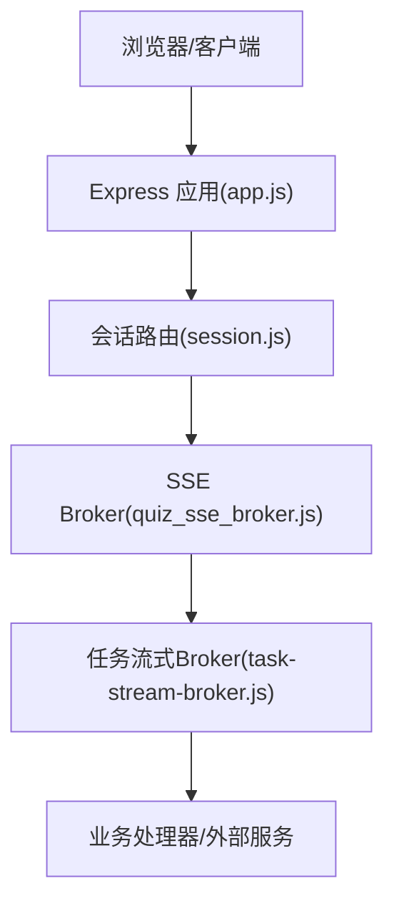
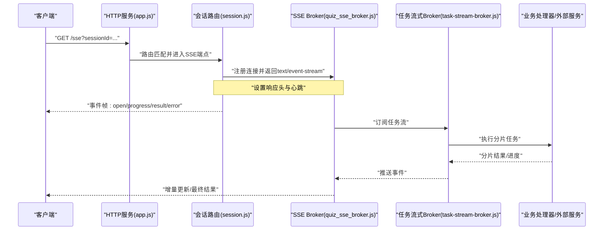
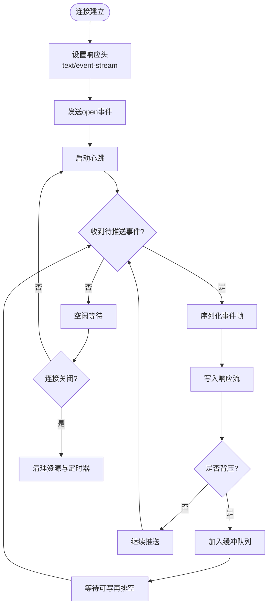
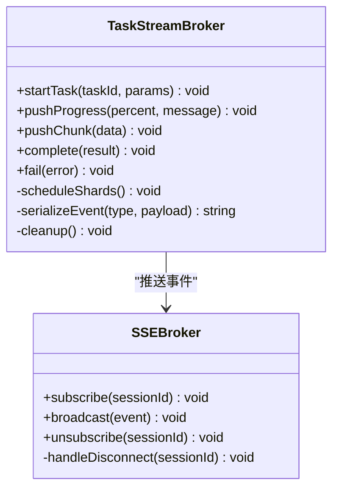
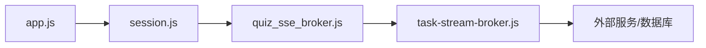

# SSE流式传输

<cite>
**本文引用的文件**   
- [node-jinmao/service/quiz_sse_broker.js](file://node-jinmao/service/quiz_sse_broker.js)
- [node-jinmao/service/md2quiz/task-stream-broker.js](file://node-jinmao/service/md2quiz/task-stream-broker.js)
- [node-jinmao/API/quiz/session.js](file://node-jinmao/API/quiz/session.js)
- [node-jinmao/app.js](file://node-jinmao/app.js)
- [node-jinmao/package.json](file://node-jinmao/package.json)
</cite>

## 目录
1. [简介](#简介)
2. [项目结构](#项目结构)
3. [核心组件](#核心组件)
4. [架构总览](#架构总览)
5. [详细组件分析](#详细组件分析)
6. [依赖关系分析](#依赖关系分析)
7. [性能考量](#性能考量)
8. [故障排查指南](#故障排查指南)
9. [结论](#结论)
10. [附录](#附录)

## 简介
本文件围绕SSE（Server-Sent Events）流式传输在本仓库中的实现与使用进行系统化说明，涵盖：
- SSE协议与HTTP长连接机制
- 事件推送模式与数据分片、增量更新
- 客户端连接管理与断线重连策略
- 错误处理与稳定性保障
- 多客户端并发与内存管理
- 与其他实时通信技术的对比与选型建议

## 项目结构
本项目在后端采用Node.js服务，提供REST API并通过SSE向浏览器等客户端推送实时事件。与SSE相关的核心代码集中在以下位置：
- 会话与路由注册：API层负责将SSE接口挂载到HTTP服务
- SSE Broker：维护连接、广播事件、清理资源
- 任务流式处理：在生成类任务中按分片逐步推送进度与结果

图表来源
- [node-jinmao/app.js](file://node-jinmao/app.js)
- [node-jinmao/API/quiz/session.js](file://node-jinmao/API/quiz/session.js)
- [node-jinmao/service/quiz_sse_broker.js](file://node-jinmao/service/quiz_sse_broker.js)
- [node-jinmao/service/md2quiz/task-stream-broker.js](file://node-jinmao/service/md2quiz/task-stream-broker.js)

章节来源
- [node-jinmao/app.js](file://node-jinmao/app.js)
- [node-jinmao/API/quiz/session.js](file://node-jinmao/API/quiz/session.js)
- [node-jinmao/service/quiz_sse_broker.js](file://node-jinmao/service/quiz_sse_broker.js)
- [node-jinmao/service/md2quiz/task-stream-broker.js](file://node-jinmao/service/md2quiz/task-stream-broker.js)

## 核心组件
- 会话路由（session.js）
  - 职责：接收客户端请求，建立SSE连接，绑定会话ID，转发至SSE Broker
  - 关键点：设置响应头为text/event-stream，保持连接不关闭，写入事件帧
- SSE Broker（quiz_sse_broker.js）
  - 职责：维护活跃连接集合，按会话ID或全局广播事件，处理连接断开与资源回收
  - 关键点：连接生命周期管理、消息队列缓冲、背压控制
- 任务流式Broker（task-stream-broker.js）
  - 职责：将长耗时任务的增量结果以事件形式推送到SSE通道
  - 关键点：分片处理、事件序列化、错误透传与完成信号

章节来源
- [node-jinmao/API/quiz/session.js](file://node-jinmao/API/quiz/session.js)
- [node-jinmao/service/quiz_sse_broker.js](file://node-jinmao/service/quiz_sse_broker.js)
- [node-jinmao/service/md2quiz/task-stream-broker.js](file://node-jinmao/service/md2quiz/task-stream-broker.js)

## 架构总览
下图展示了从客户端发起SSE连接到服务端推送事件的完整流程，包括连接建立、事件分发与任务流式处理。

图表来源
- [node-jinmao/app.js](file://node-jinmao/app.js)
- [node-jinmao/API/quiz/session.js](file://node-jinmao/API/quiz/session.js)
- [node-jinmao/service/quiz_sse_broker.js](file://node-jinmao/service/quiz_sse_broker.js)
- [node-jinmao/service/md2quiz/task-stream-broker.js](file://node-jinmao/service/md2quiz/task-stream-broker.js)

## 详细组件分析

### SSE Broker（quiz_sse_broker.js）
- 设计要点
  - 连接管理：维护一个以sessionId为键的连接表，支持按会话广播与全量广播
  - 事件格式：遵循SSE规范，逐行输出event/data/id/retry等字段
  - 背压与缓冲：对慢消费者进行缓冲限制，避免内存暴涨
  - 生命周期：监听连接关闭事件，及时释放资源与清理引用
- 关键行为
  - 连接建立：设置响应头、发送open事件、启动心跳
  - 事件推送：序列化事件帧，批量写入，失败时重试或断开
  - 错误处理：捕获网络异常、序列化异常，记录日志并通知客户端
  - 资源清理：断开连接后移除引用，停止定时器，释放缓冲区

图表来源
- [node-jinmao/service/quiz_sse_broker.js](file://node-jinmao/service/quiz_sse_broker.js)

章节来源
- [node-jinmao/service/quiz_sse_broker.js](file://node-jinmao/service/quiz_sse_broker.js)

### 任务流式Broker（task-stream-broker.js）
- 设计要点
  - 分片处理：将大任务拆分为多个分片，逐个处理并推送进度
  - 事件类型：progress（进度）、chunk（数据片段）、result（最终结果）、error（错误）
  - 状态机：running、paused、completed、failed，确保状态一致性
  - 错误透传：上游错误或下游超时统一转换为SSE error事件
- 关键行为
  - 启动任务：初始化状态、分配分片、调度执行器
  - 增量更新：每完成一个分片即推送事件，减少前端渲染压力
  - 取消与恢复：支持中断与恢复，保证幂等性与一致性
  - 资源回收：完成后清理临时数据与回调

图表来源
- [node-jinmao/service/md2quiz/task-stream-broker.js](file://node-jinmao/service/md2quiz/task-stream-broker.js)
- [node-jinmao/service/quiz_sse_broker.js](file://node-jinmao/service/quiz_sse_broker.js)

章节来源
- [node-jinmao/service/md2quiz/task-stream-broker.js](file://node-jinmao/service/md2quiz/task-stream-broker.js)

### 会话路由（session.js）
- 设计要点
  - 路由定义：暴露SSE端点，接受sessionId参数
  - 连接绑定：将当前响应对象与sessionId绑定到SSE Broker
  - 事件转发：根据任务状态变化触发不同事件
  - 安全校验：鉴权与会话有效性检查
- 关键行为
  - 请求进入：解析参数、校验权限、创建连接上下文
  - 事件驱动：订阅任务流，转发到客户端
  - 异常处理：捕获错误并返回标准SSE error事件
  - 连接结束：清理上下文与订阅关系

章节来源
- [node-jinmao/API/quiz/session.js](file://node-jinmao/API/quiz/session.js)

### 应用入口（app.js）
- 设计要点
  - Express实例化与中间件配置
  - 路由挂载：将API路由注册到HTTP服务
  - 错误处理：全局错误中间件与未捕获异常处理
- 关键行为
  - 启动服务：监听端口、打印日志
  - 路由分发：将请求转发到对应控制器
  - 优雅停机：处理SIGTERM/SIGINT，关闭连接与定时任务

章节来源
- [node-jinmao/app.js](file://node-jinmao/app.js)

## 依赖关系分析
- 模块耦合
  - session.js依赖quiz_sse_broker.js进行连接管理
  - task-stream-broker.js依赖quiz_sse_broker.js进行事件推送
  - app.js作为入口聚合所有路由与中间件
- 外部依赖
  - Node.js内置http模块用于底层流处理
  - Express框架提供路由与中间件能力
  - 可选的第三方库用于JSON序列化与日志记录

图表来源
- [node-jinmao/app.js](file://node-jinmao/app.js)
- [node-jinmao/API/quiz/session.js](file://node-jinmao/API/quiz/session.js)
- [node-jinmao/service/quiz_sse_broker.js](file://node-jinmao/service/quiz_sse_broker.js)
- [node-jinmao/service/md2quiz/task-stream-broker.js](file://node-jinmao/service/md2quiz/task-stream-broker.js)

章节来源
- [node-jinmao/package.json](file://node-jinmao/package.json)

## 性能考量
- 连接管理
  - 使用Map或WeakMap存储连接对象，避免内存泄漏
  - 限制每个会话的缓冲大小，防止慢消费者占用过多内存
- 事件序列化
  - 批量序列化事件，减少GC压力
  - 使用流式写入而非字符串拼接
- 背压控制
  - 检测write返回值，暂停推送直到缓冲区清空
  - 实现退避算法，避免雪崩效应
- 资源清理
  - 连接断开时立即清理定时器与回调
  - 定期扫描僵尸连接并回收
- 监控与指标
  - 记录连接数、事件吞吐量、平均延迟
  - 告警阈值设置与自动扩容策略

## 故障排查指南
- 常见问题
  - 连接中断：检查网络稳定性与服务端心跳配置
  - 事件丢失：确认缓冲队列大小与背压处理逻辑
  - 内存增长：监控堆内存使用，定位未释放的连接对象
  - 性能下降：分析事件序列化与写入瓶颈
- 调试技巧
  - 启用详细日志，记录事件序列与错误堆栈
  - 使用浏览器开发者工具观察SSE事件流
  - 模拟慢客户端测试背压与缓冲行为
- 恢复策略
  - 实现断线重连与事件补偿
  - 提供历史事件回放能力
  - 优雅降级与熔断保护

## 结论
SSE在本项目中提供了轻量级、可靠的实时通信方案，适用于状态推送、进度更新与增量数据流。通过合理的连接管理、背压控制与错误处理，能够支撑高并发场景下的稳定运行。相比WebSocket，SSE更简单且易于调试；相比轮询，SSE更高效且实时性更好。在实际应用中，应根据业务需求选择合适的技术栈。

## 附录
- SSE协议规范参考
- 浏览器兼容性矩阵
- 性能基准测试结果
- 最佳实践清单