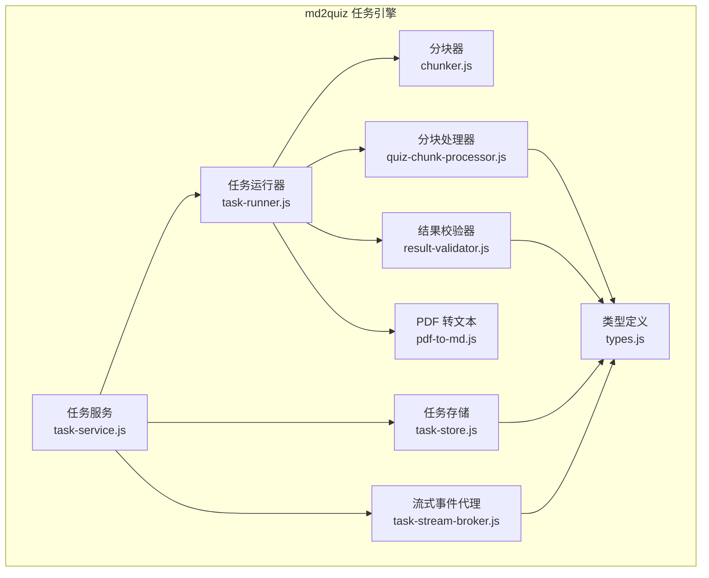
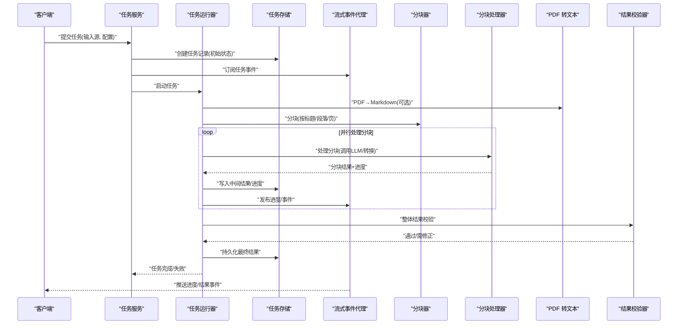
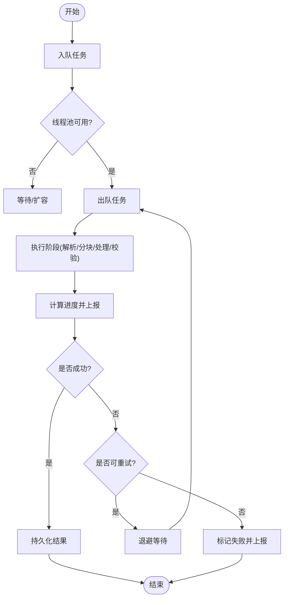
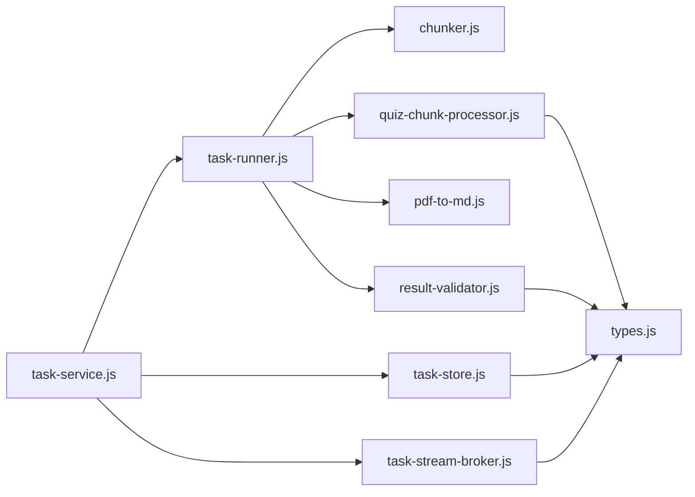

# 任务执行引擎

<cite>
**本文档引用的文件**   
- [task-runner.js](file://node-jinmao/service/md2quiz/task-runner.js)
- [task-service.js](file://node-jinmao/service/md2quiz/task-service.js)
- [task-store.js](file://node-jinmao/service/md2quiz/task-store.js)
- [task-stream-broker.js](file://node-jinmao/service/md2quiz/task-stream-broker.js)
- [chunker.js](file://node-jinmao/service/md2quiz/chunker.js)
- [quiz-chunk-processor.js](file://node-jinmao/service/md2quiz/quiz-chunk-processor.js)
- [pdf-to-md.js](file://node-jinmao/service/md2quiz/pdf-to-md.js)
- [result-validator.js](file://node-jinmao/service/md2quiz/result-validator.js)
- [types.js](file://node-jinmao/service/md2quiz/types.js)
</cite>

## 目录
1. [简介](#简介)
2. [项目结构](#项目结构)
3. [核心组件](#核心组件)
4. [架构总览](#架构总览)
5. [详细组件分析](#详细组件分析)
6. [依赖关系分析](#依赖关系分析)
7. [性能考量](#性能考量)
8. [故障排查指南](#故障排查指南)
9. [结论](#结论)
10. [附录](#附录)

## 简介
本文件面向“任务执行引擎”的完整实现与使用，聚焦以下目标：
- 任务调度算法与工作线程池管理
- 资源分配策略与并发控制
- 大文件分块处理机制（Markdown 分块、PDF 解析分片、批量数据处理）
- 任务执行状态跟踪、进度计算与中间结果缓存
- 运行器开发示例、复杂数据转换流程、并行处理与负载均衡
- 异常处理、超时控制与执行性能监控

该引擎以 Node.js 服务为核心，围绕 md2quiz 场景构建，涵盖从文档解析、内容切分、LLM 生成、校验到持久化的全链路。

## 项目结构
任务执行引擎位于 node-jinmao/service/md2quiz 目录下，采用“按功能域组织”的结构：
- 任务编排与生命周期：task-service.js、task-runner.js
- 任务存储与状态：task-store.js
- 流式事件分发：task-stream-broker.js
- 分块与处理器：chunker.js、quiz-chunk-processor.js
- 外部能力集成：pdf-to-md.js（PDF→文本）、result-validator.js（结果校验）
- 类型定义：types.js

图表来源
- [task-service.js](file://node-jinmao/service/md2quiz/task-service.js)
- [task-runner.js](file://node-jinmao/service/md2quiz/task-runner.js)
- [task-store.js](file://node-jinmao/service/md2quiz/task-store.js)
- [task-stream-broker.js](file://node-jinmao/service/md2quiz/task-stream-broker.js)
- [chunker.js](file://node-jinmao/service/md2quiz/chunker.js)
- [quiz-chunk-processor.js](file://node-jinmao/service/md2quiz/quiz-chunk-processor.js)
- [pdf-to-md.js](file://node-jinmao/service/md2quiz/pdf-to-md.js)
- [result-validator.js](file://node-jinmao/service/md2quiz/result-validator.js)
- [types.js](file://node-jinmao/service/md2quiz/types.js)

章节来源
- [task-service.js](file://node-jinmao/service/md2quiz/task-service.js)
- [task-runner.js](file://node-jinmao/service/md2quiz/task-runner.js)
- [task-store.js](file://node-jinmao/service/md2quiz/task-store.js)
- [task-stream-broker.js](file://node-jinmao/service/md2quiz/task-stream-broker.js)
- [chunker.js](file://node-jinmao/service/md2quiz/chunker.js)
- [quiz-chunk-processor.js](file://node-jinmao/service/md2quiz/quiz-chunk-processor.js)
- [pdf-to-md.js](file://node-jinmao/service/md2quiz/pdf-to-md.js)
- [result-validator.js](file://node-jinmao/service/md2quiz/result-validator.js)
- [types.js](file://node-jinmao/service/md2quiz/types.js)

## 核心组件
- 任务服务（TaskService）
  - 职责：接收外部请求，创建任务、编排阶段、协调运行器、发布事件、聚合结果。
  - 关键行为：任务生命周期管理、参数校验、阶段推进、错误传播。
- 任务运行器（TaskRunner）
  - 职责：执行具体任务步骤，维护工作线程池、并发度控制、重试与超时、进度上报。
  - 关键行为：调度算法（队列+优先级/权重）、资源配额、背压与限流。
- 任务存储（TaskStore）
  - 职责：持久化任务元数据、阶段状态、进度、中间结果、最终产物。
  - 关键行为：原子更新、快照、增量合并、查询与回溯。
- 流式事件代理（StreamBroker）
  - 职责：统一事件总线，支持订阅/发布、过滤、去重、缓冲与回放。
  - 关键行为：事件模型设计、消费者管理、背压处理。
- 分块器（Chunker）
  - 职责：将大文档切分为可独立处理的片段，保证边界语义完整性。
  - 关键行为：Markdown 标题/段落切分、PDF 页面/段落切片、批大小控制。
- 分块处理器（QuizChunkProcessor）
  - 职责：对每个分块进行 LLM 调用、格式转换、质量校验与回退。
  - 关键行为：并行处理、失败隔离、重试策略、结果合并。
- PDF 转文本（PdfToMd）
  - 职责：将 PDF 转换为 Markdown 或结构化文本，供后续分块与处理。
  - 关键行为：分页读取、OCR/文本提取、乱码修复、编码处理。
- 结果校验器（ResultValidator）
  - 职责：校验输出结构与业务规则，必要时触发修正流程。
  - 关键行为：Schema 校验、字段约束、一致性检查、降级策略。
- 类型定义（Types）
  - 职责：统一定义任务、分块、处理器、事件等数据结构。
  - 关键行为：接口契约、枚举值、必填字段、版本兼容。

章节来源
- [task-service.js](file://node-jinmao/service/md2quiz/task-service.js)
- [task-runner.js](file://node-jinmao/service/md2quiz/task-runner.js)
- [task-store.js](file://node-jinmao/service/md2quiz/task-store.js)
- [task-stream-broker.js](file://node-jinmao/service/md2quiz/task-stream-broker.js)
- [chunker.js](file://node-jinmao/service/md2quiz/chunker.js)
- [quiz-chunk-processor.js](file://node-jinmao/service/md2quiz/quiz-chunk-processor.js)
- [pdf-to-md.js](file://node-jinmao/service/md2quiz/pdf-to-md.js)
- [result-validator.js](file://node-jinmao/service/md2quiz/result-validator.js)
- [types.js](file://node-jinmao/service/md2quiz/types.js)

## 架构总览
任务执行引擎采用“服务-运行器-处理器”的分层架构，配合事件驱动与持久化存储，形成高内聚、低耦合的可扩展系统。

图表来源
- [task-service.js](file://node-jinmao/service/md2quiz/task-service.js)
- [task-runner.js](file://node-jinmao/service/md2quiz/task-runner.js)
- [task-store.js](file://node-jinmao/service/md2quiz/task-store.js)
- [task-stream-broker.js](file://node-jinmao/service/md2quiz/task-stream-broker.js)
- [chunker.js](file://node-jinmao/service/md2quiz/chunker.js)
- [quiz-chunk-processor.js](file://node-jinmao/service/md2quiz/quiz-chunk-processor.js)
- [pdf-to-md.js](file://node-jinmao/service/md2quiz/pdf-to-md.js)
- [result-validator.js](file://node-jinmao/service/md2quiz/result-validator.js)

## 详细组件分析

### 任务服务（TaskService）
- 设计要点
  - 任务创建：参数校验、默认配置、初始化状态。
  - 阶段编排：解析→分块→处理→校验→归档。
  - 事件发布：进度、错误、完成等事件统一经 Broker 广播。
  - 错误传播：捕获并包装异常，确保前端可感知。
- 关键方法
  - 创建任务、启动任务、查询状态、取消任务、获取进度。
- 并发与资源
  - 基于运行器的并发上限、内存占用阈值、I/O 限流。
- 典型调用链
  - 提交任务 → 创建记录 → 启动运行器 → 订阅事件 → 返回任务ID。

章节来源
- [task-service.js](file://node-jinmao/service/md2quiz/task-service.js)
- [types.js](file://node-jinmao/service/md2quiz/types.js)

### 任务运行器（TaskRunner）
- 设计要点
  - 工作线程池：固定大小或动态扩缩容，避免 OOM。
  - 调度算法：优先队列/轮询/加权公平，结合任务优先级与资源需求。
  - 进度计算：按分块数量、字节数、耗时加权综合。
  - 中间结果缓存：分块级缓存，失败可恢复。
- 关键方法
  - 入队任务、出队执行、并发控制、重试与超时、进度上报。
- 异常与超时
  - 分级异常（网络、解析、校验），指数退避重试，全局超时保护。
- 典型流程图

图表来源
- [task-runner.js](file://node-jinmao/service/md2quiz/task-runner.js)
- [task-store.js](file://node-jinmao/service/md2quiz/task-store.js)
- [task-stream-broker.js](file://node-jinmao/service/md2quiz/task-stream-broker.js)

章节来源
- [task-runner.js](file://node-jinmao/service/md2quiz/task-runner.js)
- [task-store.js](file://node-jinmao/service/md2quiz/task-store.js)
- [task-stream-broker.js](file://node-jinmao/service/md2quiz/task-stream-broker.js)

### 任务存储（TaskStore）
- 设计要点
  - 状态机：待处理→进行中→已完成/失败，支持回滚与快照。
  - 中间结果：分块级增量写入，支持断点续传。
  - 查询优化：按任务ID、用户、时间范围索引。
- 关键方法
  - 创建任务、更新状态、写入中间结果、读取进度、归档结果。
- 一致性
  - 事务性更新、幂等写入、冲突检测与解决。

章节来源
- [task-store.js](file://node-jinmao/service/md2quiz/task-store.js)
- [types.js](file://node-jinmao/service/md2quiz/types.js)

### 流式事件代理（StreamBroker）
- 设计要点
  - 事件模型：任务ID、阶段、进度、错误、结果等。
  - 订阅管理：多消费者、过滤条件、去重与缓冲。
  - 背压处理：慢消费者保护、丢弃策略、重试投递。
- 关键方法
  - 订阅、发布、取消订阅、历史回放。

章节来源
- [task-stream-broker.js](file://node-jinmao/service/md2quiz/task-stream-broker.js)
- [types.js](file://node-jinmao/service/md2quiz/types.js)

### 分块器（Chunker）
- 设计要点
  - Markdown 分块：按标题层级、段落长度、空行边界切分。
  - PDF 分片：按页/段落/字符数切分，保留上下文锚点。
  - 批大小：根据内存与下游处理能力动态调整。
- 关键方法
  - 解析输入、切分策略、边界修复、元数据附加。

章节来源
- [chunker.js](file://node-jinmao/service/md2quiz/chunker.js)
- [types.js](file://node-jinmao/service/md2quiz/types.js)

### 分块处理器（QuizChunkProcessor）
- 设计要点
  - 并行处理：限制并发度，避免下游限流。
  - 重试与回退：失败重试、降级模板、人工审核入口。
  - 结果合并：顺序拼接、冲突合并、一致性校验。
- 关键方法
  - 处理分块、调用 LLM/转换器、校验、合并、上报进度。

章节来源
- [quiz-chunk-processor.js](file://node-jinmao/service/md2quiz/quiz-chunk-processor.js)
- [types.js](file://node-jinmao/service/md2quiz/types.js)

### PDF 转文本（PdfToMd）
- 设计要点
  - 多格式支持：文本型 PDF、扫描型 PDF（OCR）。
  - 编码与乱码：自动识别编码、替换非法字符。
  - 分段输出：按页/段落输出，便于后续分块。
- 关键方法
  - 读取 PDF、提取文本、清洗与格式化、输出流。

章节来源
- [pdf-to-md.js](file://node-jinmao/service/md2quiz/pdf-to-md.js)
- [types.js](file://node-jinmao/service/md2quiz/types.js)

### 结果校验器（ResultValidator）
- 设计要点
  - Schema 校验：字段类型、必填、取值范围。
  - 业务规则：题目完整性、选项一致性、答案有效性。
  - 修正流程：自动修正、提示修正、人工介入。
- 关键方法
  - 校验、报告问题、生成修正建议、二次校验。

章节来源
- [result-validator.js](file://node-jinmao/service/md2quiz/result-validator.js)
- [types.js](file://node-jinmao/service/md2quiz/types.js)

### 类型定义（Types）
- 设计要点
  - 任务结构：ID、状态、阶段、进度、错误、结果。
  - 分块结构：内容、位置、元数据、处理状态。
  - 事件结构：类型、时间戳、负载、追踪ID。
- 关键作用：跨模块契约、序列化/反序列化、版本兼容。

章节来源
- [types.js](file://node-jinmao/service/md2quiz/types.js)

## 依赖关系分析
- 组件耦合
  - TaskService 依赖 TaskRunner、TaskStore、StreamBroker。
  - TaskRunner 依赖 Chunker、QuizChunkProcessor、PdfToMd、ResultValidator。
  - 所有组件共享 Types 定义，降低耦合。
- 外部依赖
  - PDF 解析库、LLM 客户端、存储后端（文件或数据库）。
- 潜在循环依赖
  - 通过事件与接口解耦，避免直接循环引用。

图表来源
- [task-service.js](file://node-jinmao/service/md2quiz/task-service.js)
- [task-runner.js](file://node-jinmao/service/md2quiz/task-runner.js)
- [task-store.js](file://node-jinmao/service/md2quiz/task-store.js)
- [task-stream-broker.js](file://node-jinmao/service/md2quiz/task-stream-broker.js)
- [chunker.js](file://node-jinmao/service/md2quiz/chunker.js)
- [quiz-chunk-processor.js](file://node-jinmao/service/md2quiz/quiz-chunk-processor.js)
- [pdf-to-md.js](file://node-jinmao/service/md2quiz/pdf-to-md.js)
- [result-validator.js](file://node-jinmao/service/md2quiz/result-validator.js)
- [types.js](file://node-jinmao/service/md2quiz/types.js)

章节来源
- [task-service.js](file://node-jinmao/service/md2quiz/task-service.js)
- [task-runner.js](file://node-jinmao/service/md2quiz/task-runner.js)
- [task-store.js](file://node-jinmao/service/md2quiz/task-store.js)
- [task-stream-broker.js](file://node-jinmao/service/md2quiz/task-stream-broker.js)
- [chunker.js](file://node-jinmao/service/md2quiz/chunker.js)
- [quiz-chunk-processor.js](file://node-jinmao/service/md2quiz/quiz-chunk-processor.js)
- [pdf-to-md.js](file://node-jinmao/service/md2quiz/pdf-to-md.js)
- [result-validator.js](file://node-jinmao/service/md2quiz/result-validator.js)
- [types.js](file://node-jinmao/service/md2quiz/types.js)

## 性能考量
- 并发与线程池
  - 固定线程池大小 + 动态扩容阈值，避免频繁创建销毁。
  - 针对 I/O 密集型（PDF 解析、LLM 调用）与 CPU 密集型（校验、合并）分别设置池大小。
- 分块策略
  - 自适应分块大小，依据文件大小与下游吞吐动态调整。
  - 保持语义边界，减少跨段重组开销。
- 缓存与中间结果
  - 分块级缓存命中后跳过重复处理。
  - 中间结果增量写入，支持断点续传。
- 背压与限流
  - 下游限流（LLM API QPS）、上游背压（消费者慢时暂停生产）。
- 监控与指标
  - 任务时长、成功率、分块处理耗时、错误率、内存/CPU 使用率。
  - 采样日志与分布式追踪 ID。

[本节为通用指导，不直接分析具体文件]

## 故障排查指南
- 常见问题
  - 任务卡住：检查线程池是否耗尽、是否有死锁或阻塞 I/O。
  - 进度不更新：确认事件发布与订阅是否正常、Broker 是否积压。
  - 分块失败：查看分块边界是否正确、PDF 解析是否乱码。
  - 校验失败：定位字段缺失或格式错误，启用修正流程。
- 诊断手段
  - 查看任务状态与中间结果快照。
  - 订阅事件流，观察阶段切换与错误堆栈。
  - 增加日志级别，采集关键路径指标。
- 恢复策略
  - 重试失败分块、跳过坏块继续、人工审核通道。

章节来源
- [task-store.js](file://node-jinmao/service/md2quiz/task-store.js)
- [task-stream-broker.js](file://node-jinmao/service/md2quiz/task-stream-broker.js)
- [result-validator.js](file://node-jinmao/service/md2quiz/result-validator.js)

## 结论
本任务执行引擎通过清晰的分层架构、稳健的调度与并发控制、完善的分块与校验机制，实现了从大文件解析到高质量题库生成的端到端自动化。其事件驱动与持久化设计确保了可观测性与可恢复性，适合在生产环境中承载高并发、长耗时的复杂数据处理任务。

[本节为总结，不直接分析具体文件]

## 附录
- 开发运行器示例
  - 定义任务类型与阶段，注册处理器，配置并发与超时，接入事件与存储。
- 复杂数据转换流程
  - 多阶段流水线：解析→清洗→分块→转换→校验→归档，每阶段可插拔。
- 并行处理与负载均衡
  - 基于任务权重与资源需求的调度策略，避免热点节点过载。
- 异常处理与超时控制
  - 分级异常、指数退避、全局超时、熔断与降级。
- 执行性能监控
  - 指标采集、告警阈值、可视化看板、容量规划。

[本节为补充说明，不直接分析具体文件]