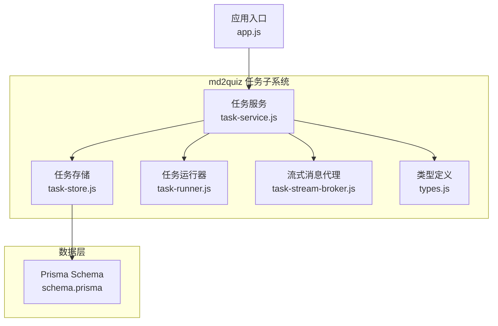
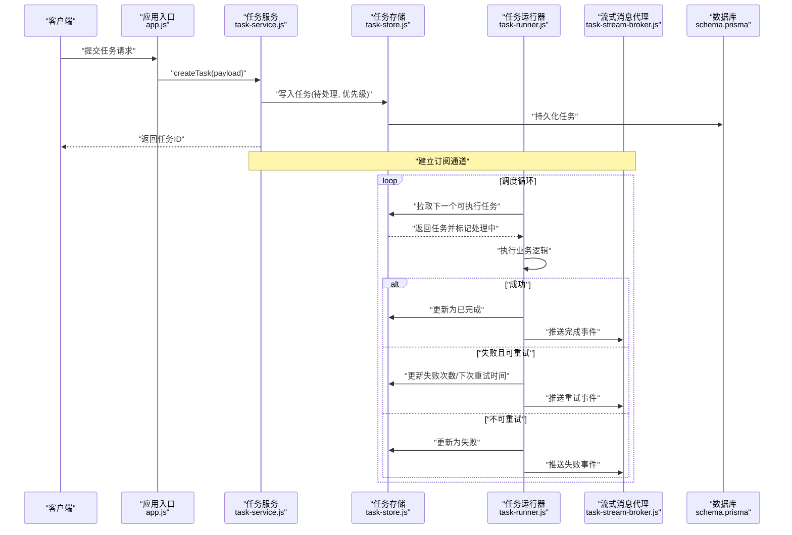
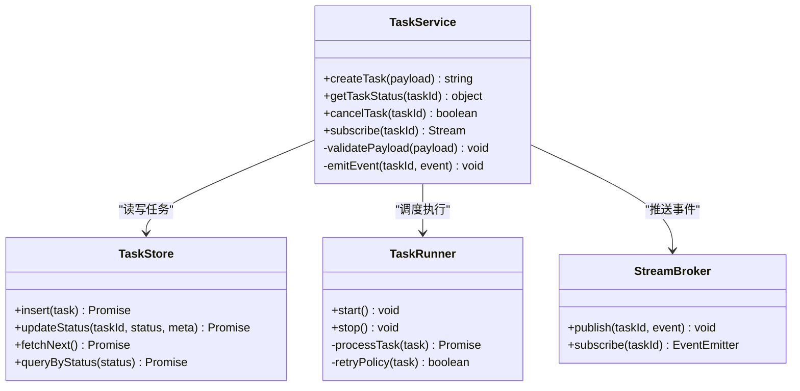
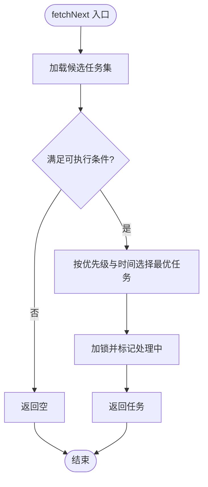
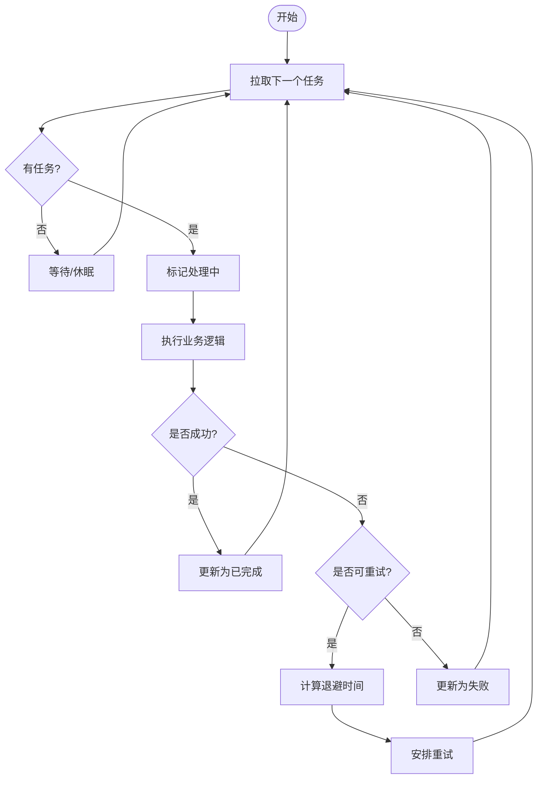
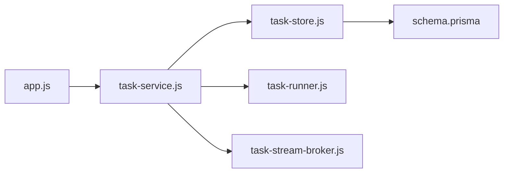

# 任务队列管理

<cite>
**本文引用的文件**   
- [task-service.js](file://node-jinmao/service/md2quiz/task-service.js)
- [task-store.js](file://node-jinmao/service/md2quiz/task-store.js)
- [task-runner.js](file://node-jinmao/service/md2quiz/task-runner.js)
- [task-stream-broker.js](file://node-jinmao/service/md2quiz/task-stream-broker.js)
- [types.js](file://node-jinmao/service/md2quiz/types.js)
- [schema.prisma](file://node-jinmao/prisma/schema.prisma)
- [app.js](file://node-jinmao/app.js)
</cite>

## 目录
1. [简介](#简介)
2. [项目结构](#项目结构)
3. [核心组件](#核心组件)
4. [架构总览](#架构总览)
5. [详细组件分析](#详细组件分析)
6. [依赖关系分析](#依赖关系分析)
7. [性能考虑](#性能考虑)
8. [故障排查指南](#故障排查指南)
9. [结论](#结论)
10. [附录](#附录)

## 简介
本文件围绕“任务队列管理”展开，系统梳理该仓库中任务队列的设计模式与实现要点，包括：
- 任务入队、出队与优先级排序机制
- 任务状态管理（待处理、处理中、已完成、失败）与生命周期
- 存储策略选择（内存队列 vs 持久化存储）
- 并发执行与重试机制
- 监控与日志记录
- 性能优化与故障恢复

本说明既面向开发者，也兼顾非技术读者，力求以循序渐进的方式呈现从概念到代码的完整链路。

## 项目结构
与任务队列相关的核心代码集中在 node-jinmao/service/md2quiz 目录下，包含任务服务、任务存储、任务运行器、流式消息代理以及类型定义等模块；数据库模型在 prisma/schema.prisma 中定义；应用入口在 app.js 中启动相关服务。

图表来源
- [task-service.js](file://node-jinmao/service/md2quiz/task-service.js)
- [task-store.js](file://node-jinmao/service/md2quiz/task-store.js)
- [task-runner.js](file://node-jinmao/service/md2quiz/task-runner.js)
- [task-stream-broker.js](file://node-jinmao/service/md2quiz/task-stream-broker.js)
- [types.js](file://node-jinmao/service/md2quiz/types.js)
- [schema.prisma](file://node-jinmao/prisma/schema.prisma)
- [app.js](file://node-jinmao/app.js)

章节来源
- [task-service.js](file://node-jinmao/service/md2quiz/task-service.js)
- [task-store.js](file://node-jinmao/service/md2quiz/task-store.js)
- [task-runner.js](file://node-jinmao/service/md2quiz/task-runner.js)
- [task-stream-broker.js](file://node-jinmao/service/md2quiz/task-stream-broker.js)
- [types.js](file://node-jinmao/service/md2quiz/types.js)
- [schema.prisma](file://node-jinmao/prisma/schema.prisma)
- [app.js](file://node-jinmao/app.js)

## 核心组件
- 任务服务（TaskService）
  - 职责：对外暴露任务的创建、查询、取消、进度获取等接口；协调存储、运行器与消息代理；维护任务生命周期与状态流转。
  - 关键点：入队时生成唯一任务ID、写入持久化/内存存储；出队由运行器拉取；通过消息代理推送进度与结果。
- 任务存储（TaskStore）
  - 职责：抽象任务数据的增删改查；支持内存与持久化两种后端；提供按状态、优先级、时间等维度的查询能力。
  - 关键点：事务性更新状态；幂等写入；分页与过滤查询。
- 任务运行器（TaskRunner）
  - 职责：从存储中取出下一个可执行任务，设置“处理中”，执行具体业务逻辑，完成后更新为“已完成”或“失败”；支持重试与退避。
  - 关键点：并发控制（最大并行度）、锁机制避免重复消费、错误分类与重试策略。
- 流式消息代理（StreamBroker）
  - 职责：将任务进度、结果、错误事件推送到订阅者（如前端 SSE/WebSocket）。
  - 关键点：连接管理、事件路由、断线重连。
- 类型定义（Types）
  - 职责：统一任务实体、状态枚举、错误码、配置项等类型约束。
  - 关键点：前后端一致的类型契约。

章节来源
- [task-service.js](file://node-jinmao/service/md2quiz/task-service.js)
- [task-store.js](file://node-jinmao/service/md2quiz/task-store.js)
- [task-runner.js](file://node-jinmao/service/md2quiz/task-runner.js)
- [task-stream-broker.js](file://node-jinmao/service/md2quiz/task-stream-broker.js)
- [types.js](file://node-jinmao/service/md2quiz/types.js)

## 架构总览
下图展示了任务从入队到完成的全链路流程，以及各组件之间的交互关系。

图表来源
- [app.js](file://node-jinmao/app.js)
- [task-service.js](file://node-jinmao/service/md2quiz/task-service.js)
- [task-store.js](file://node-jinmao/service/md2quiz/task-store.js)
- [task-runner.js](file://node-jinmao/service/md2quiz/task-runner.js)
- [task-stream-broker.js](file://node-jinmao/service/md2quiz/task-stream-broker.js)
- [schema.prisma](file://node-jinmao/prisma/schema.prisma)

## 详细组件分析

### 任务服务（TaskService）
- 设计要点
  - 入队：校验输入、生成任务ID、计算优先级、写入存储、返回任务ID。
  - 出队：由运行器调用，服务层不直接暴露出队接口，保证一致性。
  - 状态流转：待处理→处理中→已完成/失败；失败时可进入重试队列。
  - 并发控制：限制同时运行的任务数，防止资源耗尽。
  - 监控与日志：记录关键事件（入队、出队、开始、完成、失败、重试）。
- 典型方法
  - createTask(payload): 创建任务并持久化
  - getTaskStatus(taskId): 查询任务状态与进度
  - cancelTask(taskId): 取消任务（若尚未开始）
  - subscribe(taskId): 订阅任务事件流
- 复杂度与扩展
  - 入队 O(1)，查询 O(log n)（基于索引/排序键）
  - 可扩展：多租户隔离、批量入队、延迟入队

图表来源
- [task-service.js](file://node-jinmao/service/md2quiz/task-service.js)
- [task-store.js](file://node-jinmao/service/md2quiz/task-store.js)
- [task-runner.js](file://node-jinmao/service/md2quiz/task-runner.js)
- [task-stream-broker.js](file://node-jinmao/service/md2quiz/task-stream-broker.js)

章节来源
- [task-service.js](file://node-jinmao/service/md2quiz/task-service.js)

### 任务存储（TaskStore）
- 设计要点
  - 抽象层：屏蔽内存与持久化差异，上层无需关心底层实现。
  - 一致性：状态更新使用原子操作，避免竞态条件。
  - 查询能力：按状态、优先级、创建时间等维度筛选与分页。
- 存储策略
  - 内存队列：适合开发测试、低负载场景，启动即初始化，重启丢失。
  - 持久化存储：生产环境推荐，结合数据库事务保证可靠性。
- 关键操作
  - insert(task): 插入新任务
  - fetchNext(): 获取下一个可执行任务（优先高优先级、早创建时间）
  - updateStatus(taskId, status, meta): 更新状态与元数据
  - queryByStatus(status): 按状态查询

图表来源
- [task-store.js](file://node-jinmao/service/md2quiz/task-store.js)

章节来源
- [task-store.js](file://node-jinmao/service/md2quiz/task-store.js)

### 任务运行器（TaskRunner）
- 设计要点
  - 调度循环：周期性从存储拉取任务，设置“处理中”，执行后更新结果。
  - 并发控制：最大并行度、队列长度限制、背压处理。
  - 重试策略：指数退避、最大重试次数、失败分类（可重试/不可重试）。
  - 异常处理：捕获异常、记录日志、上报监控指标。
- 关键流程
  - start(): 启动调度循环
  - stop(): 优雅停止，等待正在执行的任务完成
  - processTask(task): 执行任务逻辑，处理成功/失败分支

图表来源
- [task-runner.js](file://node-jinmao/service/md2quiz/task-runner.js)

章节来源
- [task-runner.js](file://node-jinmao/service/md2quiz/task-runner.js)

### 流式消息代理（StreamBroker）
- 设计要点
  - 事件驱动：任务状态变化、进度更新、错误信息通过事件发布。
  - 订阅模型：客户端按任务ID订阅，减少无关流量。
  - 可靠性：断线重连、消息去重、顺序保证（可选）。
- 关键操作
  - publish(taskId, event): 发布事件
  - subscribe(taskId): 返回事件流供消费

章节来源
- [task-stream-broker.js](file://node-jinmao/service/md2quiz/task-stream-broker.js)

### 类型定义（Types）
- 任务实体字段：id、类型、参数、优先级、状态、重试次数、错误信息、创建/更新时间等。
- 状态枚举：待处理、处理中、已完成、失败。
- 错误码与分类：网络错误、业务校验失败、超时等。
- 配置项：最大并行度、重试次数、退避策略、队列容量等。

章节来源
- [types.js](file://node-jinmao/service/md2quiz/types.js)

## 依赖关系分析
- 组件耦合
  - TaskService 依赖 TaskStore、TaskRunner、StreamBroker，职责清晰、内聚性强。
  - TaskRunner 仅依赖 TaskStore 与业务处理器，保持轻量。
  - TaskStore 抽象了数据源，降低与具体实现的耦合。
- 外部依赖
  - Prisma Schema 定义任务表结构与索引，支撑高效查询与事务。
  - 应用入口 app.js 负责启动服务、注册路由、注入依赖。

图表来源
- [app.js](file://node-jinmao/app.js)
- [task-service.js](file://node-jinmao/service/md2quiz/task-service.js)
- [task-store.js](file://node-jinmao/service/md2quiz/task-store.js)
- [task-runner.js](file://node-jinmao/service/md2quiz/task-runner.js)
- [task-stream-broker.js](file://node-jinmao/service/md2quiz/task-stream-broker.js)
- [schema.prisma](file://node-jinmao/prisma/schema.prisma)

章节来源
- [app.js](file://node-jinmao/app.js)
- [schema.prisma](file://node-jinmao/prisma/schema.prisma)

## 性能考虑
- 入队与出队
  - 使用索引优化查询（状态、优先级、创建时间），避免全表扫描。
  - 批量入队减少数据库往返。
- 并发与吞吐
  - 合理设置最大并行度，避免 CPU/IO 瓶颈。
  - 对 I/O 密集型任务采用异步非阻塞执行。
- 存储选择
  - 内存队列用于低延迟、短生命周期任务；持久化用于可靠任务。
  - 冷热分离：近期任务放内存，历史归档至冷存储。
- 监控与告警
  - 记录队列长度、平均耗时、失败率、重试次数等指标。
  - 设置阈值告警，及时发现问题。

[本节为通用指导，不直接分析具体文件]

## 故障排查指南
- 常见问题
  - 任务堆积：检查运行器并发度、下游依赖可用性、存储性能。
  - 频繁重试：确认错误类型是否为可重试，调整退避策略。
  - 状态不一致：检查状态更新的原子性与事务边界。
- 定位手段
  - 查看任务日志与错误堆栈。
  - 通过任务ID查询状态与进度。
  - 监控队列长度与处理延迟。
- 恢复策略
  - 失败任务自动重试或人工介入。
  - 死信队列保存不可恢复任务，便于后续分析。

章节来源
- [task-runner.js](file://node-jinmao/service/md2quiz/task-runner.js)
- [task-store.js](file://node-jinmao/service/md2quiz/task-store.js)

## 结论
该任务队列子系统通过清晰的组件划分与职责分离，实现了可靠的入队、出队、优先级排序、状态管理与重试机制。结合流式消息代理，提供了实时反馈能力。在生产环境中建议采用持久化存储与完善的监控告警，确保高可用与可观测性。

[本节为总结性内容，不直接分析具体文件]

## 附录
- 最佳实践
  - 明确任务幂等性，避免重复执行造成副作用。
  - 合理设置优先级与超时，保障关键任务优先执行。
  - 定期清理历史任务，控制存储增长。
- 扩展方向
  - 分布式队列：引入消息中间件（如 Redis/RabbitMQ/Kafka）实现横向扩展。
  - 工作流编排：支持复杂任务链路与依赖管理。
  - 多租户隔离：按租户维度隔离队列与资源。

[本节为补充内容，不直接分析具体文件]