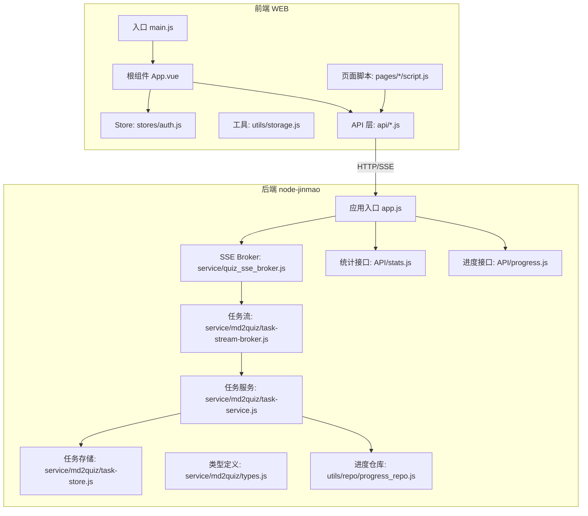
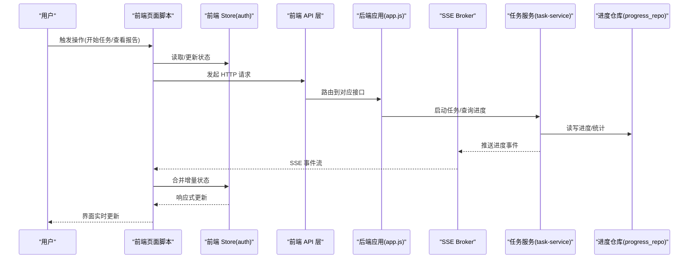
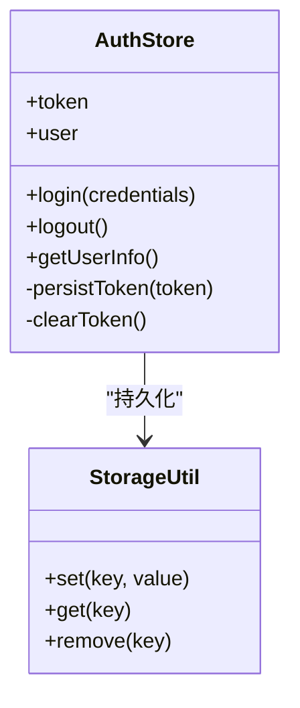
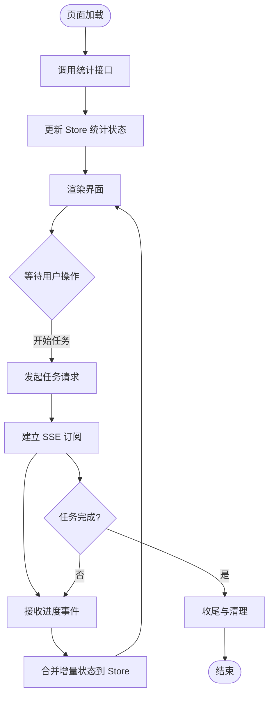
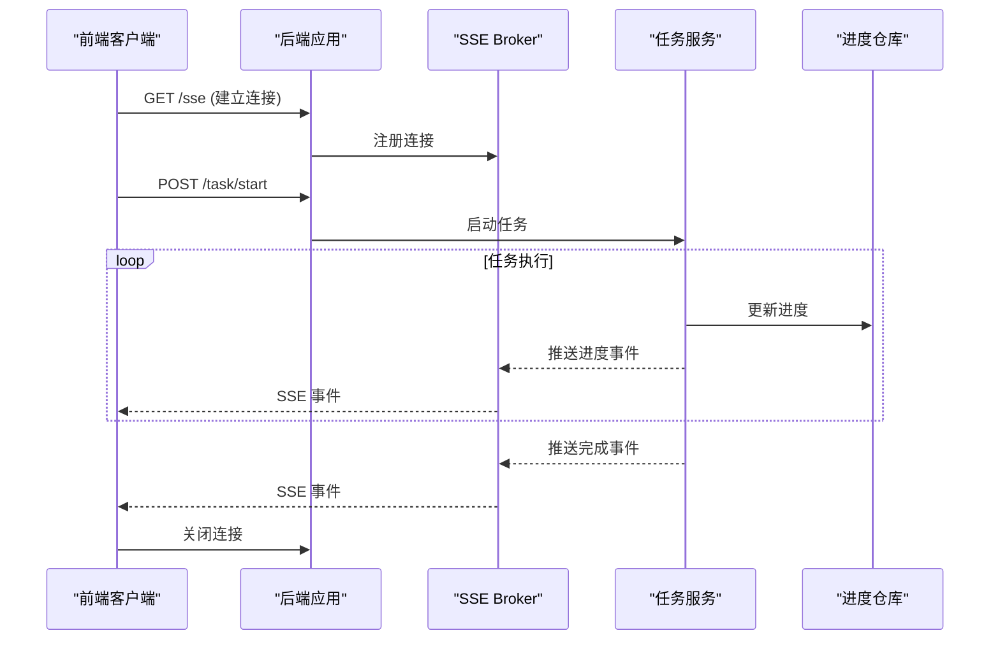
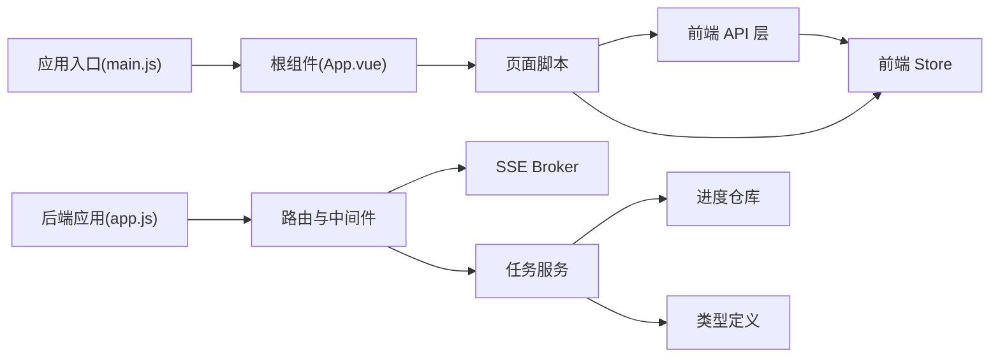

# 实时监控与状态管理

<cite>
**本文档引用的文件**   
- [main.js](file://WEB/src/main.js)
- [App.vue](file://WEB/src/App.vue)
- [auth.js](file://WEB/src/stores/auth.js)
- [storage.js](file://WEB/src/utils/storage.js)
- [index.html](file://WEB/index.html)
- [package.json](file://WEB/package.json)
- [app.js](file://node-jinmao/app.js)
- [quiz_sse_broker.js](file://node-jinmao/service/quiz_sse_broker.js)
- [task-stream-broker.js](file://node-jinmao/service/md2quiz/task-stream-broker.js)
- [task-service.js](file://node-jinmao/service/md2quiz/task-service.js)
- [task-store.js](file://node-jinmao/service/md2quiz/task-store.js)
- [types.js](file://node-jinmao/service/md2quiz/types.js)
- [progress_repo.js](file://node-jinmao/utils/repo/progress_repo.js)
- [stats.js](file://node-jinmao/API/stats.js)
- [progress.js](file://node-jinmao/API/progress.js)
- [api/stats.js](file://WEB/src/api/stats.js)
- [api/progress.js](file://WEB/src/api/progress.js)
- [script.js](file://WEB/src/pages/quiz/script.js)
- [report-script.js](file://WEB/src/pages/quiz/report-script.js)
</cite>

## 目录
1. [简介](#简介)
2. [项目结构](#项目结构)
3. [核心组件](#核心组件)
4. [架构总览](#架构总览)
5. [详细组件分析](#详细组件分析)
6. [依赖关系分析](#依赖关系分析)
7. [性能考虑](#性能考虑)
8. [故障排查指南](#故障排查指南)
9. [结论](#结论)
10. [附录](#附录)

## 简介
本文件围绕“实时监控与状态管理”展开，系统性梳理前端状态管理模式（Vue Store、响应式数据更新、组件间通信）与后端状态同步机制（事件驱动、消息总线、SSE 推送），并给出实现示例、持久化与缓存策略以及性能优化建议。目标是帮助开发者快速构建具备实时反馈、一致性与高可用性的监控界面。

## 项目结构
本项目包含前后端两部分：
- 前端（WEB）：基于 Vue + Vite，使用模块化 API 调用与轻量级 Store（如 auth store），通过 utils/storage 进行本地持久化。页面脚本负责组合业务逻辑与 UI 更新。
- 后端（node-jinmao）：Express 应用，提供 REST API 与 SSE 流式推送；md2quiz 模块内实现了任务流式处理与消息分发；数据库访问通过 Prisma 仓库封装。

图表来源
- [main.js](file://WEB/src/main.js)
- [App.vue](file://WEB/src/App.vue)
- [auth.js](file://WEB/src/stores/auth.js)
- [storage.js](file://WEB/src/utils/storage.js)
- [app.js](file://node-jinmao/app.js)
- [quiz_sse_broker.js](file://node-jinmao/service/quiz_sse_broker.js)
- [task-stream-broker.js](file://node-jinmao/service/md2quiz/task-stream-broker.js)
- [task-service.js](file://node-jinmao/service/md2quiz/task-service.js)
- [task-store.js](file://node-jinmao/service/md2quiz/task-store.js)
- [types.js](file://node-jinmao/service/md2quiz/types.js)
- [progress_repo.js](file://node-jinmao/utils/repo/progress_repo.js)
- [stats.js](file://node-jinmao/API/stats.js)
- [progress.js](file://node-jinmao/API/progress.js)

章节来源
- [package.json](file://WEB/package.json)
- [index.html](file://WEB/index.html)

## 核心组件
- 前端 Store（auth）：集中管理认证相关状态，暴露读写方法供组件订阅与触发更新。
- 前端工具 storage：封装 localStorage/sessionStorage 的读写与序列化，用于 Token、用户信息等的持久化。
- 前端 API 层：按功能域拆分（如 stats、progress），统一请求封装与错误处理。
- 页面脚本：聚合 API 调用、Store 操作与 UI 渲染逻辑，处理异步数据更新与状态一致性。
- 后端 SSE Broker：维护连接与会话，将任务进度或事件推送到前端。
- 任务流与任务服务：协调 md2quiz 任务的执行、分片、校验与结果回写，并通过 broker 推送进度。
- 仓库与接口：封装数据库访问与对外 API，保证状态源的一致性。

章节来源
- [auth.js](file://WEB/src/stores/auth.js)
- [storage.js](file://WEB/src/utils/storage.js)
- [api/stats.js](file://WEB/src/api/stats.js)
- [api/progress.js](file://WEB/src/api/progress.js)
- [script.js](file://WEB/src/pages/quiz/script.js)
- [report-script.js](file://WEB/src/pages/quiz/report-script.js)
- [quiz_sse_broker.js](file://node-jinmao/service/quiz_sse_broker.js)
- [task-stream-broker.js](file://node-jinmao/service/md2quiz/task-stream-broker.js)
- [task-service.js](file://node-jinmao/service/md2quiz/task-service.js)
- [task-store.js](file://node-jinmao/service/md2quiz/task-store.js)
- [types.js](file://node-jinmao/service/md2quiz/types.js)
- [progress_repo.js](file://node-jinmao/utils/repo/progress_repo.js)
- [stats.js](file://node-jinmao/API/stats.js)
- [progress.js](file://node-jinmao/API/progress.js)

## 架构总览
整体采用“前端 Store + 后端 SSE”的事件驱动架构：
- 前端通过 API 发起请求，必要时建立 SSE 连接订阅任务进度。
- 后端在任务执行过程中，通过 SSE Broker 向已订阅客户端推送增量状态。
- 前端收到事件后，更新 Store 中的响应式数据，驱动视图刷新。
- 关键状态（如 Token、用户信息）通过 storage 持久化，保障会话恢复与离线可用性。

图表来源
- [script.js](file://WEB/src/pages/quiz/script.js)
- [auth.js](file://WEB/src/stores/auth.js)
- [api/stats.js](file://WEB/src/api/stats.js)
- [api/progress.js](file://WEB/src/api/progress.js)
- [app.js](file://node-jinmao/app.js)
- [quiz_sse_broker.js](file://node-jinmao/service/quiz_sse_broker.js)
- [task-service.js](file://node-jinmao/service/md2quiz/task-service.js)
- [progress_repo.js](file://node-jinmao/utils/repo/progress_repo.js)

## 详细组件分析

### 前端 Store（auth）与响应式更新
- 职责：集中管理认证状态（如 token、用户信息）、提供 getter/setter、处理登录/登出流程。
- 模式：以模块形式导出状态与方法，组件通过导入方式订阅与触发更新。
- 响应式：结合 Vue 的响应式机制，Store 变更自动触发组件重渲染。
- 最佳实践：避免在组件中直接修改全局状态，统一通过 Store 方法变更。

图表来源
- [auth.js](file://WEB/src/stores/auth.js)
- [storage.js](file://WEB/src/utils/storage.js)

章节来源
- [auth.js](file://WEB/src/stores/auth.js)
- [storage.js](file://WEB/src/utils/storage.js)

### 前端 API 层与页面脚本
- API 层：按功能域组织（stats、progress），封装请求参数、错误处理与重试策略。
- 页面脚本：编排 API 调用与 Store 更新，处理 SSE 事件流，确保 UI 与状态一致。
- 典型流程：页面初始化拉取统计数据；任务进行中订阅 SSE；完成后合并最终结果。

图表来源
- [api/stats.js](file://WEB/src/api/stats.js)
- [api/progress.js](file://WEB/src/api/progress.js)
- [script.js](file://WEB/src/pages/quiz/script.js)
- [report-script.js](file://WEB/src/pages/quiz/report-script.js)

章节来源
- [api/stats.js](file://WEB/src/api/stats.js)
- [api/progress.js](file://WEB/src/api/progress.js)
- [script.js](file://WEB/src/pages/quiz/script.js)
- [report-script.js](file://WEB/src/pages/quiz/report-script.js)

### 后端 SSE Broker 与任务流
- SSE Broker：维护连接池与事件广播，支持按会话/任务维度推送。
- 任务流：任务服务协调分片处理、校验与结果写入，期间持续发布进度事件。
- 类型定义：统一任务与进度数据结构，确保前后端契约一致。

图表来源
- [quiz_sse_broker.js](file://node-jinmao/service/quiz_sse_broker.js)
- [task-stream-broker.js](file://node-jinmao/service/md2quiz/task-stream-broker.js)
- [task-service.js](file://node-jinmao/service/md2quiz/task-service.js)
- [progress_repo.js](file://node-jinmao/utils/repo/progress_repo.js)
- [types.js](file://node-jinmao/service/md2quiz/types.js)

章节来源
- [quiz_sse_broker.js](file://node-jinmao/service/quiz_sse_broker.js)
- [task-stream-broker.js](file://node-jinmao/service/md2quiz/task-stream-broker.js)
- [task-service.js](file://node-jinmao/service/md2quiz/task-service.js)
- [task-store.js](file://node-jinmao/service/md2quiz/task-store.js)
- [types.js](file://node-jinmao/service/md2quiz/types.js)
- [progress_repo.js](file://node-jinmao/utils/repo/progress_repo.js)

### 状态一致性保证
- 幂等性：对重复事件进行去重（基于任务 ID 与版本号）。
- 合并策略：增量事件与快照合并，确保最终一致。
- 断线重连：前端检测连接断开后自动重连，并拉取缺失片段。
- 事务性：后端在写入进度时保证原子性，避免部分更新导致不一致。

章节来源
- [task-store.js](file://node-jinmao/service/md2quiz/task-store.js)
- [progress_repo.js](file://node-jinmao/utils/repo/progress_repo.js)
- [api/progress.js](file://WEB/src/api/progress.js)

## 依赖关系分析
- 前端依赖：Vue 生态（Vite、组件与响应式系统）、自定义 Store 与 API 模块、storage 工具。
- 后端依赖：Express 路由、SSE Broker、任务服务与仓库、Prisma 数据访问。
- 外部集成：可能涉及 LLM 客户端、MinIO 存储等（根据配置与工具模块）。

图表来源
- [main.js](file://WEB/src/main.js)
- [App.vue](file://WEB/src/App.vue)
- [auth.js](file://WEB/src/stores/auth.js)
- [api/stats.js](file://WEB/src/api/stats.js)
- [api/progress.js](file://WEB/src/api/progress.js)
- [app.js](file://node-jinmao/app.js)
- [quiz_sse_broker.js](file://node-jinmao/service/quiz_sse_broker.js)
- [task-service.js](file://node-jinmao/service/md2quiz/task-service.js)
- [progress_repo.js](file://node-jinmao/utils/repo/progress_repo.js)
- [types.js](file://node-jinmao/service/md2quiz/types.js)

章节来源
- [package.json](file://WEB/package.json)
- [app.js](file://node-jinmao/app.js)

## 性能考虑
- 前端
  - 按需订阅：仅在需要时建立 SSE 连接，避免无效开销。
  - 批量更新：合并多次增量事件为一次 Store 更新，减少重渲染。
  - 防抖节流：对高频输入或滚动事件进行节流，降低计算压力。
  - 虚拟列表：长列表渲染时使用虚拟滚动，提升交互流畅度。
- 后端
  - 连接池：合理设置 SSE 连接上限与超时，防止资源耗尽。
  - 事件压缩：对频繁小事件进行合并或采样，降低带宽占用。
  - 异步队列：任务执行与 IO 分离，提高吞吐与稳定性。
  - 缓存策略：热点数据（如统计）短期缓存，减轻数据库压力。

[本节为通用指导，不直接分析具体文件]

## 故障排查指南
- 常见问题
  - SSE 连接失败：检查网络、跨域、服务端端口与防火墙规则。
  - 状态不同步：确认事件去重与合并逻辑，核对版本号与任务 ID。
  - 内存泄漏：确保组件卸载时移除事件监听与关闭连接。
  - 性能抖动：定位重渲染热点，优化 Store 粒度与计算复杂度。
- 调试技巧
  - 前端：打开浏览器开发者工具的网络面板，观察 SSE 事件流与请求耗时。
  - 后端：在服务端日志中追踪任务生命周期与事件推送路径。
  - 数据一致性：对比快照与增量事件，验证最终状态是否收敛。

章节来源
- [api/progress.js](file://WEB/src/api/progress.js)
- [quiz_sse_broker.js](file://node-jinmao/service/quiz_sse_broker.js)
- [task-service.js](file://node-jinmao/service/md2quiz/task-service.js)

## 结论
通过“前端 Store + 后端 SSE”的事件驱动架构，本项目实现了高效的实时监控与状态管理。借助统一的类型定义、增量合并与断线重连机制，保证了状态一致性与用户体验。配合合理的缓存与性能优化策略，可在大规模并发场景下保持稳定与高效。

[本节为总结，不直接分析具体文件]

## 附录
- 开发建议
  - 明确事件契约：在前端与后端共享 types.js，避免字段漂移。
  - 分层清晰：API 层专注请求封装，Store 专注状态管理，页面脚本编排流程。
  - 可观测性：增加关键指标（连接数、事件速率、错误率）以便监控与告警。
- 扩展方向
  - WebSocket 替代 SSE：如需双向通信或更高可靠性，可评估 WebSocket。
  - 分布式 Broker：多实例部署时引入 Redis Pub/Sub 作为消息中枢。
  - 前端状态库：复杂场景可引入 Pinia/Vuex 统一管理多模块状态。

[本节为补充内容，不直接分析具体文件]