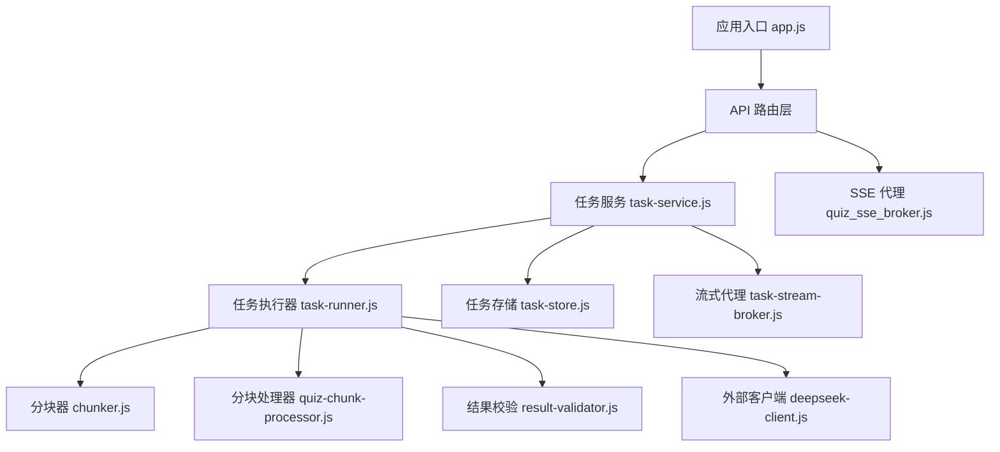
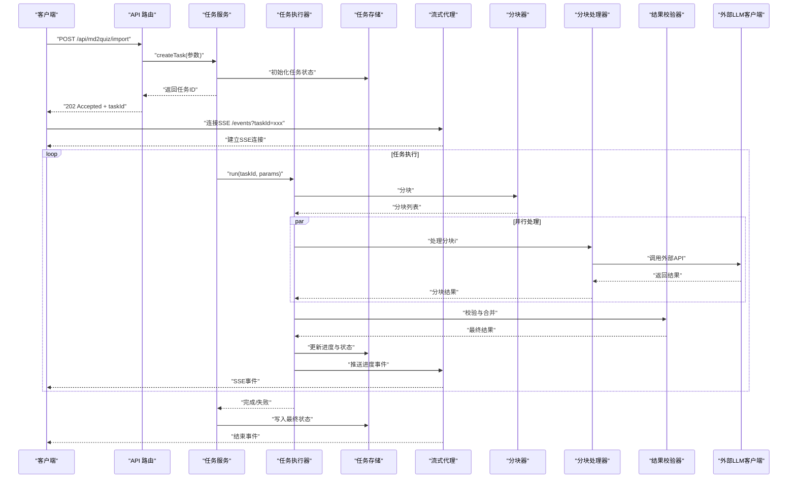
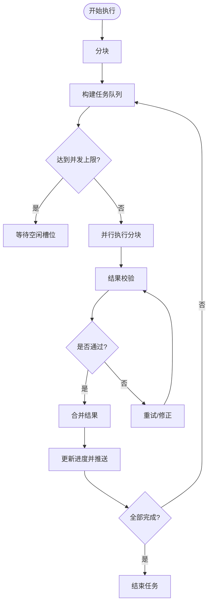
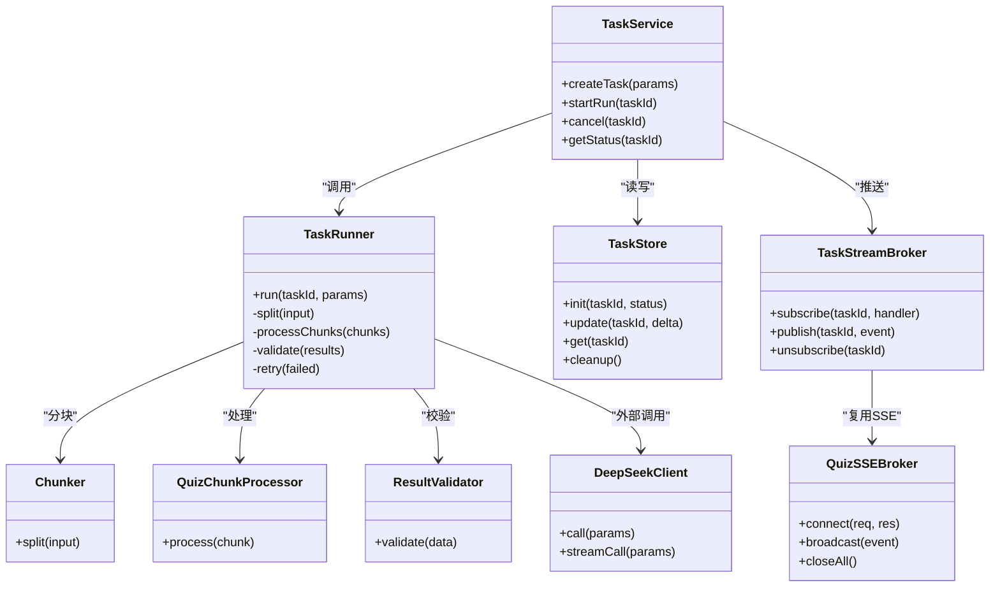

# 异步任务处理

<cite>
**本文引用的文件**   
- [app.js](file://node-jinmao/app.js)
- [task-service.js](file://node-jinmao/service/md2quiz/task-service.js)
- [task-runner.js](file://node-jinmao/service/md2quiz/task-runner.js)
- [task-store.js](file://node-jinmao/service/md2quiz/task-store.js)
- [task-stream-broker.js](file://node-jinmao/service/md2quiz/task-stream-broker.js)
- [quiz_sse_broker.js](file://node-jinmao/service/quiz_sse_broker.js)
- [chunker.js](file://node-jinmao/service/md2quiz/chunker.js)
- [quiz-chunk-processor.js](file://node-jinmao/service/md2quiz/quiz-chunk-processor.js)
- [result-validator.js](file://node-jinmao/service/md2quiz/result-validator.js)
- [deepseek-client.js](file://node-jinmao/service/md2quiz/deepseek-client.js)
- [package.json](file://node-jinmao/package.json)
</cite>

## 目录
1. [简介](#简介)
2. [项目结构](#项目结构)
3. [核心组件](#核心组件)
4. [架构总览](#架构总览)
5. [详细组件分析](#详细组件分析)
6. [依赖关系分析](#依赖关系分析)
7. [性能考量](#性能考量)
8. [故障排查指南](#故障排查指南)
9. [结论](#结论)
10. [附录](#附录)

## 简介
本文件围绕 Node.js 异步任务处理进行系统化说明，涵盖事件循环、Promise/Async-Await 模式、任务队列与并发控制、调度策略、SSE 流式传输与实时通信、错误重试与监控、以及性能优化策略。文档以仓库中 md2quiz 模块的异步任务实现为主线，结合 SSE Broker 与任务服务，给出端到端的流程与最佳实践。

## 项目结构
后端入口位于 node-jinmao/app.js，md2quiz 相关异步任务逻辑集中在 service/md2quiz 目录下，包括任务服务、执行器、存储、流式消息代理、分块器、处理器与校验器等。SSE 能力由 service/quiz_sse_broker.js 提供。

图表来源
- [app.js](file://node-jinmao/app.js)
- [task-service.js](file://node-jinmao/service/md2quiz/task-service.js)
- [task-runner.js](file://node-jinmao/service/md2quiz/task-runner.js)
- [task-store.js](file://node-jinmao/service/md2quiz/task-store.js)
- [task-stream-broker.js](file://node-jinmao/service/md2quiz/task-stream-broker.js)
- [quiz_sse_broker.js](file://node-jinmao/service/quiz_sse_broker.js)
- [chunker.js](file://node-jinmao/service/md2quiz/chunker.js)
- [quiz-chunk-processor.js](file://node-jinmao/service/md2quiz/quiz-chunk-processor.js)
- [result-validator.js](file://node-jinmao/service/md2quiz/result-validator.js)
- [deepseek-client.js](file://node-jinmao/service/md2quiz/deepseek-client.js)

章节来源
- [app.js](file://node-jinmao/app.js)
- [package.json](file://node-jinmao/package.json)

## 核心组件
- 任务服务（TaskService）：对外暴露创建、查询、取消等接口；协调任务生命周期、持久化状态与流式推送。
- 任务执行器（TaskRunner）：负责实际执行任务，包含分块、并行处理、进度上报、错误重试与最终聚合。
- 任务存储（TaskStore）：内存或持久化的任务状态管理，支持按任务 ID 查询、更新与清理。
- 流式代理（TaskStreamBroker）：基于 SSE 将任务进度与中间结果推送到前端。
- SSE 代理（QuizSSEBroker）：通用 SSE 通道，用于实时状态广播与订阅。
- 分块器（Chunker）：将大输入切分为可并行处理的片段。
- 分块处理器（QuizChunkProcessor）：对每个分块调用 LLM 或其他外部服务进行处理。
- 结果校验器（ResultValidator）：对输出进行格式与质量校验，必要时触发重试或修正。
- 外部客户端（DeepSeekClient）：封装第三方 API 调用，具备超时、重试与错误转换能力。

章节来源
- [task-service.js](file://node-jinmao/service/md2quiz/task-service.js)
- [task-runner.js](file://node-jinmao/service/md2quiz/task-runner.js)
- [task-store.js](file://node-jinmao/service/md2quiz/task-store.js)
- [task-stream-broker.js](file://node-jinmao/service/md2quiz/task-stream-broker.js)
- [quiz_sse_broker.js](file://node-jinmao/service/quiz_sse_broker.js)
- [chunker.js](file://node-jinmao/service/md2quiz/chunker.js)
- [quiz-chunk-processor.js](file://node-jinmao/service/md2quiz/quiz-chunk-processor.js)
- [result-validator.js](file://node-jinmao/service/md2quiz/result-validator.js)
- [deepseek-client.js](file://node-jinmao/service/md2quiz/deepseek-client.js)

## 架构总览
下图展示了从请求进入、任务创建、执行到 SSE 推送的完整链路，体现 Promise/Async-Await 与事件循环协作方式。

图表来源
- [task-service.js](file://node-jinmao/service/md2quiz/task-service.js)
- [task-runner.js](file://node-jinmao/service/md2quiz/task-runner.js)
- [task-store.js](file://node-jinmao/service/md2quiz/task-store.js)
- [task-stream-broker.js](file://node-jinmao/service/md2quiz/task-stream-broker.js)
- [quiz_sse_broker.js](file://node-jinmao/service/quiz_sse_broker.js)
- [chunker.js](file://node-jinmao/service/md2quiz/chunker.js)
- [quiz-chunk-processor.js](file://node-jinmao/service/md2quiz/quiz-chunk-processor.js)
- [result-validator.js](file://node-jinmao/service/md2quiz/result-validator.js)
- [deepseek-client.js](file://node-jinmao/service/md2quiz/deepseek-client.js)

## 详细组件分析

### 任务服务（TaskService）
职责
- 接收请求并创建任务，分配唯一 taskId。
- 维护任务生命周期（pending、running、completed、failed）。
- 与 TaskStore 交互持久化状态，与 TaskStreamBroker 推送进度。
- 协调 TaskRunner 的执行与回调。

关键流程
- createTask：初始化状态、落库、返回 taskId。
- startRun：启动异步执行，注册事件监听。
- cancel：标记取消并通知执行器中断。

并发与调度
- 通过 TaskRunner 内部并发控制限制并行度，避免资源耗尽。
- 使用事件驱动推进状态变更，减少阻塞。

错误处理
- 捕获异常并转为统一错误码，记录日志，触发失败分支。

章节来源
- [task-service.js](file://node-jinmao/service/md2quiz/task-service.js)
- [task-store.js](file://node-jinmao/service/md2quiz/task-store.js)
- [task-stream-broker.js](file://node-jinmao/service/md2quiz/task-stream-broker.js)

### 任务执行器（TaskRunner）
职责
- 编排分块、并行处理、结果聚合与校验。
- 维护任务进度、重试次数、错误信息。
- 向流式代理推送阶段性事件。

并发控制
- 使用有界并发池（如 p-limit 或自定义队列），限制同时运行的分块数。
- 对慢速外部调用设置超时与退避重试。

调度策略
- 优先处理小分块以提升首字节响应时间。
- 失败分块自动重试，超过阈值后降级或报错。

图表来源
- [task-runner.js](file://node-jinmao/service/md2quiz/task-runner.js)
- [chunker.js](file://node-jinmao/service/md2quiz/chunker.js)
- [quiz-chunk-processor.js](file://node-jinmao/service/md2quiz/quiz-chunk-processor.js)
- [result-validator.js](file://node-jinmao/service/md2quiz/result-validator.js)

章节来源
- [task-runner.js](file://node-jinmao/service/md2quiz/task-runner.js)
- [chunker.js](file://node-jinmao/service/md2quiz/chunker.js)
- [quiz-chunk-processor.js](file://node-jinmao/service/md2quiz/quiz-chunk-processor.js)
- [result-validator.js](file://node-jinmao/service/md2quiz/result-validator.js)

### 任务存储（TaskStore）
职责
- 提供任务的增删改查与状态同步。
- 支持按 taskId 快速检索与批量清理过期任务。
- 可选持久化（内存/数据库/对象存储）以保障重启恢复。

设计要点
- 读写分离：读多写少场景下采用快照与增量更新。
- 幂等性：重复更新不产生副作用。

章节来源
- [task-store.js](file://node-jinmao/service/md2quiz/task-store.js)

### 流式代理（TaskStreamBroker）与 SSE（QuizSSEBroker）
职责
- 为每个任务建立独立 SSE 通道，推送进度、中间结果与结束事件。
- 管理连接生命周期、断线重连提示与背压控制。

实现要点
- 使用 Server-Sent Events 协议，服务端主动推送文本事件。
- 对慢客户端进行缓冲与丢弃策略，防止内存膨胀。
- 与 TaskRunner 的事件系统对接，保证事件顺序与一致性。

章节来源
- [task-stream-broker.js](file://node-jinmao/service/md2quiz/task-stream-broker.js)
- [quiz_sse_broker.js](file://node-jinmao/service/quiz_sse_broker.js)

### 分块器（Chunker）与分块处理器（QuizChunkProcessor）
分块器
- 根据内容大小、语义边界或固定长度切分输入。
- 输出分块元数据（索引、范围、预估耗时）。

分块处理器
- 对每个分块调用外部 LLM 或业务服务。
- 处理网络异常、限流与重试，返回标准化结果。

章节来源
- [chunker.js](file://node-jinmao/service/md2quiz/chunker.js)
- [quiz-chunk-processor.js](file://node-jinmao/service/md2quiz/quiz-chunk-processor.js)

### 结果校验器（ResultValidator）
职责
- 校验输出格式、必填字段、类型与约束。
- 对不合格结果触发修复或重新生成。
- 统计通过率与失败原因，辅助优化提示词与参数。

章节来源
- [result-validator.js](file://node-jinmao/service/md2quiz/result-validator.js)

### 外部客户端（DeepSeekClient）
职责
- 封装第三方 API 调用，统一错误码与超时处理。
- 实现指数退避重试、熔断与降级策略。
- 提供流式响应读取（如需要）与缓冲控制。

章节来源
- [deepseek-client.js](file://node-jinmao/service/md2quiz/deepseek-client.js)

## 依赖关系分析
- 组件内聚性高：TaskService 仅协调，TaskRunner 专注执行，TaskStore 专注状态，Broker 专注推送。
- 低耦合接口：各组件通过明确的方法契约交互，便于替换实现（如存储或客户端）。
- 外部依赖：Node.js 原生事件循环、HTTP/SSE、第三方 LLM 客户端。

图表来源
- [task-service.js](file://node-jinmao/service/md2quiz/task-service.js)
- [task-runner.js](file://node-jinmao/service/md2quiz/task-runner.js)
- [task-store.js](file://node-jinmao/service/md2quiz/task-store.js)
- [task-stream-broker.js](file://node-jinmao/service/md2quiz/task-stream-broker.js)
- [quiz_sse_broker.js](file://node-jinmao/service/quiz_sse_broker.js)
- [chunker.js](file://node-jinmao/service/md2quiz/chunker.js)
- [quiz-chunk-processor.js](file://node-jinmao/service/md2quiz/quiz-chunk-processor.js)
- [result-validator.js](file://node-jinmao/service/md2quiz/result-validator.js)
- [deepseek-client.js](file://node-jinmao/service/md2quiz/deepseek-client.js)

章节来源
- [task-service.js](file://node-jinmao/service/md2quiz/task-service.js)
- [task-runner.js](file://node-jinmao/service/md2quiz/task-runner.js)
- [task-store.js](file://node-jinmao/service/md2quiz/task-store.js)
- [task-stream-broker.js](file://node-jinmao/service/md2quiz/task-stream-broker.js)
- [quiz_sse_broker.js](file://node-jinmao/service/quiz_sse_broker.js)
- [chunker.js](file://node-jinmao/service/md2quiz/chunker.js)
- [quiz-chunk-processor.js](file://node-jinmao/service/md2quiz/quiz-chunk-processor.js)
- [result-validator.js](file://node-jinmao/service/md2quiz/result-validator.js)
- [deepseek-client.js](file://node-jinmao/service/md2quiz/deepseek-client.js)

## 性能考量
- 事件循环友好：避免长时间阻塞操作，I/O 与 CPU 密集任务拆分，使用 Worker 或子进程处理 CPU 密集型计算。
- 并发控制：合理设置并行度，避免下游限流与内存峰值过高。
- 流式传输：优先使用 SSE/流式 API 降低首字节延迟，减少全量缓冲。
- 缓存与去重：对相同输入进行缓存，避免重复计算。
- 超时与熔断：对外部调用设置超时、重试与熔断，提升整体稳定性。
- 资源回收：及时释放连接、关闭流、清理定时器与事件监听。

[本节为通用指导，不直接分析具体文件]

## 故障排查指南
常见问题
- 任务卡住：检查并发队列是否死锁、外部服务是否超时、是否有未释放的连接。
- SSE 断开：确认服务端是否发送心跳、客户端是否正确重连、是否存在背压堆积。
- 结果不一致：查看校验器日志、重试次数与失败原因，定位提示词或参数问题。
- 内存泄漏：监控堆内存增长，排查未关闭的流、闭包引用与全局变量累积。

排查步骤
- 启用详细日志，记录任务生命周期事件与关键参数。
- 使用性能分析工具（如 --inspect）定位热点与阻塞点。
- 模拟极端负载与失败场景，验证重试与降级策略。

章节来源
- [task-runner.js](file://node-jinmao/service/md2quiz/task-runner.js)
- [task-stream-broker.js](file://node-jinmao/service/md2quiz/task-stream-broker.js)
- [result-validator.js](file://node-jinmao/service/md2quiz/result-validator.js)
- [deepseek-client.js](file://node-jinmao/service/md2quiz/deepseek-client.js)

## 结论
本项目通过清晰的分层与职责划分，实现了稳定高效的异步任务处理体系。借助 Promise/Async-Await、事件循环与 SSE，提供了良好的用户体验与可扩展性。建议在后续迭代中进一步完善监控告警、指标采集与自动化测试，持续提升系统的可靠性与性能。

[本节为总结性内容，不直接分析具体文件]

## 附录
- 安装与运行：参考 package.json 中的脚本命令，确保环境变量与依赖正确配置。
- 扩展建议：引入消息队列（如 Redis/Bull）实现分布式任务调度；增加 Prometheus 指标与 Grafana 看板。
- 安全建议：对 SSE 通道进行鉴权与速率限制，防止滥用与攻击。

章节来源
- [package.json](file://node-jinmao/package.json)