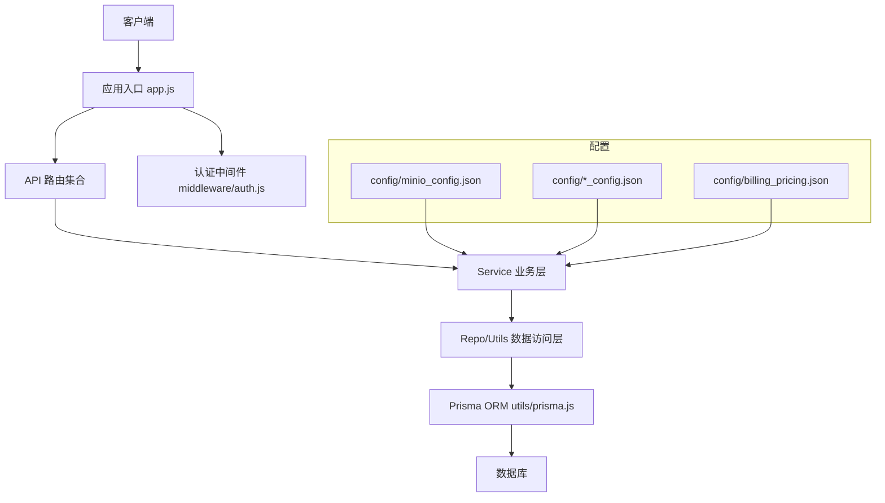
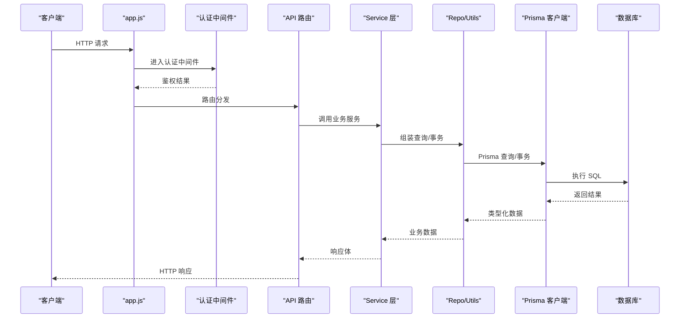
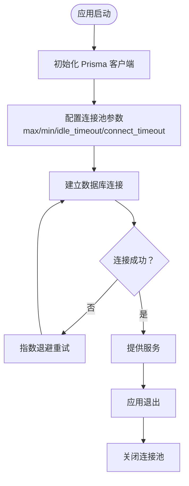
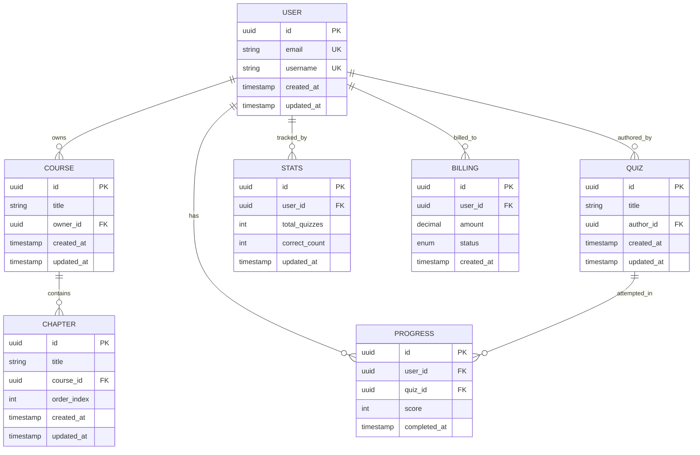
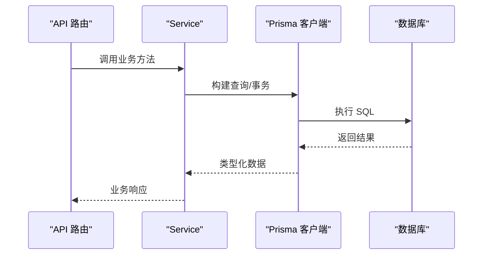
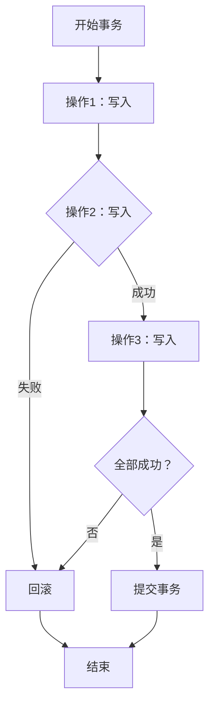
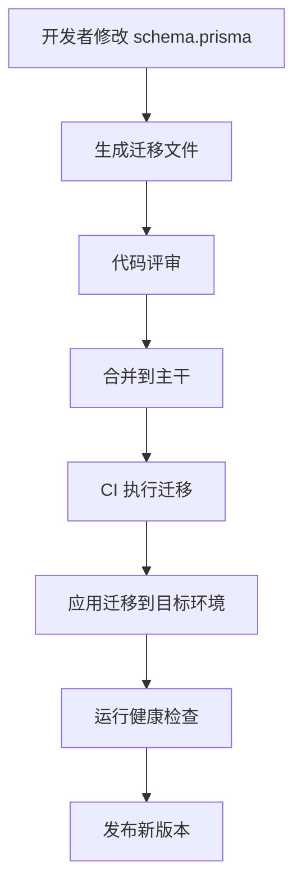
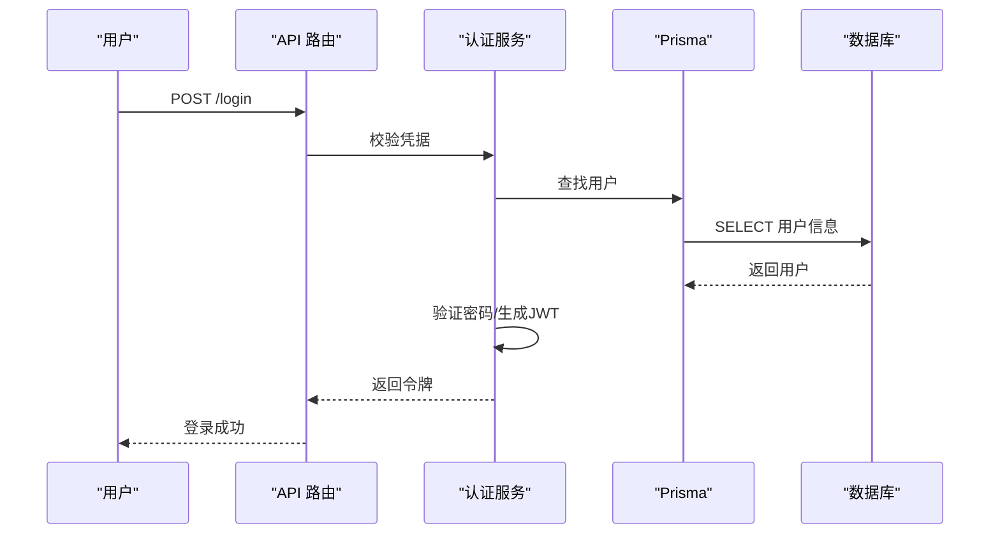
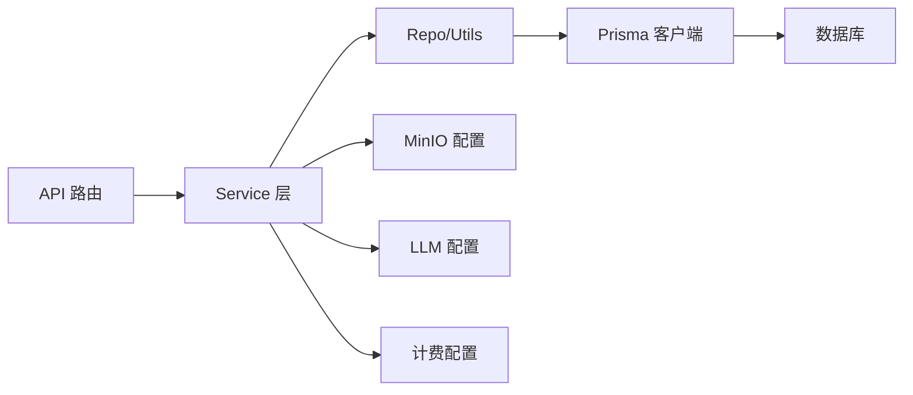

# 数据库操作

<cite>
**本文引用的文件**   
- [node-jinmao/prisma/schema.prisma](file://node-jinmao/prisma/schema.prisma)
- [node-jinmao/utils/prisma.js](file://node-jinmao/utils/prisma.js)
- [node-jinmao/package.json](file://node-jinmao/package.json)
- [node-jinmao/.migration_version](file://node-jinmao/.migration_version)
- [node-jinmao/.schema_hash](file://node-jinmao/.schema_hash)
- [node-jinmao/_test_db.js](file://node-jinmao/_test_db.js)
- [node-jinmao/app.js](file://node-jinmao/app.js)
- [node-jinmao/middleware/auth.js](file://node-jinmao/middleware/auth.js)
- [node-jinmao/API/auth.js](file://node-jinmao/API/auth.js)
- [node-jinmao/service/auth/index.js](file://node-jinmao/service/auth/index.js)
- [node-jinmao/service/auth/login.js](file://node-jinmao/service/auth/login.js)
- [node-jinmao/service/auth/profile.js](file://node-jinmao/service/auth/profile.js)
- [node-jinmao/utils/jwt.js](file://node-jinmao/utils/jwt.js)
- [node-jinmao/utils/input_validator.js](file://node-jinmao/utils/input_validator.js)
- [node-jinmao/utils/repo/activity_repo.js](file://node-jinmao/utils/repo/activity_repo.js)
- [node-jinmao/utils/repo/book_repo.js](file://node-jinmao/utils/repo/book_repo.js)
- [node-jinmao/utils/repo/chapter_repo.js](file://node-jinmao/utils/repo/chapter_repo.js)
- [node-jinmao/utils/repo/progress_repo.js](file://node-jinmao/utils/repo/progress_repo.js)
- [node-jinmao/utils/repo/stats_repo.js](file://node-jinmao/utils/repo/stats_repo.js)
- [node-jinmao/utils/repo/update_repo.js](file://node-jinmao/utils/repo/update_repo.js)
- [node-jinmao/repo/quiz_repo.js](file://node-jinmao/repo/quiz_repo.js)
- [node-jinmao/API/billing.js](file://node-jinmao/API/billing.js)
- [node-jinmao/API/files.js](file://node-jinmao/API/files.js)
- [node-jinmao/API/progress.js](file://node-jinmao/API/progress.js)
- [node-jinmao/API/stats.js](file://node-jinmao/API/stats.js)
- [node-jinmao/API/course/index.js](file://node-jinmao/API/course/index.js)
- [node-jinmao/API/course/slides.js](file://node-jinmao/API/course/slides.js)
- [node-jinmao/API/book/index.js](file://node-jinmao/API/book/index.js)
- [node-jinmao/API/book/list.js](file://node-jinmao/API/book/list.js)
- [node-jinmao/API/book/detail.js](file://node-jinmao/API/book/detail.js)
- [node-jinmao/API/book/update.js](file://node-jinmao/API/book/update.js)
- [node-jinmao/API/book/delete.js](file://node-jinmao/API/book/delete.js)
- [node-jinmao/API/book/files.js](file://node-jinmao/API/book/files.js)
- [node-jinmao/API/book/generate-next-chapter.js](file://node-jinmao/API/book/generate-next-chapter.js)
- [node-jinmao/API/book/fix-missing.js](file://node-jinmao/API/book/fix-missing.js)
- [node-jinmao/API/quiz/import.js](file://node-jinmao/API/quiz/import.js)
- [node-jinmao/API/quiz/report.js](file://node-jinmao/API/quiz/report.js)
- [node-jinmao/API/quiz/session.js](file://node-jinmao/API/quiz/session.js)
- [node-jinmao/API/quiz/textbooks.js](file://node-jinmao/API/quiz/textbooks.js)
- [node-jinmao/API/quiz/wrongbook.js](file://node-jinmao/API/quiz/wrongbook.js)
- [node-jinmao/service/POSTbook.js](file://node-jinmao/service/POSTbook.js)
- [node-jinmao/service/course_pipeline.js](file://node-jinmao/service/course_pipeline.js)
- [node-jinmao/service/create_cover_image.js](file://node-jinmao/service/create_cover_image.js)
- [node-jinmao/service/create_title.js](file://node-jinmao/service/create_title.js)
- [node-jinmao/service/quiz_import.js](file://node-jinmao/service/quiz_import.js)
- [node-jinmao/service/quiz_judge.js](file://node-jinmao/service/quiz_judge.js)
- [node-jinmao/service/quiz_report_service.js](file://node-jinmao/service/quiz_report_service.js)
- [node-jinmao/service/quiz_sse_broker.js](file://node-jinmao/service/quiz_sse_broker.js)
- [node-jinmao/config/minio_config.json](file://node-jinmao/config/minio_config.json)
- [node-jinmao/config/deepseek_config.json](file://node-jinmao/config/deepseek_config.json)
- [node-jinmao/config/grsai_config.json](file://node-jinmao/config/grsai_config.json)
- [node-jinmao/config/volcengine_config.json](file://node-jinmao/config/volcengine_config.json)
- [node-jinmao/config/billing_pricing.json](file://node-jinmao/config/billing_pricing.json)
</cite>

## 目录
1. [引言](#引言)
2. [项目结构](#项目结构)
3. [核心组件](#核心组件)
4. [架构总览](#架构总览)
5. [详细组件分析](#详细组件分析)
6. [依赖关系分析](#依赖关系分析)
7. [性能考虑](#性能考虑)
8. [故障排查指南](#故障排查指南)
9. [结论](#结论)
10. [附录](#附录)

## 引言
本文件面向使用 Prisma ORM 的 Node.js 后端，系统化说明数据模型定义、查询构建器用法、事务处理机制、连接池配置与优化策略；同时覆盖数据迁移管理、索引优化、查询缓存实现思路；并提供 CRUD 示例、复杂关联查询、批量操作、数据验证实践；最后给出备份恢复策略、监控日志记录与故障排查方法。文档内容基于仓库中 node-jinmao 模块的 Prisma 配置、迁移脚本与服务层代码进行归纳总结。

## 项目结构
本项目采用“API 路由 → Service 业务逻辑 → Repo/Utils 数据访问”的分层组织方式，Prisma 作为统一的 ORM 与迁移工具：
- Prisma 模型与迁移位于 prisma 目录，包含 schema.prisma 与各版本迁移 SQL。
- 应用入口 app.js 负责初始化服务与中间件。
- API 层按功能域划分（auth、book、course、quiz、billing、files、progress、stats）。
- Service 层封装领域逻辑，Repo/Utils 层封装 Prisma 查询与工具函数。
- 配置文件集中于 config 目录，包括 MinIO、LLM 及计费定价等。

**图表来源**
- [node-jinmao/app.js](file://node-jinmao/app.js)
- [node-jinmao/middleware/auth.js](file://node-jinmao/middleware/auth.js)
- [node-jinmao/utils/prisma.js](file://node-jinmao/utils/prisma.js)
- [node-jinmao/config/minio_config.json](file://node-jinmao/config/minio_config.json)
- [node-jinmao/config/deepseek_config.json](file://node-jinmao/config/deepseek_config.json)
- [node-jinmao/config/grsai_config.json](file://node-jinmao/config/grsai_config.json)
- [node-jinmao/config/volcengine_config.json](file://node-jinmao/config/volcengine_config.json)
- [node-jinmao/config/billing_pricing.json](file://node-jinmao/config/billing_pricing.json)

**章节来源**
- [node-jinmao/app.js](file://node-jinmao/app.js)
- [node-jinmao/middleware/auth.js](file://node-jinmao/middleware/auth.js)
- [node-jinmao/utils/prisma.js](file://node-jinmao/utils/prisma.js)

## 核心组件
- Prisma 客户端与连接池：通过 utils/prisma.js 暴露单例客户端，集中管理连接参数、超时、重试与错误处理。
- 数据模型与迁移：prisma/schema.prisma 定义实体与关系；migrations 目录维护增量变更。
- 认证与鉴权：middleware/auth.js 校验 JWT，service/auth 完成登录、资料读取等业务。
- 业务服务：book、course、quiz、billing、progress、stats 等 Service 组合多个 Repo/Utils 完成复杂流程。
- 外部集成：MinIO 对象存储、多种 LLM 提供商配置用于内容生成与题目处理。

**章节来源**
- [node-jinmao/utils/prisma.js](file://node-jinmao/utils/prisma.js)
- [node-jinmao/prisma/schema.prisma](file://node-jinmao/prisma/schema.prisma)
- [node-jinmao/middleware/auth.js](file://node-jinmao/middleware/auth.js)
- [node-jinmao/service/auth/index.js](file://node-jinmao/service/auth/index.js)
- [node-jinmao/service/auth/login.js](file://node-jinmao/service/auth/login.js)
- [node-jinmao/service/auth/profile.js](file://node-jinmao/service/auth/profile.js)
- [node-jinmao/utils/jwt.js](file://node-jinmao/utils/jwt.js)

## 架构总览
下图展示从请求到数据库的完整调用链，以及关键配置与中间件的协作关系。

**图表来源**
- [node-jinmao/app.js](file://node-jinmao/app.js)
- [node-jinmao/middleware/auth.js](file://node-jinmao/middleware/auth.js)
- [node-jinmao/API/auth.js](file://node-jinmao/API/auth.js)
- [node-jinmao/service/auth/login.js](file://node-jinmao/service/auth/login.js)
- [node-jinmao/utils/prisma.js](file://node-jinmao/utils/prisma.js)

## 详细组件分析

### Prisma ORM 使用与连接池配置
- 客户端初始化：在 utils/prisma.js 中创建并导出 Prisma 客户端实例，统一设置连接字符串、超时、连接池大小、日志级别等。
- 连接池建议：根据并发量与数据库规格调整 max()、min()、idle_timeout、connect_timeout；在高并发场景下适当增大连接池上限，避免连接耗尽。
- 错误处理：对连接失败、查询超时、SQL 异常进行捕获与上报，便于监控告警。
- 生命周期：应用启动时建立连接，关闭时优雅断开，确保资源释放。

**图表来源**
- [node-jinmao/utils/prisma.js](file://node-jinmao/utils/prisma.js)

**章节来源**
- [node-jinmao/utils/prisma.js](file://node-jinmao/utils/prisma.js)

### 数据模型与关系
- 模型定义：在 prisma/schema.prisma 中声明各实体（如用户、课程、章节、题库、学习进度、统计、账单等）及其字段类型、约束与关系。
- 关系建模：一对多、多对多关系通过外键与关联表表达，确保引用完整性。
- 枚举与默认值：为状态类字段提供枚举与默认值，减少脏数据。
- 审计字段：常见 created_at、updated_at 等时间戳字段，便于追踪。

**图表来源**
- [node-jinmao/prisma/schema.prisma](file://node-jinmao/prisma/schema.prisma)

**章节来源**
- [node-jinmao/prisma/schema.prisma](file://node-jinmao/prisma/schema.prisma)

### 查询构建器与典型用法
- 基础 CRUD：使用 Prisma 提供的 create/findUnique/findMany/update/delete 等方法完成增删改查。
- 条件过滤与排序：通过 where、orderBy、skip、take 实现分页与筛选。
- 关联查询：利用 include/select 获取关联数据，避免 N+1 问题。
- 聚合与统计：使用 groupBy、aggregate 计算汇总指标。
- 事务：使用 $transaction 包裹多条写操作，保证一致性。

**图表来源**
- [node-jinmao/API/book/list.js](file://node-jinmao/API/book/list.js)
- [node-jinmao/API/book/detail.js](file://node-jinmao/API/book/detail.js)
- [node-jinmao/utils/repo/book_repo.js](file://node-jinmao/utils/repo/book_repo.js)
- [node-jinmao/utils/prisma.js](file://node-jinmao/utils/prisma.js)

**章节来源**
- [node-jinmao/utils/repo/book_repo.js](file://node-jinmao/utils/repo/book_repo.js)
- [node-jinmao/utils/repo/chapter_repo.js](file://node-jinmao/utils/repo/chapter_repo.js)
- [node-jinmao/utils/repo/progress_repo.js](file://node-jinmao/utils/repo/progress_repo.js)
- [node-jinmao/utils/repo/stats_repo.js](file://node-jinmao/utils/repo/stats_repo.js)
- [node-jinmao/utils/repo/activity_repo.js](file://node-jinmao/utils/repo/activity_repo.js)
- [node-jinmao/utils/repo/update_repo.js](file://node-jinmao/utils/repo/update_repo.js)
- [node-jinmao/repo/quiz_repo.js](file://node-jinmao/repo/quiz_repo.js)

### 事务处理机制
- 原子性：将多个写操作放入同一事务，任一失败则整体回滚。
- 隔离级别：根据业务需求选择合适隔离级别，避免读写冲突。
- 超时控制：为长事务设置合理超时，防止锁持有过久。
- 嵌套事务：避免不必要的嵌套，必要时使用保存点。

**图表来源**
- [node-jinmao/utils/prisma.js](file://node-jinmao/utils/prisma.js)
- [node-jinmao/service/quiz_import.js](file://node-jinmao/service/quiz_import.js)
- [node-jinmao/service/quiz_judge.js](file://node-jinmao/service/quiz_judge.js)

**章节来源**
- [node-jinmao/utils/prisma.js](file://node-jinmao/utils/prisma.js)
- [node-jinmao/service/quiz_import.js](file://node-jinmao/service/quiz_import.js)
- [node-jinmao/service/quiz_judge.js](file://node-jinmao/service/quiz_judge.js)

### 数据迁移管理
- 迁移文件：migrations 目录下每个子目录代表一次迁移，包含 migration.sql 与锁定文件。
- 版本控制：通过 .migration_version 跟踪当前迁移版本，确保部署一致性。
- Schema 哈希：.schema_hash 用于快速检测 schema 变更。
- 推荐流程：开发阶段生成迁移 → 本地验证 → 合并分支 → CI 自动应用迁移 → 生产灰度发布。

**图表来源**
- [node-jinmao/prisma/migrations](file://node-jinmao/prisma/migrations)
- [node-jinmao/.migration_version](file://node-jinmao/.migration_version)
- [node-jinmao/.schema_hash](file://node-jinmao/.schema_hash)

**章节来源**
- [node-jinmao/prisma/migrations](file://node-jinmao/prisma/migrations)
- [node-jinmao/.migration_version](file://node-jinmao/.migration_version)
- [node-jinmao/.schema_hash](file://node-jinmao/.schema_hash)

### 索引优化与查询性能
- 高频查询字段：为常用过滤、排序、关联字段添加索引，提升检索速度。
- 复合索引：针对多列联合查询设计复合索引，避免全表扫描。
- 唯一约束：对邮箱、用户名等唯一字段加唯一索引，保证数据质量。
- 覆盖索引：尽量让查询命中覆盖索引，减少回表。
- 定期分析：使用 EXPLAIN 分析慢查询，持续优化索引与查询语句。

**章节来源**
- [node-jinmao/prisma/schema.prisma](file://node-jinmao/prisma/schema.prisma)

### 查询缓存实现思路
- 应用级缓存：对热点读数据（如配置、字典、统计摘要）使用内存缓存或 Redis 缓存。
- 缓存策略：设置合理的 TTL、失效策略与更新路径，避免脏读。
- 缓存穿透防护：对空结果也缓存短 TTL，防止恶意探测。
- 缓存一致性：写操作后主动失效相关缓存，或使用版本号/事件驱动更新。

[本节为概念性说明，不直接分析具体文件]

### 数据验证与输入校验
- 前端与后端双重校验：在服务层使用输入校验库对请求体进行严格校验。
- 业务规则：在 Service 层实现领域规则校验，确保数据一致性。
- 错误提示：统一错误码与消息格式，便于前端展示与日志追踪。

**章节来源**
- [node-jinmao/utils/input_validator.js](file://node-jinmao/utils/input_validator.js)
- [node-jinmao/service/auth/login.js](file://node-jinmao/service/auth/login.js)
- [node-jinmao/service/auth/profile.js](file://node-jinmao/service/auth/profile.js)

### 复杂关联查询与批量操作
- 关联查询：通过 include/select 一次性加载关联数据，减少往返次数。
- 批量写入：使用 Prisma 的批量接口或事务内循环写入，提高吞吐。
- 分页与游标：对大数据集使用 skip/take 或基于游标的分页，避免深分页性能问题。

**章节来源**
- [node-jinmao/utils/repo/book_repo.js](file://node-jinmao/utils/repo/book_repo.js)
- [node-jinmao/utils/repo/progress_repo.js](file://node-jinmao/utils/repo/progress_repo.js)
- [node-jinmao/repo/quiz_repo.js](file://node-jinmao/repo/quiz_repo.js)

### 认证与鉴权中的数据库交互
- 登录流程：校验用户凭据，生成 JWT，写入会话或刷新令牌。
- 权限控制：基于角色或资源归属进行授权判断。
- 安全最佳实践：密码加密存储、令牌短期有效、刷新令牌轮换。

**图表来源**
- [node-jinmao/API/auth.js](file://node-jinmao/API/auth.js)
- [node-jinmao/service/auth/login.js](file://node-jinmao/service/auth/login.js)
- [node-jinmao/utils/jwt.js](file://node-jinmao/utils/jwt.js)
- [node-jinmao/utils/prisma.js](file://node-jinmao/utils/prisma.js)

**章节来源**
- [node-jinmao/API/auth.js](file://node-jinmao/API/auth.js)
- [node-jinmao/service/auth/login.js](file://node-jinmao/service/auth/login.js)
- [node-jinmao/utils/jwt.js](file://node-jinmao/utils/jwt.js)

### 业务服务中的数据库操作示例
- 图书管理：列表、详情、更新、删除、文件管理、生成下一章、修复缺失数据。
- 课程与幻灯片：课程管理与课件生成流水线。
- 题库导入与判题：Markdown/PDF 转题库、任务调度、结果校验。
- 学习进度与统计：记录答题进度、计算正确率与学习报告。
- 计费与账单：计费规则、账单生成与状态管理。

**章节来源**
- [node-jinmao/API/book/index.js](file://node-jinmao/API/book/index.js)
- [node-jinmao/API/book/list.js](file://node-jinmao/API/book/list.js)
- [node-jinmao/API/book/detail.js](file://node-jinmao/API/book/detail.js)
- [node-jinmao/API/book/update.js](file://node-jinmao/API/book/update.js)
- [node-jinmao/API/book/delete.js](file://node-jinmao/API/book/delete.js)
- [node-jinmao/API/book/files.js](file://node-jinmao/API/book/files.js)
- [node-jinmao/API/book/generate-next-chapter.js](file://node-jinmao/API/book/generate-next-chapter.js)
- [node-jinmao/API/book/fix-missing.js](file://node-jinmao/API/book/fix-missing.js)
- [node-jinmao/API/course/index.js](file://node-jinmao/API/course/index.js)
- [node-jinmao/API/course/slides.js](file://node-jinmao/API/course/slides.js)
- [node-jinmao/API/quiz/import.js](file://node-jinmao/API/quiz/import.js)
- [node-jinmao/API/quiz/report.js](file://node-jinmao/API/quiz/report.js)
- [node-jinmao/API/quiz/session.js](file://node-jinmao/API/quiz/session.js)
- [node-jinmao/API/quiz/textbooks.js](file://node-jinmao/API/quiz/textbooks.js)
- [node-jinmao/API/quiz/wrongbook.js](file://node-jinmao/API/quiz/wrongbook.js)
- [node-jinmao/API/billing.js](file://node-jinmao/API/billing.js)
- [node-jinmao/API/files.js](file://node-jinmao/API/files.js)
- [node-jinmao/API/progress.js](file://node-jinmao/API/progress.js)
- [node-jinmao/API/stats.js](file://node-jinmao/API/stats.js)
- [node-jinmao/service/POSTbook.js](file://node-jinmao/service/POSTbook.js)
- [node-jinmao/service/course_pipeline.js](file://node-jinmao/service/course_pipeline.js)
- [node-jinmao/service/create_cover_image.js](file://node-jinmao/service/create_cover_image.js)
- [node-jinmao/service/create_title.js](file://node-jinmao/service/create_title.js)
- [node-jinmao/service/quiz_import.js](file://node-jinmao/service/quiz_import.js)
- [node-jinmao/service/quiz_judge.js](file://node-jinmao/service/quiz_judge.js)
- [node-jinmao/service/quiz_report_service.js](file://node-jinmao/service/quiz_report_service.js)
- [node-jinmao/service/quiz_sse_broker.js](file://node-jinmao/service/quiz_sse_broker.js)

## 依赖关系分析
- 模块耦合：API 层依赖 Service，Service 依赖 Repo/Utils，Repo/Utils 依赖 Prisma 客户端。
- 外部依赖：MinIO 用于对象存储，LLM 配置用于内容生成，计费配置用于账单计算。
- 潜在循环：确保 Service 与 Repo 之间单向依赖，避免循环引用。
- 配置注入：通过配置文件集中管理敏感信息与运行时参数。

**图表来源**
- [node-jinmao/API/auth.js](file://node-jinmao/API/auth.js)
- [node-jinmao/service/auth/login.js](file://node-jinmao/service/auth/login.js)
- [node-jinmao/utils/repo/book_repo.js](file://node-jinmao/utils/repo/book_repo.js)
- [node-jinmao/utils/prisma.js](file://node-jinmao/utils/prisma.js)
- [node-jinmao/config/minio_config.json](file://node-jinmao/config/minio_config.json)
- [node-jinmao/config/deepseek_config.json](file://node-jinmao/config/deepseek_config.json)
- [node-jinmao/config/grsai_config.json](file://node-jinmao/config/grsai_config.json)
- [node-jinmao/config/volcengine_config.json](file://node-jinmao/config/volcengine_config.json)
- [node-jinmao/config/billing_pricing.json](file://node-jinmao/config/billing_pricing.json)

**章节来源**
- [node-jinmao/package.json](file://node-jinmao/package.json)
- [node-jinmao/utils/prisma.js](file://node-jinmao/utils/prisma.js)

## 性能考虑
- 连接池调优：根据 QPS 与数据库 CPU/内存上限设置合适的 max/min 连接数与超时。
- 查询优化：避免 N+1，使用 include 预加载；合理使用索引与覆盖索引。
- 分页策略：浅分页用 skip/take，深分页用游标或基于主键的范围查询。
- 缓存策略：热点数据缓存，写操作及时失效；区分读多写少与写多读少场景。
- 异步与批处理：将耗时任务放入队列，批量写入减少 IO 开销。
- 监控与告警：记录慢查询、连接池使用率、错误率，设置阈值告警。

[本节为通用指导，不直接分析具体文件]

## 故障排查指南
- 连接失败：检查数据库地址、端口、账号权限、防火墙与安全组；查看连接池日志与重试策略。
- 查询缓慢：使用 EXPLAIN 分析执行计划，定位全表扫描与缺失索引；优化 where/order by/group by。
- 事务死锁：缩短事务时长，避免跨表大事务；统一锁顺序；增加超时与重试。
- 迁移失败：核对迁移版本与 schema 哈希；回滚到上一版本并修复后再应用。
- 认证失败：检查 JWT 密钥、过期时间、签名算法；确认用户状态与权限。
- 外部依赖异常：MinIO 连通性、LLM 限流与配额；降级与熔断策略。

**章节来源**
- [node-jinmao/_test_db.js](file://node-jinmao/_test_db.js)
- [node-jinmao/utils/prisma.js](file://node-jinmao/utils/prisma.js)
- [node-jinmao/middleware/auth.js](file://node-jinmao/middleware/auth.js)
- [node-jinmao/utils/jwt.js](file://node-jinmao/utils/jwt.js)

## 结论
本项目以 Prisma 为核心，结合分层架构与清晰的数据访问边界，实现了稳定的数据库操作与丰富的业务能力。通过合理的连接池配置、索引优化、事务设计与缓存策略，可在高并发场景下保持良好性能。建议在持续迭代中完善监控与自动化运维，进一步提升系统可靠性与可观测性。

## 附录
- 备份与恢复策略
  - 定期全量备份与增量备份，保留多版本快照。
  - 恢复演练：定期验证备份可用性与恢复时间目标（RTO/RPO）。
  - 异地容灾：跨区域复制与灾难恢复预案。
- 监控与日志
  - 应用日志：结构化日志，记录关键操作与错误上下文。
  - 数据库日志：慢查询日志、连接池监控、锁等待。
  - 指标采集：QPS、延迟、错误率、资源使用率。
- 安全加固
  - 最小权限原则：数据库账号仅授予必要权限。
  - 传输加密：启用 TLS 与强密码策略。
  - 审计追踪：记录敏感操作与访问行为。

[本节为通用指导，不直接分析具体文件]