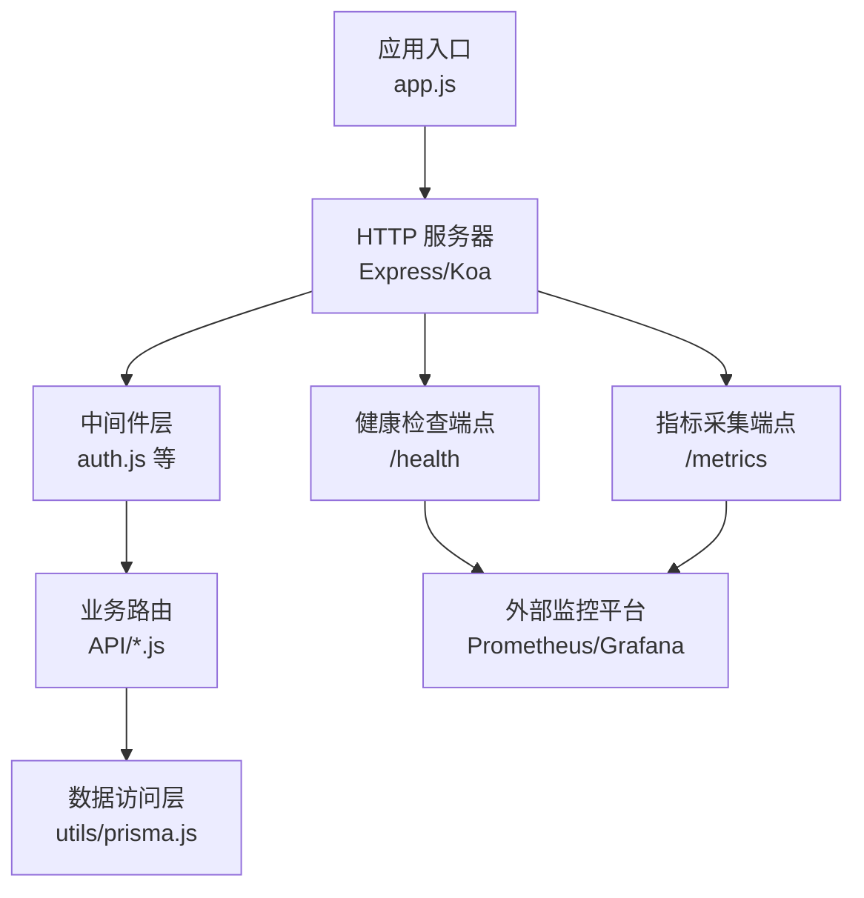
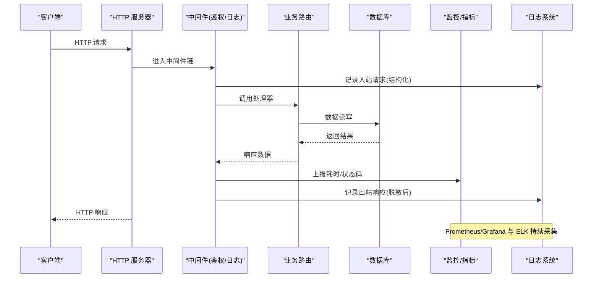
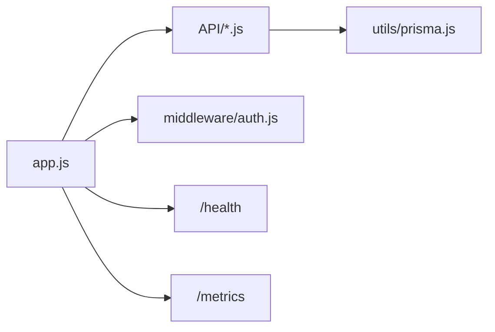

# 日志与监控

<cite>
**本文引用的文件**   
- [app.js](file://node-jinmao/app.js)
- [package.json](file://node-jinmao/package.json)
- [auth.js](file://node-jinmao/middleware/auth.js)
- [index.js](file://node-jinmao/API/auth.js)
- [stats.js](file://node-jinmao/API/stats.js)
- [prisma.js](file://node-jinmao/utils/prisma.js)
</cite>

## 目录
1. [简介](#简介)
2. [项目结构](#项目结构)
3. [核心组件](#核心组件)
4. [架构总览](#架构总览)
5. [详细组件分析](#详细组件分析)
6. [依赖关系分析](#依赖关系分析)
7. [性能考虑](#性能考虑)
8. [故障排查指南](#故障排查指南)
9. [结论](#结论)
10. [附录](#附录)

## 简介
本文件面向“日志与监控系统”的落地实现，覆盖以下目标：
- 日志级别定义、结构化日志格式、日志文件管理（含轮转策略）
- 性能监控指标收集、请求耗时统计、错误率监控
- 日志聚合与分析、告警规则配置、健康检查接口
- 集成示例：如何接入日志库、配置监控工具、搭建可视化仪表板
- 安全与合规：敏感信息脱敏
- 性能影响评估与优化建议

说明：当前仓库未包含专门的日志/监控模块代码。本节提供基于现有后端结构的通用实施方案与最佳实践，便于在后续迭代中逐步落地。

## 项目结构
后端服务位于 node-jinmao 目录，入口为 app.js，API 路由集中在 API 目录，中间件在 middleware 目录，数据库连接在 utils/prisma.js。日志与监控能力应围绕这些核心文件进行扩展。

图表来源
- [app.js:1-200](file://node-jinmao/app.js#L1-L200)
- [auth.js:1-200](file://node-jinmao/middleware/auth.js#L1-L200)
- [index.js:1-200](file://node-jinmao/API/auth.js#L1-L200)
- [stats.js:1-200](file://node-jinmao/API/stats.js#L1-L200)
- [prisma.js:1-200](file://node-jinmao/utils/prisma.js#L1-L200)

章节来源
- [app.js:1-200](file://node-jinmao/app.js#L1-L200)
- [package.json:1-200](file://node-jinmao/package.json#L1-L200)

## 核心组件
- 日志子系统
  - 日志级别：trace、debug、info、warn、error、fatal
  - 结构化字段：timestamp、level、service、env、traceId、spanId、method、path、status、duration_ms、msg
  - 输出目标：stdout（容器化）、文件（本地调试），支持按级别与大小轮转
- 监控子系统
  - 指标类型：计数器（requests_total、errors_total）、直方图（http_request_duration_seconds）、Gauge（内存/CPU/DB连接数）
  - 暴露端点：/metrics（Prometheus 抓取）
  - 健康检查：/health（存活/就绪探针）
- 聚合与分析
  - 日志采集：Filebeat/Fluent Bit -> Elasticsearch/OpenSearch
  - 可视化：Kibana/Grafana
- 告警
  - 阈值：错误率、延迟P95/P99、资源使用率、下游依赖异常
  - 通知渠道：邮件、企业微信、钉钉、Slack

章节来源
- [package.json:1-200](file://node-jinmao/package.json#L1-L200)

## 架构总览
下图展示从请求进入到指标采集与健康检查的整体流程。

图表来源
- [app.js:1-200](file://node-jinmao/app.js#L1-L200)
- [auth.js:1-200](file://node-jinmao/middleware/auth.js#L1-L200)
- [index.js:1-200](file://node-jinmao/API/auth.js#L1-L200)
- [stats.js:1-200](file://node-jinmao/API/stats.js#L1-L200)
- [prisma.js:1-200](file://node-jinmao/utils/prisma.js#L1-L200)

## 详细组件分析

### 日志子系统
- 级别定义
  - trace：极细粒度追踪，默认关闭
  - debug：开发调试信息
  - info：关键业务流程事件
  - warn：潜在问题或降级行为
  - error：可恢复错误，需关注
  - fatal：不可恢复错误，进程退出
- 结构化格式
  - 统一JSON行，包含时间戳、级别、服务名、环境、链路ID、方法、路径、状态码、耗时(ms)、消息
  - 关键字段必须存在，便于查询与聚合
- 输出与轮转
  - stdout：容器化部署时由日志采集器统一收集
  - 文件：按天/大小轮转，保留N天，压缩归档
- 敏感信息脱敏
  - 自动过滤/掩码：密码、token、手机号、身份证、银行卡号等
  - 白名单机制：允许特定字段不过滤
- 集成示例（概念性）
  - 选择成熟日志库（如 pino/winston），初始化实例并注入到中间件
  - 在请求进入/离开时记录结构化日志
  - 将traceId贯穿全链路

章节来源
- [package.json:1-200](file://node-jinmao/package.json#L1-L200)

### 监控子系统
- 指标设计
  - http_requests_total：按method、path、status分组计数
  - http_request_duration_seconds：直方图，分位值P50/P90/P95/P99
  - errors_total：按错误类别分组
  - db_connections_in_use：数据库连接池使用量
  - process_memory_rss、process_cpu_seconds_total：进程资源
- 暴露端点
  - /metrics：供Prometheus抓取
  - /health：存活/就绪探针，返回服务状态与依赖健康度
- 采集与可视化
  - Prometheus + Grafana：指标采集与仪表盘
  - Alertmanager：告警规则与通知

章节来源
- [stats.js:1-200](file://node-jinmao/API/stats.js#L1-L200)

### 健康检查接口
- 存活探针（liveness）
  - 仅检查进程是否存活，快速失败
- 就绪探针（readiness）
  - 检查依赖（数据库、缓存、第三方API）是否可用
- 返回内容
  - HTTP 200 表示健康；非200表示不健康
  - 可选附加字段：版本、依赖状态、启动时间

章节来源
- [app.js:1-200](file://node-jinmao/app.js#L1-L200)

### 请求耗时统计与错误率监控
- 耗时统计
  - 在中间件层记录请求开始/结束时间，计算duration_ms
  - 按路由维度聚合，识别慢接口
- 错误率监控
  - 统计5xx比例与绝对数量
  - 结合业务错误码分类，定位根因

章节来源
- [auth.js:1-200](file://node-jinmao/middleware/auth.js#L1-L200)
- [index.js:1-200](file://node-jinmao/API/auth.js#L1-L200)

### 日志聚合分析与告警规则
- 聚合方案
  - Filebeat/Fluent Bit 采集stdout与文件日志
  - 写入Elasticsearch/OpenSearch，建立索引模板
- 分析场景
  - 错误热点、慢查询、用户行为分析、审计追踪
- 告警规则（示例）
  - 错误率 > 5%（5分钟窗口）
  - P95 延迟 > 500ms（10分钟窗口）
  - 数据库连接池耗尽
  - 第三方API超时率 > 10%

章节来源
- [package.json:1-200](file://node-jinmao/package.json#L1-L200)

### 敏感信息脱敏与合规
- 脱敏策略
  - 正则匹配常见敏感模式，替换为*或哈希
  - 对对象递归处理，避免遗漏嵌套字段
- 合规要求
  - 最小化原则：只记录必要字段
  - 留存期限：按法规设定保留周期
  - 访问控制：日志权限隔离

章节来源
- [package.json:1-200](file://node-jinmao/package.json#L1-L200)

### 性能影响评估
- 日志开销
  - 异步写入、批量落盘、采样策略（高吞吐下降低频率）
- 指标开销
  - 直方图桶数控制，避免过多分桶
  - 指标标签基数控制，防止爆炸
- 数据库开销
  - 连接池上限、超时、重试退避
- 建议
  - 生产默认关闭trace/debug
  - 关键路径开启采样
  - 定期审查指标标签与日志字段

章节来源
- [prisma.js:1-200](file://node-jinmao/utils/prisma.js#L1-L200)

## 依赖关系分析
- 入口与路由
  - app.js 负责初始化HTTP服务与挂载路由
  - API 目录下的各模块提供具体业务接口
- 中间件
  - auth.js 提供鉴权逻辑，可扩展为日志/监控中间件
- 数据访问
  - prisma.js 封装数据库连接与查询

图表来源
- [app.js:1-200](file://node-jinmao/app.js#L1-L200)
- [index.js:1-200](file://node-jinmao/API/auth.js#L1-L200)
- [auth.js:1-200](file://node-jinmao/middleware/auth.js#L1-L200)
- [prisma.js:1-200](file://node-jinmao/utils/prisma.js#L1-L200)

章节来源
- [app.js:1-200](file://node-jinmao/app.js#L1-L200)
- [package.json:1-200](file://node-jinmao/package.json#L1-L200)

## 性能考虑
- 日志
  - 使用异步IO与缓冲队列，避免阻塞主线程
  - 合理设置采样率与最大行数
- 指标
  - 控制标签基数，避免高基数字段（如用户ID）作为标签
  - 使用增量上报与合并
- 数据库
  - 连接池大小与超时参数调优
  - 慢查询监控与索引优化
- 存储
  - 日志轮转与压缩，减少磁盘占用
  - 冷热分层存储

[本节为通用指导，无需引用具体文件]

## 故障排查指南
- 常见问题
  - 日志缺失：检查stdout重定向与采集器配置
  - 指标丢失：确认/metrics可达且未被防火墙拦截
  - 健康检查失败：检查依赖服务连通性与超时配置
- 诊断步骤
  - 查看最近错误日志与堆栈
  - 对比P95/P99延迟趋势
  - 检查数据库连接池与慢查询
  - 验证第三方API可用性
- 回滚与恢复
  - 灰度发布与快速回滚
  - 临时降级功能与熔断

章节来源
- [auth.js:1-200](file://node-jinmao/middleware/auth.js#L1-L200)
- [index.js:1-200](file://node-jinmao/API/auth.js#L1-L200)
- [prisma.js:1-200](file://node-jinmao/utils/prisma.js#L1-L200)

## 结论
通过引入结构化日志、统一指标与健康检查，可在现有后端基础上构建完善的日志与监控体系。建议在下一迭代中优先落地：
- 中间件级日志与耗时统计
- /metrics 与 /health 端点
- 日志采集与基础仪表盘
- 关键告警规则

[本节为总结，无需引用具体文件]

## 附录
- 实施清单
  - 选择日志库并初始化
  - 编写请求/响应结构化日志
  - 实现 /metrics 与 /health
  - 配置日志轮转与脱敏
  - 部署采集器与可视化
  - 制定告警规则与通知
- 参考规范
  - OpenTelemetry 语义约定
  - Prometheus 指标命名规范
  - JSON Lines 日志格式

[本节为补充信息，无需引用具体文件]